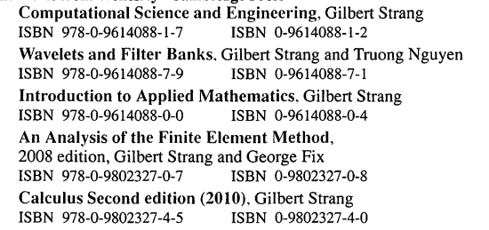
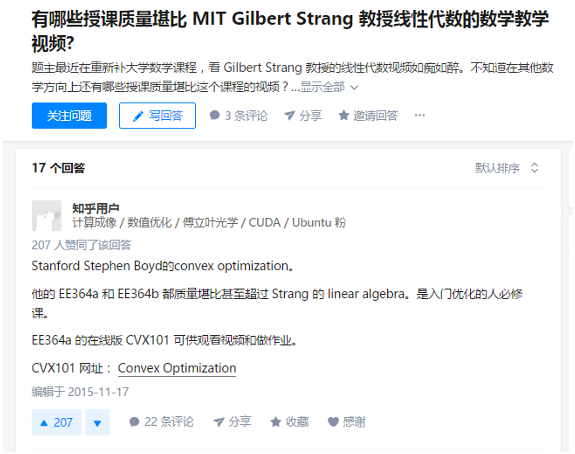
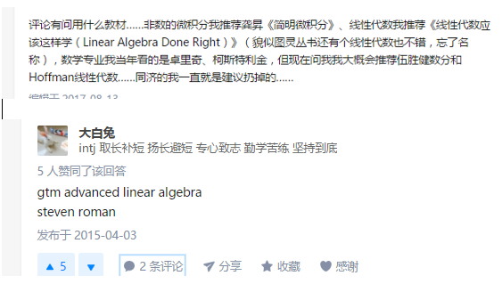
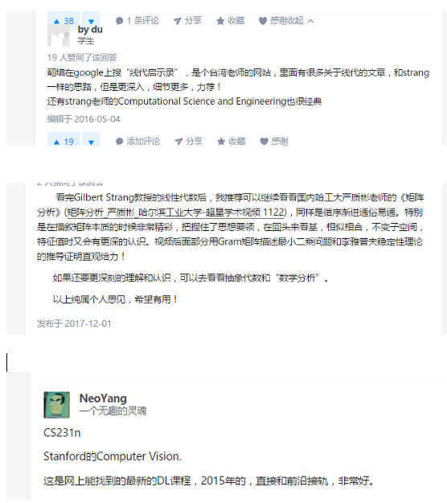

# 说明

目前都是以MIT线性代数第四版为准,也包括视频笔记，后面其他笔记再结合起来

MIT Introduction to LA是第四版,Gilbert Strang

- **ocw.mit.edu** 公开课官网
- **web.mit.edu/18.06** 有作业和考试资源等等
- **math.mit.edu/linearalgebra** 第四版的专门网址.

新的网站是  **math.mit.edullinearalgebra** 提供了以后学习的路线.

全部做完之后参考以下github

- https://github.com/apachecn/mit-18.06-linalg-notes
- https://github.com/zlotus/notes-linear-algebra

强烈建议学习一下教授的另外一本书！Computational Science and Engineering，https://book.douban.com/subject/3011192/，也有视频课程，在http://videolectures.net/mit18085f07_computational_science_engineering/

还有另外一本书，也是教授的 : Linear and it's applications

书本的前言也有关于Gilbert教授的书籍：

这个网站很不错啊! http://www.math.wisc.edu/~roch/mmids/

# 关于习题

习题全部组织在 `EX-*` 部分，注意，已经排除掉不必要的习题，以后慢慢组织！

# 学习资料

## 下一步的书籍

Springer:vector calculus

> 现在流行用Exterior Caculus, 所以个人觉得Matthews这本书有点过时了。 想学Vector Calculus的话，推荐《Vector Calculus, Linear Algebra, and Differential Forms》，网上有第一版的电子版。虽然出到了第五版，但貌似vector caculus 和differential forms的部分没有什么改动。所以个人觉得用第一版学习vector caculus足以。

## 网上介绍

