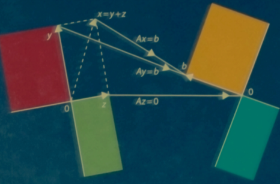
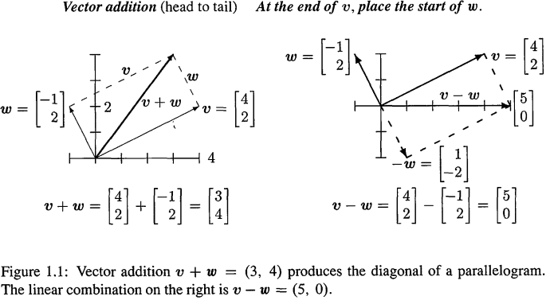
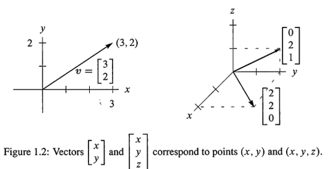
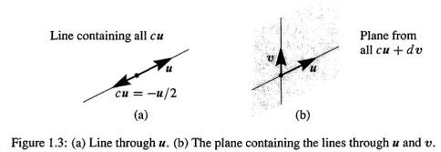
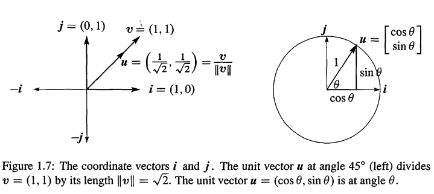
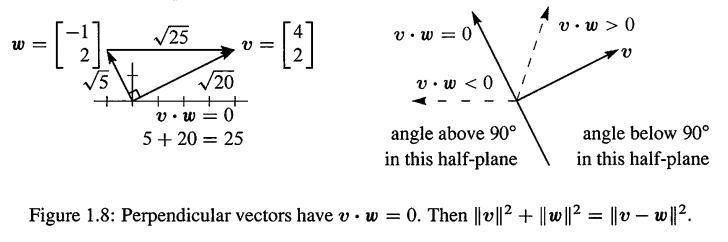
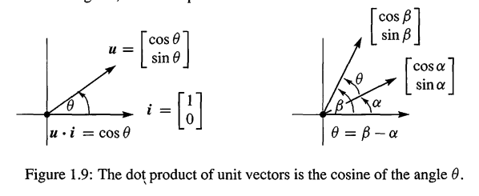
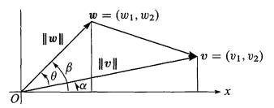
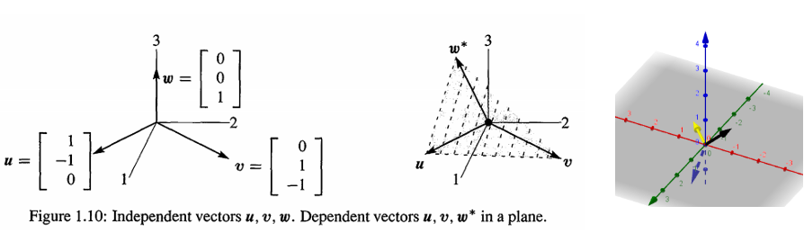

# 1. 前言

上图是MIT线代的封面,展示的是四大子空间(**four fundamental Subspaces)**:

- 行空间和零空间在左边
- 列空间和$A^T$的零空间在右边

把本书主题的中心思想展示成这样的图片是很少见的!

这四个子空间,从矩阵A开始.A的每一行是一个n维空间的向量.当一个矩阵有m行时,每一列是一个m维空间的向量.线性代数至关重要的操作是向量的线性组合(**linear combination of vectors**).我们取所有列向量的线性组合,得到列空间.如果这个空间包含向量b,那么我们可以解决等式 $Ax = b$

等式Ax = b使用了线性代数的语言.向量Ax是A的列的一个组合(combination of the columns of A).这个等式要求一个可以产生b的组合(**a combination that produces b**).解向量(solution vector) x存在了三个层次,都很重要:

1. **Direct  solution** ： 用向前消去(forward elimination)和向后替换(back substitution)求解x.

2. **Matrix solution** ：使用矩阵A的逆:$x= A^{-1}b$,如果A有逆的话

3. **Vector  space solution**： 特解(Particular solution):$Ay  =  b$  加上零空间解(nullspace solution)$ Az  =  0$

很多超级计算机都有测试Ax = b的速度.这是纯粹的线性代数.IBM在2008年的速度是$10^{15}/sec$的新纪录.就算是超级计算机也不想要计算逆矩阵:太慢了.逆操作给出了最简单的公式 $x =A^{-1}b$ ,但不是最快的速度.而且,任何一个人都应该知道,行列式(determinant)甚至更慢:**任何线性代数的课程都不应该从n*n行列式的公式开始讲起.这些公式有一定重要性,但不是最重要的**

微积分主要用在于特别的操作(导数)和逆操作(积分)--我承认微积分很重要....但是很多数学是离散的而不是连续的,是数字的而不是模拟的(discrete rather than continuous,digital rather than analog).数据的时代已经来临!!!你会在我的网站找到一个文章叫做  "too many Calculus".**The truth is that vectors  and  matrices have become the language to know!**

# 2. 向量

线性代数的两个核心操作都和向量有关

- 向量加操作可以得到 $\vec{v}+\vec{w}$
- 乘以一个数可以得到$c\vec{v},c\vec{w}$

组合这些操作,可以得到的$c\vec{v}+c\vec{w}$线性组合(**linear combination**)
$$
\text{Linear combination}:c\vec{v}+c\vec{w}\\
\text{for example :} 
c 
\left[\begin{matrix} 
1  \\
1	\\
\end{matrix} \right]

+ d 
\left[\begin{matrix} 
2  \\
3	\\
\end{matrix} \right]

= 

\left[\begin{matrix} 
c+2d  \\
c+3d	\\
\end{matrix} \right]
$$
向量$c\vec{v}$ 都在一条直线上.如果$\vec{w}$不在这一条直线上,组合$c\vec{v}+c\vec{w}$形成了了整个的二维空间.我必须用二维这个词是因为线性代数允许更高维的平面.如果从四维空间的四个向量开始,$\vec{u},\vec{v},\vec{w},\vec{z}$,它们的$c\vec{u}+d\vec{v}+d\vec{w}+f\vec{z}$组合很可能会形成那个空间--但不总是.这些线和组合可以处以同一条直线上

这就是这本书要走向的方向(进入n维空间)

## 2.1. 线性组合(linear combination)

我们有两个数字$v_1,v_2$,这样一对数字产生了二维向量 $\vec{v}$:
$$
\text{column vector:}\quad v = \left[ \begin{array} { c } { v _ { 1 } } \\ { v _ { 2 } } \end{array} \right] \quad \begin{array} { l } { v _ { 1 } = \text { first component } } \\ { v _ { 2 } = \text { second component } } \end{array}
$$
向量加法如下,分量+分量
$$
\begin{array} { l } { \text { VECTOR } } \\ { \text { ADDITION } } \end{array} \quad v = \left[ \begin{array} { c } { v _ { 1 } } \\ { v _ { 2 } } \end{array} \right] \text { and } w = \left[ \begin{array} { c } { w _ { 1 } } \\ { w _ { 2 } } \end{array} \right] \quad \text { add to } \quad v + w = \left[ \begin{array} { c } { v _ { 1 } + w _ { 1 } } \\ { v _ { 2 } + w _ { 2 } } \end{array} \right]
$$
减法类似.

另外一个基础操作是数乘(scalar multiplication)
$$
\begin{array} { l l } { \text { SCALAR Multiplication:} } & { 2 v = \left[ \begin{array} { c } { 2 v _ { 1 } } \\ { 2 v _ { 2 } } \end{array} \right] \text { and } - v = \left[ \begin{array} { c } { - v _ { 1 } } \\ { - v _ { 2 } } \end{array} \right] } \end{array}
$$
$\vec{v}$ 和$-\vec{v}$ 相加得到的结果是$\vec{0}$(不是数字`0`).$\vec{0}$向量的分量是0和0.线性代数就是在 $\vec{v}+\vec{w},c\vec{v}$ 这些**向量加法和数乘下构建起来的**

> **Definition:Linear combination of $\vec{v}$ and $\vec{w}$**
>
> ---
>
> $c\vec{v}$ 和 $d\vec{w}$  的和(sum),是   $\vec{v}$  和 $\vec{w}$ 的**线性组合**
> 

四个特别的线性组合是：和，差，0乘和数乘(sum,difference,zero and scalar multiple of c$\vec{v}$)
$$
\begin{aligned}

1 \vec{v} + 1 \vec{w} & = \text { sum of vectors in Fig } 1.1 \mathrm { a } \\ 
1 \vec{v} - 1 \vec{w} & = \text { difference of vectors in Fig } 1.1 \mathrm {b} \\ 
0 \vec{v} + 0 \vec{w} & = \text { zero vector } \\ 
c \vec{v} + 0 \vec{w} & = \text { vector } c \vec{v} \text { in the direction of } \vec{v} 

\end{aligned}
$$
零向量总是一个可能的组合,只要系数是`0`即可.任何我们看到一个向量空间(space of vector),零向量也是包括在内的.

## 2.2. 三维下的向量 

> Vectors In Three dimension

从现在开始,我们写向量的时候,有下面约定 
$$
\vec { v } = \left[ \begin{array} { c } { 1 } \\ { 1 } \\ { - 1 } \end{array} \right] \text { 也写成  }   \vec { v } = ( 1,1 , - 1 )
$$
主要原因是为了节省空间,注意$\vec{v} = (1,1,-1)$实际上还是一个**列向量**,只是为了表示方便.行向量是列向量的转置.三维向量的线性组合和二维是一样的,只是多了一个坐标而已

## 2.3. 一个重要的问题

对于一个向量$\vec{u}$,唯一的线性组合是 $c\vec{u}$.两个向量,组合有 $c\vec{u}+d\vec{v}$.三个向量是: $ c\vec{u}+d\vec{v} + e\vec{w} $;c,d,e可以是任何值.假设 $\vec{u},\vec{v},\vec{w}$ 是三维空间向量.那么

1. $c\vec{u}$ 所有组合的图像是什么?
2. $c\vec{u}  +  d\vec{v}$  所有组合的图像是什么?
3. $c\vec{u}  +  d\vec{v}  +  e\vec{w}$ 所有组合的图像是什么?

答案取决于这些 $\vec{u},\vec{v},\vec{w}$ 向量,如果它们都是零向量(极端例子),那么这些所有的组合都是零向量.如果它们不是零向量.那么下面就是答案,这是我们学习的关键:

1. $c\vec{u}$ 的组合形成一条直线(fill a **line**)
2. $c\vec{u}  +  d\vec{v}$ 形成一个平面(fill a **plane**)
3. $c\vec{u}  +  d\vec{v}  +  e\vec{w}$ 形成一个三维空间

零向量(0,0,0)是在第一种情况的直线上,因为c可以是0;它也在平面上,因为c,d可以是0.向量 $c \vec{u}$ 的线是无限长的(前进方向或者后退方向). 需要特别让你关注的是,所有 $ c\vec{u}  +  d\vec{v}$ (组合两个三维下的向量)的那个平面:

> 把一条直线上的所有 $ c\vec{u}$  加上另一条直线的所有 $d\vec{v}$,产生了如Fig1.3的平面

而当加上第三个向量 $e \vec{ w}$,$e \vec{ w}$ 给出了第三条线.假设 $e \vec{ w}$ 不在 $ \vec{ u}, \vec{ v}$ 的平面上,那么所有 $e \vec{ w}$,和所有 $c\vec{u}  +  d\vec{v}$ 的组合填充了整个三维空间

这就是典型的情况! 首先产生线(**line**),然后是平面(**plane**),然后是空间(**space**).但是其他情况也可以存在.当 $ \vec{ w}$ 刚好是 $ c\vec{u}  +  d\vec{v} $.那么 $ \vec{w}$ 就是在 $ \vec{ u}, \vec{ v}$ 组成的平面当中.那么 $ \vec{ u}, \vec{ v}, \vec{ w}$ 的组合不会跳出这个**uv**平面.我们得不到全部的三维空间$R^3$

## 2.4. 典型例题

**1.** $\vec{v}=(1,1,0)$ 和 $\vec{w} =(0,1,1)$ 的线性组合形成了一个平面,描述一下这个平面.找到一个不在 $\vec{v},\vec{w}$ 的组合当中的向量

解: $c\vec{v}+d\vec{w}$ 的组合填充了一个$R^3$的平面,这个平面允许任何的c,d,下面是组合的表达

$$
\text{combination:  }c \vec{v} + d \vec{w} = c \left[ \begin{array} { l } { 1 } \\ { 1 } \\ { 0 } \end{array} \right] + d \left[ \begin{array} { l } { 0 } \\ { 1 } \\ { 1 } \end{array} \right] = \left[ \begin{array} { c } { c } \\ { c + d } \\ { d } \end{array} \right]
\quad \text{fill a plane}
$$
`(1,2,3)`不再这个平面上,因为 $2 \ne 1+3$ . 另一个特别的向量是 $\vec{n} =(1,-1,1)$,是和这个平面垂直,$\vec{w} \cdot \vec{n} = \vec{v} \cdot \vec{n} = 0$

---

**2.** 找到未知数c,d,从而如下的 $c\vec{v}+d\vec{w} = \vec{b}$ 成立
$$
\vec{v} = \left[ \begin{array} { r } { 2 } \\ { - 1 } \end{array} \right] \quad \vec{w} = \left[ \begin{array} { r } { - 1 } \\ { 2 } \end{array} \right] \quad \vec{b} = \left[ \begin{array} { l } { 1 } \\ { 0 } \end{array} \right]
$$

解:在应用数学上,很多问题都有下面2个步骤

1. Modeling part:把问题表达成为一系列等式
2. Computational part:使用快速正确的算法求解等式

这里我们关注第一个步骤,后面我们会学习计算算法.**其实这个模型就是线代的基础模型**
$$
\text{find }c _ { 1 } , \ldots , c _ { n } \text { so that } c _ { 1 } v _ { 1 } + \cdots + c _ { n } v _ { n } = b
$$
对于

- n = 2,我们可以找到这些 $c_n$ 的公式
- 对于n>100,可以使用后面的消去法
- 对于n大于100W,只能求助于数值线性代数`<01-09>`!

现在我们开始看看怎么求解本问题n = 2的情况
$$
c\left[ \begin{array} { r } { 2 } \\ { - 1 } \end{array} \right]  + d\left[ \begin{array} { r } { - 1 } \\ { 2 } \end{array} \right] =  \left[ \begin{array} { l } { 1 } \\ { 0 } \end{array} \right]
$$
这可以拆分成2个数字等式:
$$
\begin{aligned}
2c-d = 1\\
-c+2d = 0
\end{aligned}
$$
很明显我们可以得到:$c=\frac{2}{3},d = \frac{1}{3}$

# 3. 长度和点乘,角度

> **DEFINITIION: Inner(Dot) product**
>
> ---
>
>  $\vec{v} = (v_1,v_2)$ 和 $\vec{w} = (w_1,w_2)$ 的点乘是下面的 **数字**:
> $$
> \vec{v} \cdot \vec{w} = v_1w_1 + v_2w_2 \tag{1}
> $$
> 而且  $\vec{v} \cdot \vec{w}  = \vec{w} \cdot \vec{v}$,  顺序无关紧要

经济学上,假设我们有三个商品需要销售或者购买,价格分别是$(p_1,p_2,p_3)$.形成了价格向量 $\vec{p}$.购买或者销售的数量分别是$(q_1,q_2,q_3)$.那么总的收入就是:

$$
\text{Income} = \left( q _ { 1 } , q _ { 2 } , q _ { 3 } \right) \cdot \left( p _ { 1 } , p _ { 2 } , p _ { 3 } \right) = q _ { 1 } p _ { 1 } + q _ { 2 } p _ { 2 } + q _ { 3 } p _ { 3 } = \text{dot product}
$$
如果点乘得到`0`意味着收支平衡.$\vec{p},\vec{q}$ 在三维空间下是垂直的!一个有几千种商品的超市很容易就可以形成高维空间!

点乘具有下面的性质:
$$
\begin{array} { l } 
{ \text { 1. }  { \vec{v} } \cdot  { \vec{w} } =  { \vec{w} } \cdot  { \vec{v} } } \\ 
{ \text { 2. }  { \vec{u} } \cdot ( { \vec{v} } +  { \vec{w} } ) =  { \vec{u} } \cdot  { \vec{v} } +  { \vec{u} } \cdot  { \vec{w} } } \\
{ \text { 3. } ( { c \vec{v} } ) \cdot { \vec{w} } =  { c } ( { \vec{v} } \cdot  { \vec{w} } ) } 

\end{array}
$$
这些通过点乘的定义可以直接得到,现在根据这些定义,对规则2,我们设$\vec{u} = \vec{v}+\vec{w}$,我们可以证明
$$
\begin{array} { c } 
{ \|  { \vec{v} } +  \vec{ w } \| ^ { 2 } = 
( \vec { v } + \vec { w } ) \cdot ( \vec { v } + \vec { w } ) \stackrel { \text { by rule } 2 } { \longrightarrow } = 
( \vec { v } + \vec { w } ) \cdot \vec { v } + ( \vec { v } + \vec { w } ) \cdot \vec { w } \stackrel { \text { by rule } 1 } { \longrightarrow } } \\ 

{ = \vec { v } \cdot ( \vec { v } + \vec { w } ) + \vec { w } \cdot ( \vec { v } + \vec { w } ) \stackrel { \text { by rule } 2 } { \longrightarrow } =

\vec{v} \cdot \vec{v} + \vec{w} \cdot \vec{w} + 2 \vec{v} \cdot \vec{w}

= \| \vec{v} \| ^ { 2 } + \| \vec{w} \| ^ { 2 } + 2 \vec{v} \cdot \vec{w} } \end{array}
$$

所以对于点乘,我们主要理解,**括号是可以展开的**

## 3.1. 长度,单位向量

如果向量和自己点乘,那么得到的就是长度的平方

> **Definition:Length of Vector**
>
> ---
>
> 向量  $|\vec{v}|$ 的长度是   $\vec{v} \cdot \vec{v}$ 的平方根
> $$
> Length(\vec{v}) = norm(\vec{v}) = |\vec{v}| = \sqrt{\vec{v} \cdot \vec{v}}
> $$
> 比如
> $$
> | v | ^ { 2 } = \left[ \begin{array} { l } { 1 } \\ { 2 } \\ { 3 } \end{array} \right] \cdot \left[ \begin{array} { l } { 1 } \\ { 2 } \\ { 3 } \end{array} \right] = 1 + 4 + 9 = 14
> $$
> 

根据长度的定义,我们可以引申出单位向量的定义

> **Definition:Unit Vector**
>
> ---
>
> 单位向量 $\vec{u}$ 长度为1的向量,也就是$\vec{u} \cdot \vec{u} = 1$.任何向量自身除以其长度,就是单位向量,如
>
> $$
>\vec{u} = \frac{\vec{v}}{|\vec{v}|}
> $$
> 就是一个和  $\vec{v}$ 方向一致的单位向量

---

**例1** 沿着x轴和y轴的标准单位向量是 $\vec{i},\vec{j}$.而和x轴形成角度$\theta$的单位向量是$(cos \theta,sin \theta)$
$$
\text{Unit Vector}:\quad \vec{i} = \left[ \begin{array} { l } { 1 } \\ { 0 } \end{array} \right] \text { and } \vec{j} = \left[ \begin{array} { l } { 0 } \\ { 1 } \end{array} \right] \text { and } \vec{u} = \left[ \begin{array} { c } { \cos \theta } \\ { \sin \theta } \end{array} \right]
$$

当 $\theta = 0$,那么 $ \vec{ u}$ 就是 $\vec{i}$,$\theta = \frac{\pi}{2}$,那么 $ \vec{ u}$ 就是 $\vec{j}$.如Fig1.7.其他任何角度的 $\theta$,都有 $\vec{u} \cdot  \vec{ u} = \cos^\theta +\sin^2 \theta = 1$.

## 3.2. 向量夹角

我们说过,点乘结果是0意味着垂直,比如
$$
\text{Dot Product is 0} \rightarrow \text{Perpendicular vector}:\quad
\left[ \begin{array} { l } { 4 } \\ { 2 } \end{array} \right] \cdot \left[ \begin{array} { r } { - 1 } \\ { 2 } \end{array} \right] = - 4 + 4 = 0
$$
为了解释,我们需要把角度和点乘关联起来,然后我们也会知道,$\vec{v} \cdot \vec{w}$ 可以求得向量之间的夹角

> **Right Angles**
>
> ---
>
> 当 $\vec{v}$ 和 $\vec{w}$ 垂直,那么它们之间的点乘是:  $\vec{v} \cdot \vec{w} = 0$		
>

**证明** 如果 $\vec{v}, \vec{ w}$ 是垂直的,那么形成了三角形的两条直角边.第三条斜边是$ \vec{ v}- \vec{ w}$.,如Fig1.8.由毕达哥斯拉定理我们知道
$$
|  \vec{v} |  ^ { 2 } +  | \vec{w}  | ^ { 2 } = | \vec{v} - \vec{w} |  ^ { 2 } \tag{2}
$$
把上面的等式写成向量的长度,可以得到
$$
\left( v _ { 1 } ^ { 2 } + v _ { 2 } ^ { 2 } \right) + \left( w _ { 1 } ^ { 2 } + w _ { 2 } ^ { 2 } \right) = \left( v _ { 1 } - w _ { 1 } \right) ^ { 2 } + \left( v _ { 2 } - w _ { 2 } \right) ^ { 2 } \tag{3}
$$
化简后得到
$$
0 = - 2 \mathrm { v } _ { 1 } \mathrm { w } _ { 1 } - 2 \mathrm { v } _ { 2 } \mathrm { w } _ { 2 } \rightarrow v _ { 1 } w _ { 1 } + v _ { 2 } w _ { 2 } = 0 \tag{4}
$$
需要注意,因为**0**向量和任何的向量点乘都是0,**所以0向量和任何向量垂直**.

假设 $\vec{v} \cdot \vec{w}$ 不为`0`,那么可以是正值的,也可以是负值的.$\vec{v} \cdot \vec{w}$ 的符号可以直接告诉我们它们之间的角度是大于还是小于$90^\circ$.$\vec{v} \cdot \vec{w}$ 是正值,那么小于90度,是负值,大于90度.是以$\vec{v} \cdot \vec{w}$为分界线

点乘可以直接揭示向量之间的夹角 $\theta$.但是对于线性代数来说不重要!停下.一旦我们有了矩阵,我们不会再回到这个角度.但是现在主题是角度,知道一下也没关系

从单位向量$\vec{u},\vec{U}$ 开始,$\vec{u} \cdot \vec{U}$ 的正负号可以告诉我们夹角是是大于90度还是小于90度.而且因为是单位向量,所以点乘肯定是在`[-1,1]`之间的,更进一步,**单位向量的点乘在是其夹角 $\theta$的cosine值**,而且**不管向量的维度是多少都成立**:(sp:这里可以参考 `<calculus/01-12>`)

> 夹角为 $\theta$ 的单位向量有 $\vec{u} \cdot \vec{U} = \cos \theta$,  明显 $| \vec{u} \cdot \vec{U}| \le  1$

Fig1.9展示的是 $ \vec{ i} =(1,0), \vec{ u}=(\cos \theta,\sin\theta)$ 这两个向量,它们之间的点乘就是$\cos \theta$.

它们2个经过旋转角度α,还是单位向量.$\vec{i}$ 变成$(\cos \alpha,\sin \alpha)$.$\vec{u}$ 变成 $(\cos \beta,\sin \beta)$.并且$β = \alpha + \theta$.那么点乘 $\cos \alpha  \cos \beta + \sin \alpha \sin \beta$ 其实就是$cos(\beta  - \alpha)$.而且$\beta - \alpha $就是角度$\theta$,所以点乘的值就是$\cos\theta$,也就是说,2个单位向量的点乘就是它们夹角$\theta$的cos值. 习题7直接证明 $\vec{u} \cdot \vec{U} \le 1$,没有涉及到角度

对于 $ \vec{v}, \vec{ w}$ 不是单位向量的时候的处理方法,那么我们转换为单位向量就行啦

> **Cosine Formula**
>
> ---
>
> 如果 $\vec{v}$  和 $\vec{w}$  不是零向量,那么:
> $$
> \frac { \vec{v} \cdot \vec{w} } { | \vec{ v} |  \times | \vec{w}  | } = \cos \theta
> $$
> 

如果 $ \vec{v}, \vec{ w}$ 不是单位向量

那么我们知道:
$$
\begin{aligned} \cos \alpha & = \frac { v _ { 1 } } { | v | } , \sin \alpha = \frac { v _ { 2 } } { | v | } \\ 
\cos \beta & = \frac { w _ { 1 } } { | w | } , \sin \beta = \frac { w _ { 2 } } { | w | } \end{aligned}
$$
那么
$$
\cos \theta = \cos ( \beta - \alpha ) = \cos \alpha \cos \beta + \sin \alpha \sin \beta = \frac { v _ { 1 } } { | \vec{v} | } * \frac { w _ { 1 } } { | \vec{w} | } + \frac { v _ { 2 } } { | \vec{v} | } * \frac { w _ { 2 } } { | \vec{w} | } = \frac { \vec{v} \cdot \vec{w} } { | \vec { v } | * | \vec { w } | }
$$

根据这个公式,而且 $|cos \theta|$ 从来不超过1,可以得到下面的不等式(可能是数学中最重要的不等式)
$$
\large
\begin{aligned}
\text{柯西不等式 Schwarz Inequality :  } & | \vec{v} \cdot \vec{w} | \leq | \vec{v} | * | \vec{w} | \\
\text{Triangle Ineqaulity,2边之和大于第三边: } & | \vec{v} + \vec{w} | \leq | \vec{v} | + | \vec{w} |
\end{aligned}
$$

我们还可以看看余弦定理,展开方法是上面总结的点乘性质.**Cosine Law(余弦定理)**可以从下面的公式得到
$$
\begin{aligned} {

( \ { v } - \ { w } ) \cdot ( \ { v } - \ { w } ) = \ { v } \cdot \ { v } + \ { w } \cdot \ { w } - 2 \ { v } \cdot \ { w } } \\ 

\overset{\text{by cosine formula}}{\Longrightarrow}

{  \|\ { v } - \ { w } \| ^ { 2 } = \| \ { v } \| ^ { 2 } + \| \ { w } \| ^ { 2 } - 2 \| \ { v } \| \| \ { w } \| \cos \theta 
} \end{aligned}
$$

那么如果$\theta < 90^{\circ},cos \theta > 0$,也就是说$||v||^2 + ||w||^2 > ||v - w||^2$,也就是$v \cdot v + w \cdot w >(v- w) \cdot (v - w)$,2边之和大于第三边

---

**例2** $ \vec{ v} = (a,b), \vec{ w} = (b,a)$ 的点乘是2ab.长度都是$\sqrt{a^2 + b^2}$.那么根据柯西不等式:$2ab \le a^2 + b^2$

如果把 $a^2$ 写成 x ,$b^2$ 写成 y.你会发现很熟悉,变成了 "几何平均数(geometric mean)"小于 "算数平均数(arithmetic mean])".
$$
\text{Geometric mean} \leq \text { Arithmetic mean } \\ 
\Rightarrow ab \leq \frac { a ^ { 2 } + b ^ { 2 } } { 2 } \\
\Rightarrow \sqrt { x y } \leq \frac { x + y } { 2 }
$$

## 3.3. 典型例题

**1.** 对于 $ \vec{ v} = (3,4), \vec{ w} = (4,3)$,测试柯西不等式和三角不等式. 什么情况下,$|\vec{v}\cdot  \vec{ w}| = | \vec{ v}| * | \vec{ w}|,  | \vec{ v}+ \vec{ w}| = | \vec{ v}| + | \vec{ w}$|?

解:
$$
\begin{aligned}  

\text{柯西不等式 } \quad & |\vec{v} \cdot \vec{w} | \leq |\vec{v} | | \vec{ w} | \quad \text { is } \quad 24 < 25 \\ 

\text{三角不等式} \quad & | \vec{ v } + \vec{ w } | \leq \| \vec{ v } | + | \vec{ w } | \quad \text { is } \quad 7 \sqrt { 2 } < 5 + 5 \\ 

\text{Csoine of angle} \quad & \cos \theta = \frac { 24 } { 25 } \quad \text { 是从 } \vec{v} = ( 3,4 ) \text { 到 } \vec{ w } = ( 4,3 ) \text{的角度}

\end{aligned}
$$
假设一个向量是另一个向量的数乘,也就是夹角是0或者180度: $ \vec{w}= c \vec{ v}$ ,那么 $|\cos\theta| = 1$,那么
$$
| \vec{v} \cdot \vec{w} | =  | \vec{v}| * | \vec{w} | |\cos \theta|  = | \vec{v}|  * | w|
$$
当角度是0度的时候,有:
$$
|\vec{v}+\vec{w}| = |\vec{v}| + |\vec{w}|
$$

---

**2.** 设 $\vec{r} = (2,1),\vec{s} = (-1,2)$,求一个向量 $\vec{x} = (c,d)$,满足 $ \vec{x} \cdot  \vec{r} = 1, \vec{ x}\cdot  \vec{ s} = 0$.请注意这个问题和`<#2 向量 典型例题2>` 求解 $ c\vec{v}+d\vec{w} = \vec{b} = (1,0)$  的联系

解: 2个点乘,其实给出了关于c,d的2线性方程
$$
\begin{array} { l l } 

\vec{x} \cdot \vec{r} = 1 & 2 c - d = 1 \\ 
\vec{x} \cdot \vec{s} = 0 & - c + 2 d = 0 

\end{array}

\quad \color{orange} \text{Same As <#2 向量 典型例题2>}
$$

第二个等式表示和 $\vec{ s}= (-1,2)$ 垂直,所以才几何上看:以 $ \vec{ s}$ 垂直的方向 (2,1) 出发,当走到 $\frac{1}{3} (2,1)$,就有 $ \vec{x} \cdot  \vec{r} = 1$

# 4. 矩阵

这一节是基于两个精心选择的例子.都是三个向量,**并使用矩阵来对它们进行组合**,

**第一个例子:**

3个列向量是
$$
u = \left[ \begin{array} { c } 1 \\ - 1 \\ 0 \end{array} \right] , v = \left[ \begin{array} { c } 0 \\ 1 \\ - 1 \end{array} \right] , w = \left[ \begin{array} { l } 0 \\ 0 \\ 1 \end{array} \right]
$$
它们在三维空间的线性组合数 $ c\vec{u}+d\vec{v} + e\vec{w} $	
$$
c \left[ \begin{array} { c }  1 \\ - 1 \\ 0 \end{array} \right] + 

\mathrm { d } \left[ \begin{array} { c } 0 \\ 1 \\ - 1 \end{array} \right] +

\mathrm { e } \left[ \begin{array} { c } 0 \\ 0 \\ 1 \end{array} \right] 

= \left[ \begin{array} { c } \mathrm { c } \\ d - c \\ e - d \end{array} \right]

\tag{1}
$$
重要的是:**使用矩阵重写这些组合**,向量u,v,w变成矩阵A的列:

$$
\text{同样的线性组合,现在是 A * x:} \quad

\left[ \begin{array} { c c c } 1 & 0 & 0 \\ - 1 & 1 & 0 \\ 0 & - 1 & 1 \end{array} \right] \left[ \begin{array} { l } c \\ d \\ e \end{array} \right] = \left[ \begin{array} { c } \mathrm { c } \\ d - c \\ e - d \end{array} \right] \tag{2}
$$
c,d,e现在是向量x的分量,$ c\vec{u}+d\vec{v} + e\vec{w} $ 其实和 A 乘以 x 效果一样:
$$
\left[ \begin{array} { l l l } \mid & \mid & \mid \\ u & v & w \\ \mid & \mid & \mid \end{array} \right] \left[ \begin{array} { l } \mathrm { c } \\ d \\ e \end{array} \right] = \mathrm { c\vec{u} } + \mathrm { d } \vec { \mathrm { v } } + \mathrm { e } \vec { \mathrm { w } } \tag{3}
$$
这不仅仅是Ax的定义,因为这样的重写带来了一个**视角上根本性的变化**.一开始,数c,d,e本来是乘以这些向量的.现在,矩阵乘以这些数.**矩阵A作用在向量x上**.得到的结果Ax是一个**A的列的组合,也就是b**

为了看到这个作用,可用 $x_1,x_2,x_3$ 来替代c,d,e.用 $b_1,b_2,b_3$ 来代替Ax的分量.得到
$$
A x = \left[ \begin{array} { c c c } 1 & 0 & 0 \\ - 1 & 1 & 0 \\ 0 & - 1 & 1 \end{array} \right] \left[ \begin{array} { l } x _ { 1 } \\ x _ { 2 } \\ x _ { 3 } \end{array} \right] = \left[ \begin{array} { c } x _ { 1 } \\ x _ { 2 } - x _ { 1 } \\ x _ { 3 } - x _ { 2 } \end{array} \right] = \left[ \begin{array} { l } b _ { 1 } \\ b _ { 2 } \\ b _ { 3 } \end{array} \right] = \vec { b } 

\tag{4}
$$
输入是`x`,输出是 `b= Ax`.A是一个差分矩阵(difference matrix),因为b包含了输入向量x的差值(b contains differences of the input vector x).最顶上的差值(difference)就是 $x_1  − x_0= x_1  −0$ (sp:这里为什么会出现 $x_0$,看下面微积分的解释)

下面例子展示这些数字的差值(x是平方值,b成了奇数)
$$
\mathrm { x } = \left[ \begin{array} { l } 1 \\ 4 \\ 9 \end{array} \right] = \text { squares, } \quad A x = \left[ \begin{array} { l } 1 - 0 \\ 4 - 1 \\ 9 - 4 \end{array} \right] = \left[ \begin{array} { l } 1 \\ 3 \\ 5 \end{array} \right] = \vec { b }
\tag{5}
$$
这个模式对于4 by 4差分矩阵也是如此.下一个平方值是 $x_4=16$,那么下一个差分值是 $x_4   − x_3=16 −9=7$.(这也就是下一个奇数值).矩阵一次找到了所有的差分值(The matrix finds all the differences at once)

> **重要提示:**
>
> 你可能已经学习过了Ax的乘法(矩阵乘以向量)的意义是: 常规的让每一个行和x取点乘:
> $$
> \begin{array} { l } 
> 
> \text { Dot products } \\ \text { with rows } \end{array} 
> 
> \quad A x = 
> 
> \left[ \begin{array} { r r r } 1 & 0 & 0 \\ - 1 & 1 & 0 \\ 0 & - 1 & 1 \end{array} \right] 
> \left[ \begin{array} { l } x _ { 1 } \\ x _ { 2 } \\ x _ { 3 } \end{array} \right] = 
> 
> \left[ \begin{array} { l } ( 1,0,0 ) \cdot \left( x _ { 1 } , x _ { 2 } , x _ { 3 } \right) \\ ( - 1,1,0 ) \cdot \left( x _ { 1 } , x _ { 2 } , x _ { 3 } \right) \\ ( 0 , - 1,1 ) \cdot \left( x _ { 1 } , x _ { 2 } , x _ { 3 } \right) \end{array} \right]
> $$
>
> 点乘结果和`Eq(4)`是一样的.新的方法是使用列来处理Ax,线性组合是线性代数的关键,而且输出Ax是**A的列的线性组合**

## 4.1. 线性方程

> Linear Equation

另外还有一个视角上的改变是很重要的.到目前为止,$x_1,x_2,x_3$ 是已知的(一开始的c,d,e).右手边的b是未知的:我们通过A*x来找到了差分向量b.现在,**我们假设b是已知的,想要找到x**:

> - 旧问题: 计算线性组合 $x_1 \vec{u} +x_2 \vec{v}+ x_3 \vec{w}$  来找到 $\vec{b}$
> - 新问题:$\vec{u}, \vec{v},\vec{w}$ 的什么线性组合可以产生一个特定的 $\vec{b}$?

这是一个反过来的问题:给定 b ,求 $b =Ax$ 所需要的输入 `x`. 我们在第一个例子已经见过了,是一个关于 $x_1,x_2,x_3$ 的**线性方程组**.方程组右手边的是 $b_1,b_2,b_3$,我们可以求解这个系统来找到 $x_1,x_2,x_3$
$$
Ax=b: \quad

\begin{aligned}
x_1 &= b_1 \\
-x_1 + x_2 &= b_2\\
-x_2+x_3 &= b_3
\end{aligned}

\quad \text{Solution:} \quad:

\begin{aligned} x _ { 1 } & = b _ { 1 } \\ x _ { 2 } & = b _ { 1 } + b _ { 2 } \\ x _ { 3 } & = b _ { 1 } + b _ { 2 } + b _ { 3 } \end{aligned}

\tag{6}
$$
首先我们必须承认: 大部分的线性系统比较难求解.在这个系统当中,第一个方程可以得到 $x_1= b_1$,然后是 $x_2= b_1+b_2$.这些方程可以从上到下的求解,是因为矩阵A被选择为是**下三角(low triangular)**

看看特别的 $b_1,b_2,b_3$
$$
b = \left[ \begin{array} { l } 0 \\ 0 \\ 0 \end{array} \right] \text { gives } x = \left[ \begin{array} { l } 0 \\ 0 \\ 0 \end{array} \right] \quad b = \left[ \begin{array} { l } 1 \\ 3 \\ 5 \end{array} \right] \text { gives } x = \left[ \begin{array} { l } 1 \\ 1 + 3 \\ 1 + 3 + 5 \end{array} \right] = \left[ \begin{array} { l } 1 \\ 4 \\ 9 \end{array} \right]
$$
第一个都是0的解比看起来更重要.换句话说:如果输出b=0,那么输入x必须是0.对于这个A是正确的,其他矩阵不一定是. 从下面的第二个例子(`<#4.3>`)就可以看到,会有 $Cx = 0$ 但是 $C\ne 0$ 而且 $x\ne 0$

如果矩阵A是**可逆的(invertible)**,从b我们可以恢复x(From b we can recover x)

## 4.2. 逆矩阵

> The inverse Matrix 

重新看一下`Eq(6)`的解.一个和矩阵(sum matrix)会出现!
$$
A x = b \text { is solved by } \left[ \begin{array} { c } x _ { 1 } \\ x _ { 2 } \\ x _ { 3 } \end{array} \right] = \left[ \begin{array} { l } b _ { 1 } \\ b _ { 1 } + b _ { 2 } \\ b _ { 1 } + b _ { 2 } + b _ { 3 } \end{array} \right] = \left[ \begin{array} { l l l } 1 & 0 & 0 \\ 1 & 1 & 0 \\ 1 & 1 & 1 \end{array} \right] \left[ \begin{array} { l } b _ { 1 } \\ b _ { 2 } \\ b _ { 3 } \end{array} \right]

\tag{7}
$$
如果 `x's` 的差分是 `b's`,那么 `b's` 的和就是x.**Eq(7)的和矩阵S是差分矩阵A的逆矩阵**

比如,$x=(1,2,3)$ 的差分是 $b=(1,1,1)$.所以 $b = Ax,x = Sb$
$$
A x = \left[ \begin{array} { r r r } 1 & 0 & 0 \\ - 1 & 1 & 0 \\ 0 & - 1 & 1 \end{array} \right] \left[ \begin{array} { l } 1 \\ 2 \\ 3 \end{array} \right] = \left[ \begin{array} { l } 1 \\ 1 \\ 1 \end{array} \right] ,

\qquad 

S b = \left[ \begin{array} { l l l } 1 & 0 & 0 \\ 1 & 1 & 0 \\ 1 & 1 & 1 \end{array} \right] \left[ \begin{array} { l } 1 \\ 1 \\ 1 \end{array} \right] = \left[ \begin{array} { l } 1 \\ 2 \\ 3 \end{array} \right] = x
$$
`Eq(7)` 的解向量 $x=(x_1,x_2,x_3)$ 告诉我们两件重要的事情:

1. 对于每一个b,Ax=b有一个解`x`
2. 有一个矩阵S可以产生 $x = Sb$

下一章的也会学习Ax = b方程组,是否有一个解?怎么计算出来?在线性代数当中,逆矩阵的符号是$A^{−1}$

> **微积分提示:**
>
> 让我把特殊的S和A矩阵关联到微积分.向量x变成一个函数 $x(t)$ ,差分Ax变成导数 $dx/dt = b(t)$.在逆操作(In the innverse direction),和 $Sb$ 变成 $b(t)$ 的积分,根据微积分基础定理,积分S是微分A的逆(integration  S  is  the  inverse  of  differentiation  A)
> $$
> A x = b \text { and } x = S b , \quad \frac { d x } { d t } = b \text { and } x ( t ) = \int _ { 0 } ^ { t } b \tag{8}
> $$
> 运动的距离`x` 的导数是速度`b`. `b(t)`的积分是距离`x(t)`.我没有+C,因为从 $x(0) = 0$ 开始计算距离(sp:这里的意思是积分要加上常数C,但是我们设置x(0) = 0作为初始条件).类似的,差分从 $x_0=0$ 开始,从而让模式完整了,所以对于Ax的第一个分量写成 $x_1−x_0$.
>
> 再注意一下和微积分的另一个类似.平方值 `0,1,4,9` 的差分是奇数`1,3,5` .$x(t) = t^2$  的导数是2t.如果是完美的类似,那么应该当t = 1,2,3的时候产生偶数值b=2,4,6.但是差分并不是导数,而且我们的矩阵A产生的是 $2t-1$ 而不是 $2t$ 
> $$
> x ( t ) - x ( t - 1 ) = t ^ { 2 } - ( t - 1 ) ^ { 2 } = 2 t - 1  \tag{9}
> $$
> 习题里面会继续展示forward difference产生$2t + 1$.更佳的例子是**中心差分(centered difference)**.使用的是 $x(t+1)  −x(t−1)$,再把Δx除以t-1到t+1的距离 $Δt = 2$,产生的恰好是2t:
> $$
> \text{centered difference of } { x } = { t } ^ { 2 } : \quad \frac { ( t + 1 ) ^ { 2 } - ( t - 1 ) ^ { 2 } } { 2 } = 2 t \tag{10}
> $$
> 

## 4.3. 循环差分

> Cyclic differences

第二个例子是不可逆的: 矩阵使用的u,v和第一个例子相同,但是w变成一个新的向$w^∗$

**第二个例子:**
$$
u = \left[ \begin{array} { c } 1 \\ - 1 \\ 0 \end{array} \right] , \mathrm { v } = \left[ \begin{array} { c } 0 \\ 1 \\ - 1 \end{array} \right] , \mathrm { w } ^ { * } = \left[ \begin{array} { c } - 1 \\ 0 \\ 1 \end{array} \right]
$$
现在 $u,v,w^∗$ 的线性组合得到的是循环差分矩阵C (cyclic difference matrix  C)
$$
\text{Cyclic}: \quad C x = \left[ \begin{array} { c c c } 1 & 0 & - 1 \\ - 1 & 1 & 0 \\ 0 & - 1 & 1 \end{array} \right] \left[ \begin{array} { l }  x _ { 1 } \\ x _ { 2 } \\ x _ { 3 } \end{array} \right] = \left[ \begin{array} { l }  x_ { 1 } - x _ { 3 } \\ x _ { 2 } - x _ { 1 } \\ x _ { 3 } - x _ { 2 } \end{array} \right] = \overrightarrow { \mathrm { b } }

\tag{11}
$$
矩阵C不是三角的.现在,**给定b,解出x**是有点困难的.实际上,不可能找到 `Cx = b` 的解.因为这三个方程不是有无穷多解就是没有解:

当b=(0,0,0),无穷多解:
$$
\begin{array} { l } C x = 0 \\ \text { Infinitely } \\ \text { many } x \end{array} \left[ \begin{array} { l } x _ { 1 } - x _ { 3 } \\ x _ { 2 } - x _ { 1 } \\ x _ { 3 } - x _ { 2 } \end{array} \right] = \left[ \begin{array} { l } 0 \\ 0 \\ 0 \end{array} \right] \text { 解向量是 } \left[ \begin{array} { l } x _ { 1 } \\ x _ { 2 } \\ x _ { 3 } \end{array} \right] = \left[ \begin{array} { l } c \\ c \\ c \end{array} \right]

\tag{12}
$$

当我们循环差分的时候,每一个常数向量 `(c,c,c)` 的差分都是0.这就像是我们求积分的时候加上一个未确定的常数+C.循环差分在第一个分量是 $x_1−x_3$,而不是从 $x_0=0$ 开始

另一个可能是Cx = b完全没有解,当b = (1,3,5),没有解:
$$
C x = b \quad \left[ \begin{array} { l } x _ { 1 } - x _ { 3 } \\ x _ { 2 } - x _ { 1 } \\ x _ { 3 } - x _ { 2 } \end{array} \right] = \left[ \begin{array} { l } 1 \\ 3 \\ 5 \end{array} \right] \quad

\begin{array} { l } \text { 左边分量加起来 } 0 \\ \text { 右边加起来是 } 9 \\ \text { 没有解} x _ { 1 } , x _ { 2 } , x _ { 3 } \end{array}

\tag{13}
$$
从几何的角度看一下这:没有 $u,v,w^∗$ 的组合会产生向量 `b=(1,3,5)`.**向量组合没能填充整个三维空间**.右手边必须有$b_1+b_2+b_3=0$ 来允许左边的 $Cx = b$ 有一个解,因为左边 $x_1  − x_3  ,x_2  − x_1, x_3  − x_2$ 加起来总是0

换句话说就是,**所有 $x_1 u+ x_2 v+ x_3 w^∗=b$ 的线性组合位于 $b_1+b_2+b_3  = 0$ 给定的平面上**.注意,我们把**代数和几何联系起来了**.线性组合可以填充满一个空间,也可以仅仅是一个平面.我们需要一个图像,来展示 $u,v,w$ 和 $u,v,w^∗$ 之间至关重要的区别

> sp: $u,v,w^∗$ 的上图最右,它们处于同一个平面,黄色u,蓝色v,黑色 $w^∗$

## 4.4. 独立和依赖

> Independence and dependence 

Fig1.10展示了矩阵A和C的列向量.前面两个向量u,v是一样的.如果只看这两个向量的组合,那么会得到一个三维的平面.**关键的问题是第三个向量是否也在这个平面**

重要的点在于,新向量 $w^∗$ 是u,v的线性组合

- **独立**:w不在u,v组成的平面内

- **依赖**:$w^∗$ 在u,v组成的平面内
$$
u + v + w ^ { * } = 0 , \quad w ^ { * } = \left[ \begin{array} { c } - 1 \\ 0 \\ 1 \end{array} \right] = - u - v \tag{14}
$$

$u,v,w^∗$ ,**每个**向量**自身的**分量加起来都是0,如前所见,它们的任何组合b肯定也是 $b_1+b_2+b_3=0$,这就是包含所有u,v组合的平面,把 $w^∗$ 加入进来,我们没有得到任何的新向量,因为 $w^∗$ 已经在这个平面内了.

一开始的 `w = (0,0,1)` 不在这个平面内,因为:$0+0+1 \ne 0$,所以u,v,w的组合产生了整个三维空间.从第一个例子我们已经知道了,因为`Eq(6)`当中,x = Sb的解,可以对**任何b**恰当的组合

两个矩阵A,C,差别在于第三列$w,w^∗$,让我提一下线性代数的两个关键词语:独立和依赖:

- $u,v,w$是独立的,除了 $0u+0v+0w=\vec{0}$ ,没有任何其它组合能给出 $\vec{b} = \vec{0}$,换句话说:**独立列: Ax = 0 只有1个解,A是可逆矩阵**
- $u,v,w^{*}$是依赖的,有其他组合(以例2来说,就是($cu+cv+cw^*$)) 能给出 $\vec{b} = \vec{0}$ ,换句话说: **依赖列: Ax = 0于很多解,A是奇异矩阵**

在`<01-02>`我们会看看n个向量,n维空间.最后我们会在m维空间上有n个向量.从而有m by n的矩形矩阵.这时候理解Ax = b是在`<01-03>`的任务

## 4.5. 关键概念

1. Ax是矩阵乘以向量: 结果是 A 的列的组合
2.  当A是可逆矩阵,Ax=b 的解是  $x=A^(−1) b$
3.  差分矩阵A是和矩阵S的逆:$S  = A^(−1) $.
4. 循环矩阵C没有逆,它的三列在同一个平面上,这些依赖的列自身的分量加起来都是0,Cx = 0有无穷多的解

## 4.6. 典型例题

**1.** 把A的左下的项 $a_{31}$ 改为1可以得到
$$
A x = b \quad \left[ \begin{array} { r r r } 1 & 0 & 0 \\ - 1 & 1 & 0 \\ 1 & - 1 & 1 \end{array} \right] \left[ \begin{array} { l } x _ { 1 } \\ x _ { 2 } \\ x _ { 3 } \end{array} \right] = \left[ \begin{array} { c } x _ { 1 } \\ - x _ { 1 } + x _ { 2 } \\ x _ { 1 } - x _ { 2 } + x _ { 3 } \end{array} \right] = \left[ \begin{array} { l } b _ { 1 } \\ b _ { 2 } \\ b _ { 3 } \end{array} \right]
$$
对任何b,求解x,并从 $x = A^{−1} b$ 写出逆矩阵 $A^{−1}$

解: 从Ax = b的等式从上往下求解可以得到
$$
\begin{array} { l } x _ { 1 } = b _ { 1 } \\ x _ { 2 } = b _ { 1 } + b _ { 2 } \\ x _ { 3 } = \quad b _ { 2 } + b _ { 3 } \end{array}

\Rightarrow 

\boldsymbol { x } = A ^ { - 1 } \boldsymbol { b } = \left[ \begin{array} { l l l } 1 & 0 & 0 \\ 1 & 1 & 0 \\ 0 & 1 & 1 \end{array} \right] \left[ \begin{array} { l } b _ { 1 } \\ b _ { 2 } \\ b _ { 3 } \end{array} \right]
$$
$A^{−1}$ 的第一列是 $b = (1,0,0)$ 的解.第二列是 b=(0,1,0) 的解,第三列就是 $Ax= b= (0,0,1)$ 的解

> sp:意思就是,当b= (1,0,0)的时候,这时候 $A^{−1}$ 的第一列会和 $\vec{b}$ 的一个数字相乘,也就是说,$\left[\begin{matrix} 
> 	1  \\
> 	1 \\
> 	0 \\
> \end{matrix} \right]$  会和 $b_1$ 相乘,得到
>
> $A^{−1}$ 的第一列一定是(1,1,0). 那么 $A^{−1}$ 的第二列就是和b = (0,1,0)相乘得到,第三列就是(0,1,1)了

A的三列是独立的.它们不处于同一个平面上.这三列的组合,使用了正确的 $(x_1,x_2,x_3)$ 的话,会产生任何的三维向量$(b_1,b_2,b_3)$.

---

**2.** 这里的E是一个**消去矩阵(Elimination Matrix)**.E有减去的效果,$E^{−1}$ 有加法的效果
$$
E = \left[ \begin{array} { r r } 1 & 0 \\ - \ell & 1 \end{array} \right],\quad 

E x = b \Rightarrow \left[ \begin{array} { r r } 1 & 0 \\ - \ell & 1 \end{array} \right] \left[ \begin{array} { l } x _ { 1 } \\ x _ { 2 } \end{array} \right] =

\left[\begin{matrix} 
x_1  \\
x_2- \ell x_1	\\
\end{matrix} \right] = 

\left[ \begin{array} { l } b _ { 1 } \\ b _ { 2 } \end{array} \right] \quad
$$
第一个方程是 $x_1= b_1$,第二个方程是 $x_2  −  \ell x_1 = b_2$.逆矩阵会加上 $\ell x_1 = \ell b_1$,因为消去矩阵减去了 $\ell x_1$
$$
x = E ^ { - 1 }  b \Rightarrow

\left[ \begin{array} { l } x _ { 1 } \\ x _ { 2 } \end{array} \right] = 

\left[ \begin{array} { c } b _ { 1 } \\ \ell b _ { 1 } + b _ { 2 } \end{array} \right]
= \left[ \begin{array} { l l } 1 & 0 \\ \ell & 1 \end{array} \right] \left[ \begin{array} { l } b _ { 1 } \\ b _ { 2 } \end{array} \right]

\Rightarrow   
E ^ { - 1 } = \left[ \begin{array} { l l } 1 & 0 \\ \ell & 1 \end{array} \right]
$$
sp:上述,是得到  $x = \left[ \begin{array} { c } b _ { 1 } \\ \ell b _ { 1 } + b _ { 2 } \end{array} \right]$,然后根据$x = E^{-1}b$ 得到 $E^{-1}$

---

**3.** 把例2的C从循环差分改为重心差分(centered difference),得到 $x_3- x_1$:
$$
C x = b \left[ \begin{array} { r r r } 0 & 1 & 0 \\ - 1 & 0 & 1 \\ 0 & - 1 & 0 \end{array} \right] \left[ \begin{array} { l } x _ { 1 } \\ x _ { 2 } \\ x _ { 3 } \end{array} \right] = \left[ \begin{array} { c } x _ { 2 } - 0 \\ x _ { 3 } - x _ { 1 } \\ 0 - x _ { 2 } \end{array} \right] = \left[ \begin{array} { l } b _ { 1 } \\ b _ { 2 } \\ b _ { 3 } \end{array} \right] 
\tag{15}
$$
证明Cx =b只有在 $b_1+ b_3=0$ 的情况下可以求解.那是向量b在三维空间的一个平面,C的每一列都在这个平面上.矩阵没有逆矩阵,所以这个平面包含了那些列的所有组合(也就是所有向量Cx)

解: $b=Cx$ 的第一个分量是 $x_2= b_1$,最后一个分量是 $-x_2= b_3$.所以可以得到对于每一个x向量的选择,都需要 $b_1+ b_3=0$

如果你画出C的列向量,会发现,**第一列和第三列在同一条直线上**.实际上,$列1 = -列3$.所以3个列在同一个平面上,而且C不是一个可逆矩阵.除非 $b_1+b_3=0$,否则Cx=b无解

我把那些0写进来了,所以你可以看到矩阵产生了"中间差分"的效果.Cx的第i行是 $x_{i+1}   (中间右边)减去x_{i−1}   (中间左边)$.下面是4-4的中间差分矩阵:
$$
C x = b \quad \left[ \begin{array} { r r r r } 0 & 1 & 0 & 0 \\ - 1 & 0 & 1 & 0 \\ 0 & - 1 & 0 & 1 \\ 0 & 0 & - 1 & 0 \end{array} \right] \left[ \begin{array} { l } x _ { 1 } \\ x _ { 2 } \\ x _ { 3 } \\ x _ { 4 } \end{array} \right] = \left[ \begin{array} { r } x _ { 2 } - 0 \\ x _ { 3 } - x _ { 1 } \\ x _ { 4 } - x _ { 2 } \\ 0 - x _ { 3 } \end{array} \right] = \left[ \begin{array} { l } b _ { 1 } \\ b _ { 2 } \\ b _ { 3 } \\ b _ { 4 } \end{array} \right]
\tag{16}
$$
意外的是,这个矩阵现在是可逆的!第一行和最后一行可以得到 $x_2$ 和 $x_3$.中间的2行可以得到 $x_1$ 和 $x_4$.  我们可以写下逆矩阵$C^{−1}$ (动手操作一下) .但是5-5的又是不可逆的了…
