> 求解线性方程 Solving Linear Equations


# 1. 向量和线性方程 

>  Vector and Linear Equations

线性代数的核心问题是求解线性方程组.线性的,意味着未知数只是乘以数字,我们不会看见 $x*y$.我们第一个线性系统箱单简单.但先提一下大纲:假设是n个方程组n个未知数,有三种图像可以描述这些方程组

1. **行视图(row picture)**:最熟悉的图像,也就是一个行图像代表一个方程组.比如两个方程的直线相交. 
2. **列试图(column picture)**:很重要.可以理解为每一列组成一个图像.所有的行和列组成矩阵
3. 最后,我们从矩阵的形式来看到问题.

开始例子,二维下的线性方程组:
$$
\begin{array} { r }

\text{Two equations} \qquad &x - 2 y = 1 \\ 

\text{Two unknowns} \qquad &3x + 2 y = 11 

\end{array}

\tag{1}
$$

我们**一次一行**开始.第一个方程 $x -2y = 1$ 产生了xy平面的一条直线.点 `x = 1,y =0` 在这条直线上,点 `x= 3,y = 1` 也在这条直线上.如果我们选择 `x = 101`,那么 `y = 50`. 这条特定的直线的斜率是1/2.斜率在微积分很重要,但这里是线性代数!


Fig2.1以**行视图(row picture)**展示了直线 $x - 2y=1$.第2条直线来自于方程 $3x+2y = 11$.点 $x = 3,y = 1$ 在两条直线交点.这也就是我们线性方程系统的解.**行视图展示了2条直线相交于一个单一点,也就是方程系统的解**

现在切换到列视图.把这个相同的线性系统看成是一个**向量方程(vector equation)**.把方程组分成列来看,如下:
$$
x \left[ \begin{array} { l } 1 \\ 3 \end{array} \right] + y \left[ \begin{array} { r } - 2 \\ 2 \end{array} \right] = \left[ \begin{array} { r } 1 \\ 11 \end{array} \right] = b

\qquad \color{orange} \text{Combination equals b} 

\tag{2}
$$

上式的意思是把第一列乘以x,第二列乘以y,然后加起来期望得到b. 简言之,**找到左边向量的组合,等于右边的向量**.正确的x = 3和y = 1,可以得到 `3(列1) + 1(列2) = b​`.如Fig2.2

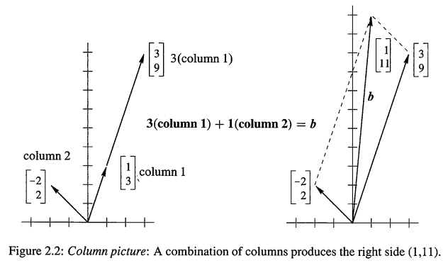

重复一下:向量方程的左边就是列的**线性组合**,线性组合把数乘和向量加法2个向量基本操作结合为一个步骤,非常关键.而想要的结果就是找到正确的系数x = 3,y =1.

当然,解 `x = 3,y = 1` 和行视图的是一样的.很可能你会觉得相交的两条直线更加的熟悉,所以更喜欢行视图.但是很快你就不会了.在四维空间下来想象四个向量的组合,比想象四个超平面怎么相交在一点容易多了(就算只有一个超平面,也是很难想象的

---

左边的**系数矩阵(Cofficient matrix)**是一个2*2的矩阵A
$$
\text{Cofficient matrix:} \quad A = \left[\begin{matrix} 
1 & -2 \\
3 & 2 \\
\end{matrix} \right]
$$
线性代数中,通过行和列看一个矩阵是很常见的.行可以得到行视图,列可以得到列视图.同样的数字,不同的视图,同样的方程.把这些方程写成一个矩阵问题  $Ax = b$:
$$
\text{Matrix equation:} \quad 

\quad Ax =b \Rightarrow  \quad 

\left[ \begin{array} { r r } 1 & - 2 \\ 3 & 2 \end{array} \right] \left[ \begin{array} { l } x \\ y \end{array} \right] = \left[ \begin{array} { r } 1 \\ 11 \end{array} \right]
$$
行视图的方式是处理A的两行.列视图是的方式是组合2列.数 `x = 3,y= 1` 实际上就是Ax = b的 `x` 向量.下面就是**矩阵-向量**乘法
$$
\begin{array} { l } \text {Row:  Dot products with rows } \\ \text { Column: Combination of columns } \end{array} \qquad 

A \boldsymbol { x } = \boldsymbol { b } \quad \text { is } \quad \left[ \begin{array} { r r } 1 & - 2 \\ 3 & 2 \end{array} \right] \left[ \begin{array} { l } 3 \\ 1 \end{array} \right] = \left[ \begin{array} { r } 1 \\ 11 \end{array} \right]
$$

> **提前说明:**
>
> ---
>
> 这一章会讲解n个未知数n个方程的求解,关键是要理解**矩阵乘法和逆操作(matrix multiplication and inversion)**,这2个概念是逆矩阵的关键
>
> 下面提前列出`<01-03>` 讲解的,理解矩阵来消去的四个步骤
>
> 1. 经过一系列矩阵 $E_{ij}$ 的消去.矩阵A转换成三角矩阵U,
> 2. 以相反顺序操作逆矩阵 $E_{ij}^{-1}$,可以把U变回A
> 3. 在矩阵语言当中,这个相反的顺序是 `A=LU=(lower triangle) (upper triangle)`
> 4. 如果A是可逆的话,消去会成功(可能需要行交换)
>
> 在计算科学当中,最长使用的算法都有这些步骤.(Matlab称之为`lu`).但是线性代数不仅仅是处理可逆**方**阵!对于m-n的矩阵,Ax = 0可能有很多的解,这些解会形成一个向量空间,而A的**秩(rank)**可以得到这个空间的维数!


## 1.1. 3方程,3未知数

假设3个未知数是x,y,z.有下面的三个线性方程
$$
\begin{array} { r } 

x + 2 y + 3 z = 6 \\ A x = b \qquad 2 x + 5 y + 2 z = 4 \\ 6 x - 3 y + z = 2 \end{array} 

\tag{3}
$$
我们想要寻找xyz解出这3个方程.但可能没有同时满足方程的x,y,z.对于这个系统,xyz确实存在.当未知数的数量和方程的数量是一致的时候,通常有一个解.在解这个系统之前,我们先通过两种方式想象一下:

- **行视图**: 3个平面相交于一个单一点.
- **列试图**: 组合3个列向量,形成(6,4,2)

在行视图下,每一个方程产生了一个三维的平面.如Fig2.3

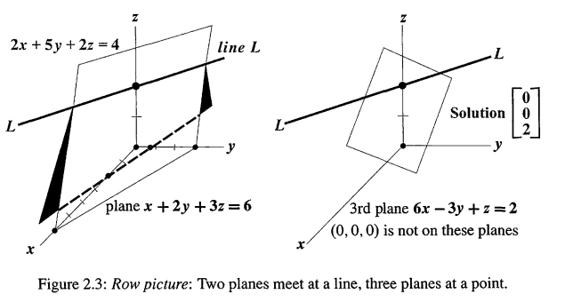

第1,2个平面相交于L.三个未知数两个方程的解通常就是一条直线.(当然不能是平行的平面代表的方程).第三个平面切过L得到一个点.这点在三个平面上面,能同时解出三个方程.但要在三维下画出这个交点是很困难的.但是列视图可以立刻知道为什么z =2
$$
\text{Combine columns:} \qquad \quad x \left[ \begin{array} { l } 1 \\ 2 \\ 6 \end{array} \right] + y \left[ \begin{array} { r } 2 \\ 5 \\ - 3 \end{array} \right] + z \left[ \begin{array} { l } 3 \\ 2 \\ 1 \end{array} \right] = \left[ \begin{array} { l } 6 \\ 4 \\ 2 \end{array} \right]

\tag{4}
$$


在列视图,要求的系数就是x,y,z,我们想要的就是把三个列向量乘以数x,y,z产生b = (6,4,2)

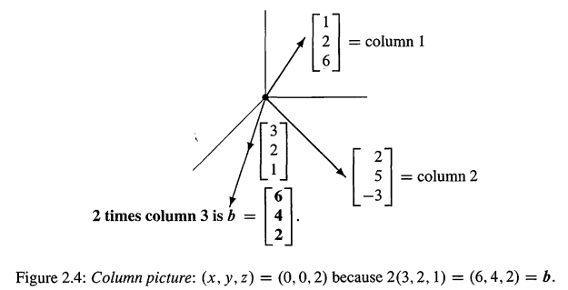

Fig2.4展示了列视图.这些列的线性组合可以产生任何b! 很快就可以发现2倍的`列3`就是b=(6,4,2).所以x = 0,y = 0,z = 2
$$
\text{Correct Combination:} \quad

0  \left[ \begin{array} { l } 1 \\ 2 \\ 6 \end{array} \right] +  0 \left[ \begin{array} { r } 2 \\ 5 \\ - 3 \end{array} \right] +  2 \left[ \begin{array} { l } 3 \\ 2 \\ 1 \end{array} \right] = \left[ \begin{array} { l } 6 \\ 4 \\ 2 \end{array} \right]
$$


### 1.1.1. 视频三维例子

三个变量三个方程组:
$$
\begin{array} { l } 2 x - y = 0 \\ - x + 2 y - z = - 1 \\ - 3 y + 4 z = 4 \end{array}
$$
行视图如下

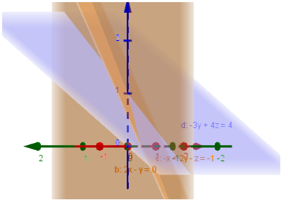

每一个方程都是三维下的一个平面.两个方程的平面如果不平行的话就会相交于一条直线.列视图如下所示:

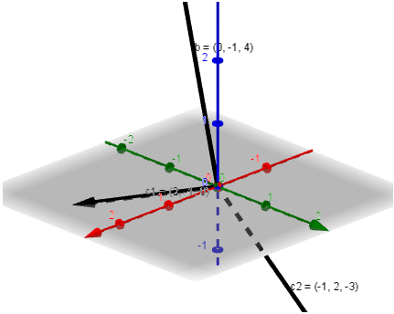

现在我们考虑一个问题,如果左边的系数矩阵保持不变,但是右边的b向量改变的话,比如
$$
x \left[ \begin{array} { c } 2 \\ - 1 \\ - 0 \end{array} \right] + y \left[ \begin{array} { c } - 1 \\ 2 \\ - 3 \end{array} \right] + z \left[ \begin{array} { c } 0 \\ - 1 \\ 4 \end{array} \right] = \left[ \begin{array} { c } 1 \\ 1 \\ - 3 \end{array} \right]
$$
这时候方程组的解是什么呢?在**行视图下面,三个平面变化了,列视图下面,是最终要组合成为的目标向量变化了**.那么,对于所有的,任意的b,方程组是否有解,也就是说:**Ax = b,对于任意的b是否有解?** 如果有解的话,消去法可以得到解.不管多么复杂的系统,求解线性方程的算法都是使用消去法

上面的问题,用线性组合的语言来说,就是,**列的线性组合是否能覆盖整个三维空间(也就是能产生任意的b,所有的b)?** 对于上面的例子,答案是可以的.因为这里的矩阵A是个非奇异矩阵.但是其他的矩阵有可能不行.如果上面的三列向量都在同一个平面的时候,那么它们的线性组合肯定逃不出这个平面,它们的组合得到的b只可能是这个平面之内的.这种情况下,矩阵就是**奇异的.**

我们试着考虑一下9维的情况,这时候向量有9个分量.这是很难想象的.那么矩阵A就有9列,每一列都有9个分量.每一列都是9维空间的向量.我们有9个方程,9个未知数.我们考虑得是9维空间下的9维向量的线性组合,来得到右侧的b向量.这时候,方程组是否总是有解呢?

当然,这取决于矩阵A.如果用Matlab的随机矩阵命令,产生的矩阵总是非奇异的,这时候是有解的.但是如果矩阵A有一些相互不独立的列向量,比如9列其实只相当于8列,有一列是毫无贡献的,其实只是相当于8列,它们的组合,只能覆盖9维空间下的某8维平面,那么最后的求解也只能在这个8维平面上展开.,那么有可能就是无解的.


​	


## 1.2. 矩阵形式的方程

> The matrix form of Equations 

三维例子当中,行视图有3行,列视图有3列.这三行三列包含了9个数字,可以形成一个3*3的矩阵A
$$
\text{The coefficient matrix in }A x = b \quad \text { is } \quad A = \left[ \begin{array} { r r r } 1 & 2 & 3 \\ 2 & 5 & 2 \\ 6 & - 3 & 1 \end{array} \right]
$$
A代表的是一个9个系数的矩阵.b代表的是一个列向量.未知数x也是一个列向量.如果使用行形式,那么就是`Eq(3)`,如果列形式,那么就是`Eq(4)`.如果是矩阵,那么就是
$$
\text{Matrix equation Ax = b:} \qquad 

\left[ \begin{array} { l l l } 1 & 2 & 3 \\ 2 & 5 & 2 \\ 6 & - 3 & 1 \end{array} \right] \left[ \begin{array} { l } x \\ y \\ z \end{array} \right] = \left[ \begin{array} { l } 6 \\ 4 \\ 2 \end{array} \right]

\tag{5}
$$
基本问题:矩阵A乘以列向量x是什么意思?我们可以通过行乘也可以通过列乘.Ax = b.两种方式都完成一共9次乘法:

> **Multiplication by rows:** Ax的结果是点乘:A的每一行都乘以列向量x:
> $$
> A x = \left[ \begin{array} { l } ( \operatorname { row } 1 ) \cdot x \\ ( \text {row } 2 ) \cdot x \\ ( \text {row } 3 ) \cdot x \end{array} \right]  \tag{6}
> $$
>
> ---
>
> **Multiplication by columns**  : Ax是列的线性组合
> $$
> A x = x ( \text {column } 1 ) + y ( \text {column} 2 ) + z ( \text {column } 3 ) \tag{7}
> $$

当把解x = (0,0,2)替换进去,乘法Ax 可以产生b
$$
\left[ \begin{array} { r r r } 1 & 2 & 3 \\ 2 & 5 & 2 \\ 6 & - 3 & 1 \end{array} \right] \left[ \begin{array} { l } 0 \\ 0 \\ 2 \end{array} \right] = 2 \text { times column } 3 = \left[ \begin{array} { l } 6 \\ 4 \\ 2 \end{array} \right]
$$

而行点乘x的方式,每次点乘得到b的一个分量.**Ax应该看成是A的列的线性组合.**

---

**例1** 下面是3-3矩阵A和 `I` ,`I` 是一个**单位矩阵(identity matrix)**
$$
A x = \left[ \begin{array} { l l l } 1 & 0 & 0 \\ 1 & 0 & 0 \\ 1 & 0 & 0 \end{array} \right] \left[ \begin{array} { l } 4 \\ 5 \\ 6 \end{array} \right] = \left[ \begin{array} { l } 4 \\ 4 \\ 4 \end{array} \right] \quad I x = \left[ \begin{array} { l l l } 1 & 0 & 0 \\ 0 & 1 & 0 \\ 0 & 0 & 1 \end{array} \right] \left[ \begin{array} { l } 4 \\ 5 \\ 6 \end{array} \right] = \left[ \begin{array} { l } 4 \\ 5 \\ 6 \end{array} \right]
$$
`I` 矩阵是特殊的,它的主对角线(main diagonal)都是1.不管这个矩阵乘以什么向量,得到的还是这个向量.这就像是乘以1一样


## 1.3. 关键概念

1. 向量的基础操作是数乘 cv 和向量加法 v+w
2. 基础操作组合起来可以得到线性组合 : cv + dw
3. **矩阵-向量**乘法 Ax 可以通过一次一行的点乘计算,**但 Ax 应该用A的列的线性组合来理解!**
4. 列视图: Ax = b 是寻找A的列的线性组合,以产生b
5. 行视图: Ax = b的每一个方程,给出的是线(二维)或者平面(三维)或者超平面(大于三维),如果它们之间有交点,就是解


## 1.4. 典型例题

**例1.** 下面的方程组,不要用消去法,仔细观察列,得到解
$$
\begin{aligned} x + 3 y + 2 z & = - 3 \\ 2 x + 2 y + 2 z & = - 2 \\ 3 x + 5 y + 6 z & = - 5 \end{aligned}

\Rightarrow

\left[ \begin{array} { l l l } 1 & 3 & 2 \\ 2 & 2 & 2 \\ 3 & 5 & 6 \end{array} \right] \left[ \begin{array} { l } x \\ y \\ z \end{array} \right] = \left[ \begin{array} { l } - 3 \\ - 2 \\ - 5 \end{array} \right]
$$
解:很快可以发现,`x=0,y=-1,z=0`即可.但是怎么知道是唯一的解呢?需要知道A是可逆的,列独立,行列式不是0,这些概念目前还没讲到

---

**例2** 下面系统没有解.行视图的平面不会相交于一个点,而列的组合也不能产生b.
$$
\begin{aligned} x + 3 y + 5 z = 4 \\ x + 2 y - 3 z = 5 \\ 2 x + 5 y + 2 z = 8 \end{aligned} \quad \left[ \begin{array} { r r r } 1 & 3 & 5 \\ 1 & 2 & - 3 \\ 2 & 5 & 2 \end{array} \right] \left[ \begin{array} { l } x \\ y \\ z \end{array} \right] = \left[ \begin{array} { l } 4 \\ 5 \\ 8 \end{array} \right] = b
$$
**1.** 将上式左边行视图的3个方程分别乘以1,1,-1,然后加起来,得到 0=1,表示这个方程组没有解.3个平面没有相交到一个点,它们之间也不平行,如下图

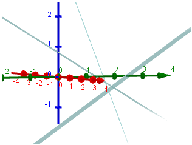

可见,3个平面两两相交一条直线.如果把最后一个方程2x+5y+2z= 8改成2x+5y+2z= 9,那么图像是

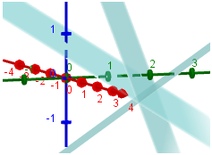

3个平面相交成一条直线了,有无穷多的解.

**2. ** 将A的每一列都和$y = (1,1,-1)$ 点乘,这些点乘是怎么揭示Ax =b 是没有解的?

A的列和y的点乘都是0(sp:列依赖),而在右边,$(4,5,8) \cdot (1,1,-1) = 1 \ne 0$ .所以没有解

**3.** 求 $b^*,b^{**},b^{***}$,可以让方程组存在解

**当b是A的列的组合时,方程组就有解**,比如
$$
\boldsymbol { b } ^ { * } = \left[ \begin{array} { l } 1 \\ 1 \\ 2 \end{array} \right] = \text { first column } \quad \boldsymbol { b } ^ { * * } = \left[ \begin{array} { l } 9 \\ 0 \\ 9 \end{array} \right] = \text { sum of columns } \quad b ^ { * * * } = \left[ \begin{array} { l } 0 \\ 0 \\ 0 \end{array} \right]
$$


# 2. 消去的思想

这一节,学习一个系统的方法来求解线性方程组.这个方法叫做**消去(Elimination)**.如下例子:
$$
\text{消去之前:}\quad
\begin{aligned} x - 2 y & = 1 \\ 3 x + 2 y & = 11 \end{aligned}
\\[3ex]

\text{消去,Eq(2) -3*Eq(1):} \quad

\begin{aligned}
x- 2y &= 1 \\
8y & = 8
\end{aligned}
$$
在消去之前,x,y同时出现在两个等式当中,消去之后,未知数x在第2个方程里面消失了,第二个方程变成8y = 8,立刻知道y = 1.把y替换回去,得到x = 3.

消去产生了一个**上三角系统(upper triangular system)**--这就是我们的目标.非0的系数`1,-2,8` 形成一个三角形.这样这个系统就可以**从下往上解**--先求出y然后是x.这个过程叫做**向后替换(back substitution)**

Fig2.5展示了消去前后的两个系统的直线方式相交的图像.消去之后他们还是相同的交点

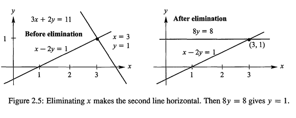

在本例中,消去的思想是:**为了消去x,用 `方程2-方程1*倍数`**. 那么,倍数这个乘数(multipler),用 $\ell$ 表示?是怎么找到的呢?先定义两个概念:

- **主元(Pivot))**:系数矩阵**行中第一个不为0**的系数,比如在上面的例子当中,我们消去的是x,第一个方程 `x-2y=1` 参与消去.主元就是x的系数1
- **乘数(Multiplier)**:由被消去的未知数的系数和主元得到,这个例子当中就是
`3x+2y = 11` 的x的系数3除以主元1,所以乘数就是: $系数/主元= 3/1 = 3$. ,$Eq(2) - Eq (1) * multlplier$,就消去了x

如果方程变成
$$
\begin{aligned}
4x - 8y &= 4 \\
3x + 2y &= 11
\end{aligned}

\overset{消去}{ \Rightarrow} \quad 

\begin{aligned}
4x - 8y &= 4 \\
8y  &= 8
\end{aligned}
$$
过程是:主元是4,乘数是3/4,那么 $Eq(2) - 3/4 * Eq(1)$ 即可消去x.

再看看这个消去x后的式子.假如有第三个方程,我们想要在**第三个**方程中消去y.那么**方程2**的y的系数可以当做主元了,所以这次的主元是8...可以推理得到,为了求解n个方程,我们需要n个主元.而且注意:**这些主元,是在消去后上三角矩阵的的对角线上.注意,当对角线上的这些主元存在0的时候,消去会失败**,理解消去失败的例子,你会明白消去的整个过程.


## 消去失败

> Breakdown Of Elimination

其中一个失败的可能是除以0,那么消去就必须停止了.有时候会有调整的方法,因此失败可以避免.

**例1. Permanent failure  with  no  solution**
$$
\begin{aligned}
x - 2y &= 1 \\
3x - 6y &= 11
\end{aligned}

\overset{\text{Eq(2) - 3* Eq(1)}}{ \Longrightarrow} \quad 

\begin{aligned}
x - 2y &= 1 \\
0y  &= 8
\end{aligned}
$$
`0y = 8` 是没有解的.这个系统没有第2个主元(**0不能成为主元**).Fig2.6的行视图展示了这个失败为什么**不可避免**.如果没有解,消去法会发现这个事实,得到类似于0y = 8的方程

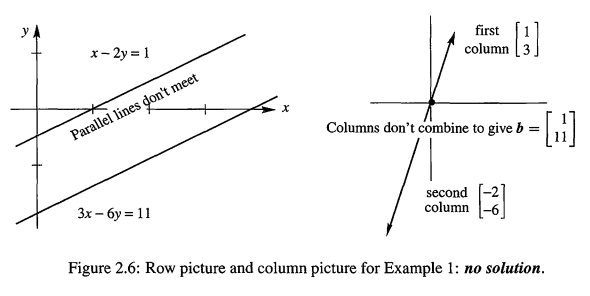

当我们把右边向量b变成(1,3)的时候,这时候不是没有解,而是**整一条线都是解**.如下例2

---

**例2 Failure with infinitely  many  solutions**

把例1的 `b = (1,11)` 改为 `(1,3)` 可得
$$
\begin{aligned}
x - 2y &= 1 \\
3x - 6y &= 3
\end{aligned}

\overset{\text{Eq(2) - 3* Eq(1)}}{ \Longrightarrow} \quad 

\begin{aligned}
x - 2y &= 1 \\
\color{orange}	0y  & \color{orange} = 0
\end{aligned}
$$
y是自由的,随便选,确定y之后就可以确定x.如下图所示

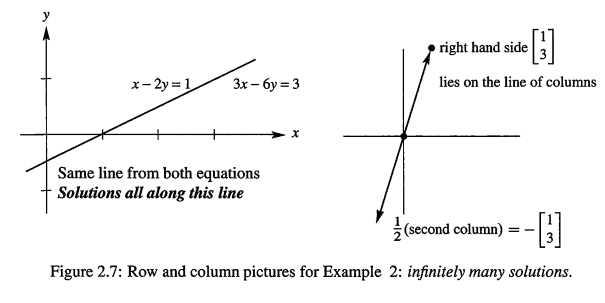

在行视图当中,平行线现在变成同一条直线了.任何线上的点都满足两个方程.我们有一整条线的解.在列视图,b = (1,3)现在和列1是一样的.我们可以选择 `x = 1,y= 0` ,也可以选择 `x = 0,y = -1/2` ,也是由无穷多的解的

现在总结一下:

- **消去失败:** n个方程不能得到n个主元,消去失败
- 消去后得到 $0 \ne 0$(如例1),**没有解**,如果得到 $0=0$(如例2),有很多解
- 如果成功得到n个主元,就可以成功解方程,但有可能需要**交换方程**(如例3)

---

消去还有第三种失败的可能,但是这次**可以修复**.假设第一个位置的主元是0.**我们拒绝0成为主元**.如下:

**例3 Temporary  failure  (zero  in  pivot). A row  exchange  produces two pivots**
$$
\begin{aligned}
0x + 2y &= 4 \\
3x - 2y &= 5
\end{aligned}

\quad \overset{\text{交换2行}}{ \Longrightarrow} \quad 

\begin{aligned}
3x - 2y &= 5 \\
2y  &  = 4
\end{aligned}
$$
这个系统实际上已经是三角了,**行替换(row exchange)**之后.就可以向后替换了.

---

例1例2是**奇异的(Singular)**--没有第二个主元.例3**是非奇异的(nonsingular)**.主元全部存在,并且有**恰好一个**解.**主元必须是非0的,因为必须除以它.奇异方程组没有解或者无穷多的解.**


## 三个方程,三个未知数

> Three Equations in Threee unknowns  

为了理解**高斯消去法(Gaussian Elimination)**,我们需要比2-2的矩阵更深入一点.3-3足够看清楚这个模式了.目前,矩阵都是正方形的:行数和列数是相同的.下面是一个特殊构建的3-3的系统
$$
\begin{array} { r } 2 x + 4 y - 2 z = 2 \\ 4 x + 9 y - 3 z = 8 \\ - 2 x - 3 y + 7 z = 10 \end{array} \tag{1}
$$

第一个主元是左上角的2.在这个下面下面我们想要消去4.那么乘数就是`4/2 = 2`. `方程2 - 方程1 * 2`.可以在方程2消去x

**第1步:** `Eq(2) - 2 *Eq(1)`,等式2变成: $y+z = 4$

第三个方程也消去x，主元不变，乘数是 $-2/2 = -1$.所以是 `方程3+方程1`,但**思想还是减**,乘数是-1,也就是方程3 - 方程1*(-1)).

**第2步:** `Eq(3) - (-1)  *Eq(1)`,等式3变成: $y+5z = 12$

现在得到两个**只有yz**的新方程.现在第二个主元就是1(左上角)，系数矩阵是2-2的:
$$
\text{x消去后:} \quad 

\begin{aligned}
1y + 1z &= 4 \\
1y+  5z&= 12
\end{aligned}
$$
最后一步，就是消去y,得到1-1的系统

**第3步:** 乘数是 `1/1 = 1`,$Eq(3)_{new} - Eq(2)_{new}$,得到: 4z = 8

现在初始的Ax = b变成了一个新的**上三角 Ux = c**
$$
Ax = b \text{ becomes Ux = c:}
\qquad 
\begin{array} { r } 2 x + 4 y - 2 z = 2 \\ 1 y + 1 z = 4 \\ 4 z = 8 \end{array}

\tag{2}
$$
我们的目标达到了--从A到U我们实现了**向前消去(forward elimination)**.注意主元是2,1,4,**在U的对角线上**.在初始的系统中,主元是隐藏的,消去发现了它们.Ux = c现在就做好了向后替换的准备:4z =8得到z = 2,y+z = 4得到y = 2,最后x = -1

那么解就是 $(x,y,z) = (-1,2,2)$.原始的系统Ax=b当中,的xyz和三角系统Ux = c的是结果是一样的

---

对于 `4-4` 的系统和 `n-n` 的系统,过程是一样的.下面是这整个思想,当消去成功的时候,这样就能**一列列的从A得到三角的U**

> - 列1:使用方程1,在第1个主元**之下**产生系数0（sp:可能多个0，当方程数 $n \ge 3$,比如前面3个方程例子，对第一个主元下方的位置，方程`2，3`都要产生系数0）
> - 列2:使用 **新的** 方程2,在第2个主元**之下**产生系数0（sp：如上，可能多个0）
> - `列3-列n`:一直进行上述过程,找到n个主元,从而产生上三角矩阵U


前进消去的结果就是一个上三角系统,如果存在全部的n个主元(从不为0!),那么就是非奇异的.


## 2.1. 视频例子:消去矩阵E

> sp:这个例子可作为下一节的过度

假设方程组如下
$$
\begin{array} { r } x + 2 y + z = 2 \\ 3 x + 8 y + z = 12 \\ 4 y + z = 2 \end{array}
$$
实际上能不能求出解,**取决于矩阵A**.系数矩阵A是
$$
\left[\begin{matrix} 
1 & 2 & 1\\
3 & 8 & 1\\
0 & 4 & 1\\
\end{matrix} \right]
$$
我们的目的是消元,比如想要消去方程2的x.看系数矩阵,第一行第一个数字,也就是主元.是1,而第二行需要被消去的数字是3.所以乘数是3,那么，进行 $r2 -r1*3$,x就被消去.矩阵A变成
$$
\left[\begin{matrix} 
1 & 2 & 1\\
0 & 2 & -2\\
0 & 4 & 1\\
\end{matrix} \right]
$$
第二个消去的目标是行3第1个数字,也就是0,不用再消去了.(这时候的主元还是行1第一个数字,1)

下一步,主元变成行2第二个数字,我们希望消去的是行3第二个数字.乘数这时候是2.那么 $r_3 - r2 * 2$,矩阵最终变成
$$
\left[\begin{matrix} 
1 & 2 & 1\\
0 & 2 & -2\\
0 & 0 & 5\\
\end{matrix} \right]
$$
这就是最终的矩阵U,**上三角矩阵**.消元最终把矩阵A变成了U.主对角线上的三个数字1,2,5都是主元.

---

现在看看消元失效的情况.什么情况下会失效呢?也就是不能得到三个主元.失效有好几种情况,比如,如果一开始行1的第1个数字是0,那么没有第一个主元,怎么办呢?并不意味着没有解,我们需要的是行交换.

再看另外一个问题,U矩阵(2,2)位置上的主元什么时候可能是0呢?如果把A矩阵(2,2)位置的8写成6,那么U(2,2)位置就变成了0,但是我们还是可以行交换,只要0下面有非0元素.

如果把A的(3,3)位置改成-4,这时候是无法修复的.因为最终它变成了0,不存在第3个主元了.消元失效!

可以通过行交换的失效只是暂时失效,而如果行交换都不能解决,那么就是永久失效了.

---

现在把右侧的b也加进来,得到增广矩阵
$$
\left[\begin{matrix} 
1 & 2 & 1 & 2\\
3 & 8 & 1 &12\\
0 & 4 & 1 & 2\\

\end{matrix} \right]
$$
实际上我们在消去的时候,**右侧的b也是会同步变化的**.那么当A化为U的时候,这个最终的增广矩阵就是
$$
\left[\begin{matrix} 
1 & 2 & 1 &2 \\
0 & 2 & -2 &6\\
0 & 0 & 5 & -10\\
\end{matrix} \right]
$$
原始方程变成
$$
\begin{array} { r } 

x + 2 y + z &= 2 \\ 
2 y - 2z &= 12 \\ 
5z &= -10 
\end{array}
$$
回带先求出z = -2,然后是y = 1最后是x=2.(这是因为U是上三角的)。

---

在上面的消元当中，我们的确进行了消元，**但没有使用矩阵的方式**。下面我们对下面矩阵A用**矩阵的方式消元**
$$
\left[\begin{matrix} 
1 & 2 & 1\\
3 & 8 & 1\\
0 & 4 & 1\\
\end{matrix} \right]
$$
**矩阵A乘以列向量其实就是A的列的线性组合**.现在看看一个行向量乘以一个矩阵,比如
$$
\left[\begin{matrix} 
1 & 2 & 7 \\ 
\end{matrix} \right]


\left[\begin{matrix} 
- & - & -\\
- & - & -\\
- & - & -\\
\end{matrix} \right]


= \left[\begin{matrix} 
1*r_1 & 2* r_2 & 7*r_3 \\   
\end{matrix} \right]

\quad \color{orange} \text{结果是一个行向量}
$$
其实是对**行进行线性组合**!

什么样的矩阵E能做到,**左乘**A，可以让A的 $r2 - 3* r1$ ?也就是
$$
\left[\begin{matrix} 
- & - & -\\
- & - & -\\
- & - & -\\
\end{matrix} \right]

\left[ \begin{array} { l l l } 1 & 2 & 1 \\ 3 & 8 & 1 \\ 0 & 4 & 1 \end{array} \right] = \left[ \begin{array} { l l r } 1 & 2 & 1 \\ 0 & 2 & - 2 \\ 0 & 4 & 1 \end{array} \right]
$$
首先看看,E的第一行是什么呢?因为最终右侧矩阵的第一行和A一样,**根据右左乘矩阵是对矩阵的行进行线性组合**,我们得到,E的第一行应该是 `1 0 0`,也就是只取A的r1,r2和r3不要.同理,E的r3是 `0,0,1`. 已经有了r1,r3,现在缺r2.我们想要A的 $r_2 - 3*r_1$.根据行的线性组合E应该是
$$
\left[\begin{matrix} 
1 & 0 & 0\\
-3 & 1 & 0\\
0 & 0 & 1\\
\end{matrix} \right]

= E_{21}
$$
这个矩阵E叫做初等矩阵或者消去矩阵.并且它在(2,1)位置上有特殊的用来把A(2,1)位置变成0做消去的元素.所以我用$E_{21}$ 表示.

现在,A经过一个消去之后变成了
$$
\left[ \begin{array} { l l r } 1 & 2 & 1 \\ 0 & 2 & - 2 \\ 0 & 4 & 1 \end{array} \right]
$$
下一个目标是要把(3,2)位置变成0,这时候 $E_{32}$ 是什么呢.同理,我们可以得到
$$
\left[\begin{matrix} 
1 & 0 & 0\\
0 & 1 & 0\\
0 & -2 & 1\\
\end{matrix} \right]
$$
也就是说
$$
\left[ \begin{array} { c c c } 1 & 0 & 0 \\ 0 & 1 & 0 \\ 0 & - 2 & 1 \end{array} \right] \left[ \begin{array} { c c r } 1 & 2 & 1 \\ 0 & 2 & - 2 \\ 0 & 4 & 1 \end{array} \right] = \left[ \begin{array} { c c c } 1 & 2 & 1 \\ 0 & 2 & - 2 \\ 0 & 0 & 5 \end{array} \right]
$$
最终,我们使用了矩阵操作得到了最终的消去结果.使用的是一连串的初等矩阵E.过程如下
$$
E_{32} (E_{21} A) = U
$$
多么简洁美丽啊

---

再考虑一个问题,把矩阵A变成U,有没有一个矩阵可以一次性完成任务,而不是一连串的E.其实这个矩阵也就是所有E的组合!对于矩阵乘法,矩阵的顺序不能改变,但是可以改变括号的顺序,也就是说
$$
E_{32} (E_{21} A) = (E_{32} E_{21}) A 
$$
这样可以得到单个矩阵,叫做E.

还有另外一个初等矩阵,他可以交换两行.称为P矩阵,也就是**置换矩阵(permutation matrix)**.其实也很简单,假设要交换的矩阵是3-3,要交换行1和行2,那么这个$P_{12}$ 是
$$
\left[\begin{matrix} 
0 & 1 & 0\\
1 & 0 & 0\\
0 & 0 & 1\\
\end{matrix} \right]
$$
如果我们想要交换的是列呢?注意，对列的操作是**右乘**。 假设我们要交换的矩阵是 $\left[\begin{matrix} a & b \\ c & d \end{matrix} \right]$，想要得到: $\left[\begin{matrix} b & a \\ d & c \end{matrix} \right]$.那么
$$
\left[ \begin{array} { l l } a & b \\ c & d \end{array} \right] \left[ \begin{array} { l l } 0 & 1 \\ 1 & 0 \end{array} \right] = \left[ \begin{array} { l l } b & a \\ d & c \end{array} \right]
$$


现在我们已经知道,$E_{32} E_{21}$ 可以得到一个一次性把A变成U的矩阵,但是现在我们不打算这么做,因为有更好的方法.我们先不管A怎么变成U,而是看U怎么变成A.这一节课的所有矩阵都是可逆的,现在是了解逆矩阵的好时机.

现在看看我们的 $E_{21}$,我想要用一个矩阵来逆转 $E_{21}$ 所做的变化($E_{21}$ 所做的变化是什么呢?就是 $r_2 - 3r_1$) .其实也就是想要一个矩阵,得到
$$
\left[\begin{matrix} 
- & - & -\\
- & - & -\\
- & - & -\\
\end{matrix} \right]

\underbrace{
\left[\begin{matrix} 
1 & 0 & 0\\
-3 & 1 & 0\\
0 & 0 & 1\\
\end{matrix} \right]
}_{E_{21}}

= 

\underbrace{\left[\begin{matrix} 
1 & 0 & 0\\
0 & 1 & 0\\
0 & 0 & 1\\
\end{matrix} \right]
}_{\quad \color{orange} \text{Identify Matrix I}}
$$
其实就是 $E_{21}$ 的 $r_2 + 3r_1$,那么这个矩阵是
$$
\left[\begin{matrix} 
1 & 0 & 0\\
3 & 1 & 0\\
0 & 0 & 1\\
\end{matrix} \right]
$$
这就是**逆矩阵**


## 2.2. 关键概念

1. 经过消去之后,一个线性系统 $Ax  =  b$ 变成上三角的 $Ux = c$
3. $乘数  = 要被消去元素的系数/主元$  .  主元永远不能为0!
4. 如果主元位置出现0,但是它下面有非0元素,可以通过行交换修复
5. 上三角系统可以通过向后替换求解,也就从下面开始求解等式
6. 当消去是永久失败的时候(permanent faliure),系统不是**没有解**,就是有**无穷多的解**

# 3. 使用矩阵消去

我们现在融合两种思想: **消去**和**矩阵**，目标是把消去的所有步骤(和最终结果)以最清晰的方式表达.在上一节 `3-3` 的例子当中,消去过程还可以使用语言来表达.对于大系统,一长串的步骤描述很让人绝望的.通过一个矩阵E,你会看到,怎么从row i 减去一个row j的数乘

Ax = b的例子如下.和上一节是一样的
$$
\begin{array} { r } 
2 x_1 + 4 x_2 - 2 x_3 = 2 \\ 
4 x_1 + 9 x_2 - 3 x_3 = 8 \\ 
- 2 x_1 - 3 x_2 + 7 x_3 = 10 
\end{array}

\quad \Rightarrow  \quad

\left[ \begin{array} { r r r } 2 & 4 & - 2 \\ 4 & 9 & - 3 \\ - 2 & - 3 & 7 \end{array} \right] \left[ \begin{array} { l } x _ { 1 } \\ x _ { 2 } \\ x _ { 3 } \end{array} \right] = \left[ \begin{array} { r } 2 \\ 8 \\ 10 \end{array} \right] \tag{1}
$$
注意上面灯饰，矩阵A **乘以** 向量 x，也就是 **作用** 在向量x上，得到一个新向量。如果方程数目和未知数的**个数**一样，那么A就是**方阵**。在`Eq(1)`,A是`3-3`方阵。Ax的规则是如此重要,值得再多提一次:

> **Ax是A的列的线性组合**.$\vec{x}$ 的分量,乘以了A的列:
> $$
> Ax = x_1 * \text{Column 1} + ...+ x_n * \text{Column n}
> $$
> 

而当我们计算Ax的某个分量的时候,我们使用**行形式**的矩阵乘法： Ax的第i个组件,是A的第i行和x的点乘:	

> **Ax结果的分量,是A的行和x的点乘**:
> $$
> \text{Ax的第i个分量是: } a_{i1}x_1+a_{i2}x_2+...+a_{in}x——n = \sum_{j=1}^{n}a_{ij}x_j \quad \color{orange} \text{A的第i行，点乘x}
> $$


## 3.1. 矩阵形式的消去步骤

> The Matrix Form of Elimination Step 

Ax =b对于表达初始方程组的便利形式.但是消去步骤是什么样的呢?在上一节例子当中(本节`Eq(1)`方程组),第一步是 $r_2 - 2r_1$,在右边,也是b的第2个分量也减去第一个分量的2倍
$$
\text{First step: } \quad
b = \left[ \begin{array} { r } 2 \\ 8 \\ 10 \end{array} \right] \quad \text { changes to } \quad b _ { \text {new } } = \left[ \begin{array} { r } 2 \\ 4 \\ 10 \end{array} \right]
$$
我们想要通过矩阵来做这个减法!.我们用一个"消去矩阵"(Elimination matrix)乘以b的时候,可以得相同的值: $b_{new}=Eb$.这个消去矩阵是
$$
E = \left[ \begin{array} { l l l } 1 & 0 & 0 \\ - 2 & 1 & 0 \\ 0 & 0 & 1 \end{array} \right]
$$
乘以这个E将会把b的 $第2行 -  (2*第一行)$.第1行和第3行保持不变
$$
\left[ \begin{array} { r r r } 1 & 0 & 0 \\ - 2 & 1 & 0 \\ 0 & 0 & 1 \end{array} \right] \left[ \begin{array} { l } b _ { 1 } \\ b _ { 2 } \\ b _ { 3 } \end{array} \right] = \left[ \begin{array} { c } b _ { 1 } \\ b _ { 2 } - 2 b _ { 1 } \\ b _ { 3 } \end{array} \right]
$$
E的1,3行和单位矩阵 `I` 是一样的.类似于E的矩阵叫做初等矩阵(elementary matrix)或者消去矩阵.这样的矩阵是怎么来的呢?从单位矩阵 `I` 开始,把其中一个0变成 $-\ell$

> 单位矩阵在对角线都是1,其他位置都是0.那么对于任何b,$Ib  = b$,消去矩阵 $E_{ij}$,把目标矩阵的 `行i` 减去 `行j` 的 $\ell$ 倍,所以E有一个额外的非0元素: 就是在 `(i,j)`  的位置的值是$-\ell$.

如下的 $E_{31}$ 在 `(3,1)` 位置有  $-\ell$.
$$
\text{Identity } I = \left[ \begin{array} { l l l } 1 & 0 & 0 \\ 0 & 1 & 0 \\ 0 & 0 & 1 \end{array} \right] \quad \text { Elimination } \quad E _ { 31 } = \left[ \begin{array} { r r r } 1 & 0 & 0 \\ 0 & 1 & 0 \\ - \ell & 0 & 1 \end{array} \right]
$$
当你用 `I` 乘以b,你仍然得到b.但是 $E_{31}$ 乘以b之后,是会把b的 $r_3 - \ell r_1$

---

**Ax =b的左边页同样乘以$E_{31}$,$E_{31}$ 的目的就是在系数矩阵矩阵的(3,1)位置产生0.那么使用矩阵消去的思想就是:从A开始,使用E在主元下面产生0.(对于`Eq(1)`的A,第一个E是 $E_{21}$).最后得到一个三角U.**

但注意,x没有改变,也就是说,消去之后,解是不会改变的.是系数矩阵改变了.当我们从Ax = b开始,乘以E.结果就是 $EAx = Eb$.

> **注意**:消去矩阵 $E_{ij}$ 是很好的例子,但是后面你不会再看到它.它们的作用是展示矩阵怎么作用在行上.通过一些消去步骤,我们会看到矩阵如何相乘.(E矩阵的顺序很重要).矩阵乘法和逆矩阵在E矩阵上也比较清晰.


## 3.2. 矩阵乘法

首先问题是,两个矩阵怎么相乘?当我们的第一个矩阵是E: 把A和任何其他矩阵的2倍行1从行2减去.这个乘数是 $\ell =2$
$$
E A = \left[ \begin{array} { r r r } 1 & 0 & 0 \\ - 2 & 1 & 0 \\ 0 & 0 & 1 \end{array} \right] \left[ \begin{array} { r r r } 2 & 4 & - 2 \\ 4 & 9 & - 3 \\ - 2 & - 3 & 7 \end{array} \right] = \left[ \begin{array} { r r r } 2 & 4 & - 2 \\ 0 & 1 & 1 \\ - 2 & - 3 & 7 \end{array} \right] \tag{2}
$$
这步骤,不会改变A的行1和行3.在EA当中,只有行2改变了.两倍行1被从行2减去.所以矩阵乘法达到了和消去一样的作用,而且新的方程组系统是:  $EAx=Eb$

$EAx$ 是简单的,但涉及到一个微妙的思想.从 $Ax = b$ 开始,两边都乘以E,得到 $E(Ax) = Eb$.有了矩阵乘法,这其实也是 $(EA)x = Eb$.注意这个转换过程,**刚开始是 `E` 乘以 `Ax`,后面是 `EA` 乘以 `x` .但效果是一样的**.所以括号是不需要的,我们直接写成 $EAx$

再然后，把上述思想可以扩展到有多列的矩阵C比如 $C = [c_1,c_2,c_3]$.当乘以 $EAC$ 的时候,你可以先乘 $AC$ 或者 $EA$.这就类似于结合律:$3*(4*5) = (3*4)*5$.交换律 $3*4 = 4*3$ 看起来似乎更叫明显.但是 $EA$ 和 $AE$ 是**不一样**的.当E在右边,它**作用在A的列上**.

> - Associative law is true: $A(BC) = (AB)C$
> - Commutative law is **false**: 通常,$AB \ne BA$


矩阵乘法还有另外一项要求.假设B只有一列(就是b).那么EB的**矩阵对矩阵**的方式应该和Eb**矩阵对向量**的方式是相容的.更进一步,矩阵乘法EB应该可以**一列列的乘**.也就是说,如果B有多列 $b_1,b_2,b_3$,那么EB的列就是 $Eb_1,  Eb_2,  Eb_3$

> 矩阵乘法 : $A B = A \left[ b _ { 1 } ，b _ { 2 }， b _ { 3 } \right] = \left[ A b _ { 1 }, A b _ { 2 }, A b _ { 3 } \right]$

比如Eq(2),把A的第三列乘以E,正确的得到E的第三列
$$
\left[ \begin{array} { r r r } 1 & 0 & 0 \\ - 2 & 1 & 0 \\ 0 & 0 & 1 \end{array} \right] \left[ \begin{array} { r } - 2 \\ - 3 \\ 7 \end{array} \right] = \left[ \begin{array} { r } - 2 \\ 1 \\ 7 \end{array} \right] \quad \color{orange} \text{E* (Column j of A) = column j of EA}
$$
注意这个性质是是针对列的,但消去却是应用到行上的.`<#4>`我们会学习乘积AB的每一项分别是什么.矩阵乘法的美丽之处在于,三种方式:行,列,整个矩阵,都是正确的


## 3.3. 行交换矩阵 

>  The Matrix $P_{ij}$  for a row Exchange

为了从行`i`减去行`j`,我们使用矩阵 $E_{ij}$. 而我们也知道,当主元的位置是0的时候,就需要行交换.在主元位置下面,可能是不包含0的.换行以后,我们就有了一个新的主元,消去可以继续进行下去了.为了交换行,我们使用**置换矩阵(permutation matrix)**: $P_{ij}$:

交换行2和行3的矩阵 $P_{23}$ 是什么样的呢?我们通过过交换单位矩阵 `I` 的行来找到这个矩阵
$$
P _ { 23 } = \left[ \begin{array} { l l l } 1 & 0 & 0 \\ 0 & 0 & 1 \\ 0 & 1 & 0 \end{array} \right]
$$
这是一个**行交换矩阵(row exchange matrix)**.乘以 $P_{23}$ 后会交换任何列向量的分量2和分量3,因此,也会交换任何矩阵的行2和行3


## 3.4. 增广矩阵

> The Augmented Matrix 

一开始,是一个方阵 `E` 乘以A,因为我们的消去需要这样,而且我们知道EA将会产生什么.下一步就是需要允许一个矩形矩阵的出现.这也是来自于初始的方程组,但是现在它包括了右边的b

> **关键概念**
>
> ---
>
> 消去,在A和b上,都进行了相同的行操作.所以我们可以把 b 作为额外的一列来进行消去操作,也就是说,矩阵 A 多增加了一列b,从而增广了
> $$
> \text{增广矩阵}:\quad  \left[ \begin{array} { l l } A & b \end{array} \right] = \left[ \begin{array} { r r r r } 2 & 4 & - 2 & 2 \\ 4 & 9 & - 3 & 8 \\ - 2 & - 3 & 7 & 10 \end{array} \right]
> $$
> 

现在消去会作用在这个新矩阵的整行上.有了[A b]之后,原来方程当中的左边和右边的步骤一起发生.以`Eq(1)`的方程组为例
$$
\left[ \begin{array} { r r r } 1 & 0 & 0 \\ - 2 & 1 & 0 \\ 0 & 0 & 1 \end{array} \right] \left[ \begin{array} { r r r r } 2 & 4 & - 2 & 2 \\ 4 & 9 & - 3 & 8 \\ - 2 & - 3 & 7 & 10 \end{array} \right] = \left[ \begin{array} { r r r r } 2 & 4 & - 2 & 2 \\ 0 & 1 & 1 & 4 \\ - 2 & - 3 & 7 & 10 \end{array} \right]
$$

最右边新的第2行是 `0,1,1,4`.,也就代表了第2个方程就是 $x_2+ x_3=4$.

注意矩阵的**作用**: A作用在x上产生b,E作用在A上产生EA,而整个消去步骤,其实就是一系列的行操作,这些行操作又可以通过矩阵乘法实现.如Eq(1)的矩阵当中,首先可以得到 $E_{21} A$ ,然后得到 $E_{31} E_{21} A$ ,最后 $E_{32} E_{31} E_{21} A$  就是一个三角矩阵

现在,右边的向量被添加到A形成增广矩阵,最终结果还是一个三角系统，不变。


## 3.5. 典型例题

**1.**  对于如下方程组，写出增广矩阵[A b],然后使用 $E_{21},P_{32}$ 进行操作，观察一下，如果一次性应用 $P_{32}E_{21}$ 到方程组，有什么效果
$$
\begin{array} { r } x + 2 y + 2 z = 1 \\ 4 x + 8 y + 9 z = 3 \\ 3 y + 2 z = 1 \end{array}
$$
解： 通过这一题，可以了解消去可以通过一个步骤完成
$$
\left[ \begin{array} { l l } A & b \end{array} \right] = \left[ \begin{array} { l l l l } 1 & 2 & 2 & 1 \\ 4 & 8 & 9 & 3 \\ 0 & 3 & 2 & 1 \end{array} \right] 

\quad \text { 那么 } \quad E _ { 21 } \left[ \begin{array} { l l } A & b \end{array} \right] = \left[ \begin{array} { l l l l } 1 & 2 & 2 & 1 \\ 0 & 0 & 1 & - 1 \\ 0 & 3 & 2 & 1 \end{array} \right]
$$
行交换
$$
P _ { 32 } E _ { 21 } [ A \quad b ] = \left[ \begin{array} { r r r r } 1 & 2 & 2 & 1 \\ 0 & 3 & 2 & 1 \\ 0 & 0 & 1 & - 1 \end{array} \right] \quad \text { 从而 } \quad \left[ \begin{array} { l } x \\ y \\ z \end{array} \right] = \left[ \begin{array} { r } 1 \\ 1 \\ - 1 \end{array} \right]
$$
所以，$P_{32}E_{21}$ 可以一次性完成:把 A 的 $r_2 - 4 r_1$ ，然后再交换 $r_2,r_3$,从而完成整个消去步骤

---

**2.**  下面是矩阵乘法 AB 的2种方式

1. A的行，乘以B的列
2. **A的列，乘以B的行**
这种方式下，会产生2个矩阵，加起来得到AB

最后总结一下，每种方式各需要多少次乘法
$$
\text{Both way:} \quad \quad A B = \left[ \begin{array} { l l } 3 & 4 \\ 1 & 5 \\ 2 & 0 \end{array} \right] \left[ \begin{array} { l l } 2 & 4 \\ 1 & 1 \end{array} \right] = \left[ \begin{array} { r r } 10 & 16 \\ 7 & 9 \\ 4 & 8 \end{array} \right]
$$
解： 第一种方式，其实是**向量的点乘**：
$$
( \text { row } 1 ) \cdot ( \operatorname { column } 1 ) = \left[ \begin{array} { l l } 3 & 4 \end{array} \right] \left[ \begin{array} { l } 2 \\ 1 \end{array} \right] = 1 0 \quad \text { 是 AB 的} ( 1,1 ) \text {元素} \\


( \text { row } 2 ) \cdot ( \operatorname { column } 1 ) = \left[ \begin{array} { l l } 1 & 5 \end{array} \right] \left[ \begin{array} { l } 2 \\ 1 \end{array} \right] = 7 \quad \text { 是 AB 的} ( 2,1 ) \text {元素}
$$
所以，AB一共有6个元素，每个元素，都是向量点乘产生的，而每次向量点乘，都需要2次乘法，所以一共需要`6*2 = 12`次乘法。对于 $[m,n] * [n,p]$的矩阵乘法，结果AB是`m*p` 个元素，而每个元素的产生，都是点乘，这个点乘需要 n 次乘法。所以 $[m,n] * [n,p]$ 需要 `mnp` 次乘法

第二种方式如下
$$
A B = \left[ \begin{array} { l } 3 \\ 1 \\ 2 \end{array} \right] \left[ \begin{array} { l l } 2 & 4 \end{array} \right] + \left[ \begin{array} { l } 4 \\ 5 \\ 0 \end{array} \right] \left[ \begin{array} { l l } 1 & 1 \end{array} \right] = \left[ \begin{array} { r r } 6 & 12 \\ 2 & 4 \\ 4 & 8 \end{array} \right] + \left[ \begin{array} { l l } 4 & 4 \\ 5 & 5 \\ 0 & 0 \end{array} \right]
$$

> sp:注意这种方式，AB分解为：A的列乘以B的行，会产生中间矩阵。这时`<#4>` 里面的第四种方式


# 4. 矩阵操作法则

> Rules for matrix Operations

矩阵加法是简单的，这节主要关注矩阵乘法。

矩阵乘法 AB 需要满足: **如果A有n列,那么B必须有n行.** 当A是`3-2`,那么B可以是`2-1`(一个向量),`2-2`....`2-20`. **B的每一列都被A乘**.我们首先从点乘开始讲解矩阵乘法,然后回到列形式的方法:**A 乘以B的列**.最重要的一个法则就是,**AB乘以C等于A乘以BC**.挑战习题证明

假设A是`m-n`,而B是 `n-p`.那么AB就是`m-p`
$$
( m \times n ) ( n \times p ) = ( m \times p )
\\

\left[ \begin{array} { c } 

m \text { rows } \\ n \text { columns } \end{array} \right] \left[ \begin{array} { c } n \text { rows } \\ p \text { columns } \end{array} \right] = \left[ \begin{array} { c } m \text { rows } \\ p \text { columns } \end{array} \right]
$$
一行乘以一列是一个极端的例子,也就是 `1-n `矩阵 乘以 `n-1` 矩阵,结果是一个`1-1`矩阵.AB的每一项都是点乘的值,比如,AB值的在左上角 `(1,1)` 项的值就是 `(A的第一行)*(B的第一列)`.矩阵相乘的每一项,就是取A的每一行和B的每一列的点乘.如下图

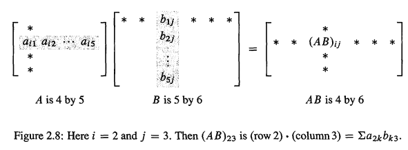

计算一下,如果A,B都是 `n-n`的矩阵,那么AB的结果也是 `n-n` 的矩阵,它包含了 $n^2$ 个点乘的项.其中每一个项又包含了n个乘法,所以一共进行了 $n^3$ 个乘法.如果n = 100,那么我们进行了100万次乘法.

直到最近,数学家们也以为AB(`2-2`情况)需要 $2^3=8$ 次乘法.后面有人发现只需要7次,但是需要额外的加法.通过把 `n-n` 的矩阵分块成 `2-2` 的块矩阵,这个思想也可以用到大矩阵.效率已经不是 $n^3$,而是下降到 $n^{2.8}$,  而且这个指数一直在下降.目前最好的就是 $n^{2.376}$  .但是这个算法很复杂,在科学计算还是使用常规的算法: $ n^2$ 个点乘, 每个点乘n个乘法.


**例1** 假设A是 `[1 3]` 的行向量,而B是 `[3 1]`的列向量.那么AB是 `[1 1]` 的.而BA是 `[3 3]` 的

一个行乘以一个列是一个**内部乘(inner product)**-其实就是点乘的另外一个名字.一个列乘以一个行称为**外部乘(outer product)**.这些都是向量乘法的极端例子


## 4.1. A*B的行和列

> Rows and columns of AB 

从大的视图来看,A*B也相当于**A乘以了B的每一列,AB每一列都是A的列的组合**.下面是矩阵乘法的列视图
$$
\color{orange} \text{A*B列视图：矩阵A乘以B的列：}\quad  A[b_1...b_p] = [Ab_1 ... Ab_p]
$$
行视图是相反的,**A的每一行乘以整个矩阵B，结果是AB的每一行都是B的行的组合:**	
$$
\color{orange} \text{AB行视图：矩阵A的每一行，乘以B：}\quad  \left[\begin{matrix} 
r_1  \\
\vdots  \\
r_m  \\
\end{matrix} \right] B = \left[\begin{matrix} 
r_1B  \\
\vdots  \\
r_mB  \\
\end{matrix} \right]
$$
我们在消去的过程 $E*A$ 中看到了行操作,我们在 $A*x$ 中看到了列操作.而 **行-列视图(row-column picture)** 则是有着行和列的点乘,不管你信不信,也有一个 **列-行视图(column-row picture)**: A的列`1...n` 分别乘以B的行 `1....n`,然后把中间结果加起来，得到的也是AB ,在例2当中,你会看到AB使用列乘以行的方式


## 4.2. 矩阵操作律

> The Laws for matrix operations

矩阵的操作遵循6个规则,不遵循1个规则.这里的矩阵可以是正方形也可以是矩形的,涉及到A+B的是简单的,并且都是遵循的,

**3个加法法则**


$$
\begin{array} { r l r } A + B & = B + A & \text { (commutative law) } \\ c ( A + B ) & = c A + c B & \text { (distributive law) } \\ A + ( B + C ) & = ( A + B ) + C & \text { (associative law) } \end{array}
$$
**3个乘法法则，和不成立的交换律**
$$
\begin{aligned} 

A B \neq B A & \color{orange} \text  { (the commutative "law" is usually broken) } \\ 

C ( A + B ) = C A + C B & \text { (distributive law from the left) } \\ ( A + B ) C = A C + B C & \text { (distributive law from the right) } \\ A ( B C ) = ( A B ) C & \text { (associative law for } A B C \text { ) (parentheses not needed) } 

\end{aligned}
$$

当A,B不是正方形的时候.AB和BA是不同大小的.所以这两个矩阵明显不相等--就算乘法可以进行下去.对于正方形的矩阵,几乎所有的例子都可以得到,AB和BA是不一样的.

看一个特殊的例子,假设A = B = C = 正方形矩阵,那么  $(A*A^2) = (A^2  ∗A)$.最终结果都是 $A^3$.矩阵的幂(matrix powers) $A^p$ 遵循和数字一样的规则
$$
A ^ { p } = A A A \cdots A ( p \text { factors } ) \quad \left( A ^ { p } \right) \left( A ^ { q } \right) = A ^ { p + q } \quad \left( A ^ { p } \right) ^ { q } = A ^ { p q }
$$
当p,q是0或者负数,这些规则也是成立的,但是要求矩阵A需要有一个 "-1的幂"--也就是逆矩阵 $A^{−1}$ .那么 $A^0=I$. 对于一个数,$a^{−1}=1/a$.对于一个矩阵,逆矩阵是 $A^{−1}$ (不是 $I/A$,虽然这个写法在Matlab是允许的).每一个数a除了a = 0,都有一个$a^{−1}$ .但是矩阵A是否有逆矩阵是线性代数的一个中心问题.`<#5>` 节学习.


## 4.3. 块矩阵和分块相乘

> Block Matrices And block Multiplication 

矩阵可以被切成块:一些更小的矩阵.这是很常见的,下面是 `[4 6]` 的矩阵切成 `[2 2]` 的块,每一块都是`I`
$$
A = \left[ \begin{array} { l l | l l | l l } 1 & 0 & 1 & 0 & 1 & 0 \\ 0 & 1 & 0 & 1 & 0 & 1 \\ \hline 1 & 0 & 1 & 0 & 1 & 0 \\ 0 & 1 & 0 & 1 & 0 & 1 \end{array} \right] = \left[ \begin{array} { l l l } I & I & I \\ I & I & I \end{array} \right]
$$
如果B也是 `[4-6]` 矩阵,而且分块大小对应，那么你可以**一块块的把A,B加起来.** 

其实我们已经遇见过分块矩阵了: 增广矩阵`[A b]`,有两块,大小不同.乘以一个消去矩阵得到`[EA Eb]`,当**形状合适的时候,是可以分块相乘的**. 

> **Block multiplication**
>
> ---
>
> 如果对A的**列**的切割，匹配B的**行**的切割(cuts between of A match the cus between rows of B)，那么AB的分块乘法是可行的：
> $$
> \left[ \begin{array} { l l } A _ { 11 } & A _ { 12 } \\ A _ { 21 } & A _ { 22 } \end{array} \right] \left[ \begin{array} { l l } B _ { 11 } & \cdots \\ B _ { 21 } & \cdots \end{array} \right] = \left[ \begin{array} { l l } A _ { 11 } B _ { 11 } + A _ { 12 } B _ { 21 } & \cdots \\ A _ { 21 } B _ { 11 } + A _ { 22 } B _ { 21 } & \cdots \end{array} \right]
> 
> \tag{1}
> $$
> 其实`Eq(1)` 的分块换成数字（其实`[1 1]`分块），也是成立的

就算分块相乘,也必须小心,A在B前面,因为BA是不一样的.分块矩阵的**主要目的**就在于,可以更清楚的看到它们是怎么作用的.比如上面的A矩阵分块后,可以看到是多个 `I`。

**例2 分块的重要特殊例子** 设A的分块是它的n列,B的分块是它的n行.那么分块相乘AB加起来得到 **列乘行(columns times rows)**
$$
\color{orange} \text{Columns times rows:} \quad
\color{white}

\left[\begin{matrix} 
| &  & |\\
a_1 & \dots & a_n\\
| &  & |\\
\end{matrix} \right]


\left[\begin{matrix} 
- & b_1 & -\\
&  \vdots & \\
- & b_n & -\\
\end{matrix} \right]

= \underbrace{[a_1b_1] + ... + [a_nb_n]  }_{\color{orange} \text{每一项都是一个[n n]矩阵}}

= [a_1b_1+...+a_nb_n]

\tag{2}
$$
这就是另外一种矩阵相乘的方式.和通常的行乘以列(row times columns)相乘的方式比较一下

- 行 * 列： A的行1乘以B的列1得到AB的(1,1)元素.
- 列 * 行： A的列1乘以B的行1得到了一个**完整的矩阵**--而不仅仅是一个数字

如下示例
$$
\left[ \begin{array} { l l } 1 & 4 \\ 1 & 5 \end{array} \right] \left[ \begin{array} { l l } 3 & 2 \\ 1 & 0 \end{array} \right] 

= \left[ \begin{array} { l } 1 \\ 1 \end{array} \right] \left[ \begin{array} { l l } 3 & 2 \end{array} \right] + \left[ \begin{array} { l } 4 \\ 5 \end{array} \right] \left[ \begin{array} { l l } 1 & 0 \end{array} \right] 

=

\left[ \begin{array} { l l } 3 & 2 \\ 3 & 2 \end{array} \right] + 
\left[ \begin{array} { l l } 4 & 0 \\ 5 & 0 \end{array} \right]  = 

\left[ \begin{array} { l l } 7 & 2 \\ 8 & 2 \end{array} \right] 
$$
列*行的形式,得到两个完整的矩阵,加起来得到的最后的结果.两种方法都是8个乘法,4个加法,只是不同的顺序运行而已


**例3 Elimination by blocks**

假设A的第一列是数字1,3,4.为了把3,4变为0,0,把主元所在的行乘以3和4,然后减去.这些行操作其实就是和消去矩阵 $E_{21},E_{31}$ 相乘:
$$
\text{once at a time:}\quad E _ { 21 } = \left[ \begin{array} { r r r } 1 & 0 & 0 \\ - 3 & 1 & 0 \\ 0 & 0 & 1 \end{array} \right] \text { and } E _ { 31 } = \left[ \begin{array} { r r r } 1 & 0 & 0 \\ 0 & 1 & 0 \\ - 4 & 0 & 1 \end{array} \right]
$$
"分块思想"就是想要用一个矩阵E来完整全部的消去.这个矩阵会消去A的第一列在主元下面的数字，如
$$
E = \left[ \begin{array} { r r r } 1 & 0 & 0 \\ - 3 & 1 & 0 \\ - 4 & 0 & 1 \end{array} \right] \text { multiplies } \left[ \begin{array} { l l l } 1 & x & x \\ 3 & x & x \\ 4 & x & x \end{array} \right] \text { to give } E A = \left[ \begin{array} { l l l } 1 & x & x \\ 0 & x & x \\ 0 & x & x \end{array} \right]
$$
使用  `<#5>` 学习的逆矩阵,一个分块矩阵E可以对A进行一整列(块)的消去操作,假设A有4个分块A,B,C,D,看看E如何分块乘以A的结果:
$$
\color{orange} \text{BlocK elimination:} \quad \color{white}

\underbrace{\left[ \begin{array} { c | c } I & 0 \\ \hline - C A ^ { - 1 } & I \end{array} \right] }_{M_1}

\underbrace{ \left[ \begin{array} { c | c } A & B \\ \hline C & D \end{array} \right]}_{M_2}

= 

\underbrace{\left[ \begin{array} { c | c } A & B \\ \hline 0 & D - C A ^ { - 1 } B \end{array} \right]}_{M_3}
$$
我们分析一下上述过程（sp:以EA是E对A的行进行线性组合的方式，也就是行视图，参见本节`<Lk1> 方式3>`）

1. 首先,$M_1$ 的第一行，组合 $M_2$ 的行，得到 $M_3$ 的第一行 `[A B]`.
2. 重点来了。分块矩阵 $M_1$ 第2行 组合 $M_2$ 的行，细分2步：
1.  $CA^{−1}$  (以前没分块之前，是c / a) 乘以 $M_2$ 行1，得到 $[-C,-CA^{-1}B]$.
2. `I` 乘以 $M_2$ 行2，得到 $[C,D]$
3. 1,2步骤相加，得到 $M_3$ 的第2行是 $[0,D- CA^{−1} B]$. 

以上过程这其实就是普通的消去,只是写成块形式.最后的块 $S =  D - CA^{−1}  B$,其实就像是 $d - cb/a$.,这部分叫做**舒尔补(Schur complement)**.

> 其实这里意思是,分块消去和普通的消去矩阵`E`是没什么区别的.假设我们把ABCD都看作是数字,那么第一个主元就是A,我们想要消去C,乘数就是-C/A,也就是 $E_{21}=−C/A$  .但是分块矩阵A不是数字,而是一个矩阵,所以应该是 $-CA^{−1}$.也是一个行消去.参见 **习题4** 例子！


## 4.4. Lk1:矩阵乘法总结

总结一下,对于矩阵乘法AB = C.

1. **点乘**： C的每一个元素，都是 $A的行  \cdot B的列$,这其实就是 **行-列方式(row column picture)**

2. **列方式(列空间)** ：C的每一列,都是A的列的线性组合,举例来说： `C的列1 = B的列1对A的全部列做线性组合`

3. **行方式(行空间)**：C的每一行,都是B的行的线性组合.举例来说： `C的行1 = A的行1对B的全部行做线性组合`

4. **列行方式(column row picture)**:  A的列*B的行，每个列行相乘，产生的中间矩阵都是和最终结果同样维度的，最终把所有中间矩阵加起来，得到最后的结果。如果把**其中一次**行列想成拎出来看：
$$
\left[\begin{matrix} 
|  \\
c_n  \\
|  \\
\end{matrix} \right] \left[\begin{matrix} 
- & r_n & - \\
\end{matrix} \right] = M
$$

- 从列方式来看，M的每一列，都是 $c_n$ 的倍数
- 从行方式来看，M的每一行，都是 $r_n$ 的倍数

上面4种方式，其实都可以解释为分块乘法！注意AB分块乘法当中，**A的==列==的切割和B的==行==的切割对应**，方式4特别明显


## 4.5. 关键概念

1. 一个 `[m n]` 矩阵乘以一个 `[n p]` 矩阵使用了 `mnp` 次乘法
2. A(BC)等于(AB)C,很重要!
4. 当矩阵之间的分块是匹配的时候,分块乘法是被允许的
5. 分块乘法产生了舒尔补： $D - CA^{−1} B$.


## 4.6. 典型例题

**1.** 矩阵乘法是很特别的,为了说明清楚,只以小矩阵举例子. 有一个非常特别的矩阵家族,帕斯卡(Pascal)矩阵,各种大小都有,实际上它们都是有实际意义的,4-4的已经足够理解它们神奇的模式了。下面是一个下三角帕斯卡矩阵L,它的元素来自于帕斯卡**三角形(Pascal's triangle)**,把L乘以 1's 向量, 和  幂 向量:
$$
\left[ \begin{array} { l l l l } 1 & & & \\ 1 & 1 & & \\ 1 & 2 & 1 & \\ 1 & 3 & 3 & 1 \end{array} \right] \left[ \begin{array} { l } 1 \\ 1 \\ 1 \\ 1 \end{array} \right] = \left[ \begin{array} { l } 1 \\ 2 \\ 4 \\ 8 \end{array} \right] 

,\qquad 

\left[ \begin{array} { l l l l } 1 & & & \\ 1 & 1 & & \\ 1 & 2 & 1 & \\ 1 & 3 & 3 & 1 \end{array} \right] \left[ \begin{array} { l } 1 \\ x \\ x ^ { 2 } \\ x ^ { 3 } \end{array} \right] = \left[ \begin{array} { c } 1 \\ 1 + x \\ ( 1 + x ) ^ { 2 } \\ ( 1 + x ) ^ { 3 } \end{array} \right]
$$
L的每一行可以得到下一行:把每一个元素和它左边元素加起来得到这个元素下面的元素,符号表示就是:$\ell_{ij} + \ell_{i,j-1} = \ell_{i+1,j}$，所以L的下一行是 `(1,4,6,4,1)`.

乘以 1's 向量，和把每一行加起来是一样的(sp:左上第1个等式), 为了得到2的幂.把L和x的幂相乘,你可以看到,L的每一项都说是二项式系数,这些系数对赌博爱好者来说是很重要的:
$$
1 + 2 x + 1 x ^ { 2 } = ( 1 + x ) ^ { 2 } \quad 1 + 3 x + 3 x ^ { 2 } + 1 x ^ { 3 } = ( 1 + x ) ^ { 3 }
$$
数字"3"计算的是,抛掷一个硬币3次,得到正面 1次和反面 2次的方法: `HTT ,THT ,TTH`.另外一个3是得到正面2次反面一次的方法 `HHT ,HTH ,THH`. 这些都是 `从i中选择j =  i次硬币抛掷中出现j次正面数字`.这些数字恰好就是$\ell_{ij}$.如果我们以0开始计数L的行和列，那么
$$
\ell _ { i j } = \left( \begin{array} { l } i \\ j \end{array} \right) = i \text { choose } j = \frac { i ! } { j ! ( i - j ) ! } \quad \left( \begin{array} { l } 4 \\ 2 \end{array} \right) = \frac { 4 ! } { 2 ! 2 ! } = \frac { 24 } { ( 2 ) ( 2 ) } = 6
$$
也就说说,从4张Ace当中有6种方式选出2张Ace.我们还会继续遇到帕斯卡矩阵的,下面是问题:

1. $H = L^2$ 是一个 hypercube matrix,计算出它
2. 将H乘以 1 向量和幂向量
3. H最后一行是 `8,12,6,1`,而一个立方体有8个角，12条边，6个面，一个立方体。那么H的下一行会告诉你，4D超立方体是什么样子的？(sp:这其实是`<EX-01> 习题4` 的答案）

解: 首先，计算 H 
$$
\left[ \begin{array} { l l l l } 1 & & & \\ 1 & 1 & & \\ 1 & 2 & 1 & \\ 1 & 3 & 3 & 1 \end{array} \right] \left[ \begin{array} { l l l l } 1 & & & \\ 1 & 1 & & \\ 1 & 2 & 1 & \\ 1 & 3 & 3 & 1 \end{array} \right] = \left[ \begin{array} { l l l l } 1 & & & \\ 2 & 1 & & \\ 4 & 4 & 1 & \\ 8 & 12 & 6 & 1 \end{array} \right] = H
$$
现在将H乘以ones和 powers
$$
\left[ \begin{array} { l l l l } 1 & & & \\ 2 & 1 & & \\ 4 & 4 & 1 & \\ 8 & 12 & 6 & 1 \end{array} \right] \left[ \begin{array} { l } 1 \\ 1 \\ 1 \\ 1 \end{array} \right] = \left[ \begin{array} { c } 1 \\ 3 \\ 9 \\ 27 \end{array} \right]，\qquad 


\left[ \begin{array} { l l l l } 1 & & & \\ 2 & 1 & & \\ 4 & 4 & 1 & \\ 8 & 12 & 6 & 1 \end{array} \right] \left[ \begin{array} { l } 1 \\ x \\ x ^ { 2 } \\ x ^ { 3 } \end{array} \right] = \left[ \begin{array} { c } 1 \\ 2 + x \\ ( 2 + x ) ^ { 2 } \\ ( 2 + x ) ^ { 3 } \end{array} \right]
$$
如果x = 1,我们得到3的幂, 如果x  =  0,我们得到的是2的幂.L产生的是 $1 + x$的指数,再次乘以L得到的是 $2+x$ 的指数

那么H是怎么计算出多面体的边,顶点和面的呢? 一个2D的正方形有4个顶点,4条边,1个面,如果一次增加一维：**连接2个正方形得到3D立方体，连接2个3D立方体得到4D超立方体**。3D立方体有8个顶点,12条边，6个面。因为

- 定点就是2个2D正方体的顶点和：4+4 = 8
- 2个被连接组成立方体的正方形各有4个边,连接它们的边有4条.共12条
- 3D立方体有6个面,每个正方形各有1个,连接它们又产生了4个.

行 `8,12,6,1` 可以得到下面1行 `16,32,24,8,1`. 规则是: $2h_{ij}   +  h_{i,j−1}   =  h_{i+1,j}$.这时候你可以发现4维下的规律了吗?

- 4D超立方体有16个顶点，也就是3D立方体定点之和: `8+8=16`
- 边的数目: 每个3D立方体有12条边,还有8条边需要用来连接2个立方体(sp:因为有8个顶点),所有 $12*2 + 8 = 32$条边 
- 面数呢,首先每个3D立方体有6个面,而**连接边**又会得到12个面,所以总的面数就是 $6*2+12=24$.（sp:只能想到连接产生的10个啊？不要想象四维,一般都是错的，注意面是因为边的连接产生的，也就是书本长说的 `connecting pair of edges`,2个3D立方体的12条边相连，每2条边之间可以产生1个面，而且是循环的，如3D情况下4条连接边产生了4个面，所以新产生了12个面）
- 而且,每个3D立方体是一个盒子(box),**连接面**会产生另外6个盒子,共有8个盒子（sp:注意，这里是连接面，因为有12个新的面，）
- 最后,是一个超立方体

> sp:上述思想是这样的
>
> 1. 顶点的数目直接加起来可以得到，上面就是 8+8=16
> 2. 边的数目是连接**顶点对(pair of corners)** 得到，所以上述得到8个新边
> 3. 面的数目通过连接**边对(pair of edges)** 得到，2个被连接的3D立方体12条边，12对边对，从而有新的12个面
> 4. 而盒子的数目通过**连接面对(pair of faces)** 得到，2个被连接的3D立方体原来有6个面，所以会产生6个盒子，一共2+6=8

---

**2.** 对于下面的矩阵,什么时候AB = BA?什么时候BC = CB? 什么时候A乘以BC等于AB乘以C?给出 `p,  q,  r,  z,1` 需要满足的条件.如果 `p,q,r,z`和元素 `1` (变成`I`) 是4-4快矩阵而不是数字,答案有变化吗?
$$
A = \left[ \begin{array} { l l } p & 0 \\ q & r \end{array} \right] \quad B = \left[ \begin{array} { l l } 1 & 1 \\ 0 & 1 \end{array} \right] \quad C = \left[ \begin{array} { l l } 0 & z \\ 0 & 0 \end{array} \right]
$$
解:  首先，A乘以BC总是等于AB乘以C，这其实就是结合律。

现在我们计算一下AB和BA:
$$
\text{通常 }AB \ne BA:\qquad  A B = \left[ \begin{array} { c c } p & p \\ q & q + r \end{array} \right] \quad B A = \left[ \begin{array} { c c } p + q & r \\ q & r \end{array} \right]

\\[6ex]

\text{有时候 }BC = CB \qquad B C = \left[ \begin{array} { l l } 0 & z \\ 0 & 0 \end{array} \right] \quad C B = \left[ \begin{array} { l l } 0 & z \\ 0 & 0 \end{array} \right]
$$
上式当中，B，C只是恰好满足了交换律。B和C只是一个例外而已.当 `p,  q,  r,  Z` 是4-4分块,1 变成 `I`,答案也是一样的

----

**3.** 一个**有向图(directed  graph)**.以n个节点开始. n-n的邻接矩阵(adjacency  matrix),当一条边从节点 `i` 出发到节点 `j` 时,$a_{ij}   =  1$ ; 如果没有这条边,那么 $a_{ij} = 0$.

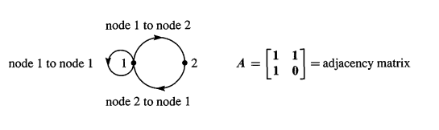

$A^2$ 的 `(i,j)` 元素是 $\sum a_{ik}a_{kj} = a_{i1} a_{1j}+…+ a_{in} a_{nj}$. 为什么这个和,可以计算出从 `i` 节点到 `j` 节点的的两步路径?如下
$$
\left[ \begin{array} { l l } 1 & 1 \\ 1 & 0 \end{array} \right] ^ { 2 } = \left[ \begin{array} { l l } 2 & 1 \\ 1 & 1 \end{array} \right]

\quad \color{orange} \text{2步路径:} \quad 

\left[\begin{matrix} 
1\rightarrow 2 \rightarrow 1,	1 \rightarrow 1 \rightarrow 1 & 
1\rightarrow 1 \rightarrow 2 \\
2\rightarrow 1 \rightarrow 1 &  2\rightarrow 1 \rightarrow 2\\
\end{matrix} \right]
$$
$A^k$ 的 `(i,j)` 元素计算的就是k步路径。 计算出每一对节点的3步路径,并且和 $A^3$ 比较.

解:如果有一条从节点 `i` 到节点 `k` ,并且有一条从节点 `k` 到节点 `j` 的路径,那么 $a_{ik} a_{kj}$ 是1. 这是一个两步路径. 而如果没有从 `i` 到 `k` 的路径,或者没有从 `k` 到 `j` 的路径, $a_{ik} a_{kj}$ 是0.所以 $a_{ik} a_{kj}$ 的和是从 `i` 点离开到达 `j` 点的2步路径之和.矩阵乘法刚好等于这个数目.

3步路径是由 $A ^ { 3 } = \left[ \begin{array} { l l } 3 & 2 \\ 2 & 1 \end{array} \right]$ 计算的 ,请自己验证一下.

看一下k步路径：$A^k$ 包含Fibonacci 数字 `0,  1,  1,2,3,5,8,13,  ...`  这些知识在`<01-06 #2>`.把A乘以 $A^k$  涉及到Fibonacci's规则 $F_{k+2}   =  F_{k+1}   +  F_k $  (比如  13=8+5):从节点1到节点1有13条6步路径,但是我也不能全部找到!
$$
( A ) \left( A ^ { k } \right) = \left[ \begin{array} { l l } 1 & 1 \\ 1 & 0 \end{array} \right] \left[ \begin{array} { l l } F _ { k + 1 } & F _ { k } \\ F _ { k } & F _ { k - 1 } \end{array} \right] = \left[ \begin{array} { l l } F _ { k + 2 } & F _ { k + 1 } \\ F _ { k + 1 } & F _ { k } \end{array} \right] = A ^ { k + 1 }
$$
$A^k$ 也可以计算单词,一个类似 `1-1-2-1` 的路径其实就是对应单词aaba,字母b不能出现重复是因为没因为没有从2-2的边.$A^k$  的 `i,j` 元素计算的是长度是 `k+1`,首字母是第 `i` 个字母而尾字母是第 `j` 个字母的单词


# 5. 逆矩阵

> innverse matrix


## 5.1. 导入

> 来自视频

现在看一个2-2的矩阵 $A=\left[\begin{matrix} 1 & 3 \\2 & 6 \\\end{matrix} \right]$, 如果知道行列式的知识,可以知道它行列式是0,所以没有逆.但也可用前面学的知识判断一下.假设 $AM = I$,那么 `I` 的列都是来自以A的列的线性组合.`I` 的第一列是(1,0),不可能是A的列(1,2),(3,6)的线性组合,因为 `(1,2),(3,6)` 在同一条直线上,它们的线性组合也肯定是在这一条直线上的,而`(1,0)`却不是在这条直线上的.这就是不可逆的列图像了.

还有一个更重要的解释.如果存在非0向量x,使得 `Ax  = 0`,那么矩阵没有逆.对于这个A,x是多少呢?这个x是 `(3,-1)`.(sp:因为这样表明列不是线性独立的,存在列的非0线性组合可以得到0向量).A的列是共线的,有一些列毫无贡献.所以不可逆.结论就是,**不可逆(奇异)矩阵,列的线性组合(乘以非0x)可以得到0.**

把矩阵变换成 $A = \left[\begin{matrix} 1 & 3 \\2 & 7 \\\end{matrix} \right]$ ,那么c1和c2是不共线的向量,它们的组合可以得到任意的向量.现在我们要找到它的逆
$$
\left[ \begin{array} { l l } 1 & 3 \\ 2 & 7 \end{array} \right] \left[ \begin{array} { l l } a & c \\ b & d \end{array} \right] = \left[ \begin{array} { l l } 1 & 0 \\ 0 & 1 \end{array} \right]
$$
A乘以(a,b)得到(1,0),乘以(c,d)得到(0,1),其实是**两组**2个方程2个未知数的方程组.所以**求逆矩阵和解方程组其实是一回事**.只是有多个方程组而已.A乘以A逆的第 `j` 列,得到 `I` 的第 `j` 列.系数矩阵A是相同的,不同的只是右侧的b.

求逆矩阵的方法就是GJ方法. 以上面的例子,消元增广矩阵 $\left[ \begin{array} { l l l l } 1 & 3 & 1 & 0 \\ 2 & 7 & 0 & 1 \end{array} \right]$,当 $\left[\begin{matrix} 1 & 3 \\2 & 7 \\\end{matrix} \right]$ 部分变为单位矩阵 `I` 的时候,$\left[\begin{matrix} 1 & 0 \\0 & 1 \\\end{matrix} \right]$部分就会变成逆矩阵.
$$
\left[ \begin{array} { l l l l } 1 & 3 & 1 & 0 \\ 2 & 7 & 0 & 1 \end{array} \right] 

\overset{1:左侧化为U}{\Longrightarrow}

\left[ \begin{array} { l l l l } 1 & 3 & 1 & 0 \\ 0 & 1 & -2 & 1 \end{array} \right]

\overset{2:r_1 - 3r_2}{\Longrightarrow}

\left[ \begin{array} { l l l l } 1 & 0 & -7 & -3 \\ 0 &1 & -2 & -1 \end{array} \right]
$$
在第1步,左边的两列已经是U了,但还可以继续化简！使得左侧变成单位矩阵,这时候右侧就是A的逆矩阵了

那么为什么 `[A I]` 经过GJ方法后可以化为 $[I\quad A^{−1}]$ 呢?. 回忆一下消去矩阵E.很多个E相乘A最终可以化为一个E乘以A.那么
$$
E[A,I] = [I,?]
$$
$EA = I$,那么 `E` 就是 $A^{−1}$ ,而 $A^{−1} I= A^{−1}$.这就是GJ方法求解逆矩阵的思想


---


**方阵可以求逆矩阵,而且如果逆存在,左逆=右逆** .假设A是一个方阵,我们想要找到一个**相同大小**的逆矩阵$A^{−1}$, 其乘以A结果就是单位矩阵`I`.A做了什么,$A^{−1}$ 就反着做什么,它们之间的作用相互抵消.它们的乘积是单位矩阵`I`,而 `I`对向量相当于是无作用的,所以 $A^{−1} Ax = x$.**但是 $A^{−1}$ 可能不存在**

将 $A^{−1}$ 乘以 `Ax= b` 得到 $A^{−1} Ax = A^{−1} b$.也就是 $x  = A^{−1} b$.乘积 $A^{−1} A$ 就像是先乘以一个数字,然后再除以同一个数字.一个数字当它不为0的时候有它的"逆数(inverse)"--但是矩阵就比较复杂和有趣了.矩阵 $A^{−1}$ 叫做A的逆(A Inverse)

> **Definition**
>
> ---
>
> 如果对于矩阵A,存在矩阵 $A^{-1}$ 满足下面等式,那么A称为**可逆的(inverrible)**
> $$
> A^{-1}A = I \quad \text{and} \quad AA^{-1} = I
> $$

**不是所有的矩阵都可逆**.对一个方矩第一个问题是:A可逆吗?我们不是一开始就计算$A^{-1}$.在多数问题当中,我们甚至**从不需要计算出来**!下面是对于 $A^{-1}$ 的6个提醒:

1. **当且仅当**消去产生了n个主元,逆矩阵存在(允许行交换),`<#5.4>` 证明。消去不用显式使用 $A^{-1}$,即可求解 Ax = b

2. 矩阵A不可能有两个逆矩阵.假设 `BA = I`.而且 `AC  =I`.那么B = C,这是因为:
$$
B(AC) = (BA)C \quad \Rightarrow \quad BI = IC \quad \Rightarrow B=C \tag{2}
$$
这就展示了,左逆B和右逆C必须是同一个矩阵

3. 如果A是可逆的,那么Ax = b的**唯一**的解就 $是x = A^{-1} b$

4. (重要)假设存在一个非0向量 x 满足 Ax = 0,那么A不可逆.没有矩阵,能将0转换回x!

5. 当且仅当ad - bc 不为0,一个 `[2 2]` 的矩阵是可逆的
$$
\text{[2,2] 矩阵}  : \left[ \begin{array} { l l } a & b \\ c & d \end{array} \right] ^ { - 1 } = \frac { 1 } { a d - b c } \left[ \begin{array} { r r } d & - b \\ - c & a \end{array} \right] \tag{3}
$$
数 `ad - bc` 是A的行列式.当**一个矩阵的行列式不为0的时候**,是可逆的(`<01-05>`).但我们**通常先进行n个主元的测试**,而不是行列式测试

6. 一个对角线矩阵(diagonal matrix),在对角线上的元素都不为0的时候,是可逆的
$$
A = \left[ \begin{array} { l l l } d _ { 1 } & & \\ & \ddots \\ & & d _ { n } \end{array} \right] \quad \text { then } A ^ { - 1 } = \left[ \begin{array} { l l l } 1 / d _ { 1 } \\ & \ddots \\ & & 1 / d _ { n } \end{array} \right]
$$

7. 

> 第5点证明(来自习题）从下面等式可以看出来：
> $$
> \left[ \begin{array} { l l } a & b \\ c & d \end{array} \right] \left[ \begin{array} { r r } d & - b \\ - c & a \end{array} \right] = \left[ \begin{array} { c c } a d - b c & 0 \\ 0 & a d - b c \end{array} \right]
> $$
> 

**例1** 矩阵 $\left[\begin{matrix} 1 & 2 \\1 & 2 \\\end{matrix} \right]$ 是不可逆的.因为

- 对于提醒5,测试是失败的
- 提醒4测试也是失败的,因为当x = (2,-1),Ax = 0
- 对于测试1,测试是失败的,因为没有2个主元,经过消去之后第2行都是0


## 5.2. 乘积AB的逆矩阵

> The Inverse of a product AB 

对于两个非0的数字a,b,和a+b可能是可逆的,也可能不是.比如 $a = 3,b = -3$,逆数分别是 `1/3,-1/3`,而和是0,不可逆.但是 $ab = -9$,逆数是 `-1/9`,也就是`1/3 * (-1/3)`

对于两个矩阵A,B,情况是类似的.对于A+B的逆矩阵是很难确定的,但是只要A,B分别是可逆的(当然形状需要一样),那么AB就是可逆的.重要的一点是, $A^{-1},B^{-1}$ 以**相反顺序出现**

如果A,B是可逆的,那么AB也是可逆的,AB的逆矩阵是:
$$
(AB)^{-1}= B^{-1}A^{-1} \tag{4}
$$
为了看看为什么顺序反了,我们将AB乘以$B^{−1} A^{−1}$ 看看:
$$
AB(B^{−1} A^{−1}) = AIA^{-1} = AA^{-1} = I
$$
这其实就是展示了一个数学的基本规则:逆以相反顺序出现(Inverses come in reverse order).再多的矩阵,也是反着来的
$$
\text{Reverse Order: } \quad (ABC)^{-1} = C^{-1}B^{-1} A^{-1} \tag{5}
$$


**例2 消去矩阵的逆矩阵**.  如果 E 把5倍 r1 从 r2 减去,那么 $E^{−1}$ 把5倍 r1 加到 r2 :
$$
E = \left[ \begin{array} { r r r } 1 & 0 & 0 \\ - 5 & 1 & 0 \\ 0 & 0 & 1 \end{array} \right] \text { and } E ^ { - 1 } = \left[ \begin{array} { l l l } 1 & 0 & 0 \\ 5 & 1 & 0 \\ 0 & 0 & 1 \end{array} \right]
$$
不管我们是先加然后再减( $EE^{−1}$ ),或者减再加( $E^{−1} E$ ),我们都回到了原点一样


**例3** 假设F从 `r3` 减去了 `4r2`,那么 $F^{−1}$ 把它加回来:
$$
F = \left[ \begin{array} { l l l } 1 & 0 & 0 \\ 0 & 1 & 0 \\ 0 & - 4 & 1 \end{array} \right] \quad \text { and } \quad F ^ { - 1 } = \left[ \begin{array} { l l l } 1 & 0 & 0 \\ 0 & 1 & 0 \\ 0 & 4 & 1 \end{array} \right]  \tag{6}
$$
现在,将F乘以例1的E,得到 `FE` .也把 $E^{−1}$  乘以 $F^{−1}$ 得到 $(FE)^{−1}$.注意顺序:$(FE)^{−1}  = E^{−1} F^{−1}$.
$$
F E = \left[ \begin{array} { c c c } 1 & 0 & 0 \\ - 5 & 1 & 0 \\ 20 & - 4 & 1 \end{array} \right] \quad \text { 的逆矩阵是 } \quad E ^ { - 1 } F ^ { - 1 } = \left[ \begin{array} { c c c } 1 & 0 & 0 \\ 5 & 1 & 0 \\ 0 & 4 & 1 \end{array} \right]
$$
这真是很美丽.乘积 `FE` 包含了 `20` 这个值,但是逆矩阵并没有.E将5倍 `r1` 从 `r2` 减去.然后F将新的 `r2`(由E改变)的4倍从 `r3` 减去.在这个顺序之下,`r3` 察觉到了 `r1` 的影响.

在 $E^{−1} F^{−1}$ 的顺序当中.这样的影响是不存在的.首先 $F^{−1}$ 把4倍 `r2` 加到 `r3`,然后,$E^{−1}$ 把5倍 `r1` 行1加到 `r2`.因为 `r3` 不再改变,所以没有 `20`.顺序 $E^{−1} F^{−1}$ 下,`r3` 不会察觉到 `r1` 的影响,**$E^{−1} F^{−1}$ 更快,乘数 `5,4` 直接放到对角线元素1下面**

特殊的乘法 $E^{−1} F^{−1},E^{−1} F^{−1}G^{-1}$ 在`<#6>`很有用,我们会再次解释一下.在这一节我们的目标是 $A^{−1}$,我们想要有一些方法来计算它.如下


## 5.3. 通过高斯-约当消去计算 $A^{−1}$

> Calculating $A^{-1}$ by Gauss-jordan Elimination  

前面提过,$A^{-1}$ 有**时候不是显式需要**的.方程 $Ax = b$ 的解是 $x = A^{-1}b$.但是计算 $A^{-1}$ 来乘以b有时候是不必要和不高效的.消去可以直接得到 `x` .消去其实也是计算 $A^{−1}$ 的方法,我们下面就会看到.GJ消去的思想就是求解 $AA^{-1}=I$,然后找到 $A^{−1}$ 的**每一列**

A乘以 $A^{−1}$ 的第一列 (设是 $x_1$ )得到 `I` 的第1列(设是 $e_1$ ).这就是我们的方程组:$Ax_1  = e_1=(1,0,0)$.还有另外两个方程组,都是A乘以 $A^{-1} $的列 $x_1,x_2,x_3$ 从而得到 `I` 的列:
$$
A^{-1}\text{的3列:} \quad

A A ^ { - 1 } = A \left[ \begin{array} { l l l } x _ { 1 } & x _ { 2 } & x _ { 3 } \end{array} \right] = \left[ \begin{array} { l l l } e _ { 1 } & e _ { 2 } & e _ { 3 } \end{array} \right] = I \tag{7}
$$
为了求一个 `[3 3]`矩阵A的逆,我们需要求解**三个**方程组
$$
Ax_1= e_1=(1,0,0)\\
Ax_2= e_2=(0,1,0)\\
Ax_3= e_3=(0,0,1)
$$
GJ方法是通过**同时求解**n个方程来计算 $A^{-1}$ 的.通常增广矩阵 `[A b]` 有一个附加的列b,. 现在我们有3个附加的列 $e_1,e_2,e_3 $(当A是3-3的时候). 它们都是 `I` 的列,所以增广矩阵实际上就是一个块矩阵 `[A I]` .我现在利用这次机会来逆转我最喜欢的矩阵K, 2在主对角线上,而-1在2的旁边:
$$
\begin{aligned} 

\left[ \begin{array} { r l l l } K & e _ { 1 } & e _ { 2 } & e _ { 3 } \end{array} \right] & = \left[ \begin{array} { r r r r r r } 2 & - 1 & 0 & 1 & 0 & 0 \\ - 1 & 2 & - 1 & 0 & 1 & 0 \\ 0 & - 1 & 2 & 0 & 0 & 1 \end{array} \right] 

\quad \color{orange} \text{Start GJ on K}

\\[4ex] & \rightarrow 

\left[ \begin{array} { r r r r r r } 2 & - 1 & 0 & 1 & 0 & 0 \\ 0 & \frac { 3 } { 2 } & - 1 & \frac { 1 } { 2 } & 1 & 0 \\ 0 & - 1 & 2 & 0 & 0 & 1 \end{array} \right] 

\quad \color{orange} \frac{1}{2}r_1 + r_2

\\[4ex] & \rightarrow 

\left[ \begin{array} { r r r r r r } 2 & - 1 & 0 & 1 & 0 & 0 \\ 0 & \frac { 3 } { 2 } & - 1 & \frac { 1 } { 2 } & 1 & 0 \\ 0 & 0 & \frac { 4 } { 3 } & \frac { 1 } { 3 } & \frac { 2 } { 3 } & 1 \end{array} \right] 

\quad \color{orange} \frac{2}{3}r_2 + r_3
\end{aligned}
$$

我们已经在寻找 $k^{−1}$ 的路上走了一半了.上面矩阵的前三列是U(upper triangular).主元分别是 `2,3/2,4/3`.都在对角线上,如果是高斯,他会使用向后替换来解决.但是Jordan的贡献在于使用消去来进行化简,直到得到了**简化阶梯形式(reduced echelon form)**: 行被加到它上面的行,从而使得主元上面可以产生0
$$
\left( \begin{array} { l } \text { Zero above } \\ \text { third pivot } \end{array} \right) \rightarrow \left[ \begin{array} { r r r r r r } 2 & - 1 & 0 & 1 & 0 & 0 \\ 0 & \frac { 3 } { 2 } & 0 & \frac { 3 } { 4 } & \frac { 3 } { 2 } & \frac { 3 } { 4 } \\ 0 & 0 & \frac { 4 } { 3 } & \frac { 1 } { 3 } & \frac { 2 } { 3 } & 1 \end{array} \right] \quad 

\quad \color{orange}  \frac { 3 } { 4 } \text { row 3 +  row 2 }


\\[10ex]


\left( \begin{array} { l } \text { Zero above } \\ \text { second pivot } \end{array} \right) \rightarrow \left[ \begin{array} { l l l l l l } 2 & 0 & 0 & \frac { 3 } { 2 } & 1 & \frac { 1 } { 2 } \\ 0 & \frac { 3 } { 2 } & 0 & \frac { 3 } { 4 } & \frac { 3 } { 2 } & \frac { 3 } { 4 } \\ 0 & 0 & \frac { 4 } { 3 } & \frac { 1 } { 3 } & \frac { 2 } { 3 } & 1 \end{array} \right] 

\quad  \quad \color{orange}  \frac { 2 } { 3 } \text { row } 2 + \text { row } 1
$$
最后一步，是用它的主元除以它的每一行,新的主元都是1.那么在矩阵的前半部分都是 `I`,因为k是可逆的,那么 $[I,K^{−1}]$的后半部分就是 $K^{−1}$
$$
\begin{array}{r r r}
\text{divide by }& 2: \\
\text{divide by }& 3/2: \\
\text{divide by }& 4/3:
\end{array}

\quad 

\left[ \begin{array} { c c c c c c } 1 & 0 & 0 & \frac { 3 } { 4 } & \frac { 1 } { 2 } & \frac { 1 } { 4 } \\ 0 & 1 & 0 & \frac { 1 } { 2 } & 1 & \frac { 1 } { 2 } \\ 0 & 0 & 1 & \frac { 1 } { 4 } & \frac { 1 } { 2 } & \frac { 3 } { 4 } \end{array} \right] = \left[ \begin{array} { l l l l } I & x _ { 1 } & x _ { 2 } & x _ { 3 } \end{array} \right] = \left[ \begin{array} { l l } I & K ^ { - 1 } \end{array} \right]
$$

> sp:为什么可以直接一行行的除以一个数呢?从点乘来看,就是等式两边分别除以一个数.如果从AB乘法来看,A的第一行乘以整个B得到AB的第一行,所以可以整行的除

从`[3 6]` 的矩阵开始的 `[K I]`,我们得到了 $[I,K^{−1}]$.GJ方法求可逆矩阵A的思想其实就是:
$$
\text{Guass-Jordan:} \quad \text{Multiply } [A,I] \quad  \text{ by }\quad  A^{-1} \quad  \text{ to get } \quad [I,A^{-1}]  
$$
对于大矩阵,我们可能不想要计算 $A^{−1}$,但是对于小矩阵,得到逆矩阵是非常值得的.对于特殊的 $K^{−1}$,我们强调一下3个发现,因为这是一个重要的例子.我们引进词语 :对称,三对角,和行列式(symmetric,tridiagonal,determinant)

> sp:来自wikipedia:
>
> 1. Sparse matrix:稀疏矩阵,大部分元素是0
> 2. Dense Matrix::密集矩阵,大部分元素是1
> 3. Band Matrix:带状矩阵,所有的非0元素都在对角线上,这里的对角线,包括主对角线和和主对角线平行的线
> 4. tridiagonal Matrix:三对角矩阵,是一个带状矩阵,非0元素只存在于主对角线,主对角线下面的第一个对角线,和主对角线上面的第一个对角线

1. K在主对角线是对称的,$K^{−1}$ 也是
2. k是三对角的,只有3条非0对角线 但是 $K^{−1}$  时候没有0元素的密集矩阵,这就是我们不经常计算逆矩阵的原因.带状矩阵的逆矩阵通常都是一个密集矩阵.
3. 主元乘积是 $2(3/2) (4/3)  =  4$.  等于k的行列式


**例4** 下面是使用GJ方法求解 $A = \left[\begin{matrix} 2 & 3 \\4 & 7 \\\end{matrix} \right]$ 的逆矩阵的操作,有两个行操作和一个除法,来把主元变成1
$$
\left[ \begin{array} { l l } A & I \end{array} \right] 

= \left[ \begin{array} { l l l l } 2 & 3 & 1 & 0 \\ 4 & 7 & 0 & 1 \end{array} \right] 

\rightarrow \left[ \begin{array} { l l l l } 2 & 3 & 1 & 0 \\ 0 & 1 & - 2 & 1 \end{array} \right] 

\quad \text { (this is } \left. \left[ \begin{array} { l l } U & L ^ { - 1 } \end{array} \right] \right)

\\[4ex]

\rightarrow \left[ \begin{array} { r r r r } 2 & 0 & 7 & - 3 \\ 0 & 1 & - 2 & 1 \end{array} \right] \rightarrow \left[ \begin{array} { r r r r } 1 & 0 & \frac { 7 } { 2 } & - \frac { 3 } { 2 } \\ 0 & 1 & - 2 & 1 \end{array} \right] \quad \text { (this is } \left. \left[ \begin{array} { l l } I & A ^ { - 1 } \end{array} \right] \right)
$$
`X  =  inverse(A)` 的代码可以通过  `rref` 命令得到,也就是行最简形式.`<01-03>`讲解

```matlab
I = eye(n); 		% Define the n by n identify matrix
R = rref([A I]);	% Eliminate on the augmented matrix [A I]
X = R(:,n+1:n+n);	% Pick inverse of A from the last n columns of R
```


A必须是可逆的,不然消去无法把它化简为`I`.(也就是R的左半部分)

GJ方法求解 $A^{-1}$ 是昂贵的,需要对**n个**列求解了**n个**方程组. 有必要为 $A^{−1}$ 辩解一下,计算 $A^{−1}$  的耗费并不是 `Ax = b` 的n倍.令人惊奇的是,对于n列这个耗费只是乘以3.能够做到如此,是因为n个等式 $Ax_i   =  e_i$ 都是同样的系数矩阵`A` ,对于A,我们只需要进行一次的消去即可.$A^{−1}$ 的全部耗费需要 $n^3$ 消去步骤 ,而一个单独的 `x` 需要 $n^3  /3$. `<#6>`会计算这些耗费.


## 5.4. 奇异和可逆

> Singular versus Invertable 

我们现在回到中心问题,什么时候矩阵是可逆的?这一节的开始我们提出了主元测试:$A^{−1}$  只有在A有完整的n个主元的情况下才存在(允许行交换). 现在我们可以证明,使用GJ消去法:

> **证明：主元完整存在，A可逆**
>
> ---
>
> 1. 有了n个主元,消去会求解所有的 $Ax_i = e_i$,求得的每个解作为列向量 $x_i$,是 $A^{−1}$ 的列.到这里,就有了 $AA^{−1} = I$,所以 $A^{−1}$ 至少是右逆
> 2. 实际上,消去只是一系列乘以 $E's,P's $ 和一个 $D^{−1}$ 的操作
>
> $$
> \text{left-inverse}: (D^{-1} ...E...P...E)A = I \tag{9}
> $$
>
> - $D^{−1}$ 是用来除以主元的
> - 矩阵E是用来在主元之上和之下产生0的
> - P是在需要的时候用来交换行的
>
> `Eq(9)` 的左边的**乘法结果**矩阵明显就是一个左逆
>
> 当有了n个主元,我们达到了 $A^{−1} A=I$。**右逆和左逆是相等的**.这其实就是这一节开始的提醒2.所以一个正方形矩阵,当n个主元都存在的时候,总有一个双边逆(two-sided inverse).

然后再证明,如果 $AC = I$,那么A必须有n个主元.然后我们会推导,C也是一个左逆,$CA = I$.下面是证明思想（反证法）

> **证明：A可逆，主元完整存在**
>
> ---
>
> 1. 如果 A 没有n个主元,那么消去会得到一个全0行
> 2. 因为这些消去步骤是通过一个 **可逆的** M矩阵进行的,所以 `MA` 的其中一行全是0
> 3. 如果 $AC = I$ 是可能的,那么 `MAC = MI =  M`， `MA` 有全0行,乘以C后，也肯定有全0行，所以M有全0行
> 4. 但是一个可逆矩阵不可能有去全0行! 所以如果 $AC = I$, 那么A必须有n个主元


上面的分析经过4个步骤,但是结论很简单也很重要

> 消去过程,其实对**方阵** 的可逆性做了一次完全测试.当 A 存在 n 个主元,那么 $A^{−1}$ 就存在,而且 GJ 方法可以求得 $A^{−1}$.而且上述的分析,揭示的其实更多
> $$
> \text{如果} \quad AC= I \quad \text{那么}  \quad CA= I \quad \text{而且} C= A^{-1}
> $$


---

**例5** 如果 `L` 是一个主对角线是1的下三角,那么 $L^{−1}$ 也是: **一个三角矩阵,当且仅当对角线元素全非0的时候,才是可逆的.**

下面的L在主对角线上有1's,所以 $L^{−1}$ 也有.使用 `GJ` 方法来构造 $L^{−1}$.行减去行之间乘以主元,通常只在寻找逆矩阵的路上走了一半.但是 `L` 可以立刻得到逆矩阵.当 `I` 出现在左边的时候,$L^{−1}$ 就出现在右边了.
$$
\begin{aligned}

\color{orange} \text{G-J on triangular L:} \quad

[L,I] &= \left[ \begin{array} { l l l l l l } 1 & 0 & 0 & 1 & 0 & 0 \\ 3 & 1 & 0 & 0 & 1 & 0 \\ 4 & 5 & 1 & 0 & 0 & 1 \end{array} \right]


\\[6ex]

& \Rightarrow

\left[ \begin{array} { l l l l l l } 
1 & 0 & 0 & 1 & 0 & 0 \\ 
0 & 1 & 0 & -3 & 1 & 0 \\ 
0 & 5 & 1 & -4 & 0 & 1 \end{array} 
\right]
\color{orange} r2-3r_1,r3-4r_1,r3-5r_2


\\[6ex]

& \Rightarrow

\left[ \begin{array} { l l l l l l } 
1 & 0 & 0 & 1 & 0 & 0 \\ 
0 & 1 & 0 & -3 & 1 & 0 \\ 
0 & 0 & 1 & 11 & -5 & 1 
\end{array} \right]

=  

\color{orange} [I,L^{-1}]

\end{aligned}
$$
在 `L` 达到 `I` 的过程,其实也就是一系列消去矩阵 $ E =E_{32} E_{31} E_{21}$ 的乘法,也就是 $E[L,I] = [I,L^{-1}]$ .所以乘法结果 `E` 就是$L^{−1}$, $L^{−1}$ 的主对角线也都是1,也是一个下三角,注意 $L^{−1}$ 包含了11,也是也就是 $3*5 - 4$。但，这个11，在更好的顺序  $E_{21}^{−1} E_{31}^{−1} E_{32}^{−1}=  L$ 中不会出现。


## 5.5. 典型例题

**1.** 一个三角差分矩阵(triangular difference matrix) A的逆矩阵是一个三角和矩阵(triangular sum matrix S):
$$
\left[ \begin{array} { l l } A & I \end{array} \right] = \left[ \begin{array} { r r r | r r r } 1 & 0 & 0 & 1 & 0 & 0 \\ - 1 & 1 & 0 & 0 & 1 & 0 \\ 0 & - 1 & 1 & 0 & 0 & 1 \end{array} \right] \rightarrow \left[ \begin{array} { r r r | r r r } 1 & 0 & 0 & 1 & 0 & 0 \\ 0 & 1 & 0 & 1 & 1 & 0 \\ 0 & - 1 & 1 & 0 & 0 & 1 \end{array} \right] \\

\rightarrow \left[ \begin{array} { l l l | l l l } 1 & 0 & 0 & 1 & 0 & 0 \\ 0 & 1 & 0 & 1 & 1 & 0 \\ 0 & 0 & 1 & 1 & 1 & 1 \end{array} \right] = \left[ \begin{array} { l l } I & A ^ { - 1 } \end{array} \right] = \left[ \begin{array} { l l } I & \text { sum matrix } \end{array} \right]
$$
如果把 $a_13$ 改为-1,那么A的每一行的和都是0,等式 `Ax = 0` 将会得到一个非0解 `x = (1,1,1)`:这个新的A是不可逆的!

---

**2.** 使用GJ方法来逆**下三角**三角帕斯卡矩阵 L.回忆一下,L的每一个元素都是二项式系数(`<#4.6> 典型例题`).如下所示,下一行是1,4,6,4,1
$$
L = \left[ \begin{array} { l l l l } 1 & 0 & 0 & 0 \\ 1 & 1 & 0 & 0 \\ 1 & 2 & 1 & 0 \\ 1 & 3 & 3 & 1 \end{array} \right] = a b s ( \text { pascal } ( 4,1 ) )
$$
解: 开始对 `[L,I]` GJ
$$
[ L,I ] = \left[ \begin{array} { l l l l | l l l l } 1 & 0 & 0 & 0 & 1 & 0 & 0 & 0 \\ 1 & 1 & 0 & 0 & 0 & 1 & 0 & 0 \\ 1 & 2 & 1 & 0 & 0 & 0 & 1 & 0 \\ 1 & 3 & 3 & 1 & 0 & 0 & 0 & 1 \end{array} \right] 

\overset{\text{主元1下产生0}}{\rightarrow}

\left[ \begin{array} { l l l l | r l l l } 1 & 0 & 0 & 0 & 1 & 0 & 0 & 0 \\ 0 & 1 & 0 & 0 & - 1 & 1 & 0 & 0 \\ 0 & 2 & 1 & 0 & - 1 & 0 & 1 & 0 \\ 0 & 3 & 3 & 1 & - 1 & 0 & 0 & 1 \end{array} \right]

\\[10ex]


\overset{\text{主元2下产生0}}{\rightarrow}
\left[ \begin{array} { l l l l | r r r r } 1 & 0 & 0 & 0 & 1 & 0 & 0 & 0 \\ 0 & 1 & 0 & 0 & - 1 & 1 & 0 & 0 \\ 0 & 0 & 1 & 0 & \vec { 1 } & - 2 & 1 & 0 \\ 0 & 0 & 3 & 1 & 2 & - 3 & 0 & 1 \end{array} \right] 

\\[10ex]

\overset{\text{主元3下产生0}}{\rightarrow} \left[ \begin{array} { r r r r | r r r r } 1 & 0 & 0 & 0 & 1 & 0 & 0 & 0 \\ 0 & 1 & 0 & 0 & - 1 & 1 & 0 & 0 \\ 0 & 0 & 1 & 0 & 1 & - 2 & 1 & 0 \\ 0 & 0 & 0 & 1 & - 1 & 3 & - 3 & 1 \end{array} \right] = \left[ I，L ^ { - 1 } \right]
$$
全部的主元都是1！所以不用把行除以主元了！$L^{−1}$ 和L是很像的,只是奇数对角线元素都是负号.对于n-n的帕斯卡矩阵也是如此的,$L^{−1}$ 拥有**交替对角线(alternating diagonals)**

# 6. A= LU : 消去=因式分解

> - Elimination=Factorization:A = LU
> - 这一节综合了视频4

很多学生都会觉得数学课程太理论化了.但是这一节不是.这一节的目的就是用最有用的方式描述GJ消去法.线性代数的很多关键概念,当你仔细的看它们的时候,实际上就是矩阵的**因式分解(factorization of a matrix)**.原始的矩阵A变成2个或者3个特别矩阵的乘积.第一个分解,也是实践中最重要的分解: **来自于消去,因子L和U是三角矩阵**.


## 6.1. A = LU

消去步骤会把A变成U.我们现在会展示怎么逆这些步骤(把U变成A):可以通过一个下三角矩阵L得到,L的元素就是乘数 $\ell_{ij}$: 
$$
\begin{array} { l }

\text{从A到U:}  &\quad E _ { 21 } A = \left[ \begin{array} { r r } 1 & 0 \\ - 3 & 1 \end{array} \right] \left[ \begin{array} { l l } 2 & 1 \\ 6 & 8 \end{array} \right] =  \left[\begin{matrix} 2 & 1 \\ 0 & 5 \end{matrix} \right] = U 


\\[4ex]


\text{从U回到A:} &\quad  E _ { 21 } ^ { - 1 } U = \left[ \begin{array} { l l } 1 & 0 \\ 3 & 1 \end{array} \right] \left[ \begin{array} { l l } 2 & 1 \\ 0 & 5 \end{array} \right] = \left[ \begin{array} { l l } 2 & 1 \\ 6 & 8 \end{array} \right] = A \end{array}
$$
第二行就是分解 `LU = A`.我们把 $E_{21}^{−1}$ 写成了L.如果是更大的矩阵,包含了很多E,那么**L是它们所有的逆的乘积**

A到U的每一个步骤都乘以一个矩阵 $E_{ij}$,用来在 `(i,j)` 位置产生了一个0.为了描述清楚过程,我们用没有行交换发生的例子说明.如果A是3-3的,那么我们将会乘以 $E_{21},E_{31},E_{32}$ ,从而在 `(2,1),(3,1),(3,2)` 位置产生0.最终得到的是一个上三角矩阵。 现在把这些E放到另外一边,也就是它们的逆矩阵乘以U
$$
\left( E _ { 32 } E _ { 31 } E _ { 21 } \right) A = U \quad \text { 变成 } \quad A = \left( E _ { 21 } ^ { - 1 } E _ { 31 } ^ { - 1 } E _ { 32 } ^ { - 1 } \right) U \quad \text { 也就是 } \quad A = L U   \tag{1}
$$
这些逆操作是**相反的**顺序.这三个逆矩阵的乘积是L.最终我们得到 `A = LU`.我们停在这里,开始理解


### 6.1.1. 解释和例子

> Explanation and examples

**第1点:** 每一个逆矩阵 $E^{−1}$ 是一个下三角,**非**对角线的元素都是 $\ell{ij}$ ,来抵消 E 矩阵 $-\ell_{ij}$ 产生的减去。E 和 $E^{-1}$ 的对角线都是1。在我们上面的例子当中：
$$
\ell_{21} = 3,E = \left[\begin{matrix} 1 & 0 \\ -3 & 1 \end{matrix} \right]
,L = \left[\begin{matrix} 1 & 0 \\ 3 & 1 \end{matrix} \right]
$$
**第2点:** Eq(1) 展示的是一个下三角矩阵( $E_{ij}$ 们的乘积)乘以矩阵A,也展示了所有的 $E_{ij}^{−1}$  乘以U把U变回A.这些下三角矩阵的**逆的乘积**是L. 

使用这些逆矩阵的一个原因就是我们**想要分解A,而不是U**.逆形式(inverse form)得到A = LU.另外的惊喜是，L很容易求得的。参见第3点

**第3点:** 每一个乘数 $\ell_{ij}$ 都恰好的，不改变的位于 逆矩阵乘积 `L` 矩阵的 `(i,j)` 位置。通常矩阵乘法会打乱数字，但这里不会，这些逆矩阵乘法的顺序恰好保证了 $\ell's$ 不会变化，原因在下面的 Eq(3) 给出。

因为每一个 $E^{−1}$ 的主对角线都是1,最后的美好的一点就是: L也是如此的

> **A = LU(无行交换）总结**
>
> ---
>
> - 上三角U的主对角线都是主元
> - 下三角L的对角线都是1，而且乘数 $\ell_{ij}$ 在 L 的对角线之下	


**例1** 消去把 `1/2 r1` 从 `r2` 减去,然后把 `2/3 r2` 从r3减去.下三角L有 $\ell_{21} = 1/2,\ell_{23} = 2/3$, LU相乘得到A
$$
A = \left[ \begin{array} { l l l } 2 & 1 & 0 \\ 1 & 2 & 1 \\ 0 & 1 & 2 \end{array} \right] =

\left[ \begin{array} { l l l } 1 & 0 & 0 \\ \frac { 1 } { 2 } & 1 & 0 \\ 0 & \frac { 2 } { 3 } & 1 \end{array} \right] \left[ \begin{array} { l l l } 2 & 1 & 0 \\ 0 & \frac { 3 } { 2 } & 1 \\ 0 & 0 & \frac { 4 } { 3 } \end{array} \right] = L U
$$
`(3,1)` 位置的乘数是0,因为A的 `(3,1)` 元素是0,不需要继续操作,所以可以看到,L主对角线下的 `(i,j)` 元素就是 $\ell_{ij}$ !

---

**例2** 在例1当中,如果把A的左上角元素从2改为1.主元都变成了1.乘数现在都是1.当A是4-4的时候,也是这种模式
$$
A = \left[ \begin{array} { l l l l } 1 & 1 & 0 & 0 \\ 1 & 2 & 1 & 0 \\ 0 & 1 & 2 & 1 \\ 0 & 0 & 1 & 2 \end{array} \right] = \left[ \begin{array} { l l l l } 1 & & & \\ 1 & 1 & & \\ 0 & 1 & 1 & \\ 0 & 0 & 1 & 1 \end{array} \right] \left[ \begin{array} { l l l l } 1 & 1 & 0 & 0 \\ & 1 & 1 & 0 \\ & & 1 & 1 \\ & & & 1 \end{array} \right]
$$

这些LU的例子展示了一些重要的信息,在实践中是很重要的.**假设没有行交换发生**,我们怎么预测L,U当中的0元素呢?

- 当A的一行以0开始，L也是
- 当A的一列以0开始，U也是

当一行以0开始,我们不需要进行消去的步骤.所以有L有一个0,这可以节省计算时间.类似的,在列开始的0存活到U,但是请意识到,消去，矩阵中间的0可能会被填充。


### 6.1.2. 视频例子

> 来自视频4

#### 6.1.2.1. 2-2例子

我们从 `[2 2]` 矩阵 $A= \left[\begin{matrix} 2 &1 \\8 & 7 \\\end{matrix} \right]$,使用初等矩阵进行变换
$$
E _ { 21 }A = E_{21} \left[ \begin{array} { l l } 2 & 1 \\ 8 & 7 \end{array} \right] = \left[ \begin{array} { c c } 1 & 0 \\ - 4 & 1 \end{array} \right] \left[ \begin{array} { l l } 2 & 1 \\ 8 & 7 \end{array} \right] = \left[ \begin{array} { l l } 2 & 1 \\ 0 & 3 \end{array} \right] = U
$$
我们想要 A=LU ,那么在上式当中,`L` 是什么，它和 `E` 的关系是什么?**逆**!这是因为如果 `EA = U` 两边都乘以E的逆,那么就是 $A = E^{−1} U$.所以 $L = E^{-1}!$ 那么 $E^{-1}$ 是多少么？ 是 $\left[\begin{matrix} 1 &0 \\4 & 1 \\\end{matrix} \right]$ ,只需要 $E_{21}$ 改变一个正负号即可.最终我们得到的是
$$
\underbrace{\left[ \begin{array} { l l } 2 & 1 \\ 8 & 7 \end{array} \right] }_A

= 

\underbrace{\left[ \begin{array} { l l } 1 & 0 \\ 4 & 1 \end{array} \right] }_L

\quad

\underbrace{\left[ \begin{array} { l l } 2 & 1 \\ 0 & 3 \end{array} \right]}_U
$$
有时候我们会把主元单独列出来,也就是
$$
\underbrace{ \left[ \begin{array} { l l } 2 & 1 \\ 8 & 7 \end{array} \right]}_A 

= 

\underbrace{\left[ \begin{array} { l l } 1 & 0 \\ 4 & 1 \end{array} \right]}_{L}


\underbrace{\left[ \begin{array} { l l } 2 & 0 \\ 0 & 3 \end{array} \right]}_{D}

\underbrace{\left[\begin{matrix} - & - \\- & - \\\end{matrix} \right]}_U
$$
那么现在`U` 是什么呢? $DU_{new}  =U_{old}$.那么

- $U_{old}$ 的 `r1` 是 $U_{new}$  的 `r1` 的两倍
- $U_{old}$ 的 `r2` 是 $U_{new}$ `r2`的3倍

那么 $U_{new}$ 就是 $\left[\begin{matrix} 1 & 1/2 \\0 & 1 \\\end{matrix} \right]$ .现在 `LU` 变成 `LDU` 了(D是**对角矩阵**),`LDU`式子更加平衡:**LU都是三角矩阵,D是对角矩阵.**


#### 6.1.2.2. 3-3例子

假设矩阵A是 `[3 3]` 的,那么消元就是在主元下面产生0.也就是
$$
E_{32} E_{31} E_{21} A=U  \quad \text{（假设无行交换）}
$$
前面的3个E矩阵可以乘起来得到一个单独的矩阵E.但是我们想要$E^{−1}$ 出现在右侧,也就是`A = LU` 的 `L`.

- $E_{32} E_{31} E_{21} A=U →A=LU$,那么L就是那3个E的乘积的**逆**,也就是
- $A = LU →A= E_{21}^{−1} E_{31}^{−1} E_{32}^{−1} U$ ,L其实就是这些E的逆的乘积.

也许你会问,为什么我们需要逆的形式,而不是普通的 `EA = U` 的形式.我们举例解释一下.在 `[2 2]` 的时候,只会有一个E, `[3 3]` 的时候,就会有3个E(典型情况下).现在我们假设3-3例子当中,有
$$
E _ { 21 } = \left[ \begin{array} { c c c } 1 & 0 & 0 \\ - 2 & 1 & 0 \\ 0 & 0 & 1 \end{array} \right] , E _ { 32 } = \left[ \begin{array} { c c c } 1 & 0 & 0 \\ 0 & 1 & 0 \\ 0 & - 5 & 1 \end{array} \right]

\text{没有} E_{31},\text{这里是为了简单说明}
$$
现在我们进行乘法,对角线都是1,对角线之上都是0.
$$
E _ { 32 } E _ { 21 } = \left[ \begin{array} { c c c } 1 & 0 & 0 \\ - 2 & 1 & 0 \\ 10 & - 5 & 1 \end{array} \right]
$$
这个 10 是个麻烦,不好处理.它是怎么来的呢?这是因为 $r2 - 2*r1$.而 $r3 - 5*r2$.所以 `r3` 一共加上了 `10*r1` ,因此出现了10.

现在我们使用逆的性质,反过来看一下:

$E^{−1}= E_{21}^{−1} E_{32}^{−1}$, $E_{21}$ 和 $E_{32}$ 的逆分别是什么呢? $E_{21}$ 原来是 $r2-2*r1$,现在加回去不就得了.那就是说
$$
E _ { 21 } ^ { - 1 } E _ { 32 } ^ { - 1 } = \left[ \begin{array} { l l l } 1 & 0 & 0 \\ 2 & 1 & 0 \\ 0 & 0 & 1 \end{array} \right] \left[ \begin{array} { l l l } 1 & 0 & 0 \\ 0 & 1 & 0 \\ 0 & 5 & 1 \end{array} \right]  

= \left[ \begin{array} { l l l } 1 & 0 & 0 \\ 2 & 1 & 0 \\ 0 & 5 & 1 \end{array} \right] = L
$$
结果是令人愉快的。 $EA = U$,而 $A = LU$.L形式矩阵相乘的顺序非常好,2和5不会冲突,不会得到10.这种顺序,消元的乘数(也就是2和5)还是在L里面的.这是关键,要求出L,不需要任何额外运算,只需要把所有的消元乘数都写进来,就能得到L. 

总结一下,对于A = LU,如果没有行交换,`消元乘数` 那个倍数,可以直接写进L中.因此,可以这样看待消元,只要消元步骤正确,可以在得到 `LU` 的过程中把A抛开,只要保留U，和消元乘数(在L里面),A是什么就可以不管了,因为A的信息都包含在 `LU` 了,因此,这是关于消元的全新认识,以矩阵形式进行消元更深刻的认识.

我们不知道一连串E的乘积E是什么,E矩阵并不令人着迷,令人着迷是把它们的逆的反顺序乘积放在另外一侧,这样可以轻松得到L.


### 6.1.3. A=LU的关键原因

试想一下，那些`需要被前面的行减去的主元行`(pivot rows)

1. 它们是A的原始行吗?不是,消去很大可能会改变它们
2. 它们是U的行吗? 是的，因为某行经过消去后，这个主元行再也不改变了

> sp:理解一下：所谓 `被前面的行减去的主元行`：就是r2开始啊，如A的r2，需要被r3,r4减去。而r2，也需要被r1减去
>
> 然后，**某一行经过消去之后，再也不改变了**，然后可以被后面的行继续减去。

当计算 U 的第 3 行的时候，我们减去的是**U的前面行，而不是A的**！
$$
U_{r3}  = A_{r3} - \ell _ { 31 } U_{r1} - \ell _ { 32 } U_{r2}

\tag{2}
$$
重写上述等式，可发现,行  $[ \ell_{31},\ell_{32},1]$ 是乘以U(sp:这个 `1` 是 $\ell_{33}$ )
$$
A_{r3} =  \ell _ { 31 } U_{r1} + \ell _ { 32 } U_{r2} + 1U_{r_3}  \tag{3}
$$

**这就恰好是A = LU 的第三行！** **L 的第3行保留着 $[ \ell_{31},\ell_{32},1]$,**其他所有行都是如此。当**没有行交换发生，我们就有 A = LU。**

---

**例 4**  我们看一下上述思想过程 ：Ax = b 到 三角 的 Ux = c

> sp:来自习题3

$$
\begin{array} { l r r r } x + y + z = 5 & x + y + z = 5 & x + y + z = 5 \\ x + 2 y + 3 z = 7 & y + 2 z = 2 & y + 2 z = 2 \\ x + 3 y + 6 z = 11 & 2 y + 5 z = 6 & z = 2 \end{array}
$$

Ux = c 当中的 `z=2` 来自于 Ax = b 当中的 `x+3y+6z = 11` 减去 $\ell_{31} = 1$ 乘以方程1 ，再减去 $\ell_{32}$ 乘以新的方程2.我们可以从 Ux = c 的三行 `[1 1 1 5];[0 1 2 2];[0 0 1 2]` 恢复原始A,b 的最后一行 `[1 3 6 11]`
$$
\text{Row 3} \text { of } [ A,b ] = \left( \ell _ { 31 } \text { Row } 1 + \ell _ { 32 } \text { Row } 2 + 1 \right. \text { Row 3) of } [ U \quad c ]
$$
在矩阵语言下，这就是被L乘，也就是 $LU = A,Lc = b$ ！


### 6.1.4. 更好的形式：A = LDU

LU分解不是对称的,因为U的对角线是主元,而L的对角线是1.这很容易调整:  **把U除以包含主元的对角矩阵D**.这就就产生一个新的矩阵D,对角线上是1 ,也就是 $U_{old}  = DU_{new}$
$$
\text {Split U into:} \quad 
\left[ \begin{array} { c c c c c c } d _ { 1 } & & & \\ & d _ { 2 } & & \\ & & \ddots & \\ & & & & d _ { n } \end{array} \right] \left[ \begin{array} { c c c c } 1 & u _ { 12 } / d _ { 1 } & u _ { 13 } / d _ { 1 } & \cdot \\ & 1 & u _ { 23 } / d _ { 2 } & \cdot \\ & & \ddots & \vdots \\ & & & 1 \end{array} \right]
$$
这样的话,$U_{new}$ 对角线和 `L` 一样就变成了1.现在 `LU` 分解变成 `LDU`分解: `下三角L * 对角矩阵D  * 上三角U`:
$$
\text{The triangular facrorization can be written :} \quad A = L U \text { or } A = L D U
$$
每当你看见LDU,就可以理解为U的主对角线都是1,这是通过把 $U_{old}$ 的每一行除以此行第一个非0元素,也就是主元得到的
$$
\left[ \begin{array} { l l } 1 & 0 \\ 3 & 1 \end{array} \right] \left[ \begin{array} { l l } 2 & 8 \\ 0 & 5 \end{array} \right] \quad \text { splits further into } \left[ \begin{array} { l l } 1 & 0 \\ 3 & 1 \end{array} \right] \left[ \begin{array} { l l } 2 & \\ & 5 \end{array} \right] \left[ \begin{array} { l l } 1 & 4 \\ 0 & 1 \end{array} \right] \tag{4}
$$
主元2,5跑到D去了. 把行除以2,5在 $U_{new}$ 留下的行 `[1 4]`  和 `[0  1]`  而且主对角线变成1.乘数3还是在L里


## 6.2. 一个正方形系统=2个三角形系统

> One Square System=Two triangular Systems

L包含了消去的乘数的记录,我们怎么利用这些记录来求解Ax = b呢?下面是步骤

1. **分解(factor)**：把 A 分解为 LU  
2. **求解(solve)**: 用 L 对 b 进行前进消去，然后用 U 对 x 进行向后替换(Forward elimination on `b` using `L`,then back substitution for `x` using `U`)

一开始,我们使用增广矩阵 `[A b]` 来求解,但是很多的计算机系统会把 `A`和 `b` 分开处理,因为，消去的信息已经包含在 `L`和 `U` 里面,利用这些信息，可以在任何需要的时候，再处理b.  `LAPACK User Gudies` 的文档就有说明：

> This situation is so common and the savings are so important that no provision has been made for solving a single system with just one subroutine


那么求解阶段是对b是如何处理的呢?

1. 首先，对方程右边的 `b` ，利用L(包含了消去乘数，现在使用),进行**向前消去(forward elimination)**,使得 `b` 变成 `c`,c作为新的右边向量
2. 然后，是和以前一样，对 `Ux = c` 使用向后替换.那么原始的一个Ax = b的系统分解成两个三角系统:

$$
\text{Forward and backward:} \quad L c = b \quad \text { 然后求解 } \quad U x = c  \tag{5}
$$

为了验证这是正确的,把 `Ux = C` 乘以L,得到 `LUx = Lc` ,也就是 `Ax= b`

**例3** 对 `Ax = b` 向前消去,结束于 `Ux = c`
$$
Ax = b: \begin{cases}
u + 2 v &= 5 \\
4u+9v &= 21
\end{cases}

\quad  \text { 变成 }  \quad  U x = c:\quad 

\begin{cases}
u + 2 v &= 5 \\ 
v &= 1 
\end{cases}
$$

乘数是4,存在L里面,b使用这个乘数把21变为1
$$
L c = b：\quad  \left[ \begin{array} { l l } 1 & 0 \\ 4 & 1 \end{array} \right] [ c ] = \left[ \begin{array} { r } 5 \\ 21 \end{array} \right] \Rightarrow \quad 
c = \left[ \begin{array} { l } 5 \\ 1 \end{array} \right]

\quad \color{orange} \text{下三角系统}

\\

U x = c ：\quad  \left[ \begin{array} { l l } 1 & 2 \\ 0 & 1 \end{array} \right] [ x ] = \left[ \begin{array} { l } 5 \\ 1 \end{array} \right] \Rightarrow \quad 

x = \left[ \begin{array} { l } 3 \\ 1 \end{array} \right]  
\quad \color{orange} \text{上三角系统}
$$


## 6.3. 消去的花费

> The cost of elimination 

如果我们可以在PC上求解1000个方程,那么100000个呢?在科学计算当中,大系统是经常出现的.就算是三维情况下也可能经常出现百万个未知数.

1. 消去的第一个步骤,就是在第一列,在主元下面产生一整列的0.每在一个主元下面产生一个0,需要 `乘数*主元所在的行` ,再被`需要消去的行减去`.这需要 $n^2$ 次乘法和 $n^2$  次减法.其实实际的次数少一点,是 $n^2  −n$,因为 `r1` 并不需要改变

2. 下一步就是在第2个主元所在的列下面产生0元素.这时候其实可以看成是整个矩阵的数目变成 `n -1`.那么需要的数目可以估计为 $(n−1)^2$ 乘法和减法

3. 最终就是需要处理的矩阵越来越小,总的次数是
$$
n ^ { 2 } + ( n - 1 ) ^ { 2 } + \cdots + 2 ^ { 2 } + 1 ^ { 2 } = \frac { 1 } { 3 } n \left( n + \frac { 1 } { 2 } \right) ( n + 1 )
$$
当n很大的时候,近似于 $1/3 n^3$.所以，**对A进行消去需要大约  $1/3 n^3$ 乘法和 $1/3 n^3$ 减法**

4. 那么右边的b呢?我们把 $b_1$ 乘以乘数,然后被 $b_2,b_3…b_n$ 减去,有 $n - 1$ 步,下一次就是 $n -2$步....

5. 现在开始回代.计算 $x_n$ 需要一步就可以了,也就是除以最后一个主元. $x_{n−1}$ 需要2步... $x_1$ 需要n步(n-1个其他未知数替换，和一步用来除以第一个主元),那么右侧的总数:从b到c到x，也就是从上到下再从下到上--刚好是 $n^2$
$$
[ ( n - 1 ) + ( n - 2 ) + \cdots + 1 ] + [ 1 + 2 + \cdots + ( n - 1 ) + n ] = n ^ { 2 } \tag{6}
$$
右边的耗费比左边的少很多：**每一个右侧的b，需要 $n^2$ 次乘法和 $n^2$ 次减法**


### 6.3.1. 带状矩阵

一个带状矩阵(band matrix) B,在主对角线之上和之下，分别有w条**非零**对角线.在带状外围的0元素在消去后也会保留(L和U当中的0元素).把第一列置为0需要 $w^2$ 次乘法和减法(因为有w个非零元素在主元下面,每一个非零元素的行的长度是w),那么n行需要的次数不超过 $nw^2$

> sp:这里是这样的，如下左图，图中的d就是w.是针对每个 `[w-w]` 的小矩形消去即可，一共有n个，所以是 $nw^2$. 而每个 `[w-w]` 小矩阵的消去，只需要消去第一列！
>
> 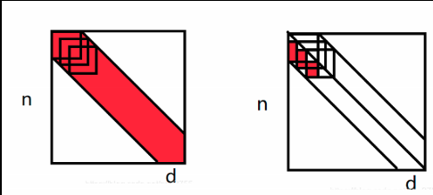


这可以节省很多时间
$$
\text{带状矩阵：} 
\begin{cases}
分解阶段：\quad \frac { 1 } { 3 } n ^ { 3 } \text { 变为 } n w ^ { 2 } \\
求解阶段：\quad n ^ { 2 } \text { 变为 } 2 n w	
\end{cases}
$$


## 6.4. matlab Ax =b 代码

> sp：还可参见 `<A10-01>`

下面是把A分解成LU很求解 `Ax = b` 的代码.代码  `slu` 在一遇到主元位置小于容忍度 `tol` 的时候就停止.这些代码在`web.mit.edu/18.06/www`.更加专业的代码,会查看每一列,寻找最大的可用主元来交换并且继续求解下去。MATLAB的反斜杠命令 `x  =  A \b` 组合了分解和求解,来得到x 

```matlab
function [L U] = slu(A)
% Square  factonzation with no row exchanges!
[n, n] = size(A); tol = I.e-6;
for k = 1 : n
if abs(A(k, k)) < tol
end % Cannot proceed without a row exchange: stop
L(k, k) = 1;
for i = k + 1 : n
L(i, k) = A(i, k)/A(k, k); % Multipliers for column k are put into L
for j = k + 1 : n % Elimination beyond row k and column k
A(i, j) = A(i, j) - L(i, k) * A(k, j); % Matrix still called A
end
end
for j = k : n
U(k, j) = A(k, j); % row k is settled, now name it U
end
end


function [L U] = slv(A)
% Solve Ax = b using L and U from slu(A).
[L, U] = slu(A); s = 0; % No row exchanges!
for k = 1 : n % Forward elimination to solve Lc = b
for j = 1 : k - 1
s = s + L(k, j) * c(j)); % Add L times earlier c(j) before c(k)
end
c(k) = b(k) - s; s = 0; % Find c(k) and reset s for next k
end
for k = n : -1 : 1 % Going backwards from x(n) to x(1)
for j = k + 1 : n % Back substitution
t = t + U(k, j) *x(j); % U times later x(j))
end
x(k) = (c(k) - t)/ U(k, k); % Divide by pivot
end
x = x'; % Transpose to column vector
```

求解Ax=b需要耗费多少呢?对于一个n=1000阶的随机矩阵,一个典型的时间是1秒.看 `web.mit.edu/18.06` 和`math.mit.edu/linearalgebra` 来得到在Matlab,Maple,Mathematica,CciLab,Python,R运行的时间..当n乘以2的时候,时间大概乘以8.如果需要专特代码,请看 `netlib.org`.

根据这个 $n^3$ 规则,10倍大的矩阵(10000阶)需要1000秒,而100,000需要100万秒.没有超级计算机的话,太昂贵了,但是记住,这些矩阵都是满矩阵,很多矩阵实际上是稀疏的,这时候 `A  = LU` 快很多.

对于三对角矩阵(tridiagonal matrices),假设10,000的话,我们只需要存储非0的元素,这时候求解 `Ax = b` 是轻而易举的事情,但是前提是代码能识别A是三对角矩阵.


## 6.5. 关键概念

1. 高斯消去把A分解成LU(没有行交换)
2. 下三角矩阵包含了数字 $\ell_{ij}$,这些数字是用来乘以主元行的，最终把A变成了LU。LU把U的行加起来，可以把U恢复成A.
3. 右侧,我们求解的是Lc = b(向前),然后是Ux = c(向后替换)
4. 分解:在左侧有 $1/3 (n^3  −n)$ 次乘法和减法
5. 求解:有右侧,有 $n^2$ 次乘法和减法
6. 对于带状矩阵, $1/3 n^3$ 变成 $nw^2$ , $n^2$ 变成 $2wn$


## 6.6. 典型例题


**1.** 我们已经在 `<#5> 典型例题2` 用GJ方法求出了下三角帕斯卡矩阵L的逆。现在我们把 L 和 对称帕斯卡矩阵 P 以及 上三角 U 联系起来。对称的帕斯卡P，每个元素都是上边元素和左边元素的和。n-n的对称P，在matlab中可用 `oascal(n)` 得到。现在我们来建立令人惊奇的 lower-upper 分解 : P = LU
$$
\text{psacal(4)} = \left[ \begin{array} { c c c c } 1 & 1 & 1 & 1 \\ 1 & 2 & 3 & 4 \\ 1 & 3 & 6 & 10 \\ 1 & 4 & 10 & 20 \end{array} \right] = \left[ \begin{array} { l l l l } 1 & 0 & 0 & 0 \\ 1 & 1 & 0 & 0 \\ 1 & 2 & 1 & 0 \\ 1 & 3 & 3 & 1 \end{array} \right] \left[ \begin{array} { l l l l } 1 & 1 & 1 & 1 \\ 0 & 1 & 2 & 3 \\ 0 & 0 & 1 & 3 \\ 0 & 0 & 0 & 1 \end{array} \right] = L U .
$$
P分解成U的过程是
$$
P = \left[ \begin{array} { c c c c } 1 & 1 & 1 & 1 \\ 1 & 2 & 3 & 4 \\ 1 & 3 & 6 & 10 \\ 1 & 4 & 10 & 20 \end{array} \right] 

\overset{\ell_{21},\ell_{31}，\ell_{41}=1}{\rightarrow }

\left[ \begin{array} { c c c c } 1 & 1 & 1 & 1 \\ 0 & 1 & 2 & 3 \\ 0 & 2 & 5 & 9 \\ 0 & 3 & 9 & 19 \end{array} \right] 

\overset{\ell_{32}=2，\ell_{42}=3}{\rightarrow }

\left[ \begin{array} { c c c c } 1 & 1 & 1 & 1 \\ 0 & 1 & 2 & 3 \\ 0 & 0 & 1 & 3 \\ 0 & 0 & 3 & 10 \end{array} \right] 

\overset{\ell_{43}=3}{\rightarrow }

\left[ \begin{array} { l l l l } 1 & 1 & 1 & 1 \\ 0 & 1 & 2 & 3 \\ 0 & 0 & 1 & 3 \\ 0 & 0 & 0 & 1 \end{array} \right] = U
$$
可以看见，乘数 $\ell_{ij}$ 完美的填充进 L。在下一节，我们会展示，对称矩阵的L和U有特别的联系。对于如上的帕斯卡矩阵，U就是L的转置。

你可能希望 Matlab 的 `lu(pascal(4))` 命令产生如上的L，U。但其实不会，因为 `lu` 命令会挑选每一列的最大的元素作为主元。所以第2列的主元从1变成3.但 `Cholesky factorization` 没有行交换 :`U = chol(pascal(4))`

帕斯卡矩阵有非常多令人惊奇的性质，我们还会遇见它的。

---

**2.** 上一题我们已经求解了P的LU，使用2个三角系统：`Lc = b,Ux = c`求解 `Px = b = (1,0,0,0)` 。对于这个b，意味着 x 是 $P^{-1}$ 的第一列

**解：** Lc = b 的三角系统从上到下求解：
$$
\begin{array} { l l l } c _ { 1 } & = 1 & c _ { 1 } = + 1 \\ c _ { 1 } + c _ { 2 } & = 0 & c _ { 2 } = - 1 \\ c _ { 1 } + 2 c _ { 2 } + c _ { 3 } & = 0 & c _ { 3 } = + 1 \\ c _ { 1 } + 3 c _ { 2 } + 3 c _ { 3 } + c _ { 4 } & = 0 & c _ { 4 } = - 1 \end{array}
$$
而解 x 是从下到上向后替换得到
$$
\begin{aligned} x _ { 1 } + x _ { 2 } + x _ { 3 } + x _ { 4 } & = 1 & & x _ { 1 } = + 4 \\ x _ { 2 } + 2 x _ { 3 } + 3 x _ { 4 } & = - 1 & \text { gives }\quad & x _ { 2 } = - 6 \\ x _ { 3 } + 3 x _ { 4 } & = 1 & & x _ { 3 } = + 4 \\ x _ { 4 } & = - 1 & & x _ { 4 } = - 1 \end{aligned}
$$
x还有有一个模式啊，是什么呢？试试 `inv(pascal(4))`:

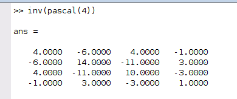


# 7. 转置和排列

> Transposes and Permutations

A的转置，用 $A^{T}$ 表示，$A^{T}$ 的列，就是A的行，转置的公式其实就是
$$
\text{交换行和列：} \quad  (A^T)_{ij}= A_{ji}
$$
转置的规则是很直观的,A+B的转置是$(A+B)^T$,其实也就是 $A^T+ B^T$,也就是说可以逐个转置。比较值得注意的是乘积AB的转置和逆矩阵 $A^{−1}$ 的转置
$$
\begin{aligned}

\text{Sum： A+B 的转置是:} \qquad   &A^T+ B^T  \qquad \qquad (1) \\
\text{Product： AB 的转置是:} \qquad   &(AB)^T = B^TA^T \qquad (2) \\
\text{Inverse：} A^{-1} \text{ 的转置是:} \qquad   &(A^{-1})^T = (A^T)^{-1} \qquad (3) \\

\end{aligned}
$$

反顺序的 $(AB)^T = B^T A^T$ 值得注意,为了理解,从$(Ax)^T= x^T A^T$ 开始,**Ax 组合A的列,而 $x^T A^T$ 组合 $A^T$ 的行**,这其实是对相同向量组的相同的线性组合!在A的时候是列向量, $A^T$ 是行向量,所以对列 `Ax` 的转置是 $x^T A^T$.公式 $(Ax)^T= x^T A^T$ 是吻合的,现在开始证明$(AB)^T= B^T A^T$,B多列

如果 $B = [x_1,x_2]$,有两列,对每一列都应用相同的思想,AB的列是 $Ax_1$ 和 $Ax_2$.它们的转置是 $B^T A^T$ 的行
$$
\text{转置} \quad A B = \left[ \begin{array} { l l l } A x _ { 1 } & A x _ { 2 } & \cdots \end{array} \right] \text { 得到 } \left[ \begin{array} { c } x _ { 1 } ^ { \mathrm { T } } A ^ { \mathrm { T } } \\ x _ { 2 } ^ { \mathrm { T } } A ^ { \mathrm { T } } \\ \vdots \end{array} \right] \text { 也就是  } B ^ { \mathrm { T } } A ^ { \mathrm { T } } \tag{4}
$$
这个规则可以扩展到多个:$(ABC)^T= C^T B^T A^T$。**对于分解： A = LDU, $A^T = U^TD^TL^T$,其中,主元矩阵 $D = D^T$。** 现在把这个规则应用到 $A^{−1} A=I$,得到
$$
\text{逆矩阵的转置:}\quad  A^{-1}A = I \quad \text{转置为} \quad A^T(A^{-1})^T = I \tag{5}
$$

也就是说 $(A^T)^{−1}= (A^{−1})^T$,特别注意, **$A^T$ 是可逆的,当且仅当A是可逆的**。


## 7.1. 点乘的意义

> The meaning of inner Product 

对于点乘 $x \cdot y$,用矩阵的语言与更好的写法：

- $^T$ 在里面: 点乘或者内乘是： $x^Ty$, 是 $[1,n] [n,1]$ ,一个数字
- $^T$ 在外面: **秩1**乘法或者**外**乘是： $xy^T$, 是 $[n,1] [1,n]$,一个矩阵

我们非常接近应用数学的核心了，但还有一点需要强调，是关于点乘和A的转置的深深联系：我们定义 $A^T$ 是关于A的对角线的翻转。这有点不数学，有更好的方法：$A^T$ 是对任何x,y，都能使得下面等式成立的矩阵：
$$
( A x ) ^ { \mathrm { T } } y = x ^ { T } \left( A ^ { \mathrm { T } } y \right) \quad  \text{Ax 和 y 的点乘}   =    x 和 A^Ty 的点乘
$$

> sp:注意上面左右都是 **数字**。

**例1** 看如下向量和和**差分**矩阵
$$
A = \left[ \begin{array} { r r r } - 1 & 1 & 0 \\ 0 & - 1 & 1 \end{array} \right] \quad x = \left[ \begin{array} { l } x _ { 1 } \\ x _ { 2 } \\ x _ { 3 } \end{array} \right] \quad y = \left[ \begin{array} { l } y _ { 1 } \\ y _ { 2 } \end{array} \right]
$$
那么有:
$$
(Ax)^Ty = (x_2  − x_1)y_1+(x_3  − x_2)y_2 
$$
$A^T$ 必须是 
$$
A ^ { \mathrm { T } } = \left[ \begin{array} { r r } - 1 & 0 \\ 1 & - 1 \\ 0 & 1 \end{array} \right]
$$
验证一下
$$
A^Ty = \left[\begin{matrix} 
-y_1  \\
y_1 - y_2  \\
y_2  \\
\end{matrix} \right]

\Rightarrow \quad 

x^T (A^T y)= x_1 (−y_1 )+ x_2 (y_1−y_2 )+ x_3 (y_2 )
$$
结果和期望一致.

> sp:再看一下习题6，更直观的理解

---

**例2** 可以提一下微积分吗，这真的很重要，不然我不会离开线代的主题。(这就是线性代数方式下的函数 `x(t)` ).例1的差分矩阵的作用是一个导函数  `A = d/dt`(sp:参见`<01-01> #4.2`,那里提到过差分矩阵就像是求导一样),它的转置来自于 `(dx/dt,y) = (x,dy/dt)` 

根据定义,点乘是 $x_ky_k$ 的有限项求和,可以看成是函数 `x(t)y(t)` 的积分
$$
( x , y ) =  x ^ { \mathrm { T } } y  = \int _ { - \infty } ^ { \infty } x ( t ) y ( t ) d t
$$

> sp:上式最左边的 `(x,y)` 应该表示的就是 `x,y` 做点乘的意思,不然说不通啊

根据转置规则 $( A x ) ^ { \mathrm { T } } y = x ^ { T } \left( A ^ { \mathrm { T } } y \right) $:
$$
(Ax,y) =  (x,A^Ty) \Rightarrow \quad  \int _ { - \infty } ^ { \infty } \frac { d x } { d t } y ( t ) d t = \int _ { - \infty } ^ { \infty } x ( t ) \left( - \frac { d y } { d t } \right) d t   \tag{6}
$$

希望你看懂了上面**分部积分**(sp:参见 `<calculus/01-09 #1>`).`Eq(6)`当中,对左边 `x(t)` 的求导,转换到对右边 `y(t)` 的求导,这个过程需要添加一个负号.这告诉我们,**对导数的转置,是这个导数的负数(sp:乘以-1的意思)(the "transpose" ofthe derivative is minus the derivative)**

导数是**反对称(anti-symmetric)**的, $A = d/dt$ , 而 $A^T = -d/dt$.对称矩阵有 $A = A^T$,而反对称矩阵是 $A^T = - A$.以某种方式,例1的 2-3 差分矩阵是这种模式.  3-2 的 $A^T$ ,它在第2个分量,产生了 $y_1 - y_2$,而不是 $y_2 - y_1$ (sp:是差分矩阵A的话,产生的就是 $y_1-y_2$,而转置 $A^T$ 产生的恰好是乘以 `-1`)

> sp:总结一下这一题的思想吧,如果把**差分A矩阵看成是求导,点乘的意义看成是积分** ,那么`(6)` 在 **线代方式下是成立的.** `(6)` 有点像是微积分的分部积分.大概意思就是如此.
>
> 但这其实有点不对经,分部积分公式是
> $$
> \int _ { - \infty } ^ { \infty } \frac { d x } { d t } y ( t ) d t = \left. x ( t ) y ( t ) \right| _ { - \infty } ^ { \infty } - \int _ { - \infty } ^ { \infty } x ( t ) \frac { d y } { d t } d t
> $$
> 如果是这种模式的话,那么`(6)` 最右边少了一个部分.所以上面说是 **线代方式下**. 这里应该只是强调转置操作有更多的意义.在 [stackexchange](https://math.stackexchange.com/questions/2985768/how-does-the-transpose-of-the-derivative-equal-minus-the-derivative) 上也有这个讨论


## 7.2. 对称矩阵

> Symmetric Matrices 

在我看来,对称矩阵是最重要的矩阵!

> **Definition**
>
> ---
>
> 对称矩阵是 $A^T = A$,这意味这 $a_{ji} = a_{ij}$

**对称矩阵的逆矩阵还是对称矩阵**,这是因为
$$
(A^{−1})^T= (A^T)^{−1}= A^{−1}
$$
所以 $A^{−1}$ 也是一个对称矩阵。非对称矩阵的逆矩阵也是非对称矩阵,参见习题2


## 7.3. 对称乘积 $R^T R,RR^T  , LDL^T$

> Sysmetric Products $R^T R$  and $RR^T$  and $LDL^T$

下面,我们通过**==任何==矩阵 $R,R^T$ 来产生对称矩阵!** 选择**任何**矩阵R,矩形也可, $R^T$ 和 $R$ 的乘积 $R^TR$ 就自动是一个**对称==方阵==**,这是因为:
$$
(R^TR)^T =   R^T(R^T)^T = R^TR \tag{7}. 
$$
`Eq(7)` 证明了 $R^T R$ 是一个对称矩阵. 我们还可以通过 $R^T R$ 的元素分析一下: $R^T R$ 的 `(i,j)` 元素是 $R^T$ 的 `行i` (R的`列i` ) 乘以R的`列j`.而 `(j,i)` 位置的元素也是R的 `列j` 和 `列i` 的点乘,所以 $R^T R$ 是对称的

$RR^T$ 也是对称的,但是和 $R^TR$的形状是不一样的,如果R 是 `m-n` 矩阵

- $R^T R$ 是 `[n n]`
- $RR^T$ 是 `[m-m]`

就算 `m=n` , $R^T R$ 和 $RR^T$ 都基本上不一样! 注意, $RR^T$ 和 $R^T R$ 的**主对角线的元素都是正值的**(参见例4).在经验当中,**大多数从矩形矩阵R开始的科学问题,基本上都是以 $R^TR,RR^T$ 的方式进行的!**最起码对最小二乘是如此.(sp:所以这很重要)

**例3** 设 $R = \left[ \begin{array} { r r r } - 1 & 1 & 0 \\ 0 & - 1 & 1 \end{array} \right]$,那么进行一下乘法
$$
R R ^ { T } = \left[ \begin{array} { r r } 2 & - 1 \\ - 1 & 2 \end{array} \right] \quad  R ^ { \mathrm { T } } R = \left[ \begin{array} { r r r } 1 & - 1 & 0 \\ - 1 & 2 & - 1 \\ 0 & - 1 & 1 \end{array} \right]
$$
都是对称矩阵.而且对角线的主元都是正值,因为对角线的元素**来自于列和自身的点乘**.


### 7.3.1. 消去当中的对称矩阵

> Sysmmetric matrices in elimination 

$A^T=A$ 让消去过程进行的更快,因为我们可以只对一半矩阵(包括对角线)进行操作.确实,上三角U大概率不是对称的,**对称存在于3矩阵乘法 `A = LDU`** .记住由主元构成的对角矩阵 `D` 的元素可以被除,从而让L,U的对角线的值都是1
$$
\begin{aligned} 

\left[ \begin{array} { l l } 1 & 2 \\ 2 & 7 \end{array} \right] 

& = \left[ \begin{array} { l l } 1 & 0 \\ 2 & 1 \end{array} \right] 

\left[ \begin{array} { l l } 1 & 2 \\ 0 & 3 \end{array} \right] 

\color{orange} \text{LU没有捕捉到A的对称性}

\\ 

& = 

\left[ \begin{array} { l l } 1 & 0 \\ 2 & 1 \end{array} \right]  \left[ \begin{array} { l l } 1 & 0 \\ 0 & 3 \end{array} \right] 

\left[ \begin{array} { l l } 1 & 2 \\ 0 & 1 \end{array} \right] 

\color{orange} \text{LDU捕捉到了A的对称性,U就是} L^T!

\end{aligned}
$$
当A是对称的, `A = LDU` 就可以变成 $A = LDL^T$ ,**最终U(主对角线是1)变成 $L^T$,而包含主元的对角矩阵D,本身就是对称的**

> **NOTE**
>
> ---
>
> 如果 $A = A^T$ 被没有行交换的分解为 LDU, 那么U其实就是 $L^T$.对称矩阵的对称分解(symmetric factorization)是 $A = LDL^T$

注意,$LDL^T$ 的转置是 $L^{TT} D^T L^T= LDL^T$ ! 从侧面说明了对称性.消去的耗费就可以减少一半,从 $n^3/3$ 变成 $n^3/6$.需要的存储基本上也减少一半,我们只需要保存 $L,D$,因为U就是 $L^T$


## 7.4. 置换矩阵

> Permutation matrices

转置在置换矩阵当中有特殊的作用.`P` 矩阵的每一行一列都只有一个1.那么 $P^T$ 也是一个置换矩阵-可能和P相同也可能不是,任何乘积 $P_1 P_2$ 也是一个置换矩阵.重排列 `I` 的行,就可以得到所有的置换矩阵.

最简单的置换矩阵就是`I`(没有行交换). 第二简单的就是 $P_{ij}$,也就是交换 `I` 的 行`i` 和 行 `j`. 对`I` 进行所有可能的行交换,我们就得到的所有的置换矩阵:

> **Defintion**
>
> ---
>
> 一个置换矩阵 P ,就是 `I` 的行以任意顺序分布


**例4** 3-3的矩阵有6个置换矩阵
$$
I = \left[ \begin{array} { c c c } 1 & & \\ & 1 & \\ & & 1 \end{array} \right] \quad 

P _ { 21 } = \left[ \begin{array} { c c c } & 1 & \\ 1 & & \\ & & 1 \end{array} \right] \quad 

P _ { 31 } = \left[ \begin{array} { c c c } & & 1 \\ & 1 & \\ 1 \end{array} \right] \quad 

P _ { 32 } = \left[ \begin{array} { c c c } 1 & & \\ & & 1 \\ & 1 & \end{array} \right] \quad

\\[6ex]

P _ { 21 } P _ { 32 } = \left[ \begin{array} { c c c } & & 1 \\ 1 & &  \\ & 1 & \end{array} \right]

P _ { 32 } P _ { 21 } = \left[ \begin{array} { c c c } & 1 & \\ &  & 1 \\ 1  & & \end{array} \right]
$$
n阶矩阵就有 `n!` 个置换矩阵.其实就是n的阶乘啊,所以叫置换

**重要**,$P^{−1}$ 也是置换矩阵.在上面的6个置换矩阵当中

- 前面4个矩阵的逆矩阵就是本身,一次行交换的置换矩阵的逆矩阵就是本身,而且 $P^T = P \Rightarrow P^2 = I$
- 后面2个矩阵互为逆矩阵.2次行交换的 $P_{32} P_{21}$,如果需要恢复到 `I` ,顺序需要调转,所以它的逆矩阵是 $P_{21} P_{32}$

**更重要**:  **$P^{−1}$ 总是等于 $P^T$** , 为什么呢? 当我们做 $PP^T$ 乘法, P 当中的第一行的`1`,总能遇到 $P^T$第一列中的 `1`.其他也是如此,所以 $PP^T=I$ .


## 7.5. 行交换的分解:PA = LU

> The PA = LU Factorization with  row exchange

我们以前讨论的都是没有行交换的,也就是 $...E_{ij}...E_{21}A = U$,每一个消去步骤都是 $E_{ij}$ 的作用,并且可以被  $E_{ij}^{-1}$ 抵消,所以 $(A = E_{21}^-1...E_{ij}^{-1}...)U$.这些逆矩阵可以合并成一个 L ,从而 $A = LU$

这是很棒的分解,但是有时候不起作用啊,因为需要行交换产生主元.这种情况下,A = LU的形式是 $A = (E^{−1}…P^{−1}…E^{−1}…P^{−1}…)U$.每一个的行交换是通过 $P_{ij}$ 进行的,也是通过 $P_{ij}$ 逆转的

> sp:因为 $P_{ij}$ 是一行交换的矩阵,逆矩阵和本身相等,再者,如前所述,置换矩阵的逆等于其本身

这些,置换矩阵 $P_{ij}$ 可以组合到单一一个置换矩阵`P`,这样的话就可以给任何一个可逆矩阵A分解,这才是我们想要的.

那么现在的问题就是如何收集这些 $P_{ij}$.有两种可能

1. 在消去之前就进行所有的行交换.
行交换可以提前进行,**矩阵乘积**P, 把 A 的行放置到合适的位置,所以对于 PA 不再需要再进行行交换,那么 $PA= LU$
$PA = LU$的形式在很多计算中使用(包括Matlab).所以==我们下面关注这个形式==.大多数数值计算,基本不会使用另外的方式
2. 或者在消去**完成**之后,在**所有**的 $E_{ij}$ **后**进行行交换. 在消去完成后,主元的顺序很奇怪, $P_1$ 矩阵把 $U_1$ 的主元调整到正确的三角位置(correct triangular order),所以置换矩阵 $P_1$ 在中间,也就是 $A = L_1P_1U_1$

> sp:首先要知道,其实只要矩阵可逆,就可以消去,不然根本没有完整的主元..所以上面的方式2的意思是,先完全进行消去,但这样以后,$U_1$ 就不是上三角的,所以有 $P_1$ 来调整 $U_1$ 里面的主元.也就是
>
> $PEA = U_1 \rightarrow A= E^{-1}P^{-1} U_1$，左边的E可能表示多个消去，最后由P切换到上三角的 $U_1$。  而右边 $E^{-1}$ 就是 $L_1$,而且 $P^{-1}$ 本身也是一个置换矩阵，所以可以写成 $A = L_1P_1U_1$,参见习题4.
>
> 但方式1才是常用的


对于下面的矩阵A,r1,r2交换之后,就可以不断消去了,是方式1.
$$
\underbrace{\left[ \begin{array} { l l l } 0 & 1 & 1 \\ 1 & 2 & 1 \\ 2 & 7 & 9 \end{array} \right]}_A \rightarrow 

\underbrace{\left[ \begin{array} { l l l } 1 & 2 & 1 \\ 0 & 1 & 1 \\ 2 & 7 & 9 \end{array} \right]}_{PA} 

\rightarrow 

\underbrace{\left[ \begin{array} { l l l } 1 & 2 & 1 \\ 0 & 1 & 1 \\ 0 & 3 & 7 \end{array} \right] }_{\ell_{31} = 2}

\rightarrow 

\underbrace{\left[ \begin{array} { l l l } 1 & 2 & 1 \\ 0 & 1 & 1 \\ 0 & 0 & 4 \end{array} \right]}_{\ell{32 = 3}}
$$
如下是P和PA,PA各行的顺序都很好,从而像以前一样分解为LU
$$
\boldsymbol { P } = \left[ \begin{array} { l l l } 0 & 1  & 0 \\ \ 1  & 0 & 0 \\ 0 & 0 & 1 \end{array} \right] \quad P A = \left[ \begin{array} { l l l } 1 & 0 & 0 \\ 0 & 1 & 0 \\ 2 & 3 & 1 \end{array} \right] \left[ \begin{array} { l l l } 1 & 2 & 1 \\ 0 & 1 & 1 \\ 0 & 0 & 4 \end{array} \right] = L U

\tag{8}
$$

从A开始我们最终得到了U,**唯一的要求就是A的可逆性**

> **NOTE**
>
> ---
>
> 如果A是可逆的,那么一个置换的P矩阵,将会把A的所有行,都放置到合适的位置,从而 $PA= LU$.而A的可逆性,要求行交换后,需要有完整的主元

---

在 Matlab, `A([r k],:) = A([k r],:)` 是交行 `k` 和之下 行 `r`  的方式.然后 `LU` 代码更新 `L,P` 和 `P` 的正负性.下面是 `[L,U,P] = lu(A)` 代码的一部分(sp：下面代码没有研究）

```matlab
A([r k],:) = A([k r],:);			% 交换A的行k,行 r
L(r k],1 :k-1)=L(k r],1 :k-1); 		 % 
P(r k],:) =P([k r],:); 				% 交换P的行k,行 r
sign =-sign
```

`sign`的正负性会告诉我们行交换的奇偶性,负数就表示是奇数次行交换.在开始的时候,`P` 是`I`,`sign = +1`. `sign` 最终的值就是P的行列式,而且不取决于行交换的顺序

对于PA,我们最终得到了熟悉的LU.在时间当中,`lu(A)` 通常不使用第一个可用的主元.因为虽然在数学上我们接受很小的主元,主要不是0即可,但在实践当中,由计算机查找一整列寻找最大的可用主元,是更好的.(`<01-09 #1>` 会解释,为什么这种 **partial pivoting** 技巧可以降低舍去误差(roundoff error)).所以P最终会包含一些不是代数需要的行交换,但最终还是 $PA = LU$

建议是,知道原理,然后让计算机去实际的计算.A = LU的计算,手动做的话,已经很复杂了. 代码.在 `<A10-01.md>`,代码  

- `splu(A)` 分解 PA = LU,如果第k列找不到主元,就会停止,因为这表示A不可逆
- `splv(A)` 对任何可逆的A求解 Ax  = b.


## 7.6. 典型例题

**1.** 对 A 应用P,破坏了A的对称性
$$
P = \left[ \begin{array} { l l l } 0 & 1 & 0 \\ 0 & 0 & 1 \\ 1 & 0 & 0 \end{array} \right] \quad A = \left[ \begin{array} { l l l } 1 & 4 & 5 \\ 4 & 2 & 6 \\ 5 & 6 & 3 \end{array} \right] \quad P A = \left[ \begin{array} { l l l } 4 & 2 & 6 \\ 5 & 6 & 3 \\ 1 & 4 & 5 \end{array} \right]
$$
什么矩阵Q,当作用到 PA 的**列** 上的时候,也就是 PAQ,可以恢复A的对称性? (A的主对角线必须要是1,2,3,但可能不是这个顺序).再证明,$Q = P^T$,所以对称性可由 $PAQ = PAP^T$ 存储.

解:为了恢复对称性，需要把1，2，3放回对角线去。那么

- PA 的 C2 需要放到 C1
- PA 的 C3  需要放到 C2
- PA 的 C1 需要放到 C3

这样，对角线元素变成 `2 3 1`,可以推出：
$$
P A = \left[ \begin{array} { l l l } 4 & 2 & 6 \\ 5 & 6 & 3 \\ 1 & 4 & 5 \end{array} \right] \quad Q = \left[ \begin{array} { l l l } 0 & 0 & 1 \\ 1 & 0 & 0 \\ 0 & 1 & 0 \end{array} \right] \quad P A Q = \left[ \begin{array} { l l l } 2 & 6 & 4 \\ 6 & 3 & 5 \\ 4 & 5 & 1 \end{array} \right] \text{是对称的}
$$
可以看出：$Q = P^T$.其实，如果选择 $Q = P^T$,总能恢复对称性。**因为 $PAP^T$ 肯定是对称的！**。Q其实也是 $Q^{-1}$,因为置换矩阵的逆等于其转置

**如果D是对角矩阵，那么 $PDP^T$ 也是对角的**。当左边的P移动 r1到r3,右边的 $P^T$ 会移动 C1 到 C3.分析一下 `(1,1)` 元素可以发现，它刚开始移动到 `（3,1）` ,然后移动到 `(3,3)`

---

**2.**  对例1的A求分解 $A = LDL^T$ ,A是否可逆？对Q也求分解 $PQ = LU$,注意这里需要行交换

解： 首先我们对AJ进行消去得到U
$$
A = \left[ \begin{array} { l l l } 1 & 4 & 5 \\ 4 & 2 & 6 \\ 5 & 6 & 3 \end{array} \right] 

\overset{\ell_{21} = 4,\ell_{31}= 5}{\rightarrow}

\left[ \begin{array} { c c c } 1 & 4 & 5 \\ 0 & - 14 & - 14 \\ 0 & - 14 & - 22 \end{array} \right] 

\overset{\ell_{32} = 1}{\rightarrow}

\left[ \begin{array} { c c c } 1 & 4 & 5 \\ 0 & - 14 & - 14 \\ 0 & 0 & - 8 \end{array} \right] = U
$$
现在将U的行分别除以U所在的主元，得到 LDU分解:
$$
A = L D L ^ { T } = \left[ \begin{array} { l l l } 1 & 0 & 0 \\ 4 & 1 & 0 \\ 5 & 1 & 1 \end{array} \right] \left[ \begin{array} { l l l } 1 & & \\ & - 14 & \\ & & - 8 \end{array} \right] \left[ \begin{array} { l l l } 1 & 4 & 5 \\ 0 & 1 & 1 \\ 0 & 0 & 1 \end{array} \right]
$$
A是可逆的，因为有3个主元。**它的逆矩阵是 $(L^T)^{-1} D^{-1} L^{-1}$,也是可逆的。**

任何置换矩阵 Q 都是可逆的，我们做一下下去，需要2次行交换：
$$
Q = \left[ \begin{array} { l l l } 0 & 0 & 1 \\ 1 & 0 & 0 \\ 0 & 1 & 0 \end{array} \right] \quad \begin{array} { l } \text { rows } \\ \longrightarrow \\ 1 \leftrightarrow 2 \end{array} \left[ \begin{array} { l l l } 1 & 0 & 0 \\ 0 & 0 & 1 \\ 0 & 1 & 0 \end{array} \right] \quad \begin{array} { c } \text { rows } \\ \longrightarrow \\ 2 \leftrightarrow 3 \end{array} \left[ \begin{array} { l l l } 1 & 0 & 0 \\ 0 & 1 & 0 \\ 0 & 0 & 1 \end{array} \right] = U = I
$$
所以，上面只需要行交换就可以完成消去，所以 $E = L= I$,而且最终的U是`I`.哪么
$$
PQ = I  \Rightarrow Q^{-1} Q = I
$$
从这里就可以发现，置换矩阵A的消去其实就是再次以相反顺序交换行，最后的分解都是 $PA = I$

---

**3.** 一个`[m-n]` 的**矩形**的A，和 `m-m` 的 `I`,组成如下的 `saddle-point matrix`,是对称的！
$$
S = \left[ \begin{array} { c c } I & A \\ A ^ { \mathrm { T } } & 0 \end{array} \right] = S ^ { \mathrm { T } } \text { 是 [m+n,m+n] 的方阵}  \quad \color{orange} \text{(来自最小二乘)}
$$
对S应用块消去(block elimination),得到**块分解(block factorization)**: $S = LDL^T$,然后测试可逆性：
$$
S 可逆 \quad \Leftrightarrow \quad   A^TA 可逆 \quad  \Leftrightarrow \quad  只要x\ne 0,Ax \ne 0
$$
解：第一个**块**主元是`I`,第一行乘以$A^T$ 被第2行减去，可进行消去
$$
S = \left[ \begin{array} { c c } I & A \\ A ^ { \mathrm { T } } & 0 \end{array} \right] \quad r_2 - r_1*A^T  \quad


\Rightarrow \left[ \begin{array} { c c } I & A \\ 0 & - A ^ { \mathrm { T } } A \end{array} \right] = U
$$
那么，**块**主元矩阵 D 包含了 `I` 和 $-A^TA$,这时候$L，L^T$ 分别包含 $A^T$ 和 A
$$
\text{Block factorization:} \quad 

S = L D L ^ { \mathrm { T } } = \left[ \begin{array} { l l } I & 0 \\ A ^ { \mathrm { T } } & I \end{array} \right] \left[ \begin{array} { c c } I & 0 \\ 0 & - A ^ { \mathrm { T } } A \end{array} \right] \left[ \begin{array} { l l } I & A \\ 0 & I \end{array} \right]
$$
$L,L^T$的主对角线都是1，明显是可逆的.而 D 的逆涉及到 $(A^TA)^{-1}$,`<01-04 #2>` 会回答关于$A^TA$ 的关键问题

- **$A^TA$ 什么时候可逆？A必须有独立的列**
- **那么Ax = 0 当且仅当 x= 0.不然的话 $Ax= 0$ 会得到 $A^TAx = 0$**