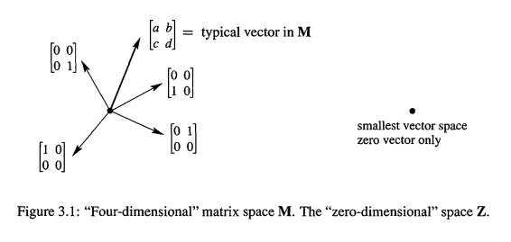
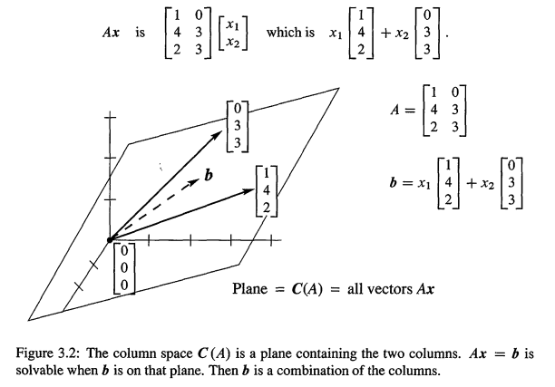
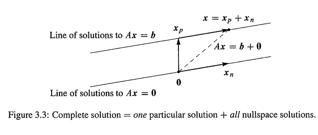
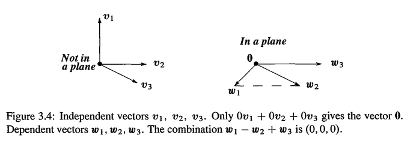
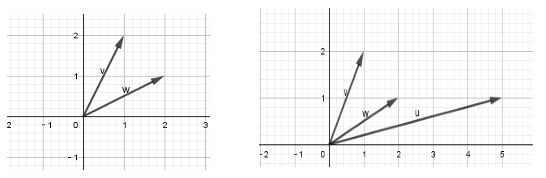
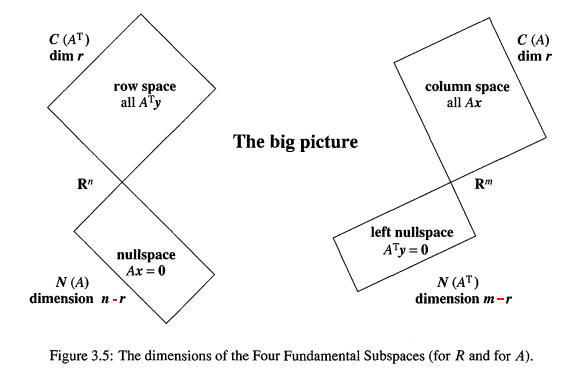
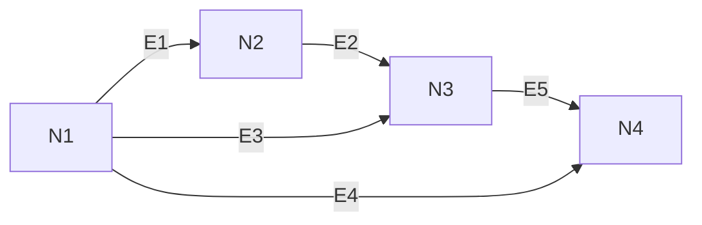

> - vector spaces and subspaces
> - 本章综合到了视频13
> - 本章习题完全没做，后面补充

# 1. 向量空间

> Spaces of vectors

矩阵操作的认知顺序是

1. 只是简单涉及到很多数字
2. 涉及到向量的线性组合,如Ax,AB是A的n个列的线性组合

现在上升到第三个层次(最高层次):不再是单一的列,而是向量空间.如果不能理解向量空间，特别是它们的子空间,你不会完全理解 $Ax = b$. 我们其实是在透过计算，寻找其中的数学原理。本章会以 **Fumdamental Theorem of Linear Algebra** 结尾

我们从最常见的 $R^1,R^2..R^n$ 向量空间开始讲起,每一个 $R^n$ 都包含一整个集合的向量，比如 $R^5$ 就是所有5个分量的**列**向量,也就是所谓的5维空间(5-dimensional space)

> **Definition**
>
> ---
>
> 空间 $R^n$ 包含了所有 n 个分量的**列**向量 v。
>
> ---
>
> 这里v的分量都是实数,这也是我们为什么使用 `R`,如果是分量都是复数,$C^n$ 表示。

空间的意思就是很多向量,一整个空间的向量,但是并不是任意向量的组合都能成为空间,空间必须满足一些规则: **必须可以进行线性组合**.**空间** 这个词，要求你整体看待所有的向量。比如

- $R^2$ 是向量空间,由整个xy平面代表,这个空间下的每个向量，都有2个实数分量,所以 $R^2$ =所有二维向量.如 `(3,2),(π,e)`.我们可以对它们进行代数操作,比如加起来.还可以画出来,而整个xy平面就是 $R^2$.关键是,要将其考虑成向量空间,所有向量组成的空间.如果去掉 `0` 向量`(0,0)`,xy平面就有一个洞了,这是很糟糕的.为什么一定要有原点,因为对于向量空间,**操作必须是闭合的,它的加法,数乘,必须还是在向量空间内.所有的向量空间都必须有0向量.**
- 类似的， $R^3$ 下的向量是对应三维空间下的点 （x,y,z）
- 一维的空间 $R^1$ 是一条直线(比如x轴)
- 那么 $R^n$ 呢?也是一个向量空间,包含了所有的 `n` 维向量,向量的所有分量都是实数(以后我们还会碰到复数和复向量).

我们用中括号包围起向量当做一列,或者用圆括号和逗号列成一行,比如
$$
\left[ \begin{array} { l } 4 \\ \pi \end{array} \right] \text { is in } R  ^ { 2 } , \quad ( 1,1,0,1,1 ) \text { is in } R ^ { 5 } , \quad \left[ \begin{array} { l } 1 + i \\ 1 - i \end{array} \right] \text { is in } C ^ { 2 }
$$
线性代数的伟大之处在于,可以很容易的处理5维空间,我们不需要画出这个向量,我们只需要5个数字!

两个向量的基本操作:**加法和数乘，也就是线性组合，必须对向量空间封闭,也就是线性组合的结果必须还在向量空间之内**。向量空间的规则，可以总结为如下8个规则。如下的向量，不仅仅是对于列向量,而是所有的向量。如下的规则，不仅仅是 $R^n$ 要满足,而是任何一个向量空间.

> 1. $\vec{x}+\vec{y} = \vec{y}+\vec{x}$
> 2. $\vec{x}+(\vec{y}+\vec{z}) = (\vec{x}+\vec{y}) + \vec{z}$
> 3. 存在唯一一个零向量（zero vector），使得对所有x，都有  $\vec{x} +\vec{0} = \vec{x}$
> 4. 对每一个x，都有唯一一个向量 -x，满足 $\vec{x}+ (-\vec{x}) = 0$
> 5. $1 * \vec{x} = \vec{x}$
> 6. $(c_1c_2 \vec{x} ) = c_1(c_2\vec{x})$
> 7. $c(\vec{x}+\vec{y}) = c\vec{x}+ c\vec{y}$
> 8. $(c_1+ c_2)\vec{x} = c_1\vec{x} +c_2\vec{x}$

下面是3个不同于 $R^n$ 的向量空间

- M :  所有**实数的 2-2 矩阵** 组成的向量空间，这里的"向量"其实就是矩阵
- F  : 所有**实数函数 f(x)** 组成的向量空间,这里的"向量"是函数
- Z  : **只包含一个零向量**的向量空间。

在上面的每一个空间，我们都能做加法:矩阵+矩阵,函数+函数,零向量+零向量.我们也可以把一个$矩阵*4,函数*4,零向量*4$,结果还是在M,F,Z里面.8个条件可以轻易验证.

函数空间F是无限维(infinite-dimensional)的,一个比较小的函数空间是P,或者 $P_n$: 包含所有的n阶(degree n)多项式 $a_0+ a_1 x+…a_n x^n$

`Z` 空间是0维的,也是最小的向量空间,其实称之为 $R^0$ 我们是有点犹豫的，想要表达的意思是没有分量，而不是没有向量. `Z` 恰好只有1个向量(0向量)。 **任何一个向量空间必须包含零向量,但是每一个空间的零向量都可能是不同的**: 0矩阵,0函数, $R^3$ 下的(0,0,0)

## 1.1. 子空间

>  Subspaces

有时候,我们会要求你把矩阵和函数看作是向量,但是最常见的还是列向量，也就是n个分量的列向量。$R^n$ 是最重要的向量空间,但是我们的目标是只想要 $R^n$ **一部分**的向量,而不是所有,又能满足向量空间的要求,这部分向量叫做子空间.

我们还是从 $R^2$ 出发,找出一个在 $R^2$ 向量空间内的子空间.任意一条**从原点出发**向量,以这条向量做经过原点的直线,那么这条直线就肯定是一个子空间,因为这条直线上的任意向量,对加法和数乘都是封闭的!注意 $R^2$ 直线要经过原点才是子空间。那么 $R^2$ 的所有子空间有多少呢?

1. $R^2$,显然是自己的子空间
2. 经过(0,0)原点的直线(和 $R^1$ 是不一样的,因为有两个分量)
3. 0向量 `Z`!只是**一个点**

从三维空间 $R^3$ 开始,选择一个经过原点的平面,这个平面就是一个向量空间.因为，选择这个平面内的任意两个向量,加起来还是在平面内,数乘也还是在平面内.但是要注意, **$R^3$ 下的一个平面不是 $R^2$ 的,尽管看起来像是.这些向量有3个分量,属于 $R^3$,这个平面是一个在 $R^3$ 下的向量空间**.这是线性代数的一个最基础的概念：**这个平面是完整向量空间(full vector space) $R^3$ 的一个子空间**

> **Definition**
>
> ---
>
> 一个向量空间的子空间是一个向量的集合(包括 $\vec{0}$ ),这个向量集合满足2个要求：如果 $\vec{v},\vec{w}$ 是这个子空间的向量，c是一个数字，那么
>
> 1. $\vec{v} +\vec{w} $ 在这个子空间
> 2. $c\vec{v}$ 在这个子空间
>
> 也就是说，这些向量的集合，对加法 v+w 和 数乘 cv,dw 是**封闭的(closed)**.再进一步总结，也就是，**所有线性组合的结果还是在这个子空间内**，再进一步，就是，**如果子空间包含c,v，那么必须包含所有的线性组合 cv+dw**.

我们还可以总结到：

1. 首先,**每一个子空间必须包含零向量**.其实这也就是规则2选择数乘c = 0的时候需要满足的
2. **经过原点**的直线也是子空间
3. $R^3$ 下的另外一个子空间就是整个 $R^3$ 本身

下面是 $R^3$ 的所有子空间

- $R^3$ 本身: $R^3$
- 任何经过原点 `(0,0,0) `的平面 :P
- 经过原点(0,0,0)的直线:L
- 单一一个 0向量 ：$Z$

如果我们只包含上面平面或者直线的一部分，那么关于子空间的要求就不成立，我们看看$R^2$ 的例子

**例1.**  如果我们只取 $R^2$ 的第一个象限的向量,那么向量的分量都是正值或者0.它们之间的加法还是处于第一象限内,但是数乘就不行了,比如 `c = -1` ,肯定会逃逸出第一象限,所以要求2不满足，也就是说它不是封闭的。所以 **平面的第一象限不是子空间**

**例2.** 现在，在例1的基础上，把所有的分量都是负值的向量包括进来。现在就有2个象限组成的平面了。现在 ·  `要求2` 可以被满足，但是 `要求1` 却失败了。如 v = (2,3) 和 w = (-3,-2) 的和是 （-1，1），不在这个象限平面内，所有 **这个2个象限的平面也不是子空间**

**例3.** 比如,对于所有2-2矩阵的向量空间M,下面是2个子空间
$$
\text{(U) 所有上三角矩阵： } \quad \left[\begin{matrix} a & b \\ 0 & d \end{matrix} \right]
\quad
\text{(D) 所有对角矩阵： } \quad \left[\begin{matrix} a & 0 \\ 0 & d \end{matrix} \right]
$$
明显，操作封闭。而且都包含了**列向量**:2-2的零矩阵。  在这里，D也是U的子空间!

那么D子空间可以有什么呢?可以要求a = d,也就是 `I` 的倍数： `2I + 3I,3 * 4I` 都在这个子空间内。矩阵 `cI` ，在M,U,D内，形成了一条矩阵的线(The matrices `cI` form a "line of matrices" inside M and U and D  )

## 1.2. A的列空间 

> The Column Space of A

最重要的一个子空间是直接和矩阵A联系在一起的.我们想要求解Ax = b.如果A不是可逆的,那么系统对于一些b有解,对于一些b无解!我们想要一种描述有解b的方法:b可以认为是A乘以向量x,这些b's形成了A的列空间!

不要忘了,Ax就是A的列的线性组合.为了得到每一个b,我们使用每一个可能的x,也就是从A的列开始,**取列所有的线性组合,结果就是A的列空间.这是一个由列向量形成的向量空间**.列空间 `C(A)` **不仅仅包含了A的n列,而是列所有的组合Ax!**

> **Definition**
>
> ---
>
> 列空间包含了列的所有的线性组合。所有可能的组合就是 Ax，Ax填充了列空间 `C(A)`

这个列空间对于整本书都很重要,因为,**为了求解Ax =b,其实就是把b表达成A的列的线性组合!b必须在A的列空间里面,不然无解!** 当b在列空间里面,那么就可以表达为列的组合.这个组合的系数,就是Ax = b的解`x`。

假设A是m-n,列有m个分量,所以列属于 $R^m$，**所以A的列空间是==$R^m$==的子空间**(不是$R^n$ !).

**例4** 下面是一个`3-2` 矩阵A,列空间是 $R^3$ 的子空间,是下图下图所示的一个平面。

A2个列的所有的线性组合,填充了 $R^3$ 下的一个平面,这个平面的厚度是0，只有 b 在这个平面的时候才有解,所以大多数 $R^3$ 下的b是无解的,也就是说3个方程2个未知数大多时候是无解的.当然 `(0,0,0)` 是在向量空间内的,平面经过远点。因为当 `b= (0,0,0),Ax = 0`总有解,就是 `x =(0,0,0)`

---

**重要**  除了 $R^m$ 的列向量。 从一个向量空间 `V` 的任意一个向量集合 `S` 开始.为了得到V的子空间 `SS`,我们可以取S集合内向量的所有线性组合

- S = V 当中的向量集合(可能不是一个子空间)
- SS = S当中向量的所有组合

$$
SS= \text{所有 } c_1v_1 + ...+c_nv_N = \text{ 由S生成的V的子空间(the subspace of V "spanned" by S)}
$$

当`S`是列的集合,那么 `SS` 就是列空间.当S只有一个非零向量v,那么SS就是经过v的直线.**SS总是包含S的最小子空间(Always SS  is the smallest subspace containing  S)**.这是创建子空间的基础方法,我们还会遇见的

**例5.** 描述下面的列空间(它们都是 $R^2$ 的子空间)
$$
I = \left[ \begin{array} { l l } 1 & 0 \\ 0 & 1 \end{array} \right] 

\quad A = \left[ \begin{array} { l l } 1 & 2 \\ 2 & 4 \end{array} \right] 

\quad B = \left[ \begin{array} { l l l } 1 & 2 & 3 \\ 0 & 0 & 4 \end{array} \right]
$$
解: 

- `I` 的列空间其实就是整个 $R^2$,也就是 $C(I) = R^2$
- A  的列空间是一条直线,因为C2是C1的数乘,只有当b在这条直线的时候,才有解
- 虽然B是3列，但 $C(B) = R^2$,和 `I` 的列空间一样,如果 `b=(5,4)`,那么 `x = (0,1,1)`, `x = (2，0，1)` 都可以。任何 $Bx = b$ ==都有解==,但是注意 `x` 有三个分量,和 `I` 的时候不一样,所以有更多的线性组合可以产生 b

必须要理解？ $R^3$ 下你还可以作图, $R^{10}$ 下,你怎么作图和想象?也许需要求 $R^{10}$ 下5个向量的线性组合,那是什么呢?天晓得,但肯定是某种子空间,5个向量,每个向量都有10个分量,取其线性组合, 得到的肯定不是 $R^5$,因为有10个分量,结果可以认为是10维空间下的某个5维平面,当然肯定会经过原点,如果5个向量恰巧共线,那么线性组合就是一条直线,所以可能不止一种,取决这5个向量的性质.

---

**例V1.(来自视频6，4方程3未知数）**  再看一下A的列空间,假设
$$
A =  \left[ \begin{array} { l l l } 1 & 1 & 2 \\ 2 & 1 & 3 \\ 3 & 1 & 4 \\ 4 & 1 & 5 \end{array} \right ]
$$
A的列空间 `C(A)` 是 $R^4$ 的子空间,A是 `4-3` 的.这是一个真子空间.把它和线性方程组联系起来,这很关键,**因为抽象的定义背后,都是有实际目的的**.这都是为了深刻认识 $Ax = b$.

$Ax = b$对于任意b,都有解吗?肯定不是的,前面已经知道.那么什么样的b会使方程组有解呢?对于上面的方程组,有四个方程,但是只有三个未知数.我们把Ax = b写出来把
$$
\left[ \begin{array} { c c c } 1 & 1 & 2 \\ 2 & 1 & 3 \\ 3 & 1 & 4 \\ 4 & 1 & 5 \end{array} \right] \begin{array} { c } x _ { 1 } \\ { \left[ x _ { 2 } \right] } \\ x _ { 3 } \end{array} = \left[ \begin{array} { l } b _ { 1 } \\ b _ { 2 } \\ b _ { 3 } \\ b _ { 4 } \end{array} \right]
$$
首先,方程组不总是有解,原因就是**三个列向量的线性组合无法覆盖整个四维空间**.对于有解的情况,我们想要知道什么样的 `b` 可以使方程组有解. **Ax=b,当且仅当b属于A的列空间C(A),才有解**!因为根据定义,A的列空间包含了A的列的所有线性组合,也就包含了所有的Ax,也就包含了所有有解的b.

上面的A的三个列是线性独立的吗?也就是说,如果我用上面的三列进行线性组合,得到的是==四维==子空间吗(sp:视频上说是三维子空间，但其实应该是四维)?不独立意味着,去掉某列之后,得到的仍然是同一个列空间.明显,对于上面的三列,明显不是线性独立的,`列3` 是 `列1` 和 `列2` 的和.称 `列1` 和 `列2` 是**主列(pivot column).**实际上,把列1作为去掉的选择也是可以的.惯例是优先考虑靠前的列向量.列1,列2指向不同方向,列3可由列1列2得到.所以上面的A是 $R^4$ 下的二维子空间.

## 1.3. 总结

**本节讨论了列空间C(A),来描述==所有可能的右侧b向量==，下一节讨论向量空间N(A),来==描述 Ax = 0的所有解==。**

## 1.4. 关键概念

1. $R^n$ 包含了所有分量是实数,n个分量的向量
2. M(所有的2-2矩阵) 和 F(函数) 和 X(单独一个0向量)也是向量空间
3. 一个包含 `v,w` 的子空间必须包含他们的所有组合 `cv+dw`
4. A的列的组合形成列空间 `C(A)`,也就是说列空间是由列向量生成的(span)
5. Ax = b,当且仅当b在A的列空间的时候,有解

## 1.5. 典型例题

**1.** 给定3个向量 $b_1,b_2,b_3$,如何构建一个矩阵 A,使得 $Ax =b_1,Ax=b_2$ 有解，而 $Ax =b_3$ 无解？

解：其实就是想要 $b_1,b_2$ 在A的列空间之内，最简单的就是 $b_1,b_2$ 是 A的2列，如果 A 是 2-2 的。这时候解是 `(1,0),(0,1)`.

$b_3$ 想要无解，所以不要把列空间设置的太大。如果A的列空间是整个 $R^2$,那么就不可能找到无解的 $b_3$. 注意,$b_3$ 不在列空间，而 $b_1,b_2$ 可以看成是A的2列，那么这个问题其实就是
$$
A x = \left[ \begin{array} { l l } b _ { 1 } & b _ { 2 } \end{array} \right] \left[ \begin{array} { l } x _ { 1 } \\ x _ { 2 } \end{array} \right] = b _ { 3 } \quad \text{是否有解？也就是}b_3\text{是否是}b_1,b_2\text{的线性组合}
$$
只要上述问题的答案是否定的，那么我们得到了想要的矩阵A

---

**2. ** 对于每个向量空间 V，描述它的一个子空间 S,再描述 S 的子空间 SS

- $V_1 = $  所有 `(1,1,0,0),(1,1,1,0),(1,1,1,1)` 的组合
- $V_2 = $ 所有和 $u = (1,2,1)$ 垂直的向量: $\vec{u} \cdot \vec{v} = 0$
- $V_3= $ 任何 2-2 的对称矩阵(也就是本节开始提到的M的子空间)
- $V_4= $ 等式  $d^4y/dx^4 = 0$ 的解(也就是本节开始提到的F的子空间)

并且 V 是...的所有组合，和 V 是方程组...的解描述V

解： 

- $V_1$ 是3个向量的组合，那么 S 可以是其中2个向量的组合，而 SS 可以是其中一个向量的组合，如第一个向量所有数乘 `(c,c,0,0)`
- $V_2$ 的子空间 S 可以是经过点 (1,-1,1)的直线，和 u 垂直。$\vec{x} =(0,0,0)$ 在 S上。而 cx 就给出了S的最小子空间 $SS=Z$
- 对角矩阵就是 $V_3$ 的子空间S,而 `CI` 是 S 的子空间SS
- $V_4$ 包含了所有的三次多项式：$y = a+bx+cx^2+dx^3$.而二次多项式是一个子空间S，线性多项式是SS，常数是 SSS.

其实上述4个，都可以让 S = V本身，而 SS = 零子空间 `Z`

- $V_1$ 是那3个向量的所有组合；	$V_1$ 是 $v_1 - v_2 = 0$  的所有解(分量相减）(sp:不要觉得少了(1,1,1,0),以为 `(*,*,*,c)` 肯定可以凑出来，其实只要知道，那3个向量形成了完整的 $R^4$ ,那么没有什么向量不能组合的)
- $V_2$ 是 `(1,0,-1),(1,-1,1)` 的所有组合；	$V_1$ 是 $\vec{u} \cdot \vec{v}$  的所有解.(sp:为何是这个组合呢？其实只要任意选出2个和 $\vec{u}$ 垂直的向量，只要不在同一个平面，那么组合都可以！因为都是那个空间！）
- $V_3$ 是 $\left[\begin{matrix} 1 & 0 \\ 0 & 0 \end{matrix} \right],\left[\begin{matrix} 0 & 1 \\ 1 & 0 \end{matrix} \right],\left[\begin{matrix} 0 & 0 \\ 0 & 1 \end{matrix} \right]$ 所有组合；	$V_3$ 是所有b =c的 $\left[\begin{matrix} a & b \\ c & d \end{matrix} \right]$  的解（sp:注意，为何这里需要3个矩阵来表达组合）
- $V_4$ 是 $1,x,x^2,x^3$ 的所有组合；	$V_4$ 是 $d^4y/dx^4 = 0$  的所有解

# 2. A的零空间:求解Ax = 0

> - The Nullspace of A:Solving Ax = 0
> - 本节综合到视频7

对于Ax = 0,A可以是矩阵也可以是方阵,如果A可逆,那么 `x = 0` 就是唯一解,对于不可逆矩阵,Ax = 0有非零解,这些解形成了A的零空间,消去会找到所有的解,并且找出这个重要的零空间

> **Definition**
>
> ---
>
> A 的零空间，以 `N(A)` 表示，**是 Ax = 0 的所有解**。 向量 x 是 $R^n$ 的

记住,解向量是有 `n` 个分量的,是 $R^n$ 下的向量,所以零空间是 $R^n$ 的子空间,而列空间是 $R^m$ 的子空间

如果右侧的b不是0,那么 `Ax = b` 的解**不是子空间**. `b = 0` 的时候才有解 `x = 0` ,所以 $Ax = b$ 的解不包含 `x= 0` ,所以不是子空间. `<#4>` 节会展示Ax = b的解是由特解平移产生的

**例1.** $x+2y+3z$  来自于 1-3 矩阵 $A = \left[\begin{matrix} 1 & 2 & 3 \\\end{matrix} \right]$ ,方程 Ax = 0 产生了一个经过原点  `(0,0,0)` 的平面，这个平面是 $R^3$ 的子空间，也就是 **A 的零空间**。

**例2** 描述一下 $A = \left[\begin{matrix} 1 & 2 \\ 3 & 6 \end{matrix} \right]$ 的零空间，注意，这个矩阵是奇异的！

解： 对Ax = 0 应用消去，
$$
\begin{array} { r r r } x _ { 1 } + 2 x _ { 2 } = 0 &  \\ 3 x _ { 1 } + 6 x _ { 2 } = 0\end{array}

\Rightarrow \quad  
\begin{array}{r r r }
x _ { 1 } + 2 x _ { 2 } &= 0 \\
0 & = 0
\end{array}
$$
所以方程组实际上只有1个方程起作用： $x_1 +2x_2 = 0$  这条线就是A的零空间，包含了所有解 $(x_1,x_2)$

---

为了描述零空间，一个快速的方法是：寻找直线上的一个**特解(special solution）**,那么直线上的其他所有点，都是这个点的一个数乘而已。我们特殊的选择 $x_2 = 1$,那么可得 $x_1 = -2$,  那么, 这个特解就是  $s = \left[\begin{matrix} -2  \\1  \\\end{matrix} \right]$ 。

上述只有一个特解，所以：$A = \left[\begin{matrix} 1 & 2 \\ 3 & 6 \end{matrix} \right]$ 的零空间包含了所有 $s = \left[\begin{matrix} -2  \\1  \\\end{matrix} \right]$ 的数乘。

**上述就是描述零空间最有效的方法： 计算 Ax = 0 的特解，然后组合特解的线性组合。** 例2只有1个特解，但例1的 $x +2y+3z$ 有两个特解：
$$
\left[\begin{matrix} 1 & 2 & 3 \\\end{matrix} \right]

\left[\begin{matrix}x\\y\\z\\ \end{matrix} \right] = 0 

\quad \text{2个特解：} 
s_1 = \left[\begin{matrix}-2\\1\\0\\ \end{matrix} \right]
s_2= ​​\left[\begin{matrix}-3\\0\\1\\ \end{matrix} \right]
$$

$s_1,s_2$ 都在平面 `x+2y+3z=0` 上,也就是 `A=[1 2 3]` 的零空间.这个平面的所有向量都是 $s_1,s_2$ 的线性组合.注意$s_1,s_2$ 的特殊： 最后两个分量都是 `0,1`.这些分量是自由的,我们可以特殊设置它们的值,那么第一个分量 `-2,-3` 是后2个分量带入Ax = 0得到的

`A= [1 2 3]` 的**第一列包含了主元,所以x的第一个分量不是自由的.自由分量对应的是那些没有主元的列!** 

---

**例V1(视频6).** 以 `<#1.2>` 的 `例V1` 为例，A的零空间是什么? `x` 有3个分量,所以零空间是 $R^3$ 的子空间,而列空间是 $R^4$ 的子空间.
$$
A =  \left[ \begin{array} { l l l } 1 & 1 & 2 \\ 2 & 1 & 3 \\ 3 & 1 & 4 \\ 4 & 1 & 5 \end{array} \right ]

\left[\begin{matrix} 
x_1  \\
x_2  \\
x_3  \\
\end{matrix} \right] = \left[\begin{matrix} 
0  \\
0  \\
0  \\
0
\end{matrix} \right]
$$
首先,0向量就是解,**不管矩阵是什么,零空间必然包含0向量**.其他呢?对于这个特定的例子,还有 `(1,1,-1)`,...其实也就是 $x_1= c,x_2=c,x_3=−c$ 的任意向量,这是一个向量空间吗?是,这个零空间其实就是 $R^3$ 下经过原点的一条直线.

但是还是需要检查一下,为什么 $Ax = 0$ 的解总是可以构成一个子空间?这是因为,如果 $Av = 0,Aw = 0$,那么 $A(v+w) = 0$,而且 $A(cv) = 0$.

重要的是理解,向量空间的关键是什么?我们再看 $Ax = b$ 的例子,这里的b是一个特殊的向量,此时考虑的就不再是零空间了
$$
A =  \left[ \begin{array} { l l l } 1 & 1 & 2 \\ 2 & 1 & 3 \\ 3 & 1 & 4 \\ 4 & 1 & 5 \end{array} \right ]

\left[\begin{matrix} 
x_1  \\
x_2  \\
x_3  \\
\end{matrix} \right] = \left[\begin{matrix} 
1  \\
2  \\
3  \\
4
\end{matrix} \right]
$$
第一个问题是,如果有解,这些解构成子空间吗?**不能!** b不再是0,而是一个特定的向量,其实一眼就看出来,比如上面 $Ax = b$ 甚至**不包含零向量**.很显然 `(1,0,0)` 是一个解, `(0,-1,1)` 也是一个解.这些解的图像其实就是一个**不经过原点**的==直线==（视频：注意不是平面，因为特解  (1,0,0) 的数乘就是直线啊，别把它想成3维下的平面方程）

---

例3深入讨论特解

**例3.** 描述矩阵A,B,C的零空间 
$$
A = \left[ \begin{array} { l l } 1 & 2 \\ 3 & 8 \end{array} \right] \quad B = \left[ \begin{array} { r } A \\ 2 A \end{array} \right] = \left[ \begin{array} { r r } 1 & 2 \\ 3 & 8 \\ 2 & 4 \\ 6 & 16 \end{array} \right] \quad C = \left[ \begin{array} { l l } A & 2 A \end{array} \right] = \left[ \begin{array} { l l l r } 1 & 2 & 2 & 4 \\ 3 & 8 & 6 & 16 \end{array} \right]
$$
解： Ax = 0只有一个解 `x = 0` ,所以零空间是`Z` .它的唯一一个向量是 $R^2$ 下的 `x =(0,0)`.因为
$$
\left[ \begin{array} { l l } 1 & 2 \\ 3 & 8 \end{array} \right] \left[ \begin{array} { l } x _ { 1 } \\ x _ { 2 } \end{array} \right] = \left[ \begin{array} { l } 0 \\ 0 \end{array} \right] \text { 消去 } \left[ \begin{array} { l l } 1 & 2 \\ 0 & 2 \end{array} \right] \left[ \begin{array} { l } x _ { 1 } \\ x _ { 2 } \end{array} \right] = \left[ \begin{array} { l } 0 \\ 0 \end{array} \right] 

\Rightarrow \left[ \begin{array} { l } x _ { 1 } = 0 \\ x _ { 2 } = 0 \end{array} \right]
$$
**A是可逆的,没有特解.A的所有列都有主元**。

B的零空间也是`Z`,虽然这里的方程更多.Bx = 0的前面2个等式要求了`x = 0`,而后面2个等式也是要求`x = 0`.**当我们添加了更多的方程，零空间肯定不会变大,更多的行，是对零空间的`x`施加了更多的约束.**

矩形的C是不一样的，C的列增多,但方程个数不变.解向量x有4个分量.消去后，前2列产生主元(右上角`*`号)，后2列是自由的，也就是没有主元：
$$
C = \left[ \begin{array} { l l l r } 1 & 2 & 2 & 4 \\ 3 & 8 & 6 & 16 \end{array} \right] \Rightarrow \quad  U = 

\left[ \begin{array} { l l l l } 
1^{*} & 2^{*} & 2 & 4 \\ 
0^{*} & 2^{*} & 0 & 4 \end{array} 
\right]
$$
$x_3,x_4$ 是自由变量,**我们可以对这些变量赋值1,0得到特解**.首先 $x_3  = 1,x_4  = 0$,然后 $x_3= 0,x_4=1$,然后**主元变量(pivot variables)** $x_1,x_2$ 可以由 Ux = 0 得到.从而得到了**C的零空间**的2个特解(也是U的零空间的2个特解。)  特解 $s_1,s_2$ 是: 
$$
s _ { 1 } = \left[ \begin{array} { r } - 2 \\ 0 \\ 1 \\ 0 \end{array} \right] \quad s _ { 2 } = \left[ \begin{array} { c } 0 \\ - 2 \\ 0 \\ 1 \end{array} \right] 

\quad  
\begin{array} { c } \leftarrow\text{pivot variable} \\ \leftarrow\text{pivot variable} \\ \leftarrow\text{  free variable} \\ \leftarrow\text{   free variable} \end{array}
$$

---

还需要提到的就是,**消去可以更进一步，得到不仅仅是U**,我们可以继续化简得到比U更简的形式,分2步

> 1. 通过**向上消去(eliminating upward)**，在主元之上产生0
> 2. 通过**把行除以0(dividing the whole row by its pivot)**，在主元位置产生1

这些步骤不会改变 $Ax = 0$ 的方程右侧的零向量.**零空间还是一样的**.经过这样化简以后,得到**行最简形式(reduced row echelon form)R**,R的**主列是`I！`**。对于例3如下，注意**带 `*` 号的==主列出现了 `I`==** 啊
$$
\text{Reduced form R:} \quad 
U = 
\left[ \begin{array} { l l l l } 
1 & 2 & 2 & 4 \\ 
0 & 2 & 0 & 4 \end{array} 
\right]

\quad \overset{r_1 - r_2,r_2/2}{\Rightarrow} \quad 

\left[ \begin{array} { l l l l } 
1^{*} & 0^{*} & 2 & 0 \\ 
0^{*} & 1^{*} & 0 & 2 \end{array}  \right ] = R
$$
这样方程组简化成 $x_1+2x_3=0,x_2+2x_4=0$. **$s_1,s_2$ 特解不变,但是Rx = 0更容易找到它们**

---

在讲解 `m-n` 矩阵 A 和其 `N(A)` 之前,我们提一点.对于很多矩阵,`Ax = 0` 只有 `x = ` 0唯一一个解,零空间就是 `N(A) = Z`,只有一个零向量,所以对列组合以产生 $b = 0$ 的唯一组合只能值 “零组合”。虽然解很不起眼,但是这个思想很重要.这种情况下的零空间 `Z` 是非常重要的,**它说明列是独立的**,没有线性组合可以产生零向量(除非0组合),所有的列都有主元,没有自由列.我们后面还会碰到独立的概念。

## 2.1. 通过消去求解 Ax = 0

> Solving Ax = 0 by elimination

这很重要，**就算A是矩形，我们还是使用消去。**当 b= 0,矩阵是 m- n，那么我们求解 m 个方程，n个未知数的方程组。当 A 通过行操作简化之后，我们可以很快的求出解。下面是方法的2个步骤

> 1. **前进消去(forward elimination)**,从而把A变成U，或者进一步的阶梯形式R
> 2. 在 $Ux = 0$ 或者 $Rx = 0$ 使用**向后替换(back substitution)**，从而得到 x

当A和U**少于n个主元**(sp:解向量x是n个分量的)，你会发觉，向后替换略微有点有所不同。这一章，我们接触到的矩阵就不仅(可逆)方阵了,而是所有的矩阵,包括矩形矩阵。所以方程个数和变量个数可能不一样

主元仍不为0，主元之下的元素仍为0.但有可能，**一列并没有主元**，但对这个**自由列**，我们不会停止计算，**直接跳到下一列**。如下是3-4矩阵
$$
A = \left[ \begin{array} { r r r r } 1 & 1 & 2 & 3 \\ 2 & 2 & 8 & 10 \\ 3 & 3 & 10 & 13 \end{array} \right]
$$
明显，$a_{11}$ 是第一个主元，从而把第1列主元之下的2，3消去
$$
A\quad  \overset{r_2 - 2r_1,r_3 - 3r_1}{\rightarrow} \quad \left[ \begin{array} { r r r r } 1 & 1 & 2 & 3 \\ 0 & 0 & 4 & 4 \\ 0 & 0 & 4 & 4 \end{array} \right]

\tag{M1}
$$
注意到第二列主元的位置是0,我们想要行交换,但是下面还是0.这时候消去就不能处理了.但可继续处理第三列,第二个主元是4,但是位于第三列上! $r3-r2$ 可以把主元下面清零.**主列是 $c1,c3$** 
$$
\text{上三角U是} \quad \left[ \begin{array} { r r r r } 1 & 1 & 2 & 3 \\ 0 & 0 & 4 & 4 \\ 0 & 0 & 0 & 0 \end{array} \right] \quad \text{只有2个主元，第3个等式变成 0 = 0}
$$
第4列的主元位置是0,但是什么都做不了了,它下面没有行可以行交换.所以向前消去完成了.这个矩阵有3行4列,但是只有2个主元.原始的 $Ax = 0$ 看是涉及到3个方程,但是其实只有2个,第三个是前面2个的和，当前2个方程成立的时候，是自动成立的(0=0).消去发现了方程组内在的规律。

现在回代求解 `Ux = 0` .4个未知数,2个主元,有很多解.怎么表示全部的解呢?一个好方法是把主变量和自由变量分离开

> - **P**: 主元变量是 $x_1,x_3$,**因为列1和列3包含了主元**
> - **F**: 自由变量是 $x_2,x_4$,**因为列2和列4没有主元**	

**自由变量 $x_2 ,x_4$ 可以设置任何值,然后回代找到主元变量 $x_1,x_3$**.(在 `<01-02>`,A是可逆的，所有变量都是主元变量)最简单的就是设置 `0,1`,所以，对 $x_1+x_2 +2x_3 +3x_4 = 0;4x_3 +4x_4 = 0$ 的特解是

1. 设置 $x_2 = 1,x_4 = 0$,向后替换$x_3 = 0$，得到 $x_ 1 = -1$，得到特解 $s_1 = (-1,1,0,0)$
2. 设置 $x_2 = 0,x_4 = 1$,根据向后$x_3 = -1$，得到 $x_ 1 = -1$,得到特解 $s_2 = (-1,0,-1,1)$

**上面的特解求解了 $Ux = 0$,从而求解了 $Ax= 0$**，**特解都在零空间当中**，完美的是,**所有的解是特解的线性组合**
$$
\text{对Ax = 0 的完整解：} \quad 

x = x _ { 2 } 

\underbrace{\left[ \begin{array} { r } - 1 \\ 1 \\ 0 \\ 0 \end{array} \right]}_{\color{orange} \text{special}}
+ 

x _ { 4 } \underbrace{\left[ \begin{array} { r } - 1 \\ 0 \\ - 1 \\ 1 \end{array} \right]}_{\color{orange} \text{special}} 

\quad = 

\underbrace{\left[ \begin{array} { c } - x _ { 2 } - x _ { 4 } \\ x _ { 2 } \\ - x _ { 4 } \\ x _ { 4 } \end{array} \right]}_{\color{orange} \text{complete}}  

\tag{1}
$$
请好好的看上述的解，这是我们本节的主要目的。**所有解都是 $s_1,s_2$ 的线性组合! 特解在 `N(A)` 里,而它们的组合覆盖了整个零空间！** 

> Matlab当中命令 `nullbasis` 计算这些特解,这些特解形成 **零空间矩阵(nullspace matrix) N**的列,而完整的解，就是这些列的线性组合，**一旦我们有了这些特解，我们就有了整个零空间。**
>
> `null(A)` 命令可以得到A的零空间矩阵.这个命令先算出R,找到主变量和自由变量,将 `1,0`分配到自由变量,使用回代.

**每一个自由变量对应一个特解**,如果没有自由变量,那么意味着有n个主元,那么 `Ux = 0` 或者 `Ax=0` 的解只有 `x = 0`.所有的变量都是主变量.这样, `A` 或 `U` 的零空间只有零向量.每一个列都有一个主元,`nulllbasis` 命令给出的是一个**空**矩阵,也就是，n个主元的零空间是 `Z`

**例4** 求 $ U = \left[\begin{matrix} 1 & 5 & 7\\0 & 0 & 9\\\end{matrix} \right]$ 的零空间。第2列没有主元，所以 $x_2$ 是自由变量,为了得到特解，设$x_2$为1,回带得到 $x_3 = 0,x_1 = -5$.所以对 `Ux = 0` 的完整解是这个特解的数乘
$$
x = x_2 \left[\begin{matrix}-5\\1\\0\\ \end{matrix} \right]
\quad
\begin{aligned}
&\text{U的零空间是}R^3\text{下的一条直线 }\\
&\text{它包含了特解}s = (-5,1,0)\text{的数乘}\\
&\text{只有一个变量是自由的，所以}N = nullbasis(U)\text{ 只有1列 }
\end{aligned}
$$
我们可以继续化简U,得到R,就是把主元上面的数字全部消去变成0,主元全部变为1,那么
$$
U = \left[\begin{matrix} 1 & 5 & 7\\0 & 0 & 9\\\end{matrix} \right] \quad \text{化简为} \quad   R = \left[\begin{matrix} 1 & 5 & 0\\0 & 0 & 1\\\end{matrix} \right] = rref(U)
$$
R就是行**最简阶梯形式(reduced row echelon form)**. 这样可以更快的发现特解就是s = (-5,1,0)

## 2.2. 阶梯矩阵

> Echelon Matrices

如 `<#2.1>`, 向前消去,通过行操作，包括行交换，可以从A得到U。如果当前列没有主元，那么就**跳到下一列**。U是一个 `m-n` **阶梯**形式的矩阵,下面是一个 `4-7` 的阶梯矩阵U,主元以P标识
$$
\text{阶梯形式U：} \quad 

U = \left[ \begin{array} { l l l l l l l } p & x & x & x & x & x & x \\ 0 & p & x & x & x & x & x \\ 0 & 0 & 0 & 0 & 0 & p & x \\ 0 & 0 & 0 & 0 & 0 & 0 & 0 \end{array} \right]

\quad \color{orange}

\begin{aligned}
&\text{3个主元变量：} x_1,x_2,x_6 \\
&\text{4个自由变量：} x_3,x_4,x_5，x_7 \\
&\text{零空间N(U)有4个特解}
\end{aligned}
$$
那么这个矩阵的列空间和零空间是什么?

- 首先,列有四个分量,所以列是在 $R^4$ 的,而且每一个列的第4个分量都是0,所以 `C(U)` 包含了所有 $(b_1,b_2,b_3,0)$ 的向量,**我们是在列空间的7个向量的线性组合之上，求解 Ux = b的。所以 `b` 就是这些列所有可能的组合**
- `N(U)` 是 $R^7$ 的子空间,**$Ux = 0$ 的全部解是4个特解的所有线性组合,而4个特解是因为，每个自由变量对应一个**
1. 列3，4，5，7没有主元，所以自由变量是 $x_3,x_4,x_5,x_7$
2. 每次设置一个自由变量为1，其他都设置为0
3. 对 Ux = 0 求解主元变量 $x_1,x_2,x_6$
4. 从而给出了零空间 N 下4个特解的其中一个

U的非0行是以**阶梯**形式出现的,**主元出现在每一行的第一个元素**,而且**在主元所处列,主元下面的元素都是0!**

计算主元的数目可以得到一个极其重要的定理:

> 假设Ax = 0当中，未知数的个数多于方程的个数(n>m,A的列数目比行数目大),那么**至少有一个自由列没有主元，也就是至少有一个自由变量**，那么 **`Ax = 0` 至少有一个==非0的==特解**，所以 **n -m** 矩阵的**零空间，至少有一个非零向量**。
>
> ---
>
> **总结**：事实上，对 `n-m` 矩阵,`n>m` ,**==至少==有n-m个自由变量**,因为主元的个数不会超过m(矩阵m行,一行至多一个主元).当然一行有时没有主元。 重点是,当有一个自由变量,那么可以设置为1,所以Ax = 0有非0解。因为至少存在了1个特解，从而 Ax = 0 有无穷解，因为任何解的数乘都是解。所以零空间至少包含一条直线的解.如果有2个自由变量,那么有两个特解,零空间更大

---

**例V2(视频7)**  设A是下面的矩形矩阵
$$
A = \left[ \begin{array} { c c c c } 1 & 2 & 2 & 2 \\ 2 & 4 & 6 & 8 \\ 3 & 6 & 8 & 10 \end{array} \right]
$$
注意到,列2是列1的2倍.非线性独立.行3 = 行1 +行3,非线性独立,这些都会在消元当中表现出来.算法就是消元,只是消元对象换成了矩形矩阵,因此,就算主元是0,我们也得继续进行下去.
$$
A = \left[ \begin{array} { c c c c } 1 & 2 & 2 & 2 \\ 2 & 4 & 6 & 8 \\ 3 & 6 & 8 & 10 \end{array} \right]  \overset{r_2 - 2r_1,r_3-3r_1}{\longrightarrow} 

\left[ \begin{array} { c c c c } 1 & 2 & 2 & 2 \\ 0 & 0 & 2 & 4 \\ 0 & 0 & 2 & 4 \end{array} \right] 
$$
现在,$A_{22}$ 应该是主元,但是 $A_{22}$ 现在是0,我们想要行交换.但 $A_{23}$ 现在也是0.这说明的是,第2列是前面列的线性组合,也就是说第2列是依赖于前面列的.不过消元不能停止下来,我们继续寻找下一个主元.也就是 $A_{23}$ 的2,然后需要消掉 $A_{33}$ 的元素,得到
$$
A = \left[ \begin{array} { c c c c } 1 & 2 & 2 & 2 \\ 0 & 0 & 2 & 4 \\ 0 & 0 & 2 & 4 \end{array} \right]

\overset{r_3-2r_2}{\longrightarrow} 

\left[ \begin{array} { c c c c } 1 & 2 & 2 & 2 \\ 0 & 0 & 2 & 4 \\ 0 & 0 & 0 & 0 \end{array} \right] = U
$$
这也许不能叫上三角矩阵,但是得到了**阶梯形式(Echelon form)**

本例中,只有2个主元.这个数字称为矩阵的**秩(rank)**.A的秩就是A的主元的个数.这个数字是至关重要的.我们一开始求解的是Ax = 0,现在变成了Ux = 0.**消元后,零空间是不变的.因为解不变,实际上改变是列空间.**

现在开始回代.下一步非常关键,找出**主元变量(pivot variable),主列(pivot column),**在这个U当中,c1和c3是主列,也就是主元所在的列.其他的列叫做**自由列(free column)**,自由列的意思是,可以任意分配数值给这些未知数,在这个例子是 $x_2,x_4$.也就是说 `c2` 和 `c4` 的乘数是任意的,然后只需要求解 $x_1$ 和 $x_3$ 即可.假设$x_2=1,x_4=0$.(一般对自由变量的其中一个赋值1,其他0,然后另一个赋值1,其他0....一直进行下去)现在要找到$x_1,x_3$ 来完成解.上面的 $Ux = 0$ 得到下面的方程
$$
\begin{aligned}
x_1+2x_2+2x_3+2 x_4 &=0 \\
2x_3+4 x_4 & =0
\end{aligned}
$$
$x_1,x_3$  的求解可以通过回代得到!这以前我们已经学过了,新的知识点就是自由变量,可以取任意值.我们已经选择了1,0,那么最终得到的是 $x_3=0,x_1=−2$,最终 $x = (-2,1,0,0)$

这里已经找出了零空间的一个向量,那么零空间的其他向量是什么,很明显的,任何这个解的数乘也是解.那么这条直线也是在零空间当中的.那么这条直线就是整个零空间吗?不是,因为自由变量有两个.我们上面把自由变量设为1,0.当然还可以设为0,1. 这时候可以求得 $Ux = 0$ 的另外一个解 $x = (2,0,-2,1)$.也可以形成一条直线.这条直线也是零空间的一条直线,现在我们准备求出整个零空间,也就是Ax = 0的所有的解.

我们已经得到了两个**特解**,称为特解是因为自由变量是特定分配的.通过特解可以构建出整个零空间.其实通解就是特解的所有线性组合
$$
x = c \left[ \begin{array} { c } - 2 \\ 1 \\ 0 \\ 0 \end{array} \right] + d \left[ \begin{array} { c } 2 \\ 0 \\ - 2 \\ 1 \end{array} \right]  \tag{V1}
$$
那么组成通解的特解需要多少个才行呢?**自由变量的个数!**多少个主变量呢?**秩的个数**!对于m-n矩阵,是m个方程,n个变量,若秩为 `r`, 自由变量的个数就是 $n - r$! 秩 r 表示有 r 个主变量,也就是只有 r 个方程起作用.如上面的Ax = b,看起来是由3个方程,但是实际起作用的只有2个,剩下的 $n - r = 2$ 可以任意取值.

以下就是求解Ax = 0的完整算法...

1. 首先消元,如果碰到无法取主元的列,先跳过,继续消元
2. 得到主元个数 `r`,剩下的 $n -r$ 是自由变量,分别赋值为1,0 
3. 求出特解,线性组合就是通解.

---

零空间是一个子空间,它的**维数(dimension)是自由变量的个数**.维数在后面学习

## 2.3. 行最简阶梯矩阵R

> The Reduced Row Echelon Matrix  R

从一个阶梯矩阵 `U` 我们可以更进一步,再看 `Eq(M1)` 的U
$$
U= \left[ \begin{array} { r r r r } 1 & 1 & 2 & 3 \\ 0 & 0 & 4 & 4 \\ 0 & 0 & 4 & 4 \end{array} \right]
$$

我们可以把 `r2` 除以4.那么主元都变成是1,然后把 `r1 -r2` ,得到行最简阶梯矩阵R,其中,主元的上面下面都是0!
$$
\text{Reduced Row echelon matrix:}  \quad 

R = rref(A) = \quad \left[ \begin{array} { c c c c } 1^{*} & 1 & 0^{*} & 1 \\ 0^{*} & 0 & 1^{*} & 1 \\ 0 & 0 & 4 & 4 \end{array} \right]

\quad \color{orange} \text{带*号的主行包含了 }I
$$
**重要:** **如果A是可逆的,那么它的行最简阶梯形式(Reduced row echelon form)就是单位矩阵 `R=I`.这就是行化简的终点,这时候 `N(A) = Z`**.

R中的0让我们可以快速的求特解(和之前差不多):	

1. 设置 $x_2 = 1,x_4 = 0$,求解 Rx = 0，得到 $x_1 = -1,x_3 = 0$, 这个 `-1,0` 在**R的第2列，自由列**(多了正号)
2. 设置 $x_2 = 0,x_4 = 1$,根据向后替换，得到 $x_1 = -1,x_ 3 = -1$，这个 `-1,1` 在**R的第4列，自由列**(多了正号)

**==只要逆转正负号,我们可以直接从R中读出特解！==**三个矩阵的**零空间是相同**的：`N(A) = N(U)=N(R)` 包含特殊解的所有组合：
$$
\boldsymbol { x } = x _ { 2 } \left[ \begin{array} { r } - 1 \\ 1 \\ 0 \\ 0 \end{array} \right] + x _ { 4 } \left[ \begin{array} { r } - 1 \\ 0 \\ - 1 \\ 1 \end{array} \right] =\quad \color{orange} \text{Ax = 0 的完整解}
$$

> sp-Note1：标黄部分的分析在下一节 `<#3.3 SP-LK1>`，但是典型例题1其实已经用到了这个知识点...作者总喜欢先行一步啊....

---

下一节我们继续研究R，而 Matlab 的命令 `[R,pivcol] = rref(A)` 可以得到R和主列列表

## 2.4. 关键概念

1. 零空间 `N(A)` 是 $R^n$ 的子空间,包含了Ax =0的所有解
2. 消去会产生阶梯矩阵 `U` ,然后是行最简的 `R` ,R可以清晰的看到主列和自由列
3. U的每一个自由列,都可以得到一个特解,也就是把其中一个自由变量设为1,其他设为0,回代就可以得到Ax = 0的解
4. `Ax =0` 的全部解就是特解的组合
5. 如果 `n >m` ,那么至少有一列是没有主元的,所以肯定可以给出一个特解,所以在一个矩形的A当中,零空间至少有一个非零的解x

## 2.5. 典型例题

**1. ** 构造一个 3-4 矩阵，它的 Ax = 0 的特解是如下，可以以R形式创建A，最后再描述一下所有 $N(A) = s_1,s_2$ 线性组合的矩阵A
$$
s _ { 1 } = \left[ \begin{array} { r } - 3 \\ 1 \\ 0 \\ 0 \end{array} \right] \quad \text { and } \quad s _ { 2 } = \left[ \begin{array} { r } - 2 \\ 0 \\ - 6 \\ 1 \end{array} \right] \quad \color{orange} \text{c1,c3是主列，自由变量}是x_2,x_4 
$$
解： 

> 根据 `sp-Note1`,其实书本上要下一节才能知道，所以这里不以后面的知识讲解，就以书本上的答案为准。 

R在c1,c3都有主元1，没有第3个主元，所以R的第3行全是0.主列就是 `I`,那么得到
$$
R = \left[ \begin{array} { l l l l } 1 & - & 0 & - \\ 0 & - & 1 & - \\ 0 & - & 0 & - \end{array} \right]
$$
**自由列是主列的组合**，带入 $s_1$ 到上述R，可得到 $-3c_1 + c_2 = 0,c_2 = 3c_1$,得到R的第2列了，第4列也是如此，所以：
$$
R = \left[ \begin{array} { l l l l } 1 & 3 & 0 & 2 \\ 0 & 0 & 1 & 6 \\ 0 & 0 & 0 & 0 \end{array} \right]
$$
满足零空间要求的**只有1个这样的R**，但A可以有很多个，可以对R进行如下操作得到A

- 交换行
- 把行乘以任何常数  $c  \ne 0$
- 把一行乘以某个常数被另一行加或减
- **任何可逆矩阵左乘R**(sp:因为矩阵是可逆的，而且是左乘，所以相当于对R进行行操作，就像消去矩阵E一样，矩阵可逆，表示所有行都是主行，也就不会出现一行全是0的矩阵去左乘A。)

**都不会改变它的零空间**！ 根据前面知识，任何 3-4 矩阵必须有1个特解，本例有2个

---

**2.** 对如下的矩阵，求特解，并描述 Ax = 0 的通解。
$$
A _ { 1 } = \left[ \begin{array} { l l l l } 0 & 0 & 0 & 0 \\ 0 & 0 & 0 & 0 \end{array} \right] \quad A _ { 2 } = \left[ \begin{array} { l l } 3 & 6 \\ 1 & 2 \end{array} \right] \quad A _ { 3 } = \left[ \begin{array} { l l } A _ { 2 } & A _ { 2 } \end{array} \right]
$$
主列是什么？哪些是自由变量，R分别是什么？

解： $A_1 x = 0$ 有4个特解，它们是 4-4 单位矩阵 `I` 的4列 $s_1,s_2,s_3,s_4$。**零空间就是 $R^4$**.  通解就是 $R^4$下的**任何**向量 $x = c_1s_1 + c_2 s_2 +c_3s_3 +c_4s_4$ .没有主列，所有变量都是自由变量，R就是$A_1$

$A_2x = 0$ 有1个特解 $s = (-2,1)$,数乘 $cs$ 给出了通解。 第1列是主列，$x_2$ 是自由变量。

$A_2,A_3$ 的 $R_2,R_3$ 如下
$$
A _ { 2 } = \left[ \begin{array} { l l } 3 & 6 \\ 1 & 2 \end{array} \right] \rightarrow R _ { 2 } = \left[ \begin{array} { l l } 1 & 2 \\ 0 & 0 \end{array} \right] \quad \left[ \begin{array} { l l } A _ { 2 } & A _ { 2 } \end{array} \right] \rightarrow R _ { 3 } = \left[ \begin{array} { l l l l } 1 & 2 & 1 & 2 \\ 0 & 0 & 0 & 0 \end{array} \right]
$$
注意 $R_3$ 也只有1个主列，所以 $x_2,x_3,x_4$ 都是自由变量，从而有3个特解 ：$s _ { 1 } = ( - 2,1,0,0 ) , s _ { 2 } = ( - 1,0,1,0 ) , s _ { 3 } = ( - 2,0,0,1 ) $，通解是
$$
x = c _ { 1 } s _ { 1 } + c _ { 2 } s _ { 2 } + c _ { 3 } s _ { 3 }
$$
**r个主元，那么就有n - r个自由变量，从而n-r个特解**

# 3. 秩和行最简形式

> The Rank and the Row Reduced form

虽然 `m,n` 给了我们矩阵的大小,但不是线代视角里面的大小.比如等式 `0=0` ,在线代里面就不能计算为有效方程；如果A的两行相等,那么第2行就会被消去完全变成0等等。A的真实大小其实是由秩得到的

> **Definition:** 矩阵A的秩是主元的数目,用 `r` 表示

矩阵**最终会被消去得到r个非0行**. 从一个3-4矩阵开始讲解,下面的A有多少个主元呢?
$$
A = \left[ \begin{array} { l l l l } 1 & 1 & 2 & 4 \\ 1 & 2 & 2 & 5 \\ 1 & 3 & 2 & 6 \end{array} \right]  \tag{1}
$$
列1和列2是不同方向的,所以是主列.但是列3是列1的2倍,所以不会有主元.第4列是前面3列的和，或者3c1+c2,也不会有主元. 
$$
\begin{aligned}
c_3 &= 2c_1, \quad s_1=(-2^*,0,1^*,0),  As_1  = 0 \\
c_4 &= 3c_1+ 1c_2, \quad s_2=(-3^*,-1^*,0,1^*), As_1 = 0
\end{aligned}

\quad \color{orange} \text{注意*号的数字}
$$
**每一个自由列都是前面主列的组合**,而且,**特解能告诉我们这个组合是什么**系统的找到特解 `s` 的方法就是消去!这**虽然会改变列,但是不会改变这个组合**!因为 `Ax = 0` 和 `Ux=0,Rx=0` 是等价的.下面首先是 `A->U`，U已经显示出来，是2个主元列，2个主元，所以A(或U)的秩是2，继续化简得到R之后,可以看到，**主元列的组合可以产生自由列**
$$
\left[ \begin{array} { l l l l } 1 & 1 & 2 & 4 \\ 1 & 2 & 2 & 5 \\ 1 & 3 & 2 & 6 \end{array} \right] \rightarrow \left[ \begin{array} { l l l l } 1 & 1 & 2 & 4 \\ 0 & 1 & 0 & 1 \\ 0 & 2 & 0 & 2 \end{array} \right] \rightarrow \left[ \begin{array} { l l l l } 1 & 1 & 2 & 4 \\ 0 & 1 & 0 & 1 \\ 0 & 0 & 0 & 0 \end{array} \right] = U 

\quad \overset{r_1 - r_2}{\Rightarrow }

\left[ \begin{array} { l l l l } 1 & 0 & 2 & 3 \\ 0 & 1 & 0 & 1 \\ 0 & 0 & 0 & 0 \end{array} \right] = R

\tag{2}
$$
明显,第4列的 `(3,1,0)=3*列1+列2`,也就是说
$$
-3c_1 - c_2 + c_4 = 0, \quad s = (-3-1,0,1)
$$

> sp:因为主元列是 `I` 的列，当然可以随意组合得到自由列！

## 3.1. 秩1

> Rank one

秩1矩阵只有一个主元.当第一个主元所在的第一列下面产生0元素,实际上在所有列下面都产生了0元素.**A的每一行都是第一行的倍数.而且,每一列都是第一列的倍数**!（sp:因为主元列只有1列，那么自由列就是这个这1个主元列的组合，只能是数乘了）
$$
\text{Rank one matrix:} \quad 

A = \left[ \begin{array} { l l l } 1 & 3 & 10 \\ 2 & 6 & 20 \\ 3 & 9 & 30 \end{array} \right] \quad \rightarrow \quad R = \left[ \begin{array} { l l l } 1 & 3 & 10 \\ 0 & 0 & 0 \\ 0 & 0 & 0 \end{array} \right]
$$

秩一矩阵的列空间是1维的.A的所有的列都是在经过 `u = (1,2,3)` 的直线上.A的列是 `u,3u,10u`.把这些数字放到行 $v^T=[1,3, 10]$,你会得到特别的秩一形式 $A = uv^T$
$$
\text{A = columns times row = } uv^T:\quad

\left[ \begin{array} { l l l } 1 & 3 & 10 \\ 2 & 6 & 20 \\ 3 & 9 & 30 \end{array} \right] = \left[ \begin{array} { l } 1 \\ 2 \\ 3 \end{array} \right] \left[ \begin{array} { l l l } 1 & 3 & 10 \end{array} \right]

\tag{3}
$$

秩一形式下,Ax =0的解是很容易理解的.等式 $Ax = uv^Tx  = u(v^T x) = 0$ ,让我们得到 $v^T x=0$.**零空间的所有x向量必须是和行空间的的 `v` 向量正交的**! 几何上理解就是:  **行空间=1条直线,零空间=垂直直线的平面**
$$
s _ { 1 } = \left[ \begin{array} { c } - 3 \\ 1 \\ 0 \end{array} \right] \quad s _ { 2 } = \left[ \begin{array} { c } - 10 \\ 0 \\ 1 \end{array} \right]
\quad
\begin{aligned}
&\text{主元行 [1 3 10]}\\
&\text{主元变量 } x_1\\
&\text{自由变量 }x_2,x_3
\end{aligned}
$$
零空间包含了 $s_1,s_2$ 的所组合，也就是平面 `x + 3y+10z = 0`,这个平面和行 `(1,3,10)` 垂直，也就是，零空间(平面)和行空间(线)垂直.

**例1.** 当所有的行都是主元行的数乘，秩 `r = 1`
$$
\left[ \begin{array} { l l l } 1 & 3 & 4 \\ 2 & 6 & 8 \end{array} \right] 

\text { 和 } \left[ \begin{array} { l l } 0 & 3 \\ 0 & 5 \end{array} \right] 

\text { 和 } \left[ \begin{array} { l } 5 \\ 2 \end{array} \right] 

\text { 和 } [ 6 ]  \quad \text{都是秩1}
$$

---

我们对秩的第二个定义，是更高层次的.它不仅仅是对行生效,也对列起作用 `A,U,R` 都有**r个独立行(主行),也有r个独立列(主列).**`<#5>`后你会知道这意味着这些行列是独立的

第三个秩的定义,线代的最高层次,是和向量空间相关的.**秩r是列空间的维数,也是行空间的维数,而且,r还揭示了零空间的维数!**

## 3.2. 主元列

> the pivot column

A的主列当中,在主元的位置是1,其他都是0.r个主列形成了 `r-r` 的单位矩阵 `I`,而且下面是 `m -r` 个0行.

A的主列很可能从A比较难看出来,但主列序号和化简后的是一样的,A的主列序号,最终也是U和R的主列序号.下面的例子是,`pivcol =  (1,3)`
$$
\text{主元列:}\quad 
A = \left[ \begin{array} { l l l l l } 1^* & 3 & 0^* & 2 & - 1 \\ 0^* & 0 & 1^* & 4 & - 3 \\ 1^* & 3 & 1^* & 6 & - 4 \end{array} \right] \Rightarrow \quad  R = \left[ \begin{array} { l l l l r } 1^* & 3 & 0^* & 2 & - 1 \\ 0^* & 0 & 1^* & 4 & - 3 \\ 0^* & 0 & 0^* & 0 & 0 \end{array} \right]

\tag{M2.1}
$$
**A,R的列空间是不同的**! R的所有列都是以0结尾的.消去将A的r3减去r1,r2,是的R的第三行是0
$$
EA = R,A = E^{-1}R\qquad 
\begin{array} { l l }  E = \left[ \begin{array} { r r r } 1 & 0 & 0 \\ 0 & 1 & 0 \\ - 1 & - 1 & 1 \end{array} \right] \text { and } E ^ { - 1 } = \left[ \begin{array} { l l l } 1 & 0 & 0 \\ 0 & 1 & 0 \\ 1 & 1 & 1 \end{array} \right] \end{array}
$$
**A的 `r` 个主列也是 $E^{−1}$ 的前 `r` 个列.R中的 `r-r` 的单位矩阵,只是简单的把 $E^{−1}$ 的前r个列选择出来,变成 $A = E^{−1} R$ 的列.** 

> sp:什么意思呢？观察 $E^{-1}$ 和 A，A的主列 c1,c3 和 $E^{-1}$ 的前2列是一模一样的。这是因为，A的主列的位置，恰好对应R的主列的位置，如 `Eq(M2.1)` * 号部分，而R的主列位置都是单位矩阵 `I`,在 $A = E^{−1} R$ 当中，R的主列，因为是单位矩阵 `I` ,从而会把 $E^{-1}$ 的**前n列原封不动的选择出来**，放置到A的合适位置作为A的主列。如 R 的 c3主列，就把 $E^{-1}$ 的第2列选择出来，作为 A 的c3主列

下面是关于主元列的数学描述： **主列不是前面列的组合,而自由列是前面列的组合,这些组合就是特解!**  R的主列，和主元行的交汇处有主元的存在，所以肯定不可能是前面列的组合.所以A的对应的这个列，也不能是前面列的组合,因为 `Ax =0` 实际上就是 `Rx = 0`

## 3.3. 关于特解

> - The Special Solution
> - `SP-LK1`

Ax =0 和 Rx = 0 的每一个特解都有一个自由变量等于1,其他的自由变量都是0.这些特解可以直接从阶梯形式的R得到
$$
R x = \left[ \begin{array} { l l l l r } 1 & 3^{*} & 0 & 2^{*} & - 1^{*} \\ 0 & 0^{*} & 1 & 4^{*} & - 3^{*} \\ 0 & 0^{*} & 0 & 0^{*} & 0^{*} \end{array} \right] 

\left[ \begin{array} { l } x _ { 1 } \\ x _ { 2 } \\ x _ { 3 } \\ x _ { 4 } \\ x _ { 5 } \end{array} \right] = \left[ \begin{array} { l } 0 \\ 0 \\ 0 \end{array} \right]

\color{orange} \text{自由变量,自由列右上*号}
$$

- 设 $x_2=1，x_4= x_5=0$,从等式可以得到主元变量 $x_1=−3,x_3=0$.特解 $s_1=(−3,1,0,0,0)$.
注意到 `3,0` 在出现R的自由列C2
- 下一个特解是$x_2=0,x_4=1,x_5=0$,得到 $x_1 = -2,x_3 = -4$,  $s_2=(−2,0,−4,1,0)$,
注意到 `2,4` 在出现R的自由列C4
- 第三个特解是 $x_2=x_4=0,x_5=1$,得到 $x_1 = 1,x_3 = 3$,$s_3=(1,0,3,0,1)$
数字 $x_1  = 1,x_3=3$ 出现在R的自由列C5

注意上面**数字和自由列的对应**，这是==一般规则==！ 我们下面验证。 零空间矩阵N包含了3个特解作为列，这些列的线性组合,就是零空间的所有向量，也就是 `Ax(Rx) = 0` 的完整解.
$$
\text{Nullspace matrix: } \quad N = \left[ \begin{array} { r r r } - 3 & - 2 & 1 \\ 1 & 0 & 0 \\ 0 & - 4 & 3 \\ 0 & 1 & 0 \\ 0 & 0 & 1 \end{array} \right]

\begin{matrix} 
\text{not free} \\
\text{free}   \\
\text{not free}   \\
\text{free} \\
\text{free}
\end{matrix} 

\quad \color{orange} \text{n-r = 5-2=3个特解}
$$

注意,**R在主列有一个 `2-2` 单位矩阵,N在自由行有一个 `3-3`  单位矩阵**，而**每一个自由变量都有一个特解**.因为r个列有主元,那么 `n-r` 个自由变量： **Ax = 0 有 r 个主元，r个主列，从而 n-r 个自由变量,那么, n 个列减去 r 个主元列,零空间矩阵 N 有 n - r 个特解,而 AN = 0**。

当介绍独立的概念知乎.我们会证明，**特解是独立的**.N的每一列都不是其他列的组合.美好的事实是: **Ax = 0有 r 个独立的方程,从而它有 n - r 个独立的解**

Rx =0找特解比较简单,假设前面r列是主列,那么行最简形式R的形式是:
$$
R = \underbrace{\left[\begin{matrix} I & F \\0 & 0 \\\end{matrix} \right]}_{r个主列,n-r个自由列}

\begin{matrix} \text{r个主元行} \\  \text{n-r个0行}  \\\end{matrix}

\tag{4}
$$
`n-r` 个特解当中的主变量的值，可以通过把 `F` 变为 `-F` 得到,而自由变量都是设置为 `1,0`，那么最终，零空间矩阵N的列向量就是：
$$
\text{Nullspace matrix}: \quad N = \left[ \begin{array} { c } - \boldsymbol { F } \\ \boldsymbol { I } \end{array} \right] 
\quad

\color{orange} \text{}
\begin{matrix} 
\text{r个主元变量}  \\
\text{n-r个自由变量}	\\
\end{matrix}
\tag{5}
$$
检查一下,可以发现 $RN = 0$: RN的第一个**行块**是 $I * -F + F*I = 0$ ！ 为什么会这样呢？当 $Rx =0$ 的自由部分移动到右侧,左侧仅仅留下单位矩阵

$$
R x = 0 \Rightarrow
\left[\begin{matrix} I & F \end{matrix} \right] 
\left[\begin{matrix} x_{pivot}  \\ x_{x_{free}}  \\\end{matrix} \right]
= 0
\quad\text {意味着} \quad I \left[ \begin{array} { c } \text { pivot } \\ \text { variables } \end{array} \right] = - F \left[ \begin{array} { c } \text { free } \\ \text { variables } \end{array} \right]

\tag{6}
$$
**在每一个特解里面,自由变量是 `I` 的列,而主变量是 `-F` 的列**.这就是上面所说一般规则的由来。

就算主列和自由列混合也是如此的.这时候 `I` 和 `F` 是混合的,你可以在解当中发现 `-F` .下面是一个`I=[1],F=[2 3]` 的例子

**例2.** $Rx = x_1+ 2x_2+3x_3  = 0$ 的特解是N的列
$$
R = \left[ \begin{array} { l l l } 1 & 2 & 3 \end{array} \right] \quad N = \left[ \begin{array} { c } - F \\ I \end{array} \right] = \left[ \begin{array} { r r } - 2 & - 3 \\ 1 & 0 \\ 0 & 1 \end{array} \right]
$$
秩1,那么就是3-1 = 2个特解

---

**例V1(视频7)**  以`<#2.2.2> 例V2 `为U为例，一直消去到R
$$
U = \left[ \begin{array} { c c c c } 1 & 2 & 2 & 2 \\ 0 & 0 & 2 & 4 \\ 0 & 0 & 0 & 0 \end{array} \right]

\overset{r_1-r_2}{\longrightarrow} 

\left[ \begin{array} { c c c c } 1 & 2 & 0 & -2 \\ 0 & 0 & 2 & 4 \\ 0 & 0 & 0 & 0 \end{array} \right]  

\overset{r_2/2}{\longrightarrow} 
\left[ \begin{array} { c c c c } 1 & 2 & 0 & -2 \\ 0 & 0 & 1 & 2 \\ 0 & 0 & 0 & 0 \end{array} \right]
$$
现在主元分别是 $R_{11}=1,R_{23}=1$,都是1.MatLab当中可以使用 `rref(A)` 命令,最终得到的就是R,这个R以最简形式包含了所有信息,什么信息呢?可以看出

- 主行:$r1,r2$
- 主列：$c1,c3$ .
- 还需要注意,一个2-2的单位矩阵 `I`出现在主行和主列的交汇处!因为主元是1,而且主元上下方都是0,所以会出现单位矩阵!
- 最后还有一行0,表示这是其他行的线性组合,实际上只有2行发挥作用.
- 还有得到了自由列

R如此的简洁,可以很快的找到特解,甚至不用看方程.可以知道解是 ``<#2.2.2> 例V2 Eq(V1)`. 用R来最终表示一下方程,Rx = 0,也就是

$$
\begin{aligned}
x_1+2x_2− 2 x_4 &=0 \\
x_3+2 x_4	&=0
\end{aligned}
$$
一开始是 $Ax = 0$,中间是 $Ux = 0$,最后是 $Rx = 0$ ,解是没有变化的.如果现在对Rx = 0当中,处理自由变量,并回代,其实结果就在那里!分析一下,如果把主列自由列写出来,得到

- 主列是c1,c3，对应的是 $x1,x3$.包含一个2-2单位矩阵，以`I`表示,如下
$$
\left[\begin{matrix} 1 & 0 \\0 & 1 \\- & - \\\end{matrix} \right]
$$

- 自由列c2,c4,对应 $x_2,x_4$.用F表示
$$
\left[\begin{matrix} 2 & -2 \\0 & 2 \\- & - \\\end{matrix} \right]
$$

第三行都是0,可以不管,因为0=0总是成立的.

看好了!回代之后,==上面列出来的主列的数字,和自由列的数字的相反数(正负号变换,因为自由列需要移动到等式的另一侧)就是最终出现在通解里面的数字==!所以在
$$
x = c \left[ \begin{array} { c } - 2 \\ 1 \\ 0 \\ 0 \end{array} \right] + d \left[ \begin{array} { c } 2 \\ 0 \\ - 2 \\ 1 \end{array} \right] \tag{V2}
$$
当中

- `cv` 的 `v` 中出现了自由列 c2的 `2,0` 的相反数`-2,0`
- `dw` 的 `w`中出现了自由列 `c4` 的 `-2,2` 的相反数 `2,-2`
- 而且主列出现在v,w当中!

为什么在 `Eq(V2)`,当中,自由列和主列的出现顺序是交替的?这是因为主列是 `c1,c3`,自由列是 `c2,c4` ,在通解当 `Eq(V2)` 中,自由列 $\left[\begin{matrix} 2 & -2 \\0 & 2 \\- & - \\\end{matrix} \right]$  就出现在主列的位置1,3,而主列 $\left[\begin{matrix} 1 & 0 \\0 & 1 \\- & - \\\end{matrix} \right]$ 就出现在自由列的位置2,4.而典型的 $R= R = \left[\begin{matrix} I & F \\ 0 & 0 \end{matrix} \right]$ 当中,$N = \left[\begin{matrix} -F  \\ I  \\\end{matrix} \right]$. 那么在 $Rx = 0$ 当中,可以得到

$$
\left[\begin{matrix} I & F \end{matrix} \right] 
\left[\begin{matrix} x_{pivot}  \\ x_{x_{free}}  \\\end{matrix} \right]
= 0
$$
这意味着什么?就是 $Ix_{pivot}+F ∗ x_{free}=0$ ! 如果把 F 这一项移动到等式右边,得到 $I x_{pivot}=−Fx_{free}$.这是回代最终得到的结果.

### 3.3.1. 详细分析

> 视频7

再看看另外一个例子,用 `<#2> 例V1，V2` A的转置矩阵,现在A有3列,那么我们会有3个主元吗?不会,因为 `c3 = c1+c2` ,肯定不是主列,而是一个自由列,消元会发现的.而且消元也会整理好行,找出那些行相关,那些是独立的.
$$
A = \left[ \begin{array} { c c c } 1 & 2 & 3 \\ 2 & 4 & 6 \\ 2 & 6 & 8 \\ 2 & 8 & 10 \end{array} \right]

\overset{r_2,r_3,r_4 - 2r_1}{\longrightarrow}  
\left[ \begin{array} { c c c } 1 & 2 & 3 \\ 0 & 0 & 0 \\ 0 & 2 & 2 \\ 0 & 4 & 4 \end{array} \right]

\overset{主元是0，r_2,r_3交换}{\longrightarrow} 
\left[ \begin{array} { c c c } 1 & 2 & 3 \\ 0 & 2 & 2 \\ 0 & 0 & 0 \\ 0 & 4 & 4 \end{array} \right]

\overset{r_4 -2r_2}{\longrightarrow} 

\left[ \begin{array} { c c c } 1 & 2 & 3 \\ 0 & 2 & 2 \\ 0 & 0 & 0 \\ 0 & 0 & 0 \end{array} \right]
$$
所以秩仍然是2.有两个主列,这并不是偶然的,而是因为,**矩阵主列的个数和转置矩阵是一样的**! A有2个主列,`3-2= 1` 个自由列.零空间是什么呢?特解有多少个呢？首先，x肯定是3个分量的.

第一步肯定是为自由变量赋值,设自由变量为1,因为如果设为0,那么得到的主变量全部是0,没有意义.这时候方程是
$$
\begin{aligned}
x_1+2x_2+3x_3&=0	 \\
2x_2+2 x_3 &=0
\end{aligned}
$$
如果 $x_3=1$,那么 $x_2=−1,x_1=−1$.最终得到特解 $x = \left[\begin{matrix} 	-1  \\	-1  \\	1  \\\end{matrix} \right]$. 那么整个零空间是什么呢?就是 $x =c \left[\begin{matrix}-1\\-1\\1\\\end{matrix} \right]$. 

我们还要做的一件事就是把U化为R
$$
\left[ \begin{array} { c c c } 1 & 2 & 3 \\ 0 & 2 & 2 \\ 0 & 0 & 0 \\ 0 & 0 & 0 \end{array} \right]  

\overset{r_1-r_2}{\longrightarrow}  

\left[ \begin{array} { c c c } 1 & 0 & 1 \\ 0 & 2 & 2 \\ 0 & 0 & 0 \\ 0 & 0 & 0 \end{array} \right]

\overset{r_2 /2 }{\longrightarrow}  

\left[ \begin{array} { c c c } 1 & 0 & 1 \\ 0 & 1 & 1 \\ 0 & 0 & 0 \\ 0 & 0 & 0 \end{array} \right] = R
$$
R的前2行2列组成了2-2的单位矩阵 `I` ,然后是 c3 的前两个数字 `1,1` 组成的自由部分.所以R的形式是: $R = \left[\begin{matrix} I & F \\ 0 & 0 \end{matrix} \right]$。  再看 $x =c \left[\begin{matrix}-1\\-1\\1\\\end{matrix} \right]$,  在位置3,也就是变量 $x_3$ 对应的位置,出现了 `1` ,这也是一个单位矩阵,主元变量部分是 $x_1,x_2$ 的位置,也就是位置1,位置2.出现的是 `-F `. 所以
$$
x =c \left[\begin{matrix}-1\\-1\\1\\\end{matrix} \right] = c \left[\begin{matrix} -F\\I \\\end{matrix} \right] = N
$$

---

`SP-Note2`：再深入分析一下，设 $x_i,x_j$ 是自由变量，整个解向量 x 如下：
$$
x  = ​​\left[\begin{matrix}x_1\\\vdots\\x_i\\ \vdots \\ x_j \\ \vdots \end{matrix} \right]
$$

- 首先，自有变量都是设置其中一个为1，然后其他都是0.页就是在求特解的时候，$x_i,x_j$ 分别设为 `(1,0);(0,1)`,**这其实都是 `I` 的列！**，$x_i,x_j$ 每次只有1个为1，从而把 R 的所在的那列完整的选择出来，比如 $x_i$ 为1的时候选出 R 的第 `i` 列，而**被自由变量选择的，都是自由列！**看上面解 x 和 R就明白了！因为 n - r 个自由列，恰好 n - r 个自由变量
- 再注意主列，**消去后的R都主列都是 `I` 的列**

写出Rx = 0：
$$
Rx = 0 \Rightarrow \quad 

x_1 ​​\left[\begin{matrix}1\\0\\0\\ \vdots \end{matrix} \right] 
+x_2 ​​\left[\begin{matrix}0\\1\\0\\ \vdots \end{matrix} \right]
... + 
x_i ​​\left[\begin{matrix}c_i\end{matrix} \right] +... +
x_j ​​\left[\begin{matrix}c_j\end{matrix} \right] +... = 0
$$
现在把上式的自由变量部分全部移到右边
$$
x_1 ​​\left[\begin{matrix}1\\0\\0\\ \vdots \end{matrix} \right] 
+ x_2 ​​\left[\begin{matrix}0\\1\\0\\ \vdots \end{matrix} \right]
+ ... 
= 
\underbrace{\left[\begin{matrix}x_1\\x_2\\\vdots \\  \vdots \end{matrix} \right]}_{\color{orange} 
\text{这1列，就是把主元变量填充进去，空下自由变量的地方是0}}

= -x_i ​​\left[\begin{matrix}c_i \end{matrix} \right] -
x_j ​​\left[\begin{matrix}c_j\end{matrix} \right]
$$
对上式，每次特殊设定自由变量为 `1，0` 一次，就可以得到1个特解。因为上面2个自由变量，所以2个特解。对第1个特解，设置的是 $x_i=1,x_j = 0$,所以第1个特解是
$$
\left[\begin{matrix}x_1\\x_2\\\vdots \\  \vdots \end{matrix} \right]

= 
-1 *  ​​\left[\begin{matrix}c_i \end{matrix} \right]
= -[c_i]

\rightarrow \quad  \color{orange} 

\begin{aligned}
x_1 &= c_{i_1} \\
x_2 &= c_{i_2}\\
&\vdots
\end{aligned}
$$
所以

- 第 ==1==  个特解，就是$(x_i,x_j) = (1,0）$,而主元变量分别取值第 ==1== 个自由列($c_i$)的各个数值
- 第 ==2==  个特解，就是$(x_i,x_j) = (0,1）$,而主元变量分别取值第 ==2== 个自由列($c_j$)的各个数值

解释完毕

## R是唯一的

最后需要注意的是,怎么在不知道Matlab具体步骤的情况下,自信的写出R呢?A可以通过好几种方法化简为R.Maple,Mathematica的消去方法可能是不同的.关键是,**最后的R总是相同的**.原始的A,完全确定了R中的`I,F,空行`.

为了证明给你看,我会用一种代数方式,确定主列(包含 `I` 的列)和自由列(包含`F`的列):不管任何特殊的消去步骤,有2个规则是不受影响的:

1. 主列不是A的前面列的组合
2. 自由列是前面列的组合(而 `F` 就告诉了我们这个组合!)

下面是一个秩一的小例子,说明2个E都会得到正确的EA = R.
$$
A = \left[ \begin{array} { l l } 2 & 2 \\ 1 & 1 \end{array} \right] \text { 化简为 } \quad R = \left[ \begin{array} { l l } 1 & 1 \\ 0 & 0 \end{array} \right] = \operatorname { rref } ( A ) \quad \text { 没有其他R! }
$$

1. 第1种方式： A的r1乘以1/2,然后r2减去
$$
\left[ \begin{array} { r l } 1 & 0 \\ - 1 & 1 \end{array} \right] \left[ \begin{array} { c c } 1 / 2 & 0 \\ 0 & 1 \end{array} \right] = \left[ \begin{array} { r r } 1 / 2 & 0 \\ - 1 / 2 & 1 \end{array} \right] = E
$$

2. 或者交换A的2行,然后把2倍r1从r2减去:
$$
\left[ \begin{array} { r l } 1 & 0 \\ - 2 & 1 \end{array} \right] \left[ \begin{array} { l l } 0 & 1 \\ 1 & 0 \end{array} \right] = \left[ \begin{array} { r r } 0 & 1 \\ 1 & - 2 \end{array} \right] = E _ { \text {new } }
$$

可以看到，虽然 $EA = R,E_{new} A = R$,但 `R` 是相同的!

## 3.4. 行简化的代码

> Codes for Row Reduction

注意，`rref` 绝不可能比 `lu` 更重要！ 在 `<A10-01>` 当中，代码 `elim.m` 使用了 `rref`.

- 在Matlab:  `[R,pivcol] = rref(A)`,pivcol给出了主列所在的列号，这和A，R当中的主列序号是一行的。
- 在代码当中： `[E,R] = elim(A)`， E给出了一个 m-m 的消去**方阵**，使得 $EA = R$。 E是一系列初等矩阵 $E_{ij}$ 和 $P_{ij}$ 和 $D^{-1}$ 的乘积，如 `<01-02>` 所学。

如果我们想要得到 E ，那么可以对 `n+m` 列的矩阵 `[A I]` 应用消去，当所有的初等矩阵乘以 A 产生 R,也会乘以 `I` 产生 E，如下
$$
E[A,I] = [R,E]  \tag{7}
$$
这其实就是 `<01-02>` 计算 $A^{-1}$ 的GJ方法， **当A是方阵并且可逆的时候，它的行最简形式就是`I`**,这时 EA= R 就是 `EA = I`，E就是 $A^{-1}$.所以本章更近一步，对任何 A 都可以

## 3.5. 关键概念

1. A的秩 r  就是主元的数目
2. A,R的主列序号是一样的
3. 主列不是前面列的线性组合，自由列是前面列(主列)的线性组合
4. 从 R 中选择出来的 `-F`,给出了 $Ax = 0,Rx =0 $ 的 n-r 个特解，所有零空间矩阵有 `n-r` 个列

## 3.6. 典型例题

**1.** 对如下的秩一矩阵，求 $A = uv^T$ 的分解
$$
A = \left[ \begin{array} { l l l } 1 & 2 & 3 \\ 2 & 4 & 6 \\ 3 & 6 & 9 \end{array} \right] \quad A = \left[ \begin{array} { l l } a & b \\ c & d \end{array} \right](a\ne 0)
$$
然后把如下的秩2矩阵，**使用R**，切分成 $u_1v_1^T + u_2v_2^T$
$$
A = \left[ \begin{array} { l l l l } 1 & 1 & 0 & 2 \\ 1 & 2 & 0 & 3 \\ 2 & 3 & 0 & 5 \end{array} \right] = \left[ \begin{array} { l l l } 1 & 1 & 0 \\ 1 & 2 & 0 \\ 2 & 3 & 1 \end{array} \right] \left[ \begin{array} { l l l l } 1 & 0 & 0 & 1 \\ 0 & 1 & 0 & 1 \\ 0 & 0 & 0 & 0 \end{array} \right] = E ^ { - 1 } R
$$
解： 对于 3-3 的A，$u = [1,2,3],v^T = [1,2,3]$,而且A是**对称的**，所以 $uv^T = uu^T$. 

对于2-2 的A，因为秩1，所以肯定奇异，在`<01-05>`,可知 ad -bc = 0。在本章，我们可以用，r2 必须是 r1 的c/a倍。所以
$$
\left[ \begin{array} { l l } a & b \\ c & d \end{array} \right] = \left[ \begin{array} { c } 1 \\ c / a \end{array} \right] \left[ \begin{array} { l l } a & b \end{array} \right] = \left[ \begin{array} { c c } a & b \\ c & b c / a \end{array} \right] . \text { So } d = \frac { b c } { a }
$$
对于秩2的 3-4 的A,它是**2个秩1矩阵的和**。**A的所有列，都是主列c1,c2的组合，A的所有行，都是==R的==非0行的组合**。主列设为 $u_1,u_2$，非0行设为 $v_1^T,v_2^T$，那么 A 就是 $u_1v_1^T + u_2v_2^T$，也就是 **$E^{-1}$ 的 r 列乘以 R 的 r 行**：
$$
\left[ \begin{array} { l l l l } 1 & 1 & 0 & 2 \\ 1 & 2 & 0 & 3 \\ 2 & 3 & 0 & 5 \end{array} \right] = \left[ \begin{array} { l } 1 \\ 1 \\ 2 \end{array} \right] \quad  \left[ \begin{array} { l l l l l } 1 & 0 & 0 & 1 \end{array} \right] \quad + \left[ \begin{array} { l } 1 \\ 2 \\ 3 \end{array} \right] \left[ \begin{array} { l l l l } 0 & 1 & 0 & 1 \end{array} \right]
$$

> sp：注意这里，==秩2就是2个秩1的和==，更多的是不是也可以呢？
>
> 注意是：  **$E^{-1}$ 的 r 列乘以 R 的 r 行**！仔细想一下为什么可以明白的

---

**2.** 对下面的矩阵求出秩，特解，和零空间 N
$$
A = \left[ \begin{array} { l l l } 1 & 2 & 1 \\ 3 & 6 & 3 \\ 4 & 8 & c \end{array} \right] \text { and } B = \left[ \begin{array} { l l } c & c \\ c & c \end{array} \right]
$$
解： 对A
$$
c \neq 4 \quad R = \left[ \begin{array} { l l l } 1 & 2 & 0 \\ 0 & 0 & 1 \\ 0 & 0 & 0 \end{array} \right] \quad c = 4 \quad R = \left[ \begin{array} { l l l } 1 & 2 & 1 \\ 0 & 0 & 0 \\ 0 & 0 & 0 \end{array} \right]
$$
注意，上面 $c=\ne 4$的消去当中，$r_3 - 3r_1$,变成`[0,0,c-4]`,再交换到第2行，再**除以主元c/4**，所以一定得到了`[0 0 1]`的行。那么可得：

- $c\ne 4$,r =2,只有1个自由变量，1个特解，$N = \left[\begin{matrix}-2\\1\\0\\ \end{matrix} \right]$
- $c=4$,r=1,2个自由变量，2个特解，$N = \left[\begin{matrix}-2 & -1 \\1 & 0\\0 & 1\\ \end{matrix} \right]$

对于 2-2 的c，如果$c\ne 0$，那么秩1，零空间是一条线
$$
c \neq 0 \quad R = \left[ \begin{array} { l l } 1 & 1 \\ 0 & 0 \end{array} \right] \text { and } N = \left[ \begin{array} { r } - 1 \\ 1 \end{array} \right]
$$
如果 c= 0，那么秩0！2个变量都是自由的，零空间就是 $R^2$
$$
c = 0 \quad R = \left[ \begin{array} { l l } 0 & 0 \\ 0 & 0 \end{array} \right] \text { and } N = \left[ \begin{array} { l l } 1 & 0 \\ 0 & 1 \end{array} \right]
$$

# 4. Ax =b的完整解

> - The Complete Solution to Ax = b
> - 本节到视频8

现在关注 Ax = b,b非零的情况。这时，左边矩阵的行操作也必须在b同步操作才可以把 `Ax =b` 化为更简单的系统 `Rx = d`.可以把b增加到A组成增广矩阵
$$
\left[ \begin{array} { l l l l } 1 & 3 & 0 & 2 \\ 0 & 0 & 1 & 4 \\ 1 & 3 & 1 & 6 \end{array} \right] \left[ \begin{array} { l } x _ { 1 } \\ x _ { 2 } \\ x _ { 3 } \\ x _ { 4 } \end{array} \right] = \left[ \begin{array} { l } 1 \\ 6 \\ 7 \end{array} \right]

\quad \text{增广矩阵是} \quad 

\left[ \begin{array} { l l l l l } 1 & 3 & 0 & 2 & 1 \\ 0 & 0 & 1 & 4 & 6 \\ 1 & 3 & 1 & 6 & 7 \end{array} \right] = \left[ \begin{array} { l l } A & b \end{array} \right]
$$
对增广矩阵消去,得到
$$
\left[ \begin{array} { l l } A & b \end{array} \right] = \left[ \begin{array} { l l l l l } 1 & 3 & 0 & 2 & 1 \\ 0 & 0 & 1 & 4 & 6 \\ 1 & 3 & 1 & 6 & 7 \end{array} \right] 

= \left[ \begin{array} { l l l l l } 1 & 3 & 0 & 2 & 1 \\ 0 & 0 & 1 & 4 & 6 \\ 0 & 0 & 0 & 0 & 0 \end{array} \right]  = [R ,d] \tag{M1}
$$
最后一行的0特别重要,第三个等式变成了 `0= 0`,从而方程组可以求解,但是最重要的是b的前2个分量之和，等于第3个分量： `1+6=7` .为什么?用一般 $b = (b_1,b_2,b_3)$ 化简增广矩阵就会明白的:
$$
\left[ \begin{array} { l l } A & b \end{array} \right] = 

\left[ \begin{array} { l l l l l } 1 & 3 & 0 & 2 & b_1 \\ 0 & 0 & 1 & 4 & b_2 \\ 1 & 3 & 1 & 6 & b_3 \end{array} \right] 

= \left[ \begin{array} { l l l l l } 1 & 3 & 0 & 2 & b_1 \\ 0 & 0 & 1 & 4 & b_2 \\ 0 & 0 & 0 & 0 & b_3 -b_1-b_2 \end{array} \right]  = [R ,d]
$$
最后一个等式也是 `0=0` ,必须有 $b_3  − b_1  − b_2=0$

## 4.1. 得到一个特解

> One Particular Solution
>
> - particulat solution指的是Ax = b的一个特定的解，下面用 **特定解** 说明，$x_{p}$ 表示
> - special solution指的是Ax = 0的解，下面用 **特解** 说明，$s$ 表示，和前面一致，通解用 $x_n$ 表示，是 s 的数乘
>
> 前文没有明确区分，但后面需要明确区分，不然会造成混乱

在 `Eq(M1)`,为了得到一个解,设**自由变量设为0**： $x_2=x_4=0$,可以得到 $x_1=1,x_3=6$,那么对 `Ax =b(Rx = d)` 的特定解就是 $x_p=(1,0,6,0)$.特解的形式非常好，而且这种方法**总能行得通：**

> 解可以存在的前提是，R当中的0行，在 `d` 当中必须也是0。而且因为 R 的主行和主列的都是 `I`,那么在 $x_{p}$ ，将**自由变量==设为0==**，然后求解主变量，而主变量，**来自于d，可以从右边向量d得出**
> $$
> Rx_p =\left[ \begin{array} { l l l l l } 1 & 3 & 0 & 2  \\ 0 & 0 & 1 & 4  \\ 0 & 0 & 0 & 0  \end{array} \right] 
> 
> ​​\left[\begin{matrix}1^*\\0\\6^*\\0 \end{matrix} \right]
> 
> = ​​\left[\begin{matrix}1^*\\6^*\\0\\ \end{matrix} \right]  \tag{M2}
> $$
>
> ---
>
> sp:好好理解，注意灯饰 * 号部分。和之前 Ax = 0的解有异曲同工之妙。

现在，我们有了一个特定解，并且根据上一节，也知道零空间的特解，也就是

- $x_p$ : 求解 $Ax_p = b$ 的特定解
- $x_{n}$: `n-r` 个，求解 $Ax_n = 0$ 的特解，$x_n$ 在零空间,在 `Eq(M2)` 的话，有2个，因为R两个自由列

$Ax_p = b$ 的特定解是 `(1,0,6,0)` ,而 `Rx =0` 的零空间特解来自于R的两个自由列,也就是逆转`3,2,4`的符号.注意,我们怎么把Ax = b的特解写成是 $x_p+ x_n$ 的。$Ax_p = b$ 的完整解就是：**一个 $x_p$ 加上多个 $x_n$:**
$$
\boldsymbol { x } = \boldsymbol { x } _ { p } + \boldsymbol { x } _ { n } = \left[ \begin{array} { l } 1 \\ 0 \\ 6 \\ 0 \end{array} \right] + x _ { 2 } \left[ \begin{array} { r } - 3 \\ 1 \\ 0 \\ 0 \end{array} \right] + x _ { 4 } \left[ \begin{array} { r } - 2 \\ 0 \\ - 4 \\ 1 \end{array} \right] \tag{M3}
$$

---

**例1.** 下面是一个**满列秩**的情况,所有列都有主元,求出有解,$b$ 需要什么条件,就是这个条件,让b位于A的列空间.然后求出完整解.

解: 用增广矩阵化简
$$
A = \left[ \begin{array} { r r } 1 & 1 \\ 1 & 2 \\ - 2 & - 3 \end{array} \right] , b = \left[ \begin{array} { l } b _ { 1 } \\ b _ { 2 } \\ b _ { 3 } \end{array} \right]

\\[4ex]

\left[ \begin{array} { c c c } 1 & 1 & b_1\\ 1 & 2 & b_2\\ - 2 & - 3 &b_3\end{array} \right]  \Rightarrow

\left[ \begin{array} { c c c  } 1 & 1 & b_1\\ 0 & 1 &b_2 -b_1\\ 0 & -1 &b_3+2b_1\end{array} \right]  \Rightarrow

\left[ \begin{array} { c c c } 1 & 0 & 2b_1-b_2\\ 0 & 1 &b_2-b_1\\ 0 & 0 &b_3+b_2+b_1\end{array} \right]
$$

最后的 `0=0` 的等式要求 $b_3+ b_1+b_2=0$,这就是要求b在A的列空间的条件(因为有解的话,b一定是在列空间的),那么 `Ax = b`就有解.

因为 `n-r = 2-2=0` ,所以没有零空间特解,零空间只有零向量.而对 `Ax = b` 和 `Rx = d` 的特定解在**增广矩阵列d的上部分**:
$$
\text{唯一解}： \quad x= x_p +x_n = \left[ \begin{array} { c } 2 b _ { 1 } - b _ { 2 } \\ b _ { 2 } - b _ { 1 } \end{array} \right] + \left[ \begin{array} { l } 0 \\ 0 \end{array} \right]
$$
如果 $b_1+b_2+ b_3 \ne 0$,那么 `Ax = b` 没有 $x_p$ .这是极端例子:满列秩的情况.r = n.矩阵A是高瘦的( $m\ge n$),**行化简把 `I` 放在了R的上部**,当秩n的A化简到R时:
$$
\text{满列秩：} \quad  R = \left[\begin{matrix} I  \\0  \\\end{matrix} \right] = \left[\begin{matrix} \text{n by n 单位矩阵}  \\ (m-n)个0行  \\\end{matrix} \right]  \tag{1}
$$
**没有自由列,自由变量,零空间是空的!** 任何满列秩（r=n）的性质,参见总结部分.

在下一节,我们会知道这样的矩阵**A有独立的列**, `Ax = 0` 只能发生在 `x = 0`.`<01-04>` 后我们更会知道,当A的秩是n,**方阵 $A^T A$ 是可逆的!**

**在零空间是只有零向量的时候,如果Ax = b的解存在,那么就是唯一的.** R里面有 $m-n = m - r$ 个0行,例1就是 3 - 2 = 1.也就是说,,会有m-r个 `b` 的限制,从而可以产生 0 = 0 的等式

## 4.2. 完整解

> The Complete Solution

下面的另一个极端例子是满行秩.这时候Ax = b有一个或者无数的解.这时候A是矮胖的( $m \le n$).行满秩其实就是行独立,每一行都有主元.

**例2.** 有3个未知数，但是只有2个方程
$$
\text{行满秩：} \quad 
\begin{array} { l } x + y + z = 3 \\ x + 2 y - z = 4 \end{array} ( \text { rank } r = m = 2 )
$$

这是 `xyz` 空间的两个平面,这2个平面不是平行的,所以相交于一条直线,而且这条直线就是消去最终会发现的解.**特定解就是这条直线上的一个点，然后再加上零空间的特解 $x_n$,会让我们沿着这条线移动。**

我们消去看看
$$
\left[ \begin{array} { l l r l } 1 & 1 & 1 & 3 \\ 1 & 2 & - 1 & 4 \end{array} \right] \rightarrow \left[ \begin{array} { l l l l } 1 & 1 & 1 & 3 \\ 0 & 1 & - 2 & 1 \end{array} \right] \rightarrow \left[ \begin{array} { l l l l } 1 & 0 & 3 & 2 \\ 0 & 1 & - 2 & 1 \end{array} \right] = \left[ \begin{array} { l l } R & d \end{array} \right]
$$
特定解  $x_p$ 当中,设自由变量 $x_3=0$ ,零空间特解当中, 设$x_3=1$

- $x_p$ 直接来自于右侧的 `d` 向量 $x_p = (2,1,0)$
- 零空间特解 $x_n$ 来自于R的第三列(自由列) $s = (-3,2,1)$

零空间解 $x_n$ 是 s 的任意数乘,而完整解就是从 $x_p$ 开始,沿着**解直线(line of solution)**移动. 请注意我们是怎么写出完整解的
$$
\text{完整解：} \quad x = x_p +x_n = 

\left[\begin{matrix} 
2  \\
1  \\
0  \\
\end{matrix} \right] + x_3 \left[\begin{matrix} 
-3  \\
2  \\
1  \\
\end{matrix} \right]
$$
这条直线在 Fig3.3 画出,任何这条直线上的点都可以作为 $x_p$,我们选择的开始点是 $x_3=0$. **特定解 $x_p$ 不能乘以任意数乘,只有零空间解 $x_n$ 才是**,现在你应该明白为什么了

如果 m < n,那么方程 Ax = b 称为**未定的(underdetermined)**.

---

**例V1 (视频8)** 还是用 `<#2> 例V1，V2` 的A为例子
$$
A = \left[ \begin{array} { c c c c } 1 & 2 & 2 & 2 \\ 2 & 4 & 6 & 8 \\ 3 & 6 & 8 & 10 \end{array} \right] 

\text{方程组是：} \quad  

\begin{aligned}

x_1+2x_2+2x_3+2 x_4=b_1\\
2x_1+4x_2+6x_3+8 x_4=b_2\\
3x_1+6x_2+8x_3+10 x_4=b_3\\
\end{aligned}
$$
注意 $r3 = r2+r1$,所有 $b_1+ b_2= b_3$ 也是必须满足的条件!也就是说,如果左侧的各行的线性组合得到0,右侧的相同组合也必须是0.

写出增广矩阵,然后在增广矩阵上消元.c1,c3是主列.
$$
\left[ \begin{array} { c c c c } 1 & 2 & 2 & 2  &b_1\\ 2 & 4 & 6 & 8 &b_2 \\ 3 & 6 & 8 & 10 &b_3  \end{array} \right]
\rightarrow

\left[ \begin{array} { c c c c } 1 & 2 & 2 & 2  &b_1\\ 0 & 0 & 2 & 4 &b_2-2b_1 \\ 0 & 0 & 2 & 4 &b_3 -3b_1  \end{array} \right]

\rightarrow
\left[ \begin{array} { c c c c } 1 & 2 & 2 & 2  &b_1\\ 0 & 0 & 2 & 4 &b_2-2b_1 \\ 0 & 0 & 0 & 0 &b_3 -b_2-b_1  \end{array} \right]
$$
方程3变成 $0 = b_3  − b_2  − b_1$ ,这就是有解的条件.我们可以假设 `b = (1,5,6)`,这时候增广矩阵变成
$$
\left[ \begin{array} { c c c c } 1 & 2 & 2 & 2  &1 \\ 0 & 0 & 2 & 4 &3 \\ 0 & 0 & 0 & 0 &0  \end{array} \right]
$$
最后一个方程是成立的,`b = (1,5,6)`是满足条件的.方程组有四个未知数.,所应该是有解的.求解前总结一下

**可解性(Solvability)**:Ax = b可解的条件

- 可用列空间来描述,也就是b在A的列空间C(A)当中
- 另一种描述方法就是,如果A的各行的线性组合是0行,也就是上面A的情况,那b的分量的同样的线性组合也必须得到0数字

这两种描述是必然等价的,因为它们同样描述了方程组有解的条件.那么下一步还要看怎么解,求解的算法是什么呢?

我们从求解第一个特解开始.在上面的例子中是有的,因为最后一行是0=0,满足有解条件,我们有2个方程,但是有4个未知数,实际上不是一个解,而是一堆解.不贪多,先求出一个特解 $x_{particular}= x_p$

首先,把**自由变量都设置为0**,然后,对Ax = b求解主变量.$x_2$ 和 $x_4$ 都是自由变量,设置为0,那么方程变成

$$
x_1+2x_3=1 \\
2x_3=3
$$
得到 $x_1=−2,x_3=3/2$ ,所以 $x_p=(−2,0, 2/3,0)$

那么其他的解怎么求出来呢?关键是,**可以加上零空间的任意x**.我们已经知道怎么求解零空间.**把 $x_p+ x_{nullspace}$,结果就是Ax=b的通解.通解就是,$x_p$+ 零空间的任意向量.**这是为什么呢?

$$
\begin{cases}
Ax_p=b \\
Ax_n=0(x_n零空间向量)
\end{cases}

\Rightarrow

A(x_p+ x_n)=b 
$$
继续上面的例子

$$
x _ { \text {complete } } = \left[ \begin{array} { c } - 2 \\ 0 \\ \frac { 3 } { 2 } \\ 0 \end{array} \right] + c \left[ \begin{array} { c } - 2 \\ 1 \\ 0 \\ 0 \end{array} \right] + d \left[ \begin{array} { c } 2 \\ 0 \\ - 2 \\ 1 \end{array} \right]
$$
Ax = b的解是向量空间吗?**不是！**注意 $x_{complete}$ **包含的**零空间是一个子空间, 这部分是二维的,因为只有两个参数,可以认为**这个零空间是 $R^4$ 下的二维子空间.**我们知道,零空间经过原点,但是 **$x_{complete}$ 的通解不经过原点,而是经过 $x_{particular}$ !**那么 `Ax = b` 的解的图像是 $R^4$ 下经过 $x_{particular}$ 的一个二维类似于平面的东西,类似于子空间,但不是子空间,是由子空间**从原点平移上来的平面**!这就是Ax = b的图像.参见如上Fig3.3

## 4.3. 总结

现在我们总结一下r,m,n之间的关系

> **线性方程中在不同 r 的4种可能**,下面的R我们假设主列在前面.为了让Rx = d(也是原始的Ax = b)有解,`d` 的最后面必须是 `m-r` 个0元素
>
> ---
>
> **1.** $r=m = n$: 行满秩且列满秩,所以是方阵且可逆，$Ax = b$ 有肯定有1个解,不需要任何条件 ，$R = [I]$.
>
> 这时候 $x_p = A^{−1} b$ .没有自由变量,**零空间只有0向量**.完全解就就是 $x = x_p+ x_n= A^{−1} b+0$.  这其实就是 `<01-02>` 的知识,对可逆矩阵A,对 `[A b]` 的消去最终可以得到 $[I,A^{−1} b]$,原始的 `Ax = b` 最终化简为 $x = A^{−1} b= d$. 
>
> ---
>
> **2.** $r=n < m$:  列满秩,$Ax = b$ 有 0 或 1个解, $R = \left[\begin{matrix} I  \\0  \\\end{matrix} \right]$
>
> 每一列都有主元,所以**主变量个数是n,自由变量0个**, 所以 **N(A)只有零向量**!因为没有自由变量可以赋值.这时候,如果Ax = b有解(b需要在列空间里面),只有 $x_{particular}$,是唯一解,没有其他解了!所以,**当r=n,只有0个或者1个解!**
>
> 满列秩(r=n)的 A 都有如下的性质
>
> 1. A的所有列都是主列
> 2. 没有自由变量，所以零空间没有特解 $x_n$,零空间 N(A) 只有零向量 $\vec{x} = \vec{0}$
> 3. $Ax_p= b$  可能有解，如果有的话，就是唯一解
>
> 现实情况下,各列线性无关的情况非常常见,**这时候不需要求解零空间,只需要求解特解即可.**举个例子,下面就是列满秩的情况：
>
> $$
> A = \left[\begin{matrix} 
> 	1 & 3 \\
> 	2 & 1 \\
> 	6 & 1 \\
> 	5 & 1 \\
> \end{matrix} \right]
> 
> \quad \text{对应的R是} \quad 
> 
> \left[\begin{matrix} 
> 	1 & 0 \\
> 	0 & 1 \\
> 	0 & 0 \\
> 	0 & 0 
> \end{matrix} \right]
> $$
> 只有2个独立的行,前两行是线性独立的,而后2行是前2行的线性组合. `Ax= b` 是否总有解？ 2个变量,4个方程,所以答案是**否定**的,也可能没解.只有当右侧的b选择的很好的时候,**恰巧是2列的线性组合**,才可能有解.比如 `b = (4,3,7,6)`,这时候x=(1,1),这就是特解 $x_{particular}$,也是唯一解.
>
> ---
>
> **3.** $r=m < n$:  行满秩,$Ax = b$ 有 $\infty$ 个解 ,$R = [I，F]$.
>
> 此时,每一行都有一个主元。**消元时,不会出现0行,因此b没有要求,对任意b,Ax = b都必然有解!** 因为每一行都有一个主元,变量数目是n个,所以自由变量个数是 $n - m = n-r$.
>
> 任何满行秩（r=m）的矩阵A 都有如下的性质
>
> 1. 所有行都有主元，而且 R 没有0行
> 2. Ax = b 对任何右侧b都有一个解
> 3. 列空间是整个 $R^m$
> 4. 在 A 的零空间内，有 n - r = n - m 个特解
>
> 举个例子,列满秩例子的转置,秩 `r = 2`, 2个主元,主列是c1和c2.
> $$
> A = \left[\begin{matrix} 
> 	1 & 2 & 6 & 5 \\
> 	3 & 1 & 1 & 1 \\
> \end{matrix} \right]  \text{对应的R} 是
> 
> \left[\begin{matrix} 
> 	1 & 0 & - & -\\
> 	0 & 1 & - & -\\
> \end{matrix} \right]
> $$
>
> 注意R没有0行,因为秩是2.注意F部分是有数值的,这部分将构成零空间的特解!
>
> $R =[I，F]$. 其实R = [I F]有点不准确,因为不知道主列是否都是前面的列.`F`和 `I` 的列和I的列可以相间出现.这时候总有解,因为下面没有0行.所以有一个解或者无穷多解,实际上就是无穷多解,因为零空间的存在.
>
> ---
>
> **4.** $r<m ,r < n$: $Ax = b$ 有 0 或 $\infty$ 个解,$R =\left[\begin{matrix} I & F \\ 0 & 0 \end{matrix} \right]$, 因为某些 `b` 可能不符合0行 `0 = 0 ` 的条件.这种情况在理论最常见,但在实践当中很少出现.

矩阵的秩决定了方程组解的数目!秩已经告诉了我们所有信息,除了具体计算结果.

## 4.4. 关键概念

- 秩 r 是主元的个数,而矩阵 R 有 `m - r` 个0行,`Ax=b` 可解的条件就是最后的 `m - r` 个方程可以化简为 `0 = 0`
- Ax = b 的特定解 $x_p$ 的自由变量都是0,而主变量在自由变量设为0之后,其实就只是 `d` 的一部分.
- 列满秩意味着没有自由变量,也就是只有0或1个解
- 行满秩,如果 m = n,那么可逆矩阵并且1个解,否则,无穷多解

## 4.5. 典型例题

**1.** 这一题解释消去(主列和回代)和 列空间-零空间-秩 的可解性关系。下面的A秩是2
$$
A x = b \text { 是： } \quad 
\begin{array} { r } x _ { 1 } + 2 x _ { 2 } + 3 x _ { 3 } + 5 x _ { 4 } = b _ { 1 } \\2 x _ { 1 } + 4 x _ { 2 } + 8 x _ { 3 } + 12 x _ { 4 } = b _ { 2 } \\ 3 x _ { 1 } + 6 x _ { 2 } + 7 x _ { 3 } + 13 x _ { 4 } = b _ { 3 } \end{array}
$$
首先，将 `[A b]` 化简为上三角系统 `[U c]`，求有解的情况下 $b_1,b_2,b_3$ 需要什么条件
$$
\left[ \begin{array} { l l l r l } 1 & 2 & 3 & 5 &  b _ { 1 } \\ 2 & 4 & 8 & 12 & b _ { 2 } \\ 3 & 6 & 7 & 13 & b _ { 3 } \end{array} \right] \rightarrow 

\left[ \begin{array} { l l l l | l } 1 & 2 & 3 & 5 & b_ { 1 } \\ 0 & 0 & 2 & 2 &  b _ { 2 } - 2 b _ { 1 } \\ 0 & 0 & - 2 & - 2 & b _ { 3 } - 3 b_ { 1 } \end{array} \right] \rightarrow 

\left[ \begin{array} { l l l l | l } 1 & 2 & 3 & 5 & b _ { 1 } \\ 0 & 0 & 2 & 2 & b _ { 2 } - 2b_ { 1 } \\ 0 & 0 & 0 & 0 & b _ { 3 } + b _ { 2 } - 5 { b } _ { 1 } \end{array} \right]
$$
所以必须 $b _ { 3 } + b _ { 2 } - 5 { b } _ { 1 }  = 0$,才有解。

在看看A的列空间，是 $R^3$ 下的什么平面呢？

- 首先，列空间是**A**主列 `C1 = (1,2,3)，C3=(3,,7)` 的所有组合，**注意不是R的主列，是A的主列**，因为消去的行操作会改变列空间。
- 其实，列空间包含了所有 $b _ { 3 } + b _ { 2 } - 5 { b } _ { 1 }  = 0$ 的向量，也就是这个条件让 $Ax =b$ 有解，从而b在列空间里面。A的**所有列都满足这个条件**，**这也是上面列空间的平面的等式。**

再看看A的零空间。零空间是 $x_2,x_4$ 分别取值0，1，从而得到
$$
\text{Ax =0 的特解}： \quad  s _ { 1 } = \left[ \begin{array} { r } - 2 \\ 1 \\ 0 \\ 0 \end{array} \right] \quad s _ { 2 } = \left[ \begin{array} { r } - 2 \\ 0 \\ - 1 \\ 1 \end{array} \right]
$$

> sp:注意，上面只化简到了 `[U,C]` 而不是 `[R,d]`，所以不能用 `<#3.3>` 的特解规则

所以 N(A) 是 $R^4$ 下的所有 $x_n = c_1s_1 + c_2s_2$

现在，假设 $b =(0,6,-6)$,求出完整解。完整解的自由变量都是0，代入带 Ux = c，可得
$$
x _ { p } = \left[ \begin{array} { r } - 9 \\ 0 \\ 3 \\ 0 \end{array} \right] \quad \color{orange} \text{注意，b满足 } b _ { 3 } + b _ { 2 } - 5 { b } _ { 1 }  =0
$$
最后把 `[U,c]` 化简为 `[R,d]`，可得到：**零空间的特解来自R，Ax = b的特定解来自d**:
$$
\left[ \begin{array} { l l } U & c \end{array} \right] = \left[ \begin{array} { l l l l l } 1 & 2 & 3 & 5 & 0 \\ 0 & 0 & 2 & 2 & 6 \\ 0 & 0 & 0 & 0 & 0 \end{array} \right] \rightarrow \left[ \begin{array} { l l } R & d \end{array} \right] = \left[ \begin{array} { l l l l r } 1 & 2 & 0 & 2 & - 9 \\ 0 & 0 & 1 & 1 & 3 \\ 0 & 0 & 0 & 0 & 0 \end{array} \right]
$$

---

**2.** 如果你有以下关于  Ax = b 的关于特定 b 的解的信息，你能推出 A 的形状吗？如果可能，顺便说出b的有关信息

1. 恰好1个解
满列秩 `r =n`,A的零空间只有零向量，A的形状是 $m\ge n$
2. Ax =b的解的形式都是 $x = \left[\begin{matrix} 2  \\1  \\\end{matrix} \right]+ c \left[\begin{matrix} 1  \\1  \\\end{matrix} \right]$
注意，这里解向量是2个分量，**所以A必定是2列的，而m的大小是任意的。** 而且零空间存在 $\left[\begin{matrix} 1  \\1  \\\end{matrix} \right]$，表示 c2 是 -c1.秩 `r =1`. 而 $x = \left[\begin{matrix} 2  \\ 1 \\\end{matrix} \right]$ 是特定解，所以 `b = 2c1+ c2 = c1`,所以 $x_p$ 可以是（1，0）
3. 没有解
首先，b肯定不在 A 的列空间，**而且 A 的秩必须小于 m，这样才能产生对b的约束**(sp:就是后面 0= 0的约束)，而且 $b \ne \vec{0}$,不然 x=0 肯定是1个解
4. Ax =b的解的形式都是 $x = \left[\begin{matrix} 1  \\1  \\0 \end{matrix} \right]+ c \left[\begin{matrix} 1  \\0  \\1 \end{matrix} \right]$
例情况2，A必定是3列的。而且 (1,0,1)在零空间，所以 `c3 = -c1`. 只有1个自有变量,`r=3-1=2`,所以A必须大于等于2行：$m\ge 2$.从特定解得到，b = c1+c2
5. 有无穷多解
零空间肯定有非0向量，所以秩 r 必须小于 n，也就是不能满列秩。b必须在列空间，但我们不确定是否任意b都在列空间，也就是任意b，Ax = b都有解，所以 r 是否等于m不清楚。(sp:如果r = m，那么也就是行满秩，任意b都有解，如果r<m，那么就会对b有约束，一些b可能无解)

---

**3.** 对如下的 Ax = b求出完整解 $x = x_p + x_n$
$$
\left[ \begin{array} { l l l l } 1 & 2 & 1 & 0 \\ 2 & 4 & 4 & 8 \\ 4 & 8 & 6 & 8 \end{array} \right] \left[ \begin{array} { l } x _ { 1 } \\ x _ { 2 } \\ x _ { 3 } \\ x _ { 4 } \end{array} \right] = \left[ \begin{array} { r } 4 \\ 2 \\ 10 \end{array} \right]
$$
然后求出 $y_1,y_2,y_3$ 满足 $y_1r_1+y_2r_2+y_3r_3 = 0行$。验证 $b= (4,2,1)$ 以这种方式组合，也就是 $y_1b_1 +y_2b_2 +y_3b_3 $ 也会等于0.问什么，这个组合就是方程组有解的条件？为什么这样的b会在列空间？

解：直接化简到R把，这样 $x_p$ 可以直接从 d 得到
$$
\left[ \begin{array} { r r r r r } 1 & 2 & 1 & 0 & 4 \\ 2 & 4 & 4 & 8 & 2 \\ 4 & 8 & 6 & 8 & 10 \end{array} \right] 

\rightarrow \left[ \begin{array} { r r r r r } 1 & 2 & 1 & 0 & 4 \\ 0 & 0 & 2 & 8 & - 6 \\ 0 & 0 & 0 & 0 & 0 \end{array} \right](U) \rightarrow 

\rightarrow \left[ \begin{array} { r r r r r } 1 & 2 & 0 & -4 & 7 \\ 0 & 0 & 1 & 4 & - 3 \\ 0 & 0 & 0 & 0 & 0 \end{array} \right]
$$
$x_2,x_4$ 是自由变量。可得到

- $x_2,x_4$ 都置为0，得到特定解:  $x_p = (7,0,-3,0)$
- $x_2,x_4$ 分别置为1,0，得到特解  $s_1 = (-2,1,0,0),s_2 = (4,0,-4,1))$

所以完整解是 $x_c = x_p + c_1 s_1 + c_2s_2$.

A的 `2r1+r2 - r3 = 0`，也就是 $y = (2,1,-1)$,对b应用这个组合：$2*4 + 2 -10 =0$ 。**如果对左边的行的组合得到0，右边的b的同样组合必须得到0，不然肯定无解。** 以后面学习的知识来描述：**如果A的每一==列==都和 $y = (2,1,-1)$ 垂直，那么 b 是在A的列空间的，是A的列的组合，也肯定和 y 垂直，不然b就不在A的列空间，从而 Ax = b无解**

> sp: $y^TA = 0$，y是对A的行进行组合，为何会提到A的列和y垂直呢？想象一下，把A的整一列拎出来和 $y^T$坐点乘，是0，所以垂直。

其实，y就是 $A^T$ 的零空间里面啊，也就是说，**如果 y 在 $A^T$ 的零空间，那么它必须和 A列空间的 b 垂直**，参见 `sp-Note3`

# 5. 独立,基和维数

> Independence,Basis and dimension

这节课是关于子空间真正大小的课程.m-n矩阵有n列,但是列空间的维数不一定是n.维数是由**独立**列的个数度量的.我们将会看到列空间真正的大小是秩r。 

独立的概念适用于任何向量空间的向量 $v_1...v_n$,这一节课的大多数内容都是关于A的列空间和零空间的.但是在末尾,我们也会学习一些不是列向量的"向量":矩阵和函数,它们也可以是线性独立的.

这节课的目标是理解基:**生成空间**的**独立的**向量。**空间中的任何向量，都可以表达为基向量的唯一组合**。下面是这节课的四个中心概念

1. **独立向量(independent vectors）**：也就是没有多余的向量
2. **生成一个空间(spanning a space)**：有足够多的向量，产生产生其他所有的向量
3. **空间的基(basis for a space)**： 不太多也不太少，数目恰当
4. **空间的维数(dimension of a space)**：基向量的数量

## 5.1. 线性独立	

> Linear Independence	

> **Definition**
>
> ---
>
> **当 Ax = 0 的唯一解就是 $\vec{x} = \vec{0}$,那么 A 的各列线性独立。**也就是A的列除了0组合，没有其他任何组合可以产生零向量。

也就是，**当零空间只有零向量，那么A的列线性独立**。以 $R^3$ 为例:

1. $v_1,v_2,v_3$ 不在同一个平面上，它们是独立的，除了0组合$0v_1 + 0v_2 +0v_3=0$，没有其他任何组合可以产生0向量
2. $w_1,w_2,w_3$ 在同一个平面，它们之间是依赖的

这个概念也适用于12维空间下的7个向量,如果它们是A列并且独立,那么零空间只有 `x = 0`,每一个都不是其他6个的组合. 上面的定义和如下定义等价：

> **Definition: Linear Independence	**
>
> ---
>
> 向量组 $v_1...v_n$ ，如果给出零向量的组合只有 $0v_1 +0v_2+...+0v_n$,那么它们线性独立，也就是
> $$
> x_1 v_1 +x_2v_2+...+x_nv_n =\vec{0} \quad \quad \color{orange} \text{only happens when all x's are zero}  \tag{1}
> $$

**例1.** $R^3$ 下,下面的A的列是依赖的，有非0解。
$$
A x = \left[ \begin{array} { l l l } 1 & 0 & 3 \\ 2 & 1 & 5 \\ 1 & 0 & 3 \end{array} \right] \left[ \begin{array} { r } - 3 \\ 1 \\ 1 \end{array} \right]

\Rightarrow \quad  - 3 \left[ \begin{array} { l } 1 \\ 2 \\ 1 \end{array} \right] + 1 \left[ \begin{array} { l } 0 \\ 1 \\ 0 \end{array} \right] + 1 \left[ \begin{array} { l } 3 \\ 5 \\ 3 \end{array} \right] = \left[ \begin{array} { l } 0 \\ 0 \\ 0 \end{array} \right]
$$
秩r = 2,如果列都是独立的,秩r应该=3! 注意这个矩阵的行也不是独立的: `r3-r1= 0`.对于**方阵**,我们后面会证明,**独立列意味这独立行**. 只要在**零空间找到非0解就是非独立的**,那么怎么求解Ax = 0呢,消去!

---

**例V1(视频9)** 二维下,任意两个不同方向的向量v,w,肯定是无关的,如下左图.然后随便加上一个不同方向的向量u,如下右图

现在这3个向量线性相关吗?相关!因为这是**2维下的3个向量**,为什么呢?其实:**平面内的任意3个向量一定是相关的**.如果构造一个矩阵A,列分别是 `v,w,u`.总共有三列,现在矩阵A是 `2-3` 的,至少有一个自由变量,所以Ax = 0肯定有非0解,所以线性相关,也就是说,**如果零空间N(A)存在非零向量,那么各列不独立.**

换一个角度,通过秩! 如果矩阵的列线性无关,则矩阵的秩是多少?先想想有多少个主列?所有的列都是主列!所以n个主列,秩为`n`.**当秩小于n的时候,就是线性相关.**

### 5.1.1. 总结

1. 只要**向量组包含0向量，那么肯定不独立！**以为0向量的系数可以设为为非0
2. $R^2$ 下的3个向量肯定不独立，事实上，.**如果n>m,那么任何 $R^m$ 下的n个向量肯定线性依赖！** 假设有7列向量,每个向量5个分量(`m = 5<n = 7`).那么这些列一定是非独立的.任何 $R^5$ 下的7个向量都是非独立的。A的秩不可能大于5.Ax = 0至少有`7-5=2`个自由变量,所以有非零解,意味着非独立
3. **满列秩：** 当秩 `r=n`,A的列就是独立的，因为有n个主元，所以没有自由变量，**零空间只有 $\vec{x} = \vec{0}$.**
4. 如果 $n \le m$，那么列可能独立，也可能不独立。消去会发现r个主元列，这r个主元列是独立的。

## 5.2. 生成子空间的向量

> Vectors that span a subspace

我们现在使用生成这个词：列向量生成了列空间,行向量形成行空间

> **Definition**
>
> ---
>
> 一组向量，如果它们之间的线性组合填充了(fill)那个空间，就说它们生成了那个空间。

**例2.** A的列生成了列空间，**但它们之间可能是依赖的。**

- $v_1 = \left[\begin{matrix} 1  \\0  \\\end{matrix} \right],v_2 = \left[\begin{matrix} 0  \\1  \\\end{matrix} \right]$ 生成了2维空间 $R^2$
- $v_1 = \left[\begin{matrix} 1  \\0  \\\end{matrix} \right],v_2 = \left[\begin{matrix} 0  \\1  \\\end{matrix} \right],v_3 =\left[\begin{matrix} 4  \\7  \\\end{matrix} \right]$ **也**生成了整个2维空间 $R^2$
- $w_1 = \left[\begin{matrix} 1  \\1  \\\end{matrix} \right],w_2 = \left[\begin{matrix} -1  \\-1  \\\end{matrix} \right]$ 只生成了2维空间 $R^2$ 下的一条直线，$w_1$ 自身也可直接生成这条直线。

---

再正式定义列空间，和一个新空间：行空间

> **Definition**
>
> ---
>
> - 矩阵的行空间，是由行生产的 $R^n$ 的子空间，也就是 $A^T$ 的列空间 $C(A^T)$
> - 列空间是由列向量形成的，是 $R^m$ 下的子空间

## 5.3. 向量空间的基

> A Basis for vector space

2个向量，就算它们是独立的，也不能完全形成 $R^3$,4个向量就算生成 $R^3$,也不是独立的.

对于一个矩阵A,列的所有线性组合构成列空间,至于列之间是否相关是不确定的.实际上,我们最关心这样的向量组**,既能生成空间,本身又是无关的!** 这意味着向量的个数必须是恰当的,如果个数不足,无法生成需要的空间,如果个数太多,会线性相关.因此,基的概念出现,它包含向量的个数不多不少.

> **Definition**
>
> ---
>
> 向量空间的基是一组向量，拥有下面2个性质
>
> 1. 它们之间是线性独立的
> 2. 它们生成整个空间

**空间中的任何向量,都是基的组合!而且,这个组合是唯一的!** 只有且仅有1种方式，把 `v` 写成基向量的组合。

**证明**： 假设
$$
\begin{aligned}
v = a_1v_1+...+a_nv_n \\
v  = b_1v_1 + ... +b_nv_n
\end{aligned}

\quad \overset{相减}\rightarrow  \quad 

(a_1-b_1)v_1 + ...+(a_n-b_n)v_n = 0
$$
因为v向量都是独立的,所以只能是 $a_i - b_i = 0$.

---

**例3.** 单位矩阵 `I` 的列是标准基(standard basis),如果是3列,那么 `I` 的3列 `i,j,k` 就是 $R^3$ 下的标准基.n列就是n维的标准基.

**例4 重要** 任何 `n-n` 的可逆矩阵可以给出 $R^n$ 的一组基!以 $R^3$ 为例

- 对于可逆矩阵，列之间独立，列空间就是 $R^3$
$$
A = \left[ \begin{array} { l l l } 1 & 0 & 0 \\ 1 & 1 & 0 \\ 1 & 1 & 1 \end{array} \right]
$$

- 对奇异矩阵，列之间依赖，$C(B) \ne R^3$ 
$$
B = \left[ \begin{array} { l l l } 1 & 0 & 1 \\ 1 & 1 & 2 \\ 1 & 1 & 2 \end{array} \right]
$$

可逆A的 `Ax = 0` 的唯一解是 $x = A^{−1} 0=0$,列是独立的,可以生成整个 $R^n$--而且因为 `b` 是列的组合,那么 `Ax = b` 总是有解的: $x = A^{−1}b$.因此，**向量 $v_1..v_n$，当它们是 n-n 可逆矩阵 A 的列的时候，它们就是 $R^n$ 的一组基，因此 $R^n$ 有无数组不同的基，基不是唯一的**!

当列是非独立的时候,我们关注主列,也就是上面B的前2列,这两列生成了列空间:A**的==主列==就是A的列空间的基，A的==主行==，和R的主行，就是A行空间的基。**

---

**例4.** 下面的矩阵是不可逆的,它的全部列不是任何空间的基!
$$
\text{1个主行，1个主列，r=1:} \quad A = \left[\begin{matrix} 2 & 4 \\ 3 & 6 \end{matrix} \right] \quad \text{化简为} \quad R=\left[\begin{matrix} 1 & 0 \\ 2 & 0 \end{matrix} \right]
$$
列1是主列,这个列可**单独作为**列空间的基.列2也可以单独的成为列空间的另一个基，其实任何这个列的数乘都可以.但是这两列**组合在一起不是基**,因为非线性独立.

注意R的主列 `(1,0)` 是以 `0` 结尾的,这个列是R的列空间的基,但是不在A的列空间里面!**A,R的列空间是不同的**! **所以它们的基也是不同的(但是维数相同)**. 但**A和R的行空间相同!我们一般选取R的非零行作为基**

---

**例5.** 求出下面秩2矩阵的行列空间
$$
R = \left[ \begin{array} { l l l l } 1 & 2 & 0 & 3 \\ 0 & 0 & 1 & 4 \\ 0 & 0 & 0 & 0 \end{array} \right]
$$
c1,c3是主列,它们是R的列空间的基(**不是A!**),列空间里的向量的形式都是 `b = (x,y,0)`.R的列空间是整个3维 `xyz` 空间下的"xy平面".这个平面**不是 $R^2$ 的!它是R^3 的子空间**!注意 `c2,c3` 也可以是这个相同列空间的基.

R的行空间是 $R^4$ 的子空间.最简单的基就是前面2行,第三行(0行）虽然也在行空间里面,但是不是基

---

### 5.3.1. 如何求基？

**问题：给出 $R^7$ 下的5个向量，如果找到它们所生成空间的基？**

- 方式1:把它们当做是A的行,消去找到非0行
- 方式2:把它们作为A的列,消去找到**A的主列(不是R!)**。程序 `colbasis` 就是从 `pivcol` 找到A的主列。

注意,**任何基的向量个数是相等的**,这些基的向量的个数是一样的,在 $R^3$ 的话就是3个, $R^n$ 的话就是n个，**这个数就是向量空间的维数!**下面讲解

## 5.4. 向量空间的维数

> Dimension of a vector Space

我们需要证明我们刚才说的话:基向量有很多选择,但是它们的个数是一样的:

> **如果 $v_1...v_m;w_1...w_n$ 是同一个向量空间的基，那么 $n = m$**. 

**证明:** 假设 `n>m`,我们用反证法得到矛盾.

v's是基,所以 $w_1$是 v's 的组合.如果 $w_1 = a_{11} v_1+…a_{m1} v_m$,也就是 `VA` 的第一列
$$
W = \left[ \begin{array} { l l l l } w _ { 1 } & w _ { 2 } & \ldots & w _ { n } \end{array} \right] = \left[ \begin{array} { l l } v _ { 1 } & \ldots & v _ { m } \end{array} \right] \left[ \begin{array} { c c } a _ { 11 } & a _ { 1 n } \\ \vdots & \vdots \\ a _ { m 1 } & a _ { m n } \end{array} \right] = V A

\quad \color{orange} \text{每个w都是v's的组合}
$$
我们不知道 $a_{ij}$ 是什么,但是我们知道A的形状是 `m-n` 的,而且 `n>m`,所以 `Ax = 0` 一定有一个非零解.而 `Ax = 0` 可以得到 `VAx = 0` ,也就是 `Wx = 0` ,也就是说,w's的组合可以得到0!那么w一定不是基了.所以n>m不成立.m>n的情况类似,只能是 `m=n`

---

基向量的个数取决于空间，而不是特定的基向量。任何基向量的个数都是一样的。这个个数度量的就是这个歌空间的自由度(degree of freedom).空间 $R^n$ 的维数是n，现在我们对其他向量空间也定义维数的概念

> **Definition**
>
> ---
>
> **空间的维数(dimension of a space)**，是**任何**基向量组里面**向量的个数**

经过 `v = (1,5,2)` 的直线的维数是1,v就是基,而和这个直线垂直的平面 `x + 5y+2z = 0` 的平面的维数是2,因为基是 `(-5,1,0)` 和 `(-2,0,1)` ,这个平面其实就是 `A = [1  5 2]`的零空间特解！有2个自由变量，从而 Ax=0 有2个特解,这2个特解就是零空间，也就是平面的基！

`<#6>`会看到, **`n-r` 个特解总是可以给出零空间的一组基.`C(A)` 的维数是 `r` ,N(A)的维数是 `n-r`**

----

注意，在线代语言当中，我们永远不会说

- 空间的秩
- 基的维数
- 矩阵的基

等等，正确的术语是： **列空间的维数** = **矩阵的秩**

## 5.5. 矩阵空间和函数空间的维数

> Bases for matrix Spaces and function spaces

独立,基和维数不仅仅对列向量有效.我们可以说矩阵 $A_1,A_2,A_3$ 是独立的。 当它们在3-4的矩阵空间里,它们的组合可能产生0矩阵.我们也可以问,所有 `3-4` 矩阵空间的维数是多少.(是12)

在微分方程, $d^2 y/dx^2=y$ 有一整个空间的解,其中一个基是 $y = e^x$ 和 $y = e^{−x}$,通过这2个基函数(basis function) 可得所有解的空间的维数就是2.(维数是2因为是二阶导数)

### 5.5.1. 矩阵空间

> Matrix space

把矩阵看作是"向量" !为什么可以这么做,因为矩阵符合**向量空间的运算律**!矩阵可以相加,也可以数乘,也可以对矩阵进行线性组合.而且存在某个线性组合使得结果矩阵都是0元素. **对于向量空间的8个运算,矩阵都可以满足**.你可以说矩阵还可以相乘,但是我们不关心,对向量空间是没影响的。矩阵空间就像是把 $R^n$ 的思想扩展到 $R^{n∗n}$,这时候空间仍然是对加法和数乘封闭的.

矩阵空间和函数空间看起来和 $R^n$ 有点不一样,但是某种程度上,你可以把它们认为是向量!

> **矩阵空间**  如果向量空间 M 包含了所有 2-2 的矩阵，那么它的维数是 4，其中一组基是：
> $$
> A_1,A_2,A_3,A_4  = \left[\begin{matrix} 1 & 0 \\ 0 & 0 \end{matrix} \right]
> \left[\begin{matrix} 0 & 1 \\ 0 & 0 \end{matrix} \right]
> \left[\begin{matrix} 0 & 0 \\ 1 & 0 \end{matrix} \right]
> \left[\begin{matrix} 0 & 0 \\ 0 & 1 \end{matrix} \right]
> $$

这些矩阵是线性独立的,我们把**整个矩阵，而不是它们的列**，看成是"向量",.这4个矩阵的组合可以产生M中的任何矩阵,所以它们生成了空间
$$
\text{任何A都可以由基矩阵组合产生}： \quad   c _ { 1 } A _ { 1 } + c _ { 2 } A _ { 2 } + c _ { 3 } A _ { 3 } + c _ { 4 } A _ { 4 } = \left[ \begin{array} { l l } c _ { 1 } & c _ { 2 } \\ c _ { 3 } & c _ { 4 } \end{array} \right] = A
$$
只有在全部 ·c· 都是0的情况下,A才是0矩阵,所以 $A_1…A_4$ 是独立的

$A_1,A_2,A_4$ 是一个子空间的基--上三角矩阵.它们维数是3. $A_1,A_4$ 是对角矩阵的基.那么对称矩阵的基是什么?其实就是 $A_1,A_4$ 加上 $\left[\begin{matrix} 0 & 1 \\ 1 & 0 \end{matrix} \right]$

---

**例V2(视频11)** 假设M =所有3-3矩阵.M的子空间可以是上三角矩阵`U`,对称矩阵 `S` 和对角矩阵 `D`.求子空间的基和维度
解： 我们先看一下M的基,维数.维数是9,其中的9个矩阵是分别每一个元素取1,其他取0的,一个有9个.如下
$$
\left[\begin{matrix} 
1 & 0 & 0\\
0 & 0 & 0\\
0 & 0 & 0\\
\end{matrix} \right],

\left[\begin{matrix} 
0 & 1 & 0\\
0 & 0 & 0\\
0 & 0 & 0\\
\end{matrix} \right]

\left[\begin{matrix} 
0 & 0 & 1\\
0 & 0 & 0\\
0 & 0 & 0\\
\end{matrix} \right] ...

\left[\begin{matrix} 
0 & 0 & 0\\
0 & 0 & 0\\
0 & 0 & 1\\
\end{matrix} \right]
$$

M几乎和9维空间相同,只是9个数字写成方阵而不是一列. 它们是有一些不同的,这是由它们的性质决定的.

我们看看3-3对称矩阵子空间 `S`,M的基有多少属于S子空间的呢? 3个,也就是对角线上分别出现1的3个矩阵,S的基还不全面. `dim M = 9`, `dim S= 6`,为什么? 因为除了对角线上3个,对角线上还有3个数字需要确定,这里又会出现3个,所以一共有6个.所以的基如下
$$
\left[\begin{matrix} 
1 & 0 & 0\\
0 & 0 & 0\\
0 & 0 & 0\\
\end{matrix} \right],

\left[\begin{matrix} 
0 & 0 & 0\\
0 & 1 & 0\\
0 & 0 & 0\\
\end{matrix} \right],

\left[\begin{matrix} 
0 & 0 & 0\\
0 & 0 & 0\\
0 & 0 & 1\\
\end{matrix} \right]

\color{orange} \text{对角线3个对称矩阵}

\\[6ex]

\left[\begin{matrix} 
0 & 1 & 0\\
1 & 0 & 0\\
0 & 0 & 0\\
\end{matrix} \right],
\left[\begin{matrix} 
0 & 0 & 1\\
0 & 0 & 0\\
1 & 0 & 0\\
\end{matrix} \right],
\left[\begin{matrix} 
0 & 0 & 0\\
0 & 0 & 1\\
0 & 1 & 0\\
\end{matrix} \right]

\color{orange} \text{上面的数字确定,下面数字也确定}
$$
所以维数是6. 那么 `U` 呢?还是6,也就是M的前6个基.这里原空间 `M` 基恰巧包含了子空间D的基,但S不是.

再看看U和S交集的子空间D,对角矩阵, `dim (S∩U) = 3`. 现在我们看看  $S \cup U$ 应该是对称或上三角矩阵,但是这不是子空间(数乘和加法看看就知道了)!S像是9维空间下的6维子空间,U也是9维空间下的6维空间,但是它们的**方向是不同**的,类似三维空间上不同方向的平面.

所以我们不能把 `S,U` 仅仅放到一起,我们得补充.我们不使用 $\cup$ 符号,而是使用 `+` 表示 `S` 和 `U` 的组合(sum): `S+U`, `S+U` 怎么才能构成子空间呢?取S内任意元素加上U内任意元素即可.`S+U = any element of S + any element element of U`

也就是说,取任意一个对称矩阵,加上任意一个上三角矩阵,得到的很多矩阵,这是一个子空间,一个"向量"空间,怎么样的子空间呢?所有的3-3矩阵! `  dim (S+U) = 9.dim S = 6,dim U = 6`,有下面公式
$$
\dim S + \dim U = \dim (S∩U)+ \dim⁡ (S +U)
$$

---

最后考虑一下所有 `n-n` 矩阵的空间.一个可能的基是所有的基矩阵都只有一个非0元素1,因为有 $n^2$ 的元素,所以一共有 $n^2$ 个基矩阵.那么

- 全部 n-n 的矩阵的维数是 $n^2$
- 子空间：上三角矩阵的维数是 $1/2n^2 +1/2n$
- 子空间：对角矩阵的维数是 n
- 子空间：对称矩阵的维数是 $1/2n^2 +1/2n$,这里思考一下!

### 5.5.2. 函数空间

> funciton spaces 

可以再举一个没有向量的"向量"空间,来自于微分方程.比如
$$
\frac{d^2 y}{d^2 x}+y=0
$$
`y = cosx`是一个解,`y = sinx` 也是一个解, $e^{ix}$ 也是(其实这已经被前面两个解包括了,欧拉公式!).求解微分方程就是求解零空间,一个微分方程的零空间(或者说解空间).那么所有的解是什么呢? 通解就是sin和cos的组合,也就是
$$
y = c_1 \cos x+ c_2 \sin x 
$$
这就是一个向量空间.基就是 $\sin x,\cos x$ (Ax = 0的特解,类似零空间).维度就是2.$\sin,\cos$ 是唯一的基吗?不是,$e^{ix},e^{−ix}$ 也可以!  $\sin x,\cos x$不是向量而是函数,但是我们可以加它们,数乘它们,线性组合!这也就是为什么线性代数,基,维度的概念不仅仅用于 `m-n` 矩阵.

方程 $d^2 y/dx^2 =0,d^2 y/dx^2 =−y,d^2 y/dx^2 =y$ 涉及到二阶导数.在微积分我们可以计算出y(x)

- $y''=0$ 的解是线性函数 $y = cx+d$
- $y''=-y$ 的解是组合 $y = c\sin x + d\cos x$
- $y''=y$ 的解是线性函数 $y = ce^x+de^{-x}$

$y'' = -y$ 的**解空间(solution space)** 有两个基函数:$\sin x,\cos x$.  $y''=0$ 的解空间有 `x` 和 `1`,它们是二阶导数的零空间!这两个例子的维数都是2(因为它们是二阶方程，second-order equations)

$y'' = 2$ 的解**不**形成子空间: 右侧的 `b = 2` 不是`0`,一个特定解(particular solution) 就是 $y(x) = x^2$.完整解是 $y(x) = x^2+cx+d$,所有这样的函数都满足 $y'' = 2$.注意完整解是 **特定解 $x_p$ 加上零空间的任何函数 $cx +ｄ$**．一个线性微分方程(linear differential equation)就类似一个线性矩阵方程(linear matrix equation) $Ax = b$,但是我们要用微积分去求解而不是线性代数

我们最后再讨论一下只有0向量的空间Z.这个空间的**维数是0.Z的基是空集(没有任何向量)**.我们**永远不允许0向量成为基的一部分,因为这个样子的话线性独立基消失了!**

## 5.6. 关键概念

1. 当 Ax = 0 的唯一解是 x = 0，A的列独立
2. 向量 $v_1...v_n$ 的组合如果填充了空间，那么说它们生成了此空间
3. 基向量就是**生成空间**的**线性独立**的向量，这个空间的任何向量，都可以表达为基向量的唯一组合
4. 一个空间的所有基的向量个数是一样的，这个个数是这个空间的维数
5. **A(不是R)**的主列是列空间的一个基。

## 5.7. 典型例题

**1.** 设 $v_1 = (1,2,0),v_2=(2,3,0)$.它们生成的空间设为V。求分别V为列空间，零空间的矩阵，并求$ v_3$,使得 $v_1,v_2,v_3$ 的生成空间是整个 $R^3$

解： 对于以V为列空间的矩阵，只要 $v_1,v_2$ 作为**主列，秩是2**，的任何 `3-m` 矩阵都可以

对于以V为零空间的矩阵，这个得好好想一下。设这个矩阵为B，那么B的零空间有 $v_1,v_2$ 这2个向量，而且B一定是3列。秩呢？因为B有3列，而且存在2个特解就是 $v_1,v_2$,那么秩一定是 3-2 = 1.B的行数m没有其他要求，所以只要是秩1的 m-3 矩阵的B都可以，如 $B=[0,0,1]$

只要任何 $c\ne 0 $ 的 $v_3 = (a,b,c)$ 都可以和 $v_1,v_2$ 构成$R^3$

---

**2.**下面我们看一个重要的思想。组合**独立的**向量 $w_1,w_2,w_3$ ，得到向量 $v_1,v_2,v_3$ ,这个组合可以写成 V = WM的形式：
$$
\left[ \begin{array} { l l l } | & | & | \\ v _ { 1 } & v _ { 2 } & v _ { 3 } \\ | & | & | \end{array} \right] = \left[ \begin{array} { l l l } w _ { 1 } & w _ { 2 } & w _ { 3 } \end{array} \right] \left[ \begin{array} { l l l } 1 & 1 & 0 \\ 1 & 2 & 1 \\ 0 & 1 & c \end{array} \right]
$$
如果 c = 1,那么M矩阵的列是依赖的，因为 $c1-c2+c3 = 0$,所以对于 x = (1,-1,1),Mx = 0，那么 `WMx=Vx=  0`，注意x不为0向量，所以**V之间不独立！**

但如果 $c\ne 1$,那么M是可逆的，对任何非0的x，都有 $Mx \ne 0$,而且因为w's之间是独立的，所以 $WMx = Vx \ne 0$,也就是x不在V的零空间指捏，$v_1,v_2,v_3$ 是独立的

一般规则就是： **当M是可逆的，那么从独立的w's得到的v也是独立的**。更进一步，如果w's是基，本例是$R^3$ 下的基，**当基变换矩阵(change basis matrix)M是可逆的,从基w's变换的到v's，也是基**

---

**3. 重要例子**  设 $v_1,v_2...v_n$ 是 $R^n$ 的一组基，而且 n-n 矩阵 A 是可逆的，证明 $Av_1...Av_n$ 也是 $R^n$ 的一组基。

> sp:这不就是上一题的的意思吗

解：

用矩阵语言表达，把基向量 $v_1...v_n$ 作为**可逆**矩阵 V 的列，那么 $Av_1...Av_n$ 就是 AV的列，因为A是可逆的，所以AV也是可逆的，所以AV给出了一组基

用向量语言，假设 $c_1Av_1+...+c_nAv_n = 0$，这其实就是 $v=c_1v_1 + ...+c_nv_n$ 的 `Av = 0`.因为A可逆，对Av = 0左乘 $A^{-1}$,得到 `v = 0`。因为v是基，所以线性独立，所以只能是所有 $c_i$ 等于0，所以 $Av_1...Av_n$ 是独立的。

为了证明 Av's 生成了整个 $R^n$,求解 $c_1Av_1 + ...c_nAv_n = b$，那么 $c_1v_1 + ...+ c_n v_n = A^{-1} b$，因为v是基，所以必有解，所有Av‘s也是基

# 6. 四个子空间的维数

> Dimensions of the four subspaces

本章的主要目的，就是解释联系**秩和维数**的定理。我们知道，**矩阵的**秩是主元的数目，**空间的**维数是基向量的数目。而**A的的秩，其实已经揭示了，4大空间的维数**。下面是4大空间，其中左零空间是新知识。

> **Four Fundamental Subspaces**
>
> ---
>
> 1. 行空间是 $C(A^T)$ ，$R^n$ 的子空间
>    A的行的所有的线性组合.以前都是处理列向量,那么转置后还是处理 $A^T$ 的列。 所以行空间也就是 $A^T$ 的列的所有的线性组合 $C(A^T)$!
> 2. 列空间是 $C(A)$ ，$R^m$ 的子空间
> 3. 零空间是 $N(A)$ ，$R^n$ 的子空间
> 4. 左零空间是 $N(A^T)$ ，$R^m$ 的子空间：
>    $A^T$ 的零空间 $N(A^T)$,通常叫做**左零空间(left nullspace of A)**。为何加左零空间呢？ $R^Ty$ 转置后变成 $y^T R^{TT}=y^T R=  [0 ,0 …] = (0...0)^T $,$y^T$ 左乘 R。这就是称为左零空间的原因(注意,y是列向量,$y^T$ 是行向量)

理解这些子空间是重要的,因为只要掌握了,就等于掌握了线性代数的半壁江山!

第一部分基础定理会找出四个子空间的维数.也就是

- 行，列空间的维数都是 `r`
- 零，左零空间的维数分别是 `n-r`,`m-r`,从而构成了整个 n，m

第二部分基础定理会描述四个子空间怎么整合在一起的,两个在 $R^n$ 下,两个在R $^m$ 下,这让我们可以全角度的理解Ax = b.

## 6.1. R的4个子空间

> The Four Subspaces of R

A最终可以化简为R,对于R,四个子空间是比较容易找到的.我们会寻找R的四个子空间的基和维数,然后看看子空间相对于A是否有改变(其中两个是不变的!),注意,**A,R的四个子空间的维数**是一样的!

以3-5的R为例子,r=2,c1,c4主列,r1,r2主行
$$
R = \left[ \begin{array} { l l l l l } 1 & 3 & 5 & 0 & 7 \\ 0 & 0 & 0 & 1 & 2 \\ 0 & 0 & 0 & 0 & 0 \end{array} \right]  \tag{M1}
$$
**1.行空间** R的行空间的维数就是秩 r=2.

因为前2行是基.行空间是3行的所有组合,但是第三行是0行.所以前2行生成了行空间 $C(R^T)$.==前== r 行 和 主列的交汇处是 `I`,除了系数全是0，不可能把前r行组合成0行。所以前 `r` 行就是行空间的基

我们可以得到结论: **R行空间的维数就是秩r，R的非0行形成了行空间的基**

---

**2. 列空间** R的列空间的维数也是 r = 2

原因: `c1,c4` 是 C(R) 的基,它们是独立的,因为它们是以 `r-r` 单位矩阵开始,0结束的,这些列的任意非0组合不可能产生0.其他自由列是主列的组合，而这些组合，其实可由零空间特解得来！如特解 $s_1 = (-3,1,0,0,0)$,这意思就是: `c2 = 3c1`!

结论是： **R列空间的维数就是秩r，==R的==主列形成了列空间的基**

---

**3. 零空间** R的零空间的维数是 n- r = 5 - 2 = 3. 有 n-r = 3个自由变量，在上面的R矩阵，$x_2,x_3,x_5$ 都是自由的，从而Rx = 0有3个特解，求解只要把分别其中一个设为0，其他设为1轮流求解方程组即可。特解和完整解是
$$
s _ { 2 } = \left[ \begin{array} { r } - 3 \\ 1 \\ 0 \\ 0 \\ 0 \end{array} \right] \quad s _ { 3 } = \left[ \begin{array} { r } - 5 \\ 0 \\ 1 \\ 0 \\ 0 \end{array} \right] \quad s _ { 5 } = \left[ \begin{array} { r } - 7 \\ 0 \\ 0 \\ - 2 \\ 1 \end{array} \right]

\quad x_{complete} = x_2s_2 + x_3s_3+x_5s_5
$$
结论：**零空间的维度是 n-r,特解形成了零空间的基**。 特解为什么是独立的呢？因为它们在行2，3，4包含了 `I` 的一部分。

---

**4.** **R左零空间($R^T$ 的零空间)** 维度是 m - r = 3 - 2

等式 $R^T y$ = 0寻求 $R^T$ 的列的组合(R的行的组合)来产生0,等式是 $R^T y=0$,也可以写成是 $y^T R= 0^T$
$$
\text{Left nullspace} \quad
\begin{array} { r } y _ { 1 } [ 1,3,5,0,7 ] \\ + y _ { 2 } [ 0,0,0,1,2 ] \\ + y _ { 3 } [ 0,0,0,0,0 ] \\ \hline [ 0,0,0,0,0 ] \end{array} \tag{1}
$$
解 $y_1,y_2,y_3$ 是很明显的,只需要 $y_1,y_2  = 0,y_3$ 可以是任何数字.那么 $R^T$ 的零空间包含所有的 $y=(0,0,y_3)$ 的向量,其实就是基向量 `(0,0,1)` 的所有数乘

R有 `m-r` 个0行,这些行的任何组合都产生0,而主行线性独立，不产生0.所以R的左零空间包含了 $R^T y=0$ 所有的解：$y = (0,0,0…y_{r+1}… y_m)$ (sp:前r个主行需要0系数,后面的0行可以任意系数),**这其实是 `I` 的后 `m-r` 行的基形成的空间！所以 R 的左零空间的基就是 `I` 的后m-r行**

## 6.2. A的4个子空间

> The Four SubSpaces for A

A的四个子空间的维数和R是相同的,为什么呢， `Eq(M1)` R 的A是
$$
A \text { reduces to } R \qquad A = \left[ \begin{array} { l l l l l } 1 & 3 & 5 & 0 & 7 \\ 0 & 0 & 0 & 1 & 2 \\ 1 & 3 & 5 & 1 & 9 \end{array} \right] \text { 注意 } C ( A ) \neq C ( R )  \tag{2}
$$
看一下下面的图

消去可以从A得到R,其实就是一个可逆矩阵E把A化为R
$$
A到R，R回到A： \quad  EA = R,A = E^{-1} R
$$

**1. 行空间**  A的行空间和R是一样的，维数都是r，基也相同

因为A的每一行,都是R的行的组合,R的每一行,也是A的行的组合,**消去虽然改变了行,但是不会改变行空间**.

因为A,R的行空间是一样的,所以我们可以把R的前 `r` 行当做是行空间的基,也可以从A选出 `r` 行作为基,但是注意,不一定是前 `r` 行,因为A的前 `r` 行可能是非独立的.要A的主行才可以。看如下A到R的化简
$$
A = \left[ \begin{array} { l l l l } 1 & 2 & 3 & 1 \\ 1 & 1 & 2 & 1 \\ 1 & 2 & 3 & 1 \end{array} \right] \rightarrow \quad

\left[ \begin{array} { l l l l } 1 & 0 & 1 & 1 \\ 0 & 1 & 1 & 0 \\ 0 & 0 & 0 & 0 \end{array} \right]  =  

\left[\begin{matrix} I & F \\ 0 & 0  \end{matrix} \right] = R \tag{V2}
$$
对于R,行空间是一目了然的,它的行空间是R的3个行向量,由于基线性无关的要求,可以去掉第3行.所以R的前两行就是矩阵的基。 化简到R的过程，都是原始A的行向量线性组合,得到的结果肯定还是处于行空间的! 但是最终得到的基(一个空间可有多个基)会发生变化,如果说单位阵的各列是 $R^n$ 的最佳的的基,那么上面R的各行就是行空间最佳的基,最佳的意义在于是最简洁的,第一部分是 `I`,右边是 `F`,下面是0行.你可以看出行空间的维数是 `r` 吗?当然可以,因为有 `r` 个主元,`r` 个非0行,它们都在行空间里面,并且是线性无关的.如果我们逆转消元的各种行操作,可以从R变回A,**R的各行是A的各行的线性组合,A的各行是R的各行的线性组合,它们的行空间是相同的,基也是相同的,而R的基就是最佳的基.**

---

**2.列空间**  A的列空间维数也是 `r`。 注意，如下对**每个矩阵**都是成立的：**独立列的数目必须等于独立行！**

- 错误想法:A和R的列空间是一样的.错误是因为，R的列通常都是以0结尾的,A不是,**它们的列空间是不同**的,$C(A) \ne C(R)$.但是它们的维数是相同的.对A进行了行变换,**行变换不会对行空间产生影响,但是列空间会有影响**.
- 正确的观点:对A和R的列的相同组合,会同时产生0或非0.换种说法就是，Ax = 0 其实就是 Rx = 0.A，也就是零空间相同，所以零空间的向量，对A和R的列的组合，会同时产生0或非0
- 结论：==A的== **r个主列** 是A的列空间的基

---

**3.零空间** A的零空间和R一样，维数都是 `n - r`，基相同

原因： 消去不会改变 `Ax = 0` 的解，**特解就是零空间的基**. `n-r` 个自由变量,所以零空间的维数是 `n-r`.注意:**列空间维数+零空间维数 = r + (n-r) = n = $R^n$ 的维数**。

---

**4.左零空间**  A左零空间的维数是 m - r。因为 $A^T$ 是m列的,而 $A^T$ 和 A 的秩都是 `r`,所以自由变量的个数是 `m - r`

基是什么？ 它肯定包含一些向量,设为y,那么 $A^T y = \left[\begin{matrix}0\\0\\\vdots\\ \end{matrix} \right]$ ,现在我们想要把y放在矩阵A的左边,把 $A^T$ 变换为A,怎么做呢?转置!但我们一般分析还是使用 $A^T y=0$ 的形式。现在问题是,怎么求出 $N(A^T)$的基?  

$\operatorname{rref} [A_{m−n},I_{m-m}  ]$ 将会得到什么呢,首先,A肯定变成R,而 `I` 假设变成 `E`,也就是 $\operatorname{rref} [A_{m−n},  I_{m-m}  ] = [R_{m−n} ， E_{m-m}  ]$. E到底是什么呢?**E把行变换的都记录下来了**!还记得吗?行变换可以用消去矩阵E乘以A得到,所以 $\operatorname{rref} [A_{m−n},  I_{m-m}  ] = E's  * [A_{m−n} ,I_{m-m} ]$.所有 E's的乘积就是`E` !

EA = R,这是熟悉的初等行变换,可以用某个矩阵把A转换为R,我们想要知道这个矩阵是什么,只要把 `I` 和 `A` 组成增广矩阵一起消元即可,最终A化为R,`I` 就变成了`E` !

> sp:复习可逆矩阵的GJ方法：假设A是可逆矩阵,对 `[A I]` 进行消元,那么得到 $[I ，A^{−1}]$,这里的 `I` 就相当于行最简形式`R`,这是一个可逆矩阵的行最简形式!而E就是 $A^{−1}$.

现在,在 $[R_{m−n},  E_{m-m}]$ 里面,A是矩形矩阵,所以A不可逆,那么E是什么呢?矩阵 `E` 仍然可以把A,R联系起来.看`Eq(V2)`的A化简
$$
A = \left[ \begin{array} { l l l l } 1 & 2 & 3 & 1 \\ 1 & 1 & 2 & 1 \\ 1 & 2 & 3 & 1 \end{array} \right] \rightarrow \quad

\left[ \begin{array} { l l l l } 1 & 0 & 1 & 1 \\ 0 & 1 & 1 & 0 \\ 0 & 0 & 0 & 0 \end{array} \right]   = R
$$
如果 `I` 经过相等的化简得到
$$
I = \left[ \begin{array} { l l l } 1 & 0 & 0 \\ 0 & 1 & 0 \\ 0 & 0 & 1 \end{array} \right] \rightarrow \left[ \begin{array} { c c c } - 1 & 2 & 0 \\ 1 & - 1 & 0 \\ - 1 & 0 & 1 \end{array} \right] = E
$$
验证一下. EA = R是成立的.也就是
$$
\left[ \begin{array} { c c c } - 1 & 2 & 0 \\ 1 & - 1 & 0 \\ - 1 & 0 & 1 \end{array} \right]\left[ \begin{array} { l l l l } 1 & 2 & 3 & 1 \\ 1 & 1 & 2 & 1 \\ 1 & 2 & 3 & 1 \end{array} \right] = \quad

\left[ \begin{array} { l l l l } 1 & 0 & 1 & 1 \\ 0 & 1 & 1 & 0 \\ 0 & 0 & 0 & 0 \end{array} \right]  
$$
如此大费周章求出E的原因是,不但可以知道左零空间的维数,还可以求出整个左零空间.A的秩是2,左零空间的维数是 `m - r = 3 - 2 = 1` .所以存在一个线性组合使得A的3行的结果为0行,这个线性组合可以确定左零空间的基,左零空间的基只有一个向量,**就是E的最后一行**!因为A的 `r1+r3 = 0`!看一下 $EA = R$ 的形式,R的最后一行是0行,那么E的最后一行对A的行线性组合就是R的最后一行:0行!这不就是对A产生0行的线性组合吗?!

所以，左零空间的基，虽然不能从R直接得到答案,但是可以追踪E得到!**`E` 最后的 m-r 行，就是 A 的 左零空间的基**,注意，不是 $E^{-1}$,参见`<典型例题1>`

---

**例V1(视频11)**  在 $R^4$ 下,向量有四个分量,$v = (v_1,v_2,v_3,v_4)$,假设各分量之和等于0的所有向量构成集合 `S = v1+v2+v3+v4 = 0`.这些向量是空间吗?

解： 是的,因为加法数乘封闭.而且维数是3,为什么?和 `Ax = 0` 有联系吗?S是某个矩阵的零空间吗?如果是的话,我们是不是可以找到矩阵,那么一切就可以求出来.其实就是矩阵 `A = [1 1 1 1]`.所以 S = A的零空间.

A的秩是1,而 $\dim N(A) = n - 1 = 4 - 1 = 3$ .再看看四个子空间

行空间是在 $R^4$ 的`1` 维的子空间.,也就是行向量任意倍数组成的空间,零空间是 `3` 维的.零空间的基就是特解.因此 `S` 的基就是3个特解,主变量取1,另外3个变量分别取0,得到
$$
S的基: \left[\begin{matrix} 
-1  \\
1  \\
0  \\
0
\end{matrix} \right],\left[\begin{matrix} 
-1  \\
0  \\
1  \\
0
\end{matrix} \right],\left[\begin{matrix} 
-1  \\
0  \\
0  \\
1
\end{matrix} \right]
$$
列空间呢?列空间是一维空间的子空间,因为 `m = 1`,每个列向量只有一个分量.那么列空间是什么呢? $R^1$,也就是主列的任意倍数.

最后的 $N(A^T)$,除了0组合,怎么样才能使 $A^T$ 的列组合是0?,不存在这样的组合,所以 $N(A^T) = \{0\}$,也就是没有基,或者说基没有任何向量,所以说这个子空间的基是空集.

列空间也是1维的,左零空间呢?这可能是最小的空间了,一个零点产生的空间是几维的?这是一个子空间,记住,**0维** !1+ 0 = 1 = 行的个数1

## 6.3. 线代基础定理Part1

综上，我们得到以下定理

> **Fundamental Theorem of linear algeba,Part1**
>
> ---
>
> - 列空间和行空间的维数都是秩 r
> - 零空间和左零空间的维数分别是 n-r 和 m-r

**例1.** A = [1 2 3],m = 1,n = 3, r = 1

行空间是 $R^3$ 下的一个直线.零空间是平面 $Ax = x_1+2x_2+3x_3=0$.这个平面的维数是 `2(3-1=2)`.这2个维数加起来等于3，也就是n.,

列是在 $R^1$ 下的,列空间是整个 $R^1$.左零空间只有零向量,$A^T y=0$的解只能是 `y = 0`  ,所以 $N(A^T) = Z$,0维(m=r = 1-1=0 )

---

**例2.**  $A = \left[\begin{matrix} 1 & 2 & 2\\2 & 4 & 6\\\end{matrix} \right]$,m=2,n = 3,r = 1

- 行空间还是经过 `(1,2,3)` 的一条直线,维数是1
- 零空间必须还是同一个平面 $x_1+2x_2+3x_3=0$,它和行空间的维数之和还是 `1+2 = 3 =n`
- $A^T y=0$ 的解是 `y = (2,-1)`.左零空间的维数是 $m -1 = 2 -1 = 1$,

注意,列空间和左零空间在 $R^2$ 下是垂直的.**列**空间的维数是1，和左零空间维数加起来是 `2= m`.

## 6.4. 总结

> **sp-Note3**: 结合视频和书籍上的一些内容，一起总结

有一写书籍不讲左零空间，但这就丢失了线代的美丽和完整。看看线性代数的美丽之处把

- **在 $R^n$ 下，行空间和零空间的的维数分别是 r 和 n-r，加起来是 n**,并且零空间向量和行空间向量**垂直**
- **在 $R^m$ 下，列空间和左零空间的维数分别是 r 和 m-r，加起来是 m**，并且列空间向量和左零空间向量**垂直**

垂直部分是怎么回事呢

- **零**空间向量和**行**空间向量垂直

  Ax = 0，x零空间向量，x组合A的列得到0.但用点乘的角度去想，其实就是A的每一行点乘x，都会得到0元素，所以垂直

- **列**空间向量和**左零**空间向量垂直
  这其实就是上述的转置而已。  

额，这其实是 `<01-04 #1>` 的线代基础定理 Part2 啊

## 6.5. 秩1矩阵	

> Matrices Of rank one

秩一矩阵是很特殊的,你会再次看到行秩等于列秩。当r = 1,**矩阵每一行都是同一行的数乘,每一列也是同一列的数乘!**,其实在 `<#3.1>` 已经讲过
$$
A = u v ^ { \mathrm { T } } \quad A = \left[ \begin{array} { r r r } 1 & 2 & 3 \\ 2 & 4 & 6 \\ - 3 & - 6 & - 9 \\ 0 & 0 & 0 \end{array} \right] \quad \text { = } \left[ \begin{array} { r } 1 \\ 2 \\ - 3 \\ 0 \end{array} \right] \times \left[ \begin{array} { l l l } 1 & 2 & 3 \end{array} \right] = v ^ { \mathrm { T } }
$$
列是u的数乘,行是 $v^T$ 的数乘.零空间是和v垂直的平面 ( $Ax = 0→u(v^T x)=0→v^T x=0$).这些**子空间的垂直性**,构成基础定理的第二部分

秩1矩阵是很有趣的,它们的行列式很简单,特征值也很有意思.**秩1矩阵就像是搭建其他矩阵的积木一样**.你可能会猜到,如果有任何一个 `5-17` 矩阵,秩为4,可以把这个矩阵分解为4个矩阵的组合!那么考虑一下,所有的秩4矩阵能构成子空间吗?让我从所有的 `5-17` 矩阵中,挑出秩4阵的子集.假如 `M = 所有5*17矩阵`,问题是:一个秩4的矩阵组成的子集是子空间吗?首先必须加上零矩阵,但是仍然不是,关键问题,两个秩4矩阵相加,还是秩4吗?通常不是.如果秩4换成秩1,也不是子空间.

## 6.6. 关键概念

1. R的 r 个主行，就是 A 和 R 的行空间的基
2. A(不是R)的 r 个主列，是 A 的列空间的基
3. n-r 个 特解，就是 A ，R 的零空间的基
4. **`I` 最后的 m-r 行，就是 R 的 左零空间的基**
5. **`E` 最后的 m-r 行，就是 A 的 左零空间的基**

## 6.7. 典型例题

**1.** 已知下面分解，求 **A** 的4个子空间的维数和基。问题:如何只改变1个数字，却改变了全部4个子空间的维度？
$$
A = \left[ \begin{array} { l l l } 1 & 0 & 0 \\ 2 & 1 & 0 \\ 5 & 0 & 1 \end{array} \right] \left[ \begin{array} { l l l l } 1 & 3 & 0 & 5 \\ 0 & 0 & 1 & 6 \\ 0 & 0 & 0 & 0 \end{array} \right] = L U = E ^ { - 1 } R
$$
解： R的主列是c1,c3,秩 r = 2，A是 3-4 矩阵，秩也是2

- 行空间：维数2，基是R的前2行
- 列空间：维数2，怎么不计算出A而得出A的基呢？首先，A的基是主列，主列其实可以直接从 $E^{-1}$ 和 R 得到，把R的主列是c1,c3右乘 $E^{-1}$,也就是 $E^{-1}[c1,c3]$,即可得到A主列，这里就是A的前2列：(1,2,5);(0,1,0)
- 零空间：维数是 4-2 = 2.基是特解，可以直接从R得到，是 `(-3,1,0,0),(-5,0,-6,1)`
- 左零空间：维数是 m -r = 3 -2 =1.基就是 $E$ 的最后 `m-r = 1`行 `(-5,0,1) `，不是 $E^{-1}$!

要通过1个数字改变子空间的全部维度，只能是改r，所以我们可以把R的0行的任意1个元素改为非0，从而有3个主行，r = 3.

---

**2.** 把4个1放入到 5-6 的全是0元素的矩阵当中，使得

- 行空间维数尽可能小
- 列空间维数尽可能小
- 零空间维数尽可能小

怎么让4个子空间的维度之和尽可能小呢？

解：行列空间的维数都是r，所以只要4个1在同一行或同一列，就是最小的行列维度：1。其实4个1还能分布在2行2列，形成1个正方形的块，也就是 $a_{ii} = a_{ij} = a_{ji} = a_{jj}$

零空间维度 n - r,要尽可能小，那么r要尽可能大，4个1最大而已产生秩4，只要4个1分布在不同行，不同列即可。所以零空间维度是6-4=2.

4个子空间的**维数的和是不变**的，一定是 $r+r+(n-r) + (m-r) = n+m$

# 7. 实践：图和网络

> 视频12

现实生活中,使用线性代数的矩阵都是有某种出处的,而不是随便构造的.**它们来自实际问题,描述了问题的拓扑结构**.今天这节课讨论的是应用数学中重要的模型，也就是离散数学当中称之为 图 的东西.这也是矩阵产生的重要来源. 今天这一节课,我们将看到矩形阵的实际应用,这个实际应用涉及到了A 和 $A^T$.

看一下下面的图4个节点5条边,节点n = 4,边 m = 5。每条边都有方向，从而产生正负形(如可以把箭头考虑为电流,节点是电势，那么如下的图表示一个电路网络.)

让我们创建这个图的**关联矩阵(incidence matrix)**

- 矩阵的一行对应图的每一个边
- 矩阵的一列.对应图的每个节点

关联矩阵如下，如 $A_{11} = -1，A_{12} = 1$ 表示，edge1 从 node1 离开到达 node2
$$
\color{orange}  \begin{matrix} \text{node1} & \text{node2} &  \text{node3} & \text{node4} \\\end{matrix}

\\
A = \left[\begin{array}{c c c c} 
-1 & 1 & 0 & 0\\
0 & -1 & 1& 0\\
-1 & 0 & 1& 0\\
-1 & 0 & 0& 1\\
0 &  0 & -1 & 1
\end{array} \right]

\color{orange} 

\begin{matrix} \text{edge1}  \\\text{edge2}\\ \text{edge3} \\ \text{edge4} \\\text{edge5} \end{matrix}
$$
注意

- 图的 `edge 1,2,3` 构成的子图这是一个**回路(Loop)**
- 图的 `edge 3,4,5` 构成的子图也是一个回路

对一个图来说,回路的数量和位置至关重要.看一下矩阵的前3行,也就是那三条边对应的矩阵的行，很自然的就会问，这三行线性相关吗?是的,`r1+r2 = r3`.所以回路意味着行是线性相关的!

对关联矩阵,我们可以提出一些问题,矩阵的零空间是什么?也就是列是否是线性相关的?如果各列无关,那么零空间只有零向量.对于此A,各列是否是线性相关呢?我们求解 `Ax  = 0` 看一下
$$
A x = \left[ \begin{array} { l } x _ { 2 } - x _ { 1 } \\ x _ { 3 } - x _ { 2 } \\ x _ { 3 } - x _ { 1 } \\ x _ { 4 } - x _ { 1 } \\ x _ { 4 } - x _ { 3 } \end{array} \right] = \left[ \begin{array} { l } 0 \\ 0 \\ 0 \\ 0 \\0 \end{array} \right]  \tag{M1}
$$

注意一下这里的实际意义,我们把 $x = x_1,x_2,x_3,x_4$ 当做是节点的电势,方程组是节点之间的电势差.如果把它和A相乘,得到了 `Ax = 0` 的5个分量,就是通过A计算出来各边的电势差.所以 `e =Ax` 的电势差什么时候全为0.当然 `x = 0` 的时候肯定是,其他呢?A的各列是线性相关的(因为行相关了),所以肯定是有其他的解的.`x = (1,1,1,1)` 即可.那么零空间的基是什么,其实就是 `x = (1,1,1,1)` 即可.实际上零空间就是1维的.那么 $N(A) = c \left[\begin{matrix}1\\1\\1\\ 1 \end{matrix} \right] $,是经过 `(1,1,1,1)` 点的四维空间的一条直线. $\dim N(A)  = 1$.矩阵的秩是3,前三列线性无关.最后1列是线性相关的

那么这个特解代表的物理意义是什么？电势差造成了电流的流动，所以如果个节点的电势都是常数，就不会有电流！这里的常数 `c` 这有点像什么？类似于不定积分的+C常数，要确定C，必须确定初始条件。我们可以把最后一个节点接地(接地后，节点4的电势就为0),矩阵秩剩下独立的前3例，以作为求出其他节点电势的基础.(这其实就是把自由变量的值固定,求出主变量)

再来看看 $A^T$ 的零空间,$A^T y=0$. 
$$
A^T y  = \left[\begin{matrix} 
-1 & 0 & -1 & -1 & 0\\
1 & -1 & 0  & 0  & 0  \\
0 & 1 & 1   & 0  & -1\\
0 & 0 & 0 	& 1	 &1\\
\end{matrix} \right]  

​​\left[\begin{matrix}y_1\\y_2\\y_3\\y_4 \\y_5 \end{matrix} \right] = ​​\left[\begin{matrix}0\\0\\0\\0 \end{matrix} \right]
$$
​	

首先 $\dim A^T = m - r = 5 -3 = 2$, 现在要求基了,从而得到零空间.使用消元, $A^T$ 的最后一行是0,因为秩是3!所以得到的R最后一行肯定是0.但是这里我们可以通过观察解决这个问题.首先判断一下,基有多少向量?2个,因为 $\dim N(A^T) = 2$.

首先我们看看 $A^T y$ 的实际意义(其实就是想在这个例子当中说明应用数学的基础!). $y_1 \sim y_5$ 是**边上**的电流，节点是电势

1. 首先，A矩阵关联了电势和电流，电流和电势服从欧姆定律,也就是边上的电流是电势差的倍数.
2. 那 A的转置 $A^T y=0$ 代表什么呢？这是一个有名的定律,叫做基尔霍夫电流定律,简称 `KCL`.

这就是现实当中，矩形矩阵的一个实际应用，设计到 A 和 $A^T$ ，所以4个子空间是很重要的。
$$
A^T y = 0 \quad  \Rightarrow  \begin{aligned}
	-y_1 - y_3 - y_4 = 0 \\
	y_1 - y_2 = 0\\
	y_2+y_3 - y_5 = 0 \\
	y_4+y_5 = 0
\end{aligned} \tag{M2}
$$
方程组的第一个方程的意思就是,第一个方程是**关于节点1**的，$y_1,y_3,y_4$ 是从**节点1**流出的电流,说明合电流是0.KCL是守恒方程,说的是流入=流出.这个例子中

- 第一个方程的电流都是流出的,说明-y1-y3-y4 = 0.
- 第2个方程是关于节点2的，说明什么了，y1=y2,也就是流入等于流出。
- 第3个方程是关于节点2的，说明什么了，y2，y3流入等于y5的流出
- 第4个方程是关于节点4的，说明在这个节点，总电流是0

现在求解一下 $A^Ty = 0$.我们已经知道 $\dim N(A^T) = 2$,说明基是2个向量。不用消去，可以直接通过观察得到。

- 在边1，2，3的第一个回路，设电流的方向是 `e1>e2>e3`,设节点1流出1A的电流，y1=1,电流到达y2，所以y2=1,而因为 `e3` 的电流是反方向的，所以 `y3=-1`.在这个回路中，y4,y5可以直接设置为0.
- 第2个基来自第2个回路：边3，4，5。设电流方向是 `e3>e4>e5`. 首先y1,y2= 0. 1A电流从 e3 流向 e5,所以 y3 = y5= 1,逆向流向 e4,所以 y4= -1

$$
N(A^T) = c ​​\left[\begin{matrix}1\\1\\-1\\0\\0 \end{matrix} \right] + v \left[\begin{matrix}0\\0\\1\\-1\\1 \end{matrix} \right]
$$

**一个回路可以得到一个基**，从而得到了2个基。那么这2个基加起来: `(1,1,0,-1,1)`,就是外面大回路顺时针方向：`e1>e2>>e4>e5`的电流.

我们看看A的行空间,也就是 $A^T$ 的列空间.列1到列4分别表示图的边1到5 .$A^T$ 的c1,c2,c3是线性相关的(回路)，也可从 $N(A^T)$ 的解可以看出来，因为$1,1,-1$ 表示 c1+c2-c3 = 0,事实上,可以确定c1,c2,c4是无关的，为什么？观察上面边1,2,4组成的子图,同样有四个节点,却只有三条边,这些边和主列对应.这个子图,**没有回路！ 线性无关等价于没有回路**.没有回路的图叫做--树.

最后看看维度公式的意义
$$
dim N(A^T)  = m-r \\

\color{orange} \text{独立的回路数目}  = \text{边数}   - \text{(节点数 -1)}
$$

> sp:为啥 `r` 是节点数-1？想不出来，欧拉公式对任意图都是成立的！下面来自视频评论：
>
> 在一个连通图构成的矩阵中，如果该矩阵为m*n矩阵，也就是m为边，n为顶点，设矩阵的秩为r.那么，因为矩阵的秩为r ，也就是说有**r个线性无关的边**，转换成图的语言就是这 **r 个边构成了该图的最大无回路**。既然已经知道了最大无回路的边数，那么该图的总顶点是应该是 `r+1` (非连通图这个不成立的），既有 `r+1=n`.这就知道了 `r` 和 `n` 在连通图中的关系了。试想，如果在该最大连通图中任意加一边，都可以构成回路的，所以回路的数目应该是取决于多余的边数，也就是 `m-r` 。到此就知道了
>
> 1. 回路数=m-r. 
> 2. 顶点数=n=r+1
> 3. 边数等于m
>
> 由于这三个量都和r直接或间接的有关，所以可以消除r，因此有 `n-m+m+r=r+1-m+m+1=1`.也就是欧拉公式了。（注意关键在于理解n=r+1)。

这个公式可以变成: $node - edges + loop = 1$。 节点可以考虑成0维的,是图上的点,边是1维的,连接着节点,回路是2维的,得到一个区域.此公式对于任何的图都成立,叫做**欧拉公式**.那么我们到底再讲什么呢？就是用线性代数证明欧拉公式。

---

最后看一下。如果把电势**差**设为e，那么

- $e= Ax$，是 `Eq(M1)` 的方程,也就是节点之间的电势差
- 电势差导致电流的产生: $y = Ce$ ，C是欧姆定律的常数
- 电流满足KCL，也就是 $A^Ty = 0$ ,这时没有电源的情况，可设置外部电源，$A^T y = f$,`f` 是 外部流入的电流.

把上面3个方程结合起来

1. 从未知数x开始，左乘A，得到 Ax。A是一切的开始
2. 再左乘C，得到 CAx,C是常量。CAx其实就是 Ce
3. 再左乘 $A^T$，得到 $A^TCAx = f$

总的方程是
$$
A^T CAx = f
$$
$A^T A$是什么东西?总是对称的!

# 8. 复习1

> sp:来自视频13

**1.** 假设u,v,w都是 $R^7$ 的非零向量,那么它们生成的空间可以是几维的?

解: 1,2或者3维的.不可能更多,因为向量只有3个.也不可能是0维的,因为是非零向量.

---

**2.** 一个 `5-3` 的矩阵R,是rref形式的,r = 3,那么零空间是什么?

解: N(R)只有零向量.因为主列有3列,除了0没有特解. 

如果R形成  `10-3` 矩阵 $B =\left[\begin{matrix} R  \\2R  \\\end{matrix} \right] $,那么B的rref的形式是什么?从分块的角度来考虑,2R可以被R整行的消去,那么 $rref(B) = \left[\begin{matrix} R  \\0  \\\end{matrix} \right]$.

再看 $C= \left[\begin{matrix} R & R \\ R & 0 \end{matrix} \right] $ , `rref(C)` 是什么? 行消去后变成 $\left[\begin{matrix} R & R \\ 0 & -R \end{matrix} \right] \rightarrow \left[\begin{matrix} R & 0 \\ 0 & -R \end{matrix} \right]$. 还希望主元是1,所以我们把第二行乘以-1,得到 $\left[\begin{matrix} R & 0 \\ 0 & R \end{matrix} \right]$ . 那么C的秩是多少?6.B的秩是什么呢?3. 

C转置的零空间的维数是多少? $\dim N(C^T) = m - r = 10 - 6 = 4 $.

---

**3.** 假设A是3-3的并且  $Ax = \left[\begin{matrix}2\\4\\2\\ \end{matrix} \right] $ 的通解是 $ x =\left[\begin{matrix}2\\0\\0\\ \end{matrix} \right] + c \left[\begin{matrix}1\\1\\0\\\end{matrix} \right] + d \left[\begin{matrix}0\\0\\1\\ \end{matrix} \right]$. A矩阵行空间的维数是? 

解： A的零空间的维数是2的,也就是两个列向量线性无关.因此行空间的维数是 `r = 1`. 可以求出A吗?可以的,首先从 `x= (2,0,0),b = (2,4,2)` 知道A的c1是 `1,2,1.`还有2列.怎么求出来呢?已知`(0,0,1)`是零空间的,说明矩阵的最后一列一定是0. `(1,1,0)` 也是零空间的,所以`c2 = -c1`.那么矩阵A就是
$$
A = \left[\begin{matrix} 
1 & -1 & 0\\
2 & -2 & 0\\
1 & 1 & 0\\
\end{matrix} \right]
$$
Ax = b,当b在列空间当中时有解。其实就是b = (1,2,1)的倍数的时候.

---

**4.** 如果A是方阵,而且零空间只有0向量,那么 $N(A^T)$ 有什么?

也只有零向量!因为可逆

---

**5.** 5 -5矩阵组成了一个"向量"空间(其实是一个25维的向量空间).那它们的可逆矩阵可以构成子空间吗?

解： 不是,两个可逆矩阵相加,不一定是可逆的,实际上0矩阵都没被包含在内,所以肯定不是子空间.

---

**6.** 如果矩阵B的平方是0,那么B是0矩阵吗?

解： 错,存在平方为0的非0矩阵.比如 $B =\left[\begin{matrix} 0 & 0 \\ 1 & 0 \end{matrix} \right]$

---

**7. ** n-n矩阵,n列线性无关,Ax = b是否总有解?

解：  是,因为列空间覆盖了n维空间(实际上满秩,又是方阵,A肯定可逆,所以有解.但是出现矩形矩形之后,这只是一种情况而已.).

---

**8.** 假设B = CD,C是可逆的,那么CD的零空间和D是一样的吗?

解： 是的,只要C可逆就行.因为
$$
Bx = 0 \Rightarrow \quad CDx = 0 \Rightarrow \quad  C^{−1}  CDx=0  \Rightarrow \quad  Dx=0
$$
比如下面
$$
B = \left[\begin{matrix} 
1 & 1 & 0\\
0 & 1 & 0\\
1 & 0 & 1\\
\end{matrix} \right]  \left[\begin{matrix} 
1 & 0 & -1 &2\\
0 & 1 & 1  & -1\\
0 & 0 & 0  & 0\\
\end{matrix} \right]
$$
这时候,**求B的零空间,只要求D的零空间即可**,D的零空间的维数是2,2个自由变量,所以
$$
\text{N(B)的基}\quad ​​\left[\begin{matrix}1\\-1\\1\\ 0 \end{matrix} \right],
​​\left[\begin{matrix}-2\\1\\0\\ 1\end{matrix} \right]
$$

---

**9.** 为什么 `v = (1,2,3)` 不能同时在一个矩阵的行空间和零空间?

解： 行空间和零空间都是n维下的子空间.假设 `Av  = 0`.如果A的一行是 `(1,2,3)`,那么第一个数字肯定是14而不是0. (**行空间零空间的交集只是0向量,实际上,行，零空间向量正交)** 

