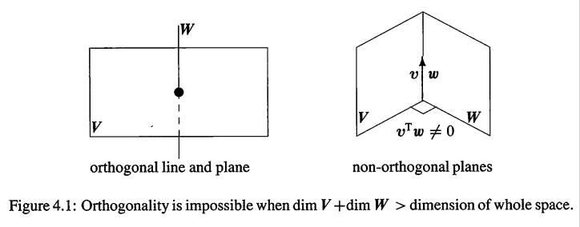
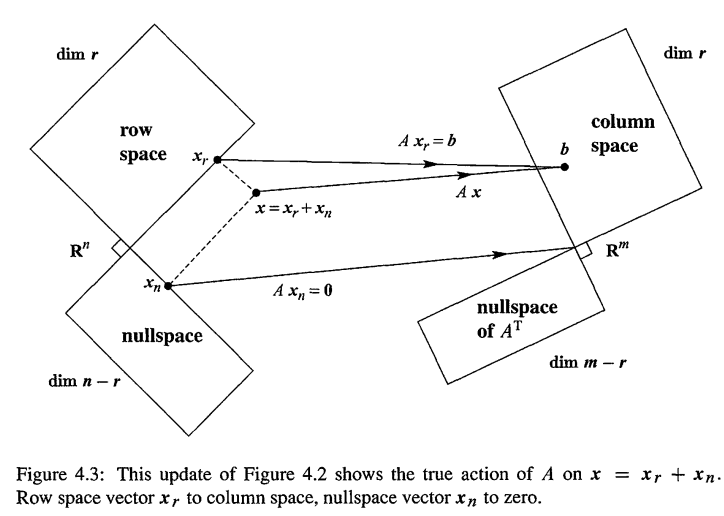
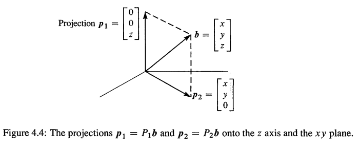
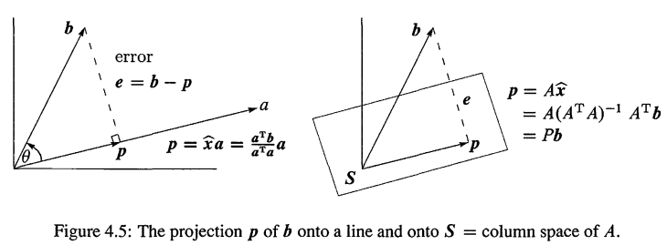
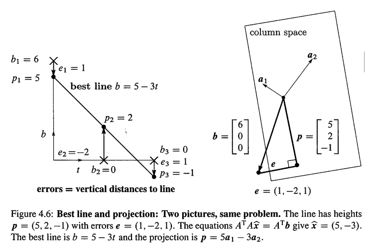
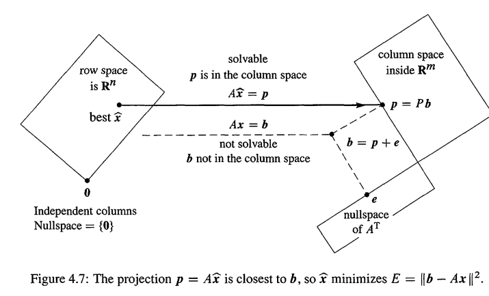
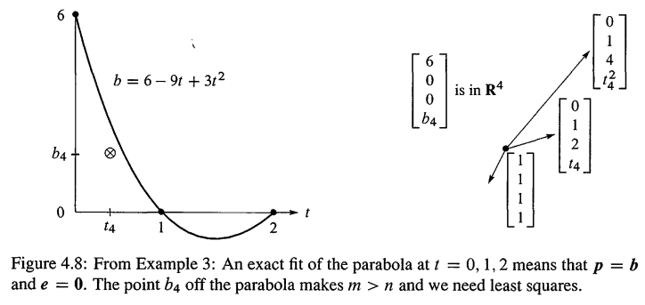
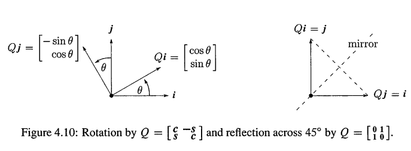

# 1. 四个子空间的正交性

> - Orthogonality of the Four Subspaces
> - 本章综合到视频14-17，视频16在 `<01-06>` 部分综合，因为内容是关于正定矩阵

2个向量在点乘为0的时候是正交的，也就是 $v \cdot w = 0$ 或 $v^T w =0$.本章，我们要扩展正交的概念到 

- **正交子空间(Orthogonal subspaces)**
- **正交基(Orthogonal bases)**
- **正交矩阵(Orthogonal matrix)**

从而，子空间任何2个向量，基的任何2个向量，矩阵的任意2个列，都是正交的。

$$
\text{正交向量：} \quad 

\begin{aligned}
	& v^Tw = 0  \\
	& |v+w|^2 = |v|^2 + |w|^2  \quad  \text{因为}(v+w)^T (v+w)= v^T v+ w^T w）
\end{aligned}
$$


矩阵A乘以一个向量

1. 第一个层次只是数字
2. 第2个层次是列向量的组合
3. 第三个层次是子空间

但是我不认为你真正看到整个图像,除非你学习 Fig4.2 !它把子空间联系起来,展示了 $Ax$ 隐藏的事实.子空间之间的90度夹角是新的知识,**我们必须知道为何有这个直角的存在。**基础定理Part 1是四个子空间的维数.现在看看基础定理Part 2.

- **行空间和零空间是 $R^n$ 下的正交子空间**
  行空间的任何向量，和 `Ax = 0` 任何解都正交。这是Fig4.2左半部分垂直的原因.这个垂直性就是线性代数基础定理的第二部分
- **列空间和 $A^T$ 零空间是 $R^m$ 下的正交子空间**
  当b**不在**A的列空间,我们仍然想要求解 `Ax = b` 。 这时候 $A^T$ 的零空间就发挥作用了.它包含了最小二乘误差解(least-square solution)当中的误差 $e = b -Ax$.最小二乘是本章的关键应用

首先定义正交子空间

> **Definition：正交子空间**
>
> ----
>
> 一个向量空间的2个**子**空间 V,W,如果**任何** V 当中的向量 v, 都和 W 当中的任何向量 w 垂直，那么，V,W 就是正交子空间：
> $$
> \text{Orthogonal subspaces:} \quad v^Tw = 0 \quad \color{orange} \text{for all v in V and all w in W}
> $$
> 


**例1.**  房间里的地板(无限延伸)是一个子空间V，而2面墙的交线是一个子空间W(一维的).这2个子空间是正交的，交线上的任何向量，和地板生的任何向量，都是垂直的。



反过来，考虑2面垂直的墙V,W,它们看起来像是正交的子空间，但是不是！2面墙的交线，同时属于V，W,这条交线并不和自身垂直！**2个平面（$R^3$ 下都是2维子空间）不可能是正交子空间。** 实际上,**当两个子空间有共同的向量,它们肯定不正交(除非是0向量).所以两个不正交的子空间,交集只会有零向量.**

再比如，矩阵 $A = \left[\begin{matrix} 1 & 2 & 5\\2 & 4 & 10\\\end{matrix} \right]$, 行空间是一维的经过(1,2,5)的一条直线.r = 1.那么 `dim N(A) = n - r = 3 - 1 = 2` .所以零空间是一个平面,**这个平面垂直于向量(1,2,5)的一个平面,向量(1,2,5)就是平面的法向量N!**.

---

再看看为什么**行空间$C(A^T)$，和零空间N(A),是 $R^n$ 下的2个正交子空间**,把 Ax = 0 方程组写出来：
$$
Ax = ​​\left[\begin{matrix} r_1 \\\vdots \\r_m\\ \end{matrix} \right]  [x]

= ​​\left[\begin{matrix}0\\\vdots\\ 0  \end{matrix} \right]


 \quad \color{orange}  \begin{matrix}\leftarrow r_1 \cdot x = 0 \\\ \vdots \\ \leftarrow r_m \cdot x = 0 \\ \end{matrix} 
 
 \tag{1}
$$
**A的每一行，和x点乘都是0！所以x也和A的行的任何线性组合都是垂直的，所以整个行空间和零空间正交。**

第二个证明方法:行空间的向量是行的组合 $A^Ty$,把 $A^T y$ 和零空间的任何x点乘,我们看到
$$
\text{Nullspace and row space:} \quad

x ^ { \mathrm { T } } \left( A ^ { \mathrm { T } } y \right) = ( A x ) ^ { \mathrm { T } } y = 0 ^ { \mathrm { T } } y = 0

\tag{2}
$$
---

现在我们看看另外两个子空间:**列空间C(A)和左零空间 $N(A^T)$ 是 $R^m$ 下的正交子空间**. 如何证明？将 `Eq(1)` 的证明过程应用到 $A^T$,$A^T$ 的列就是 A 的行，QED！为了可视化的的鞥是，看看 $A^T y=0$ ,y 是 $A^T$ 的零空间向量，也就是 A的左零空间向量
$$
C(A) \perp N(A^T) \quad  A^Ty = \left[\begin{matrix} 
	\text{(cloumn 1)}^T  \\
	\dots  \\
	\text{(cloumn n)}^T  \\
\end{matrix} \right] [y] = \left[\begin{matrix} 
	0  \\
	.  \\
	0  \\
\end{matrix} \right] \tag{3}
$$


## 1.1. 正交补

> Orthogonal Complements

**重要**:4个子空间不仅仅是两两正交,而且它们的维数恰恰好; $R^3$ 下的两条直线可以正交,但是这2直线不可能是 `3-3` 矩阵的行空间和零空间,因为这两条支线的维数是1,加起来只是2.正确的维数 r 和  `n-r` 加起来必须是 n = 3

4大子空间不仅仅是正交的，它们还是正交补，现在定义这个概念

> **Definition：正交补**
>
> ---
>
> 子空间 V 的正交补，是一个子空间，用 $V^{\perp}$ 表示，这个子空间包含了**所有** 和 V 当中的向量正交的向量。
>
> ---
>
> sp：正交补比正交子空间更进一步，参见 `典型例题1` 理解

根据这个定义,零空间是行空间的正交补,**任何**垂直行的 `x` 都可以求解Ax = 0


反过来也是正确的,**如果v是和零空间垂直的,那么它肯定是在行空间里面**! 因为,如果不是的话,我们可以把 `v` 加到矩阵作为新的1行，(sp:为何可以作为新的一行，因为已经假设 v 不是行空间里面，也就是不是行的任何线性组合，所以v可以作为新的1行)，那么行空间增加了维数，但零空间不变, `r + n-r=n` 的定理被打破了!从而得出结论: 零空间的补 $N(A)^{\perp}$ 就是行空间 $C(A^T)$

同理，列空间和左零空间是在 $R^m$ 下正交的,它们是正交补,它们的维数是 `r,m-r`,加起来是m


### 1.1.1. 线代基础定理 Part2

> **线代基础定理 Part2**
>
> ---
>
> - 零空间$N(A)$ 是行空间 $C(A^T)$ 的正交补 ($R^n$ 下)
> - 左零空间$N(A^T)$ 是列空间 $C(A)$ 的正交补 ($R^m$ 下)


**补(complement)**的关键是:**每一个x,可以被分为行空间分量 $x_r$ 和零空间分量 $x_n$ !当A乘以 $x = x_r+ x_n$**, 如Fig4.3所示：

- **零空间分量部分变成0 ：$Ax_n = 0$**
- **行空间分量部分，转换到列空间： $Ax_r = Ax$**



**任何向量被A乘，都会到达列空间，除此之外，不会有其他任何效果!(Every vector goes to the column space! Multiplying by  A  cannot do anything else）**

不仅如此,**列空间的每一个向量 `b`,来自于1个且仅且1个行空间的向量!(More than that:  Every vector b in the column space comes from one and only one vector in the row space)**.

> **证明:** 如果 $x_r,x_r'$ 都是行空间向量，并且 $Ax_r  = Ax_r′ = b$,那么
>
> - 差值 $x_r  − x_r′$ 是在零空间的,因为 $A(x_r-x_r') = Ax_r - Ax_r' = 0$
> - $x_r  − x_r′$ 也是在行空间里面，因为 $x_r  − x_r′$ 是行空间向量的线性组合而已，组合之后肯定还在原来的空间：行空间
>
> 因为零空间和行空间垂直，所以差值 $x_r - x_r'$ 只能是零向量,因此 $x_r= x_r^′$
>
> ---
>
> **sp-Note1**：你可能会想，垂直向量的差也不一定为0向量啊，比如 `a=(-5,2)，b=(1,2.5)`,a,b是正交的，但是差值明显不是零向量。注意，证明过程使用的是：**空间是垂直的**！看 Fig4.3,这2个空间的交集部分只有“点”而已。~~况且，零空间和行空间大多数情况下维数都是不一样的！~~ 这里想岔了，维数不是向量分量个数，不要搞错了。行，零空间的向量都是n个分量的。
>
> 重点在于，$ v =x_r - x_r' $ 是1个向量，是这1个向量，既在行空间，也在零空间，而行，零空间的向量是正交的，也就是自身和自身正交，v向量和自身正交，那么 $v\cdot v = 0$,只有零向量满足！**所以每一个 $Ax_r = b$ 的 $x_r$ 在行空间都是唯一的。**
>

在A当中有一个 `r-r` 的可逆矩阵隐藏着!如果把2个零空间扔掉,那么**就是单纯的从行空间转换到列空间，A变成可逆**,`<01-07 #3>`学习伪逆(pseudoinverse)就可以逆这个A矩阵。

---

**例2.** 每一个对角矩阵都有一个r-r的**可逆**子矩阵
$$
A = \left[ \begin{array} { l l l l l } 3 & 0 & 0 & 0 & 0 \\ 0 & 5 & 0 & 0 & 0 \\ 0 & 0 & 0 & 0 & 0 \end{array} \right] \text { 包含子矩阵 } \left[ \begin{array} { l l } 3 & 0 \\ 0 & 5 \end{array} \right]
$$
其他11个0是负责形成零空间的!下面的B的秩也是2
$$
B = \left[ \begin{array} { l l l l l } 1 & 2 & 3 & 4 & 5 \\ 1 & 2 & 4 & 5 & 6 \\ 1 & 2 & 4 & 5 & 6 \end{array} \right] \text { 在主列主行交汇处包含子矩阵 } \left[ \begin{array} { l l } 1 & 3 \\ 1 & 4 \end{array} \right]    
$$
**当我们为 $R^n$ 和 $R^m$ 选择恰当的基之后，每一个A都可以变成一个对角矩阵.这种奇异值分解SVD在应用当中是极其重要的**

> sp-Update:这里还不是特别理解想要表达什么。意思应该是，通过构造基，把任何A都化作对角矩阵。。。。后面补充


## 1.2. 组合子空间的基

> Combing Bases from Subspaces

下面讲解关于基的重要知识,现在才讲，是因为现在我们已经明确清楚基什么(**线性独立**的可**生成**一个空间的向量).通常，下我们需要检查这些性质.但是向量数目是对的时候,其中一个性质可以推得另一个性质:

> **只要有==正确数目==的向量，基的一个性质可以推得另一个性质**：
>
> ---
>
> - $R^n$ 下的 n 个独立的向量肯定生成 $R^n$,所以它们是基
> - 任何生成 $R^n$ 的 n 个向量肯定是独立的，所以它们是基

对于行空间和零空间的基,我们有 `r +(n-r) =`  n个向量.这就是==正确的数目==，现在我们证明n个基向量是独立的：

> **sp-Note2**：为何行,零空间向量独立？证明
>
> 假设$x_r,x_n$ 分别是行空间和零空间的**任意**向量，而且**不**独立，那么存在 $c,v\ne 0$,使得 $cx_r+dx_n = 0$.也就是说 $x_r = -\frac{d}{c}x_n$. $x_r$ 本身是行空间向量，现在式子表明它是 $x_n$ 的一个数乘，所以也是零空间向量，也就是 $x_r$ 即在行空间，又在零空间，而这2个空间正交，也即是说 $x_r \cdot x_r = 0$，那么 $x_r$ 只能是零向量，但零向量是不能为基的，所以假设不成立。从而**行空间，零空间向量一定是独立的**
>
> 总结一下把，从而使得概念清晰一点：$x_r,x_n$ 都是
>
> 1. 都是n个分量
> 2. 它们之间正交
> 3. 它们之间独立，如上所证明
> 4. 它们之间完全不可能相等，也就是行，零空间不可能有一样的向量。这其实是独立的延伸，不然肯定不独立。其实这从书中也可以看出来，`Fig4.3` 的行，零空间的交集，只有“点”。

所以行，零空间的n个基独立，所以它们**生成 $R^n$**，所以：**任何向量x，都可分解为行空间==向量== $x_r$ 加上零空间==向量== $x_n$ ,也即是 $x = x_r +x_n$**.

> - 注意上述向量2字为何强调，意思是要表达**是向量，不一定是基**。是这2个空间的n个**基向量**已经生成了整个$R^n$ 了，那么这n个基向量，可以线性组合成任何需要的 x 向量，而这个线性组合其实就是：行空间的基向量的线性组合+零空间向量的线性组合，而每个空间基向量的线性组合所产生的，其实也就是本空间的一个==向量==而已。
> - 至于如何分解，参见`典型例题2 第4问!`

现在在仔细看看 Fig4.3,好好理解一下其中的意味！

----

根据上述结论，当向量是 `n-n` 的**方阵** A 的列,肯定有下面2个事实:

> - 如果 A 的 n 个列是独立的，那么它们生成 $R^n$,所以 Ax = b有解
> - 如果 A 的 n 个列生成 $R^n$,那么它们独立，所以 Ax = b只有1个解

这2句话的意思是：唯一性意味着存在，而且存在意味着唯一性，从而**A可逆**。分析下

- 解 x 是**唯一的**，那么没有自由变量，必然存在 n 个主元，n个列独立，生成整个$R^n$,从而 Ax = b 肯定**存在**解。
- 从反方向开始,假设Ax = b对于任何b都有**解存在**,那么消去后不会产生任何的0行,有n个主元,没有自由变量.零空间只有**唯一解**： `x = 0` 

---

**例3.**  对 $A = \left[\begin{matrix} 1 & 2 \\ 3 & 6 \end{matrix} \right]$,分解 $x = \left[\begin{matrix} 4  \\3  \\\end{matrix} \right]$ 到 $x_r + x_n = \left[\begin{matrix} 2  \\4  \\\end{matrix} \right] + \left[\begin{matrix} 2  \\-1  \\\end{matrix} \right]$.

> sp:这一题的意思就是，把 x 分解到A的行空间和零空间。分解方法就是 `典型例题2 第4问`

首先，计算出行零空间的基向量
$$
A = \left[\begin{matrix} 1 & 2 \\ 3 & 6 \end{matrix} \right] \Rightarrow A = \left[\begin{matrix} 1 & 2 \\ 0 & 0 \end{matrix} \right]
$$
所以行空间的基是 `(1,2)`,零空间的基是 `(-2,1)` .那么分解就是求解如下方程组
$$
\left[\begin{matrix} 1 & -2 \\ 2 & 1 \end{matrix} \right] 
\left[\begin{matrix} c_1  \\c_2  \\\end{matrix} \right] = \left[\begin{matrix} 4  \\3  \\\end{matrix} \right] = x
$$
解得 $c_1 = 2,c_2 = -1$,那么

- $x_r =  c_1 * (1,2) = (2,4)$
- $x_n =  c_2 * (-2,1) = (2,-1)$


## 1.3. 总结

1. 子空间V，W,如果V当中的任何向量 v 都和 W 当中的任何向量 w 垂直，那么它们正交
2. 子空间V，W，如果 W 包含了**所有**和 V 正交的向量，而且 V 也包含了所有和 W 正交的向量，那么它们就是正交补。在 $R^n$,正交补的维度加起来是n
3. $R^n$ 下的任意n个独立的向量都能生成 $R^n$
4. 任何 $R^n$ 下的向量 x，都有一个零空间分量(nullspace component) $x_n$ 和一个行空间分量(rowspace component) $x_r$

本节知识梳理：

1. 首先定义正交子空间
2. 然后更进一步定义正交补
3. 然后证明行空间，零空间是正交补(列，左零空间也一样的)
4. 因为正交补，所以行空间，零空间的基向量都是独立的，从而可以生成整个 $R^n$,所以任何向量x，都可以分解为行空间向量 + 零空间向量: $x = x_r +x_n$


## 1.4. 典型习题

**1.** 假设 S 是一个9维空间下的一个6维子空间

1.  和S正交的子空间的维度可能是多少？
2. S正交补 $S^{\perp}$ 的维度可能是多少？
3. 如果A的行空间是S，那么A的最小形状是什么？
4. A零空间矩阵N的形状是什么？

解： 

1. 维度可以是 `0,1,2,3`!
2. **正交补其实就是维度最大的正交子空间**，所以维度肯定是3.
3. S是6维的，必有6个基，6个基向量都作为A的行，而S的向量是9个分量的，所以是 6-9
4. A是 6-9 的，而行空间和零空间是正交补，所以 N 的列必须包含 $S^{\perp}$  的基，所以N是 9-3的

---

**2.** 等式 $x-3y-4z = 0$ 描述了 $R^3$ 下的一个平面P(实际上是一个子空间）

1. 平面P是一个 1-3 矩阵A的零空间N(A)，这个A是什么？
2. 求 $x-3y-4z=0$ 的特解的基，这些基是零空间矩阵N的列
3. 再求出和 P 垂直的直线 $P^{\perp}$ 的基
4. 把 `v=（6，4，5)` 分解到 P 当中的零空间分量，和 $P^{\perp}$ 当中的行空间分量

解： 

> sp:$x-3y-4z = 0$ 是一个平面P，P就是表示一个零空间，求出特解就是求零空间的基！

**1.** A 是 `[1,-3,-4]`

**2.** c2,c3都是自由变量，那么 $s_1 = (3,1,0),s_2=(3,0,1)$，所以 **P = N(A)**.

**3.**.$P^{\perp}$ 就是A的行空间，而 A 只有一行，所以这条线的方向就是 `z= (1,-3,-4)`

**4.** 把向量分解为正交补空间的向量的线性组合，其实就是解方程组啊，目前，我们有3个基 $s_1,s_2,z$，要组合它们得到 v,不就是 $c_1s_1+ c_2s_2+c_3 z = v$ 吗，也就是
$$
Ax = b \quad  \Rightarrow\underbrace{\left[ \begin{array} { l l l } 3 & 4 & 1 \\ 1 & 0 & - 3 \\ 0 & 1 & - 4 \end{array} \right]}_{\color{orange} \text{这个矩阵的列就是行列空间的基构成！}}

\left[ \begin{array} { r } c_1 \\ c_2 \\ c_3 \end{array} \right] = \left[ \begin{array} { l } 6 \\ 4 \\ 5 \end{array} \right]
$$
直接消去化简，得到 $c_1 = 1,c_2 = 1,c_3 = -1$ ，那么

- A的前2列是零空间的基，所以 $v_n= c_1s_1 + c_2s_2 = (7,1,1) $
- A的地3列是行空间的基，所以 $v_r= c_3z = -z = (-1,3,4) $

这个方法，就是使用2个子空间的全部基 $s_1,s_2,z$ 来计算。下一节 `<#2>`,我们会把v直接投影到子空间S，从而不需要$S^{\perp}$ 的基！

> ~~sp-Update~~:最后一句话是什么意思？看下去把，就是把b分解成 p 和 e！


# 2. 投影

> Projections

> 导言(来自视频15):考虑一下,为什么需要投影?因为Ax = b有可能无解,只能求解最接近的那个可解的问题.那么,最接近的可解是什么呢?我们知道Ax总是在A的列空间里面,而b不一定是,所以我们需要调整b,把b变成列空间最接近它的那一个,然后求解 $A\widehat{x} = p$,p是b在A的列空间上的投影!

从两个问题开始这一节，第一个问题展示，投影过程是很形象化的，第2个问题是关于投影矩阵：$P^2 = P$ 的对称矩阵，`b` 的投影就是 `Pb`!

1. `b = (2,3,4)`的投影,在z轴和xy平面上分别是什么?
2. 什么样的矩阵可以产生这个到线和平面的投影呢?

当b投影到一条线的时候,它的投影 `p` 是**这条线的一部分**,当投影到一个平面的时候,投影`p` 是**平面的一部分**.**投影p就是Pb**,也就是**投影矩阵P乘以b的得到p**.这一节我们会找到p和P

第1个问题是到z轴的投影，设为 $p_1$,第2个投影是把 `b` 直接扔进xy平面，设为 $p_2$,如 Fig4.4 所示, $p_1=(0,0,4),p_2=(2,3,0).p_1,p_2$ 是b在z轴和xy平面的部分



投影矩阵 $P_1,P_2$ 都是 3-3 的矩阵,它们乘以3个分量的 `b` 来产生3个分量的 `p`.其中,**投影成一条直线的 $P_1$ 是秩一矩阵,投影到平面的是秩2矩阵**
$$
\text{投影到Z轴:}\quad P_1 = \left[\begin{matrix} 0 & 0 & 0\\0 & 0 & 0\\0 & 0 & 1\\\end{matrix} \right]
\quad
\text{投影到xy平面:}\quad P_2 = \left[\begin{matrix} 1 & 0 & 0\\0 & 1 & 0\\0 & 0 & 0\\\end{matrix} \right]
$$
$P_1$ 把每一个向量的z分量选择出来,$P_2$ 把x,y分量选择出来.如下
$$
p_1 =  P_1b = \left[\begin{matrix} 0 & 0 & 0\\0 & 0 & 0\\0 & 0 & 1\\\end{matrix} \right]
​​\left[\begin{matrix}x\\y\\z\\ \end{matrix} \right] = ​​\left[\begin{matrix}0\\0\\z\\ \end{matrix} \right]
\quad
p_2 =  P_2b = \left[\begin{matrix} 1 & 0 & 0\\0 & 1 & 0\\0 & 0 & 0\\\end{matrix} \right]
​​\left[\begin{matrix}x\\y\\z\\ \end{matrix} \right] = ​​\left[\begin{matrix}x\\y\\0\\ \end{matrix} \right]
$$
在这个例子当中,$p_1,p_2$ 是垂直的,**xy 平面 和 z 轴是正交的子空间,**不仅如此,这条线和这个平面是**正交补**.它们的维数加起来是 `1+2 = 3`.**整个 $R^3$ 空间中的每一个向量 `b` ,都可表达为，b本身在2个==子空间部分==的和 ，这个部分，就是==投影== $p_1,p_2$ **：
$$
\text{向量和是：} p_1+p_2 = b   \quad  矩阵和是： P_1+P_2 = I   \tag{1}
$$
完美!这个例子我们的目标达到了。但更远大的目标是： **对于任何直线,任何平面,任何n维空间** 作为被投影的子空间，都想要找到

- b向量在这个子空间的**部分 `p`**
- 和投影矩阵P,从而产生 $p = Pb$

**每一个 $R^m$ 的子空间都有一个 `m-m` 的投影矩阵**,为了计算P矩阵,我们需要一个描述需要被投影子空间的好方法.而描述子空间最好的方式就是基!我们把**基向量当成是A的列,那么现在,我们就是对 `A` 的列空间进行投影！**明显的，本节开始的问题当中

1. 投影到z轴就是一个 `3-1` 矩阵 $A_1$ 的列空间,
2. 投影xy 平面，是一个 `3-2` 矩阵 $A_2$。注意一个子空间可能有很多基,所以 $A_3$ 代表xy平面也是可以的

$$
A _ { 1 } = \left[ \begin{array} { l } 0 \\ 0 \\ 1 \end{array} \right] \text { , } A _ { 2 } = \left[ \begin{array} { l l } 1 & 0 \\ 0 & 1 \\ 0 & 0 \end{array} \right] \text { , } A _ { 3 } = \left[ \begin{array} { l l } 1 & 2 \\ 2 & 3 \\ 0 & 0 \end{array} \right]
$$
我们的问题是,把**任何 `b` 投影到任何 `m-n` 的矩阵的列空间上.** 下面从一条直线开始(维数n =1)开始，矩阵A只有一个列,这个矩阵称为a.


## 2.1. 投影到线上

> Projection onto a line

经过原点的一条直线在方向 $a = (a_1…a_m)$， 在这条直线上，我们想要找到一个点 `p`，从而 `p` 点距离 $b = (b_1,...b_m)$ 最近.投影的关键是正交:**从 b 到 p 的直线 e ,是和向量 a 垂直的!** 如Fig4.5左半部分



投影 `p` 是 `a` 的一个数乘.设为 $p = \hat{x}a$.计算出 $\hat{x}$ 就可以得到投影 `p` ,然后从 `p` 的公式里面,我们可以得到投影矩阵 `P`.这三个步骤可以得到所有的投影矩阵:

1. 求 $\hat{x}$
2. 求投影向量 `p`
3. 求投影矩阵 `P`

现在开始求 $\hat{x}$.因为 $e = b- p = b - \hat{x}a$,是和a**垂直的**，所以
$$
a \cdot (b - \hat{x} a) = 0     \rightarrow \quad
a \cdot b - \hat{x} a\cdot a = 0 \rightarrow \quad 
\hat{x} = \frac{a \cdot b}{a \cdot a} = \frac{a^Tb}{a^Ta}  
\tag{2}
$$
乘法 $a^T b$ 和 $a \cdot b$ 是等价的.使用转置符号把a当成矩阵看待.可得到

> **向量 b 投影到直线 a 上的结果是 向量 $p = \hat{x} a = \frac{a^Tb}{a^Ta}   a$**  
>
> - 特殊情况1： 如果 b = a,那么 $\hat{x} = 1$,也就是向量 a 投影到 a 本身 还是 a 自己，$Pa = a$
> - 特殊情况2： 如果 b 和 a 垂直,那么 $a^Tb = 0$,投影结果是 $p = 0$


**例1** 参见 Fig4.5,把 $b = \left[\begin{matrix}1\\1\\1\\ \end{matrix} \right]$ 投影到 $a = \left[\begin{matrix}1\\2\\2\\ \end{matrix} \right]$,求投影结果 $p = \hat{x}a$.

解： $a^Tb = 5,a^Ta = 9$ , 所以 $\hat{x} = \frac{5}{9}$,投影结果是  $p = 5/9a$.误差向量是 $e = b - p$,所以误差向量和投影结果向量的和是b = (1,1,1)。
$$
p = \frac { 5 } { 9 } a = \left( \frac { 5 } { 9 } , \frac { 10 } { 9 } , \frac { 10 } { 9 } \right) \quad , \quad e = b - p = \left( \frac { 4 } { 9 } , - \frac { 1 } { 9 } , - \frac { 1 } { 9 } \right)
$$
e 和 a 是**垂直**的： $e \cdot a = 0$!

注意观察 b,p,e形成的三角形，向量 b 被分解成2个部分：

1. 沿着 a 方向的 p 部分，长度是 $|b| \cos \theta$
2. 垂直 p 方向的 e 部分,长度是 $|b| \sin \theta$

可通过三角知识验证点乘符合：
$$
\boldsymbol { p } = \frac { \boldsymbol { a } ^ { \mathrm { T } } \boldsymbol { b } } { \boldsymbol { a } ^ { \mathrm { T } } \boldsymbol { a } } \boldsymbol { a } \quad \text { 长度是 } | \boldsymbol { p } | = \frac { | \boldsymbol { a } | | \boldsymbol { b } | \cos \theta } { | \boldsymbol { a } | ^ { 2 } } | \boldsymbol { a } | = | \boldsymbol { b } | \cos \theta

\tag{3}
$$
使用点乘，比使用 b 的 $\theta$ 角度简单多了，在这里，$\cos \theta = 5/3\sqrt{3},|b| = \sqrt{3}$ ,但在投影结果 $5/9a$ 是没有平方跟的，从点乘 $\frac{a^Tb}{a^Ta}  $ 计算方便多了

---

现在我们看看投影矩阵.根据 $p=\hat{x}a$ 公式：
$$
\text{投影矩阵P：}\quad p = a\hat{x} = a\frac{a^Tb}{a^Ta}   = Pb   \Rightarrow \quad  P = \frac{aa^T}{a^Ta}  \tag{M9}
$$
> **sp-Note1: P是列乘以行形成的矩阵!** 列是a,行是 $a^T$,再除以**数字** $a^Ta$.投影矩阵是 `m-m` 的**秩1矩阵**.我们**投影目的地**是一个**一维子空间**:经过a的直线,也就是**P的列空间!**

**例2.** 求投影到 $a = \left[\begin{matrix}1\\2\\2\\ \end{matrix} \right]$ 的投影矩阵 $P = \frac{aa^T}{a^Ta}$

解： 
$$
P = \frac { a a ^ { \mathrm { T } } } { a ^ { \mathrm { T } } a } = \frac { 1 } { 9 } \left[ \begin{array} { l } 1 \\ 2 \\ 2 \end{array} \right] \left[ \begin{array} { l l l } 1 & 2 & 2 \end{array} \right] = \frac { 1 } { 9 } \left[ \begin{array} { l l l } 1 & 2 & 2 \\ 2 & 4 & 4 \\ 2 & 4 & 4 \end{array} \right]
$$
这个矩阵 P 将任何向量 b 投影到 a,可用例1的 $p = Pb$ 检查一下：
$$
p = P b = \frac { 1 } { 9 } \left[ \begin{array} { l l l } 1 & 2 & 2 \\ 2 & 4 & 4 \\ 2 & 4 & 4 \end{array} \right] \left[ \begin{array} { l } 1 \\ 1 \\ 1 \end{array} \right] = \frac { 1 } { 9 } \left[ \begin{array} { c } 5 \\ 10 \\ 10 \end{array} \right] 
\quad \text{正确}
$$
**如果向量 a 翻倍，矩阵P还是不变，还是投影到同一条直线。如果P矩阵平方，$P^2 = P!$ 因为第2次投影不会改变任何东西。** P的对角线元素和是 $\frac{1}{9}(1+4+4) = 1$

---

总结一下例1例2的思想：把向量 b 投影到直线 a 上，其实就是投影到只有1列的 `A= [a]` 的列空间上，投影 p 是在 ==A的== **列空间** 当中。而且，矩阵 $I - P$ 也是一个投影矩阵:$(I-P) b = b - p = e$, 这个投影结果是三角形的另一条边 e .**当 P 投影到一个子空间，$I-P$ 投影到对应的垂直子空间！**为什么？如下

- $p = Pb$ 投影 b 在投影在==A的==列空间
- $e = (I-P)b = e$ ，e和p垂直，所以肯定在==A的==左零空间

在本例，$I-P$ 投影到和 a 垂直的平面。

> **sp-Note2** :要非常注意，p 是投影在 ==A的== 列空间，**其实也在投影矩阵P的列空间**，看 `总结第2点`

---

现在我们看看不仅仅投影到一个直线上,而是投影到 $R^m$ 的n维子空间上.至关重要的公式是等式5,6,7,你需要记住它们


## 2.2. 投影到子空间

> Projections Onto a Subspaces

从 $R^m$ 下的 n 个向量 $a_1...a_n$ 开始,假设这些a是线性独立的.**目标:找到的线性组合 **
$$
p =\hat{x_1}a_1  + ... + \hat{x_n}a_n  \tag{M1}
$$
**使得 p 最接近给定向量 b。** 

这其实就是，把 $R^m$ 下的 n 个**独立的**向量 $a_1...a_n$，作为一个矩阵 A 的列，A 是 m-n 形状的，列空间维数是n。而`Eq(M1)` 的线性组合，就是对A列向量的线性组合 $p = Ax$，**p肯定还属于A的列空间**，而我们想要这个p，和b最接近。 $\hat{x}$ 就是所有 x 当中最好的一个，能让 $p = A\hat{x}$ 最接近 b. 这**个最接近 b 的 $p = A\hat{x}$,就是 b 在 A 的列空间(向量 $a_1...a_n$ 所形成的子空间)当中的投影。**注意，**投影 `p` 属于子空间(这里是A的列空间)当中的向量**。

当n = 1(只有1个向量 $a_1$),就是 `例1，2` 投影到直线的例子,这条直线就是A的列空间,A只有一列.因为是投影到一条直线，所以最接近b意味着和b垂直，从而得到这个最好的组合是 $\hat{x} = \frac{a^Tb}{a^Ta}$.

一般情况下,A有n列,$a_1...a_n$。当n >1,同样的还是三个步骤求 $\hat{x},p,P$

1. 找到 $\hat{x}$
2. 求出 $p = A\hat{x}$
3. 找到投影矩阵P

关键是几何知识! 下图还是 Fig4.5,注意右边部分


虚线部分表示， b 到其投影(投影是在子空间的!) $ p = A\hat{x}$ 的最近距离，这个距离(**误差向量，error vector**) 也就是 $b - A\hat{x}$ ,和**投影 `p` 所在的子空间垂直！**那么当n >1,误差向量 $b -A\hat{x}$ 是和所有的向量 $a_1...a_n$ 垂直的,从而得到n个关于 $\hat{x}$ 的方程
$$
\begin{aligned}
	a_1^T(b - A\hat{x}) &= 0 \\
	& \vdots \\
	a_n^T(b - A\hat{x}) &= 0 \\
\end{aligned}

\quad \text{也就是} \quad 

\left[\begin{matrix} 
	-a_1^T-  \\
	\vdots  \\
	-a_n^T-  \\
\end{matrix} \right]
\left[\begin{matrix} 
	  \\
	b - A\hat{x}  \\ 
	  \\
\end{matrix} \right]

= \left[\begin{matrix} 
	  \\
	0  \\
	  \\
\end{matrix} \right]   \tag{4}
$$
这些 $a_i^T$ 组成行的矩阵就是 $A^T$.这n个方程实际上就是 $A^T (b −A\hat{x} )=0$ ,也就是 $A^T A\hat{x}= A^T b$,这是关于 $\hat{x}$ 的方程,系数矩阵是 $A^T A$,现在我们可以找到 $x',p,P$. 

> 线性组合 $p = \hat{x_1}a+1 +... + \hat{x_n} a_n$ 是最接近 b 的，它来自于
> $$
> A ^ { \mathrm { T } } ( b - A \widehat { x } ) = 0 \quad \text { 也即是 }\quad A ^ { \mathrm { T } } A \widehat { x } = A ^ { \mathrm { T } } b
> 
> \tag{5}
> $$
> **对称**矩阵 $A^TA$ 是 n-n 的，**如果 a‘s 独立，那么它可逆**。解是 $\hat{x} = (A^TA)^{-1}A^Tb$，那么 b 在子空间的投影 p 就是：
> $$
> p = A\hat{x} = A (A^TA)^{-1}A^Tb  \tag{6}
> $$
> 产生 $p = Pb$ 的投影矩阵的公式就是
> $$
> P= A(A^TA)^{-1}A^T  \tag{7}
> $$
>
> sp-Note3:A是m-n,那么$A^TA$ 是 n-n,从而 P 是m-m，所以投影矩阵是 **m-m 矩阵**，而且P是**对称**的! $P^T = P$ ,转置一下就明白了！这是理解 `<总结 第2点>` 的关键

和投影到直线上的比较一下,也就是当n = 1,A只有一列a的时候,
$$
\hat{x} = \frac{a^Tb}{a^Ta},\quad 
p = a\frac{a^Tb}{a^Ta}   \quad
P = \frac{aa^T}{a^Ta}  
$$
只是 $a^Ta$ 一个数字.变成矩阵 $A^T A$,所以我们需要求逆.而对于的逆$(A^T A)^{−1}$,**a's之间的线性独立会保证逆矩阵存在.**

关键步骤是 $A^T (b−A\hat{x} )=0$,是由几何知识的垂直得到的。线性代数以非常快的方式给出了这个**正规方程(normal equation)**：

1. 要投影的子空间是A的**列空间**
2. 误差向量 $e = b - A\hat{x}$ 和这个列空间垂直
3. 因此 **$e=b - A\hat{x}$ 是 $A^T$ 的零空间！**这意味着 $A^T(b- A\hat{x}) = 0$

左零空间在投影中是很重要的.$A^T$ 的零空间包含了误差向量 $e = b - A\hat{x}$,**向量b被分解为投影 `p` 和误差 $e = b - p$.**投影操作产生了一个直角三角形(Fig4.5),三条边分别是`p,e,b`

举2个极端的例子:

1. 如果b已经在列空间上,那么投影后结果就是b自身
   b在列空间,那么b等于A的线性组合: `b=Ax`.这时候: $Pb = A(A^TA)^{-1} A^Tb = A(A^TA)^{-1}A^TAx=Ax = b$
2. 如果b垂直于列空间(把列空间想象成平面),那么b没有分量是属于列空间的,所以 Pb = 0
   为何？向量b垂直于列空间,意味着垂直于所有的列,所以它在 $N(A^T)$ 里!这时候如果我们乘以P,得到: $p = Pb = A(A^TA)^{-1}A^Tb$ 就会等于0,这是因为 $A^T$ b立马就可以得到0.这就是为什么Pb = 0这部分可以消去.

一般情况下,向量 b 会有分量在A的列空间上,另一分量在和列空间垂直的A的左零空间.**投影做的就是,去掉 e = Pb =0的部分（误差）,保留Pb = p的部分,而且 `e+p = b`**


**例3.** 如果 $A = \left[\begin{matrix} 1 & 0 \\1 & 1 \\1 & 2 \\\end{matrix} \right],b = \left[\begin{matrix}6\\0\\0\\ \end{matrix} \right]$，求 $\hat{x},p,P$.

解： 求对称矩阵 $A^TA$ 和 $A^T b$
$$
A ^ { \mathrm { T } } A = \left[ \begin{array} { l l l } 1 & 1 & 1 \\ 0 & 1 & 2 \end{array} \right] \left[ \begin{array} { l l } 1 & 0 \\ 1 & 1 \\ 1 & 2 \end{array} \right] = \left[ \begin{array} { l l } 3 & 3 \\ 3 & 5 \end{array} \right] \quad 

,\quad A ^ { \mathrm { T } } b = \left[ \begin{array} { l l l } 1 & 1 & 1 \\ 0 & 1 & 2 \end{array} \right] \left[ \begin{array} { l } 6 \\ 0 \\ 0 \end{array} \right] = \left[ \begin{array} { l } 6 \\ 0 \end{array} \right]
$$
现在求正规方程 $A^TA \hat{x} = A^T b$ 求 $\hat{x}$
$$
\left[ \begin{array} { l l } 3 & 3 \\ 3 & 5 \end{array} \right] \left[ \begin{array} { l } \widehat { x } _ { 1 } \\ \widehat { x } _ { 2 } \end{array} \right] = \left[ \begin{array} { l } 6 \\ 0 \end{array} \right] \quad 
\Rightarrow 
\quad \widehat { x } = \left[ \begin{array} { l } \hat { x } _ { 1 } \\ \widehat { x } _ { 2 } \end{array} \right] = \left[ \begin{array} { r } 5 \\ - 3 \end{array} \right]

\tag{8}
$$
线性组合 $p = A\hat{x}$ 是 **b 投影到 A 的列空间**：
$$
\boldsymbol { p } = A\hat{x} =  5  \left[ \begin{array} { l } 1 \\ 1 \\ 1 \end{array} \right] - 3 \left[ \begin{array} { l } 0 \\ 1 \\ 2 \end{array} \right] = \left[ \begin{array} { r } 5 \\ 2 \\ - 1 \end{array} \right] . \text { 误差是 } e = b - p = \left[ \begin{array} { r } 1 \\ - 2 \\ 1 \end{array} \right]

\tag{9}
$$
进行2个检查看看计算是否有问题

1. 首先，误差 $e = (1,-2,1)$ 和2个列 $(1,1,1),(1,2,1)$ 都是垂直的
2. 其次，$Pb$ 正确的得到了 $p = (5,2,-1)$

注意，**投影矩阵 P 的计算只要A，也就是不需要涉及到 b**，所以，任何 `b` 要投影到例3矩阵A的列空间，投影矩阵都是 $P = A(A^T A)^{−1} A^T$, $A^TA$ 的行列式是15-9 = 6,那么$(A^T A)^{−1}$ 很简单,:
$$
\left( A ^ { \mathrm { T } } A \right) ^ { - 1 } = \frac { 1 } { 6 } \left[ \begin{array} { r r } 5 & - 3 \\ - 3 & 3 \end{array} \right] \quad \text { and } \quad P = \frac { 1 } { 6 } \left[ \begin{array} { r r r } 5 & 2 & - 1 \\ 2 & 2 & 2 \\ - 1 & 2 & 5 \end{array} \right]
$$


## 2.3. 注意事项和 $A^TA$ 的可逆性

注意，$P = A(A^T A)^{−1} A^T$ 是很具有欺骗性的，你可能会想着把 $(A^T A)^{−1}$ 根据逆矩阵乘积的知识拆分成 $A^{−1}$ 和 $(A^T)^{−1}$,如果你这样做，再代入到P的公式当中，得到 $ P = A A^{-1}(A^T)^{-1}A^T = I$,但这是错误的！**因为A矩阵是矩形的，没有逆矩阵**，不可能把 $(A^T A)^{−1}$ 拆分成 $A^{-1}*(A^T)^{-1}$！

> sp:假设 A 是方阵而且独立列列，那么就生成了整个 $R^n$,b本身就在A的列空间，而误差e所在的左零空间只有零向量，根本没有投影的必要了！

在我的经验当中，涉及到矩形矩阵的时候，最后总是会使用到 $A^TA$,而且当A具有独立的列，$A^TA$ 就是可逆的。这个性质是如此的重要，我们下面强调，并给出证明

> **当且仅当A具有独立的列(满列秩，零空间N(A)只有零向量)， $A^TA$ 可逆**。注意 $A^TA$ 是 n-n 矩阵，可逆所以秩是n,所以 $\operatorname{rank}(A) = \operatorname{A^TA}$

**证明：**

$A^TA$ 是 n-n 的方阵。现在，对任何A，我们证明，**$A^TA$ 和 A的零空间是等价的！** 从而，当A的列线性独立，那么零空间只有零向量，而$A^TA$ 的零空间和 A 一样，只有零向量，又是方阵，所以可逆。

- **证明$A^TA$ 的零空间和A一样：** 设A是任何矩阵，如果 x 在零空间，那么 Ax = 0,左乘$A^T$,得到 $A^TAx = 0$,所以x也在 $A^TA$ 的零空间。

- **证明A的零空间和 $A^TA$ 一样：**  现在从 $A^TA$ 的零空间开始，从 $A^TAx = 0$，我们必须证明 $Ax = 0$，但我们不能左乘$(A^T)^{-1}$，因为这一般都是不存在的，直接左乘 $x^T$：
  $$
  \left( x ^ { \mathrm { T } } \right) A ^ { \mathrm { T } } A x = 0 \quad \text { 也就是 } \quad ( A x ) ^ { \mathrm { T } } ( A x ) = 0 \quad \text { 也就是 } \quad | A x | ^ { 2 } = 0
  $$
  上式意味着： 如果 $A^TAx= 0$，那么 Ax 的长度是0.所以 Ax = 0.

QED.所以，当 x 是其中一个零空间向量，那么肯定也是另一个. 如果 $A^TA$ 或 A 有依赖的列，那么A也是，如果 $A^TA$ 或 A 有独立的列，A也是.更进一步，$A^TA$ 还有如下性质：

- 方阵： $A^TA$ 是  n-m 矩阵乘以 m-n，矩阵，所以 $A^TA$ 是 n-n 的方阵。
- 对称：通过转置规则: $(A^TA)^T= A^T(A^{T})^{T} = A^TA$

所以： **当A具有独立列：$A^TA$是方阵，对称，且可逆**

看一下独立列和依赖列产生的 $A^TA$ 不同
$$
\left[ \begin{array} { l l l } 1 & 1 & 0 \\ 2 & 2 & 0 \end{array} \right] \left[ \begin{array} { l l } 1 & 2 \\ 1 & 2 \\ 0 & 0 \end{array} \right] = \left[ \begin{array} { l l } 2 & 4 \\ 4 & 8 \end{array} \right]  \quad \color{orange} \text{依赖}
\\

\left[ \begin{array} { l l l } 1 & 1 & 0 \\ 2 & 2 & 1 \end{array} \right] \left[ \begin{array} { l l } 1 & 2 \\ 1 & 2 \\ 0 & 1 \end{array} \right] = \left[ \begin{array} { l l } 2 & 4 \\ 4 & 9 \end{array} \right]  \quad \color{orange} \text{独立}
$$


## 2.4. 总结

投影矩阵满足 $P^2 = P$，且 $P^T= P$

**第1点：推导流程：** 为了求得 b 到到子空间的投影：$p= \hat{x_1}a_1...\hat{x_n}a_n$，把 $a_1...a_n$ 向量作为矩阵A的列，那么投影就是 $p = A\hat{x}$。误差向量是 $e = b -p = b - A\hat{x}$（ b到子空间的距离是 $|e| = |b-p|$）。根据几何知识，e必须和A的列空间垂直，所以e就是在==A的==**左零**空间，从而A的列和e点乘必须为0，也就是 $A^T(b-A\hat{x})= 0,A^TA\hat{x} = A^Tb$.从而解出

- $\hat{x} = (A^TA)^{-1}A^Tb$
- $p = A\hat{x} = A (A^TA)^{-1}A^Tb = Pb \rightarrow\quad P= A(A^TA)^{-1}A^T $

**第2点，容易引起困惑的地方**

1. 首先，$p = A\hat{x}$ ,所以 p 在 ==A 的==列空间，而 e 和 p 垂直，所以e在A的左零空间 $N(A^T)$
2. 其次，$p = Pb$,明显，b只是对P矩阵的列进行组合而已，所以p也在==P的==列空间。那么e也在P的左零空间
3. 然后，根据 `典型例题1`,e在P的零空间

可能吗？ **e既在P的左零空间，又在P的零空间！**当然可以啊，P是对称矩阵！$Pe = 0$,肯定有 $P^Te = 0$!困惑了好久啊！好神奇啊，2个零空间居然可以有交集。


### 投影矩阵性质

目前，已知 $P = P^2 = P^T$,还具有如下性质

> **除非P=I,不然投影矩阵都是奇异的**
>
> ---
>
> **证明**：$P = A(A^TA)^{-1}A^T$,首先我们证明 $rank(P) \le rank(A)$。设 $(A^TA)^{-1}A^T = M$，那么 $P = AM$.因此P的列都是A的列的线性组合，所以 $rank(P)\le rank(A)$
>
> A是 m-n 矩阵，P是 m-m 矩阵，而A的列必须是线性独立的,所以 $m\ge n$,因此 $rank(A) \le n$.(假设A的列是9维的向量，A的列线性独立，所以至多需要9列即可，所有 $m \ge n$).
>
> 综上，我们得到 $rank(P) \le rank(A) \le n$，并且 $m \ge n$
>
> - 如果 $m>n$，那么P明显奇异
> - 如果 $m = n$,那么,参见 `<#2.3>`, $A^TA$ 可逆，所以 $P = A(A^TA)^{-1}A^T = AA^{-1}(A^T)^{-1}A^T = I$
>
> QED
>


## 2.5. 典型例题


**1.** 把 b = (3,4,4) 投影到

1. 经过 a=(2,2,1)的直线上，验证误差向量 $e = b-p$ 和 a 垂直
2. 再投影到包含a和 $a^* = (1,0,0)$ 的平面上，验证误差向量 $e^* = b - p^*$ 和 $a,a^*$ 垂直，并求出投影矩阵P。什么向量投影到这个平面是零向量呢？

解： 到直线的投影是
$$
p = \frac { a ^ { \mathrm { T } } b } { a ^ { \mathrm { T } } a } a = \frac { 18 } { 9 } ( 2,2,1 ) = ( 4,4,2 )
$$
误差 $e = b - p = (-1,0,2)$,和a垂直，所以p正确

到平面的投影就是投影到 $A = [a,a^*] $ 的列空间，计算投影矩阵P
$$
A = \left[ \begin{array} { l l } 2 & 1 \\ 2 & 0 \\ 1 & 0 \end{array} \right] \quad A ^ { \mathrm { T } } A = \left[ \begin{array} { l l } 9 & 2 \\ 2 & 1 \end{array} \right] \quad \left( A ^ { \mathrm { T } } A \right) ^ { - 1 } = \frac { 1 } { 5 } \left[ \begin{array} { r r } 1 & - 2 \\ - 2 & 9 \end{array} \right] \quad P = \left[ \begin{array} { l l l } 1 & 0 & 0 \\ 0 & .8 & .4 \\ 0 & .4 & .2 \end{array} \right]
$$
那么，$p^* = Pb = (3,4.8,2,4)$,误差 $e^* = b - p* = (0,-0.8,1.6)$ 和 $a,a^*$ 都垂直。

注意，**$e^*$ 在P的零空间**，为什么?因为 
$$
Pe^* = P(b-p^*) = P(b- Pb) = Pb - P^2b = 0
$$
所以e的投影就是零向量！

---

**2.** 假设你的心跳经过3次测量，分别是 x =70/m,x=80/m,x= 120/m.方程组 Ax = b 是由3个方程组成的，其中 $A^T = [1；1；1],b= (70,80,120)$,使用微积分和投影，计算出最佳的 $\hat{x}$

> sp:这里最佳的意思是，类似于 `<#2.1>` 投影到一条直线上，就是求出一条拟合直线，使得误差最小

解：首先看微积分的方法，其实就是对方程 $E = ( x - 70 ) ^ { 2 } + ( x - 80 ) ^ { 2 } + ( x - 120 ) ^ { 2 }$ 最优化，求倒数
$$
\frac { d E } { d x } = 2 ( x - 70 ) + 2 ( x - 80 ) + 2 ( x - 120 ) = 0 \quad \Rightarrow \quad \widehat { x } = \frac { 70 + 80 + 120 } { 3 } = 90
$$
然后看看投影的方法，非常简单，直接套公式
$$
\widehat { x } = \frac { a ^ { \mathrm { T } } b } { a ^ { \mathrm { T } } a } = \frac { ( 1,1,1 ) ^ { \mathrm { T } } ( 70,80,120 ) } { ( 1,1,1 ) ^ { \mathrm { T } } ( 1,1,1 ) } = \frac { 70 + 80 + 120 } { 3 } = 90
$$

---

**3. ** 接上一题，假设第4次测量是 $b_4 = 100$,这会让 $\widehat{x}_{old}$ 变为 $x_{new}$,请验证 $\widehat{x}_{new} = \widehat{x}_{old} + \frac{1}{4} (130 - \widehat{x}_{old})$.

这其实有一个规则，假设已经进行了999次测量，第1000次测量，会得到  $\widehat{x}_{new} = x_{old}+\frac{1}{1000} (b_{1000} - \widehat{x}_{old}） $, 这只需要 $\widehat{x}_{old}$ 和最后测量的数据 $b_{1000}$ ，**不需要对1000个数字作平均值！**

解： $b_4 = 130$ 添加了第4个等式，$\widehat{x}$ 会被 更新为100，100可以通过直接平均4个数字，或者把 $b_1,b_2,b_3$ 的平均值和 $b_4$ 组合起来，如下
$$
\frac { 70 + 80 + 120 + 130 } { 4 } = 100\quad  \text { 也等于 } \quad \widehat { x } _ { \text {old } } + \frac { 1 } { 4 } \left( b _ { 4 } - \widehat { x } _ { \text {old } } \right) = 90 + \frac { 1 } { 4 } ( 40 )
$$
再第1000次测量之后，方程会出现一个 $1/1000$ 的 **kalman filter** 乘以预测误差(prediction error) ：$b_{new} - \widehat{x}_{old}$,注意 ，$1/1000 = 1/999 - 1/999000$
$$
\widehat { x } _ { \text {new } } = \frac { b _ { 1 } + \cdots + b _ { 1000 } } { 1000 } = \frac { b _ { 1 } + \cdots + b _ { 999 } } { 999 } + \frac { 1 } { 1000 } \left( b _ { 1000 } - \frac { b _ { 1 } + \cdots + b _ { 999 } } { 999 } \right) .
$$


# 3. 最小二乘近似

> Least Squares Approximations

Ax = b通常没有解,一般原因是:矩阵的行数比列数多,也就是**方程数目比未知数更多**.n个列只能生成 `m` 维空间的一小部分.除非所有的测量刚好,等式恰恰好,不然没有解.比如为了预测卫星的位置,我们测量了1000次的数据,所以可以得到1000个方程,但是方程数目多了以后,肯定有一些是坏的数目,右侧的一些b是不好的,导致方程组解不出来.但是b肯定也包含了好的数据,我们想要的就是把坏的数据去掉,留下好的计算.其中一个方法是,不断去掉一些方程,直到剩下一个可逆的矩阵.但是这种方法不完美,对于所有测量值而言,我们不知道那些数据是好的,那些是无效的坏数据.我们希望的是利用所有的测量值求出最优质.怎么做呢?

当`b` 在列空间外面.消去会到达一个不可能有解的情况,但是我们不能停止,因为测量只是包含了一些噪音而已

重复一下,误差 $e = b-Ax$ 不总是0,如果是0, `x` 就是 $Ax = b$ 的解.其他情况，我们想要e的长度尽可能的小,$\hat{x}$是一个最小二乘解.我们的目标是计算 $\hat{x}$ ,这是有现实意义的

前面的一节强调的是投影 `p`,这一节强调最小二乘解 $\hat{x}$.它们是通过 $p = A\hat{x}$ 联系起来的.基础方程仍然是 $A^T Ax=A^T b$.下面是一个不正式的得到这个方程的介绍:**当 Ax = b 没有解，左乘 $A^T$，求解 $A^TAx = A^T b$**


**例1.** 最小二乘的一个重要应用是从m个点拟合一条直线,比如,找到最接近点 `(0,6),(1,0),(2,0)` 的一条直线.首先我们需要知道,没有任何一条直线 $b= C+ Dt$ 可以经过这3个点,当 `t = 0,1,2` 的3个方程是

- t=1: 如果 `C+D* 0 = 6`,第1个点在直线 `b = C+Dt` 上
- t=2:如果 `C+D* 1 = 0`,第2个点在直线 `b = C+Dt` 上
- t=3: 如果 `C+D* 2 = 0`,第3个点在直线 `b = C+Dt` 上

这个3-2的系统没有解: `b = (6,0,0)` 不是列 `(1,1,1),(0,1,2)` 的组合.系统中的A,x,b是
$$
A = \left[ \begin{array} { l l } 1 & 0 \\ 1 & 1 \\ 1 & 2 \end{array} \right] \quad x = \left[ \begin{array} { l } C \\ D \end{array} \right] \quad b = \left[ \begin{array} { l } 6 \\ 0 \\ 0 \end{array} \right] \quad A x = b 无解
$$
本节的例3当中,使用的例子和本例是一样的,我们计算 $\hat{x} = (5,-3)$,这些数字就是C,D的最好选择,所以 `5 - 3t` 是一条拟合这3个点的的最好直线.在实践当中,m=3个点，可以很容易的变成 m = 100 个点,所以经常没有一条直线 C+Dt 可以经过这100个点,我们的例子夸大了误差,使你可以看到 Fig4.6 的 $e_1,e_2,e_3$


## 3.1. 最小化误差

> Minimizing the Error

下面内容以例1为例子。怎么使得误差 `e = b - p` 尽可能小呢?这个重要的问题有一个漂亮的解答.最好的x(称为$\hat{x}$ )可以通过

- 几何: 90度角
- 代数: 使用投影矩阵P投影
- 微积分：把误差的导数设置为0

得到



**1. By Geometry**

任何一个 `Ax` 都是在列 `(1,1,1),(0,1,2)` 组成的平面上的,是在这个平面上,我们想要寻找最接近 `b` 的点.这个最接近的点是**投影`p`.**

$A\hat{x}$ 的最佳选择就是`p`.最小的误差是 `e = b-p`.高度分别是 $(p_1,p_2,p_3)$ 的三个点确实是在同一条直线上的,因为p是在列空间的.在拟合一条直线的情况下,$\hat{x}$给出了(C,D)的最佳选择

**2. By algebra**

每一个向量b可以分为2部分.列空间部分是`p`,另外一个在**左零空间**的垂直部分是`e`.我们不能求解的方程是 $Ax = b$,但是对于Ax = p我们是能求解的(通过把e去掉)
$$
Ax = b = p+e \text{ 是不可能的，但 }  \quad  A\hat{x} = p \text{ 是可解的！} \tag{1}
$$
解 $A\hat{x} = p$ 留下了最小误差e
$$
\text{任何x，都有}\quad |Ax- b|^2 = |Ax -p|^2 + |e|^2  \tag{2}
$$
参见Fig4.6右边，`Eq(2)` 就是直角三角形的公式而已.向量 $Ax - p$ 是在列空间的,和左零空间的 `e` 垂直.**通过把 `x` 选择为 $\hat{x}$,$Ax - p$ 变成0**!这样的话就产生了最小误差 $e = (e_1,e_2,e_3)$

注意最小意味着什么:$Ax - b$ 的长度的平方是最小的:**最小二乘解(least squares solutions) $\hat{x}$ 让 $E = |Ax - b|^2$ 尽可能的小**

- Fig4.6a展示了最接近的直线,误差是 $e_1,e_2,e_3=1,−2,1$.这些都是**垂直距离.**最小二乘直线最小化了 $E = e_1^2+e_2^2+ e_3^2$
- Fig4.6b展示三维空间(b,p,e空间)下的同一个问题.**向量b不在A的列空间里面,这就是我们为什么不能求解 $Ax = b$ 的原因.最小的误差是垂直向量`e`,也就是 $e = b - A\hat{x}$. `e` 的分量(1,-2,1)是最佳直线到3个点的距离.**

这两个图的背后思想都是方程 $A^T A\hat{x}= A^T b$

注意误差1,-2,1加起来是0,因为误差e是和A的第一列 $(1,1,1)$ 垂直的,点乘得到 $e_1  + e_2+ e_3=0$


**3. By Calculus**

大多求极值的函数都可以通过微积分求解.这里误差函数E是一个平方和函数 $E = e_1^2+ e_2^2+ e_3^2$ (也就是每一个方程的误差的平方):
$$
E = | A x - b | ^ { 2 } = ( C + D \cdot 0 - 6 ) ^ { 2 } + ( C + D \cdot 1 ) ^ { 2 } + ( C + D \cdot 2 ) ^ { 2 } \tag{3}
$$
未知数是C,D,那么有2个偏导数,并且在最小值的时候都是0。 $∂E/∂C$  把D当成了常数,而 $∂E/∂D$ 把C当成了常数
$$
\begin{array} { l } \partial E / \partial C = 2 ( C + D \cdot 0 - 6 ) + 2 ( C + D \cdot 1 ) + 2 ( C + D \cdot 2 ) = 0 \\[2ex] \partial E / \partial D = 2 ( C + D \cdot 0 - 6 ) ( 0 ) + 2 ( C + D \cdot 1 ) ( 1 ) + 2 ( C + D \cdot 2 ) ( 2 ) = 0 \end{array}
$$
注意 $∂E/∂D$ 包含了来自于链式法则的额外的因子 `0,1,2`.而 $∂E/∂C$ 的额外因子是 `1,1,1` .**而,1,1,1和0,1,2是A的列,不是一个意外!** 根据这两个导数,可得

$$
\begin{aligned}
	\text{C点导数是0：}3C+3D= 6 \\
	\text{D点导数是0：}3C+5D= 0 \\
\end{aligned}
 \quad \Rightarrow 
 
A^TA = \left[\begin{matrix} 3 & 3 \\ 3 & 5 \end{matrix} \right] ,\quad  A^T b = \left[\begin{matrix} 6  \\0  \\\end{matrix} \right]\tag{4}
$$
所以，**微积分得到的方程，是和 $A^TA\hat{x}= A^T b$ 等价的**.微积分求出来的结果和线性代数的正规方程是一样的.这是最小二乘的关键方程：**$|Ax - b|^2$ 的偏导数，在 $A^TA\hat{x} = A^Tb$ 的时候，都是0！**

解是 C = 5,D= -3,因此 b = 5-3t 就是最佳直线，在t = 0,1,2，直线经过 p = 5,2,-1.误差是e =  1，-2，1.


## 3.2. 大图像

> The Big Picture

本书的关键一个图是Fig4.3,展示了4个子空间和矩阵的真正作用：左侧的向量 `x` 可以得到右侧的 $b = Ax$.图中x被分解为$x = x_r+ x_n$



在这一节情况正好相反,$Ax = b$没有解.我**们分解向量 `b` 而不是`x`.我们求解 $A\hat{x} =p$ 而不是 $Ax = p$**,误差 $e = b-p$ 是不可避免的

注意到零空间 `N(A)` 是很小的：**只有一个点,当列是独立的时候,$Ax = 0$ 的唯一解就是 `x = 0`.从而 $A^T A$ 可逆.方程 $A^T A\hat{x}= A^T b$ 完全确定了最好向量 $\hat{x}$.而误差具有 $A^T e=0$，因为 e 在 $A^T$ 零空间**  。

`<01-07>` 会有一个包含四个子空间的完整图像： 

- 每一个x都分解为 $x_r+ x_n$
- 每一个b都分解为 $p+e$.

最好的解是在==行空间==的 $\widehat{x_r}$.我们不需要 $x_n$,而e不能进一步处理--这就产生了 $A\widehat{x}= p$


## 3.3. 拟合一条直线

> Fitting a straight Line

拟合一条直线是最小二乘的最明显的一个应用.从 `m>2` 个点开始,这些点基本能形成一条直线.在时间 $t_1…t_m$ 的时候,这些点的高度是 $b_1…b_m$.最佳直线 `C+Dt` 和这些点之间的误差是 $e_1…e_m$.没有任何一条直线是完美的,而最小二乘直线最小化了 $E =e_1^2+ e_2^2…+ e_m^2$

本节的第一个例子是 Fig4.6 的3个点.现在我们允许出现m个点,$\hat{x}$的 两个分量还是C,D

当直线确实经过m个点的时候,我们可以求解 $Ax = b$,但是通常情况下不是这种情况.未知数 `C,D` 就可以确定一条直线,所以A只有n = 2列.为了拟合这m个点,我们想要求解m个方程(实际上我们只想要的是n = 2个!)
$$
Ax = b \quad \text{也就是} \quad 

\begin{aligned}
	C+Dt_1 &= b_1 \\
			&\vdots \\
	C+Dt_m &= b_m \\
\end{aligned}

\quad \text{其中} \quad  A = \left[\begin{matrix} 
	1 & t_1 \\
	1 & t_2 \\
	\vdots & \vdots \\
	1 & t_m
\end{matrix} \right]

\tag{6}
$$
列空间是如此的狭窄,所以b基本上不在列空间里面.当b恰巧在列空间的话,那么这些点就是在一条直线上,这种情况下$b= p,Ax = b$ 是有解的而且误差 $e = (0,0,...0)$

**最佳直线 `C+Dt` 的高度是 $p_1...,p_m$，误差是 $e_1...,e_m$，对 $\hat{x} = (C,D)$ 求解 $A^TA\hat{x} = A^T b $,误差是 $e_i = b_i -C -Dt$ **

除非所有的 `t's` 都是一样的,不然A的2个列就是线性独立的列。因为A的列已经独立，所以我们求解最小二乘  $A^T A\widehat{x} = A^Tb$ ,首先看看 $A^TA$,使用点乘的方式，可得：
$$
\text{Dot-pdoduct Matrix:}\quad 

A ^ { \mathrm { T } } A = \left[ \begin{array} { c c c } 1 & \cdots & 1 \\ t _ { 1 } & \cdots & t _ { m } \end{array} \right] \left[ \begin{array} { c c } 1 & t _ { 1 } \\ \vdots & \vdots \\ 1 & t _ { m } \end{array} \right] = \left[ \begin{array} { c c } m & \sum t _ { i } \\ \sum t _ { i } & \sum t _ { i } ^ { 2 } \end{array} \right]

\tag{6}
$$
在正规方程组的右边,是一个2*1的向量 $A^T b$
$$
A ^ { \mathrm { T } } \boldsymbol { b } = \left[ \begin{array} { c c c } 1 & \cdots & 1 \\ t _ { 1 } & \cdots & t _ { m } \end{array} \right] \left[ \begin{array} { c } b _ { 1 } \\ \vdots \\ b _ { m } \end{array} \right] = \left[ \begin{array} { c } \sum b _ { i } \\ \sum t _ { i } b _ { i } \end{array} \right]   \tag{7}
$$
在一个特定问题当中,这些数字是给出的,最佳解 $\widehat{x}=(C,D)$ 是等式 `Eq(9)` (sp:顺便参见`sp-Note3.1`)

> 当 $A^TA\hat{x} = A^T b$, 直线 $C+Dt$ 最小化了 $e_1^2 +...+ e_m^2 = |Ax - b|^2$
> $$
> \left[ \begin{array} { c c } m & \sum t _ { i } \\ \sum t _ { i } & \sum t _ { i } ^ { 2 } \end{array} \right] \left[ \begin{array} { l } C \\ D \end{array} \right] = \left[ \begin{array} { c } \sum b _ { i } \\ \sum t _ { i } b _ { i } \end{array} \right]   \tag{8}
> $$

直线上m个点的垂直误差是 $e = b-p  = b - A\hat{x}$ 的分量.e 是和 A 的列垂直的(几何上)，并在左零空间(线性代数).$\hat{x} = (C,D)$ 最小化了总的误差.也就是误差分量的平方和
$$
E ( x ) = \| A x - b \| ^ { 2 } = \left( C + D t _ { 1 } - b _ { 1 } \right) ^ { 2 } + \cdots + \left( C + D t _ { m } - b _ { m } \right) ^ { 2 }
$$
当微积分把偏导数 $∂E/∂D,∂E/∂C$ 设为0之后,可以产生 $A^TA\hat{x} = A^T b$ 

其他最小二乘的问题有多于两个变量.拟合一条最佳抛物线，有n = 3个系数 `C,D,E` ，如下一小节.一般,我们需要通过n个参数$x_1…x_n$ 拟合m个数据点.矩阵有 `n` 列,而且 `n<m`.$|Ax −b|^2$ 的导数给出了n个方程的 $A^TA\hat{x} = A^T b$ **.平方被导数后是线性的**(The derivative of a square is linear),这就是最小二乘的方法为什么如此流行

---

**例2.** 当采样时间 $t_i$ 加起来是0的时候，A的列是正交的。假设在 t = -2,0,2 的时候， b=1,2,4，那么A的列的点乘是0
$$
Ax = \left[\begin{matrix} 1 & -2 \\1 & 0 \\1 & 2 \\\end{matrix} \right]
= \left[\begin{matrix} 1  \\2  \\ 4\end{matrix} \right]
$$
请看$A^TA$ 当中的0
$$
A^TA\widehat{x} = A^T b \quad \text{是} \quad \left[\begin{matrix} 3 & 0 \\ 0 & 8 \end{matrix} \right] \left[\begin{matrix} C  \\D  \\\end{matrix} \right]
= \left[\begin{matrix} 7  \\6  \\\end{matrix} \right]
$$
**重要：** 现在 $A^TA$ 是对角的！从而 $D= 6/9,C = 3/7$ 可以独立的求出来。 $A^TA$ 当中的0是因为A的列是对称的，它的性质和 `I` 一样好！

正交的列是非常有帮助的，所以值得**移动时间原点**来取得这种性质。可以这么左，把测量时间都减去 $\widehat{t} = (t_1+...+t_m)/m$,那么平移后的时间是 $T_i = t_i - \widehat{t}$,而且 $\sum T_i = m\widehat{t} - m \widehat{t} = 0$.现在就有了正交的列了，此时 $A^TA$ 就是对角矩阵，参见 `Eq(6)，(7)`,可得到
$$
A^TA = \left[ \begin{array} { c c } m & 0 \\ 0 & \sum T _ { i } ^ { 2 } \end{array} \right]，
A^Tb = \left[ \begin{array} { c } \sum b _ { i } \\ \sum T _ { i } b _ { i } \end{array} \right]
$$
从而，可以直接得到最佳的C和D的公式
$$
C = \frac { b _ { 1 } + \cdots + b _ { m } } { m } \quad \text { and } \quad D = \frac { b _ { 1 } T _ { 1 } + \cdots + b _ { m } T _ { m } } { T _ { 1 } ^ { 2 } + \cdots + T _ { m } ^ { 2 } } 
\quad \color{orange} \text{T is } t - \widehat{t}
\tag{9}
$$

> **sp-Note3.1**;前面提到 $\widehat{x}=(C,D)$ 的公式就是 Eq(9),但这里C,D的公式好像只适用于对时间平移后的C,D,其实是一样的，所以一样可以使用。

所以，最佳的直线是 $C+DT$ 或者 $C + D(t - \widehat{t})$. 对时间的评议，让 $A^TA$ 变成对角，这其实是  Gram-Schmidt  正交化的例子： 提前正交列！


## 3.4. 拟合抛物线

> Fitting by a Parabola

如果我们扔出一个球,它的轨迹用直线来拟合是傻逼的.抛物线 $b = C+Dt + Et^2$ 是先上升再下降的一条曲线(b是时间 `t` 时,曲线的高度).就算出现了一个非线性的函数 $t^2$,未知数 C,D,E 最后也是线性的！所以，拟合一条嘴角的抛物线还是线代范畴下的问题。

**问题**： 在时间 $t_1..t_m$  的高度是 $b_1...b_m$,用抛物线 $b = C+Dt + Et^2$ 去拟合。

解： 当 m > 3 个方程，想要通过这 m 个方程精确的拟合基本上是不可能的
$$
\begin{array} { c l } C + D t _ { 1 } + E t _ { 1 } ^ { 2 } = b _ { 1 } & \\ \vdots & \\ C + D t _ { m } + E t _ { m } ^ { 2 } = b _ { m } \end{array}

\text{的矩阵是} \quad  A = \left[ \begin{array} { c c c } 1 & t _ { 1 } & t _ { 1 } ^ { 2 } \\ \vdots & \vdots & \vdots \\ 1 & t _ { m } & t _ { m } ^ { 2 } \end{array} \right] \tag{10}
$$
**最小二乘：** $\widehat{x} = C,D,E$ 来自满足3个正规方程的 $A^TA\hat{x} = A^T b$

请问:这个问题是否可以转换为投影问题?A的列空间的维数是3,b的投影是 $p= A\hat{x}$,也就是把A的三列使用系数 `C,D,E` 组合在一起.那么第一个数据点的误差是 $e_1= b_1  −C −Dt_1  −Et_1^2$,总的平方误差是 $E = e_1^2+ e_2^2+e_3^2$.如果希望使用微积分,那么对E分别求C,D,E的偏导,这三个导数在 $\widehat{x}=(C,D,E)$ 的时候会等于0.从而求解了这个3-3的系统

`<01-08 #5>`有更多最小二乘的应用,比较重要的是傅里叶级数，其作用是用来逼近函数，而不是逼近向量.在那里，需要被最小化的函数(总误差)，从误差的平方和 $e_1^2+…+ e_m^2$ ,变成误差平方的积分。

---

**例3.**  用抛物线 $b = C+Dt + Et^2$  拟合 在 t = 0,1,2 时，高度是 b = 6，0，0 。这个方程组是
$$
Ax= b \quad \Rightarrow \quad  \begin{array} { l } C + D \cdot 0 + E \cdot 0 ^ { 2 } = 6 \\ C + D \cdot 1 + E \cdot 1 ^ { 2 } = 0 \\ C + D \cdot 2 + E \cdot 2 ^ { 2 } = 0 \end{array}
$$
但上面方程组可以精确求解，因为3个方程组，3个未知数，是一个正方形系统,解是 $x = (C,D,E) = (6,-9,3)$,抛物线如Fig4.8(a)。

那么,有精确解意味着什么？矩阵有3列，生成整个 $R^3$,投影矩阵就是单位矩阵 `I`,也就是，对b的投影还是b，误差是0。我们不需要求解 $A^TA\hat{x} = A^T b$,因为可以直接求解 $Ax = b$.当然，我们还是可以左乘$A^T$,但是没必要这么做

Fig4.8 也画出了 $t_4$ 时的点 $b_4$,如果这个点恰好在抛物线上，那么方程还是可解的。如果不在，方程不可解，那么我们切换到 $A^TA\hat{x} = A^T b$，这里请思考一下：是否抛物线不变，误差全部来自于第4个点？大概率不是！

最小误差向量 $(e_1,e_2.e_3,e_4)$ 会和A的第1列 (1,1,1,1) 垂直(sp:因为e在A的左零空间啊！)，所有最小二成会平和4个分量的误差，它们加起来是0！




## 3.5. 总结

最佳的 $\widehat{x}$ 来自于正规方程 $A^TA\hat{x} = A^T b$, $\widehat{x}$ 最小换了 $E = |Ax-b|^2$,也就是m个方程的误差（m>n），最佳直线的高度是 $p = (p_1...p_m)$,和观测点的垂直就是误差 $e = (e_1...e_m)$


## 3.6. 典型例题

**1.** 9次测量，在 t = 1...9 得到 $b_1...b_9$ 都是0，第10次测量得到 $b_{10} = 40$ ,这是一个离群值（outlier）.下面分别使用3种对误差不同的衡量方法，求拟合 (1,0),(2,0)...(9,0),(10,40) 的最佳的水平线 y = C,

1. 最小二乘误差(least square error) $E = e_1^2 +...+e_{10}^2$（这时候C的方程是线性的！)
   矩阵A仅有1列，且都是1，那么 $A^TA = 10，A^Tb = \sum b_i$,从而等式是 10C= 40,所以水平线是C = 4
2. 最小最大误差(least maximum error) $E_{\infty} = |e_{max}|$ 
   很明显，这只能是 C = 20.也就是取0-40的中间
3. 最小误差和(least sum of errors) $E_1 = |e_1| +...+|e_m|$
   误差和就是 $9|C| +|40-C|$,可以得到C一定是0，C不是0的话误差和肯定会上升

最小误差和来自于中位数测量(median measurement)，0...40的中位数是0.很多统计学家感觉最小二乘解受离群值，如 $b_{10} = 40$ 的影响太大了，所以他们倾向于最小误差和。但这时候等式不是线性的！（sp:为何不是线性的啊？）

现在通过最小二乘求经过这10个点的直线发那个城 C+Dt,根据 Eq(8)
$$
A ^ { \mathrm { T } } A = \left[ \begin{array} { l l } 10 & \sum t _ { i } \\ \sum t _ { i } & \sum t _ { i } ^ { 2 } \end{array} \right] = \left[ \begin{array} { r r } 10 & 55 \\ 55 & 385 \end{array} \right] \quad A ^ { \mathrm { T } } \boldsymbol { b } = \left[ \begin{array} { c } \sum b _ { i } \\ \sum t _ { i } b _ { i } \end{array} \right] = \left[ \begin{array} { c } 40 \\ 400 \end{array} \right]
$$
那么从正规方程 $A^TA\hat{x} = A^T b$ 得到 C= -8,D = 24/11

再思考一下，如果把所有 $b_i$ 都乘以3，然后再加上30，这时候 $b_{new} = (30,30...15)$,C,D会发生什么？**线性化**让我们可以缩放 $b = (0,0...40)$.把 $\vec{b}$ 乘以3，也会把C，D乘以3，所有 $b_i$ 加上30，C会加上30！

---

**2.** 求在 t = -2,-1,0,-1,2 经过 b = (0,0,1,0,0) 的抛物线  $C+Dt + Et^2$.写出3个未知数 x = (C,D,E) 的5个方程，没有解，因为这样的抛物线不存在，然后求解 $A^TA\hat{x} = A^T b$.

我预测 D = 0.思考一下，为什么最佳抛物线关于 t = 0 对称？

解： Ax = b 有一个矩形的范德蒙德矩阵(Vandermonde)A
$$
\begin{array} { l } C + D ( - 2 ) + E ( - 2 ) ^ { 2 } = 0 \\ C + D ( - 1 ) + E ( - 1 ) ^ { 2 } = 0 \\ C + D \quad ( 0 ) + E \quad ( 0 ) ^ { 2 } = 1 \\ C + D \quad ( 1 ) + E \quad ( 1 ) ^ { 2 } = 0 \\ C + D \quad ( 2 ) + E \quad ( 2 ) ^ { 2 } = 0 \end{array} \quad A = \left[ \begin{array} { l l l l } 1 & - 2 & 4 \\ 1 & - 1 & 1 \\ 1 & 0 & 0 \\ 1 & 1 & 1 \\ 1 & 2 & 4 \end{array} \right] \quad A ^ { \mathrm { T } } A = \left[ \begin{array} { c c c } 5 & 0 & 10 \\ 0 & 10 & 0 \\ 10 & 0 & 34 \end{array} \right]
$$
$A^TA$ 当中的0，意味着列2和列1，列3是正交的！从A可以直接发现这个事实。从而，在 $A^TA$ 当中，行2列2，除了中间元素，也就是除了D的系数，都是0！所以在 $A^TA\hat{x} = A^T b$ 的3个方程当中，方程2和方程1，3解耦了，可以直接从方程2解出D。最佳的CDE是：
$$
\left[ \begin{array} { c c c } 5 & 0 & 10 \\ 0 & 10 & 0 \\ 10 & 0 & 34 \end{array} \right] \left[ \begin{array} { c } C \\ D \\ E \end{array} \right] = \left[ \begin{array} { c } 1 \\ 0 \\ 0 \end{array} \right] 
\Rightarrow \quad
\begin{array} { l l } C & = 34 / 70 \\  D &= 0 \text { as predicted } \\ E & = - 10 / 70 \end{array}
$$


# 4. 正交基和格拉姆-施密特

> Orthogonal Bases and Gram-Schmidt 

本节有2个目标：

1. 看看正交的性质如何使得寻找 $\hat{x},p,P$ 更简单,
2. **构建正交向量**： 从A的列这些原始的向量中，进行组合来产生正交向量，这些正交向量将会成为新矩阵Q的列.

在`<01-03>`,我们知道基是**独立**的**生成空间**的向量,但是它们之间可以是任何角度(除了0度和180度).但每一次我们脑海中出现坐标轴的时候，都是垂直的方式。正交可以推导过程更交单，极大的简化计算量！

向量 $q_1…q_n$,当它们的点乘 $q_i∗q_j=0,i\ne j$ 的时候,是正交的.更进一步,如果把向量除以它们的长度,就是**单位正交向量(orthogonal unit vectors)**,这样的基叫做**标准正交(orthonormal)**

> **Definition:标准正交**
>
> ---
>
> 向量 $q_1...q_n$ ，如果满足下面条件，称之为标准正交
> $$
> q_i^Tq_j = \begin{cases}
> 	0 &\text{when i } \ne \text{j,这意味着向量之间正交}\\
> 	1 &\text{when i } = \text{j,这意味着单位向量：} |q_i| = 1
> \end{cases}
> $$
> 如果矩阵的列都是单位正交的，用字母 `Q` 表示

把标准正交向量作为列的矩阵Q，使用起来很简单,**不管Q什么形状**， $Q^T Q=I！$

> 任何列是单位正交向量的 Q 都满足 $Q^TQ = I$:
> 
> $$
> Q^TQ = ​​\left[\begin{matrix}-q_1^T-\\\vdots\\-q_n^T-\\ \end{matrix} \right] 
> \left[\begin{matrix} q_1 & ... & q_n \\\end{matrix} \right]
> 
> = \left[\begin{matrix} 
> 	1 & 0 & 0 & 0\\
> 	0 & 1 & 0 & 0\\
> 	\vdots & \vdots & \ddots & \vdots \\
> 	0 & 0 &... & 1
> \end{matrix} \right] = I  
> \tag{1}
> $$
> 
> 当Q是方阵的时候,$Q^TQ = I$ 意味着 $Q^T = Q^{-1}$, **转置=逆！**

如果列只是正交，并不是单位向量，点乘还是可以给出一个对角矩阵，只是不是 `I` 而已。这样的矩阵已经足够好，以为正交是最重要的性质，而单位向量要得到的比较简单的。

重复一下,当Q不是方阵, $Q^T Q=I$ 也是成立的!这种情况下 $Q^T$ 只是一个左逆!对于方阵Q,$Q^T$ 是两边逆,方阵Q的行和列一样,都是标准正交的.逆就是转置.这时候,方阵Q称为**正交矩阵(orthogonal matrix)**,虽然可能使用**标准正交矩阵(Orthonormal matrix)** 更好，但这个名字没有被使用。任何列是标准正交(orthonormal columns)的矩阵都可以用字母 `Q` 表示，但==只有在矩阵是正方形的时候，我们才叫它正交矩阵(orthogonal matrix)==.那么方阵的时候有什么特别?**有逆!**

下面例子都是正交矩阵，包括旋转，置换和反射(reflection)，最佳测试正交矩阵的方法是 $Q^TQ = I$

**例1.(rotation)** 下面的Q矩阵把平面中的任何向量旋转角度 $\theta$

$$
Q = \left[ \begin{array} { c c } \cos \theta & - \sin \theta \\ \sin \theta & \cos \theta \end{array} \right] ,\quad Q ^ { \mathrm { T } } = Q ^ { - 1 } = \left[ \begin{array} { c c } \cos \theta & \sin \theta \\ - \sin \theta & \cos \theta \end{array} \right]
$$

Q的列正交，而且是单位向量。这些列，给出了平面 $R^2$ 的**标准正交基**。标准基(standard basis) i，j 会被它旋转 $\theta$ 角度，如Fig4.10(a). 而$Q^{-1}$ 会把它旋转回来。$QQ^T =Q^TQ= I$

**例2.(Permutation)** 下面矩阵把 (y,z,x) ；(y,x) 的顺序更改
$$
\left[ \begin{array} { l l l } 0 & 1 & 0 \\ 0 & 0 & 1 \\ 1 & 0 & 0 \end{array} \right] \left[ \begin{array} { l } x \\ y \\ z \end{array} \right] = \left[ \begin{array} { l } y \\ z \\ x \end{array} \right] \text { and } \left[ \begin{array} { l l } 0 & 1 \\ 1 & 0 \end{array} \right] \left[ \begin{array} { l } x \\ y \end{array} \right] = \left[ \begin{array} { l } y \\ x \end{array} \right]
$$
Q的列都是单位向量，而且也是正交的，它们的逆就是转置，其逆可以恢复顺序
$$
\left[ \begin{array} { l l l } 0 & 0 & 1 \\ 1 & 0 & 0 \\ 0 & 1 & 0 \end{array} \right] \left[ \begin{array} { l } y \\ z \\ x \end{array} \right] = \left[ \begin{array} { l } x \\ y \\ z \end{array} \right] \text { and } \left[ \begin{array} { l l } 0 & 1 \\ 1 & 0 \end{array} \right] \left[ \begin{array} { l } y \\ x \end{array} \right] = \left[ \begin{array} { l } x \\ y \end{array} \right]
$$
**所有的置换矩阵，都是正交矩阵。**




**例3. Relfection** 如果 u 是任何单位向量，设 $Q = I - 2uu^T$,注意 $uu^T$ 是一个矩阵，而 $u^Tu = |u| = 1$  是一个数字。 $Q^T，Q^{-1}$  都等于Q
$$
\begin{aligned}
	Q ^ {  { T } } & = (I - 2 u u ^ {T})^T = I - 2 u u ^ {T} = Q \\
    \quad Q ^ { \mathrm { T } } Q &= I - 4 u u ^ { \mathrm { T } } + 4 u u ^ { \mathrm { T } } u u ^ { \mathrm { T } } = I \Rightarrow \quad Q^{-1} = Q^T = Q
\end{aligned}


\tag{2}
$$
反射矩阵 $I - 2uu^T$ 是对称而且正交的，如果你平方它，你得到单位矩阵 $Q^2 = Q^TQ = I$,类似于，对镜子两次反射得到原来的图像。注意 Eq(2) 的$4 u u ^ { \mathrm { T } } u u ^ { \mathrm { T } }$ 的 $u^Tu = 1$.

作为例子，选择2个单位向量 $u = (1,0),u = (1/ \sqrt{2},-1/\sqrt{2})$,计算 $I - 2uu^T$,得到2个反射矩阵 $Q_1,Q_2$
$$
Q _ { 1 } = I - 2 \left[ \begin{array} { l } 1 \\ 0 \end{array} \right] \left[ \begin{array} { l l } 1 & 0 \end{array} \right] = \left[ \begin{array} { r r } - 1 & 0 \\ 0 & 1 \end{array} \right] \text { and } Q _ { 2 } = I - 2 \left[ \begin{array} { r r } .5 & - .5 \\ - .5 & .5 \end{array} \right] = \left[ \begin{array} { l l } 0 & 1 \\ 1 & 0 \end{array} \right]
$$
$Q_1$ 把 (x,0) 根据y轴反射大 (-x,0),任何向量都被反射到其镜像 $(-x,y)$.而 $Q_2$ 根据 $45^{\circ}$ 直线反射
$$
\left[ \begin{array} { r r } - 1 & 0 \\ 0 & 1 \end{array} \right] \left[ \begin{array} { l } x \\ y \end{array} \right] = \left[ \begin{array} { r } - x \\ y \end{array} \right] \text { and } \left[ \begin{array} { l l } 0 & 1 \\ 1 & 0 \end{array} \right] \left[ \begin{array} { l } x \\ y \end{array} \right] = \left[ \begin{array} { l } y \\ x \end{array} \right]
$$
Fig4.10(b)展示了45度反射。注意，类似(3,3)的向量不会移动，因为它在反射线上。

---

被任何正交矩阵乘，不会改变角度和长度！

> 如果Q有标准正交的列，也就是 $Q^TQ = I$,那么
>
> **1.** Q不会对向量的长度做出改变
> $$
> |Qx| = |x| \quad \color{orange} \text{for every vector x} \tag{3}
> $$
> **证明：**  $|Qx|^2$ 是等于 $|x|^2$ 的，这时因为 $( Q x ) ^ { T } ( Q x ) = x ^ { T} ( Q ^ { T} Q) x = x ^ {T } x$.QED,
>
> **2.** Q也保持点乘不变,从而向量之间的**夹角不变**，参见 `<01-01 #3.2>`
> $$
> ( Q x ) ^ { \mathrm { T } } ( Q y ) = x ^ { \mathrm { T } } ( Q ^ { \mathrm { T } } Q) y = x ^ { \mathrm { T } } y
> $$

正交矩阵在计算的时候很适合消去，而且因为向量的长度是固定的，数字也不会变得太大。稳定的代码，总是尽可能的使用正交矩阵 $Q$!


## 4.1. 使用正交基投影：Q替换A

> Projections Using Orthogonal Bases:Q Replaces A

本章的知识是关于投影的到子空间的，**A是以子空间的基作为列的**。而且我们已经在 `<#2>` 得到了 $\widehat{x},p,P$ 的等式，所有的等式都涉及到了 $A^TA$,注意，$A^TA$ 的元素其实就是 $a_i^Ta_j$.

假设基向量都是标准正交的,那么 `a's` 向量其实就是 `q's` 向量.$A^T A$ 简化成 $Q^T Q=I$,这时候看看 $\hat{x},p,P$ 变成什么，注意 $Q^TQ = I$! 可以直接不写出来，如下式的下划线
$$
\begin{aligned}
	
	\text{最小二乘解：}  & \quad \underset{\color{orange}Q^TQ}{\_\_\_} \widehat{x} = Q^Tb  \\[2ex]
	\text{投影：} & \quad p = Q\widehat{x} = QQ^Tb= \color{orange} \text{\{b if Q is Square\}}   \\[2ex]
	\text{投影矩阵：} & \quad  P = Q \underset{\color{orange}(Q^TQ)^{-1} = I}{\_\_\_\_\_}Q^T   = \color{orange} \text{\{I if Q is Square\}}

\end{aligned}
\tag{4}
$$

不需要对任何矩阵求逆!这就是标准正交基的关键.$\hat{x} = Q^T b$ 只是列 $q_1..q_n$  和 `b` 的点乘,我们拥有n个1维投影!相关矩阵(correlation matrix) $A^TA$ 现在仅仅是 $Q^TQ = I$,不会有任何耦合性！这时候,投影 $p = Q\hat{x} = QQ^T b$：
$$
\text{Projection onto q's}: \quad

p = \left[\begin{matrix} | &  & |\\q_1 & ... & q_n\\| &  & |\\\end{matrix} \right]
​​\left[\begin{matrix}q_1^Tb\\\vdots\\q_n^Tb\\ \end{matrix} \right]

= q_1(q_1^Tb) + ... + q_n(q_n^Tb) 
\tag{5}
$$


==重要情况:当Q是方阵==,m=n,这时候这个子空间就是**整个空间**,那么

- $Q^T= Q^{−1},\hat{x} = Q^T b$ 和 $x = Q^{−1} b$ 是等价的,注意这意味着 $\widehat{x} = x$,**解精确存在**！
- 对 `b` 投影到整个空间还是b自身:$p = b$
- 投影矩阵 $P = QQ^T=I$

你可能认为投影到整个空间不值一提.但是当 `p = b`,我们的公式把 `b` 组装成是1维的投影.如果 $q_1,…q_n$ 是整个空间的标准正交基,Q就是方阵,那么每一个 $b = p = QQ^T b$ 是它的分量沿着 `q‘s` 的和(the sum of its components along the `q's`)
$$
b = q _ { 1 } \underbrace{( q _ { 1 } ^ { T } b )}_{c_1} + 

q _ { 2 } \underbrace{(q _ { 2 } ^ {T} b)}_{c_2} + \cdots + 

q _ { n } \underbrace{(q _ { n }^T b )}_{c_n}
= c_1q_1 +...+c_nq_n
\tag{6}
$$

> **sp-Note4-1**:注意上式,这明显就是把 b 分别投影到向量 q (一条直线) 上，然后再加起来而已。参见 `<#2.1>`，当把向量b投影到向量a上的时候，公式是 $p = \frac{a^Tb}{a^Ta} a$，而现在 q 都是正交的单位向量，所以分母 $a^Ta$ 也就是 $q^Tq = 1$，所以公式变成 $p = a^Tba$，也就是 $p = q(q^Tb)$ !

`Eq(6)` 只是 **`q's` 之间的数乘而已！** 这就是 $QQ^T=I$ .**是傅里叶级数和所有不可思议变换的基础**.它把向量或者函数，分成互相垂直的部分.通过把这些部分加起来,逆变换又可以恢复函数!


**例4.** 如下Q的列是标准正交的向量 $q_1,q_2,q_3$
$$
Q = \frac { 1 } { 3 } \left[ \begin{array} { r r r } - 1 & 2 & 2 \\ 2 & - 1 & 2 \\ 2 & 2 & - 1 \end{array} \right] \text { has } Q ^ { \mathrm { T } } Q = Q Q ^ { \mathrm { T } } = I
$$
b=(0,0,1) 投影到 $q_1,q_2,q_3$ 的结果分别是 $p_1,p_2,p_3$
$$
q _ { 1 } \left( q _ { 1 } ^ { \mathrm { T } } b \right) = \frac { 2 } { 3 } q _ { 1 } \quad \text { and } \quad q _ { 2 } \left( q _ { 2 } ^ { \mathrm { T } } b \right) = \frac { 2 } { 3 } q _ { 2 } \quad \text { and } \quad q _ { 3 } \left( q _ { 3 } ^ { \mathrm { T } } b \right) = - \frac { 1 } { 3 } q _ { 3 }
$$
$p_1,p_2$ 的和就是 b 到 $q_1,q_2$ 平面的投影，$p_1,p_2,p_3$ 的和就是 b 到整个空间的投影--也就是b自身！如下：
$$
\frac { 2 } { 3 } q _ { 1 } + \frac { 2 } { 3 } q _ { 2 } - \frac { 1 } { 3 } q _ { 3 } = \frac { 1 } { 9 } \left[ \begin{array} { r } - 2 + 4 - 2 \\ 4 - 2 - 2 \\ 4 + 4 + 1 \end{array} \right] = \left[ \begin{array} { l } 0 \\ 0 \\ 1 \end{array} \right] = b

\quad \color{orange} \text{Reconstruct }b= p_1+p_2+p_3!
$$


## 4.2. 格拉姆-施密特(GS)正交化

> The Gram-Schmidt Process

我们已经知道正交向量的好处,现在是如何构建它们.注意，正交化，可以使得**子空间的非正交基变成正交基**

从3个**独立**向量a,b,c开始,我们想要构建3个正交向量A,B,C.  而标准正交，只要除以本身的长度即可,即 $q_1=A/(|A|),q_2=B/(|B|),q_3=C/(|C|)$

**GS正交化流程：**

> sp:注意以下的大写字母都是向量，所以下面用的是投影到线上也就是一维子空间的公式，参见 `<#2.1>`

首先，选择 A = a，那么第一个方向就确定了。下一个方向 B 必须和 A 垂直：**从 b 开始，减去 b 在A的投影！从而只留下和 A 垂直的部分 B(B其实就是前面投影的误差向量e!)：**
$$
\text{First GS Step:} \quad B = b - \frac { A^Tb } { A ^TA } A

\tag{7}
$$
现在，A,B是正交的，如 Fig4.11. 可以点乘验证一下：$A^TB = A^Tb - A^Tb = 0$. **B向量其实就是我们之前的误差向量e,和A垂直。**(sp:A是列空间向量，e是左零空间向量) 。注意，`Eq(7)` 的 B 向量是不为0的，不然a,b就不是独立向量。现在，A,B的方向都确定了

第3个方向从 c 开始，注意第3个方向不是A,B的组合(因为c不是a,b的组合。sp:这里的意思是不仅仅是a,b而已，还有c自身，注意a,b,c是独立的)。方法是：**把 c 分别减去在A，B方向上的分量(sp:也就是c分别在A,B上的投影)得到C**：
$$
\text{Next GS Step:} \quad C = c - \frac { A ^ { \mathrm { T } } c } { A ^ { \mathrm { T } } A } A - \frac { B ^ { \mathrm { T } } c } { B ^ { \mathrm { T } } B } B  \tag{8}
$$


以上就是GS正交化的过程，基本思想就是：**把每个向量，都减去这个向量在已经确定方向上的投影。**如果有第4个向量d，那么d需要减去，d在A,B,C 三个方向上的投影，从而得到D。最终，得到的正交向量再除以A,B,C,D本身的长度，得到 $q_1,q_2,q_3,q_4$ 的标准正交向量.注意,**未正交化之前以a,b,c作为列的矩阵M的列空间,和Q的列空间是同一个!**!因为B是由b和A线性组合得到的,A其实也就是a,所以**正交化的过程都是在一个空间中进行.**

**例5** 如下是3个非正交的独立a,b,c向量
$$
a = \left[ \begin{array} { r } 1 \\ - 1 \\ 0 \end{array} \right] \text { and } b = \left[ \begin{array} { r } 2 \\ 0 \\ - 2 \end{array} \right] \quad \text { and } \quad c = \left[ \begin{array} { r } 3 \\ - 3 \\ 3 \end{array} \right]
$$
设A = a，那么 $A^TA = 2$,将b 减去在 A= (1,-1,0) 的投影
$$
\text{First Step:} \quad \boldsymbol { B } = \boldsymbol { b } - \frac { \boldsymbol { A } ^ { \mathrm { T } } \boldsymbol { b } } { \boldsymbol { A } ^ { \mathrm { T } } \boldsymbol { A } } \boldsymbol { A } = \boldsymbol { b } - \frac { 2 } { 2 } \boldsymbol { A } = \left[ \begin{array} { r } 1 \\ 1 \\ - 2 \end{array} \right]
$$
检查一下:$A^TB = 0$,满足要求。现在再把c减去2个方向上的投影
$$
\text{Next Step:}\quad 
C = c - \frac { A ^ { \mathrm { T } } c } { A ^ { \mathrm { T } } A } A - \frac { B ^ { \mathrm { T } } c } { B ^ { \mathrm { T } } B } B = c - \frac { 6 } { 2 } A + \frac { 6 } { 6 } B = \left[ \begin{array} { l } 1 \\ 1 \\ 1 \end{array} \right]
$$
C = (1,1,1) 和 A,B都垂直。我们最后再单位化一下：
$$
\boldsymbol { q } _ { 1 } = \frac { 1 } { \sqrt { 2 } } \left[ \begin{array} { r } 1 \\ - 1 \\ 0 \end{array} \right] \quad \text { and } \quad \boldsymbol { q } _ { 2 } = \frac { 1 } { \sqrt { 6 } } \left[ \begin{array} { r } 1 \\ 1 \\ - 2 \end{array} \right] \quad \text { and } \quad \boldsymbol { q } _ { 3 } = \frac { 1 } { \sqrt { 3 } } \left[ \begin{array} { l } 1 \\ 1 \\ 1 \end{array} \right]
$$
ABC通常包含分数，基本上，$q_1,q_2,q_3$ 包含平方根！


## 4.3. 分解：A = QR	

> - The Factorization  A  =  QR
> - sp:如下的A的列可能以a,b,c等字母表示,也可能以 $a_1...a_n$ 表示,都代表需要被正交矩阵A的列

就像对消元一样,我们从矩阵角度看待消元就是A = LU.GS正交也是这样的.搞线性代数的人不会直接写出正交的列向量,也不会写出上面的正交公式,而是写出A矩阵和Q矩阵的关系,**A,Q有相同的列空间,存在一个矩阵R联系他们**

从一个列是a,b,c的矩阵A开始，得到列是 $q_1,q_2,q_3$ 的矩阵Q。这2个矩阵有什么关系呢？因为向量a,b,c是 `q's` 向量的组合(反过来也是)，所以肯定存在第3个矩阵R，关联A和Q，这个R就是 A = QR 中三角的R

1. 第一个步骤是 $q_1 = a/|a|$，这一步没有涉及到其它的向量。
2. 第2步是 `Eq(7)`,可以看出，b是A,B的组合，在这里，不涉及到 C和 $q_3$。

**(sp-Lk1)不涉及到后面生成的向量，是GS正交化的关键**：

1. 向量 $a,A,q_1$ 都是在同一条直线上
2. 向量 $a,b;A,B;q_1,q_2$ 都是在同一个平面上
3. 向量 $a,b，c;A,B,C;q_1,q_2,q_3$ 都是在同一个子空间上（维数3） 

在每一步，$a_1...a_k$ 都可以表达为 $q_1...q_k$ 的组合，而后面的 `q's` 都不涉及！所以连接A和Q的矩阵是**三角的**，我们有 A = QR
$$
\left[\begin{matrix}  &  & \\ a & b &c \\ &  & \\\end{matrix} \right]
= \left[\begin{matrix}  &  & \\ q_1 & q_2 & q_3 \\ &  & \\\end{matrix} \right]

\left[\begin{matrix} q_1^Ta & q_1^Tb  & q_1^Tc\\  & q_2^Tb & q_2^Tc \\ &  & q_3^Tc\\ \end{matrix} \right]  \Rightarrow \quad  A = QR  \tag{9}
$$
`A= QR` 就是GS正交化的总结。将 Eq(9) 左乘 $Q^T$,立刻得到 $R = Q^T A$

> **Gram-Schmidt:** 从**独立**向量 $a_1...a_n$ 开始，GS正交化构建了标准正交向量 $q_1...q_n$,以这些 q's 为列的矩阵 Q 满足 $A = QR$. 此时 $R = Q^TA$ 是一个**上三角**，因为后续的 q's 和前面的 `a's` 是正交的

> **sp-Note4-2**: 如何理解 Eq(9),其实因为是A的列独立,而Q的列也是独立的,所以一定有 `A = QR` 这个分解,然后左乘 $Q^T$,得到 $R = Q^T A$,从而R的元素确定.
>
> ---
>
> 再分析为何R是上三角的.以Eq(9)为例,根据 $R =Q^TA$,R的(2,2)元素就是 $Q^T$ 的行 2 点乘 A的列2,也就是 $q_2^T b$.没问题.至于对角线之下都为0,关键是理解,每次新生成一个 $q_k$,它和前面的 $a_1...a_{k-1}$ 都正交.因为在生成 $q_k$ 的时候,是 $a_k$ 分别减去在 $a_1...a_{k-1}$ 上的投影,只留下垂直的部分,如Eq(8)所示.所以任何 $q_i^Ta_j$,只要 `i>j` ,即为0.
>
> ---
>
> 观察Eq(9) A =  QR 乘法的每一列，其实就是 `Eq(6)` 的思想！也就是
> $$
> \begin{aligned}
> 	a &= q_1q_1^Ta \\
> 	b &= q_1q_1^Tb + q_2q_2^Tb \\
> 	c 	  &= q_1q_1^Tc + q_2q_2^Tc + q_3q_3^Tc  
> \end{aligned}
> $$
> 就是每个向量，分解到正交基上的分量的和！


 **$R = Q^TA$ 的 `i,j` 元素是 $Q^T$ 的行 `i` 点乘 A 的列 `j`,也就是 $q_i$ 点乘 $a_j$**。 以例5为例：
$$
A = \left[ \begin{array} { r r r } 1 & 2 & 3 \\ - 1 & 0 & - 3 \\ 0 & - 2 & 3 \end{array} \right] = \left[ \begin{array} { c c c } 1 / \sqrt { 2 } & 1 / \sqrt { 6 } & 1 / \sqrt { 3 } \\ - 1 / \sqrt { 2 } & 1 / \sqrt { 6 } & 1 / \sqrt { 3 } \\ 0 & - 2 / \sqrt { 6 } & 1 / \sqrt { 3 } \end{array} \right] \left[ \begin{array} { c c c } \sqrt { 2 } & \sqrt { 2 } & \sqrt { 18 } \\ 0 & \sqrt { 6 } & - \sqrt { 6 } \\ 0 & 0 & \sqrt { 3 } \end{array} \right] = Q R
$$
**A,B,C的长度就是R的对角线 $\sqrt{2},\sqrt{6},\sqrt{2}$**.虽然因为根号的存在让 `A = QR` 的分解没有 `A = LU` 的分解这么美丽，但这2个分解都是线代的中心！

> **sp-Note4-3**: 为何R的对角线元素是A,B,C的长度,~~不能理解啊~~. 算一下，以 $q_2^Tb$ 为例
> $$
> q_2^Tb = \frac{B^T}{|B|} b
> $$
> 注意上式不要把B根据Eq(7)展开，而是要展开b，得到如下:($\frac { A^Tb } { A ^TA }$ 只是一个数字)
> $$
> q_2^Tb = \frac{B^T}{|B|} b =  \frac{B^T}{|B|}(B+\frac { A^Tb } { A ^TA } A)  = \frac{B^T}{|B|}(B+t A)  = \frac{B^T}{|B|}B+t \frac{B^T}{|B|}A =  \frac{B^T}{|B|}B
> $$
> 这里就很明显了，因为AB是正交的，所以右边一项为0，最终结果也就是 $B^TB/|B| =|B|$ .可以发现，R的对角线元素就是 A,B,C...的长度，这也是因为正交性的存在。如$q_3^Tc$ 展开后，是 $C/|C|$ 点乘 $C+t_1A+t_2B$,因为存在2个垂直，所以直接等价与 $C/|C| \cdot C = |C|$

任何独立列的 m-n 矩阵都可以分解为 A = QR,其中

- Q的列是标准正交基
- R是上三角矩阵，对角线元素是正值

绝对不能忘记，这对最小二乘是多么有用，当 A分解为 A = QR,那么
$$
\begin{aligned}
 	&A^TA\widehat{x} \quad \text{化简为:} \quad R^TQ^TQR\widehat{x} = R^TR\widehat{x}  \\
 	& A^Tx \quad \text{化简为:} \quad R^TQ^T b \\
 	\text{从而} \quad  &A^TA\widehat{x} = A^Tb \Rightarrow \quad  R^TR\widehat{x} = R^TQ^Tb \Rightarrow \quad  R\widehat{x}  = Q^Tb \Rightarrow \quad \widehat{x} = R^{-1}Q^Tb

\end{aligned}

\tag{10}
$$

> sp:R是方阵的上三角，对角线元素不为0，一定有逆，注意把这里和 Eq(4) 对比一下。Eq(4)是以正交列的Q作为A，这里是A = QR分解，有点不一样

通过回代求解 $R\widehat{x} = Q^Tb$ 是非常快的，因为R是上三角！

---

### 4.3.1. GS代码

GS正交化将正交Q和上三角R的花费是 $nm^2$ 次乘法。下面是非正式的GS正交化代码，在 `k = 1...n` 的 n 次 训话其实执行的就是 `Eq(11),Eq(12)`，每个循坏的最后，都进行归一化(normalizes)，得到单位向量 $q_j$.所以一次等到一个q.注意，代码是**先进行 Eq(12),然后才是Eq(11)**.先看看 `Eq(11)`。
$$
\begin{aligned}
	r _ { j j } &= \left( \sum _ { i = 1 } ^ { m } v _ { i j } ^ { 2 } \right) ^ { 1 / 2 } \\
    q _ { i j } &= \frac { v _ { i j } } { r _ { j j } } \text { for } i = 1 , \ldots , m   
\end{aligned}

\qquad \color{orange} \text{Divide by length,}q_j = \text{unit vector}

\tag{11}
$$
$r_{jj}$ 是R的对角线元素，就是如例5向量A,B,C的长度。注意，`v` 代表的是**已经正交化后**的向量，也就是如下代码的第6步。Eq(11) 第2行表示正交化后的向量再除以长度，也就是单位化。
$$
\large 
\begin{aligned}
r _ { k j } &= \sum _ { i = 1 } ^ { m } q _ { i k } v _ { i j } \\
v _ { i j } &= v _ { i j } - q _ { i k } \underbrace{r _ { k j }  }_{(q_{ik}v_{ij})}
\end{aligned}


\tag{12}
$$
Eq(12)第1行表示，R的 `k,j` 元素，就是 $Q^T$ 的第 `k` 行和 v 的第 `j` 列的点乘，即 $q_k^T \cdot v_j$ .第2行表示，当前要正交化的向量 $v= a_j$ ,减去其在前面正交化后的向量的投影。注意下划线部分就是 R 的 `k,j` 元素，如 `sp-Lk3` 所述。

Eq(12)当中，只要新的 $q_k$ 产生了，就第一时间减去在其上的投影，如下代码第4步。这种一次减去1个投影的方式，称为改进GS(**modified Gram-chemidt**),比Eq(8)一次性减去所有投影的稳定一些。

举例来说，如果从a,b,c = $a_1,a_2,a_3$ 开始，代码会构建 $q_1,B,q_2,C,q_3$:
$$
\begin{array} { l l l }  

q _ { 1 } =  { a } _ { 1 } / \left|  { a } _ { 1 } \right| &  
B=a_ 2-(q_1^Ta_2)q_1 &  
{ q } _ { 2 } =  { B } / |  { B } | \\  

C^*=a_3-(q_1^Ta_3）q_1&  
C=C^*-(q_2^TC^*) q_2  &  
{ q } _ { 3 } =  { C } / |  { C } | 

\end{array}

\tag{M1}
$$


> **sp-Note4-4**:注意这里的 $B = a_2 - (q_1^Ta_2)q_1$ ，因为 $q_1$ 就是单位化的A，代入 `Eq(7)` 看看为什么
> $$
> B = b - \frac { A^Tb } { A ^TA } A = b - \frac{q_1^Tb}{q_1^Tq_1}q_1 =  b - (q_1^Tb)q_1 \quad (a_2就是b，所以和Eq(M1)的B等价)
> $$
> 所以这里是先单位化，在构建下一个正交向量，而 Eq(7)那里是先构建全部正交向量，再单位化。明显，先单位化代码更简洁,能这么也就是 `sp-Lk1` 所提到的！最这样方式构建的B还是要再次单位话，因为只是用**前面**单位化的 q‘s 构建 B，B不能保证构建出来就是单位化
>
> ---
>
> 关键是现在**构建过程利用了前面已经单位化的 q's**，如 Eq(M1) 的C为例
> $$
> C^*=a_3-  \underline{(q_1^Ta_3)q_1}\\  
> C=C^*- \underline{(q_2^TC^*) q_2}
> $$
> 下划线元素，其实就是当前要正交的向量($a_3$) ，要减去的在前面**已经正交**向量(并且这里单位化了，所以比EQ(7)更加简介)的**投影**。 再次列出投影公式，以便看清！设向量 m 投影到向量 n，投影公式是 $\frac{n^Tm}{n^Tn} n$,其实就是 `<#2.2>`  `Eq(M2)`，也是本节 Eq(7).当 n 已经是单位向量，那么公式简化成 $(n^Tm)n$.就是下划线部分啊。整个思想就是：**向量m减去在向量n上的投影，只剩下和向量n垂直的部分**。只不过因为这里的n**已经单位化**了，所以很简洁。
>
> 在看看括号部分，和R的元素是非常相似的。这不是偶然！下面再次列出 Eq(9),一定要搞清晰！
> $$
> \left[\begin{matrix}  &  & \\ a & b &c \\ &  & \\\end{matrix} \right]
> = \left[\begin{matrix}  &  & \\ q_1 & q_2 & q_3 \\ &  & \\\end{matrix} \right]
> 
> \left[\begin{matrix} q_1^Ta & q_1^Tb  & q_1^Tc\\  & q_2^Tb & q_2^Tc \\ &  & q_3^Tc\\ \end{matrix} \right]  \Rightarrow \quad  A = QR
> $$
> $c = (q_1^Tc)q_1 + (q_2^Tc)q_2 + (q_3^Tc)q_3$, 加法的每一项，**都是一个投影**！c就是在 $q_1,q_2,q_3$ 的投影的和！参见Eq(6)体会一下思想。但Eq(6)说的是，把向量投影到**整个空间**的单位正交基上，比如对于 $b = (q_1^Tb)q_1 + (q_2^Tb)q_2$,b被分解为在 $q_1,q_2$ 上的投影，b难道没有$q_3$ 方向上的部分吗？！ 注意构建过程！b是减去投影到 $q_1$ 上的部分，剩下的部分就是和 $q_1$ 部分垂直的 $q_2$ 部分，如果写出完整的b应该是 $b = (q_1^Tb)q_1 + (q_2^Tb)q_2 + (q_3^Tb)q_3$,而b和后面要构建的 $q_3$ 是垂直的(这也是为什么R是上三角的原因）！所以最后一项投影是0. 
>
> 是否还是不能理解？ $q_1,q_2,b$ 在同一个平面上(书中强调了，在`sp-Lk1`)！所以 b 完全没有和 $q_1,q_2$ 垂直的 $q_3$ 上的投影！ 不要理解为这里的b没有第3个分量一样！ 看例5产生的正交基,$q_2$ 都3个分量都有的！是否一直不能完全理解，是被以前的知识给扰乱了，从而总以为b应该有在 $q_3$ 上的分量？ 正交化，类似先确定 b 所处的平面，然后在得到这个平面的正交基！
>
> 假设a,b,c 是9维空间下向量，那么都有9个分量
>
> 1. 首先 $q_1 = a/|a|$
> 2.  $b,q_1,q_2$ 的同1个平面上！虽然b有9个分量！这个平面只是9维下的2维子空间！
> 3.  $c,q_1,q_2,q_3$ 的同1个子空间上！虽然c有9个分量！这个平面只是9维下的3维子空间！
>
> 所以b就算再多分量而且都有值，也不是所有维数都有贡献！比如 b = (1...1) 全部是1，那么在**原来的标准基i,j**下，是9个维度都有！但是现在构建后的新的基 `q's`，是从包含b的平面开始，一直递进，每多一条向量，便多覆盖一个维度。 关键是：我们**的目标是构建正交基，正交基和原来的向量所生成的空间，是一样的**
>
> (`sp-Lk3`) 而R矩阵的元素，就存储了，要被正交的向量，在前面已经正交向量的投影公式的**系数**。R 是 m-m 矩阵，R的第j列，存储的就是A的第 `j` 列分别投影到 $q_1...q_j$ 的投影公式系数。现在再回去看 Eq(12)就很清晰了。


matlab代码如下

```matlab
for j = 1:n
	v = A(:,j);						% 1 
	for i = 1:j-1					% 2 
		R(i,j) = Q(:,i)' * v;		% 3 
		v = v- R(i,j) * Q(:,i);		% 4 
	end								% 5
	R(j,j) = norm(v);				% 6
	Q(:,j) = v/R(j,j);				% 7
end
```

1. v是A的第 j 列 $a_j$
2. Q前面 `j-1` 列已经完成
3. R的 `i,j` 元素 $r_{ij}$ 是Q的行 `i` 点乘A的列 `j` : $q_i^Ta_j = q_i^Tv$,如 `Eq(9)`
4. 就是当前向量分别减去，和前面已经正交向量的投影 $(q_i^Ta_j)q_i$
5. v现在和所有的 $q_1...q_{j-1}$ 都正交
6. R的对角线元素,注意这里，因为当 j  = 1时，2的循环不执行，所以 R(1,1) 就是 $v = a_1 = A$ 的长度。而后续步骤当中，v 经过 4 已经正交化，相当于例5当中的A，B,C,所以这里也就是B,C...的长度。这和 `sp-Note4-3` 是吻合的。
7. 到了4，v已经是正交的，就是例5的A,B,C.而 R 的对角线元素就是A,B,C的长度，所以这里把v归一化，作为下一个单位向量 $q_j$

为了恢复A的列 `j`,$R(j,j)q_j$ 就是 $a_j$ 在 $q_j$ 的投影，这等于 $a_j$ 减去在 $q_1...q_{j-1}$ 的投影

>  sp:这里也看出，$a_j$ 到 $q_1...q_j$ 的投影和，就是 $a_j$ 本身，再次想到了 Eq(6) 啊,顺便再次看看 `sp-Note4-4`

$$
R ( j , j ) q_j= ( v \text { minus its projections } ) = ( \text { column } j \text { of } A ) - \sum _ { i = 1 } ^ { j - 1 } R ( i , j ) q _ { i } \tag{13}
$$

**提示：** Matlab,Octave和Python等软件使用的优秀的库如 `LAPACK` ，不会使用上述的GS代码。因为有一个更好的方法。`Householder reflections` 可以一次一列的产生上三角R，就像消去产生上三角U一样。

这些反射矩阵 $I - 2uu^T$ 会在 `<01-09>` 数值线性代数讲解。如果A是三对角的，那么可以更进一步，使用2-2的旋转矩阵。A = QR的Matlab命令是 `[Q,R] = qr(A)`.虽然反射矩阵和旋转矩阵可以得到更加完美的Q，但是GS是理解原理的好方式。


## 4.4. 总结

1. 如果标准正交的向量 $q_1...q_n$ 是Q的列，那么 $q_i^Tq_j = 1,q_i^Tq_i = 1$,也就是 $Q^TQ = I$
2. Q的列都是标准正交的，如果Q是方阵(这时候才称为正交矩阵，orthogonal matrix)，那么 $Q^T = Q^{-1}$,转置=逆！
3. Qx 的长度和 x 一样：$|Qx| = |x|$，Q矩阵也不会改变向量x，y的夹角。
4. 由 `q's` 生成的列空间是 $P= QQ^T$,特别如果Q是方阵，`P = I`
5. 如果Q是方阵，任何 b 都有 $b = q_1(q_1^Tb)+...+q_n(q^Tb)$
6. GS从独立的向量 $a,b,c$ 产生了标准正交的 $q_1,q_2,q_3$ 向量，以矩阵形式表达，这就是分解 `A = QR = (正交矩阵)(上三角矩阵)`


## 4.5. 典型例题

**1.** $H_2$ 的列是正交的，再添加多元素都是1，-1的2列，得到 $H_4$,使得 $H_4$ ，称为哈达玛矩阵(Hadamard matrix)的列也是正交的。这个 $H_4$ 如何转换为正交矩阵Q呢？
$$
H _ { 2 } = \left[ \begin{array} { r r } 1 & 1 \\ 1 & - 1 \end{array} \right] \quad H _ { 4 } = \left[ \begin{array} { r r r r } 1 & 1 & x & x \\ 1 & - 1 & x & x \\ 1 & 1 & x & x \\ 1 & - 1 & x & x \end{array} \right] \quad \text { and } \quad Q _ { 4 } = \left[\begin{matrix} 
	 &  & & &\\
	 &  & & &\\
	 &  & &  &\\
	 &  & & &
\end{matrix} \right]
$$
块矩阵 $H_8 = \left[\begin{matrix} H_4 & H_4 \\ H_4 & -H_4 \end{matrix} \right]$ 是下一个哈达玛矩阵，列也都是1,-1。$H_8^TH_8$ 是什么？

b = (6,0,0,2) 投影到 $H_4$ 的第一列是 $p_1 = (2,2,2,2)$，投影到第2列是 $p_2 = (1,-1,1,-1)$.那么b到列1和列2的子空间的的投影 $p_{1,2}$ 是什么？

解： $H_4$ 的构建方法和 $H_8$ 是一样的，也就是
$$
H _ { 4 } = \left[ \begin{array} { r r } H _ { 2 } & H _ { 2 } \\ H _ { 2 } & - H _ { 2 } \end{array} \right] = \left[ \begin{array} { r r r r } 1 & 1 & 1 & 1 \\ 1 & - 1 & 1 & - 1 \\ 1 & 1 & - 1 & - 1 \\ 1 & - 1 & - 1 & 1 \end{array} \right] \quad \color{orange} \text{都是正交列}
$$
$H_4$ 的每一列的长度都是2，所以 $Q = H/2$ 的列就是标准正交的。注意，5-5的H是不可能的，以为5个1，-1点乘不能得到0.$H_8$ 的列也是正交的，长度是 $\sqrt{8}$.作乘法
$$
H _ { 8 } ^ {  { T } } H _ { 8 } = \left[ \begin{array} { r r } H ^ {  { T } } & H ^ {  { T } } \\ H ^ {  { T } } & - H ^ {  { T } } \end{array} \right] \left[ \begin{array} { r r } H & H \\ H & - H \end{array} \right] = \left[ \begin{array} { c c } 2 H ^ {  { T } } H & 0 \\ 0 & 2 H ^ {  { T } } H \end{array} \right] = \left[ \begin{array} { c c } 8 I & 0 \\ 0 & 8 I \end{array} \right] \cdot Q _ { 8 } = \frac { H _ { 8 } } { \sqrt { 8 } }
$$
关于b投影到$H_4$ 上，关键是：**可以分别投影b到列1列2上，然后再加起来**！ 不需要像 `<#2.2>` 投影到子空间那里，涉及到求 $A^TA$ 的逆，只是简单的投影到直线上，然后加起来：
$$
p _ { 1,2 } = p _ { 1 } + p _ { 2 } = ( 2,2,2,2 ) + ( 1 , - 1,1 , - 1 ) = ( 3,1,3,1 )
$$

> sp:又类似是Eq(6)的思想啊，但是注意，这里投影空间的向量必须是正交的才能成立，如下面强调的。Eq(6)的投影空间向量是**单位**正交的

检查一下，H的列 $a_1,a_2$ 要和 $e = b - p_{1,2} = b - p_1 - p_2 $ 垂直,$b - p_1 - p_2$ 是：
$$
e = b - \frac { a _ { 1 } ^ { \mathrm { T } } b } { a _ { 1 } ^ { \mathrm { T } } a _ { 1 } } a _ { 1 } - \frac { a _ { 2 } ^ { \mathrm { T } } b } { a _ { 2 } ^ { \mathrm { T } } a _ { 2 } } a _ { 2 }
$$
那么$a_1$ 和e点乘是，$a_2$ 类似：
$$
a_1^Te =a_1^Tb -  \frac {a_1^Tb} { \enclose{downdiagonalstrike}{a_1^T{a}_1} } \enclose{downdiagonalstrike}{a_1 ^Ta_1} 
-\frac {a_2^Tb} {a_2^T{a}_2} \underbrace{a_1 ^Ta_2 }_{0}

=0
$$
GS正交，并不会改变**正交**列 $a_1,a_2$ 的方向(如上面产生的 $p_1,p_2$ 是和 $a_1,a_2$ 平行的！），所以只需要除以长度即可完成正交化。但如果 $a_1,a_2$ **不是**正交向量，那么一般 $p_{1,2} \ne p_1 + p_2$, 比如如果 $b = a_1$

- 那么b到 $a_1$ 的投影就是 $p_1 = b$
- 而且 $p_{1,2} = b$,因为b已经在 $a_1,a_2$ 的平面上了

但这时候 $p_2$ 一般不为0，从而 $p_{1,2} \ne p_1 + p_2$


