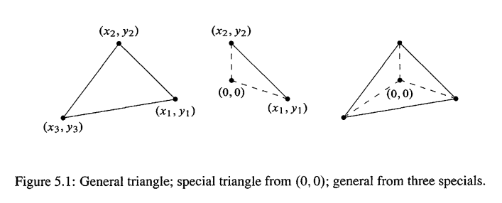
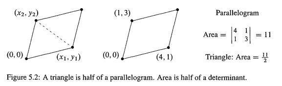
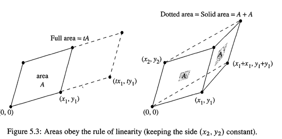
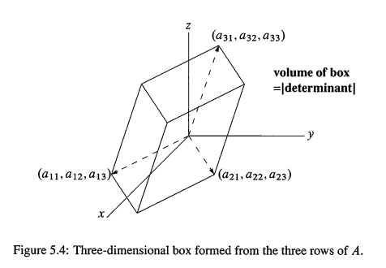
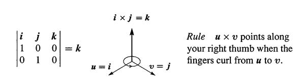

> - Determinant
> - 本章综合视频18-20

必须是方阵才有行列式，需要行列式的重要原因就是求特征值！矩阵的行列式是**一个数字**，以 $\det A$ 或 $|A|$ 表示。这个数字包含矩阵信息的数量，是令人惊讶的：

- 它告诉我们矩阵是否可逆，**当行列式为0，矩阵不可逆**
- 如果A可逆，那么 $A^{-1}$ 的行列式就是 $1/ \det A$
- 实际上行列式可以得到一个公式，计算 $A^{-1}$ 的每一个元素

行列式的其中一个应用就是得到**逆矩阵，主元，解 $A^{-1}b$** ,但是对于大矩阵,我们**很少使用这些公式,因为消去更快**.对于2-2的矩阵：
$$
A = \left[ \begin{array} { l l } a & b \\ c & d \end{array} \right] ,\quad \det A = ad-bc ,\quad   A ^ { - 1 } = \frac { 1 } { a d - b c } \left[ \begin{array} { r r } d & - b \\ - c & a \end{array} \right] \tag{1}
$$
你可以验证 $AA^{-1} = I$ 。 注意，当行列式 $ad -bc = 0$,$A^{-1}$ 的公式要求除以0，这是不可能的，所以$A^{-1}$不存在！(其实，当 `ad = bc`,那么 $a/c = b/d$，行是相关的，相关行的 $\det A$ 总是0)

行列式和主元也是有关联的,对于2-2矩阵,主元是 `a`和 `d - (c/a)b`,**主元的乘积就是行列式**
$$
a(d- \frac{c}{a} b) =  ad - bc \quad \color{orange} \text{主元乘积=}\det A
$$
上述2-2矩阵,如果先行交换,那么主元变成 `c` 和 `b- (a/c)d`.这时候主元乘积是 `bc-ad`.**行交换后行列式的符号改变了**.

---

提前说明,n-n矩阵的行列式可以通过三种方法找到

1. n个主元的乘积，再乘以1或-1:		      这是**主元公式(pivot formula)**
2. 把 `n!` 个项加起来，再乘以1或-1:        这是**大公式(big formula)**
3. 组合 `n` 个小的行列式，再乘以1或-1:   这是**代数余子式公式(cofactor formula)**

公式上都要乘以1或-1， 这时以为，`n-n` 矩阵有如下性质：**当矩阵的两行或者两列放生交换，行列式改变正负号**。

单位矩阵 `I` 的行列式是1,交换两行后的 `P` 的 `det P = -1`.再交换一次又变成 `1` .一半的置换矩阵是偶次交换的(`det P = 1`),另外一半是奇次交换的( `det P = -1`).如下2-2的情况:
$$
\operatorname { det } \left[ \begin{array} { l l } 1 & 0 \\ 0 & 1 \end{array} \right] = 1 \text { , }\quad \operatorname { det } \left[ \begin{array} { l l } 0 & 1 \\ 1 & 0 \end{array} \right] = - 1
$$
另外一个至关重要的性质是**线性(linearity)**,但首先警告,线性不意味着 `det(A+B) = det A+detB`,这是**绝对错误**的.就算 `A = I` 和 `B=I` 也是不对的.如果这是对的,那么 `det(I+I) = det 2I = 2`,实际上 $\det 2I = 2^n$，当矩阵乘以2，行列式乘以 $2^n$.

我不打算从行列式的公式定义行列式,从性质开始是更好的，也就是

- 正负号转换
- 线性

这些性质是简单的,它们为公式的出现提供了准备.看完公式之后,我们将会学习行列式的3个应用

1. 行列式给出了 $A^{-1}$ 和 $A^{-1}b$,这个公式叫做克拉默法则
2. 当一个箱子的边是A的行，那么它的体积就是 $|\det A|$
3. 存在 n 个称为特征值的数值 $\lambda$，$A - \lambda I $ 的行列式是0。这在应用当中极其重要，`<01-06>` 讲解

# 1. 行列式性质

> The Properties  of  Determinants

性质1-3是基础的,使用这3个性质，可以计算任何方阵的行列式。比如计算出2-2的A行列式是 $ad-bc$. 而且，性质1-3，可以推导出后面的所有性质。

**性质1： n-n 单位矩阵的 `I` 的行列式是1**
$$
\left| \begin{array} { l l } 1 & 0 \\ 0 & 1 \end{array} \right| = 1 \quad \text { and } \quad \left| \begin{array} { l l l } 1 & & \\ & \ddots &  \\ & & 1 \end{array} \right| = 1
$$

---

**性质2： 当2行交换的时候，行列式改变正负号.** 比如对于2-2矩阵，请验证： $\left| \begin{array} { l l } c & d \\ a & b \end{array} \right| = - \left| \begin{array} { l l } a & b \\ c & d \end{array} \right|$. 

因为这个性质的存在，可求任何置换矩阵 `P` 的行列式： 一直交换行，直到 `P` 回到 `I` ,如果是偶数次交换，那么 $\det P = 1$；如果是奇数次交换，那么 $\det P = -1$.

---

**性质3(linearity)： 行列式是关于矩阵每一行的==独立==线性函数(独立意味着：其它行保持不变).**

注意这个性质只能在**其他行把持不变**的时候应用！注意如下示例，c,d不变！

- 第1行乘以 `t`,那么行列式乘以 `t` ： $\left| \begin{array} { c c } t a & t b \\ c & d \end{array} \right| = t \left| \begin{array} { l l } a & b \\ c & d \end{array} \right|$
- 把 A的行1 加到  `A'` 的行1: $\left| \begin{array} { c c } a + a ^ { \prime } & b + b ^ { \prime } \\ c & d \end{array} \right| = \left| \begin{array} { l l } a & b \\ c & d \end{array} \right| + \left| \begin{array} { l l } a ^ { \prime } & b ^ { \prime } \\ c & d \end{array} \right|$，可用2-2的公式验证一下，两边都是 $ad + a'd - bc- b'c$.

这个规则在 n - n也是适用的，需要 n-1 行保持不变。如下是 3-3 为例子
$$
\left| \begin{array} { l l l } 4 & 8 & 8 \\ 0 & 1 & 1 \\ 0 & 0 & 1 \end{array} \right| = 4 \left| \begin{array} { l l l } 1 & 2 & 2 \\ 0 & 1 & 1 \\ 0 & 0 & 1 \end{array} \right| 
，\quad  \left| \begin{array} { l l l } 4 & 8 & 8 \\ 0 & 1 & 1 \\ 0 & 0 & 1 \end{array} \right| = \left| \begin{array} { l l l } 4 & 0 & 0 \\ 0 & 1 & 1 \\ 0 & 0 & 1 \end{array} \right| + \left| \begin{array} { l l l } 0 & 8 & 8 \\ 0 & 1 & 1 \\ 0 & 0 & 1 \end{array} \right|
$$
性质3没有告诉行列式实际上是多少。但结合乘法和加法，我们得到**1行**的线性组合性质(其它行必须保持不变)，这个行可以是任何行，因为根据性质2，任何行可以切换到第一行，应用性质3，然后切换回来。

使用这个性质再看看一开始的 $\det 2I$,因为每一行都是乘以2，所以实际上是 $\left| \begin{array} { l l } 2 & 0 \\ 0 & 2 \end{array} \right|  = 2^2 = 4$.这类似与面积和体积：把一个矩形的边长翻倍，面积扩大4倍；把n维的盒子的边长乘以`t`,它的体积乘以 $t^n$.这不是巧合--后面会看到，体积=行列式

---

以上3个性质需要特别注意，它们可以完全确定一个矩阵行列式的值，从而我们可以得到 n - n矩阵的行列式公式，但我们还是先继续学习下面有性质1-3确定的性质，这些性质让行列式更好处理

**性质4: 如果A的两行相等，那么 $\det A = 0$**

这是根据性质2得来的：假设2行相等，设 $\det A = D$,现在交换 A 的2行，因为2行相等，交换后矩阵还是A，行列式不变，但根据性质2，交换后行列式正负号变换。从而我们得到 $D = -D\rightarrow D=0$.

所以根据性质4，**2行相等的矩阵，没有逆**。但，**就算没有相等的2行，矩阵也可能是奇异的，行列式为0，没有逆。**

**性质5: 将一行的数乘从另一行减去，$\det A$ 不变。** 如前面消去
$$
\left| \begin{array} { c c } a & b \\ c - \ell a & d - \ell b \end{array} \right| = \left| \begin{array} { l l } a & b \\ c & d \end{array} \right|  \quad \color{orange} \text{将 } r_1 的 \ell 倍从 r_2 减去
$$
仔细看看上式，可用性质3分解如下，后一项根据性质4为0，所以相等：
$$
\left| \begin{array} { c c } a & b \\ c - \ell a & d - \ell b \end{array} \right| = 
\left| \begin{array} { c c } a & b \\ c  & d  \end{array} \right| -\ell \left| \begin{array} { c c } a & b \\  a &  b \end{array} \right|
$$
结论：如果没有行交换，常规的**从A到U的消去，行列式不变**，也就是 $\det A = \det U$.而行交换改变正负号，所以如果发生行交换，那么就是 $\det A = \pm \det U$. 根据性质5，我们只需要找到U的行列式，就可以得到A的行列式，缩小了问题空间。任何软件,包括Matlab,**都是用这种方法计算行列式的**.

**性质6：如果A的一行为0，那么 $\det A = 0$** 

快速证明：加非0行加到0行上，根据性质5，行列式不变，此时2行相等，根据性质4，行列式为0.

**性质7：如果A是三角矩阵，那么 $\det A = a_{11}a_{22}...a_{nn}$ = 对角线元素乘积** 
$$
\left| \begin{array} { l l } a & b \\ 0 & d \end{array} \right| = a d \quad \text { and } \quad \left| \begin{array} { l l } a & 0 \\ c & d \end{array} \right| = a d
$$
因为，假设A是三角矩阵，并且对角线元素不为0.那么

- 对于下三角A,将下面行都减去上面行的数乘，消去非对角线元素
- 对于上三角A,将上面行都减去下面行的数乘，消去非对角线元素

根据性质5，以上行操作不改变行列式，最终产生一下对角矩阵：
$$
\text{Diagonal Matrix:} \quad \det \left[ \begin{array} { c c c c } a _ { 11 } & & & 0 \\ & a _ { 22 } & & \\ & & \ddots & \\ 0 & & & a _ { n n } \end{array} \right] = a _ { 11 } a _ { 22 } \cdots a _ { n n }
$$
根据性质3，第一行提取 $a_{11}$, 第2行提取 $a_{22}$... 最终得到了行列式是 $\det A =  a_{11}...a_{nn} I$,而 `I` 的行列式根据性质1，是1.
$$
\text{主元乘积:} \quad \operatorname { det } A = \pm \operatorname { det } U = \pm ( \text { product of the pivots } )  \tag{2}
$$
如果一个对角线元素 $a_{ii}$ 是0，那么三角的A就是奇异的，因为消去最终产生一个0行，从而根据性质6行列式为0.

**性质8：如果A是奇异的，那么 $\det A = 0$，如果A可逆，那么 $\det A \ne 0$** 

证明：消去可将A化为U

- 如果A是奇异，那么U有一个0行，从而 $\det A = \det U = 0$
- 如果A是可逆的，那么**U的对角线元素就是主元**，主元乘积，根据性质7，就是行列式，不为0.

---

**性质9：AB的行列式就是A的行列式乘以B的行列式:$|AB|=|A||B|$**

当 $B  = A^{-1}$,这个性质表示 $\det A^{-1} = 1/ \det A$:
$$
AA^{-1} = I,\quad \text{所以} \quad (\det A) (\det A^{-1}) = \det I = 1
$$
性质9是比较复杂的，就算是2-2的矩阵
$$
\left| \begin{array} { l l } a & b \\ c & d \end{array} \right| \left| \begin{array} { l l } p & q \\ r & s \end{array} \right| = \left| \begin{array} { l l } a p + b r & a q + b s \\ c p + d r & c q + d s \end{array} \right|  \quad \color{orange} \text{Product Rule}
$$
也需要不小的代数运算
$$
| A | | B | = ( a d - b c ) ( p s - q r ) = ( a p + b r ) ( c q + d s ) - ( a q + b s ) ( c p + d r ) = | A B |
$$
这里有一个活泼的证明：当 $|B|$ 非0，考虑一下比例 $D(A) = |AB|/|B|$,D(A)拥有性质1，2，3:

1. 性质1：如果 `A=I`,那么D(A)是 $|B|/|B| = |I| = 1$
2. 性质2：当A的交换2行，AB的2行也交换，因此 $|AB|$ 正负号变换，最终 D(A) 正负号变换
3. 性质3：
   - 当A的行1乘以t，AB的行1也是，从而 |AB| 扩大 t 倍，从而 D(A) 扩大 t 倍，成立
   - 当A的行1加上矩阵 `A'` 的行1(`A,A'`只有行1不同)**后**，设为 $A^*$,根据性质3行列式是 $\det A^* = \det A + \det A'$ ；另一方面，$A^*B$,相当于AB的行1加上了 `A'B` 的行1，也就是 $\det A^*B = \det AB + \det A'B$,左式再除以 $\det B$，得到 $\det A* = \det A + \det A'$.

结论: D(A) 有定义 $|A|$ 的3个性质，所以它等于 $|A|$. 所以D(A)必须是一个行列式，而且 $D(A) = |A| = |AB|/|B|$. |B| = 0是特例，此时 AB 是奇异的，从而 `|AB| = |A| |B| = 0`

看看`<01-02>`学习的分解 PA = LU

- 如果偶数次行交换，那么 $\det P = 1$,奇数次行交换 $\det P = -1$. 从而$\det P = \pm 1$. 
- 而 $\det A = \pm \det U$.
- L是对角线元素都是1的下三角，$\det L = 1$.

所以
$$
PA =LU \quad  \Rightarrow \det P \det A = \det L \det U \tag{3}
$$

---

**性质10：$A^T$ 的行列式等于  A 的行列式**

因为，如果A是奇异的，那么 $A^T$ 也是奇异的，从而行列式都是0.不然，A就有 `PA = LU` 的分解,2边转置，得到 $A^TP^T = U^TL^T$ , 应用性质9:
$$
\det P \det A = \det L  \det U \quad \text { 对比 } \quad \det A ^ {T } \det P ^ { T} = 
\det U ^ {T} \det L ^ {T }
$$

1. 首先，$\det L = \det L^T = 1$,因为对角线都是1
2. 其实，$\det U = \det U^T$,因为对角线元素相同
3. 然后 $\det P = \det P^T$,因为置换矩阵 $P^TP = I$，所以 $|P^T||P| = 1$,所以，$p^T，P$ 同为1或者-1.

综上，$L,U,P$ 和 $L^T,U^T,P^T$ 的行列式一样，从而 $\det A = \det A^T$. 

---

最后说明，以上所以适用于行的规则，也**适用于列**，因为 $|A| = |A^T|$,只需要转置即可。比如

- 两列交换，行列式符号变换
- 一列为0，或者2列相等的行列式为0
- 如果一列乘以t，那么行列式也乘以t
- 行列式是关于每一列的独立的线性函数

## 1.1. 总结

- 行列式是通过 $\det I = 1,$ 符号变换和每一行的线性独立定义的，也就是性质1，2，3
- 消去后，$\det A = \pm (\text{product of pivots})$
- 当A不可逆，行列式为0
- 性质9，10特别值得注意

## 1.2. 典型例题

**1. ** 求矩阵M经过如下操作后的行列式

1. $a_{ij}$ 分别乘以 $(-1)^{i+j}$,得到正负号交替出现的 $M1$
2. 行1，2，3分别减去行3，1，2，得到 $M_2$
3. 行1，2，3分别加上行3，1，2，得到 $M_3$

如下是3个操作后的矩阵
$$
\left[ \begin{array} { r r r } a _ { 11 } & - a _ { 12 } & a _ { 13 } \\ - a _ { 21 } & a _ { 22 } & - a _ { 23 } \\ a _ { 31 } & - a _ { 32 } & a _ { 33 } \end{array} \right] \quad \left[ \begin{array} { l } \text { row } 1 - \operatorname { row } 3 \\ \text { row } 2 - \operatorname { row } 1 \\ \text { row } 3 - \operatorname { row } 2 \end{array} \right] \quad \left[ \begin{array} { l } \text { row } 1 + \operatorname { row } 3 \\ \text { row } 2 + \text { row } 1 \\ \text { row } 3 + \operatorname { row } 2 \end{array} \right]
$$
解：对于M1，其实就是：
$$
M _ { 1 } = \left[ \begin{array} { l l l } 1 & & \\ & - 1 & \\ & & 1 \end{array} \right] \left[ \begin{array} { l l l } a _ { 11 } & a _ { 12 } & a _ { 13 } \\ a _ { 21 } & a _ { 22 } & a _ { 23 } \\ a _ { 31 } & a _ { 32 } & a _ { 33 } \end{array} \right] \left[ \begin{array} { l l l } 1 & & \\ & - 1 & \\ & & 1 \end{array} \right]
$$
所以 $\det M_1 = -1 * \det M *(-1)= \det M$

$M_2$ 是奇异的，因为所有行加起来是0！

$M_3$ 根据性质3，可以分成8个矩阵！首先拆分成2个
$$
\left[ \begin{array} { l } \text { row } 1 + \operatorname { row } 3 \\ \text { row } 2 + \text { row } 1 \\ \text { row } 3 + \operatorname { row } 2 \end{array} \right] = \left[ \begin{array} { l } \text { row } 1 \\ \text { row } 2 + \text { row } 1 \\ \text { row } 3 + \operatorname { row } 2 \end{array} \right] + 
\left[ \begin{array} { l } \operatorname { row } 3 \\ \text { row } 2 + \text { row } 1 \\ \text { row } 3 + \operatorname { row } 2 \end{array} \right]
$$
然后右边2个可以分别拆分成4个。拆分后的8个矩阵是
$$
\left[ \begin{array} { l } \text { row } 1 \\ \text { row } 2 \\ \text { row } 3 \end{array} \right],\left[ \begin{array} { l } \text { row } 3 \\ \text { row } 2 \\ \text { row } 3 \end{array} \right],
\left[ \begin{array} { l } \text { row } 1 \\ \text { row } 1 \\ \text { row } 3 \end{array} \right]...
\left[ \begin{array} { l } \text { row } 3 \\ \text { row } 1 \\ \text { row } 2 \end{array} \right]
$$
除了第1个和最后一个行列式为 $\det A$,其他都有相等的行，行列式为0，所以 $\det M_3 = 2\det A$

---

**2. ** 解释一下，如下行列式如何求值？
$$
\operatorname { det } \left[ \begin{array} { c c c } 1 - a & 1 & 1 \\ 1 & 1 - a & 1 \\ 1 & 1 & 1 - a \end{array} \right]
$$
解：行1减去行3，行2再减去行3，得到
$$
\operatorname { det } \left[ \begin{array} { c c c } - a & 0 & a \\ 0 & - a & a \\ 1 & 1 & 1 - a \end{array} \right]
$$
现在，列3加上列1，列3再加上列2，变成
$$
\operatorname { det } \left[ \begin{array} { c c c } - a & 0 & 0 \\ 0 & - a & 0 \\ 1 & 1 & 3 - a \end{array} \right]
$$
所以行列式是 $(-a)(-a)(3-a) = a^2(3-a)$.。 当a= 3或0，矩阵奇异

# 2. 排列和代数余子式

> Permutations and Cofactors

1. 计算机是通过主元公式求行列式的.而这一节介绍另外两种方法：
2. 大公式使用的是 `n!` 个排列
3. 代数余子式公式使用的是 `n-1` 大小的行列式

作为例子，参见如下A
$$
A = \left[ \begin{array} { r r r r } 2 & - 1 & 0 & 0 \\ - 1 & 2 & - 1 & 0 \\ 0 & - 1 & 2 & - 1 \\ 0 & 0 & - 1 & 2 \end{array} \right]  \quad  \det A = 5
$$
参见例2，主元是 $2,3/2,4/3,5/4$.分别使用3种方法

1. 主元乘积是5
2. 大公式有 `4!=24` 个项，只有5项非0：$\det A = 16-4-4-4+1 = 5$,学习了 Eq(8) 之后，请独立找出这5个项
3. 第1行的数字 2，-1，0，0，乘以来自其他行的代数余子式 4，3，2，1.得到 $2*4 - 1*3 = 5$.这些代数余子式都是3-3的行列式，是因为排除了第一行元素所在的行和列。在例6我们还会看见这个矩阵

## 2.1. 主元公式

> The Pivot Formula

矩阵消去之后,U的对角线元素是 $d_1...d_n$.如果**没有行交换**,那么这些主元的乘积就是行列式
$$
\operatorname { det } A = ( \operatorname { det } L ) ( \operatorname { det } U ) = ( 1 ) \left( d _ { 1 } d _ { 2 } \cdots d _ { n } \right)  \tag{1}
$$
此公式上一节已经提到，而当行交换涉及到的时候,因为 $\det P = \pm 1$,所以
$$
(\det P)(\det A) = ( \operatorname { det } L ) ( \operatorname { det } U )
\Rightarrow \quad \det A = \pm(d_1d_2...d_n)
\tag{2}
$$
如果A的主元少于n,那么根据性质8,行列式是0

**例1.** 下面的A，经过1次行交换，产生主元4，2，1，因为秩交换1次，所以行列式乘以-1
$$
A = \left[ \begin{array} { l l l } 0 & 0 & 1 \\ 0 & 2 & 3 \\ 4 & 5 & 6 \end{array} \right] \quad P A = \left[ \begin{array} { l l l } 4 & 5 & 6 \\ 0 & 2 & 3 \\ 0 & 0 & 1 \end{array} \right] \quad \operatorname { det } A = - ( 4 ) ( 2 ) ( 1 ) = - 8
$$

---

例2没有行交换,主元可以得到行列式,我们也会看到，**行列式怎么得到主元**

**例2.** 如下三对角矩阵的主元是 $2,3/2,4/3,5/4,6/5...\frac{n+1}{n}$ 。分解这个 n - n 矩阵，可以揭示它的行列式
$$
A =\left[ \begin{array} { r r r r r } 2 & - 1 & & & \\ - 1 & 2 & - 1 & & \\ & - 1 & 2 & \cdot & \\ & & \cdot & \cdot & - 1 \\ & & & - 1 & 2 \end{array} \right] = 

\left[ \begin{array} { r r r r r } 1 & & & & \\ - \frac { 1 } { 2 } & 1 & & & \\ & - \frac { 2 } { 3 } & 1 & & \\ &  & \cdot & \cdot & \\ & & & - \frac { n - 1 } { n } & 1 \end{array} \right]

\left[ \begin{array} { r r r r r } 2 & - 1 & & & \\ & \frac { 3 } { 2 } & - 1 & & \\ & & \frac { 4 } { 3 } & - 1 & \\ & & & \cdot & \cdot \\ & & & & \frac { n + 1 } { n } \end{array} \right] = LU
$$
主元在 U 的对角线上，所以，当A是 4-4 的，主元乘积=行列式=5，n-n 的时候就是 n+1.所以，3条对角线分别是 -1，2，-1 的矩阵A的行列式是
$$
\det A = 2 * \frac{3}{2} ...\frac{n+1}{n} = n+1
$$
**关键(全部矩阵都可，而不仅仅是例2)：** 如果**没有行交换**，那么第一个主元，只取决于原始矩阵 A 的左上角元素。更进一步，前 k 个主元，来自 A 的左上部分的子矩阵 $A_k$，**这些子矩阵 $A_k$ 的行列式是 $d_1d_2...d_k$.**

- 1-1 的 $A_1$ 就恰恰包含第一个主元 $d_1$，$\det A_1 = d1$
- 2-2 的 $A_2$ 有 $\det A_2 = d_1d_2$

最终，n-n的 $A_n$,也就是A，其行列式 $\det A$ ,使用到所有的主元

**没有行交换**，那么消去，就在处理整个矩阵的过程中，顺便处理了子矩阵 $A_k$. 实现 A = LU 的过程，也实现了 $A_k = L_k U_k$. 将后一个行列式除以前一个行列式 ( $\det A_k / \det A_{k-1}$ ),前面的 k - 1 个主元都消去了，只剩下 $d_k$,从而给出了，主元的**行列式比例**公式：
$$
\begin{aligned}
	&\text{Pivot from} \\
	&\text{determinants}
\end{aligned} \quad

d _ { k } = \frac { d _ { 1 } d _ { 2 } \cdots d _ { k } } { d _ { 1 } d _ { 2 } \cdots d _ { k - 1 } } = \frac { \operatorname { det } A _ { k } } { \operatorname { det } A _ { k - 1 } } 

\quad \color{orange} \text{= The kth pivot}  \tag{3}
$$
在例2的-1，2，-1矩阵当中，这个比例给出了主元 $2/1,3/1...(n+1)/n$ .习题31的 Hilbert矩阵也从左上角构建.在这里也明白，如果所有的左上角子矩阵 $\det A_k \ne 0$,那么不需要行交换。

> update:完成习题31

## 2.2. 大公式

> The Big Formula for determinants

主元公式很好计算，但是矩阵的元素 $a_{ij}$ 没有形象化的联系。直接从矩阵的原始元素出发，可以得到一个关于行列式的大公式，**这个公式有 `n!` 个项**,一半项是负号，一半项是正号，如2-2是 `ad -bc`,3-3的是
$$
\left| \begin{array} { l l l } a _ { 11 } & a _ { 12 } & a _ { 13 } \\ a _ { 21 } & a _ { 22 } & a _ { 23 } \\ a _ { 31 } & a _ { 32 } & a _ { 33 } \end{array} \right| = \begin{array} { l } + a _ { 11 } a _ { 22 } a _ { 33 } + a _ { 12 } a _ { 23 } a _ { 31 } + a _ { 13 } a _ { 21 } a _ { 32 } \\ - a _ { 11 } a _ { 23 } a _ { 32 } - a _ { 12 } a _ { 21 } a _ { 33 } - a _ { 13 } a _ { 22 } a _ { 31 } \end{array}
\quad \color{orange} \text{3 by 3 det，3!=6项}
\tag{4}
$$
注意模式,每一项里都有**每一行和每一列的元素,行下标 `1,2,3` 是固定的**,但是列下标是 `1,2,3` 的排列，也是为什么会有 `n!` 项的原因，而且这个排列会告诉我们此项的正负号。

我们从2-2的矩阵推导这个公式,使用线性化的性质
$$
\begin{aligned} \left| \begin{array} { l l } a & b \\ c & d \end{array} \right| & = \left| \begin{array} { l l } a & 0 \\ c & d \end{array} \right| + \left| \begin{array} { l l } 0 & b \\ c & d \end{array} \right| \\ & = \left| \begin{array} { l l } a & 0 \\ c & 0 \end{array} \right| + \left| \begin{array} { l l } a & 0 \\ 0 & d \end{array} \right| + \left| \begin{array} { l l } 0 & b \\ c & 0 \end{array} \right| + \left| \begin{array} { l l } 0 & b \\ 0 & d \end{array} \right| \end{aligned}  \tag{5}
$$
最后会出现 $2^2=4$ 个矩阵的行列式,第1个第4个是0,那么
$$
\left| \begin{array} { l l } a & 0 \\ 0 & d \end{array} \right| + \left| \begin{array} { l l } 0 & b \\ c & 0 \end{array} \right| = a d \left| \begin{array} { l l } 1 & 0 \\ 0 & 1 \end{array} \right| + b c \left| \begin{array} { l l } 0 & 1 \\ 1 & 0 \end{array} \right| = a d - b c
$$
以这个方法分解矩阵，可以得到置换矩阵,这些置换矩阵的行列式是就正1或者负1，然后这些正1负1乘以来自A的数字。

再看看3-3的情况，对每一行使用线性化性质，一行可以拆分出3个行列式，其它2行不变，最终，$\det A$ 拆分成 $3^3 = 27 $ 个简单的行列式，但注意，其中一些行列式为0，比如，拆分$r_1$
$$
\left[\begin{matrix} a_{11} & 0 & 0\\ & r_2 & \\  & r_3 & \\\end{matrix} \right],
\left[\begin{matrix} 0 & a_{12} & 0\\ & r_2 & \\  & r_3 & \\\end{matrix} \right]，
\left[\begin{matrix} 0 & 0 & a_{13}\\ & r_2 & \\  & r_3 & \\\end{matrix} \right]
$$
以上就是拆分完成第1行得到的3个矩阵，每一个拆分 $r_2,r_3$ 都可得到 9 个矩阵。现在再对上述第1个拆分$r_2$
$$
\left[\begin{matrix} a_{11} & 0 & 0\\ a_{21}& 0 & 0 \\  & r_3 & \\\end{matrix} \right],
\left[\begin{matrix} a_{11} & 0 & 0\\ 0 & a_{22} & 0 \\  & r_3 & \\\end{matrix} \right],
\left[\begin{matrix} a_{11} & 0 & 0\\ 0 & 0 & a_{23} \\  & r_3 & \\\end{matrix} \right]
$$
注意，此时上述第1个的行列式为0，因为行1只是行2的数乘而已。所以：**行列式为0的来自于对列号的相同选择。**

如下是不为0的行列式，
$$
\left| \begin{array} { l l l } a _ { 11 } & a _ { 12 } & a _ { 13 } \\ a _ { 21 } & a _ { 22 } & a _ { 23 } \\ a _ { 31 } & a _ { 32 } & a _ { 33 } \end{array} \right|  

= \left| \begin{array} { c c c } a _ { 11 } & & \\ & a _ { 22 } & \\ & & a _ { 33 } \end{array} \right|
+ \left| \begin{array} { c c c }  & a_{12} & \\ &  & a_{23} \\ a_{31} &  &  \end{array} \right|
+ \left| \begin{array} { c c c }  & & a_{13}\\ a_{21} &  & \\ & a_{32} & \end{array} \right|

\\[4ex]

= \left| \begin{array} { c c c } a _ { 11 } & & \\ &  & a_{23}\\ & a_{32} &  \end{array} \right|
+ \left| \begin{array} { c c c }  & a_{12} & \\ a_{21} &  &  \\  &  & a_{33} \end{array} \right|
+ \left| \begin{array} { c c c }  & & a_{13}\\  & a_{22} & \\ a_{31} &  & \end{array} \right|

\quad \color{orange} \text{6项}
$$
**行列式不为0的列号都不相同，因为有 `3!=6` 种方式排列列号，所以有6项不为0**.如下是列号的6种排列
$$
\text{Column numbers}= ( 1,2,3 ) , ( 2,3,1 ) , ( 3,1,2 ) , ( 1,3,2 ) , ( 2,1,3 ) , ( 3,2,1 ) \tag{6}
$$
注意这里的思想：如前所述，当把**行号顺序固定为1,2,3**.上述拆分的6项当中，其实就是对列号的排列，每个不同的列号排列，都是非0元素。 每一项，再根据线性化的性质提取除每行的元素，**留下的都是置换矩阵。**而置换矩阵变回`I` 需要行交换的次数，如果是奇数，称为奇排列，取`-1`,如果偶数，称为偶排列,取 `+1`。如下 `Eq7)` 当中，前3个是偶排列(0 or 2 exchanges)，后3个是奇排列(odd permutations,one exchange).当列号的序列是 $(\alpha,\beta,\omega)$, 我们选择的就是 $a_{1\alpha}a_{2\beta}a_{3\omega}$ 这一项，从而**矩阵的每一行，每一列都有元素被选择**。

其中 `(1,2,3)` 叫做单位排列(identity permutation),也就是列号和置换矩阵 $P=I$ 的列号是相同的。
$$
\det A  

= a_{11}a_{22}a_{33}\left| \begin{array} { c c c } 1 & & \\ & 1 & \\ & & 1 \end{array} \right|
+ a_{12}a_{23}a_{31}\left| \begin{array} { c c c }  & 1 & \\ &  & 1 \\ 1 &  &  \end{array} \right|
+ a_{13}a_{21}a_{32}\left| \begin{array} { c c c }  & & 1 \\ 1 &  & \\ & 1 & \end{array} \right|

\\[4ex]

= a_{11}a_{23}a_{32}\left| \begin{array} { c c c } 1 & & \\ &  & 1\\ & 1 &  \end{array} \right|
+ a_{12}a_{21}a_{33}\left| \begin{array} { c c c }  & 1 & \\ 1 &  &  \\  &  & 1 \end{array} \right|
+ a_{13}a_{22}a_{31}\left| \begin{array} { c c c }  & & 1\\  & 1 & \\ 1 &  & \end{array} \right|

\tag{7}
$$
选择 $a_{1\alpha}a_{2\beta}a_{3\omega}$ 之后，前3个偶排列的置换矩阵是 `det P = 1`,后面3个奇排列是 `det P = -1`.这样我们就系统的证明了3-3矩阵的行列式公式

---

现在看看n-n的,列号有 `n!` 排列方式,一半是正号,一半是负号,A的行列式就是n个简单行列式的和，设 $(\alpha,\beta,...\omega)$ 是列号的所有排列，那么 $a _ { 1 \alpha } a _ { 2 \beta } \cdots a _ { n \omega }$ 是从每一行，每一列选出一个元素
$$
\begin{aligned}
	\det A &= \text{n！个列号排列产生的置换} P = (\alpha,\beta...\omega) \text{ 的行列式之和}\\[2ex] 
	 & = \sum  a _ { 1 \alpha } a _ { 2 \beta } \cdots a _ { n \omega }( \det P ) = \quad \color{orange} \text{BIG Formula}
\end{aligned}

\tag{8}
$$

> sp：置换 $P = (\alpha,\beta...\omega)$ 的意思是，矩阵A分解后并提取每行元素的值之后，剩下的行列式，不为0元素都是1，而且这些为1的元素，列号顺序也和置换矩阵P相同。总感觉有点难以描述，自己理解把

**例3.U的行列式**  上三角的U的行列式根据大公式展开之后，n!项中，只有对角线1项不为0：$\det U = +u_{11} +...+ u_{nn}$,其他项的列号序号，最少有一个是对角线之下元素，所以是0

**例4.** 假设Z除了列3，其他和 `I` 一样，那么
$$
\det Z = \left| \begin{array} { l l l l } 1 & 0 & a & 0 \\ 0 & 1 & b & 0 \\ 0 & 0 & c & 0 \\ 0 & 0 & d & 1 \end{array} \right| = c  \tag{9}
$$
结果c这一项，来自于对角线的 `+1*1*c*1`。 还有另外23项都是0，这时因为，如果从列3选择a,b或者d，那么列3的列号就被使用了，从而行3进行选择的时候，c就不能选了，而这时候行3其他元素都是0。

还可以这样判断：如果c是0，那么Z存在1个零行，所以$\det Z = 0$.如果c不为0，那么其他行可以减去行3的数乘，从而消去a,b,d，Z变成了对角矩阵，$\det Z= c$

**例5.** 假设A仅在对角线之上和之下有1元素，这里$n = 4$
$$
A _ { 4 } = \left[ \begin{array} { l l l l } 0 & 1 & 0 & 0 \\ 1 & 0 & 1 & 0 \\ 0 & 1 & 0 & 1 \\ 0 & 0 & 1 & 0 \end{array} \right] \quad \text { and } \quad P _ { 4 } = \left[ \begin{array} { l l l l } 0 & 1 & 0 & 0 \\ 1 & 0 & 0 & 0 \\ 0 & 0 & 0 & 1 \\ 0 & 0 & 1 & 0 \end{array} \right]
$$

- 第1行只有列2的非0元素可以选择
- 第4行只有列3的非0元素可以选择

所以行2，行3只能选择列1和列4，也就是说，$P_4$ 就是选择除 $A_4$ 非0元素的唯一排列，而$P_4$ 偶排列，2次行交换可以得到 `I`，行列式是+1，所以$\det A_4 = +1$

​	

## 2.3. 代数余子式确定行列式

> Determinant By Cofactors

Eq(8)就是行列式的正式定义，一次性给出了你所有的信息，但比较复杂。但这个公式必须满足性质1，2，3,从而满足所有性质。性质1 $\det I =1 $ 很明显。对于线性化性质，如果我们提取出 $a_{1α}$,也就是第一行的元素,可得
$$
\operatorname { det } A = a _ { 11 } \left( a _ { 22 } a _ { 33 } - a _ { 23 } a _ { 32 } \right) + a _ { 12 } \left( a _ { 23 } a _ { 31 } - a _ { 21 } a _ { 33 } \right) + a _ { 13 } \left( a _ { 21 } a _ { 32 } - a _ { 22 } a _ { 31 } \right)  \tag{10}
$$
在括号里面的项就是**代数余子式(cofactors)**,它们是 `2-2` 的矩阵的行列式.那么沿着第一行展开,我们可以得到
$$
\det ⁡A= a_{11} C_{11}  +  a_{12} C_{12}+  a_{13} C_{13}
$$
明显,上述公式线性依赖与 $a_{11},a_{12},a_{13}$,也就是性质3的线性化性质。

$a_{11}$ 的代数余子式是 $C_{11}= a_{22} a_{33}  − a_{23} a_{32}$ ,`Eq(10)` 的拆分如下：
$$
\left| \begin{array} { l l l } a _ { 11 } & a _ { 12 } & a _ { 13 } \\ a _ { 21 } & a _ { 22 } & a _ { 23 } \\ a _ { 31 } & a _ { 32 } & a _ { 33 } \end{array} \right| 
= 
\left| \begin{array} { l l l } a _ { 11 } & & \\ & a _ { 22 } & a _ { 23 } \\ & a _ { 32 } & a _ { 33 } \end{array} \right|
+ \left| \begin{array} { l l l } & a _ { 12 } & \\ a _ { 21 } & & a _ { 23 } \\ a _ { 31 } & & a _ { 33 } \end{array} \right| + 
\left| \begin{array} { l l } & & a _ { 13 } \\ a _ { 21 } & a _ { 22 } & \\ a _ { 31 } & a _ { 32 } & \end{array} \right| 
$$
**我们仍然是每一行每一列选出一个元素**! 因为 $a_{11}$ 已经使用了第1行第1列,所以剩下一个2-2行列式作为代数余子式.

还需要确定一下正负号.如果沿着行 `1` 展开代数余子式公式，那么划去行1，列 `j` ，得到大小为 `n-1` 的子矩阵 $M_{1j}$,这个子矩阵的行列式乘以$(−1)^{1+j}$ 可以得到正负号

> `n-n` 矩阵A沿着行1的展开的代数余子式分别是 $C_{1j} = (-1)^{1+j} \det M_{1j}$（正负号的是代数余子式，不带正负号的称为余子式）,其中 $M_{1j}$ 是把A矩阵 $a_{1j}$ 元素所在行，列去掉后产生的 `n-1` 个行列的矩阵,那么代数余子式展开公式是
> $$
> \det ⁡A= a_{11} C_{11}  +  a_{12} C_{12}+...+  a_{1n} C_{1n} \tag{11}
> $$
> 

其实，Eq(11)就是 Eq(8),Eq(10)的另一种形式而已，都是沿着行1展开，然后计算剩下的代数余子式。**注意**，不仅仅而已沿着行1展开，任何行都可以。行 `i` 的元素 $a_{ij}$ 也有对应的代数余子式 $C_{ij}= (-1)^{i+j}M_{ij}$, $M_{ij}$ 就是原始矩阵去掉行`i`列`j` 的子矩阵。

> 矩阵A的行列式，等于，任何行 `i` 和沿着此行展开的代数余子式的点乘：
> $$
> \det ⁡A= a_{i1} C_{i1}  +  a_{i2} C_{i2}+...+  a_{in} C_{in} \tag{12}  \quad \color{orange} \text{Cofactor Formula}
> $$
> 每个代数余子式 $C_{ij}$ 都是去掉原始矩阵的行 `i` 列 `j` 的 n -1 阶的行列式 $\det M_{ij}$  乘以一个正负号：
> $$
> C_{ij} = (-1)^{i+j} \det M_{ij}  \quad \color{orange} \text{Cofactor}
> $$
> 

所以，一个n阶的行列式是 `n-1` 阶行列式的组合,一直递归下去,`n-1` 阶行列式又是 `n-2` 阶行列式的组合，最终达到1阶行列式，我们定义 1 阶行列式 $|a|$ 为a，从而整个公式完整了。

但我还是情愿用性质1-3定义行列式，而Eq(8,10,12)遵循这些公式。其中性质10是 $\det A = \det A^T$,那么我们也可以根据列展开代数余子式！如下展开第 `j` 列
$$
\text{Cofactors down column j} : \quad \text { det } A = a _ { 1 j } C _ { 1 j } + a _ { 2 j } C _ { 2 j } + \cdots + a _ { n j } C _ { n j } \tag{13}
$$

---

代数余子式在矩阵有很多0的时候特别好用，如下例

**例6.**  本节一开始的-1，2，-1矩阵A，第1行只有2个非0元素，所有只有2个代数余子式 $C_{11},C_{12}$:
$$
\left[ \begin{array} { r r r r } 2 & - 1 & 0 & 0 \\ - 1 & 2 & - 1 & 0 \\ 0 & - 1 & 2 & - 1 \\ 0 & 0 & - 1 & 2 \end{array} \right]=2C_{11}-C_{12}
= 2 \left| \begin{array} { r r r } 2 & - 1 & \\ - 1 & 2 & - 1 \\ & - 1 & 2 \end{array} \right| - ( - 1 ) \left| \begin{array} { r r r } - 1 & - 1 & \\ & 2 & - 1 \\ & - 1 & 2 \end{array} \right| \tag{14}
$$
注意

- $C_{11}$ 是小1阶的A矩阵，对角线和对角线之上，之下也是-1，2，1
- 对于 $C_{12}$,沿着第1列继续展开，只有$a_{11} =-1$ 一个非0元素，而且代数余子式是小2阶的A：对角线和对角线上下分别是-1，2，1

所以，任何 n 阶的 $A_n$ ,都来自与 $A_{n-1},A_{n2}$:
$$
A_4 = 2A3 - A_2  \quad 一般的 \quad   A_n = 2A_{n-1} - A_{n-2}  \tag{15}
$$
直接计算 $|A_2| = 3,|A_3| = 4$,所以 $A_4 = 2*4 -3 = 5$.Eq(15)的通解是 $A_n = n+1$(sp:是一个2阶常系数递归，可根据`<math/01-04>` 求解),和例2通过主元公式求得的一致。

**例7.** 如下矩阵除了最左上角元素是1，其他和例6一样
$$
B _ { 4 } = \left[ \begin{array} { r r r r } 1 & - 1 & & \\ - 1 & 2 & - 1 & \\ & - 1 & 2 & - 1 \\ & & - 1 & 2 \end{array} \right]
$$
通过消去可得知主元都是1，从而行列式是1.再通过行1展开代数余子式，得到类似例6的式子
$$
\det B_4 = A_3 - A_2 = 4-3 = 1
$$
从而 $B_n = A_{n-1} - A_{n-2} = n - (n-1) = 1$. 习题13从最后一行展开，也可得到 $\det B_n = 1$

## 2.4. 总结

1. 如果没有行交换，那么 $\det A = 主元乘积$； 而且左上角的子矩阵 $\det A_k = 前k个主元乘积$
2. Eq(8)的每一项，使用了每一行每一列恰好1次，一共n!项，一般是正号，一半是负号
3. 代数余子式 $C_{ij}$ 是 $(-1)^{i+j}$ 乘以 去掉行 i 列 j 的小1阶的行列式。行列式可通过一行或者一列的代数余子式展开得到，所以如果矩阵很多0，那么只需要计算很少的项。

## 2.5. 典型例题

**1.** Hessenberg 矩阵是比下三角矩阵多一条对角线元素的矩阵，如下所示。使用代数余子式公式展开行1，证明 4-4的矩阵满足斐波那契额规则 $|H_4| = |H_3| + |H_2|$.
$$
H _ { 2 } = \left[ \begin{array} { l l } 2 & 1 \\ 1 & 2 \end{array} \right] \quad H _ { 3 } = \left[ \begin{array} { l l l } 2 & 1 & \\ 1 & 2 & 1 \\ 1 & 1 & 2 \end{array} \right] \quad H _ { 4 } = \left[ \begin{array} { l l l l } 2 & 1 & & \\ 1 & 2 & 1 & \\ 1 & 1 & 2 & 1 \\ 1 & 1 & 1 & 2 \end{array} \right]
$$
解： 沿着行1展开，$C_{11}$ 就是 $|H_3|$,只需要计算 $C_{12}$
$$
C _ { 12 } = - \left| \begin{array} { l l l } 1 & 1 & 0 \\ 1 & 2 & 1 \\ 1 & 1 & 2 \end{array} \right| = - \left| \begin{array} { l l l } 2 & 1 & 0 \\ 1 & 2 & 1 \\ 1 & 1 & 2 \end{array} \right| + \left| \begin{array} { l l l } 1 & 0 & 0 \\ 1 & 2 & 1 \\ 1 & 1 & 2 \end{array} \right|
$$
以上是保持r2,r3不变，使用线性化组合r1。最右边2项分别就是 $-|H_3|$ 和 $|+H_2|$，所以
$$
\left| H _ { 4 } \right| = 2 C _ { 11 } + 1 C _ { 12 } = 2 \left| H _ { 3 } \right| - \left| H _ { 3 } \right| + \left| H _ { 2 } \right| = \left| H _ { 3 } \right| + \left| H _ { 2 } \right|
$$
n-n阶的也满足，有 $|H_n| = |H_{n-1}| + |H_{n-2}|$

---

**2.** 如果将矩阵的每个元素 $a_{ij}$ 都乘以 $i/j$ ，为什么 $\det A$ 不变？

解： $a_{ij}$ 都乘以 $i/j$,那么大公式里面的每一项： $a _ { 1 \alpha } a _ { 2 \beta } \cdots a _ { n \omega }$  都乘以了行号 `i = 1,2...n` 和除以了列号 `j=1...n`(虽然列号是顺序是被排列过)，所以单做作为一项的 $a _ { 1 \alpha } a _ { 2 \beta } \cdots a _ { n \omega }$ 的值是不变的，从而行列式不变。

换种方式，首先，每个元素都是乘以了行号 `i`,相当于被对角矩阵 `D = diag(1:n)` 左乘；然后每个元素除以列号 `j`，相当于右乘 $D^{-1}$.而 $DAD^{-1}$ 的行列式根据性质9乘法规则，等于A的行列式！

# 3. 克拉默法则,逆和体积

> - Cramer's  Rule, Inverses, and Volumes
> - 叉乘,和三重积,在`<calculus/01-12>`也提到

这一节，通过代数方法，而不是消去，求解Ax= b. 而且我们会逆A，得到 $A^{-1}$ 的每一个元素，每个元素都有 $\det A$ 作为分母。$A^{-1}$ 和 $A^{-1}$的每一个元素，都是一个行列式，除以A的行列式。

克拉默法则可以给出  `Ax = b`  的解的分量. 把 `I` 的第一列换成x得到一个行列式是 $x_1$ 的矩阵,当用A乘以这个矩阵,结果矩阵的第一列就是Ax,也就是b,其他列直接从A复制过来即可
$$
A \left[ \begin{array} { l l l } x _ { 1 } & 0 & 0 \\ x _ { 2 } & 1 & 0 \\ x _ { 3 } & 0 & 1 \end{array} \right] = \left[ \begin{array} { l l l } b _ { 1 } & a _ { 12 } & a _ { 13 } \\ b _ { 2 } & a _ { 22 } & a _ { 23 } \\ b _ { 3 } & a _ { 32 } & a _ { 33 } \end{array} \right] = B _ { 1 }  
\quad \color{orange} \text{Key idea}
\tag{1}
$$
如果我们每次只乘以一列,根据**行列式性质9的乘法规则**，可得：
$$
( \operatorname { det } A ) \left( x _ { 1 } \right) = \operatorname { det } B _ { 1 } \quad \text { or } \quad x _ { 1 } = \frac { \operatorname { det } B _ { 1 } } { \operatorname { det } A }  \tag{2}
$$
这就是克拉默法则的关于x第一个分量的公式!,改变A的一列可以得到$B_1$ . 以同样的原理，为了求得 $x_2$,把 x 放到 `I` 的第二列,这个矩阵的行列式是 $x_2$. 
$$
\left[ \begin{array} { l l l } & &\\a _ { 1 } & a _ { 2 } & a _ { 3 }\\&& \end{array} \right] 
\left[ \begin{array} { l l l } 1 & x _ { 1 } & 0 \\ 0 & x _ { 2 } & 0 \\ 0 & x _ { 3 } & 1 \end{array} \right] 
= \left[ \begin{array} { l l l } & & \\ a _ { 1 } & b & a _ { 3 } \\&&  \end{array} \right] = B _ { 2 }
\tag{3}
$$
也就是 $(\det A)(x_2) = \det B_2$.从而，我们得到了克拉默法则

> **Gramer's Rule**
>
> ---
>
> 如果 $\det A$ 非0，那么 Ax = 0 可通过行列式求解
> $$
> x _ { 1 } = \frac {\det B _ { 1 } } { \det A } \quad 
> x _ { 2 } = \frac {\det B _ { 2 } } { \det A } 
> \quad \ldots \quad x _ { n } = \frac { \operatorname { det } B _ { n } } { \operatorname { det } A }  \tag{4}
> $$
> 其中矩阵 $B_j$ 是A的第 `j` 列被向量 `b` 替换

**例1.** 求解 $3x_1 + 4x_2 = 2;5x_1 +6x_2 = 4$ 需要计算3个行列式
$$
\operatorname { det } A = \left| \begin{array} { l l } 3 & 4 \\ 5 & 6 \end{array} \right| = -2
\quad \operatorname { det } B _ { 1 } = \left| \begin{array} { l l } 2 & 4 \\ 4 & 6 \end{array} \right| = -4
\quad \text { det } B _ { 2 } = \left| \begin{array} { l l } 3 & 2 \\ 5 & 4 \end{array} \right|= 2
$$
从而 $x _ { 1 } = \frac { - 4 } { - 2 } = 2 \quad x _ { 2 } = \frac { 2 } { - 2 } = - 1$ .

为了求解 n-n 的系统，克拉默法则需要计算 n+1 个行列式(1个A和n个B‘s),而每个行列式，根据大公式，都有 `n!` 项，从而，一共需要计算 $(n+1) * n! = (n+1)!$ 项！所以通过克拉默法则求解方程组是不理智的，但它却可以很简洁的表达解,特别是字母的时候,如例2

**例2.** 可通过方程组是 $AA^{−1}=I$ 求的 $A^{−1}$,以n=2矩阵为例：
$$
\begin{aligned}
\left[ \begin{array} { l l } a & b \\ c & d \end{array} \right] \left[ \begin{array} { l } x _ { 1 } \\ x _ { 2 } \end{array} \right] = \left[ \begin{array} { l } 1 \\ 0 \end{array} \right] 
\\[2ex] 
\left[ \begin{array} { l l } a & b \\ c & d \end{array} \right] \left[ \begin{array} { l } y _ { 1 } \\ y _ { 2 } \end{array} \right] = \left[ \begin{array} { l } 0 \\ 1 \end{array} \right]
\end{aligned}
\quad \color{orange} \text{b为I的列}
$$
2个方程组的使用是同一个矩阵A,我们需要计算5个行列式：
$$
\left| \begin{array} { l l } a & b \\ c & d \end{array} \right| \text { and } \left| \begin{array} { l l } 1 & b \\ 0 & d \end{array} \right| \left| \begin{array} { l l } a & 1 \\ c & 0 \end{array} \right| \left| \begin{array} { l l } 0 & b \\ 1 & d \end{array} \right| \left| \begin{array} { l l } a & 0 \\ c & 1 \end{array} \right|
$$
后面四个是`d,-c,-b,a`(它们都是代数余子式！)，那么
$$
x _ { 1 } = \frac { d } { | A | } , x _ { 2 } = \frac { - c } { | A | } , y _ { 1 } = \frac { - b } { | A | } , y _ { 2 } = \frac { a } { | A | } , 
\quad  \Rightarrow A ^ { - 1 } = \frac { 1 } { a d - b c } \left[ \begin{array} { r r } d & - b \\ - c & a \end{array} \right]
$$
2-2的例子虽然简单,但是可以把观点阐述清楚.关键是代数余子式的出现,当方程右侧的 `b` 向量 `I` 的列时,克拉默法则当中的每一个矩阵 $B_j$ 的行列式，都是一个代数余子式. 对于 n= 3,你也可以看到这些代数余子式,求解一下 $AA^{−1}= I$ (只列出第一列)
$$
\left| \begin{array} { l l l } 1 & a _ { 12 } & a _ { 13 } \\ 0 & a _ { 22 } & a _ { 23 } \\ 0 & a _ { 32 } & a _ { 33 } \end{array} \right| \left| \begin{array} { l l l } a _ { 11 } & 1 & a _ { 13 } \\ a _ { 21 } & 0 & a _ { 23 } \\ a _ { 31 } & 0 & a _ { 33 } \end{array} \right| \quad \left| \begin{array} { l l l } a _ { 11 } & a _ { 12 } & 1 \\ a _ { 21 } & a _ { 22 } & 0 \\ a _ { 31 } & a _ { 32 } & 0 \end{array} \right|  
\quad \color{orange} \text{Determinants = Cofactors of A} \tag{5}
$$
第1个行列式 $|B_1|$ 是代数余子式 $C_{11}$,第2个行列式 $|B_2 |$ 是代数余子式 $C_{12}$ , 注意 $C_{12}$ 是 $A^{−1}$  的 `(2,1)` 位置的元素，不是(1,2)! 所以我们转置代数余子式矩阵,然后像往常一样除以det A

> $A^{−1}$ 得 `i,j` 元素是代数余子式 $C_{ji}$ (==不是== $C_{ij}$)  除以 $\det A$:
> $$
> \left( A ^ { - 1 } \right) _ { i j } = \frac { C _ { j i } } { \operatorname { det } A } \quad \text { and } \quad A ^ { - 1 } = \frac {C^T} {\det A }
> 
> \quad \color{orange} \text{Formula for }A^{-1}
> 
> \tag{6}
> $$
>
> C称为代数余子式矩阵(cofactor matrix),转置得到 $C^T$,称为伴随矩阵
>
> ---
>
> sp:理解一下。以Eq(5)为例，3个代数余子式分别是 $C_{11},C_{12}，C_{13}$，是第一**行**的，但这时候求解的是$A^{-1}$ 第一**列**的 $x_1,x_2,x_3$！所以需要转置变成 $C^T$!

> 现在有了逆矩阵的公式 $A ^ { - 1 } = \frac {C^T} {\det A }$,我们在看看克拉默法则。 $x = A^{-1}b$,也就是
> $$
> x = A ^ { - 1 }b = \frac {C^T} {\det A } b
> $$
> 克拉默法则就是建立在这个原理之上的公式.方程的解总有行列式的出现.注意$C^Tb$,是代数余子式乘以向量b的各个分量,就是余子式乘以数字(就像是某个矩阵的行列式),所以也可以表示为矩阵,比如$C^T$第1行乘以b得到矩阵,那么
> $$
> x _ { 1 } = \frac {\det B _ { 1 } } { \det A } \quad 
> x _ { 2 } = \frac {\det B _ { 2 } } { \det A } 
> $$
> 克拉默的高明之处在于,他发现了B矩阵的规律,我们先看看$B_1$,$B_1$的第一列是b,其他列就是A的2-n列,也就是把b换到矩阵A的第一列(沿第一列展开就可以看到行列式是 $C^Tb$...最终得到 $x_i= \frac {\det B_i } { \det A}$

用这个方法检查 $A^{−1}$ 的 `(3,1)` 元素,此元素位于 $A^{−1}$ 第一列,所以求解的方程组是 $Ax = (1,0,0)$ .x的第3个分量 $x_3$ 需要的是 `Eq(5)` 的第3个行列式,恰好就是 $C_{13}= a_{21} a_{32}  − a_{22} a_{31}$ ,所以$(A^{−1})_{32}=C_{13}/\det ⁡A$  (一个2-2的行列式除以3-3的行列式)

总结:求解 $AA^{−1}=I$ 可得到 $A^{−1}$ 的列，此时 `b` 都是 `I` 的列，使用克拉默法则，即得到Eq(6) 关于 $A^{−1}$ 精简方程。

还可以直接证明一下公式 $ A^{−1} = \frac { C ^ { \mathrm { T } } } { \operatorname { det } A }$ ：A乘以 $C^T$ 即可：
$$
\left[ \begin{array} { l l l } a _ { 11 } & a _ { 12 } & a _ { 13 } \\ a _ { 21 } & a _ { 22 } & a _ { 23 } \\ a _ { 31 } & a _ { 32 } & a _ { 33 } \end{array} \right] \left[ \begin{array} { l l l } C _ { 11 } & C _ { 21 } & C _ { 31 } \\ C _ { 12 } & C _ { 22 } & C _ { 32 } \\ C _ { 13 } & C _ { 23 } & C _ { 33 } \end{array} \right] = \left[ \begin{array} { c c c } \operatorname { det } A & 0 & 0 \\ 0 & \operatorname { det } A & 0 \\ 0 & 0 & \operatorname { det } A \end{array} \right] 
\tag{7}
$$
左上角的 $\det A$ 来自于A的行1乘以$C^T$ 的列1：
$$
a _ { 11 } C _ { 11 } + a _ { 12 } C _ { 12 } + a _ { 13 } C _ { 13 } = \operatorname { det } A 
\quad \color{orange} \text{By cofactor formula}
$$
对角线上其他的 det A 类似。问题是对角线之外的元素为何为0？这些为0的元素，其实是A的一行，乘以来自A**其他行的**代数余子式，如下式子,是A的**行2**乘以 $C^T$ 列1(即C的行1，即A的**行1**展开的代数余子式)
$$
a _ { 21 } C _ { 11 } + a _ { 22 } C _ { 12 } + a _ { 23 } C _ { 13 } = 0 \tag{8}
$$
为何为0？这其实相当于，将A的行2复制到行1得到新矩阵 $A^*$,现在 $A^*$ 的行1，行2是相同的，而 Eq(8) 现在就相当于沿着 $A^*$ 的第1行展开(也等于的行2展开)，但因为行1行2相同，所以 $\det A^*$  必为 0.  所以Eq(8)成立！ 注意， $A,A^*$ 的不同只有行1，其他行都相同！ $A^*$ 沿着第1行展开的的代数余子式和 `A` 相同，都是 $C_{11},C_{12}，C_{13}$。综上：
$$
A C ^ { \mathrm { T } } = ( \operatorname { det } A ) I \quad \text { or } \quad A ^ { - 1 } = \frac { C ^ { \mathrm { T } } } { \operatorname { det } A }
$$
**例3.** 求和矩阵A的行列式是1，观察 $A^{−1}$
$$
A = \left[ \begin{array} { l l l l } 1 & 0 & 0 & 0 \\ 1 & 1 & 0 & 0 \\ 1 & 1 & 1 & 0 \\ 1 & 1 & 1 & 1 \end{array} \right] \quad \quad A ^ { - 1 } = \frac { C ^ { \mathrm { T } } } { 1 } = \left[ \begin{array} { r r r r } 1 & 0 & 0 & 0 \\ - 1 & 1 & 0 & 0 \\ 0 & - 1 & 1 & 0 \\ 0 & 0 & - 1 & 1 \end{array} \right]
$$
去掉A的行1列1，得到3-3的代数余子式 $C_{11}=1$;去掉行1列2，剩下的子矩阵还是一个三角矩阵，行列式等于1，但此时 $C_{12} = -1$,因为符号是 $(-1)^{1+2}= -1$,$C_{12}$ 的-1 位于 $A^{−1}$ 的 `(2,1)` 位置。本例可以发现，**三角矩阵的逆矩阵还是三角矩阵**，代数余子式给出了理由。

## 3.1. 三角形面积

> Area of a triangle

三角形的面积公式是 `1/2*底*高`，非常简单,但这个公式没有告诉我们,如果知道了三角形的三个顶点 $(x_1,y_1),(x_2,y_2),(x_3,y_3)$,面积是多少?而且使用三个顶点来寻找底和高的话也是麻烦的

行列式计算面积就很方便,三角形的面积就是3-3行列式的一半,如果一个顶点在原点上,如 $(x_3,y_3)=(0,0)$,那么仅仅是一个2-2的行列式

> 顶点是 $(x_1,y_1),(x_2,y_2),(x_3,y_3)$ 的三角形，面积是
> $$
> \text { Area } = \frac{1}{2} \left| \begin{array} { l l l } x _ { 1 } & y _ { 1 } & 1 \\ x _ { 2 } & y _ { 2 } & 1 \\ x _ { 3 } & y _ { 3 } & 1 \end{array} \right| ，
> \quad \text { 当 } \left( x _ { 3 } , y _ { 3 } \right) = ( 0,0 )
> :\text{Area} =\frac { 1 } { 2 } \left| \begin{array} { l l } x _ { 1 } & y _ { 1 } \\ x _ { 2 } & y _ { 2 } \end{array} \right|
> $$

> sp:注意,这里定义的时候没有提到绝对值,但下面证明的时候可看出来,应该是本书的一个小错误。实应该是,先求行列式作为面积，如果是负数，再取绝对值。是先把“面积“定义为可为负数，最后如果是这个面积是负数，再取绝对值。

这些公式没有任何的平方根.而且，如Fig5.1的第3个三角形,其内部包含了原点,从而分解为3个有1个顶点在原点的三角形.所以上式3-3的行列式，可再分解为3个2-2行列式的和
$$
\text{列3展开代数余子式} \quad  \text{Area}= \frac { 1 } { 2 } \left| \begin{array} { l l l } x _ { 1 } & y _ { 1 } & 1 \\ x _ { 2 } & y _ { 2 } & 1 \\ x _ { 3 } & y _ { 3 } & 1 \end{array} \right| = \begin{array} { l } + \frac { 1 } { 2 } \left( x _ { 1 } y _ { 2 } - x _ { 2 } y _ { 1 } \right) \\ + \frac { 1 } { 2 } \left( x _ { 2 } y _ { 3 } - x _ { 3 } y _ { 2 } \right) \\ + \frac { 1 } { 2 } \left( x _ { 3 } y _ { 1 } - x _ { 1 } y _ { 3 } \right) . \end{array}
\tag{9}
$$

> sp:注意上式第3项,是 2,3元素展开的余子式,本来应该是 $-(x_1y_3 - x_3y_1)$ ,只是把负号丢进括号里面而已

如果 (0,0) 在三角形外面,和也是原始三角形的面积,只是可能2个拆分的三角形面积是负数.现在的问题是解释特殊的面积 $1/2 (x_1y_2 −x_2y_1)$

为什么这个是三角形的面积?把 `1/2` 去掉,就变成平行四边形的面积.我们现在证明,,从原点开始的平行四边形,面积是行列式 $x_1y_2 - x_2y_1$,在Fig5.2这个面积是11,那么三角形的是11/2

有很多证明方法,但本书使用一个另辟蹊径的证明,而不是使用平面几何.我们证明这个面积具有行列式的性质1-3,所有面积就是一个行列式!记住,性质1-3定义了行列式,从而可得到其他性质.

1. 当 `A= I`,平行四边形就是一个单位正方形,它的面积是 $\det I = 1$
2. 当行交换,行列式变换正负号,但其**绝对值**不变,而平行四边形形交换顶点后还是同一个平行四边形,面积也不变
3. 如果行1乘以1,Fig5.1(a)展示面积也是乘以t; 再假设一个新的行 $(x_1',y_1')$ 被加到 $(x_1,y_1)$,而行2不变,Fig5.3(b)展示了,2个实线平行四边形,面积加起来是虚线平行四边形的面积,因为上下2个三角形是全等的。(sp:注意Fig5.3(b)是二维图像，而不是三维图像)

> sp:第3点可能有点困惑
>
> 1. 其实平行四边形就是由3个点确定的啊,其中一个已经在原点,所以当Fig5.3(a)的 $(x_1,y_1)$ 乘以`t`,虽然第3个点不变,但是第4个点必须也跟着延伸
> 2. 乘以 `t` 是等比例延伸,所以Fig5.3(a)可以直接延伸出去,而加上数字$x1',y1'$ 不是等比例,所以看上去是"横着"延伸，但注意还是二维图像！

这个证明有一个很大的亮点--对于n维也是成立的.从原点出发的n条边,作为一个n-n矩阵的**行**,Fig5.4展示了一个3-3的盒子,而且边之间的角度不是直角,体积等于A行列式的**绝对值**,证明还是检查体积满足行列式的三个性质.当其中一条边乘以一个因子 `t`,体积也扩大了 `t`倍.当边1加上了边`1'`,新的物体的边1变成 `边1+边1'`,体积是两个物体之和.

- 如果是单位正方形，那么体积=1，而 $\det I= 1$
- 行交换也就是盒子的边交换，盒子形状是不变的，所以体积的**绝对值**不变。而行列式改变正负号，指示边是右手系(right-handed triple,det A>0)或者左手系(left-handed triple，det A < 0).

所以体积满足行列式，所以**体积=行列式的绝对值**

**例5.** 起始点在原点的一个边是90度的矩形体，长宽高分别是 r,s,t，所以体积是 $rst$.而以r.s,t为对角矩阵的行列式 $\det A = rst$.

**例6.** 在微积分，为了积分一个圆形，我们变换到极坐标下 $x = r\cos \theta,y = r\sin \theta $.那么此时极坐标圆的面积是行列式 `J` 乘以 $drd\theta$.J 是
$$
J = \left| \begin{array} { l l } \partial x / \partial r & \partial x / \partial \theta \\ \partial y / \partial r & \partial y / \partial \theta \end{array} \right| = \left| \begin{array} { c c } \cos \theta & - r \sin \theta \\ \sin \theta & r \cos \theta \end{array} \right| = r
$$
`J = r` 将会称为面积为分 $dA = r drd\theta$ 中的 `r`.J其实相当于一个伸缩因子。

> sp:关于雅克比矩阵，参见 `<calculus/01-15>`

## 3.2. 叉乘 

> The Cross Product

叉乘是另外一种应用,特别是在三维下很有用.从向量 $u = (u_1,u_2,u_3),v = (v_1,v_2,v_3)$ 开始,不像点乘,是一个数字,叉乘的结果也是三维下的一个向量. $u \times v$ 的结果的分量是 `2-2` 的代数余子式,我们会解释  $u \times v$ 的什么性质使得叉乘在几何和物理特别有用.

> **Definition:Cross priduct**
>
> ---
>
> $u = (u_1,u_2,u_3),v = (v_1,v_2,v_3)$ 的叉乘是一个向量：
> $$
> \boldsymbol { u } \times \boldsymbol { v } = \left| \begin{array} { c c c } \boldsymbol { i } & \boldsymbol { j } & \boldsymbol { k } \\ u _ { 1 } & u _ { 2 } & u _ { 3 } \\ v _ { 1 } & v _ { 2 } & v _ { 3 } \end{array} \right| = 
> 
> \left( u _ { 2 } v _ { 3 } - u _ { 3 } v _ { 2 } \right) \boldsymbol { i } + \left( u _ { 3 } v _ { 1 } - u _ { 1 } v _ { 3 } \right) \boldsymbol { j } + \left( u _ { 1 } v _ { 2 } - u _ { 2 } v _ { 1 } \right) \boldsymbol { k }   \tag{10}
> $$
> 叉乘得到的向量**和 u,v 都垂直**。而 $v \times u = -(u \times v)$ 

从3-3的行列式,我们可以快速的记住 $u \times v$ 的公式,其实不是特别标准。但是记住第一行是向量 `i,j,k`，其它行是数字。所以**Eq(10)行列式的结果是一个向量**。比如 $\left( u _ { 2 } v _ { 3 } - u _ { 3 } v _ { 2 } \right) \boldsymbol { i }$ 表示数字 $u _ { 2 } v _ { 3 } - u _ { 3 } v _ { 2 }$ 乘以向量 $i = (1,0,0)$,结果是 $( u _ { 2 } v _ { 3 } - u _ { 3 } v _ { 2 },0,0)$.从而得到叉乘结果的**第一个分量**。再注意最后展开的公式是循环模式的:2,3下标的得到的是叉乘结果的第一个分量,3,1的是第2个分量,12的是第三个分量。

下面我们列出叉乘的性质:

1. 参见定义，$v \times u$ 交换了行列式的行2和行3，所以等于 $-(u \times v)$

2. $u \times v$ 和u，v都垂直，可直接通过点乘为0证明
   $$
   u \cdot ( u \times v ) = u _ { 1 } \left( u _ { 2 } v _ { 3 } - u _ { 3 } v _ { 2 } \right) + u _ { 2 } \left( u _ { 3 } v _ { 1 } - u _ { 1 } v _ { 3 } \right) + u _ { 3 } \left( u _ { 1 } v _ { 2 } - u _ { 2 } v _ { 1 } \right) = 0
   \tag{11}
   $$
   观察 Eq(11),和Eq(10)比较一下，这时行列式的第一行相当于是 $u$ 的3个分量，所以现在的行分别是 u,u,v，所以行列式为0。

3. 任何向量和自身的叉乘都是0(参见定义，得到2个相等行的行列式)： $u \times u = 0$

当u,v平行，叉乘为0，当u,v垂直，点乘为0，其中一个涉及到 $\sin\theta$,另一个涉及到 $\cos \theta$
$$
| \boldsymbol { u } \times \boldsymbol { v } | = | \boldsymbol { u } | | \boldsymbol { v } | | \sin \theta | 
\quad \text { and } \quad
| \boldsymbol { u } \cdot  \boldsymbol { v } | = | \boldsymbol { u } | | \boldsymbol { v } | | \cos \theta | \tag{12}
$$
**例7.** 因为 $u = (3,2,0),v = (1,4,0)$ ,是在xy平面的,那么 $u \times v$ 将会在z轴
$$
u \times v = \left| \begin{array} { l l l } i & j & k \\ 3 & 2 & 0 \\ 1 & 4 & 0 \end{array} \right| = 10 k \quad \Rightarrow u\times v = (0,0,10)
$$
**$u \times v$ 的长度是以u,v为边的平行四边形的面积**!在这个例子当中,就是10

**例8.**  $u = (1,1,1),v = (1,1,2)$ 的叉乘是(1,-1,0)
$$
\left| \begin{array} { l l l } i & j & k \\ 1 & 1 & 1 \\ 1 & 1 & 2 \end{array} \right| = i \left| \begin{array} { l l } 1 & 1 \\ 1 & 2 \end{array} \right| - j \left| \begin{array} { l l } 1 & 1 \\ 1 & 2 \end{array} \right| + k \left| \begin{array} { l l } 1 & 1 \\ 1 & 1 \end{array} \right| = i - j
$$
`(1,-1,0)` 和u,v都垂直,面积是 $\sqrt{2}$

**例9.** `u = (1,0,0),v = (0,1,0)` 的叉乘遵循右手规则,这里u,v叉乘的结果是指向上方的,而不是下方

因此,`i x j = k`.而从右手规则,我们可以得到 `j x k = i,k x i = j`.注意这个顺序是循环的.如果反方向(逆循环)叉乘的话,我们得到 `k x j = -i, i x k = -j, j x i = -k`.你可以看到3-3行列式的3个正号和3个负号.

---

`u x v` 的定义可以基于向量,而不是它们的分量:

> **Definition:** 叉乘的结果是一个向量，其长度是 $|u||v| |\sin \theta|$,其方向是 u,v 垂直，并且这个方向是根据右手规则确定的。

这个定义对物理学家更有吸引力,它们不喜欢选择坐标系和坐标轴.它们把 $(u_1,u_2,u_3)$ 看成是一个物体的位置,而 $(F_x,F_y,F_z)$ 是作用在这个物体的力.如果 `F `和 `u` 平行,那么 `u x F = 0`--没有任何的旋转力.叉乘 `u x F` 是旋转力或者扭转力(torque).它指向旋转轴(和u,F垂直),它的长度 `|u| |F| sinθ` 度量的是产生扭转的动动量("moment" that produces turning  ).

## 3.3. 三重积 = 行列式 = 体积 

> Triple Product = Determinant= Volume

因为 $u \times v$ 是一个向量,我们可以把它和第三个向量w点乘.这就是三重积: $(u \times v) \cdot w$.这被称为是数字三重积(scalar triple product),因为结果是一个数字.实际上**它是行列式**,它给出了u,v,w组成的盒子的体积:
$$
\text{Tripke Prodduct} :\qquad
( u \times v ) \cdot w  = \left| \begin{array} { l l l } w _ { 1 } & w _ { 2 } & w _ { 3 } \\ u _ { 1 } & u _ { 2 } & u _ { 3 } \\ v _ { 1 } & v _ { 2 } & v _ { 3 } \end{array} \right| = \left| \begin{array} { l l l } u _ { 1 } & u _ { 2 } & u _ { 3 } \\ v _ { 1 } & v _ { 2 } & v _ { 3 } \\ w _ { 1 } & w _ { 2 } & w _ { 3 } \end{array} \right|  \tag{13}
$$
我们把w放在第一行或者最后一行,这2个行列式是一样的,因为它们的变换是2个行交换.注意,当这个行列式是0的时候,恰好是3个向量u,v,w在同一个平面上，因为

1. 原因1：`u x v` 和这个平面垂直,所以和w的点乘是0
2. 原因2：在同平面的3个向量是非独立的,矩阵是奇异的,所以行列式0
3. 原因3：当 `u,v,w` 同一个平面,它们组成的盒子被的体积是0

$(u \times v) \cdot w$ 等于以u,v,w为边的盒子的体积这个性质是很令人惊叹的.这个3-3的矩阵包含了非常多的信息,就像是对于2-2矩阵的ad - bc.它也可以区分可逆或者奇异.`<01-06>` 我们学习奇异.

## 3.4. 总结

1. 克拉默法则是这样求解Ax = b的:$x_1=|B_1 |/(|A|)=(|b;a_2…a_n |)/(|A|)$
2. C是A的余子式矩阵(cofactor matrix),逆矩阵的公式是 $A^{−1}=C^T/\det ⁡A $
3. 当盒子的边是A的行的时候,盒子的体积是 `|det A|`
4. $R^3$ 下,`u x v` 和 `u,v` 垂直

## 3.5. 典型例题

**1. ** 如果A是奇异的，那么 $AC^T = (\det A)I = \text{zero matrix}$ ,所以 $C^T$ 的每一列都是A的零空间，这些这些列，是A的行的代数余子式，所以代数余子式快速的求得了A的零空间！作为例子，如下是2个秩为2的列号，以  `x = cofactors` 的方式，求解 Ax = 0：
$$
A = \left[ \begin{array} { l l l } 1 & 4 & 7 \\ 2 & 3 & 9 \\ 2 & 2 & 8 \end{array} \right] \quad A = \left[ \begin{array} { l l l } 1 & 1 & 2 \\ 1 & 1 & 1 \\ 1 & 1 & 1 \end{array} \right]
$$
$C^T$ 的任何非0列，都是 `Ax =0` 的解。因为A的秩为2，所以零空间最少有1个非0解。

解： 首先看第一个矩阵，第1行的代数余子式是
$$
\left| \begin{array} { l l } 3 & 9 \\ 2 & 8 \end{array} \right| = 6 \quad - \left| \begin{array} { l l } 2 & 9 \\ 2 & 8 \end{array} \right| = 2 \quad \left| \begin{array} { l l } 2 & 3 \\ 2 & 2 \end{array} \right| = - 2
$$
所以向量 `x= (6,2,-2)` 就是求解 Ax = 0的解。而第2行的代数余子式是 `(-18,-6,6)`，其实就是第一行代数余子式的倍数而已，也在A的零空间里面。

第2个矩阵，第1行的代数余子式是0，当然 `x=(0,0,0)` 肯定是在零空间的，但这个不重要，第2行的代数余子式是 `x=(1,-1,0)`。这个是零空间的基。

对于任何 n-n 的的秩为n-1的矩阵，根据`<EX 01-03 12>`，我们最少可的大1个非0的代数余子式的向量作为零空间。但对于秩为n-2,所有的代数余子式都是0，所以这种方法行不通，我们只能找到 `x = 0`.

> sp:上面的习题还没有做，以后补充，另外，为何秩=n-2的时候，只能找到x = 0呢？？

---

**2.**  对如下的Ax = b，使用克拉默法则的 $\det B_j / \det A$ 求解,并求 $A^{-1} = C^T/\det A$.为何这个b的解x和$A^{-1}$ 的第3列是一样的呢？得到列x的时候，是哪些代数余子式参与计算？
$$
A x = b \quad \text { ： } \quad \left[ \begin{array} { l l l } 2 & 6 & 2 \\ 1 & 4 & 2 \\ 5 & 9 & 0 \end{array} \right] \left[ \begin{array} { l } x \\ y \\ z \end{array} \right] = \left[ \begin{array} { l } 0 \\ 0 \\ 1 \end{array} \right]
$$
最后，求以A的列，和 $A^{-1}$ 的行作为边的盒子的体积

解： $B_j$ 之间的行列式是：
$$
\left| B _ { 1 } \right| = \left| \begin{array} { l l l } 0 & 6 & 2 \\ 0 & 4 & 2 \\ 1 & 9 & 0 \end{array} \right| = 4 \quad \left| B _ { 2 } \right| = \left| \begin{array} { l l l } 2 & 0 & 2 \\ 1 & 0 & 2 \\ 5 & 1 & 0 \end{array} \right| = - 2 \quad \left| B _ { 3 } \right| = \left| \begin{array} { c c c } 2 & 6 & 0 \\ 1 & 4 & 0 \\ 5 & 9 & 1 \end{array} \right| = 2
$$
可把上述看成是r3展开的代数余子式 $C_{31},C_{32}，C_{33}$，而这些代数余子式和r3的点乘就是 det A
$$
\operatorname { det } A = a _ { 31 } C _ { 31 } + a _ { 32 } C _ { 32 } + a _ { 33 } C _ { 33 } = ( 5,9,0 ) \cdot ( 4 , - 2,2 ) = 2
$$
从而，根据克拉默法则得到的解是 $x = (2,-1,1)$,x是$A^{-1}$ 的第3列，因为 `b = (0,0,1)` 是 `I` 的第3列。A其它行的代数余子式，除以 detA = 2，可以得到 $A^{-1}$ 单位其他列
$$
A ^ { - 1 } = \frac { C ^ { \mathrm { T } } } { \operatorname { det } A } = \frac { 1 } { 2 } \left[ \begin{array} { r r r } - 18 & 18 & 4 \\ 10 & - 10 & - 2 \\ - 11 & 12 & 2 \end{array} \right]
$$
以A的列作为行边的盒子的体积是 $\det A = 2$(为何和行作为边的时候一样？因为 $|A^T| = |A|!$ 而以  $A^{-1}$ 的行作为边的盒子体积是 $1/|A| = 1/2$,因为 $AA^{-1} = I$,那么根据行列式性质9：$|A||A^{-1}| = 1$.

