> - Eigenvalues and EigenVectors
> - 本节综合视频21-30


# 1. 特征值介绍

> - Introduction to Eigenvalues
> - 结合视频21

矩阵作用在向量上,是输入向量x,得到向量Ax作为结果,就像是一个函数f(x).在线性代数里面,我们能够扩展到多维的情况。

线性方程 `Ax =b` 来自于稳态问题(steady state pronlem),特征值在动态问题(dynamic problems)发挥着它最重要的作用,如 `du/dt = Au` 的解是随着时间变化的--增长或者递减或者震荡,所以不能通过消去求解.这一章基于 `Ax = λx`，进入线性代数的新篇章,而且本章的矩阵都是**方阵**。

对于矩阵的幂 $A,A^2,A^3...$ ，如果需要计算 $A^{100}$ ,计算几次之后,A就变的棘手了.下面的 $A^{100}$ 非常接近[.6 .6;.4 .4]
$$
\begin{array}{c c c c c}
	&\left[ \begin{array} { l l } .8 & .3 \\ .2 & .7 \end{array} \right] 
	&\left[ \begin{array} { l l } .70 & .45 \\ .30 & .55 \end{array} \right]
	&\left[ \begin{array} { l l } .650 & .525 \\ .350 & .475 \end{array} \right] 
	&... 
	&\left[\begin{array}{ll} .6000 & .6000 \\ .4000 & .4000 \end{array} \right] 
	\\
	&A &A^2 &A^3 &... &A^{100}
\end{array}
$$
实际上，$A^{100}$  是通过A的特征值求得的,而不是乘以100次矩阵.特征值是了解一个矩阵核心的新方式。

为了解释特征值,我们需要介绍特征向量：**一个向量,如果被A乘之后,方向不变,就是特征向量，方程表达就是 $Ax = \lambda x$， **数字 $\lambda$ 就是 A 的特征值。`λ` 告诉我们,特征向量 `x` 是被拉伸了,压缩了,还是方向调转了或者保持不变.注意,**λ可以是0**! 这时候 `Ax = 0x` 意味着**特征向量 `x` 在 A 的零空间**

如果A是 `I`,那么对于任何x,都有 `Ax = x.`**任何向量都是 `I` 的特征向量,所有的特征值 `λ=1`**.这是比较少见的,大多数 2-2 矩阵都有两个的λ值,和2个不同方向的特征向量.

这一节我们介绍怎么计算 `x's` 和 `λ's`.例1使用方程 $\det⁡(A−λI)=0$ ,然后 `Eq(3)` 得到推导的结果

**例1.** 如下矩阵 A 有2个特征值 $\lambda = 1,1/2$,看看 $\det (A - \lambda I)$
$$
A = \left[ \begin{array} { l l } .8 & .3 \\ .2 & .7 \end{array} \right] \quad 
\det \left[ \begin{array} { l l } .8 - \lambda & .3 \\ .2 & .7 - \lambda \end{array} \right] = \lambda ^ { 2 } - \frac { 3 } { 2 } \lambda + \frac { 1 } { 2 } = ( \lambda - 1 ) \left( \lambda - \frac { 1 } { 2 } \right)
$$
对于特征值 $\lambda = 1,1/2$,矩阵 $A - \lambda I$ 奇异(行列式为0).**特征向量 $x_1,x_2$ 是在 $A-I,A- \frac{1}{2}I$ 的零空间的，** 从而，确定特征值之后，可以**解方程组** $(A-\lambda I) x = 0$ 得到特征向量。

- $(A-I)x_1 = 0$  是 $Ax_1 = x_1$,特征向量是 $x_1 = (.6,.4)$。 如果 $x_1$ 再次被A乘，还是得到 $x_1$,任何A的幂，都是得到 $x_1$: $A^nx_1 = x_1$.
- $(A-1/2I)x_2 = 0$  是 $Ax_2 = 1/2x_2$,特征向量是 $x_2 = (1,-1)$。 A乘以 $x_2$ 得到 $1/2x_2$,再次乘以A得到 $(1/2)^2x_2$


$$
\begin{array} { l } 

x _ { 1 } = \left[ \begin{array} { r } .6 \\ .4 \end{array} \right] \quad A x _ { 1 } = \left[ \begin{array} { l l } .8 & .3 \\ .2 & .7 \end{array} \right] \left[ \begin{array} { l } .6 \\ .4 \end{array} \right] = x _ { 1 }   =  \color{orange} \lambda_1 x_1
\\ 
x _ { 2 } = \left[ \begin{array} { r } 1 \\ - 1 \end{array} \right] \quad 
A x _ { 2 } = \left[ \begin{array} { l l } .8 & .3 \\ .2 & .7 \end{array} \right] \left[ \begin{array} { r } 1 \\ - 1 \end{array} \right] = \left[ \begin{array} { r } .5 \\ - .5 \end{array} \right]  = \color{orange} \lambda_2 x_2

\end{array}
$$

> sp:这里特征向量可以有很多个,它们都是共线的,比如x1可以是(3,2),x2可以是(-1,1)

综上，当**A平方，特征向量不变，特征值平方**。 这样的模式会一直保持下去,因为特征向量一直都保持它们的方向(Fig6.1). $A^{100}$ 的特征向量和A一样,也还是 $x_1,x_2$,而 $A^{100}$  的特征值是 $1^{100} ,{1/2}^{100}$

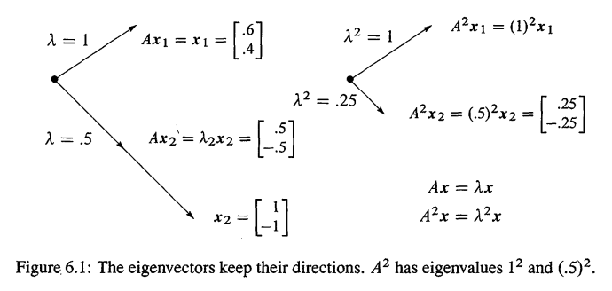

其它向量被A乘之后是会改变方向的,**但其它的向量都是这两个特征向量的组合**,如A的第一列就是
$$
\text{分解为特征向量：} \quad \left[ \begin{array} { l } .8 \\ .2 \end{array} \right] = x _ { 1 } + ( .2 ) x _ { 2 } = \left[ \begin{array} { l } .6 \\ .4 \end{array} \right] + \left[ \begin{array} { r } .2 \\ - .2 \end{array} \right]  \tag{1}
$$

根据`Eq(1)`,A的第一列被分解为特征向量的线性组合，而A的第一列乘以 A 得到 $A^2$ 的第一列 这个过程，可以分解为特征向量 $x_1$ 和 $(.2)x_2$ 和A的乘法,因为 $Ax_1= x_1$,而 $Ax_2  = 1/2 x_2$  ，所以
$$
\text{每一个}x_i\text{都乘以}\lambda_i:\quad 
A \left[ \begin{array} { l } .8 \\ .2 \end{array} \right] = \left[ \begin{array} { l } .7 \\ .3 \end{array} \right] \text { 就是 } \quad  x _ { 1 } + \frac { 1 } { 2 } ( .2 ) x _ { 2 } = \left[ \begin{array} { l } .6 \\ .4 \end{array} \right] + \left[ \begin{array} { r } .1 \\ - .1 \end{array} \right]
$$

**当被A乘时,每一个特征向量，都乘以它的特征值**.对于求 $A^2$,我们可能不需要这些特征向量,但是,求 $A^{99}$,这是一个绝妙的方法.在每一次乘法里面,$x_1$ 不改变,$x_2$ 被乘以1/2
$$
A ^ { 99 } \left[ \begin{array} { l } .8 \\ .2 \end{array} \right] \text {就是 } x _ { 1 } + ( .2 ) \left( \frac { 1 } { 2 } \right) ^ { 99 } x _ { 2 } = \left[ \begin{array} { c } .6 \\ .4 \end{array} \right] + \left[ \begin{array} { c } \text { very } \\ \text { small } \\ \text { vector } \end{array} \right] \tag{M1}
$$
这就是 $A^{100}$ 的第一列,我们一开始写的 `.6000` 不是很准确的.

特征值 $x_1$ 是一个**稳态(steady state)**,不会改变(因为 $λ_1=1$).特征值 $x_2$ 是一个**衰减模式(decaying mode)**,最终会消失(因为 $λ_2= .5$).A的幂越高,列就越接近稳态.

注意,A是一个**马尔科夫矩阵**,所有的元素都是正值的,并且每一列加起来是1.**这些要求确保了最大的特征值是1**,它的**特征向量$x_1=(.6,.4)$ 就是稳态**--也就是 $A^k$ **所有的**列最终会趋近的值  .`<01-08 #3>` 节展示了马尔科夫矩阵是怎么应用在谷歌的应用上。

> sp:为什么是所有列呢？Eq(M1)已经展示了第1列,而A的第2列，也可以分解为2个特征向量的线性组合，而且因为 $\lambda_2$ 是衰减的，所以对应的 $x_2$ 会逐渐趋于0，只剩下 $x_1$,所以所有列都会趋近！

---

对于投影,可以发现稳态(λ=1)和零空间(λ=0)

**例2.** 投影矩阵 $P= \left[\begin{matrix} .5 & .5 \\ .5 & .5 \end{matrix} \right]$ 的特征值是 $\lambda_1 = 1,x_1 =(1,1);\lambda_2 =0,x_2 = (1,-1)$. $Px_1 = x_1$ 是稳态， $Px_2 = 0$ 就是零空间！这个P，是马尔科夫矩阵，也是奇异矩阵，最重要的是，**对称矩阵**，这些特殊的矩阵，都有特殊的 $\lambda$ 和 `x`：

1. P每一列加起来都是1(马尔科夫),所以 $\lambda = 1$ 是一个特征值
2. P**奇异**,所以 $\lambda = 0$ 是一个特征值
3. P**对称**,所以它的特征向量 $(1,1)，(1,-1)$ 是垂直的

**投影矩阵的特征值都是 $\lambda = 0,1^{(N2)}$ !** $\lambda = 0$ 的特征向量(意味着 `Px = 0x` ) **填充零空间**；$\lambda = 1$ 的特征向量(意味着 `Px = 1x` ) 填**充了列空间**。零空间投影为0，列空间投影为自身，**投影保持了列空间，但摧毁了零空间$^{(N1)}$** 

> sp: `N1` 说明： 这里的零、列空间说的应该是P本身的，而不是如 `<01-04 #2>` 所说的A(也就是A的列空间就是要被投影的子空间)，如特征向量 $x_1 = (1,1)$ 明显就是P的列空间向量。如果向量 x 是 A 的列空间向量，那么 Px = x，没问题(x已经在A的列空间，再投影不变)；但如果 x 是A的零空间向量，Px并不能保证什么。N1说的是，如果 x 是P的零空间，那么Px = 0。感觉话有点多余...这样理解：如果P是投影矩阵，那么它的特征向量就分别是列空间和零空间向量！
>
> 参见视频21，Px=x，x位于被投影的子空间上，如果P的3-3的，那么就是1个2维平面，实际上这个平面整个都是特征向量，从这个平面可以选出2个独立的特征向量，另外1个特征向量就是和这个平面垂直的向量：Px= 0,此时x是P的零空间向量
>
> ---
>
> `N2` 说明：参见 `<01-04 #2.4>` ，除非 `P=I`,不然投影矩阵都是奇异的。而且这个投影矩阵还是马尔科夫矩阵，各列加起来是1不是投影矩阵的性质，如 `<01-04 #2 例3>`。所以 $\lambda_{max} = 1$ 一定是特征值.其实，参见 `<#Lk1>`,只要是投影矩阵，特征值就是0，1。下面证明：
>
> $Ax = \lambda x$,两边乘以 A，得到：
> $$
> A^2x = \lambda Ax
> $$
> 因为 $P^2 = P,Px = \lambda x$,上式化简为 $Ax = \lambda^2 x = \lambda x$.所以 $(\lambda^2 - \lambda) x= 0,\lambda=0,1$.QED

$$
\text{投影每部分} \quad  v = \left[ \begin{array} { r } 1 \\ - 1 \end{array} \right] + \left[ \begin{array} { l } 2 \\ 2 \end{array} \right] \quad \text { projects onto } \quad P v = \left[ \begin{array} { l } 0 \\ 0 \end{array} \right] + \left[ \begin{array} { l } 2 \\ 2 \end{array} \right]
$$

**投影矩阵的特征值是0和1，置换矩阵的是 $|λ| = 1$**。特殊的矩阵可以得到特殊特征值和特征向量,这也是本章的主题，参见 `<#Lk1>` 的总结。

---

下面的矩阵R(一个反射矩阵同时也是一个置换矩阵)也是特殊的

**例3.**  反射矩阵 $R=\left[\begin{matrix} 0 & 1 \\ 1 & 0 \end{matrix} \right]$ 的特征值是`1;-1`.特征向量 $x_1= (1,1),Rx_1 = x_1$ 不会被R改变，特征向量 $x_2 = (1,-1),Rx_2 = -x_2$  被R改变正负号。一个没有负数元素的矩阵，也有可能有负数的特征值！R的特征向量和例1的P一样，因为 `reflection=2(Projection)-I`:
$$
R= 2P - I\quad \left[ \begin{array} { l l } 0 & 1 \\ 1 & 0 \end{array} \right] = 2 \left[ \begin{array} { l l } .5 & .5 \\ .5 & .5 \end{array} \right] - \left[ \begin{array} { l l } 1 & 0 \\ 0 & 1 \end{array} \right]

\tag{2}
$$
原因：如果 $Px = \lambda x$,那么

- $2Px = 2\lambda x$.也就是，**当矩阵乘以2的时候，特征值也翻倍,特征向量不变**
- 现在减去 `Ix = x`，结果是 $(2P -I)x = (2\lambda - 1)x$.**当矩阵平移`I`，每一个 $\lambda$ 平移1，特征向量不变**

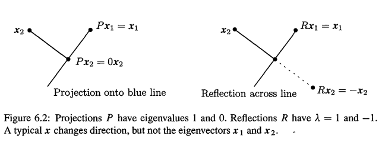

关键：**P，R的特征值的关联，就像P,R矩阵之间的关联一样。而且特征向量不变**

- R的特征值是 $R = 2P -I$,得到 $2*1 - 1 = 1,2*0 -1 = -1$
- $R^2$ 的特征值是 $\lambda^2$,这里 $R^2 = I$,可检查 $1^2 = (-1)^2 = 1$

---

**例V1.** 再看 $Ax = \lambda x$,有 $(A+3I) x = \lambda x + 3x = (\lambda+3)x$，特征值+3，特征向量不变。但如果加上的不是单位矩阵，就不正确了，如 $Ax = \lambda x,Bx = \alpha x$,那么是否有 $(A+B)x = (\lambda+ \alpha)x$? 这是错的,B = 3I没问题,其他是有问题的,为何?没有理由相信,x既是A也是B的特征向量.实际上应该是： $Ax = \lambda x, By = \alpha y$

一般而言,A+B,AB的特征值不满足线性关系和乘法关系,因为特征向量一般不同,**没有办法判断A+B的情况,只有B是单位矩阵的倍数的时候才可以**


## 特征值的方程

> The Equations for the eigenvalues

对于投影和反射,我们通过几何:`Px = x,Px = 0,Rx = -x` 来找到 `λ's` 和 `x's` .现在我们使用行列式--这时本章的关键计算.基本上，所有现实的应用，都是从求 $Ax = \lambda x$ 开始。

首先,把 `λx` 移到左边,方程变成 $(A-λI)x = 0$.也就是矩阵 $A - λI$  乘以特征向量 `x` 的结果是0向量.也就是说,**特征向量组成了矩阵 `A - λI` 的零空间**.所以，一旦我们知道了特征值 `λ` ,就可以通过求解 $(A - λI)x = 0$ 来求得特征向量x(就是求零空间向量，如 `<01-02>` 解方程组)。

所以首先要求特征值。那么如何求呢? 如果 $(A - λI)x = 0$ 有一个非0解,意味着 $A - λI$  **不可逆**,那么 $A - λI$ 的行列式必为0. 这就是我们求得特征值的关键

> 当且仅当 $A - \lambda I $ 是奇异的，数字 $\lambda$ 才是A的特征值。也就是如下的 **特征多项式(characteristic polynomial)** :
> $$
> \det(A-\lambda I) = 0 \tag{3} 
> $$
> `det(A - λI)` 只涉及到 `λ`,没有 `x`。然后，对每一个 $\lambda$,求解 $(A - \lambda I)x = 0$ 或 $Ax= \lambda x$ ，得到特征向量 `x`.  当A是n-n的, `Eq(3)` 的阶(degree)就是n,那么A有n个特征值(**可能重复!**),每一个 `λ` 可以得到一个特征向量 x


**例4.** $A= \left[\begin{matrix} 1 & 2 \\ 2 & 4 \end{matrix} \right]$ 已经是奇异的，求 $\lambda,x$。

解：当A是奇异的时候，$\lambda = 0$ 是一个特征值，因为 `Ax = 0x` 有解，解就是 $\lambda = 0$ 的特征向量。但 $\det(A-\lambda I) = 0$ 是求所有的 $\lambda‘s,x's$ 的唯一方法！
$$
\text{将}\lambda \text{从对角线减去}：\quad

A - \lambda I = \left[ \begin{array} { c c } 1 - \lambda & 2 \\ 2 & 4 - \lambda \end{array} \right]

\tag{4}
$$
2-2矩阵行列式是 `ad-bc`，从而得到：
$$
\operatorname { det } \left[ \begin{array} { c c } 1 - \lambda & 2 \\ 2 & 4 - \lambda \end{array} \right] = ( 1 - \lambda ) ( 4 - \lambda ) - ( 2 ) ( 2 ) = \lambda ^ { 2 } - 5 \lambda 

\tag{5}
$$
**设如上行列式为0**，得到 $\lambda=0,5$.现在求特征向量，分别对 $\lambda = 0,5$,求解 $(A- \lambda I)x = 0$:
$$
\begin{array} { l }
\lambda _ { 1 } = 0 : 
\quad ( A - 0 I ) x = \left[ \begin{array} { l l } 1 & 2 \\ 2 & 4 \end{array} \right] \left[ \begin{array} { l } y \\ z \end{array} \right] = \left[ \begin{array} { l } 0 \\ 0 \end{array} \right] 
\Rightarrow \qquad   \left[ \begin{array} { l } y \\ z \end{array} \right] = \left[ \begin{array} { r } 2 \\ - 1 \end{array} \right] \\

\lambda _ { 2 } = 5:\quad 
( A - 5 I ) x = \left[ \begin{array} { r r } - 4 & 2 \\ 2 & - 1 \end{array} \right] \left[ \begin{array} { l } y \\ z \end{array} \right] = \left[ \begin{array} { l } 0 \\ 0 \end{array} \right] 
\Rightarrow \qquad \left[ \begin{array} { l } y \\ z \end{array} \right] = \left[ \begin{array} { l } 1 \\ 2 \end{array} \right] \quad  \end{array}
$$
**$(A- \lambda I)$ 让矩阵变为奇异，从而 $(A- \lambda I)x$ 的特征向量 `x` 在 $(A- \lambda I)$ 的零空间**。需要强调的是，$\lambda=0$ 没有任何特殊之处，它可能是或不是特征值，如果A本身是奇异的，那么0就是特征值，从而0对应的特征值，填充A的零空间：`Ax = 0x = 0`.   如果A是可逆的，0就不是特征值，**但我们把A平移 `I` 的倍数，让A变得奇异**。如本例当中，平移后的矩阵是 $(A- 5 I)$,是奇异的。

---

> 总结:为了求解n-n矩阵的特征值问题,有以下步骤
>
> 1. **计算 $(A- \lambda I)$ 的行列式**： A的对角线元素减去$\lambda$ ，而且这个行列式会出现 $\lambda^n$ 或 $\lambda^{-n}$,是关于 $\lambda$ 的n阶（degree n） 的多项式
> 2. **求上述多项式的根**： 通过求解 $\det(A-\lambda I) = 0$,n个根就是A的n个特征值，它们让 $(A-\lambda I) $ 奇异
> 3. **对每一个 $\lambda$，求解 $(A- \lambda I)x = 0$,得到特征向量x**

对于2-2矩阵需要注意,当 `A - λI` 奇异,矩阵的2行都是一个向量 `(a,b)` 的数乘.而特征向量就是`(b,-a)`的任何数乘.在例4， `λ=0,λ=5`

- λ=0:`A −0I` 的行的方向都是 `(1,2)` 方向,而特征向量是 `(2,-1)` 方向
- λ=5:`A −5I` 的行的方向是`(-4,2)`,而特征向量是`(2,4)`方向

> sp:很好理解，特征向量 x 是 $A- \lambda I$ 零空间向量，而零空间向量和行空间向量垂直！而A奇异并且2-2，所以一行必定是另一行的数乘。如果A是3-3并奇异，设秩r=2，那么有1行是其他2行的线性组合，不能确保都只是1行的数乘。

例4的特征向量 $x_2$ 写成是 `(1,2)`,但 `(1,2),(2,4)` 都是正确的： 任何非0数乘以x都是和x一样好,都是特征向量.Matlab的 `eig(A)` 命令是除以了长度的,从而得到单位特征向量

最后注意,一些2-2矩阵只有一条线的特征向量,这**只能**发生在2个**特征值一样**的时候(但另一方面,`A = I` 有相等的特征值,但不同的特征向量!).类似的,**一些n-n矩阵没有n个==独立的==特征向量，也就没有基,从而不能把任何一个向量v写成是特征向量的组合**!如果用 `<#2>` 的语言来说,没有n个独立的特征向量,我们就不能对角化矩阵


## 好消息和坏消息

坏消息:如果你把A的一行加到另外一行,或者交换行,特征值通常是改变的.**消去不能保持特征值**.三角矩阵U的特征值都在主对角线上的--都是主元,但**它们不是A的特征值**!当 `r1` 被加到 `r2` 的时候,特征值改变了:
$$
U = \left[ \begin{array} { l l } 1 & 3 \\ 0 & 0 \end{array} \right] \text { 是 } \lambda = 0 ，1 ; \quad 
A = \left[ \begin{array} { l l } 1 & 3 \\ 2 & 6 \end{array} \right] \text { 是 } \lambda = 0，7
$$
好消息:特征值之和和之积可以通过矩阵快速的找到;对于上面的A,积是 `0*7 = 0` ,也就是行列式的值.和是 `0+7 = 7`,也就是对角线元素之和,这总是成立的

- **n个特征值的积等于行列式**
- **n个特征值的和等于n个对角元素之和**

主对角线上的元素之和称为A的**迹(trace)**
$$
\lambda _ { 1 } + \lambda _ { 2 } + \cdots + \lambda _ { n } = \text { trace } = a _ { 11 } + a _ { 22 } + \cdots + a _ { n n }

\tag{6}
$$
这两个等式对于**检查特征值计算**是否正确非常有用! 在习题16，17和下一节有证明。如果**没有行交换,λ的乘积等于主元的乘积**,但是λ的和并不是主元的和.单一的λ和主元几乎是没有任何关系的.在线性代数的这一部分,关键问题却是不是线性的:λ 乘以 x

> sp:为何需要没有行交换？参见 `<01-05 #2.1>`,因为行交换之后，行列式改变正负号，而主元乘积乘以 $\pm 1$ 才等于行列式


## 虚数特征值

> Imaginary Eigenvalues

一个不算特别坏的消息是,特征值有可能不是实数

**例5.** 90度旋转矩阵 $Q =\left[\begin{matrix} cos90 & -sin90 \\ sin90 & cos90 \end{matrix} \right] = \left[\begin{matrix} 0 & -1 \\ 1 & 0 \end{matrix} \right]$ ，单位正交。它没有实数特征值，$\det(A- \lambda I) = \lambda^2+1$,特征值 $\lambda=i,-i$,和 $0 = trace$ , 积 $1 = \det $ .旋转一次之后,没有向量 `Qx` 可以和 `x` 保持同样的方向(除非无用的`x = 0`).所以没有一个特征向量,**除非我们使用虚数,这也是我们的选择.**

为了看看 `i` 是怎么起作用的,我们看看 $Q^2=−I$.如果Q是旋转90度,那么$Q^2$ 旋转180度.$Q^2$ 的特征值是`-1,-1`(明显,`−Ix=−1x`),Q平方会让λ也被平方,所以必须有 $λ^2=−1$.90度旋转矩阵Q的特征值是 $\pm i$,因为 $i^2=−1$

这些λ也可以从普遍的 $\det(Q - λI) = 0$ 得到.这个等式就是 $λ^2+1=0$,从而 $\lambda = \pm i$.而且在特征向量，我们也会遇到虚数 `i`:
$$
\begin{array} { l } \text { 复数 } \\ \text { 特征向量 } \end{array} \quad 
\left[ \begin{array} { r r } 0 & - 1 \\ 1 & 0 \end{array} \right] \left[ \begin{array} { l } 1 \\ i \end{array} \right] = - i 
\left[ \begin{array} { l } 1 \\ i \end{array} \right] \text { , } \quad 
\left[ \begin{array} { r r } 0 & - 1 \\ 1 & 0 \end{array} \right] \left[ \begin{array} { l } i \\ 1 \end{array} \right] = i \left[ \begin{array} { l } i \\ 1 \end{array} \right]
$$
以某种方式,这些复特征向量 $x_1=(1,i),x_2=(i,1)$,可以在旋转后保持方向，不要问我怎么做到的:)...  这个例子的重要之处在于告诉我们：**实数矩阵,也可能轻易的有复数特征值和特征向量**.而这个 `i,-i` 的特征值也告诉我们关于Q的2个特殊性质:

1. Q是正交矩阵(orthigonal matrix),所以每一个λ的绝对值 `|λ| = 1`
2. Q的反对称(skew-stmmetric)的,所有每一个λ都是纯虚数(pure imaginary)

一个对称矩阵($A = A^T$)可以被类比成实数,一个反对称(skew-symmetric: $A^T=−A$)可以被类比成虚数.一个正交矩阵(orthogonal matrix: $A^T A=I$ )可以类比为是 $|\lambda = 1|$ 的复数.这不仅仅是类比而已!这是会在 `<#4>` 证明的定理!

这些特殊矩阵的特征值都是垂直的.以某种方式,`(i,1);(1,i)` 是垂直的,参见 `<01-10>`解释的复向量的点乘.

---

**例V2** 还有比例5更坏的情况。设 $A= \left[\begin{matrix} 3 & 1 \\ 0 & 3 \end{matrix} \right]$.注意A是三角矩阵,**可知特征值就是对角线元素**:3,3,这里有重复的特征值.为什么对这个矩阵这么悲观?问题在于特征向量!
$$
(A- \lambda I) x = \left[\begin{matrix} 0 & 1 \\ 0& 0 \end{matrix} \right] x = 0
$$
$\lambda_1,\lambda_2$ 对应的特征向量都是 `(1,0)`,找不到线性无关的2个特征向量!这是一个退化矩阵(degenerate matrix),只有一个方向上的特征向量.**重复的特征值,导致了特征向量的短缺.**


## matlab当中的 `Eigshow`

在 `TaachingCode` 当中， `eigshow` 的matlab代码展示了2-2矩阵的特征值问题。它从单位向量 `x = (1,0)` 开始，鼠标点击可以让 x 沿着单位圆移动，同时也显示出不断移动的 Ax。有时候Ax会和 x 平行，这时 $Ax = \lambda x$,$x_1,x_2$ 展示在如下右图

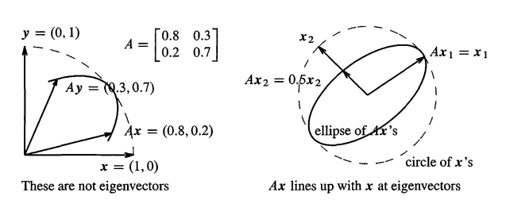

当 $Ax = \lambda x$, 因为 `x` 是单位向量，相当于特征向量 x 一直被设为单位向量，从而 $\lambda$ 的值等于 Ax 的长度。代码预设了不同的A，展示了3种情况：当 x 和 Ax 在移动过程当中交错(Ax crosses x),可能有0，1，或2个**方向**：

1. 没有实数特征向量：Ax总是在x的前面或者后面，它们永远不会交错。这意味着特征值和特征向量是复数，如例5的旋转Q矩阵
2. 只有1个(实数)特征向量：Ax和x移动的时候，会接触但不会面对面交错而过(touch but don't cross over),会有**2**次在同一条直线上(一前一后)
3. 2个不同方向的独立特征向量：这是典型的情况！Ax和x在 $x_1$ 交错，又在 $x_2$ 交错，也会在 $-x_1,-x_2$ 在同一条直线上，一共**4**次在同一条直线上

> sp:请运行一下代码，并添加如下列出的矩阵进行尝试，很形象。eigshow这个代码还包括svdshow，参见 `<#7>` 。注意,因为1条直线有2个方向，也就是说，如果 $Ay = \lambda y$，那么 $A(-y) = \lambda (-y)$,`y` 和 `-y` 是共线的，属于一个特征向量。也就是，**1个特征向量，代表1个方向**，而1个方向，会让Ax和x会2次在同一条直线上，一前一后。所以：
>
> - `情况2` ：1个实数特征向量的时候，1个方向，但是2次，x和Ax在同一条直线上。
> - `情况3` ：2个实数特征向量的时候，x和Ax，2个方向，4次在同一条直线上。

可用如下的5个矩阵验证一下，下面的数字是**实数特征向量**的个数
$$
 \begin{array}{c c c c c}
A= 
	&\left[ \begin{array} { l l } 2 & 0 \\ 0 & 1 \end{array} \right] 
	&\left[ \begin{array} { l l } 0 & 1 \\ 1 & 0 \end{array} \right]
	&\left[ \begin{array} { l l } 0 & 1 \\ -1 & 0 \end{array} \right] 
	&\left[ \begin{array} { l l } 1 & -1 \\ 1 & -1 \end{array} \right]
	&\left[\begin{array}{ll} 1 & 1 \\ 0 & 1 \end{array} \right] 
	\\
	&2 &2 &0 &1 &1
\end{array}
$$
当A奇异(这里秩1就是奇异)，列空间只有1条直线，所以当x沿着单位元移动，向量Ax只在那条直线上来回伸缩，另外一个特征向量就是 $Ax_2 = 0$,奇异矩阵的一个特征值就是0.


## 总结

1. `Ax = λx`,说的是,特征向量x乘以了A以后,还是保持着方向不变，代数表达就是 `det(A - λI) = 0`,可以确定n个特征值
3. $A^2,A^{−1}$ 的特征值是 $λ^2,λ^{−1}$,特征向量不变,参见 `<典型例题1>`
4. 所有 `λ` 之和等于A的主对角线的元素的和(迹),λ的积等于行列式
5. 投影P,反射R,90度旋转的Q有特殊的特征值 `1,0,-1,i,-i`.奇异矩阵有λ = 0.三角矩阵的λ就在对角线上.


## 典型例题

**1.** 求如下 $A,A^2,A^{-1},A+4I$ 的特征值和特征向量
$$
A = \left[ \begin{array} { r r } 2 & - 1 \\ - 1 & 2 \end{array} \right] \text { and } A ^ { 2 } = \left[ \begin{array} { r r } 5 & - 4 \\ - 4 & 5 \end{array} \right]
$$
检查一下A和 $A^2$ 的迹 $\lambda_1 + \lambda_2$ 和行列式 $\lambda_1\lambda_2$

解： 直接用方程计算A的特征值
$$
\operatorname { det } ( A - \lambda I ) = \left| \begin{array} { c c } 2 - \lambda & - 1 \\ - 1 & 2 - \lambda \end{array} \right| = \lambda ^ { 2 } - 4 \lambda + 3 = (\lambda-1)(\lambda-3)
$$
所以 $\lambda_1 = 1,\lambda_2 =3$.迹是 `2+2 = 1+3 = 4`,行列式是 $\lambda_1\lambda_2 = 3$,符合。现在求特征值，分别计算 $(A- \lambda I)x = 0$
$$
\lambda = 1 :  ( A - I ) x = \left[ \begin{array} { r r } 1 & - 1 \\ - 1 & 1 \end{array} \right] \left[ \begin{array} { l } x \\ y \end{array} \right] = \left[ \begin{array} { l } 0 \\ 0 \end{array} \right] 
\Rightarrow \quad x_1 = \left[\begin{matrix} 1  \\1  \\\end{matrix} \right]

\\
\lambda = 3 :  ( A - 3 I ) x = \left[ \begin{array} { l l } - 1 & - 1 \\ - 1 & - 1 \end{array} \right] \left[ \begin{array} { l } x \\ y \end{array} \right] = \left[ \begin{array} { l } 0 \\ 0 \end{array} \right] 
\Rightarrow \quad x_2 = \left[\begin{matrix} 1  \\-1  \\\end{matrix} \right]
$$
$A^2,A^{-1},A+4I$ 的**特征向量和A是一样的**，而特征值分别是 $\lambda^2,\lambda^{-1},\lambda+4$:

- $A^2$ 的特征值是 1和9
- $A^{-1}$ 的特征值是 1和1/4
- `A+4I` 的特征值是 5,7

$A^2$ 的迹是 $5+5 = 1+9 = 10$,行列式是 $25-16 = 9$

对后面小节的提示：

- 根据`<#4>`，A对称，A有正交的特征向量
- 根据 `<#2>`， $\lambda_1 \ne \lambda_2$,所以A可以对角化
- 根据 `<#6>`,A和任何特征值是1，3的2-2矩阵是相似的
- 根据 `<#5>`,A是正定矩阵，因为 $A= A^T$ 并且所有 $\lambda$ 都是正值

---

**2.** 求如下迹是4，对称奇异矩阵的特征值和特征向量
$$
A = \left[ \begin{array} { r r r } 1 & - 1 & 0 \\ - 1 & 2 & - 1 \\ 0 & - 1 & 1 \end{array} \right]
$$
解： 因为A的所有行加起来是0，所有 `x= (1,1,1)` 给出了Ax = 0,这就是 $\lambda = 0$ 的特征向量。为了求 $\lambda_2,\lambda_3$,求如下3-3的行列式
$$
\operatorname { det } ( A - \lambda I ) = \left| \begin{array} { c c c } 1 - \lambda & - 1 & 0 \\ - 1 & 2 - \lambda & - 1 \\ 0 & - 1 & 1 - \lambda \end{array} \right| = ( 1 - \lambda ) ( 2 - \lambda ) ( 1 - \lambda ) - 2 ( 1 - \lambda ) \\
= （1- \lambda)[(2- \lambda)(1- \lambda)-2] = (1- \lambda)(-\lambda)(3-\lambda)
$$

> sp:如上展开是第一行的代数余子式展开，计算下去就出来了

得 $\lambda_2 = 1,\lambda_3 = 3$，每个特征值对应的特征向量是
$$
x _ { 1 } = \left[ \begin{array} { l } 1 \\ 1 \\ 1 \end{array} \right] \quad A x _ { 1 } = 0 x _ { 1 } \quad x _ { 2 } = \left[ \begin{array} { r } 1 \\ 0 \\ - 1 \end{array} \right] \quad A x _ { 2 } = 1 x _ { 2 } \quad x _ { 3 } = \left[ \begin{array} { r } 1 \\ - 2 \\ 1 \end{array} \right] \quad A x _ { 3 } = 3 x _ { 3 }
$$
再次注意到，**当A是对称的时候，A的特征向量是垂直的**。

这个3-3的矩阵的 $\det (A- \lambda I)$产生的是一个三阶的多项式  $-\lambda^3 +4 \lambda^2 - 3 \lambda$,这里能求的3个简单根 `0,1,3` 是幸运的。通常，我们会使用 `eig(A)` 这样的命令来得到特征值，而且这个命令不是使用行列式来计算(其使用的方法是  `<01-09 #3>` 的方法)

完整的命令是 `[S,D] = eig(A)`,**单位**特征向量作为**特征向量矩阵S**的列，而A的特征值，会成为**特征值矩阵D**(下一节写作 $\Lambda$) 的对角线元素。


#  2. 对角化矩阵

> Diagonalizing a Matrix

当x是特征向量,被A乘就是简单的乘以数字`λ`： $Ax = λx$.矩阵所有麻烦不见了!这有什么启示呢？我们不需要处理内部关联的复杂系统，只需要逐一的处理特征向量即可，这就像有了对角矩阵一样！没有了非对角元素的复杂关联！

这一节的目标很直接:**当正确使用特征向量,矩阵A转换为对角矩阵`Λ`**：

> **Diagonalizing**
>
> ---
>
> 假设 n-n 矩阵A有 n 个**线性独立**的特征向量 $x_1...x_n$，把它们作为**特征向量矩阵(eigenvector matrix)** S 的列，那么 $S^{-1}AS$ 是**特征值矩阵** $\Lambda$:
> $$
> \begin{aligned}
> 	\text{Eigenvector Matrix S}\\
> 	\text{Eigenvalue Matrix }\Lambda
> \end{aligned}
> :\qquad 
> S ^ { - 1 } A S = \Lambda = \left[ \begin{array} { l l l } \lambda _ { 1 } & & \\ & \ddots & \\ & & \lambda _ { n } \end{array} \right]
> \tag{1}
> $$
> 从而矩阵A被对角化了

**证明：** AS的第一列是 $Ax_1 = \lambda_1x_1$.S的每一列，其实都是被A特征值 $\lambda_i$ 所乘：
$$
\text{A time S}:\quad

A S = A \left[\begin{matrix}  &  & \\x_1 & ... & x_n\\ &  & \\\end{matrix} \right]
= \left[\begin{matrix}  &  & \\\lambda_1x_1 & ... & \lambda_nx_n\\ &  & \\\end{matrix} \right]
$$
窍门是，把矩阵AS分解为 S 乘以 $\Lambda$:
$$
\left[\begin{matrix}  &  & \\\lambda_1x_1 & ... & \lambda_nx_n\\ &  & \\\end{matrix} \right] = 
\left[\begin{matrix}  &  & \\x_1 & ... & x_n\\ &  & \\\end{matrix} \right]
\left[ \begin{array} { l l l } \lambda _ { 1 } & & \\ & \ddots & \\ & & \lambda _ { n } \end{array} \right] = S \Lambda
$$
所以 $AS= S\Lambda$,并且有2个表达方式：
$$
AS = S\Lambda  \text{ 等价于}:  \quad  S^{-1}AS = \Lambda \quad \text{或者} A= S\Lambda S^{-1} \tag{2}
$$
矩阵S是可逆的,因为它的列(A的特征向量)是被假设为线性独立的.**如果没有n个独立的特征向量,我们就不能对角化**

**A和Λ的有相同的特征值**  $λ_1…λ_n$,但特征向量是**不同**的.原始的特征向量 $x_1…x_n$ 作为S的列，其作用是对角化A，从而有 $A = SΛS^{−1}$.你很快就会看到,矩阵A的n阶幂 $A^n=SΛ^n S^{−1}$ 在及其重要的同时,又是难以描述的简洁美丽

---

**例1.** $A = \left[\begin{matrix} 1 & 5 \\ 0 & 6 \end{matrix} \right]$ 是三角的,所以 `λ's` 就在对角线上:$λ=1,6$,特征向量是 `(0,1),(1,1)`
$$
S^{-1}AS = \Lambda :\quad 
\left[ \begin{array} { r r } 1 & -1 \\ 0 & 1 \end{array} \right] \left[ \begin{array} { l l } 1 & 5 \\ 0 & 6 \end{array} \right]  \left[ \begin{array} { l l } 1 & 1 \\ 0 & 1 \end{array} \right] = \left[ \begin{array} { l l } 1 & 0 \\ 0 & 6 \end{array} \right]
$$
另一方面,$A= SΛ S^{−1},A^2= SΛ S^{−1} SΛ S^{−1}  = SΛ^2 S^{−1}$,**S当中的特征向量没变,只是 $Λ^2$ 的特征值被平方了!** A的k阶幂还是如此,$A^k= SΛ^k S^{−1}$:
$$
\left[\begin{matrix} 1 & 5 \\ 0 & 6 \end{matrix} \right] ^k = 

\left[ \begin{array} { c c } 1 &  1 \\ 0 & 1 \end{array} \right] 
\left[ \begin{array} { c c } 1 &  \\  & 6^k \end{array} \right] 
\left[ \begin{array} { cc } 0 & -1 \\ 0 & 1 \end{array} \right] 
= \left[ \begin{array} { cc } 1 & 6^{k}-1 \\ 0 & 6^k \end{array} \right]
$$
当k = 1,我们得到A,当k = 0,得带`A = I`.当k = -1我们得到 $A^{−1}$ ! (sp:还可以这样计算逆矩阵!）

---

使用Λ之前有4个注意事项

**1.** 假设特征值 $λ_1…λ_n$ 都是不同的,那么特征向量 $x_1…x_n$ 就自动是独立的.**任何没有重复特征值的矩阵都是可以对角化的!**

**2.** 特征向量乘以任何非0常数.$Ax = λx$ 仍然成立.如在例1,可以把特征向量 `(1,1)` 除以 $\sqrt{2} $ 来得到单位向量

**3.** S当中的特征向量和 `Λ` 当中的特征值的顺序是一致的.如，为了逆转Λ当中的顺序,把例1当中的S的特征向量改变顺序,得到
$$
\left[ \begin{array} { r r } 0 & 1 \\ 1 & - 1 \end{array} \right] \left[ \begin{array} { l l } 1 & 5 \\ 0 & 6 \end{array} \right] \left[ \begin{array} { l l } 1 & 1 \\ 1 & 0 \end{array} \right] = \left[ \begin{array} { l l } 6 & 0 \\ 0 & 1 \end{array} \right] = \Lambda_{new}
$$
从 $S^{−1} AS= Λ$,得到 $AS = SΛ$.假设S的第一列是`x`,那么 `AS` 和 `SΛ` 的第一列就是 `Ax` 或 $λ_1 x$

**4.** (再次强调重复的特征值！)有一些矩阵没有足够的特征向量,这些矩阵不能被对角化,如下2个例子
$$
A = \left[ \begin{array} { l l } 1 & - 1 \\ 1 & - 1 \end{array} \right] ; B = \left[ \begin{array} { l l } 0 & 1 \\ 0 & 0 \end{array} \right]
$$
它们的特征值都是0,0.其实 $λ=0$ 并不特殊,关键在于**特征值重复**了.第一个矩阵A的特征向量都是 `(1,1)` 的倍数
$$
\text{one line of eigenvectors:} \quad Ax= 0x \quad 意味着 \quad 
\left[ \begin{array} { l l } 1 & - 1 \\ 1 & - 1 \end{array} \right] [ x ] = \left[ \begin{array} { l } 0 \\ 0 \end{array} \right] \Rightarrow x = c \left[ \begin{array} { l } 1 \\ 1 \end{array} \right]
$$
没有第二个特征向量.所以A不可对角化.

这2个矩阵是用来测试关于特征向量判断真假是非常好的.在很多true-false的问题当中,不可对角化的矩阵的答案都是false.

---

**记住,可对角化和可逆性之间没有联系**：

- 可逆性和特征值有关系( `λ=0` 或 $λ \ne 0$ ,$\lambda=0$ 表示$\det (A-\lambda I) = \det(A) = 0$ 即不可逆)
- 可对角化和特征向量有关系(S的特征向量是否足够)

还需要注意的是,**每一个特征值至少有一个特征向量**! $A − λI$ 是奇异的,如果 $(A−λI)x=0$ 让你得到了 `x = 0` ,那么这时候 `λ` 肯定不是特征值!(sp:只有可逆矩阵零空间有x=0),赶紧看看 $\det(A - λI) = 0$ 求解过程的问题把!

**n个不同的特征值,对应的特征向量一定是独立的**,所以可以对角A：

> **Independent x from different $\lambda$**:
>
> ---
>
> 如果特征值 $\lambda_1...\lambda_j$ 之间都是不同的，那么其对应的特征向量 $x_1...x_j$ 就是线性独立的。任何拥有n个**不同**特征值的 n-n 矩阵，都是可以对角化的。
>
> ---
>
> sp:上述第一句话是的j个特征值，也就是说，如果矩阵 n-n ,有 n 个特征值，但只有 j 个不重复，那么这不重复的特征值对应的特征向量就是独立的

**证明:** 设 $x_1,x_2$ 是特征向量，假设 $c_1x_1 + c_2x_2 = 0$,也就是 $x_1,x_2$ 独立。那么

- 2边同时乘以A,得到  $c_1 \lambda_1x_1 + c_2 \lambda_2 x_2 =0$
- 2边同时乘以 $\lambda_2$ ,得到 $c_1 \lambda_2x_1 + c_2\lambda_2x_2 = 0$

上2个式子相减，得到 $(\lambda_1 - \lambda_2)c_1 x_1 = 0$，因为 $\lambda_1 \ne \lambda_2$ 而且 $x_1 \ne 0$,所以 $c_1 = 0$.类似的 $c_2 = 0$.也就是说，除非 $c_1,c_2$ 都是0，不然没有任何组合能够产生 $c_1x_1 + c_2x_2 = 0$,所有 $x_1,x_2$ 独立。

上述证明可以直接扩展到 j 个特征向量。假设  $c_1 x_1 +...+c_jx_j = 0$:

- 先乘以A得到 $c_1\lambda_1 x_1 +...+c_j\lambda_jx_j = 0$ 
- 乘以 $\lambda_j$ 得到 $c_1\lambda_j x_1 +...+c_j\lambda_jx_j = 0$

相减，得到  $(\lambda_1 - \lambda_j)c_1x_1 +...+(\lambda_{j-1} - \lambda_j) c_{j-1}x_{j-1} = 0$,也就是相当于把 $x_j$ 的项去掉了。然后，最新的式子，再分别乘以 A 和 $\lambda_{j-1}$ 然后相减，移除了项 $x_{j-1}$...一直这样进行下去，只留下 $x_1$,得到
$$
(\lambda_1 - \lambda_2)...(\lambda_1 - \lambda_j)c_1 x_1 = 0 \Rightarrow \quad c_1 = 0 \tag{3}
$$
类似的，当 $\lambda's$ 都是不同的，所有 $c_i = 0$，从而特征向量独立！

---

**例2.Power of A**   本章开始的 `<#1>` 的马尔科夫矩阵 $A= \left[ \begin{array} { l l } .8 & .3 \\ .2 & .7 \end{array} \right] $ 特征值是 $\lambda_1 = 1,\lambda_2 = .5$,看看 $A = S \Lambda S^{-1}$:
$$
\left[ \begin{array} { l l } .8 & .3 \\ .2 & .7 \end{array} \right] = \left[ \begin{array} { r r } .6 & 1 \\ .4 & - 1 \end{array} \right] \left[ \begin{array} { l l } 1 & 0 \\ 0 & .5 \end{array} \right] \left[ \begin{array} { r r } 1 & 1 \\ .4 & - .6 \end{array} \right] = S \Lambda S ^ { - 1 }
$$
特征向量 $(.6,.4);(1,-1)$ 是 S 的列，它们也是 $A^2$ 的特征向量！仔细观察, $A^2$ 的S是一样的，而 $A^2$ 的特征值是 $\Lambda^2$:
$$
\text{Same S for }A^2: \quad   A^2=  S\Lambda S^{-1}S\Lambda S^{-1} = S\Lambda^2 S^{-1} \tag{4}
$$
如上模式一直进行下去，你就能发现，为何高次幂 $A^k$ 趋于一个“稳态“：
$$
\text{Powers of A} :\quad   
A ^ { k } = S \Lambda ^ { k } S ^ { - 1 } = \left[ \begin{array} { r r } .6 & 1 \\ .4 & - 1 \end{array} \right] \left[ \begin{array} { l l } 1 ^ { k } & 0 \\ 0 & ( .5 ) ^ { k } \end{array} \right] \left[ \begin{array} { r r } 1 & 1 \\ .4 & - .6 \end{array} \right]
$$
当k越来越大，$.5^k$ 越来越小，取极限的话就是0，这个极限就是 $A^{\infty}:$
$$
\text{Limit k } \rightarrow \infty\qquad 
A ^ { \infty } = \left[ \begin{array} { r r } .6 & 1 \\ .4 & - 1 \end{array} \right] \left[ \begin{array} { l l } 1 & 0 \\ 0 & 0 \end{array} \right] \left[ \begin{array} { r r } 1 & 1 \\ .4 & - .6 \end{array} \right] = \left[ \begin{array} { l l } .6 & .6 \\ .4 & .4 \end{array} \right]
$$
注意在极限 $A^{\infty}$ 当中，它的列都是特征向量 $x_1$! 为何？因为 $\lambda_1 = 1$ (而且因为 $\lambda_2 = .5$ 在极限的时候消失了)对应的特征向量就是稳态啊。另外，**什么时候矩阵  $A^k \rightarrow 0$？ 明显，就是所有  $|\lambda | <1 $！**


## 斐波那契数字

> Fibnoacci Numbers

现在我们看一个绝佳的例子：特征值会告诉我们，斐波那契数字的增长速度。

$0，1,1,1,2,3,5,8,13...$ 来自于 $F_{k+2} = F_{k+1} + F_k$.如果想要找到 $F_{100}$,怎么做呢,不可能一步步计算吧.线代有更好的办法。关键是找到找到一个**矩阵方程**,使得 $u_{k+1}=Au_k$.这是**一步的向量方程**,虽然斐波那契给出的是2步的数字方程,但是我们通过把2个斐波那契数字放进一个向量里面,来匹配的给定的要求!看看矩阵A
$$
u _ { k } = \left[ \begin{array} { c } F _ { k + 1 } \\ F _ { k } \end{array} \right] 
\quad \text {规则 } \begin{array} { c } F _ { k + 2 } = F _ { k + 1 } + F _ { k } \\ F _ { k + 1 } = F _ { k + 1 } \end{array} 
\text { 就是 } u _ { k + 1 } = \left[ \begin{array} { c c } 1 & 1 \\ 1 & 0 \end{array} \right] u _ { k }
\tag{5}
$$
这样就把二阶标量方程(second-order scalar-probblem)转换成了一阶向量方程组(first-order system)!每一步都是乘以矩阵 $A =\left[\begin{matrix} 1 & 1 \\ 1 & 0 \end{matrix} \right]$,100步之后就可以得到 $u_{100}= A^{100} u_0$
$$
u _ { 0 } = \left[ \begin{array} { l } 1 \\ 0 \end{array} \right] , \quad u _ { 1 } = \left[ \begin{array} { l } 1 \\ 1 \end{array} \right] , \quad u _ { 2 } = \left[ \begin{array} { l } 2 \\ 1 \end{array} \right] , \quad u _ { 3 } = \left[ \begin{array} { l } 3 \\ 2 \end{array} \right] , \quad \ldots , \quad u _ { 100 } = \left[ \begin{array} { l } F _ { 101 } \\ F _ { 100 } \end{array} \right]
$$
这样的问题用特征值求解是完美的,注意A是对称矩阵，特征值一定是实数。求特征值：
$$
A - \lambda I = \left[ \begin{array} { c c } 1 - \lambda & 1 \\ 1 & - \lambda \end{array} \right] \text { 得到 } \operatorname { det } ( A - \lambda I ) = \lambda ^ { 2 } - \lambda - 1
$$
得到
$$
\lambda _ { 1 } = \frac { 1 + \sqrt { 5 } } { 2 } \approx 1.618 \text { ， } \lambda _ { 2 } = \frac { 1 - \sqrt { 5 } } { 2 } \approx - .618 .
$$
**特征值不相等，一定可对角化。**对应的特征向量是 $x_1=(λ_1,1),x_2=(λ_2,1)$

> sp:求$x_1,x_2$还是有点蛋疼的，把$\lambda$ 具体的数值带进去 $(A- \lambda I) x= 0$ 计算，这样才能化为行最简的R，然后根据`<01-03 #3.3>`快速得到x。

第2步,我们需要**找到这些特征向量的一个组合可以得到 $u_0=(1,0)$**
$$
\left[ \begin{array} { l } 1 \\ 0 \end{array} \right] = \frac { 1 } { \lambda _ { 1 } - \lambda _ { 2 } } \left( \left[ \begin{array} { c } \lambda _ { 1 } \\ 1 \end{array} \right] - \left[ \begin{array} { c } \lambda _ { 2 } \\ 1 \end{array} \right] \right) \quad \text { or } \quad u _ { 0 } = \frac { x _ { 1 } - x _ { 2 } } { \lambda _ { 1 } - \lambda _ { 2 } } \tag{6}
$$
第3步就是把 $u_0$ 乘以 $A^{100}$ 来找到 $u_{100}$.**特征向量 $x_1,x_2$ 是分开计算的!**它们分别乘以 $λ_1^{100},λ_2^{100}$
$$
u _ { 100 } =A^{100}u_0 = A^{100} \frac { x _ { 1 } - x _ { 2 } } { \lambda _ { 1 } - \lambda _ { 2 } } 
=\frac { \left( \lambda _ { 1 } \right) ^ { 100 } x _ { 1 } - \left( \lambda _ { 2 } \right) ^ { 100 } x _ { 2 } } { \lambda _ { 1 } - \lambda _ { 2 } } \tag{7}
$$
$F_{100}$  是  $u_{100}$ 的第2个分量. $x_1,x_2$ 的第2个分量是1,而 $λ_1  − λ_2  = \sqrt{5}$,所以 $F_{100}$:
$$
F _ { 100 } = \frac { 1 } { \sqrt { 5 } } \left[ \left( \frac { 1 + \sqrt { 5 } } { 2 } \right) ^ { 100 } - \left( \frac { 1 - \sqrt { 5 } } { 2 } \right) ^ { 100 } \right] \approx 3.54 \cdot 10 ^ { 20 } \tag{8}
$$
这是一个整数吗?是的,分数和根号肯定会消失的,因为斐波那契数字的规则 $F_{k+2}= F_{k+1}+ F_k$ 肯定是整数,`Eq(8)` 中括号里的第二项是小于1/2的,它把第一项移动到最接近的整数：
$$
\text{第k个斐波那契数字} = \frac{\lambda_1^k - \lambda_2^k}{\lambda_1 - \lambda_2} = 最接近\frac{1}{\sqrt{5}}(\frac{1+\sqrt{5}}{2})^k的整数 \tag{9}
$$
$F_6/F_5 =8/5=1.6,F_{101}/F_{100}$  和极限比例 $(1+\sqrt{5})/2$ 非常接近(sp:极限比例就是 `Eq(9)` 的 `k+1` 幂除以 `k` 幂）).希腊人称为黄金比例.不知什么原因,一个有边长是1和1.618的三角形看起来特别优美.


## 矩阵幂 $A^k$

> Matrix Powers $A^k$

斐波那契的例子是一个典型的**差分**方程(difference equaiton): $u_{k+1}=Au_k$.**之后的每一步都是乘以A**.解就是 $u_k=A^k u_0$.现在我们总结，对角化矩阵后，快速计算 $A^k$,并得到 $u_k$ 的三个步骤

特征向量矩阵 S 可以把矩阵分解为 $A = SΛS^{−1}$,这个分解可以快速的计算矩阵幂是因为: $A^k=(SΛS^{−1})^k=SΛ^k S^{−1}$ ，从而 $A ^ { k } u _ { 0 } = S \Lambda ^ { k } S ^ { - 1 } u _ { 0 }$

我将会把 $SΛS^{−1} u_0$ 的过程分解为3部分,从而看到特征值是怎么工作的，从而最终得到 `Eq(10)` :

$$
u_{k+1}= A^k u_0 的解： \quad u_k = A^ku_0 = c_1(\lambda_1)^kx_1+...+ c_n(\lambda_n)^k x_n \tag{10}
$$
**1. ** 把 $u_0$ 写成**特征向量的组合**,得到 系数 $c = S^{−1} u_0$.
$$
\text{Step 1:}\quad
u _ { 0 } = \left[ \begin{array} { l l l } x _ { 1 } & \cdots & x _ { n } \end{array} \right] \left[ \begin{array} { c } c _ { 1 } \\ \vdots \\ c _ { n } \end{array} \right] = c_1 x_1+…+c_n x_n.
\quad\text{也就是 }u_o = Sc 
\tag{11}
$$
为什么可以这么做？因为已经假设特征向量n个线性无关的向量,那么就是 $R^n$ 的一组基,所以 $u_0$ 肯定被覆盖.

**2. ** 对 $u_0= Sc$ 的每一个分量，都乘以 $\lambda_i^k$,并将第1步的 $c= S^{-1}u_0$ 替换进去：
$$
c_1\lambda_1^k x_1 + ...+ c_n \lambda_n^kx_n = S\Lambda^kc =  S\Lambda^k S^{-1} u_0 = A^k u_0 = u_k
$$
**3.** 所以 $u_k= ∑c_iλ_i^k x_i $ 也就是 $S,Λ^k,S^{−1} u_o$ 的乘积:
$$
A ^ { k } u _ { 0 } = S \Lambda ^ { k } S ^ { - 1 } u _ { 0 } = S \Lambda ^ { k } c = 

\left[ \begin{array} { l l l } x _ { 1 } & \ldots & x _ { n } \end{array} \right] 

\left[ \begin{array} { l l l } \left( \lambda _ { 1 } \right) ^ { k } & & \\ & \ddots & \\ & & \left( \lambda _ { n } \right) ^ { k } \end{array} \right]

\left[ \begin{array} { c } c _ { 1 } \\ \vdots \\ c _ { n } \end{array} \right] .

\tag{12}
$$
这个结果恰恰就是 $u_k= c_1 λ_1^k x_1+…+ c_n λ_n^k x_n=A^ku_o$,它求解了 $u_{k+1}  = Au_k$

---

**例3.** 从 $u_0 = (1,0)$ 开始，使用下面的 $A,S，\Lambda$ 计算 $A^ku_0$
$$
A = \left[ \begin{array} { l l } 1 & 2 \\ 1 & 0 \end{array} \right] 
\quad  \lambda _ { 1 } = 2 ,x _ { 1 } = \left[ \begin{array} { l } 2 \\ 1 \end{array} \right] ;
\quad \lambda _ { 2 } = - 1 , x _ { 2 } = \left[ \begin{array} { r } 1 \\ - 1 \end{array} \right]
$$
这个矩阵的作用和斐波那契很像，知识规则是 $F_{k+2}= F_{k+1} + 2F_{k} $,前面几个数字是 `0,1,1,3`. 因为 $\lambda = 2$,所以它们增长的更快

解：应用3个步骤。

**1.** 首先求 $u_0=c_1x_1 + c_2 x_2$，然后求 $u_k = c_1\lambda_1^kx_1 + c_2\lambda_2^kx_2$
$$
u _ { 0 } = \left[ \begin{array} { l } 1 \\ 0 \end{array} \right] = \frac { 1 } { 3 } \left[ \begin{array} { l } 2 \\ 1 \end{array} \right] + \frac { 1 } { 3 } \left[ \begin{array} { r } 1 \\ - 1 \end{array} \right]  \Rightarrow \quad  c _ { 1 } = c _ { 2 } = \frac { 1 } { 3 }
$$
**2.** 2部分都乘以 $\lambda_1^k = 2^k,\lambda_2^k = (-1)^k$

**3.** 把特征向量 $c_1\lambda_1^kx_1,c_2\lambda_2^kx_2$ 组合到 $u_k$
$$
u _ { k } = A ^ { k } u _ { 0 }: \quad u _ { k } = \frac { 1 } { 3 } 2 ^ { k } \left[ \begin{array} { l } 2 \\ 1 \end{array} \right] + \frac { 1 } { 3 } ( - 1 ) ^ { k } \left[ \begin{array} { r } 1 \\ - 1 \end{array} \right] \tag{13}
$$
所以得到 $F_k = (2^k - (-1)^k)/3$.

---

在这些数例题的背后.有一个关键的概念:**跟随特征向量(Follow the eigenvectors)**.在 `<#3>` 节,这是线代和微分方程的至关重要的联系(幂$λ^k$ 变成 $e^{λt}$).第 `<01-07> ` 的变换到特征基(transforming to an eigenvector basis) 可以看到相同的思想.最佳的例子是傅里叶级数：从 `d/dx` 的特征向量构建(built from the eigenvectors  of  d/dx)


## 不可对角化矩阵

> Nondiagonalizable Matrices (Optional)

数字 $\lambda$ 可能是一个单一的特征值，或是有重复的特征值，而我们想要知道它的重数(multiplicity).大多数特征值的重数是 `M=1` (也就是这个 $\lambda$ 值不重复),那么就会有一整条线的特征向量，而且多项式 $\det (A- \lambda I)$ 没有 $\lambda ^2$ 这样的**二次因子(double factor)**

对于一些矩阵，特征值是可以重复的，有2种方法可以计算这种重复，以下GM表示几何重数(Geometric Multiplicity),AM表示代数重数(Algebraic Multiplicity).**对于每个 $\lambda$,总有 $GM \le AM$** 

1. GM:计算**这个** $\lambda$ 对应的独立的特征向量个数，就是 $A - \lambda I$ 的**零**空间的维数！
2. AM: 在**所有** $\lambda$ 之间，计算==这个 $\lambda$==的重复个数，也就是 $\det(A- \lambda I) = 0$ 的n个根当中，$\lambda_i$ 的重复个数

> `sp-Lk1`:为何GM总是小于AM.一个明显的例子就是 $A= \left[\begin{matrix} 1 & 1 \\ 0 & 1 \end{matrix} \right]$,AM=2,GM=1。参见 https://math.stackexchange.com/questions/458189/why-geometric-multiplicity-is-bounded-by-algebraic-multiplicity 的证明.
>
> 特征向量x其实就是 $A- \lambda I$ 的**零**空间向量，关键在于，因为 $GM\le AM$，所以当1个 $\lambda$ 没有重复的时候，也就是AM=1,这个 $\lambda$ 肯定刚好有1个特征向量，这是因为矩阵奇异，肯定有零空间向量，而且恰好零空间维数**刚好是1**！神奇的地方在于，当 $\lambda$ 出现重根， 零空间维数(特征向量个数） 一定小于重根数。
>
> 再看`典型例题2`，根据秩1，推的零空间有3个独立向量，也就是零空间维数为3，也就是GM = 3.立刻可知 $AM\ge 3$. 从而推得至少有3个 $\lambda=0$. 这时如果AM=4就不可对角化了，但刚好 $\lambda=0$ 有3个，AM=3.这是从GM推得AM！

如果 A 有 $\lambda = 4,4,4$，那么 AM = 3,而 GM 可以是1，2，3

如下的A是一个典型的会遇到麻烦的矩阵，它的特征值 $\lambda = 0$ 是重复的，有2个重复的特征值(AM = 2)而仅有1个特征向量(GM = 1)
$$
\begin{array}{cc}AM= 2\\GM = 1\end{array}:\quad 
A = \left[\begin{matrix} 0 & 1 \\ 0 & 0 \end{matrix} \right] 有
\det(A - \lambda I)= \left |  \begin{matrix} -\lambda & 1 \\ 0 & -\lambda \end{matrix}   \right | =\lambda^2 
$$
实际上"应该" 有2个特征值，因为 $\lambda^2$ 有一个双重根(double root)。二次因子 $\lambda^2$ 使得 AM=2,但仅有一个特征向量 x=(1,0).**当GM小于AM从而产生的特征向量缺失，意味着A是不可对角化的。**

- 在 `<A1-10>` 的Matlab代码的 `eigval` 当中，向量 `repeats` 给出了每个特征值的AM，当 `repeats=[1...1]`,表示n个特征值都是不同的，从而A可对角化。注意 `repeats` 分量和**总是n**，因为n阶方程 $\det(A - \lambda I) = 0$ 总有n个根(重复的也算1个根)
- 而在 `<A1-10>` 的Matlab代码的 `eigvec` 当中，对角矩阵 `D` 给出了**每个特征值**的GM，即独立的特征向量个数，而独立特征向量的总数**可能小于n**，这时A不可对角化

如下的3个矩阵的特征向量都是不足的，重复的特征值是 $\lambda = 5$,迹是10，行列式是25
$$
A = \left[ \begin{array} { l l } 5 & 1 \\ 0 & 5 \end{array} \right] \text { and } A = \left[ \begin{array} { r r } 6 & - 1 \\ 1 & 4 \end{array} \right] \text { and } A = \left[ \begin{array} { r r } 7 & 2 \\ - 2 & 3 \end{array} \right]
$$
它们都有 $\det(A- \lambda I) = (\lambda-5)^2$，AM = 2。而每个 $A- 5I$ 的秩r = 1,也就是位于 $A- 5I$ 零空间的特征向量只有1条，所以GM = 1，对 $\lambda = 5$,只有1条线的特征向量，所以这些矩阵都是不可对角化的

我们需要知道,每一个不同的特征值对应一个不同的特征向量,而且线性无关,但是也存在相同特征值对应不同的特征向量的情况.如 `A=10I`,特征值都是1，但是特征向量却全部不同。


## AB和A+B的特征值

通常，A的特征值 $\lambda$ 乘以 B 的特征值 $\beta$ 不是AB的特征值：

$$
A B x = A \beta x = \beta A x = \beta \lambda x \quad \color{orange} \text{Not True!} \tag{14}
$$
从上式来看，$\beta \lambda$ 好像真的是 AB 的特征值，但仅在x**同时是**A，B的特征向量的时候才正确。Eq(14) 的前提是 x 同时是 A，B的特征向量，但大多数情况下并不是。如下例子，A,B的全部特征值都是0，而1是AB的一个特征值：
$$
A = \left[ \begin{array} { l l } 0 & 1 \\ 0 & 0 \end{array} \right] ， B = \left[ \begin{array} { l l } 0 & 0 \\ 1 & 0 \end{array} \right] ; \quad \text { then } \quad A B = \left[ \begin{array} { l l } 1 & 0 \\ 0 & 0 \end{array} \right] \text { and } A + B = \left[ \begin{array} { l l } 0 & 1 \\ 1 & 0 \end{array} \right]
$$

基于同样的理由，A+B的特征值通常不是 $\lambda+\beta$,如上示例，A,B的特征值都是0，而A+B的特征值是1，-1。

但如果x同时是A,B的特征向量，确实就有  $ABx = \lambda \beta x,BAx = \lambda \beta x$.当 n 个特征向量都是一样的，我们就可以直接乘以特征值得到AB的特征值。AB = BA的测试，在量子力学是很重要的，是时候提一下线代的应用了：

> **交换矩阵(commuting matrices)有相同的特征向量**
>
> ---
>
> 假设 A,B **都可对角化**，那么，当且仅当 $AB = BA$,A,B拥有相同的特征向量

**海森堡不确定性原理(Heisenberg's uncertainty principle)**：在量子力学，位置矩阵(position matrix) P 和动量矩阵(momentum matrix) Q 是不可交换(do not commute),实际上 $QP - PQ = I$,所以除非 x = 0，不然不可能同时有 $Px= 0$ 和 $Qx= 0$,如果我们确切的知道了位置，那么就不能确切的知道动量，习题28推导海森堡不确定性原理 $|Px||Qx| \ge \frac{1}{2} |x|^2$


## 总结

1. 如果A有 n 个独立的特征向量 $x_1...x_n$,那么以这些向量可以作为S的列，从而对角化A：
   $$
   \text{A is diagonalized by S:} \quad S^{-1}AS = \Lambda,A = S\Lambda S^{-1}
   $$

2. A的幂是 $A^k = S\Lambda^k S^{-1}$,S当中的特征向量不变,而 $A^k$ 的特征值是 $\Lambda^k$ 当中的 $(\lambda)_1^k...(\lambda_n)^k$

3. 如果 $u_0 = c_1x_1+...+c_nx_n$,那么， 从 $u_0$ 开始的 $u_{k+1} = Au_k$ 的解是 $u_k = A^k u_0 = S\Lambda^k S^{-1}u_o$
   $$
   u_k = S\Lambda^k S^{-1}u_0 = c_1(\lambda_1)^kx_1 +...+c_n(\lambda_n)^kx_n
   $$
   这其实是3个步骤：

   1. c来自由 $S^{-1}u_0$
   2. $\lambda^k$ 来自于 $\Lambda$
   3. `x` 来自于S
   
4. 如果每一个特征值都有足够的特征向量(GM=AM),那么A可对角化。


## 典型例题

**1.** Lucas Number和斐波那契非常像，只是从 $L_1 = 1,L_2 = 3$ 开始，后面的规则是 $L_{k+2} = L_{k+1} + L_k$. 证明 $L_{100} = \lambda_1^{100} + \lambda_2^{100}$。 （注意，关键是 $\lambda_1 + \lambda_2 = 1,\lambda_1^2 +\lambda_2^2 = 3$.）

解： 和斐波那契一样 ，有 $u_{k+1} = \left[\begin{matrix} 1 & 1 \\ 1 & 0 \end{matrix} \right]u_k$, 其实规则都是一样的，只是起始值不一样而已。那么问题就是下面的2-2系统
$$
设 u_k = \left[\begin{matrix} L_{k+1}  \\L_k  \\\end{matrix} \right] \quad
\text{规则 } 
\begin{array} { l } L _ { k + 2 } = L _ { k + 1 } + L _ { k } \\ L _ { k + 1 } = L _ { k + 1 } \end{array}
\quad \text{就是 }
u_{k+1} = \left[\begin{matrix} 1 & 1 \\ 1 & 0 \end{matrix} \right]u_k
$$
$A = \left[\begin{matrix} 1 & 1 \\ 1 & 0 \end{matrix} \right]$ 的特征值和特征向量也是从 $\lambda^2 = \lambda +1$ 得到：
$$
\lambda _ { 1 } = \frac { 1 + \sqrt { 5 } } { 2 } \text { and } x _ { 1 } = \left[ \begin{array} { c } \lambda _ { 1 } \\ 1 \end{array} \right] \quad \lambda _ { 2 } = \frac { 1 - \sqrt { 5 } } { 2 } \text { and } x _ { 2 } = \left[ \begin{array} { c } \lambda _ { 2 } \\ 1 \end{array} \right]
$$
现在，**求解** $u_1 = (3,1) = c_1x_1 +c_2 x$,得到 $c_1 = \lambda_1,c_2 = \lambda_2$,检查一下
$$
\lambda _ { 1 } x _ { 1 } + \lambda _ { 2 } x _ { 2 } = \left[ \begin{array} { l } \lambda _ { 1 } ^ { 2 } + \lambda _ { 2 } ^ { 2 } \\ \lambda _ { 1 } + \lambda _ { 2 } \end{array} \right] = \left[ \begin{array} { c } \text { trace of } A ^ { 2 } \\ \text { trace of } A \end{array} \right] = \left[ \begin{array} { l } 3 \\ 1 \end{array} \right] = u _ { 1 }
$$
$u_{100} = A^{99} u_1 = (L_{101},L_{100})$,所以只要求 $u_{100}$ 的第2个分量即可。因为 $x_1,x_2$ 的第2个分量都是1，所以 $u_{100}$ 的第2个分量是：
$$
L _ { 100 } = c _ { 1 } \lambda _ { 1 } ^ { 99 } + c _ { 2 } \lambda _ { 2 } ^ { 99 } = \lambda _ { 1 } ^ { 100 } + \lambda _ { 2 } ^ { 100 }
$$

---

**2.** 求如下A的行列式，逆矩阵和特征值，并描述一下特征向量组成的矩阵S
$$
A = 5 * \operatorname { eye } ( 4 ) - \operatorname { ones } ( 4 ) = \left[ \begin{array} { r r r r } 4 & - 1 & - 1 & - 1 \\ - 1 & 4 & - 1 & - 1 \\ - 1 & - 1 & 4 & - 1 \\ - 1 & - 1 & - 1 & 4 \end{array} \right]
$$
解： 思考一下，都是1的矩阵 `ones(4)` 的特征值是什么呢？它的秩明显是1(sp:所以3个独立零空间向量,GM=3,从而 $\lambda=0$ 的 $AM\ge 3$).所以3个特征值是 $\lambda=0,0,0$!（参见 `<sp-Lk1>`）. 迹是4，所以第4个特征值是4。这个矩阵减去 `5I` 得到的就是A矩阵,而 `5I` 的特征值是 5，5，5，5.所以A的特征值是 `(5,5,5,5)-(4,0,0,0) = (1,5,5,5)`

根据A的特征值的积，得A的行列式是125.对 $\lambda=1$,可求得特征向量是 `x= (1,1,1,1)` 或 `(c,c,c,c)`.其他特征向量和这个特征向量垂直（因为A对称）。最佳的特征向量矩阵S是`Hadamard matrix` H  ，单位化后如下
$$
\text{Orthonomal eigenvectors: }\quad
S = H = \frac { 1 } { 2 } \left[ \begin{array} { r r r r } 1 & 1 & 1 & 1 \\ 1 & - 1 & 1 & - 1 \\ 1 & 1 & - 1 & - 1 \\ 1 & - 1 & - 1 & 1 \end{array} \right] = H ^ { \mathrm { T } } = H ^ { - 1 }
$$

> sp:参见  `<01-014 #4>` 正交矩阵Q，也就是上面的H，转置=逆

$A^{-1}$ 的特征向量是 $1,\frac{1}{5},\frac{1}{5}，\frac{1}{5}$，而特征向量**不变**。所以 $A^{-1} = H\Lambda^{-1}H^{-1}$,这个逆矩阵令人惊奇的简洁：
$$
A ^ { - 1 } = \frac { 1 } { 5 } * ( \operatorname { eye } ( 4 ) + \operatorname { ones } ( 4 ) ) = \frac { 1 } { 5 } \left[ \begin{array} { l l l l } 2 & 1 & 1 & 1 \\ 1 & 2 & 1 & 1 \\ 1 & 1 & 2 & 1 \\ 1 & 1 & 1 & 2 \end{array} \right]
$$
A是从 `5I` 变换得来的秩1矩阵，所以 $A^{-1}$ 是从 `I/5+ones/5` 变换得来的秩1矩阵。

提前说一句，在 `<01-08 #2>`,行列式125计算的是5个nodes图的生成树（spanning trees）


 

# 3. 对微分方程的应用 

> - Applications to Differential Equations
> - 本节要注意u大部分都代表向量,有些加上了向量标识,但有些可能没有
> - 本节综合视频23

特征值，特征向量形式表达的 $A = SΛS^{−1}$ 对矩阵幂 $A^k$ 是完美的,而且对微分方程 $d\vec{u}/dt = A\vec{u}$ 也是完美的,本节的中心思想就是:**把常系数微分方程转换为线性代数(convert constant-coefficient differential equations into linear  algebra)**.本节需要一点微积分的知识: $e^{λt}$ 的导数为 $λe^{λt}$.

常规的标量方程(scalar equation) $du/dt = u$ 的解是 $u = e^t$ (sp:这里的 `u` 是1个标量)。比如,$du/dt= 4u$ 的解是 $u = e^{4t}$.解是指数形式的!
$$
\text{One Equation:} \quad \frac { d u } { d t } = \lambda u \quad \text { 的解是 } u ( t ) = C e ^ { \lambda t } \tag{1}
$$
当 `t = 0`,解 $C e ^ { \lambda t }$ 变成C(因为$e^0= 1$).只要把C设为  `C = u(0)` ,那么,在 t = 0 时的 `u(0)=C` 的**初值问题**的解是 $u(t)=u(0)e^{λt}$.

---

上面的问题只是1-1的,线性代数可以扩展到n-n.未知数是一个**向量** $\vec{u}$,初始条件是一个给定值的初始向量`u(0)`。 这n个方程包含了一个**方阵** A,我们期望，**在 `u(t)` 当中会出现 n 个指数 $e^{λt}x$**
$$
\text{n equations:} \quad  \frac{du}{dt}= Au \quad \text{从 t=0 的向量 } u(0) 开始 \tag{2}
$$

> sp:其实，对向量求导，就是对向量的每一个分量求导，所以 Eq(2) 的意思就是，du/dt 是 u 的每一个分量对 t 求导，结果还是一个向量，这个向量，和 矩阵 A 乘以 u 一样,以例1的分析部分理解把

这些微分方程是线性的,如果 `u(t)` 和 `v(t)` 是解,那么 $Cu(t)+Dv(t)$ 也是解.<u>我们需要像 `C，D `这样的**n个**常数来匹配 `u(0)` 的 n 个分量</u>.首先，我们需要通过 $Ax = λx$ 来找到n个"纯粹指数解(pure exponentoal solutions)" $u = e^{λt} x$

> sp:下划线什么意思呢？参见例1的Lk1,Lk2

注意**A是是一个常数矩阵**.在其他一些线性方程当中,`t` 改变的时候A也会改变.在非线性方程中,`A` 随着 `u` 改变.但这里我们没有这些困难.`du/dt= Au`是常系数线性(linear with constant coefficients)的.我们的主要目标:**当 $Ax = \lambda  x$，通过指数 $e^{λt}x$，求解常系数线性方程**


## du/dt = Au的解

> Solution of du/dt = Au

最终求的的纯指数解 $u(t)$ 将会是 $e^{λt}$ 乘以一个固定**向量** `x`,你可能会猜： `λ` 是特征值,`x` 特征向量！ 把 $u(t) = e^{λt} x$ 带入到等式 `du/dt = Au` 你可以发现这是正确的：

> 当 $Ax = \lambda x$,使用 $u=e^{λt}x$，有：
> $$
> \frac{du}{dt} = \lambda e^{λt}x  \tag{3-1} = \lambda x e^{λt}
> $$
> 而：
> $$
> Au =A e^{λt}x =Axe^{λt} = \lambda x e^{λt} \tag{3-2}
> $$
> 明显，Eq(3-1),Eq(3-2)是等价的
>
> ---
>
> `sp-Lk2`: 总结，和理解例1的 <u>**u都是特征向量**</u> 这句话.分析一下为为何微分方程可以利用线代求解.**以下总结过程谨记：u的分量都包含了 $e^{\lambda t}$ 因子，是$e^{\lambda t}x$ 的形式**。du/dt是**对t求导**，$e^{\lambda t}x$ 的x只是表示，u是1个向量，x代表了向量的方向。参见`Eq(5)`最后的解，和x没什么关系，只是代表u的方向） 
>
> 1. 首先，$du/dt = Au$ ，表示对向量u求导等价与矩阵乘以u，因为这里u的导数，等于常数乘以u，即要求了，u的分量，**肯定都是 $e^{n t}x$ 的形式** ,每个分量，都类似与Eq(1)的数字u的求导，关键是，为何 $n = \lambda$? 也就是指数上的n，为何是特征值？因为，对u求导，指数因子 `n` 会被提到前面，导数是 $ne^{nt}x$ ，只有 $n = \lambda$,才有
>
> $$
> \frac{du}{dt}= ne^{nt}x = \lambda e^{\lambda t} x = \lambda x e^{\lambda t} = Ax e^{\lambda t}  =Ae^{\lambda t}x = Au \tag{M1}
> $$
>
> 而且，**x也要是特征向量**，以上式子才能成立。
>
> 2. OK，根据第1步，搞清楚了，u的分量都是 $e^{\lambda t}x$ 的形式，而且 $\lambda$ 是特征值，x 是特征向量。但注意，$\lambda,x$ 必须对应，也就是 $\lambda_1$ 和其对应的特征向量 $x_1$ 匹配，才能满足Eq(M1).
>
> 3. 而A可能有n个特征值，所有的特征值,和每个对应的特征向量，都满足 `Eq(M1)`.这n个都是特解
>
> 4. **再次注意，$u(t)$ 的分量都包含 $e^{\lambda t}$,才有 du/dt= Au的成立**，而 $t= 0$ 时 $e^{\lambda t} = 1$， 初始条件 u(0) 可拆分成特征向量的组合： $u(0)= c_1e^{\lambda_1 0}x_1+...+c_ne^{\lambda_n 0}x_n=  c_1x_1+...+c_nx_n$ 。注意，这是 n-n 的方程组，可以确定系数 $c_1...c_n$.
>
> 5. 所以u就是 $u(t)= c_1e^{\lambda_1 t}x_1+...+c_n e^{\lambda_n x} x_n$
>
> 6. 最后，再看看每个 $u_i = e^{\lambda_i t} x$ 都是特征向量。其实很明显，因为 x 是特征向量，从而 $Au_i= \lambda u_i$,$u_i$ 只是 x 伸缩了 $e^{\lambda_i t}$ 而已，虽然t会改变，但是方向不变！
>
> 其实关键就是2点
>
> - $du/dt$ 这个导数，能被 $Au$ 表示，从而引进了特征值和特征向量！ 
> - $du/dt$ 这个导数，等于Au,也就是常数乘以u，这就是指数 $e^{nt}$ 的性质！

特解(special solution) $u = e^{λt} x$ 的所有分量，都有 $e^{λt}$ .这个解

- 在 `λ>0` 的时候是增长的
- 在 `λ<0` 的时候是衰减的

如果 `λ` 是一个复数,只有实部会决定增长还是衰减,它的虚部 `ω` 只会给出震荡 $e^{iωt}$,就像是sine波，参见 `<#2.3>`

---

**例1.** 从 $u(0) = \left[\begin{matrix} 4  \\2  \\\end{matrix} \right]$ 开始，求解 $du/dt = Au = \left[\begin{matrix} 0 & 1 \\ 1 & 0 \end{matrix} \right]u$.

解： 本节分为2部分，好好理解一下分析部分

**求解部分：** A矩阵的特征值是 `1,-1`，特征向量是 `(1,1),(1,-1)`，纯指数解 $u_1,u_2$ 就是 $\lambda = 1,-1$ 的 $e^{\lambda t}x$:
$$
u_1(t) = e^{\lambda_1t}x_1 = e^t  \left[\begin{matrix} 1  \\1  \\\end{matrix} \right];\quad
u_2(t) = e^{\lambda_2t}x_2 = e^{-t}  \left[\begin{matrix} 1  \\-1  \\\end{matrix} \right]

\tag{4}
$$
<u>**注意:** 这些**u都是特征向量**！</u>它们满足 $Au_1 = u_1,Au_2 = -u_2$,就像 $x_1,x_2$ 一样.而因子 $e^t,e^{-t}$ 随着时间改变,这些因子使得  $du_1/dt = u_1 = Au_1,du_2/dt = -u_2 = Au_2$.现在,对 $du/dt = Au$,我们有2个解,为了求得所有的解,我们把特解乘以任何常数C,D然后相加:
$$
\text{Complete Solutions:} \quad u ( t ) = C e ^ { t } \left[ \begin{array} { l } 1 \\ 1 \end{array} \right] + D e ^ { - t } \left[ \begin{array} { r } 1 \\ - 1 \end{array} \right] = 

\left[ \begin{array} { l } C e ^ { t } + D e ^ { - t } \\ C e ^ { t } - D e ^ { - t } \end{array} \right] \tag{5}
$$
有了常数C和D,**我们可以匹配任何开始向量 $u(0)$,**设 t = 0 则 $e^0 = 1$. 初始条件是 $u(0) = (4,2)$,通过 u(0) 可以确定 C,D
$$
C \left[ \begin{array} { l } 1 \\ 1 \end{array} \right] + D \left[ \begin{array} { r } 1 \\ - 1 \end{array} \right] = \left[ \begin{array} { l } 4 \\ 2 \end{array} \right] \Rightarrow  \quad  C = 3 , D = 1
$$
得到C,D之后代入Eq(5),那么这个初值问题完成求解.

> sp-Lk1: A是2-2的，有2个特征向量，产生了2个 $e^{\lambda t}x$,都满足 du/dt = Au.然后,为了使得 u(0) 的初始条件成立，线性组合2个解 $Ce ^ { \lambda_1 0 } + D  e ^ { \lambda_2 0 } = u(0)$ .从而得到CD

---

**分析部分：** 这是 $\vec{u}$ 的向量方程，设 u 的2个分量是y,z，那么这个向量方程其实就是y,z的2个标量方程，而且这2个方程是耦合（coupled）的，因为A矩阵**不是对角**的,如下
$$
\frac { d u } { d t } = A u \quad也就是\quad \frac { d } { d t } \left[ \begin{array} { l } y \\ z \end{array} \right] = \left[ \begin{array} { l l } 0 & 1 \\ 1 & 0 \end{array} \right] \left[ \begin{array} { l } y \\ z \end{array} \right] 
=\left[\begin{matrix} z  \\y  \\\end{matrix} \right]

\text { 也就是 } \frac { d y } { d t } = z \text { ， } \frac { d z } { d t } = y
$$

> sp:把求解部分的 $y = C e ^ { t } + D e ^ { - t },z = C e ^ { t } - D e ^ { - t }$ 代入，满足.

而特征向量的思想就是，把这些方程以某种方式**组合**起来，重新回到1-1的问题，本例，特征向量是 `(1,1);(1,-1)`,把特征向量和y,z点乘，得到组合是 y+z 和 y-z，现在看看对这2个组合求导，会得到什么：
$$
\begin{aligned}
	&\frac { d } { d t } ( y + z ) = z + y \\
    &\frac { d } { d t } ( y - z ) = - ( y - z )
\end{aligned}

\text{ 相当于 }
\begin{aligned}
	& \frac{dm}{dt} = m\\
	& \frac{dn}{dt} = -n
\end{aligned}
$$

> sp：明显m就是 $e^t$，n就是 $e^{-t}$，但书上是先分析在求解，但只有求出特征向量，才能明白这个组合是怎么来的...

- y+z的组合像 $e^t$ 那样增长,因为 $\lambda=1$ （sp：是否因为特征向量 `(1,1)` 对应的特征值1?）
- y-z的组合像  $e^{-t}$ 衰减，因为 $\lambda = -1$ (sp:是否因为特征向量 `(1,1)` 对应的特征值-1?)

关键是，**我们不需要关心原来的方程 $du/dt = Au$ 来得到这个组合，我们只追随A的特征值和特征向量即可！**

---

> **总结：**我们求解 $u_{k+1}=Au_k$  使用了3个步骤,求解 `du/dt=Au` 也是同样的三步
>
> 1. 把 $u_0$ 写成是 `A` 的特征向量的组合 $c_1x_1 +...c_nx_n$
> 2. 把每一个特征向量 $x_i$ 乘以 $e^{\lambda_it}$
> 3. 解就是纯指数解 $e^{λt}x$ 的组合
>
> $$
> u(t) = c_1e^{λ_1t}x_1 +...+ c_ne^{λ_nt} x_n \tag{6}
> $$
>
> **注意**:
>
> - 如果2个 `λ` 是相等的,而且只有一个特征向量,我们需要另外一个解(是 $te^{λt} x$)
> - 步骤1需要 $A=SΛS^{−1}$ 来对角化:也就是需要特征向量作为基


**例2.** 如果知道A的特征值是 $\lambda =1,2,3$,根据如下条件,求解 $du/dt = Au$.
$$
\frac { d u } { d t } = \left[ \begin{array} { l l l } 1 & 1 & 1 \\ 0 & 2 & 1 \\ 0 & 0 & 3 \end{array} \right] u \quad \text { 从 } u ( 0 ) = \left[ \begin{array} { l } 9 \\ 7 \\ 4 \end{array} \right] \text{开始}
$$
特征向量是 $x_1 = (1,0,0),x_2= (1,1,0),x_3 = (1,1,1)$.

- 第一步: $u(0) = (9,7,4) = 2x_1 + 3x_2 + 4x_3$,因此 $(c_1,c_2,c_3) = (2,3,4)$
- 第二步: 纯指数解是 $e^tx_1,e^{2t}x_2,e^{3t}x_3$
- 第三步: 从 u(0) 开始的组合是 $u(t) = 2e^t x_1+ 3 e^{2t}x_2+ 4e^{3t}x_3$

第3步的系数2,3,4来自于求解线性方程 $c_1x_1 + c_2 x_2 + c_3x_3 = u(0)$:
$$
\left[ \begin{array} { l l l } x _ { 1 } & x _ { 2 } & x _ { 3 } \end{array} \right] \left[ \begin{array} { l } c _ { 1 } \\ c _ { 2 } \\ c _ { 3 } \end{array} \right] = \left[ \begin{array} { l l l } 1 & 1 & 1 \\ 0 & 1 & 1 \\ 0 & 0 & 1 \end{array} \right] \left[ \begin{array} { l } 2 \\ 3 \\ 4 \end{array} \right] = \left[ \begin{array} { l } 9 \\ 7 \\ 4 \end{array} \right]

\quad \text{也就是} \quad Sc= u(0) \tag{7}
$$

---

现在你知道求解 `du/dt=Au` 的步骤了,这一节剩下的部分还会扩展:求解二阶导数,因为这在现实中是很常见的.我们也会确定,`u(t)` 是趋近0还是无限增长还是震荡.

在 `<#1>`,对差分方程 $u_{k+1}= Au_k$ 的解是 $u_k= c_1 λ_1^k x_1+…+ c_n λ_n^k x_n=A^ku_o$，这是有限步的，一次一步的方程，解包含 $\lambda$ 的幂。然后本节的微分方程的类似物是 $e^{\lambda t}$,是指数形式的。 最后我们还会学习**矩阵指数(matrix exponential)** $e^{At}$, $e^{At} u(0)$ ,以 $A^k u_0$ 求解 $u_{k+1}=Au_k$ 是一样的方式,求解了 `du/dt= Au`. 实际上,我们会想知道,是否 $u_k$ 逼近 $u(t)$？ 在例3,我们会看到差分方程(difference equations)对求解微分方程有帮助.并看到实际的应用 


## 2阶方程

> Second Order Equations

力学,机械学(mechanics)当中最重要的方程是 $my'' + by' + ky=0$.第一项是质量 `m` 乘以加速度 $a = y''$. `ma` 这一项平衡了力F(牛顿定律!).这个力包括了一个阻尼(damping) `-by'` 和一个弹性恢复力(Elastic restoring force) `-ky`,并和移动的距离成比例.这是一个二阶方程,因为包含了 $y'' = (d^2 y)/(dt^2 )$.但还是线性的,包含了常系数 `m,b,k`

在微分方程的课程当中,求解的方法是把 $y = e^{λt}$ 代入,每一个导数都会带下来一个因子λ，变成：
$$
m \frac { d ^ { 2 } y } { d t ^ { 2 } } + b \frac { d y } { d t } + k y = 0 \quad \text { 变成 } \quad \left( m \lambda ^ { 2 } + b \lambda + k \right) e ^ { \lambda t } = 0 \tag{8}
$$
现在，所有都取决于 $mλ^2+bλ+k = 0$了.这个关于 `λ` 的方程有2个根 $λ_1,λ_2$,那么y就有两个纯指数解 $y_1= e^{λ_1 t},y_2= e^{λ_2 t}$.它们的组合 $c_1 y_1+ c_2 y_2$ 给出了完整解(除非 $λ_1= λ_2$ )

---

在线代的课程,我们期望矩阵和特征值可以有所帮助.因此我们把标量方程(包含 `y''`) 转换为**向量方程(只有一阶导数)**.**假设 `m = 1`**,那么未知**向量** u 的分量是 `y` 和 `y'`.那么等式 `du/dt = Au` 变成:
$$
\begin{array} { l } d y / d t = y ^ { \prime } \\ d y ^ { \prime } / d t = - k y - b y ^ { \prime } \end{array} \quad 

\text { 转换为 } \quad 

du= \frac { d } { d t } \left[ \begin{array} { l } y \\ y ^ { \prime } \end{array} \right]=\left[\begin{matrix} y'  \\ -ky-by'  \\\end{matrix} \right] = \left[ \begin{array} { r r } 0 & 1 \\ - k & - b \end{array} \right] \left[ \begin{array} { l } y \\ y ^ { \prime } \end{array} \right]


\tag{9}
$$
第一个方程 $dy/dt = y'$ 是我们主动添加的.第二个方程把 `y''` 和 `y',y` 联系起来.这两个方程组合在一起把 `u'` 和 `u` 联系在一起(sp:变成1阶方程！)起联系作用的是矩阵 $A = \left[ \begin{array} { r r } 0 & 1 \\ - k & - b \end{array} \right] $,现在,我们通过A的特征值求解这个向量方程
$$
A - \lambda I = \left[ \begin{array} { c c } - \lambda & 1 \\ - k & - b - \lambda \end{array} \right] \text { 行列式是 } \lambda ^ { 2 } + b \lambda + k = 0
$$
可以发现，关于 $\lambda$ 的方程和微分方程的是一致的！（m=1 时，$( m \lambda ^ { 2 } + b \lambda + k ) = (\lambda ^ { 2 } + b \lambda + k )$），现在，**根** $\lambda_1,\lambda_2$ **是A的特征值**！特征向量和解是:
$$
x _ { 1 } = \left[ \begin{array} { c } 1 \\ \lambda _ { 1 } \end{array} \right] \quad x _ { 2 } = \left[ \begin{array} { c } 1 \\ \lambda _ { 2 } \end{array} \right] \quad u ( t ) = c _ { 1 } e ^ { \lambda _ { 1 } t } \left[ \begin{array} { c } 1 \\ \lambda _ { 1 } \end{array} \right] + c _ { 2 } e ^ { \lambda _ { 2 } t } \left[ \begin{array} { c } 1 \\ \lambda _ { 2 } \end{array} \right]
$$

- `u(t)` 的第一个分量是 $y = c_1 e^{λ_1 t}+ c_2 e^{λ_2 t}$ ,和本节开始微分方程求解的一致
- `u(t)` 的第二个分量其实就是速度 `dy/dt` 的解(sp:如`Eq(S1)`)

向量方程的解和标量方程的解是完全一致的.

---

**例3.Motion around a cycle with y'' + y = 0 and y = cos t**  

这时质量 `m= 1` 和刚性(stiffness) `k = 1` 时候的方程，而且没有阻尼 `by'`. 

微分方程解法：把 $y= e^{\lambda t}$ 代入 $y''+y = 0$,可得到 $\lambda^2 + 1 = 0$，从而根是 $\lambda = \pm i$.然后 $1/2( e^{i t} + e^{-i t})$ 得到解 $y = \cos t$

> `sp-Note3-1`:注意上面的话是什么意思，根据 `<calculus/01-10 #10.5>` 欧拉恒等式是：
> $$
> e^{i \theta} = \cos \theta + i \sin \theta
> $$
> 那么 $e^{i t} = \cos t + i \sin t,e^{-i t} = \cos t - i \sin t$,所以 $\cos t = 1/2( e^{i t} + e^{-i t})$

现在我们使用向量方程，这时仅仅是一个**一阶系统**。初始值  $y(0) = 1,y'(0) = 0$ 是 $u(0) = (1,0)$,而且根据微分方程可得 $y'' = -y$.所以我们得到
$$
\frac { d u } { d t } = \frac { d } { d t } \left[ \begin{array} { l } y \\ y ^ { \prime } \end{array} \right] = \left[ \begin{array} { r l } 0 & 1 \\ - 1 & 0 \end{array} \right] \left[ \begin{array} { l } y \\ y ^ { \prime } \end{array} \right] = A u 
\tag{10}
$$
A的特征值还是 $\lambda = \pm i$ (意料之中).A 是反对称的，特征向量是 $x_1 = (1,i),x_2 = (1,-i)$，而匹配 `u(0) = (1,0)` 的特征向量组合是 $1/2(x_1 + x_2)$,所以第2步是把 $e^{it}，e^{-it}$ 乘以 1/2,第3步是组合这2个震荡解到 u(t) 求得和预期一致的 y = cost:
$$
u ( t ) = \frac { 1 } { 2 } e ^ { i t } \left[ \begin{array} { l } 1 \\ i \end{array} \right] + \frac { 1 } { 2 } e ^ { - i t } \left[ \begin{array} { r } 1 \\ - i \end{array} \right] = \left[ \begin{array} { r } \cos t \\ - \sin t \end{array} \right] 
\quad \text{也就是} \quad\left[\begin{matrix} y(t)  \\y'(t)  \\\end{matrix} \right]

\tag{S1}
$$
向量 $u = (\cos t,-\sin t)$ 沿着圆移动，如Fig6.3左图,半径是1，因为 $\cos^2t + \sin^2 t = 1$

---

为了在屏幕上展示一个圆，把 $y'' = -y$ 替换为一个有限差分方程(**finite difference equation**).如下是使用 $Y_{n+1}-2Y_n+Y_{n-1}$ 的3个选择
$$
\begin{aligned}
	\text{Froward from n-1}\\
	\text{Centerd at n}\\
	\text{backword from n-1}\\
\end{aligned}: \quad
\frac { Y _ { n + 1 } - 2 Y _ { n } + Y _ { n - 1 } } { ( \Delta t ) ^ { 2 } } =

\begin{array} { l l } & - Y _ { n - 1 } \\ & - Y _ { n } \\ & - Y _ { n + 1 } \end{array} \tag{11}
$$


> `sp-Note3-2`:这里是什么意思呢?有限差分法参见： https://en.wikipedia.org/wiki/Finite_difference. 这里意思是:
> $$
> \begin{aligned}
> 	Y_{n+1}- Y_n = \frac{Y(t+ \Delta t) - Y(t)}{\Delta t} = Y' \quad(M1)\\
> 	Y_n - Y_{n-1} = \frac{Y(t) - Y(t- \Delta t)}{\Delta t} = Y' \quad（M2)
> \end{aligned}
> $$
> 则 `M1- M2`,得到 $Y(t + \Delta t) - 2Y(t) + Y(t- \Delta t)/\Delta t$,再除以 $\Delta t$ 的逼近 $y''$.而对于圆 `y'' = -y` 来说,二阶导数就是 `-y`,所以 Eq(11) 的向前,向后和中间3种选择分别是 $-Y_{n-1},Y_n,Y_{n+1}$.如 $-Y_{n-1}$ 的选择就是从 $Y_{n-1}$ 开始,分别计算 `Eq(M2),(M1)` 得到二阶导数 `y''`,并把 `y''` 的值作为 $-Y_{n-1}$

Fig6.3确切展示了 $y(t) = \cos t$ 在 $t = 2\pi$ 完全绕圆1圈。

> `sp-Note3-3`:其实不是y = cos(t),而是例3的向量 $u = \left[\begin{matrix} \cos t  \\-\sin t  \\\end{matrix} \right]$,如下是matlab代码
>
> ```matlab
> t = [0:2*pi/32:2*pi];
> y = sin(t);z = cos(t);
> plot(y,z);
> ```
>
> 得到下图
>
> 
>
> 但是差分方程为何能模拟？在Eq(12,13),差分方程模拟的都是 `y''= -y`,这就是 `y =cos t`  函数，也就是$Y_n$ 代表了 $\cos t$ 函数，单独画出来的话就知识一个余弦波图像而已，必须 $Z_n$ 模拟的是 $y' = -\sin t$，才能模拟例3的u向量，那么 $Z_n$ 是代表 `y' = sin t` 吗？如Eq(12),可得
> $$
> Y_{n+1} - Y_{n} = \Delta Z_n \Rightarrow \quad \frac{Y_{n+1} - Y_{n}}{\Delta t} = Z_n
> $$
> 仔细观察，这就是导数形式吗。所以，$Z_n$ 就类似 $Y_n$ 的导数。现在好好看一下 `sp-exp1` 这就话，理解一下是如何构造出 Eq(12,13) 这些等式的。 `sp-exp1` 的意思就是，Eq(12）其实等价于：
> $$
> \begin{array} { l } Y _ { n + 1 } = Y _ { n } + \Delta t Z _ { n } \\ Z _ { n + 1 } = Z _ { n } - \Delta t Y _ { n } \end{array} 
> \quad \Rightarrow  \quad  
> 
> \begin{aligned}
> 	Y_{n+1} - Y_n &= \Delta t Z_n\\
> 	Z_{n+1} - Z_n &= -\Delta t Y_{n}
> \end{aligned}
> \Rightarrow 
> \begin{aligned}
> 	\frac{Y_{n+1} - Y_n}{\Delta t} =  Z_n\\
> 	\frac{Z_{n+1} - Z_n}{\Delta t} = - Y_{n}
> \end{aligned}
> 
> \Rightarrow Y' = Z;Z' = -Y!
> $$
> 这不就是 `exp-sp1` 的这就话的意思吗？Eq(13，S5) 其实也是这种思想。上面刚刚分析了为何差分方程可以模拟圆的图像，这时因为 $Y_n,Z_n$ 模拟的就是 $y,y'$，所以差分方程画出来的图才是模拟圆啊，其实书中已经说明了，现在才理解。后续参见 `sp-Note3-4,5`.所以差分的 $U_n = \left[\begin{matrix} Y_n  \\Z_n  \\\end{matrix} \right]$ 能模拟圆，这就是对u的差分近似！

而如上的3个差分方法，在步长 $\Delta t = 2\pi /32$ ，并进行32个步骤，并没有完美的绕圆1圈。这可以通过特征值来解释：

- Forward 的 $|\lambda|>1$ ,螺旋扩展（spiral out）
- Center 的$|\lambda| = 1$ 保持不变（最好）
- Backword 的 $|\lambda| <1 $ 螺旋收缩（spiral in）

在连续的方式下,$u= (y,y')$.(sp:应该是指例3的u) .现在根据有限差分法,Eq(11)的2步系统可以化简为1步系统,现在离散的未知数是表示 $U_0$ 经过n步 $\Delta t$ 后的 $U_n= (Y_n,Z_n)$.如下是向前的方式:
$$
\text{Forward}:\quad

\begin{array} { l } Y _ { n + 1 } = Y _ { n } + \Delta t Z _ { n } \\ Z _ { n + 1 } = Z _ { n } - \Delta t Y _ { n } \end{array} 
\quad \text { becomes }\quad U _ { n + 1 } = \left[ \begin{array} { c c } 1 & \Delta t \\ - \Delta t & 1 \end{array} \right] \left[ \begin{array} { c } Y _ { n } \\ Z _ { n } \end{array} \right] = A U _ { n }
\tag{12}
$$
这类似于 `Y'= Z` 和 `Z' = Y` $^{sp-exp1}$.把Z消去会重新回到Eq(11):把 $Y_{n+1}$ 的方程减去 $Y_n$ 的方程,得到:
$$
Y_{n+1} - Y_n = Y_n - Y_{n-1} + \Delta t (Z_n- Z_{n-1})
$$
其中 $Z_n - Z_{n-1}$ ,根据 Z 的方程,这就是 $-\Delta t Y_{n-1}$,所以上式子变成
$$
Y_{n+1} - Y_n = Y_n - Y_{n-1} - (\Delta t)^2 Y_{n-1}^2 \tag{S3}
$$
这就是 Eq(11) 的Forward方式得到的式子.

现在问题是,点 $(Y_n,Z_n)$ 在圆 $Y^2 +Z^2 = 1$ 上面吗?它们可能增长到无限大,也可能衰减到(0,0).这个答案必须通过A的特征值来求. $|\lambda|^2= 1+(\Delta t)^2$,也就是A的行列式.如Fig6.3右边的图所示,它们是不断增

> **使用差分方程后，我们使用的是 $A^n$ 而不是 $e^{At}$,也就是说每一步差分都是乘以1个A，所以我们测试 $|\lambda|$ 的的大小，而不是其 $\lambda$ 的实部。**
>
> **A的特征值是  $\lambda= 1\pm i \Delta t$,因为 $\lambda > 1$,所以 $(Y_n,Z_n)$ 螺旋扩张.**
>
> ---
>
> sp:差分使用的是 $A^n$ ,其稳定性取决于 $|\lambda| <1$.如 `<#2.1> 例2`;  微分方程的纯指数解是 $e^{\lambda t}$,增长取决于实部，参见 `<#3.3,#3.4>`.


> sp:特征多项式是 $(1- \lambda)^2 = -\Delta t^2 = (i \Delta t)^2$,所以 $1-\lambda = \pm i\Delta t$.

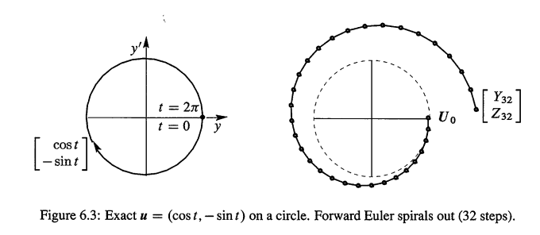

> `sp-Note3-4`: 用Matlab看一下把Eq(12)把：
>
> ```matlab
> # 步长
> t = 2*pi/32;
> # 初始化
> Y= [1];
> Z= [0];
> # 用循环计算
> for i=1:32
>  Y(i+1) = Y(i) + t* Z(i);
>  Z(i+1) = Z(i) - t* Y(i);
> end
> # 画出来
> plot(Y,Z);
> ```
>
> 图像如下
>
> 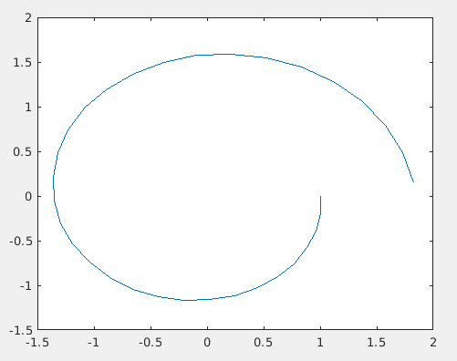

而Eq(11)的backword方式,参见Fig6.4,行为是相反的,注意它们之间的区别:
$$
\text{backword:}
\quad \begin{array} { l } Y _ { n + 1 } = Y _ { n } + \Delta t Z _ { n + 1 } \\ Z _ { n + 1 } = Z _ { n } - \Delta t Y _ { n + 1 } \end{array} \text { 是 } \left[ \begin{array} { c c } 1 & - \Delta t \\ \Delta t & 1 \end{array} \right] \left[ \begin{array} { c } Y _ { n + 1 } \\ Z _ { n + 1 } \end{array} \right] = \left[ \begin{array} { c } Y _ { n } \\ Z _ { n } \end{array} \right] = U _ { n }
\tag{13}
$$

> `sp-Note3-5`:类似Forward的方式,Eq(13)可以回到Eq(11):
> $$
> Y _ { n + 1 } - Y _ { n} = Y _ { n } - Y _ { n - 1 } - (\Delta t)^2 Y _ { n + 1 } 
> \tag{S4}
> $$
> 这和Eq(11)的backword方式吻合。注意，Eq(13)有意思的地方在于，写成是 $U_n = MU_{n+1}$ 的方式,并发现了 $M=A^T$,而不是 $U_{n+1} = AU_n$ 的方式
>
> ---
>
> 现在分析一下,如何构造出 Eq(S3,S4).前面部分都是 $Y _ { n + 1 } - Y _ { n} = Y _ { n } - Y _ { n - 1 }$,这就是应用 Eq(M1,M2) ,没问题.其实就是最右边部分,分别是 $ - (\Delta t)^2$ 乘以
>
> - Forward: $Y _ { n + 1 }$
> - backward: $Y _ { n -1 }$
> - center的应该是: $Y_n$
>
> 书上没有提中心差分的方式,所以这里推导一下,中心差分Eq(11)的形式应该是
> $$
> Y _ { n + 1 } - Y _ { n} = Y _ { n } - Y _ { n - 1 } - (\Delta t)^2 Y _ { n  } 
> \tag{S4}
> $$
> 其中,$-(\Delta t)^2 Y _ { n  }$,应该是 $\Delta t$ 乘以 $ -\Delta t (Z _ { n+1}- Z_n)$ 所得到,所以 $Z_{n+1}  - Z_n = Y_n$,所以Center的差分方式是:
> $$
> \begin{array} { l } Y _ { n + 1 } = Y _ { n } + \Delta t Z _ { n + 1 } \\ Z _ { n + 1 } = Z _ { n } - \Delta t
> 
> \color{orange}   Y _ { n } \end{array} 
> 
> \Rightarrow 
> U _ { n + 1 } = \left[ \begin{array} { c c } 1 & \Delta t \\ 1 & - \Delta t  \end{array} \right] \left[ \begin{array} { c } Y _ { n } \\ Z _ { n } \end{array} \right] = A U _ { n }
> 
> \tag{S4-1}
> $$
> 额，不对啊，橙色的 $Y_n$ 不是 $Y_{n+1}$ ，不能化为 $AU_n$,其实就是习题28：
> $$
> \begin{array} { l } Y _ { n + 1 } = Y _ { n } + \Delta t Z _ { n } \\ Z _ { n + 1 } = Z _ { n } - \Delta t Y _ { n + 1 } \end{array} \quad 
> 
> \left[ \begin{array} { c c } 1 & 0 \\ \Delta t & 1 \end{array} \right] \left[ \begin{array} { c } Y _ { n + 1 } \\ Z _ { n + 1 } \end{array} \right] = \left[ \begin{array} { c c } 1 & \Delta t \\ 0 & 1 \end{array} \right] \left[ \begin{array} { c } Y _ { n } \\ Z _ { n } \end{array} \right] \tag{S5}
> $$
> 这才是对的！理解一下区别。不能直接写成 $U_{n+1} = AU_n$ 形式，但参见 Eq(S5),可用2个矩阵！这时：
> $$
> \left[ \begin{array} { c } Y _ { n + 1 } \\ Z _ { n + 1 } \end{array} \right] = 
> \left[ \begin{array} { c c } 1 & 0 \\ \Delta t & 1 \end{array} \right] ^{-1} \left[ \begin{array} { c c } 1 & \Delta t \\ 0 & 1 \end{array} \right] \left[ \begin{array} { c } Y _ { n } \\ Z _ { n } \end{array} \right] \tag{S6}
> $$
> 这样看来，Eq(S4-1)其实也可以：
> $$
> \left[ \begin{array} { c c } 1 & -\Delta t \\ 0 & 1 \end{array} \right] \left[ \begin{array} { c } Y _ { n + 1 } \\ Z _ { n + 1 } \end{array} \right] = 
> \left[ \begin{array} { c c } 1 & 0 \\ -\Delta t & 1 \end{array} \right] \left[ \begin{array} { c } Y _ { n } \\ Z _ { n } \end{array} \right]
> \tag{S4-2}
> $$
> 这时 `Eq(S6,S4-2)` 的A矩阵虽然不同：
> $$
> S6:\left[\begin{matrix} 1 & \Delta t \\ -\Delta t & 1-(\Delta t)^2 \end{matrix} \right]
> \quad
> S4-2:  \left[\begin{matrix} 1-(\Delta t)^2 & t \\ -\Delta t & 1 \end{matrix} \right]
> $$
> 但是det都为1！详细参见习题28！

现在矩阵是 $A^T$,也就是Forward方式的转置,所以还是 $\lambda = 1\pm i$.但现在是 $A^T$ 乘以 $U_{n+1}$ 得到 $U_{n}$,所以我们必须乘以 $A^T$ 的逆从 $U_{n+1}$ 得到 $U_n$.因为 $A^T$ 的 $|\lambda| > 1$,所以它的逆 $|\lambda| <1$,这就解释了为何backword查分方式的螺旋递进到0

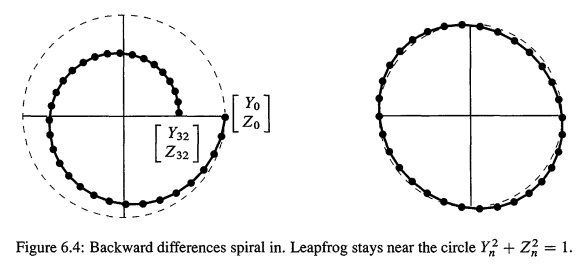

在Fig6.4右边的是centered方式的32步骤示意图.这个方式下,如果 $\Delta < 2$,它就能和圆保持接近.(习题28).这是**蛙跳法(leapfrog method)**.二阶差分(second differences) $ Y_{n+1}  - 2  _{n} +  Y_{n-1}$ 在中心值 $ Y_{n+1}$ 之间来回跳跃.

这种方法是化学家获取分子运动轨迹的方法(分子运动的涉及到大量的运算).计算科学是很形象的,因为一个微分方程可以被替换为很多差分方程--一些步稳定,一些稳定,一些中性的(neutral).习题30有第4种方法(好方法)来保持轨迹在圆之上.

**注意:** 在现实中,工程学和物理学处理的是一整个系统(而不是在一个点的单一质量).未知数 y 是1个向量,`y''`的系数是一个质量矩阵 M ,而不是数字m.y的系数是一个刚性矩阵 K 而不是数字k. `y'` 的系数是阻尼矩阵,可能为0.等式 `My'' + Ky = f` 计算力学(computational mechanics)的一个重要部分,它由在 $Kx = \lambda Mx$ 的特征值 $M^{-1}K$ 所控制.


## 2-2 矩阵的稳定性

对于 $d\vec{u}/dt = A\vec{u}$ 的解，有一个中心问题:当 $t \rightarrow \infty$,是否 $\vec{u} \rightarrow \vec{0}$，而不管初值是多少? 例1，例2(不稳定)的解都包含了 $e^t$ 。稳定性涉及到A的特征值

$\vec{u}(t)$ 的完全解是从纯解 $e^{\lambda t}x$ 构建而来的。如果特征值 $\lambda$ 是实数，我们就能确切的知道什么时候 $e^{\lambda t}$ 趋于0：$\lambda$ 必须是负数。如果 $\lambda$ 是复数 $\lambda = r + is$,那么 r 必须是负数，当 $e^{\lambda t}$ 分解为 $e^{r t}e^{is t}$,因子 $e^{ist}$ 的绝对值就是固定的1，因为：
$$
e ^ { i s t } = \cos s t + i \sin s t \quad \text { 有 } \quad \left| e ^ { i s t } \right| ^ { 2 } = \cos ^ { 2 } s t + \sin ^ { 2 } s t = 1
$$

> sp:复数的绝对值参见 `<calculus/A1-01 #3>`，也就是 $|z|=|x+ iy| = \sqrt{x^2 + y^2}$

如 $e^{(-3 + 6i)t}$. 这里的 `i` 管事不？绝对值 $|e^{-3 + 6it}| = e^{-3t}$,因为 $|e^{6it}| = 1$ (因为这其实就是cos(6t) +isin6(t))。复数其实只会在单位圆上转悠,只有实数部分是重要的.我们得出的结论是,如果 $\lambda$ 是复数，管事的只有实数部分，实部会导致结果趋于0或者无穷,虚数部分不过是一些小杂音(noise).所以。若果任何的 $\lambda$ 的实部>0.我们的解就无法收敛。所以，**是由因子 $e^{rt}$ 控制增长: r>0不稳定，r<0稳定**

那么现在关键问题是：**哪些矩阵有负数的特征值**？更准确的说，哪些矩阵的特征值 $\lambda$ 的实部是负数？2-2矩阵有一个确定的答案：

> **Stability**
>
> ---
>
> 如果A的所有特征值的实部都是负数，那么A是稳定的，并且 $\vec{u}(t) \rightarrow 0$.当A是2-2的 $A = \left[\begin{matrix} a & b \\ c & d \end{matrix} \right]$，满足下面2个条件，A就是稳定的
>
> - $\lambda_1 + \lambda_2 < 0$:也就是迹 $T = a+b$ 必须是负数
> - $\lambda_1\lambda_2 > 0$：也就是行列式 $ D=ad- bc $ 必须是正数

**解释：** 如果 $\lambda's$  是实数并且是负的，那么它们的和是负数，也就是迹是负数；而它们的积(行列式)是正值的。反过来也是正确的。如果 $D = \lambda_1 \lambda_2$ 是正值的，那么 $\lambda_1,\lambda_2$ 是相同正负号的。这时如果 $T = \lambda_1+ \lambda_2$ 是负数，那么 $\lambda_1,\lambda_2$ 必须都是负数。所以我们可以测试迹和行列式判断

如果 $\lambda's$ 是负数，那么它们的形式肯定是 $r+is,r-is$.不然的话T，D就不是实数。行列式D肯定是正数，因为 $(r+is)(r-is) = r^2 +s^2$.而迹 $T = r+is + r-is = 2r$,所以负数的迹表示实部r是负数的，所以矩阵是稳定的，QED

现在，对与2-2矩阵，我们求一下特征多项式：
$$
\left|\begin{matrix} a-\lambda & b \\ c & d-\lambda \end{matrix} \right| = \lambda^2 - T\lambda+D
$$
求解 $\lambda$，会引出 $\sqrt{T^2 - 4D}$ . Fig6.5展示了抛物线 $T^2 - 4D$ 划分了特征值的实数和复数的界限： 在抛物线之下，也就是 $\sqrt{T^2 - 4D}<0$, $\lambda$ 是复数；在抛物线之上，$\lambda$ 是实数。思考一下，稳定区域就是下图左上角阴影部分，也就是T负数，D正值的地方(因为y轴左边表示 $\lambda's<0$,在阴影区域而且抛物线之下，都是复数的负值 $\lambda$ ；在抛物线之上，是实数的负值 $\lambda$；在原点，$\lambda_1 = \lambda_2,T^2 =4D$)

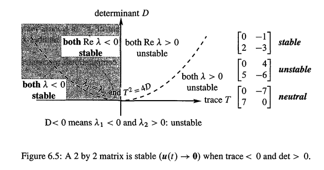


## 矩阵指数

> The exponential of a matrix

在 `<#3.1>`,`u(t)` 的解是 $e^{\lambda t}$ 的线性组合。现在，我们想把解 $u(t)$ 写成是 $e^{At}u(0)$ 的新形式，这样的话，就和 `<#2>` 的 $A^ku(0)$ 非常相似了！但首先我们需要定义 $e^{At}$ 是什么，我们使用当x是数字时 $e^x$  的定义：根据无穷级数 $e^x$ 的定义是 $1+x+ \frac{1}{2}x^2+\frac{1}{6}x^3...$,当把任何**方阵 **At 代入 x，这个级数就定义了矩阵指数 $e^{At}$:

---

回到原来的微分方程组 `du/dt=Au `,矩阵A表明 $u_1,u_2$ 耦合,A的非对角元素等不等于0.关键是怎么解耦.所谓解耦,就是对角化.如何得到对角阵呢?设 `u = Sv`, 带入原方程:
$$
S\frac{dv}{dt}=ASv
$$
注意,S是一个类似常数的东西,因为特征向量已知.接着两边乘以S逆
$$
\frac { \mathrm { d } v } { d t } = S ^ { - 1 } A S v = \Lambda \mathrm { v }
$$
关键就在于,**以特征向量为基,将u表示为Sv.得到关于v的对角化方程组** .这样,新的方程组不存在耦合,变成
$$
\frac{dv_1}{dt}=λ_1v_1 \\
	\frac{dv_2}{dt}=λ_2v_2 \\
	\vdots
$$
这n个方程,是一组方程,关键是他们不再有联系了,所以解起来简单，可得: $v_1= e^{λ_1 t}…v_n= e^{λ_n t}$, 根据 `u= Sv`，`u(0) = Sv(0)` ，S是特征向量矩阵，所以 v(0) 就是特征向量组合的系数 $c_1...c_n$！那么

$$
v(t) =  ​​\left[\begin{matrix}v_1\\\vdots\\v_n\\ \end{matrix} \right] v(0) = ​​\left[\begin{matrix}e^{λ_1 t}\\ \vdots \\ e^{λ_n t} \\ \end{matrix} \right]v(0) = 
 e^{\Lambda t} v(0)
$$

> $e^{Λt}$ 是什么？Λ是对角阵,对角线元素是特征值,以对角阵为指数,完全没有耦合,也就实现了所谓的对角化,那么
> $$
> e ^ { \wedge t } = \left[ \begin{array} { c c c } e ^ { \lambda _ { 1 } t } & 0 & 0 \\ 0 & \ldots & 0 \\ 0 & 0 & e ^ { \lambda _ { n } t } \end{array} \right]
> $$
> 如果把 $e^x$ 级数带入 $e^{Λt}$ 对角阵,对角线的每一项元素都是一个普通的泰勒级数.

而 $u = Sv$, 并且 $u(0) = Sv(0) \Rightarrow v(0) = S^{-1} u(0)$,所以
$$
u(t) = Sv(t) = S e^{Λt}v(0) = Se^{\Lambda t} S^{−1}u(0)= e^{At}  u(0)
$$
$e^{Λt},e^{At}$  是一个指数函数!参见 Eq(14).现在，如何证明 $e^{At}=Se^{Λt} S^{−1}$?参见Eq(15)

> 对于数字变量的x，存在两个个漂亮的泰勒级数
> $$
> \begin{aligned}
> e ^ { x } &= \sum _ { 0 } ^ { \infty } \frac { x ^ { n } } { n ! } \qquad (H1)\\
> \frac { 1 } { 1 - x } &= \sum _ { 0 } ^ { \infty } x ^ { n } \qquad (H2) \color{orange} \text{几何级数,最简单的幂级数}
> \end{aligned}
> $$
> 矩阵也可以得到类似Eq(H1,H2)的公式，Eq(H1)的就是Eq(14),Eq(H2)的如下：
> $$
> (I −At)^{−1}=I+At+ (At)^2…   \quad |λ(At)|<1 \tag{H3}
> $$
>
> 实际上这是求逆矩阵的好办法,假如t很小,那么t的幂就更小了,就可以去掉右边展开的若干项, 逆矩阵近似于I+At。
>
> 我要说的是,这些公式对矩阵同样适用,就像是普通的函数一样,而且Eq(14)的指数级数有特殊的优点,为什么?因为它总是收敛的,分母增长级别很高,所以级数总会收敛于某值,$e^{At}$ 总有定义,无论 `A` 和 `t` 多大.而Eq(H2)的级数则不然,如果 `At` 足够大,比如A的特征值大于1,那么 $A^2$ 使得特征值平方,$A^3$ 使得特征值3次方,结果将不收敛,除非A的特征值小于1.于是得到A的约束条件特征值小于1.所以Eq(H3)右边有限制条件.

接下来问题是,Eq(15)的转换总是成立的吗?我们知道 $e^{At}$ 级数恒成立,但是这个转换不是,**前提是 `A`可以对角化**,因为有部分矩阵,不存在n个线性无关的特征向量,因此 $S^{−1}$ 不存在,无法对角化,尽管可以三角化.

---

**矩阵指数 $e^{At}$**:
$$
e ^ { A t } = I + A t + \frac { 1 } { 2 } ( A t ) ^ { 2 } + \frac { 1 } { 6 } ( A t ) ^ { 3 } + \cdots + \sum _ { n = 0 } ^ { \infty } \frac { （At） ^ { n } } { n ! }  \tag{14}
$$
**对t求导得到 $Ae^{At}$**：
$$
\frac{d}{dt}e^{At} = A + A^2 t + \frac{1}{2}A^3t^2  +... = Ae^{At}
$$
**它的特征值是 $e^{\lambda t}$：** 注意，$e^{At}$ 是一个矩阵，代入 $[e^{At}]x = e^{\lambda t} x$ 即可得知：($\lambda$ 是A的特征值)：
$$
e^{At}x = ( I + A t + \frac { 1 } { 2 } ( A t ) ^ { 2 }+...)x = (1 + \lambda t + \frac{1}{2}(\lambda t)^2 + ... ) x  = e^{\lambda t} x
$$
右边括号部分的 $1 + \lambda t + \frac{1}{2}(\lambda t)^2 + ... $ 就是 $e^{\lambda t}$ 的无穷级数展开，QED。

---

注意Eq(14)的分母是 $n!$ 增长的非常快，所以Eq(14)这个级总数收敛的,而且导数是 $Ae^{At}$,因此，$e^{At}u(0)$ **总能快速求解微分方程--就算没有足够的特征向量！**

例4将会使用 Eq(14)这个级数，看到计算缺少一个特征向量，也是可以正常工作的，但首先让我们看看在良好情况下(可对角化)下怎么得到 $Se^{\Lambda t}S^{-1}$。

本节的学习重点是如何通过对角化，求得 $u(t) = e^{At}u(0)$.**假设A有n个独立的特征向量**，可对角化，把 $A = S\Lambda A^{-1}$ 代入到 $e^{At}$ 的级数，化简时用 $S\Lambda S^{-1}S\Lambda S^{-1} = S\Lambda^2S^{-1}$  :


$$
\begin{aligned}
	e^{At} &= I + S\Lambda S^{-1}t + \frac{1}{2} (S\Lambda S^{-1}t)(S\Lambda S^{-1} t) + ... 
	& \quad \color{orange} \text{(14)代入} A= S\Lambda S^{-1}\\
	
	&= S [I + \Lambda t + \frac{1}{2}(\Lambda t)^2 + ...] S^{-1}
	& \quad \color{orange} \text{提取} S,S^{-1}
	\\
	
	&=  Se^{\Lambda t}S^{-1} & \quad \color{orange} \text{对角化}e^{At}
\end{aligned}

\tag{15}
$$
Eq(15)表明：$e^{At} = S e^{\Lambda t} S^{-1}$ ,而且因为 $\Lambda$ 是一个对角矩阵，所以 $e^{\Lambda t}$ 也是：对角线上的元素就是 $e^{\lambda_i  t}$,把 $ S e^{\Lambda t} S^{-1}$ 乘以 u(0) ,来确认得到 u(t):
$$
e ^ { A t } u ( 0 ) = S e ^ { \Lambda t } S ^ { - 1 } u ( 0 ) = \left[ \begin{array} { l l l } x _ { 1 } & \cdots & x _ { n } \end{array} \right] \left[ \begin{array} { l l l } e ^ { \lambda _ { 1 } t } & & \\ & \ddots & \\ & & e ^ { \lambda _ { n } t } \end{array} \right] \left[ \begin{array} { c } c _ { 1 } \\ \vdots \\ c _ { n } \end{array} \right]  \tag{16}
$$

> sp:$c = S^{-1} u_o$ 参见 `<#2.2>`，Eq(16)解释了为何 $e^{At}u(0)$ 求解了 $du/dt = Au$!

解 $e^{At}u(0)$ 和 `<#1>` 的3步骤得到的 Eq(6) 是一致的：

1. 把 u(0) 表达成特征向量组合：$u(0) = c_1x_1 + ...+c_nx_n$，这里需要n个独立的特征向量

2. 把每一个 $x_i$ 乘以 $e^{\lambda_i t}$,这表示随着时间变化

3. $e^{At}u(0)$ 的最佳形式是：
   $$
   u ( t ) = c _ { 1 } e ^ { \lambda _ { 1 } t } x _ { 1 } + \cdots + c _ { n } e ^ { \lambda _ { n } t } x _ { n }  \tag{17}
   $$

---

**例4. ** 当你把 $y = e^{\lambda t}$ 代入 $y''-2y' + y = 0$,会得到重根的方程：$\lambda^2 - 2\lambda + 1 = (\lambda -1)^2 = 0$.在微分方程的课程，可能会告诉你使用 $e^t，te^t$ 作为2个独立的解，现在我们学习为什么要这样

线性代数把 $y''-2y'+y = 0$ 化简为一个向量方程 $\vec{u} = (y,y')$:
$$
\frac { d } { d t } \left[ \begin{array} { l } y \\ y ^ { \prime } \end{array} \right] = \left[ \begin{array} { c } y ^ { \prime } \\ 2 y ^ { \prime } - y \end{array} \right] 
\quad \text { 也就是 } \quad 
\frac { d u } { d t } = A u = \left[ \begin{array} { r r } 0 & 1 \\ - 1 & 2 \end{array} \right] u \tag{18}
$$
A的特征值还是 $\lambda =1,1$ ,迹=2，行列式= 1。唯一的特征向量就是 x = (1,1) 的数乘，也就是A只有一条线的特征向量，**不可能对角化**。所以我们把 $e^{At}$ 写成级数定义：
$$
e ^ { A t } = e ^ { I t } e ^ { ( A - I ) t } = e ^ { t } [ I + ( A - I ) t ] \tag{19}
$$

> sp:上式化简没有问题！首先是： $e^{At} = e^{(I +A-I)t}= e^{It}e^{(A-I)t}$,然后 $e^{(A-I) t}$ 根据级数展开
> $$
> e^{(A-I) t} = I + (A-I)t + \frac{1}{2}((A-I)t)^2+...
> $$
> 注意，因为 $(A-I)^2$ 是0矩阵！所以只有级数展开后只有`I,(A-I)t` 这2项！从而得到Eq(19)!在 Eq(19) 可以看见 $te^t$ 这一项了！

$u(t) = e^{At}u(0)$ 的第1个分量就是我们的y(t)：
$$
\begin{aligned}
	u  ( t ) = e ^ { t } \left[ I + \left[ \begin{array} { l l } - 1 & 1 \\ - 1 & 1 \end{array} \right] t \right] u ( 0 )  &= e^t\left[\begin{matrix} -t+1 & t \\ - & - \end{matrix} \right] \left[\begin{matrix} y(0)  \\y'(0)  \\\end{matrix} \right]
\\
&\Rightarrow  y ( t ) = e ^ { t } y ( 0 ) - t e ^ { t } y ( 0 ) + t e ^ { t } y ^ { \prime } ( 0 )
\end{aligned}
$$

---

**微分方程求解总结**

最后,我们如何处理一个二阶微分方程 `y'' + by' + ky = 0`? 令 `u` 为向量,看看如何把一个二阶微分方程化为2个一阶方程组.想一想斐波那契数列的例子,令 $u = \left[\begin{matrix} y'  \\y  \\\end{matrix} \right]$.然后增加一个方程 `y'  = y'`,把向量 `u` 当做是方程的未知量,原方程化为u的一阶微分方程:
$$
\mathrm { u } ^ { \prime } = \left[ \begin{array} { l } y ^ { \prime \prime } \\ y ^ { \prime } \end{array} \right] = \mathrm { Au } = \left[ \begin{array} { l } a & b \\ c & d \end{array} \right] \left[ \begin{array} { l } y ^ { \prime } \\ y \end{array} \right]
$$
怎么求矩阵A呢? `y'' = -by'-ky`,所以第一行是 `-b,-k`.而根据 `y' =y`;第二行就是`1,0`,所以
$$
\mathrm { u } ^ { \prime } = \left[ \begin{array} { c c } - b & - k \\ 1 & 0 \end{array} \right] \left[ \begin{array} { l } y ^ { \prime } \\ y \end{array} \right]
$$
一般而言,对于一个5阶微分方程,可以得到一个5-5矩阵,原方程的系数出现在矩阵的第一行,其他行各含有1表示其余方程,这个矩阵使得原来的5阶微分方程转换为1阶向量方程(fifth order to five by five first order),然后矩阵的特征值会自然的出现,联系微分方程和差分方程。太强大了!!


---

**例5.** 对 $A = \left[\begin{matrix} 0 & 1 \\ -1 & 0 \end{matrix} \right]$,使用无穷级数求 $e^{At}$,注意 $A^4 = I$：
$$
A = \left[ \begin{array} { l l } & 1 \\ - 1 \end{array} \right] \quad A ^ { 2 } = \left[ \begin{array} { l l } - 1 & \\ & - 1 \end{array} \right] 
\quad 
A^3 = \left[ \begin{array} { l l } & -1 \\ 1 \end{array} \right] 
\quad A ^ { 4 } = \left[ \begin{array} { l l } 1 & \\ & 1 \end{array} \right]
$$
$A^5,A^6,A^7,A^8$ 会重复上述4个矩阵。这时，需要观察这些矩阵幂序列的元素

- 左上角：0，-1，0，1....
- 右上角：1，0，-1，0...

根据Eq(14)，我们先列出左右上角的元素的无穷级数：

- **$e^{At}$ 左上角元素**： $1 -\frac{1}{2}t^2 + \frac{1}{24}t^4.... = \cos t$
- **$e^{At}$ 右上角元素**： $t -\frac{1}{6}t^3 + \frac{1}{120}t^5....= \sin t$

根据这个规律，可以得到整个 $e^{At} $ 是：
$$
e^{At}= I + A t + \frac { 1 } { 2 } ( A t ) ^ { 2 } + \frac { 1 } { 6 } ( A t ) ^ { 3 } + \cdots = \left[ \begin{array} { c c } 1 - \frac { 1 } { 2 } t ^ { 2 } + \cdots & t - \frac { 1 } { 6 } t ^ { 3 } + \cdots \\ - t + \frac { 1 } { 6 } t ^ { 3 } - \cdots & 1 - \frac { 1 } { 2 } t ^ { 2 } + \cdots \end{array} \right]
= 
\left[\begin{matrix} \cos t & \sin t  \\ -\sin t & \cos t \end{matrix} \right]
\tag{20}
$$
A是反对称的($A^T = -A)$,它的指数 $e^{At}$ 是**正交(orthogonal)矩阵**(sp:参见`<01-05>`,列垂直，并且长度为1！)A的特征值是 $\pm i$,$e^{At}$ 的特征值是 $e^{it},e^{-it}$.

---

关于 $e^{At}$ 3个规则：

1. $e^{At}$ **总是有逆 $e^{-At}$**
2. **$e^{At}$ 的特征值总是 $e^{\lambda t}$**
3. **当A是反对称的，$e^{At}$ 就是正交矩阵：$\text{Inverse = transpose} =  e^{-At}$!**

反对称矩阵的特征值是纯虚数: $\lambda = i \theta$,所以 $e^{At}$ 的特征值是 $e^{i\theta t}$,它们的绝对值是1(中性稳定性，纯振荡，能量保守 (neutral stability, pure oscillation, energy is conserved))

---

最后一个例子是三角矩阵 A,此时特征向量矩阵S是三角的，$S^{-1},e^{At}$ 也是。你会看到2个形式的解：特征向量的组合，和简洁形式的 $e^{At} u(0)$

**例6.** 从$t = 0,u(0) = \left[\begin{matrix} 2  \\1  \\\end{matrix} \right]$ 求解 $\frac { d u } { d t } = A u = \left[ \begin{array} { l l } 1 & 1 \\ 0 & 2 \end{array} \right]u$

解： 特征值就是A对角线的1，2（因为A三角）.特征向量是 (1,0),(1,1)，初始的 $u(0)$ 是 $u(0) = x_1 + x_2,c_1= c_2 = 1$.那么 u(t) 就是纯指数 $e^t,e^{2t}$ 的**同一个组合**：
$$
\text{Solution to }u' = Au:\qquad u ( t ) = e ^ { t } \left[ \begin{array} { l } 1 \\ 0 \end{array} \right] + e ^ { 2 t } \left[ \begin{array} { l } 1 \\ 1 \end{array} \right]
$$
这是最清晰的求解过程，但使用矩阵形式的解法，对每个不同的 u(0)，都可以快速计算出 u(t):
$$
u ( t ) = S e ^ { \Lambda t } S ^ { - 1 } u ( 0 ) \text { 是}\quad
\left[ \begin{array} { l l } 1 & 1 \\ 0 & 1 \end{array} \right] \left[ \begin{array} { l l } e ^ { t } & \\ & e ^ { 2 t } \end{array} \right] \left[ \begin{array} { r r } 1 & - 1 \\ 0 & 1 \end{array} \right] u ( 0 ) = \left[ \begin{array} { c c } e ^ { t } & e ^ { 2 t } + e ^ { t } \\ 0 & e ^ { 2 t } \end{array} \right] u ( 0 )
$$
**等式最右边的矩阵就是 $e^{At}$**! 非常完美。情况和 Ax = b 的逆是一样的！我们不是真正的需要 $A^{-1}$ 来求得x,也不真的需要 $e^{At}$ 来求 du/dt = Au.但作为得到答案的一个快速公式，$x =A^{-1}b$ 和 $u(t) = e^{At} u(0)$ 都是无懈可击的！


### 收敛

再看看 $e^{At}=Se^{Λt} S^{−1}$,什么情况下收敛于0? `t` 会一直增长,S和S逆不变,收敛于0意味着,$e^{Λt}$ 的全部对角线元素都收敛于0,也就是说,**所有的特征值的实部都是负数,对角线上的指数就收敛于0!**

我们在**复平面**(水平轴是实轴，垂直轴是虚轴)上画一下,怎样的特征值使得微分方程存在稳定的解呢?答案：当特征值位于左半平面,也就是特征值的实部<0的时候 ：

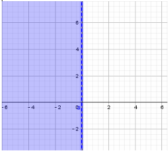

再思考，怎样的特征值使得矩阵的幂收敛于0?  答案：特征值的绝对值<1,也就是在单位元内

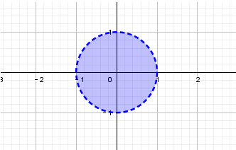


## 总结

1. `u'= Au` 是常系数线性发那个城，从 `u(0)` 开始，它的解是一些列指数的组合，包含每一个 $\lambda$ 和 `x`:
   $$
   \boldsymbol { u } ( t ) = c _ { 1 } e ^ { \lambda _ { 1 } t } \boldsymbol { x } _ { 1 } + \cdots + c _ { n } e ^ { \lambda _ { n } t } \boldsymbol { x } _ { n }
   $$
   系数 $c_1...c_n$ 由初始向量 $u(0) = c_1x_1 +... + c_nx_n$ 确定

2. 如果每1个 $\lambda$ 都是负数的实部，那么 `u(t)` 是趋于0（稳定）

3. 其实 u(t) 的解就是 $u(t) = e^{At} u(0)$.矩阵指数是快速求解的方法

4. 关于 `y''` 的方程可以化为向量方程，这个向量方程同时求解 $u = \left[\begin{matrix} y  \\y'  \\\end{matrix} \right]$


## 典型例题

**1.** 分别使用微分方程的替换 $e^{\lambda t}$ 和线代的方法，求解 $y''+4y'+3y = 0$

解：把 $e^{\lambda t}$ 替换进去，得到 $(\lambda^2 + 4\lambda +3)e^{\lambda t} = 0$,得到 $\lambda_1=-1,\lambda_2 = -3$,因此纯指数解是 $y_1 = e^{- t},y_2 = e^{-3t}$,完整解 $c_1y_1 + c_2y_2$ 趋近0.

为了使用线代方法，设 $u = \left[\begin{matrix} y  \\y'  \\\end{matrix} \right]$,向量方程是 `u' = Au`:
$$
\begin{array} { l } d y / d t = y ^ { \prime } \\ d y ^ { \prime } / d t = - 3 y - 4 y ^ { \prime } \end{array} \quad \Rightarrow \quad \quad \frac { d u } { d t } = \left[ \begin{array} { r r } 0 & 1 \\ - 3 & - 4 \end{array} \right] u .
$$
A称为伴随矩阵(cmopaion matrix),特征值就是-1，-3：
$$
\operatorname { det } ( A - \lambda I ) = \left| \begin{array} { c c } - \lambda & 1 \\ - 3 & - 4 - \lambda \end{array} \right| = \lambda ^ { 2 } + 4 \lambda + 3 = 0 \quad \text{同样的二次方程}
$$
A的特征值是 $(1,\lambda_1),(1,\lambda_2)$.2种方式求解的一样，都是 $e^{-t},e^{-3t}$,是衰减的。

**注意：** 在线代，危险来自特征值，如果 $\lambda_1= \lambda_2$,那么不能对角A，这时我们没有可以对角化 `du/dt=Au` 的2个独立的解。在微分方程，危险也来自重复的 $\lambda$,得到1个 $e^{\lambda t}$ 之后，我们还需要虚招第2个独立的解，它就是 $y = te^{\lambda t}$,这个不纯粹的指数解会出现在矩阵指数 $e^{A t}$中，如例4

---

**2.** 对如下的方程，把 $u(0) = (0,2\sqrt{2},0)$  写成是 A 的特征向量的组合，并求解2个方程 $u'=Au,u''=Au'$
$$
\frac { d u } { d t } = \left[ \begin{array} { r r r } - 2 & 1 & 0 \\ 1 & - 2 & 1 \\ 0 & 1 & - 2 \end{array} \right] u \quad \text { , } \quad \frac { d ^ { 2 } u } { d t ^ { 2 } } = \left[ \begin{array} { r r r } - 2 & 1 & 0 \\ 1 & - 2 & 1 \\ 0 & 1 & - 2 \end{array} \right] \boldsymbol { u } \quad \text { with }\quad \frac { d u } { d t } ( 0 ) = \vec{0}
$$

> $\frac { d u } { d t } ( 0 ) = \vec{0}$ 是啥意思？

注意A是1个二阶差分矩阵(类似2阶导数）

解： 首先求特征向量和特征值
$$
\operatorname { det } ( A - \lambda I ) = \left| \begin{array} { c c c } - 2 - \lambda & 1 & 0 \\ 1 & - 2 - \lambda & 1 \\ 0 & 1 & - 2 - \lambda \end{array} \right| = ( - 2 - \lambda ) \left[ ( - 2 - \lambda ) ^ { 2 } - 2 \right] = 0
$$
从而得到
$$
\lambda = - 2 \quad ( A + 2 I ) x = \left[ \begin{array} { l l l } 0 & 1 & 0 \\ 1 & 0 & 1 \\ 0 & 1 & 0 \end{array} \right] \left[ \begin{array} { l } x \\ y \\ z \end{array} \right] = \left[ \begin{array} { l } 0 \\ 0 \\ 0 \end{array} \right] \quad \text { for } x _ { 1 } = \left[ \begin{array} { r } 1 \\ 0 \\ - 1 \end{array} \right]  \\

\lambda = - 2 - \sqrt { 2 } \quad ( A - \lambda I ) x = \left[ \begin{array} { c c c } \sqrt { 2 } & 1 & 0 \\ 1 & \sqrt { 2 } & 1 \\ 0 & 1 & \sqrt { 2 } \end{array} \right] \left[ \begin{array} { l } x \\ y \\ z \end{array} \right] = \left[ \begin{array} { l } 0 \\ 0 \\ 0 \end{array} \right] \text { for } x _ { 2 } = \left[ \begin{array} { c } 1 \\ - \sqrt { 2 } \\ 1 \end{array} \right]\\

\lambda = - 2 + \sqrt { 2 } \quad ( A - \lambda I ) x = \left[ \begin{array} { c c c } - \sqrt { 2 } & 1 & 0 \\ 1 & - \sqrt { 2 } & 1 \\ 0 & 1 & - \sqrt { 2 } \end{array} \right] \left[ \begin{array} { l } x \\ y \\ z \end{array} \right] = \left[ \begin{array} { l } 0 \\ 0 \\ 0 \end{array} \right] \text { for } x _ { 3 } = \left[ \begin{array} { c } 1 \\ \sqrt { 2 } \\ 1 \end{array} \right]
$$
特征向量是正交的(对阵矩阵，参见 `<#4>`).3个 $\lambda$ 都是负数，所以A是负定矩阵，$e^{A t}$ 衰减到0(稳定).

初始的 $u(0) = x_3- x_2$,所以解是 $u(t) = e^{\lambda_3 t}x_3 - e^{\lambda_2 t}x_2$

> 这一题看不懂啊：P323...这个二阶方程是怎么解的？

---

**3.** 从 `u(O) = (a(0), b(O), c(O), z(O))` 开始，求解4个方程 $da/dt = 0,db/dt = a,dc/dt = 2b,dz/dt = 3c$.然后再使用矩阵指数 $u(0) = e^{A t}$ 求解这些方程：
$$
\begin{array} { l } \text { Four equations } \\ \lambda = 0,0,0,0 \\ \text { Eigenvalues on } \\ \text { the diagonal } \end{array} \quad
\frac { d } { d t } \left[ \begin{array} { l } a \\ b \\ c \\ z \end{array} \right] = \left[ \begin{array} { l l l l } 0 & 0 & 0 & 0 \\ 1  & 0 & 0 & 0 \\ 0 & 2 & 0 & 0 \\ 0 & 0 & 3 & 0 \end{array} \right] \left[ \begin{array} { l } a \\ b \\ c \\ z \end{array} \right] \quad \text { 是 } \quad \frac { d u } { d t } = A u
$$
首先求 $A,A^2.A^3...$ 然后求 $e^{A t} = I+At+ \frac{1}{2}(At)^2 +\frac{1}{6}(At)^3...$ 这个级数什么时候停止？为何 $(e^A)(e^A) = e^{2A}$ 总是成立？总有 $e^{As} * e^{As} = e^{A(s+t)}$.

解：

**解法1**：  对 $da/dt = 0,db/dt = a,dc/dt = 2b,dz/dt = 3c$ 分别积分，得到
$$
\begin{array} { l } a ( t ) = a ( 0 ) \\ b ( t ) = t a ( 0 ) + \quad b ( 0 ) \\ c ( t ) = t ^ { 2 } a ( 0 ) + 2 t b ( 0 ) + c ( 0 ) \\ z ( t ) = t ^ { 3 } a ( 0 ) + 3 t ^ { 2 } b ( 0 ) + 3 t c ( 0 ) + z ( 0 ) \end{array}
$$
> sp:怎么积分出来的，有点懵啊

注意，如上的4-4矩阵，是乘以 `a(0), b(O), c(O), z(O)` 从而产生 `a(t), b(t), c(t), z(t)`,肯定和解法2的 $e^{At}$ 相同

**解法2：** A(三角的)的幂在 $A^4$ 开始全是0：
$$
A = \left[ \begin{array} { l l l l } 0 & 0 & 0 & 0 \\ 1 & 0 & 0 & 0 \\ 0 & 2 & 0 & 0 \\ 0 & 0 & 3 & 0 \end{array} \right] \quad A ^ { 2 } = \left[ \begin{array} { l l l l } 0 & 0 & 0 & 0 \\ 0 & 0 & 0 & 0 \\ 2 & 0 & 0 & 0 \\ 0 & 6 & 0 & 0 \end{array} \right] \quad A ^ { 3 } = \left[ \begin{array} { l l l l } 0 & 0 & 0 & 0 \\ 0 & 0 & 0 & 0 \\ 0 & 0 & 0 & 0 \\ 6 & 0 & 0 & 0 \end{array} \right] \quad A ^ { 4 } = 0
$$
对角线每次向下移动1格，所以 $e^{At}$ 的级数有4项：
$$
\text{same }e^{A t}:\quad  e ^ { A t } = I + A t + \frac { ( A t ) ^ { 2 } } { 2 } + \frac { ( A t ) ^ { 3 } } { 6 } = \left[ \begin{array} { r r r } 1 & & \\ t & 1 & & \\ t ^ { 2 } & 2 t & 1 & \\ t ^ { 3 } & 3 t ^ { 2 } & 3 t & 1 \end{array} \right]
$$
$(e^A)(e^A) = e^{2A}$ 有很多原因

1. 级数平方： $( I+At+ \frac{1}{2}(A)^2...)^2 = I+2A+\frac{(2A)^2}{2}+... = e^{2A}$
2. 如果A可以对角化(本例的A不行！），那么 $\left( S e ^ { \Lambda } S ^ { - 1 } \right) \left( S e ^ { \Lambda } S ^ { - 1 } \right) = S e ^ { 2 \Lambda } S ^ { - 1 }$

但注意，在习题23可得 $e^Ae^B \ne e^Be^A \ne e^{A+B}$ !


# 4. 对称矩阵

> 综合视频26

对于投影向量到 $R^3$ 的一个平面，设投影矩阵是P。对于已经在平面的向量 x, 有 `Px = x`（sp:已经在平面的向量，再次投影一次，还是在平面）。所以，`x's `都是P的特征向量。其他特征向量和这个平面垂直：`Px = 0`. P的3个特征值是 $\lambda=1,1,0$ ，3个特征向量可**被选择**为垂直的。之所以说被选择为，是因为平面上的2个特征向量不一定是自动垂直的。这一节，我们会对对称矩阵做出最好的选择： **$P = P^T$ 的特征向量都是垂直的单位向量。**

> V26:**对称矩阵特征向量单位正交**： 首先对于单位矩阵,是成立的.然后,如果特征值互不相同,那么每个特征值的特征向量在一条线上,那些线是垂直的.如果特征值重复,那就有一整个平面的特征向量,在那个平面上,可以选择垂直的向量.但是典型情况是特征值不同,都为实数,特征向量空间是1维的,而且垂直

> sp:
>
> 1. 为何Px = x 的特征向量有2个
>    组成平面需要2个独立的向量，所以平面可产生2个独立的特征向量，只是不一定垂直而已
> 2. 为何 Px = x 的特征向量和 Px = 0 的特征向量垂直？
>    Px = x，x在P的列空间；
>    Px = 0，x在P的零空间，参见`<01-04 #2 总结>`，因为P的对称矩阵，所以 $P^Tx=0$所以x也在P的左零空间
>    列空间和左零空间的向量垂直，QED

可以毫不夸张的说，对称矩阵是最重要的矩阵，不管是应用还是理论！那么我们需要思考一下，**当 A 是对称的， $Ax = \lambda x$ 有什么特别的地方？** 也就是说寻找 $\lambda$ 和特征向量 x 的特殊性质。

如果A是对称的，那么对角化 $A = S\Lambda S^{-1}$ 会反映A的对称性。首先转置看一下：$A^T = (S^{-1})^T\Lambda S^T = A = S\Lambda S^{-1}$,注意 $\Lambda$ 是对角矩阵。所以，是不是 $S^{-1} = S^T$?如果是，那么 $S^TS = I$!这意味着 S 当中的每一个特征向量都是正交的!关键性质参见末尾 `<#Lk1>` 总结，这里是2点：

1. 一个对称矩阵只有**实数特征值**
2. 特征向量可以**被选择**称为**标准正交(orthonormal)**

n个标准正交的特征向量成为 `S` 的列，**任何一个对称矩阵都可以对角化**，它的特征向量矩阵S变成正交矩阵Q.正交矩阵性质是 $Q^{−1}= Q^T$ --上面关于 $S^{-1} = S^T$  的疑问得到确定解答了.为了强调S是正交的,我们把S写成Q.

为何上面的第2点那里写成:可以被选择为呢.因为特征向量不一定需要是单位向量，长度是可以根据我们的需要调整。我们会选择让单位向量,这样就变成了标准正交而不仅仅是正交.这时候,$SΛ S^{−1}$ 变成 $QΛ Q^T$

> **Spectral Theorem**
>
> ---
>
> **任何对称矩阵**都有分解 $A = Q\Lambda Q^T$,其中 $\Lambda$ 是元素都是**实数**特征值的对角矩阵，$S$ 是的列是**单位正交**的正交矩阵 Q
> $$
> \text{Symmetric diagonalization:} \quad
> 
> A = Q\Lambda Q^{-1}  = Q\Lambda Q^T \quad \quad \color{orange} Q^{-1} = Q^T
> $$

很容易看出来 $QΛ Q^T$ 是对称的,取转置即可.困难的部分在于证明：所有的特征值都是实数和所有的x都是标准正交。这个定理在数学被称为谱定理(spectral theorem),而在几何学和物理学,被称为是主轴定理(principal axis theorem).我们要证明它!别无选择!我会通过3步来证明:

1. 通过一个例子,展示所有的λ是实数,所有的x都是标准正交的(例1)
2. 证明当没有重复特征值的时候,是正确的
3. 证明允许存在重复特征值的时候,也是正确的!

---

**例1.** $A = \left[\begin{matrix} 1 & 2 \\ 2 & 4 \end{matrix} \right] $ ,求λ和x

解: $A - λI= \left[\begin{matrix} 1-\lambda & 2 \\ 2 & 2-\lambda \end{matrix} \right]$,行列式是 $λ^2  −5λ$.特征值是0,5,都是实数.其实可以立刻看出来,首先因为A奇异,所以0是一个特征值,另外根据迹,我们可以得到 $λ_1+λ_2=5$,所以 $λ_2=5$

特征向量是 `(2,-1),(1,2)`,是正交的,但还不是标准正交的.λ=0的特征向量是在A的零空间的!而λ=5的特征向量是在A的列空间的!自问一下：为何列空间和零空间垂直?线代基础定理说,零空间和行空间垂直,不是列空间!但是我们的矩阵是对称的!行空间,列空间相等,所以这2个特征向量肯定垂直!

> sp:这就是 `<01-04 #2>` 自己的总结

这2个特征向量的长度是 $\sqrt{5}$, 除以这些长度,我们可以得到单位向量,然后把它们放进S的列当中,得到Q,可得:$Λ= Q^{−1}AQ$,其中,$Q^{−1}= Q^T$
$$
Q ^ { - 1 } A Q = \frac { 1 } { \sqrt { 5 } } \left[ \begin{array} { r r } 2 & - 1 \\ 1 & 2 \end{array} \right] \left[ \begin{array} { l l } 1 & 2 \\ 2 & 4 \end{array} \right] \frac { 1 } { \sqrt { 5 } } \left[ \begin{array} { r r } 2 & 1 \\ - 1 & 2 \end{array} \right] = \left[ \begin{array} { l l } 0 & 0 \\ 0 & 5 \end{array} \right] = \Lambda
$$

---

现在我们看看n-n的情况

> **定理:所有==实数==对称矩阵的特征值都是实数**
>
> **证明:** `Ax = λx`.我们需要考虑,λ有可能是复数 `a + ib` (a,b是实数).它的共轭复数是 $\bar{λ}=a−ib$.同样的,x的分量可能是复数,把x的分量的虚数部分变换正负号,可以得到共轭复数 $\bar{x}$.好消息是,$\bar{λ}∗\bar{x}$ 也是 $λ∗x$ 的共轭
>
> > 设 $\lambda = a+ib,x= m+in$，计算即可知：
> > $$
> > \lambda x = (am-bn)+i(bm+an),\bar{\lambda}\bar{x} = (am-bn)-i(bm+an)
> > $$
>
> 所以可以取 $Ax = λx$ 的共轭,记住A是实数的:
> $$
> A x = \lambda x \quad \text { 取共轭，得到： }
> \quad A \bar { x } = \bar { \lambda } \bar { x }  \quad 
> \text { 转置得到：}\quad 
> \bar { x } ^ { \mathrm { T } } A = \bar { x } ^ { \mathrm { T } } \bar { \lambda }  \tag{1}
> $$
> 现在,把 `Eq(1)` 最开始的 $Ax = \lambda x$ 和 $\bar{x}$ 做点乘,最后面的和 $x$ 做点乘,得到
> $$
> \bar { x } ^ { \mathrm { T } } A x = \bar { x } ^ { \mathrm { T } } \lambda x \quad \text { 和 } \quad \bar { x } ^ { \mathrm { T } } A x = \bar { x } ^ { \mathrm { T } } \bar { \lambda } x \tag{2}
> $$
> 2个等式左边是一样的,那么右边是相等的.其中一个有 $\bar{\lambda}$, 另外一个是 $\lambda$ .它们都乘以 $\bar{x}^T x =|x_1 |^2+ |x_2|^2+…$ = 长度的平方 $\ne 0$.
>
> > x是特征向量，一定不为0.就算x是复数向量：
> > $$
> > \bar{x}^Tx = [\bar{x}_1...\bar{x}_n] ​​\left[\begin{matrix}x_1\\\vdots\\x_n\\ \end{matrix} \right]
> > $$
> > 因为是共轭复数，如 $\bar{x}_1^T x= (a-ib)(a+ib) = a^2+b^2$,虚部没了，结果还是长度平方
>
> 因此 $\lambda$ 必须等于 $\bar{\lambda}$,也就是 `a + ib = a-ib`.所以b必须是0.QED。
>
> > V26:  上面的证明,有一步因为是实矩阵,$\bar{A}=A$,也就是`Eq(1)`.也就是必须有 $\bar{A}^T=A$ 成立,才可以让整个证明流程走下去.对于复矩阵来说,需要的性质不仅仅是对称了,还有关于共轭 $\bar{A}^T=A$.. 其实如果是实矩阵,那么就是把横杠擦掉而已.
>
> ---
>
> 特征向量是从 $(A-λI)x=0$ 计算而来的,所以**x也是实数的**.重要的事实是,它们是垂直的
>
> **定理:正交的特征向量:==实数==对称矩阵特征向量(当它们都是来自不同的λ值的时候)是垂直的**
>
> **证明:** 假设 $Ax = λ_1 x,Ay = λ_2 y,λ_1 \ne λ_2$.把第一个等式和y做点乘,第二个等式和x做点乘,得到
> $$
> \left( \lambda _ { 1 } x \right) ^ { \mathrm { T } } y = ( A x ) ^ { \mathrm { T } } y = x ^ { \mathrm { T } } A ^ { \mathrm { T } } y = x ^ { \mathrm { T } } A y = x ^ { \mathrm { T } } \lambda _ { 2 } y \tag{3}
> $$
> 等式左边是 $x^T λ_1 y$,右边是 $x^T λ_2 y$,因为 $λ_1 \ne λ_2$,所以 $x^T y=0$,所以 $λ_1$ 对应的特征向量 `x` 垂直 $λ_2$ 对应的特征向量y.


---

**例2.** 2-2对称矩阵的特征向量有特殊形式:
$$
A = \left[ \begin{array} { l l } a & b \\ b & c \end{array} \right] 
\text { 有： } \quad x _ { 1 } = \left[ \begin{array} { c } b \\ \lambda _ { 1 } - a \end{array} \right] 
\text { ; } x _ { 2 } = \left[ \begin{array} { c } \lambda _ { 2 } - c \\ b \end{array} \right] \tag{4}
$$
在习题里面有证明。关键在于 $x_1,x_2$ 垂直的
$$
\boldsymbol { x } _ { 1 } ^ { \mathrm { T } } \boldsymbol { x } _ { 2 } = b \left( \lambda _ { 2 } - c \right) + \left( \lambda _ { 1 } - a \right) b = b \left( \lambda _ { 1 } + \lambda _ { 2 } - a - c \right) = 0
$$
上式成立是因为， $λ_1  + λ_2$ 等于迹 `a+c`,因此 $x_1^T x_2=0$.如果有一双敏锐的眼睛,你可能会发现,当 $x_1= x_2=0$，有 `a=c,b=0` .这时候有重复的特征值,如 `A = I` .但是它还是有垂直的特征向量 `(1,0),(0,1)`

> sp:上面这句话 $x_1 =x_2 = 0$，后面又说特征向量 `(1,0);(0,1)`. 居然神奇的不矛盾，如 $A = \left[\begin{matrix} 3 & 0 \\ 0 & 3 \end{matrix} \right]$,此时 $\lambda_1 = \lambda_2 = 3$.那么 $A- \lambda I = \left[\begin{matrix} 0 & 0 \\ 0 & 0 \end{matrix} \right]$.任何向量都是特征向量！

---

这个例子展示的是这一节的主要目标:**把对称矩阵A对角化为正交特征向量矩阵S = Q**.再看一遍结果:
$$
A = S \Lambda S ^ { - 1 } \quad \text { 变成 } \quad A = Q \Lambda Q ^ { \mathrm { T } } \quad \text { 其中 } \quad Q ^ { \mathrm { T } } Q = I
$$
这就意味着,任何2-2的对称矩阵有如下形式:
$$
A = Q \Lambda Q ^ { \mathrm { T } } = \left[ \begin{array} { l l } x _ { 1 } & x _ { 2 } \end{array} \right] \left[ \begin{array} { l l } \lambda _ { 1 } & \\ & \lambda _ { 2 } \end{array} \right] \left[ \begin{array} { l } x _ { 1 } ^ { \mathrm { T } } \\ x _ { 2 } ^ { \mathrm { T } } \end{array} \right] \tag{5}
$$
**列 $x_1,x_2$ 乘以行 $λ_1 x_1^T,λ_2x_2^T$ 来得到A:**
$$
A = \lambda _ { 1 } x _ { 1 } x _ { 1 } ^ { \mathrm { T } } + \lambda _ { 2 } x _ { 2 } x _ { 2 } ^ { \mathrm { T } } \tag{6}  \quad \color{orange} \text{Sum of rank-one matrix!}
$$
**这就是伟大的分解 $QΛQ^T$,写成 `λ′s` 和 `x's` 的形式**.当矩阵是n-n的时候,Q的 n 列乘以 $Q^T$ 的n行.**n个乘积 $x_ix_i^T$ 是投影矩阵**!

> sp:参见 `<01-04 #2.1>` 一条线的投影矩阵是 $P = \frac{aa^T}{a^Ta}$,而 $x_ix_i^T$ 中的 $x_i$ 已经是单位向量了！所以 $x_ix_i^T$ 就是投影矩阵！

把 `λ′s` 加入进来之后,对称矩阵的谱定理 $A = QΛQ^T$,说的是：任何对称矩阵A都是**互相垂直的投影矩阵的组合**:
$$
A = \lambda _ { 1 } P _ { 1 } + \cdots + \lambda _ { n } P _ { n }

\qquad \color{orange} \lambda_i=\text{eigenvalue},P_i = \text{projection on the eigenspace}
$$


## 实数矩阵的复数特征值 

> Complex Eigenvalues of Real Matrix

从 `Eq(1)`,我们从 $Ax = λx$ 发展到 $A\bar{x} = \bar{λ} \bar{x}$.最后证明 `x,λ` 都是实数.但是非对称矩阵可能轻易的产生复数的 `λ` 和 `x` ，这时 $A\bar{x} = \bar{λ} \bar{x}$ 是和 $Ax = λx$ 是不一样的.这时候,我们得到的一个新的特征值 $\bar{λ}$,和特征向量: $\bar{x}$：

> 对于实数矩阵，复数的 $\lambda's$  和 $x's$ 以共轭对的形式出现:
> $$
> \text{如果 } Ax = \lambda x \quad \text{那么 } A\bar{x} = \bar{\lambda}\bar{x}
> $$

---

**例3.** $A=\left[\begin{matrix} \cos \theta & -\sin \theta \\ \sin\theta & \cos \theta \end{matrix} \right] $ 有 $λ_1  = \cos θ + i \sin θ,λ_2=\cos θ⁡− i \sin θ$.这些特征值互为共轭复数.它们就是 $\lambda,\bar{\lambda}$.而且特征向量必须是 $x= (1,-i),\bar{x}= (1,i)$,因为A是实数矩阵
$$
\begin{array} { l l } 

\lambda x: & A x = \left[ \begin{array} { c c } \cos \theta & - \sin \theta \\ \sin \theta & \cos \theta \end{array} \right] \left[ \begin{array} { r } 1 \\ - i \end{array} \right] = ( \cos \theta + i \sin \theta ) \left[ \begin{array} { r } 1 \\ - i \end{array} \right] \\ 

\bar { \lambda } \bar { x }: & A \bar { x } = \left[ \begin{array} { c c } \cos \theta & - \sin \theta \\ \sin \theta & \cos \theta \end{array} \right] \left[ \begin{array} { l } 1 \\ i \end{array} \right] = ( \cos \theta - i \sin \theta ) \left[ \begin{array} { l } 1 \\ i \end{array} \right] \end{array}

\tag{7}
$$
对于这个旋转矩阵,$|λ|= 1$,因为 $\cos^2 θ+\sin^2 θ = 1$.注意,**$|λ|= 1$,对于所有的正交矩阵(orthogonal matrix)来说,都是成立的**

---

要知道,就算实矩阵,也不可避免的会出现复数。在 `<01-10>` 讲解复数λ,复向量x和复矩阵A,那里你可以学到整个完整的知识. 现在讨论2个可选的知识


## 特征值对比主元

> Eigenvalues versus Pivots

A的特征值和主元是非常不一样的.对于特征值,我们是通过 `det(A - λI)=0 `求解的，而主元是通过消去得来的，到目前为止，它们唯一的联系就是：**主元乘积=行列式=特征值乘积**

我们假设存在完整的主元 $d_1…d_n$.有n个实特征值 $λ_1...λ_n$. `d's` 和 `λ's `是不一样的,但它们来自于同一个矩阵.一个隐藏的关系就是:**对于对称矩阵,主元和特征值之间有相同的正负号:**

> 如果 $A = A^T$,也就是**对称矩阵**，那么正值主元的个数  等于 正值特征值的个数。特别情况：当且仅当A有n个正值的主元，A的所有 $\lambda_i > 0$.(`<#5>` 节的正定矩阵就是基于这个重要的事实的)
>
> ---
>
> v26:为什么这很重要呢?因为对于微分方程来讲,这意味着状态是否稳定!而且，这也是辅助计算特征值的好办法。二十三十年之前没有人知道,怎么计算一个50阶或者100阶的矩阵的特征值,好像自然科学就卡在这里了.当然,可以用Matlab计算A-λI的的行列式,这是一个50次的多项式(50th degree),然后找到根.Matlab会去做,但是它也会抱怨,因为这是一个很糟糕的计算特征值的方法.很抱歉告诉你这个事实,虽然就是我教的方法，这只适用于小型矩阵.有一个计算特征值的新的方法,是数值线性代数(numerical linear algebra)的知识.但是,非常重要事实是,Matlab会很乐意找出50个主元,庆幸的是,如果有一个实矩阵,可以算出50个主元,可能28个主元为正,22个为负,那么,特征值也是28个为正,22为负!这样，知道了多少特征值是正数,多少个特征值是负数,这时候你可以将矩阵平移7倍的单位矩阵,这样特征值就平移了7,然后你计算平移过后的矩阵的主元,你就会知道原矩阵的特征值有多少大于7,多少小于7.  
>
> 而且主元和特征值之间还有一个联系.如果没有行交换,那么主元的乘积就是特征值的乘积,都是等于行列式的.

---

**例4.** 对称矩阵 $A = \left[ \begin{array} { l l } 1 & 3 \\ 3 & 1 \end{array} \right]$ 有一个正主元和一个正特征值.都是一正一负.但是当矩阵不是对称的时候,不一定是正确的。如 $B = \left[ \begin{array} { l l } 1 & 6 \\ -1 & -4 \end{array} \right]$ ,主元是1，2；特征值是 -1，-2。

注意,对角线元素是另外一批元素,我们没有对它们做出任何的特别声明。

---


### 证明

**证明:** 当 $A = A^T$ 的时候,主元和特征值的符号一样

以例4的矩阵为例。当主元被从U的行分离出来的时候,可以更加清楚的看到.这时候 $A = LDL^T$.`D` 对角矩阵，对角线都是主元,并且在三角矩阵 $L,L^T$ 中间
$$
\left[ \begin{array} { l l } 1 & 3 \\ 3 & 1 \end{array} \right] = \left[ \begin{array} { l l } 1 & 0 \\ 3 & 1 \end{array} \right] \left[ \begin{array} { l l } 1 & \\ & - 8 \end{array} \right] \left[ \begin{array} { l l } 1 & 3 \\ 0 & 1 \end{array} \right]  \quad \color{orange} A= LDL^T\text{ symmetric}
$$
**注意观察,当 $L,L^T$ 逐渐变为单位矩阵的时候:A变成D**

$LDL^T$ 的特征值是`4,-2`. $IDI^T$ 的特征值是`1,-8`(主元!),当L的3变为0的时候,特征值在改变,但是为了改变正负号,一个实特征值需要跨越过0,这一瞬间矩阵是奇异的(特征值为0，矩阵奇异).但是正在改变的矩阵，主元**一直都是**-1和8,永远不奇异.所以当 `λ′s` 向 `d's` 移动的时候,永远不会改变正负号！

对于任何的 $A = LDL^T$,再次重申一下证明： 当把 `L` 向 `I` 改变,也就是把 `L` 主对角线下面的元素逐渐变为0,**主元不改变也不为0**.而 $LDL^T$ 的特征值 `λ` 改变为 $IDI^T$  的特征值 `d`.因为这些特征值不能在逐渐变为主元的过程中跨越0,所以它们的的正负号不会改变.**这就联系了应用线代的2部分：主元和特征值**


## 所有的对称矩阵都是可对角化的

> All symmetric Matrices are diagonalizable

当A的特征值都不重复的时候,特征向量肯定是独立的.A可被对角化.但重复的特征值有可能造成特征向量的短缺.这通常发生在非对称矩阵,永远不可能发生在对称矩阵.**当 $A = A^T$ 的时候,总有足够的特征向量来对角化A!**

要证明之前，我们首先要看看一个新的分解，这个分解不管矩阵是否对称都可用,而且当A确实是对称矩阵的时候，可以立刻产生 $A = Q\Lambda Q^T$,其中Q的**完整的，实数的，标准正交的**特征向量

> **舒尔定理(Schur's Theorem)**
>
> ---
>
> 任何 **方阵** 都可以分解为 $A = QTQ^{-1}$ ，其中 T 是上三角矩阵，而且 $\overline{Q}^T = Q^{-1}$.如果A有实数的特征值(sp：对称矩阵就是实数特征值！)，那么Q 和 T 都可以被选择为实数的,从而：$Q^TQ = I$。

> sp:以下证明也没看懂啊，归纳法是哪里应用了？https://math.stackexchange.com/questions/1919088/schur-decomposition-to-show-matrix-has-n-orthonormal-eigenvectors

我们要得到的就是 `AQ = QT`， Q的第1列 $q_1$ 必须是A的一个单位特征向量，那么 `AQ` 和 `QT` 的第一列分别是 $Aq_1,t_{11}q_1$.但当T只是三角（不是对角）的时候，Q的其他列不需要是特征向量

> sp:舒尔定理说的是 `T` 是三角的，所以QT的第1列是 $t_{11}q_1$, 第2列是 $t_{12}q_1 + t_{22}q_2$.我们也好证明的是它是对角的！

所以，其它的 `n-1` 列可以随意选择，只要和 $q_1$ 能够组成**标准正交的列**。这时 Q 写成 $Q_1$.
$$
\overline { Q } _ { 1 } ^ { \mathrm { T } } A Q _ { 1 } = \left[ \begin{array} { c } \overline { q } _ { 1 } ^ { \mathrm { T } } \\ \vdots \\ \overline { q } _ { n } ^ { \mathrm { T } } \end{array} \right] 

\left[ \begin{array} { c c c } A q _ { 1 } & \cdots & A \boldsymbol { q } _ { n } \end{array} \right] = 

\left[ \begin{array} { l l } t _ { 11 } & \cdots \\ 0 & A _ { 2 } \\ 0 \\ \vdots & \end{array} \right] =T\tag{8}
$$
下面证明步骤使用归纳法证明。假设对 `Eq(8)` 的大小为 n-1 的 $A_2$ 矩阵，舒尔分解 $A_2 = Q_2T_2Q_2^{-1}$ 是存在的。把正交矩阵 $Q_2$ 和三角的 $T_2$  放进最终的Q,T里面：
$$
Q = Q _ { 1 } \left[ \begin{array} { c c } 1 & 0 \\ 0 & Q _ { 2 } \end{array} \right] \text { and } T = \left[ \begin{array} { c c } t _ { 11 } & \cdots \\ 0 & T _ { 2 } \end{array} \right] \text { 从而 } A Q = Q T
$$
**注意：** 必须允许 $q_1,Q_1$ 可以是复数，因为A可能有复数特征值。但如果 $t_{11}$ 是1个实数特征值，那么 $q_1,Q_1$ 可保持实数。这个归纳法，只要A有实数特征值，就可以保持其他都是实数。

现在，证明：**当A是对称的，T就是对角的 $\Lambda$,从而有 $A = Q\Lambda Q^T$**:

任何对称矩阵都有实数特征值。根据舒尔分解: $A = QTQ^T,Q^TQ = I$,那么 $T = Q^TAQ$,这是1个对称矩阵！关键：如果T是三角的而且对称，那么T必须是对角的： $T = \Lambda$.

这就完成了 $A = Q\Lambda Q^T$ 的证明，矩阵 $A = A^T$ 有n个单位正交的特征向量！


## 总结

1. 任何一个对称矩阵都有**实数特征值**和**垂直特征向量**，从而对称矩阵的对角化变成 $A = QΛQ^T$ (sp:应该要是实数对称矩阵，因为证明的都是实数对称矩阵)
 2. 所有对称矩阵都是可对角化的,**就算有重复的特征值**
 3. 当A对称,主元和特征值的正负号对应
 4. 任何一个**方阵**都可以被 $A = QTQ^{−1}$  "三角化(triangularized)"


## 典例

**1.** 如果矩阵A的特征值是 $\lambda = 1,-1$,特征向量是 $x_1= (\cos \theta,\sin\theta),x_2= (-\sin \theta,\cos\theta)$,如下的性质，在不知道A具体是什么的时候，可以提前推断出来？
$$
A = A ^ { \mathrm { T } } \quad A ^ { 2 } = I \quad \operatorname { det } A = - 1 \quad \text { 1正1负的特征值 } \quad A ^ { - 1 } = A
$$
解：所有的性质都可以提前推出！因为 **$\Lambda$ 中的特征值是实数而且特征向量单位正交，所以矩阵 $A = Q\Lambda Q^T$ 必须是对称矩阵。** 特征值 `1,-1` 告诉我们 $A^2=I$ (因为 $\lambda^2 = I$)

> `sp-ques1`:书上说因为 $\lambda^2 = I$，但 $A=\left[\begin{matrix} 1 & 1 \\ 0 & 1 \end{matrix} \right],A^2 \ne I$  ,而特征值都是1啊！

和 $A^{-1} = A$（和 $A^2 = I$ 是同一件事），$det A = -1$ (特征值乘积)。因为2个特征值一正一负，所以主元也是1正1负

这个矩阵肯定是个反射矩阵，$x_1$ 方向的向量不会被A改变方向($\lambda = 1$),另一个垂直方向的 $x_2$ 会被调转方向($\lambda = -1$）矩阵 $A = Q\Lambda Q^T$ 是根据 $\theta-line$ 反射：
$$
A = \left[ \begin{array} { r r } c - s \\ s & c \end{array} \right] \left[ \begin{array} { r r } 1 & 0 \\ 0 & - 1 \end{array} \right] \left[ \begin{array} { r r } c & s \\ - s & c \end{array} \right] = \left[ \begin{array} { c r } c ^ { 2 } - s ^ { 2 } & 2 c s \\ 2 c s & s ^ { 2 } - c ^ { 2 } \end{array} \right] = \left[ \begin{array} { c } \cos 2 \theta & \sin 2 \theta \\ \sin 2 \theta & - \cos 2 \theta \end{array} \right]
$$
注意，对于 $x=(1,0),Ax = (\cos2\theta,\sin 2\theta)$,在 $2\theta$ 的显示；而对于 $x = (\cos 2 \theta,\sin 2\theta)$,Ax又越过 $\theta-line$ 回到 (1,0)

---

**2.** 求如下 $A_3，B_4$  的特征值，并且检查它们的前2个特征向量是正交的。画出这些特征向量，以便看见离散的sin和cos
$$
A _ { 3 } = \left[ \begin{array} { r r r } 2 & - 1 & 0 \\ - 1 & 2 & - 1 \\ 0 & - 1 & 2 \end{array} \right] \quad B _ { 4 } = \left[ \begin{array} { r r r r } 1 & - 1 & & \\ - 1 & 2 & - 1 & \\ & - 1 & 2 & - 1 \\ & & - 1 & 1 \end{array} \right]
$$
矩阵当中的 `-1,2,-1` 构成了二阶差分。`<01-08 #1>` 会解释为何这类似于二阶导数，也就是 $Ax = \lambda x$ 类似与 $d^x /dt^2 = \lambda x$.它的特征向量是 $x=\sin kt,x = \cos kt$,是傅里叶级数的最佳基！这个矩阵得到的离散sin和离散cos是离散傅里叶变换(Discrete fourier transform，DFT)的最佳基。DTF是信号处理的中心。而图像处理中JPEG的选择就是 $B_8$.

解：

> sp:这题没怎么看懂

 参见 `<#3 典型例题2>` $A_3$ 的特征值是 $\lambda = 2-\sqrt{2},2+\sqrt{2}$ ，和(迹)是6，积(行列式)是4.它的特征向量矩阵 S 给出了离散sine变换(Discrete sine transform) 而且如下图像展示了前2个特征向量是如何落在sine曲线上的。请自己动手画出第sine曲线上的第3条特征向量！

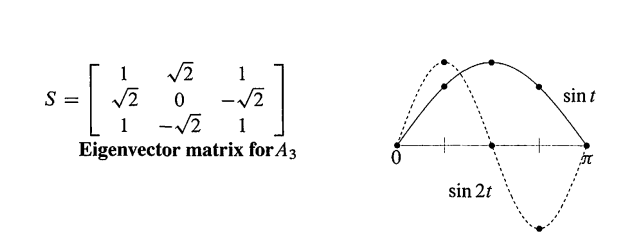

$B_4$ 的特征向量是 $\lambda = 2-\sqrt{2},2+\sqrt{2},0$,比 $A_3$ 只多了0.迹还是6，但行列式是0。它的特征向量矩阵 C 给出了4点 离散cos变换(4 point discrete cosine transform)，下图展示前2个特征向量是怎么落在cos曲线上的(请自己画出第3条曲线).这些特征向量在halfway points遇见cosine:$\frac { \pi } { 8 } , \frac { 3 \pi } { 8 } , \frac { 5 \pi } { 8 } , \frac { 7 \pi } { 8 }$.

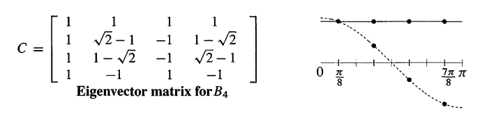

S，C的列都是正交的。当一个向量和S,C相乘，这个信号被分解为纯频率(pure frequencies).这就是信号处理当中吗，最有用最精辟的变换。如下是创建 $B_8$  和特征向量矩阵C的Matlab代码

```matlab
n=8; e =ones(n-1, 1); B=2* eye(n)-diag(e, -1)-diag(e, 1); B(1,1)=1; B(n, n)=1;
[C, Lambda] = eig(B);
plot(C( : ,1:4), '-o')
```


