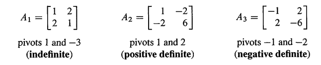
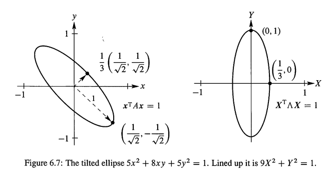
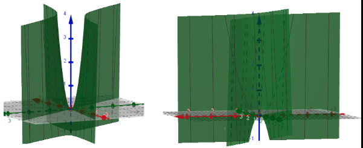
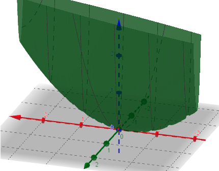
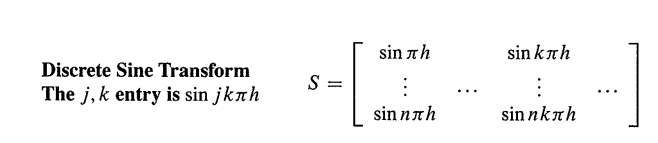
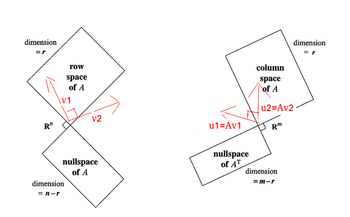
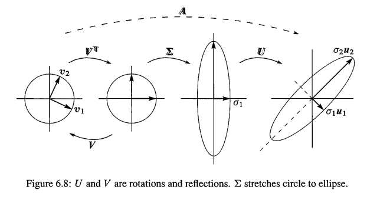
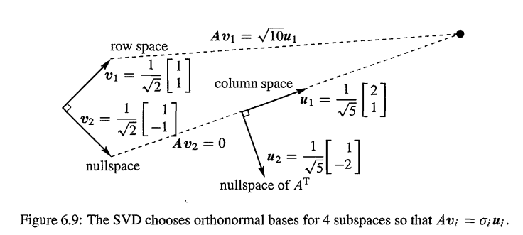
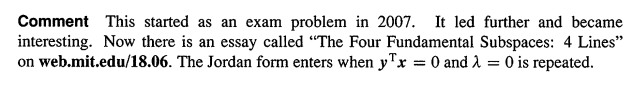

#  5. 正定矩阵

> - Positive Definite Matrices
> - 综合视频26，28，29

这一节我们的关注点是**特征值都是正的对称矩阵**.如果对称让矩阵变的重要,那么所有的 `λ>0` 这一额外的性质让矩阵变的真正特殊.注意我说特殊,而不是稀少.正特征值的对称矩阵在所有的应用当中都是处于中心位置,它们被称为正定矩阵

> v29:但是正定矩阵从何而来呢?补充一点,它来自最小二乘,实际上大量的物理问题需要用长方形矩阵描述,而最小二乘的关键就在于矩阵 $A^TA$,这就是一个正定矩阵,我们需要证明一下
>
> 首先问一个问题,假设A是正定的,意味着A是对称的(正定的性质),那么我们得到一个对称正定矩阵.那么它的逆也是对称正定的吗?对于逆矩阵的主元,我们所知不多,但是对于逆矩阵的特征值,我们知道,就是原矩阵特征值的倒数.因此只要原矩阵是正定的,那么立刻断定它的**逆矩阵也是正定的,因为逆矩阵的特征值都是正值.**
>
> 看看 $A^TA$ 为什么是正定的,假设A是m-n的长方形矩阵,不用是对称的,也不是方阵.那么 $A^TA$ 是对称的,而且是方阵.如何证明呢?特征值和主元都是比较难搞的,还是需要这个表达式,希望这个表达式恒为正:
> $$
> x^T(A^TA)x
> $$
> 如何证明恒为正呢?(或者说非负的),我们还得说明何时等于0,但是绝不是负数.关键在于一步,曾经反复出现在很多证明里面.在适当的地方添加括号
> $$
> x ^ { T } \left( A ^ { T } A \right) x = ( A x ) ^ { T } A x = | A x | ^ { 2 } \geq 0
> $$
> 只有是零向量的时候才能得到0,所以=0的情况也可以排除,怎样确保Ax不为0呢?也就是说,如何确保零空间的向量只有0向量?矩阵的秩,只要是满秩,那么零空间就只有零向量.如果A是11-5的,那么 `r=5` 即可.也就是说,矩阵A的各列线性无关,可以确保 $A^TA$ 是正定的!
>
> **如果 $A^TA$ 可逆,最小二乘方程存在最优解**,还有就是, $A^TA$ 为正定,为数值计算提供了便利,对于正定矩阵,你不需要进行行交换,也不必担心主元过小或者=0,他们是容易计算的矩阵.

第一个问题是怎么分别这些矩阵,你可能会说,找到所有的特征值然后测试 `λ>0`.但是这正是我们需要避免的方式!当确实需要 `λ` 的时候,我们需要计算,但只需要知道它是否为正的时候,不要大费周章的计算.下面是这1节的2个目标

1. 找到快速测试对称矩阵的特征值是否都是正的方法
2. 解释正定矩阵的重要应用

注意,当A是对称的时候,λ一定是实数.

---

从`2-2` 矩阵开始, $A =\left[\begin{matrix} a & b \\ b & c \end{matrix} \right]$,它的特征值 $λ_1,λ_2$ 什么条件下都是正值？

> **测试1**：当 $A = A^T$ (2-2为例子),**当且仅当 $a>0$ 并且 $ac-b^2>0$.** 特征值都是正值
>
> > 注意，这里的 $ac - b^2 >0 $ **就是** $\det A$，也就是行列式,只是A的元素变了而已

- $A_1  =\left[\begin{matrix} 1 & 2 \\ 2 & 1 \end{matrix} \right]$ 不是正定(indefinite),因为 $ac - b^2=1−4<0$ （det A等于 $\lambda_1\lambda_2$ = 负数，所以特征值必定一正一负）
- $A_2=\left[\begin{matrix} 1 & -2 \\ -2 & 6 \end{matrix} \right]$是正定,因为 $a = 1> 0,ac - b^2=6−4>0$
- $A_3=\left[\begin{matrix} -1 & 2 \\ 2 & -6 \end{matrix} \right]$ 不是正定(虽然 $\det A =+2$),因为 `a = -1`



注意,我们并没有计算 $A_1$ 的特征值 3 和 -1 .$A_1$ 的迹是正的:`3 -1 = 2`.行列式是负的:`3 * -1 = -3`.注意 $A_3=−A_2,A_3$ 是负定(negative definite),$A_2$ 都是正特征值,$A_3$ 的都是负特征值.

上述2-2情况下，测试全部通过了。思考一下为什么？首先，因为 $λ_1λ_2  = \det A = ac - b^2>0$.这就保证了 $\lambda_1,\lambda_2$ 同正或同负。其次，a> 0就表示 $\lambda_1,\lambda_2$ 都是正的。

2-2矩阵的这个测试方法，使用了1-1的行列式 `a` 和2-2的行列式 $ac - b^2$.当A是3-3的时候,$\det A >0$ 就是测试的第三部分.**也就是测试n个行列式都大于0！**

---

而下面的另一种测试方法,要求是正的主元:

> **测试2**：当 $A = A^T$,当且仅当主元都是正值:
> $$
> a > 0 \quad \text { and } \quad \frac { a c - b ^ { 2 } } { a } > 0
> $$

所以，$a>0,ac - b^2>0$ 在2种测试方法都要求.关键在于注意,上面的 $(ac - b^2)/a$ 是A的第二个主元:
$$
A =\left[\begin{matrix} a & b \\ b & c \end{matrix} \right] 
\quad \text{第1个主元=a,乘数}\ell = b/a ,消去 \Rightarrow \left[ \begin{array} { c c } a & b \\ 0 & c - \frac { b } { a } b \end{array} \right] \text{第2个主元：}  \frac{a c - b ^ { 2 } } { a }
$$
这就联系了线性代数的2个大知识点:**正的特征值意味着正的主元,反过来也是**!在最后一节,我们会给出任何对大小的对称矩阵的证明.重点是,主元让我们可以快速的测试 $λ>0$ ,而且比特征值容易计算多了.**主元,特征值和行列式**在这里一起出现了。


## 基于能量的定义

> Energy-based definition

下面是以另外一种角度来看正特征值的对称矩阵.

根据 `Ax = λx`,2边乘以 $x^T$,得到 $x^T Ax= λx^T x$.右边是正值的λ乘以一个正数 $x^T x = |x|^2$,所以 $x^T Ax$ **对于任何特征向量来说都是正值的.**

新的启示关键在于：**对于任何非0的x,而不仅仅是特征向量, $x^T Ax$ 都是正值的**.在很多系统当中,数 $x^T Ax$ (或者 $1/2 x^T Ax$)都是一个系统的能量.而正的能量的要求(requirment of positive energy)给出了正定矩阵的另外一个定义,我认为基于能量的定义是一个更基础的定义.

对于 $x^T Ax>0$ 的测试，特征值和主元是2种等价的方式。

> **Definition**
>
> ---
>
> 如果对于任何非0向量x，都有 $x^TAx > 0$， 那么A是正定矩阵
> $$
> x ^ { \mathrm { T } } A x = \left[ \begin{array} { l l } x & y \end{array} \right] \left[ \begin{array} { l l } a & b \\ b & c \end{array} \right] \left[ \begin{array} { l } x \\ y \end{array} \right] = a x ^ { 2 } + 2 b x y + c y ^ { 2 } > 0 
> \tag{1}
> $$

`a,b,b,c` 4个元素组成了 $x^T Ax$ 的四部分,`a,c` 组成的是平方项 $ax^2,cy^2$ ,非对角线的2个 `b` 组成的是 `bxy` 和 `byx` .这个基于能量的定义可以得到下面的基本的事实:

> **如果AB都是对称正定的，那么 A+B 也是对称正定的**
>
> ---
>
> **证明：**$x^T (A+B)x$ 其实就是 $x^T Ax+ x^T Bx$ .这2项都是正的(当 $x\ne 0$),所以A+B也是正定的.用  主元和特征值  来判断这种  矩阵相加的情况 是比较困难的,但是能量定义的方式确却是直观的

$x^T Ax$ 还连接了我们最后一种辨别正定矩阵的方法.从任何矩阵R开始(可能是矩形矩阵).我们知道 $A = R^T R$ 是方阵并且对称,更进一步,当R的**列是独立的时候**,A是正定的：

> **如果R的列是独立的，那么 $A= R^TR$ 是正定矩阵**

同样的,用特征值和主元很难证明.但是数字 $x^T Ax$ 和 $x^T R^T Rx$ 是一样的，这其实就是$(Rx)^T Rx$ --又一个通过括号完成的证明!向量Rx,在 $x\ne 0$ 的时候是非0(意味着独立的列).这时候 $x^T Ax$ 就是正数$|Rx|^2$,矩阵A是正定的

把这些理论结合起来,得到关于正定的5个等价的声明.你会看到这些关键概念是把线性代数的整个主题结合在一起的:主元,行列式,特征值,最小二乘( $R^TR$ ).然后我们会看到一些应用

> **当一个对称矩阵有下面其中1个性质，它就具有其中所有的性质**
>
> ---
>
> 1. 所有的 n 个主元都是正值
> 2. 左上角开始的 n 个行列式都是正值
> 3. n个特征值都是正值
> 4. 除非 $x = 0$,不然 $x^TAx$ 是正值，这是基于能量的定义
> 5. $A= R^TR$,其中R是具有独立列的矩阵

左上角行列式是左上角开始的：`1-1,2-2...n-n` 行列式,最后一个就是完整矩阵A的行列式.我们相信例子比一个详细的证明更有帮助(我们已经差不多有这个证明了!)

---

**例1.** 测试下面A,B的正定性
$$
A = \left[ \begin{array} { r r r } 2 & - 1 & 0 \\ - 1 & 2 & - 1 \\ 0 & - 1 & 2 \end{array} \right] \quad \text { ； } \quad B = \left[ \begin{array} { r r r } 2 & - 1 & b \\ - 1 & 2 & - 1 \\ b & - 1 & 2 \end{array} \right]
$$

解： A的主元是 `2,3/2,4/3` 都是正的,左上角行列式是 `2,3,4`,都是正的.特征值是 $2-\sqrt{2},2+\sqrt{2}$,都是正的.测试1,2,3通过.

我们可以把 $x^T Ax$ 写成3个平方的和,主元 `2,3/2,4/3` 出现在平方外面,而来自消去的乘数 `−1/2,−2/3` 出现在平方里面:
$$
\begin{aligned} 
x ^ { \mathrm { T } } A x & = 2 \left( x _ { 1 } ^ { 2 } - x _ { 1 } x _ { 2 } + x _ { 2 } ^ { 2 } - x _ { 2 } x _ { 3 } + x _ { 3 } ^ { 2 } \right) 

\\ 
& = 2 \left( x _ { 1 } - \frac { 1 } { 2 } x _ { 2 } \right) ^ { 2 } + \frac { 3 } { 2 } \left( x _ { 2 } - \frac { 2 } { 3 } x _ { 3 } \right) ^ { 2 } + \frac { 4 } { 3 } \left( x _ { 3 } \right) ^ { 2 }  \quad \color{orange} \text{和是正数}
\end{aligned}
$$

> `sp-note1`:为什么呢?A是对称矩阵,那么 $A = LDL^T$,则 $x^TAx= x^T LDL^T x=(L^T x)^TD(L^T x)$,这个式子展开就是平方项的和!注意，D是主元对角矩阵，所以是平方项的因子.详细分析一下：
> $$
> A = \left[ \begin{array} { r r r } 2 & - 1 & 0 \\ - 1 & 2 & - 1 \\ 0 & - 1 & 2 \end{array} \right] 
> =\left[ \begin{array} { c c c } 1 & 0 & 0 \\ -\frac { 1 } { 2 } & 1 & 0 \\ 0 & -\frac { 2 } { 3 } & 1 \end{array} \right] 
> \left[ \begin{array} { l l l } 2 & 1 & 0 \\ 0 & \frac { 3 } { 2 } & 1 \\ 0 & 0 & \frac { 4 } { 3 } \end{array} \right]
> \left[ \begin{array} { c c c } 1 & -\frac { 1 } { 2 } & 0 \\ 0 & 1 & -\frac { 2 } { 3 } \\ 0 & 0 & 1 \end{array} \right] = LDL^T
> $$
> 那么 $x^TAx=(L^T x)^TD(L^T x) = 2 \left( x _ { 1 } - \frac { 1 } { 2 } x _ { 2 } \right) ^ { 2 } + \frac { 3 } { 2 } \left( x _ { 2 } - \frac { 2 } { 3 } x _ { 3 } \right) ^ { 2 } + \frac { 4 } { 3 } \left( x _ { 3 } \right) ^ { 2 }$，QED

对于R有2个候选,任何一个都可以证明 $A =R^T R$ 是正定矩阵.R可以是矩形一阶差分矩阵(rectangular first difference matrix) ,4-3,来产生A当中的二阶差分 `-1,2,-1`
$$
\boldsymbol { A } = \boldsymbol { R } ^ { \mathrm { T } } \boldsymbol { R } :
\quad \left[ \begin{array} { r r r } 2 & - 1 & 0 \\ - 1 & 2 & - 1 \\ 0 & - 1 & 2 \end{array} \right] = \left[ \begin{array} { r r r r } 1 & - 1 & 0 & 0 \\ 0 & 1 & - 1 & 0 \\ 0 & 0 & 1 & - 1 \end{array} \right] \left[ \begin{array} { r r r } 1 & 0 & 0 \\ - 1 & 1 & 0 \\ 0 & - 1 & 1 \\ 0 & 0 & - 1 \end{array} \right]
$$
R的3列是独立的，A是正定的。另外一个R来自 $A=  LDL^T$ ,看:
$$
LDL^T =\left[ \begin{array} { c c c } 1 & 0 & 0 \\ -\frac { 1 } { 2 } & 1 & 0 \\ 0 & -\frac { 2 } { 3 } & 1 \end{array} \right] 
\left[ \begin{array} { l l l } 2 & 1 & 0 \\ 0 & \frac { 3 } { 2 } & 1 \\ 0 & 0 & \frac { 4 } { 3 } \end{array} \right]
\left[ \begin{array} { c c c } 1 & -\frac { 1 } { 2 } & 0 \\ 0 & 1 & -\frac { 2 } { 3 } \\ 0 & 0 & 1 \end{array} \right] = (L\sqrt{D})(L\sqrt{D})^T = R^TR \tag{2}\\
\color{orange} R= L\sqrt{D}\text{ is the Cholesky factor}
$$
这个R的存在平方根,不是那么美丽.但这是唯一的3-3并且是上三角的R.它是A的"Cholesky factor",可以通过Matlab的 `R = chol(A)` 得到.在应用当中,矩形的R是我们构建A的方式,而Cholesky R使我们分解A的方式!

**特征值给出一个对称的R的选择: $R = Q \sqrt{Λ} Q^T$**，这是因为 $R^T R=QΛQ^T=A$ ! 上面所有的测试都证明A是正定的。

现在看看 B,其实就是 `(1,3),(3,1)` 元素从0变成b!行列式测最简单,1-1行列式是2,2-2行列式是3,3-3行列式就包含b了:
$$
\operatorname { det } B = 4 + 2 b - 2 b ^ { 2 } = ( 1 + b ) ( 4 - 2 b ) \quad \color{orange} \text{必须是正值}
$$
`b=-1,2` 的时候,`detB = 0`,`-1<b<2` 的时候,`detB>0`,b必须不能太大！


## 半正定矩阵

> positive semidefinite matrices

通常我们会发现处于正定的边缘,行列式是0,最小的特征值是0,特征向量组成的能量是 $x^T Ax= x^T 0x=0$.这些处于边缘的矩阵叫做半正定矩阵,如下2个例子(不可逆)
$$
A = \left[ \begin{array} { l l } 1 & 2 \\ 2 & 4 \end{array} \right] \text { ； } B = \left[ \begin{array} { r r r } 2 & - 1 & - 1 \\ - 1 & 2 & - 1 \\ - 1 & - 1 & 2 \end{array} \right]
$$
A的特征值是5,0,左上角行列式是1,0.它的秩仅仅是1,这个矩阵可以分解成 $R^TR$,R的列是**非独立**的:
$$
\left[ \begin{array} { l l } 1 & 2 \\ 2 & 4 \end{array} \right] = \left[ \begin{array} { l l } 1 & 0 \\ 2 & 0 \end{array} \right] \left[ \begin{array} { l l } 1 & 2 \\ 0 & 0 \end{array} \right] = R ^ { \mathrm { T } } R


\quad \color{orange} 
\begin{aligned}
	&\text{Dependent columns}	 \\
	&\text{Positive semidefinite}	 
\end{aligned}
$$
如果4哪怕只增加1点点,这个矩阵就变成了正定的

循环模式的B的行列式是0(其实就是例1 `b= -1` 的B).它是奇异的.特征向量是 `x = (1,1,1)`,有 `Bx = 0` 和 $x^T Bx=0$.而其他不同方向的 `x` 确实可以给出正能量值.这个B可以有很多种方式写成 $R^T R$,但R一定有依赖的列,并且(1,1,1)在它的零空间
$$
\left[ \begin{array} { r r r } 2 & - 1 & - 1 \\ - 1 & 2 & - 1 \\ - 1 & - 1 & 2 \end{array} \right] = \left[ \begin{array} { r r r } 1 & - 1 & 0 \\ 0 & 1 & - 1 \\ - 1 & 0 & 1 \end{array} \right] \left[ \begin{array} { r r r } 1 & 0 & - 1 \\ - 1 & 1 & 0 \\ 0 & - 1 & 1 \end{array} \right]

\quad \color{orange}
\begin{aligned}
	&\text{Senond differences B}\\
	&\text{from first differences }R^TR\\
	&\text{Cyclic B from cyclic R}\\
\end{aligned}
$$
半正定矩阵的所有 $\lambda \ge 0$,所有 $x^TAx \ge 0$.这种弱不等性($\ge$ 而不是 $>$)把正定矩阵和奇异矩阵包含在边缘(include positive definite matrices and the singular matrices at the edge)


## 第一个应用:椭圆 $ax^2+2bxy+cy^2=1$

考虑1个倾斜的椭圆 $x^TAx = 1$,中心是 (0,0),如Fig6.7a,旋转它和坐标轴对齐(X,Y)，如Fig6.7b.这2个图片，展示了分解 $A = Q\Lambda Q^{-1}= Q\Lambda Q^T $ 背后的几何：

1. 倾斜椭圆和A关联，它的方程是 $x^TAx = 1$
2. 对齐椭圆和 $\Lambda$ 关联，方程是 $X^T\Lambda X = 1$
3. 把倾斜椭圆旋转为对齐椭圆的矩阵是特征向量矩阵 Q (sp:这句话的意思是： $Q^TAQ = \Lambda$)

**例2.** 求如下倾斜椭圆 $5x^2 + 8xy + 5y^2 = 1$ 的轴(axes of this titled ellipse)

> sp:axes of  ellipse 指的是椭圆的轴，可以理解为对称轴。而 coordinate axes 表示的是坐标轴



解： 参见Eq(1),可得到正定矩阵A是
$$
A = \left[ \begin{array} { l l } 5 & 4 \\ 4 & 5 \end{array} \right] \quad \Rightarrow \quad 
[x,y] \left[ \begin{array} { l l } 5 & 4 \\ 4 & 5 \end{array} \right] \left[\begin{matrix} x  \\y  \\\end{matrix} \right] = 1
$$
特征向量是 `(1,1);(1,-1)`,除以 $\sqrt{2}$ 得到单位向量，得到 $A= Q\Lambda Q^{T}$
$$
\left[ \begin{array} { c c } 5 & 4 \\ 4 & 5 \end{array} \right] = 
\frac { 1 } { \sqrt { 2 } } \left[ \begin{array} { r r } 1 & 1 \\ 1 & - 1 \end{array} \right] \left[ \begin{array} { l l } 9 & 0 \\ 0 & 1 \end{array} \right] \frac { 1 } { \sqrt { 2 } } \left[ \begin{array} { r r } 1 & 1 \\ 1 & - 1 \end{array} \right]

\quad \color{orange} \text{特征值9,1，特征向量是Q的列}
$$
现在，左右乘以 $[x,y]$,右边乘以 $\left[\begin{matrix} x  \\y  \\\end{matrix} \right]$,再次得到 $x^TAx$：
$$
x ^ { \mathrm { T } } A x = \text { sum of squares }：\quad 
9 \left( \frac { x + y } { \sqrt { 2 } } \right) ^ { 2 } + 1 \left( \frac { x - y } { \sqrt { 2 } } \right) ^ { 2 } = 5 x ^ { 2 } + 8 x y + 5 y ^ { 2 } 
\tag{3}
$$

> sp:计算一下好理解：
> $$
> \begin{aligned}
> &	\left[\begin{matrix} x & y\end{matrix} \right] *
> \frac { 1 } { \sqrt { 2 } } \left[ \begin{array} { r r } 1 & 1 \\ 1 & - 1 \end{array} \right] \left[ \begin{array} { l l } 9 & 0 \\ 0 & 1 \end{array} \right] \frac { 1 } { \sqrt { 2 } } \left[ \begin{array} { r r } 1 & 1 \\ 1 & - 1 \end{array} \right]
> 	* \left[\begin{matrix} x  \\y  \\\end{matrix} \right] \\
> 	&= \frac{1}{\sqrt{2}} \left[\begin{matrix} x+y & x-y\end{matrix} \right] 
> 		\left[ \begin{array} { l l } 9 & 0 \\ 0 & 1 \end{array} \right]
> 		\frac{1}{\sqrt{2}} \left[\begin{matrix} x+y  \\x-y  \\\end{matrix} \right] \\
> 	&= \frac{1}{\sqrt{2}} \left[\begin{matrix} 9(x+y) & 1(x-y)\end{matrix} \right] 
> 		\frac{1}{\sqrt{2}} \left[\begin{matrix} x+y  \\x-y  \\\end{matrix} \right] \\
> 	&= 9 \left( \frac { x + y } { \sqrt { 2 } } \right) ^ { 2 } + 1 \left( \frac { x - y } { \sqrt { 2 } } \right) ^ { 2 }
> 		\quad \color{orange} (sp:= \lambda_1 x_1^Tx + \lambda_2x_2^Tx)
> \end{aligned}
> $$
> 和 `<#4>` 的 `Eq(6)` 非常像！

系数9，1不是来自 $A = LDL^T$ 的D矩阵的主元(`sp-Note1`是!)5和9/5 ，而是来自 $\Lambda$ 的特征值 9,1.平方项里面的是特征值 $(1,1)/\sqrt{2};(1,-1)/\sqrt{2}$.

**倾斜矩阵的轴的方向是特征向量的方向！**这就解释了为什么 $A = Q\Lambda Q^T$ 被称为主轴定理(principal axis theorem)--它展示了A的"轴"，不仅仅是轴的方向(来自特征向量），还包括轴的长度(根据特征值).为了看清楚，对于对齐的椭圆，我们使用大写字母来表示其坐标:
$$
\quad \frac { x + y } { \sqrt { 2 } } = X \quad \text { and } \quad \frac { x - y } { \sqrt { 2 } } = Y \quad \text { and } \quad 9 X ^ { 2 } + Y ^ { 2 } = 1
$$
$X^2$ 的最大值是 1/9,短轴的端点是 $X= 1/3,Y=0$.注意:**较大的特征值$\lambda_1$给出了较短的轴**：$1/\sqrt{\lambda_1}=1/3$;较短的特征值 $\lambda_2 =1$ 给出了较长的轴： $1/\sqrt{\lambda_2} = 1$

在 `xy` 系统，椭圆轴是沿着 A 的特征向量的方向；在 `XY` 系统，椭圆轴是沿着 $\Lambda$ 特征向量的方向--也就是坐标轴。All coms from $A = Q\Lambda Q^T$.

假设 $A = Q\Lambda Q^T$ 是正定的，所以 $\lambda_i >0$.$x^TAx$ 的图像是一个椭圆
$$
\left[ \begin{array} { l l } x & y \end{array} \right] Q \Lambda Q ^ { \mathrm { T } } \left[ \begin{array} { l } x \\ y \end{array} \right] = \left[ \begin{array} { l l } X & Y \end{array} \right] \Lambda \left[ \begin{array} { l } X \\ Y \end{array} \right] = \lambda _ { 1 } X ^ { 2 } + \lambda _ { 2 } Y ^ { 2 } = 1
$$
其轴指向特征向量的方向，轴的半长是 $1/\sqrt{\lambda_1},1/\sqrt{\lambda_2}$

`A=I` 给出了圆 $x^2+y^2=1$.如果其中一个特征值是负数(比如把A的4和5交换位置),我们得到的就不是椭圆，平方项的和变成了平方项只差：$9X^2-Y^2 = 1$,从而这个不定矩阵(indefinite matrix)得到的是双曲线(hyperbola).对于一个负定矩阵如 `A=-I`,2个 $\lambda's$ 都是负数， $-x^2 - y^2 = 1$ 的图像根本就没有任何点。


## 正定矩阵和最小值

> 来自V28,顺便参见 `典例2`


看一个例子 $\left[\begin{matrix} 2 & 6 \\ 6 & d \end{matrix} \right]$,想要矩阵正定的话,第4个元素d是多少呢?首先d必须大于18,这是行列式必须满足的,如果是处于临界点的d=18,,那么就是半正定矩阵，而且此时是奇异矩阵,一个特征值是0,另外迹是20,所以另一个特征值是20.只有1个主元是2,是个秩1矩阵.那么主元判定就通不过了.现在看看使用能量定义看看 $x^T Ax$

$$
[x_1,x_2]\left[\begin{matrix} 2 & 6 \\ 6 & 18 \end{matrix} \right]\left[\begin{matrix} x_1  \\x_2  \\\end{matrix} \right] = 2x_1^2 + 12x_1x_2+18x_2^2
$$
注意,$x^TAx$ 形式是二次的(quadratic),不再是线性的.Ax是线性的,但是现在引入了 $x^T$,升到了二阶.而且是纯二次形式,没有常数项,也没有三次四次项.现在问题是,这个结果大于0吗?(对于任意的$x1,x2$),这是正定矩阵的新定义,如果对于所有x1,x2,结果都是正的,那么就是正定矩阵.如果d变成7,我们可以通过主元或者行列式测试，发现不是正定矩阵,而这时候,$x^T Ax$ 在 $x1 = 1,x2 = -1$,的时候,是小于0的,也可以通过判断.我们画一下 $2x^2+12xy+7y^2$ 函数图像



某些方向上会出现负值,因为这个矩阵不是正定的.图像不是完全向上的,在 `x =-y` 方向上不通过,存在一个鞍点(saddle point) ,也就数某些方向上，函数向上,但在另一个方向上，函数向下.这个鞍点,是某个方向上的极大值,又是另一个方向的极小值,实际上最佳的观测方向是沿着特征向量的方向.

现在把d = 7换成d = 20.这时候我们就能通过测试了,虽然还没证明.首先主元的测试通过,特征值测试也通过,行列式测试也能通过. 看看 $2x^2+12xy+20y^2$ 的图像



函数除了在极小值(0,0)之外,都是大于0的.

微积分学过,在极小值,,一阶偏导都是0,还记得微积分怎么判断存在极小值吗?首先导数都是0,但是还不知道是极大值还是极小值,为了确定极小值,还需要看看二阶导数,必须为正.现在在线代这门课中函数有很多自变量
$$
f(x) = f(x_1,...x_n)
$$
存在极小值的条件是二阶导数矩阵(matrix of second derivatives)是正定的.因此判断方法从一个数为正变成了矩阵是正定的.事实上,我们配方一下,得到
$$
2x^2+12xy+20y^2=2(x+3y)^2+2y^2 肯定>=0
$$
如果是d =7,那么就是
$$
	2(x+3y)^2−11y^2
$$
18是一个临界值.

如果令 $z=2x^2+12xy+20y^2$ 的z = 1,那么就是 $2x^2+12xy+20y^2=1$,这是一个椭圆的方程.实际上,这节课中我们已经把要讲的不同知识点融合在一起了.包括正定的判定条件,图像上和极小值的联系,而和切面又是椭圆.如果在鞍点切割,得到的是一个双曲线

还需要注意一点,$2(x+3y)^2+2y^2$ 的系数,括号外面的2,括号里面的3,和最后的2,都是来自于消元.配方是高斯消元法中,将其表示成平方项的好方法.我的意思是是,这些数字不是偶然的,如果对矩阵进行消元,
$$
A = \left[\begin{matrix} 2 & 6 \\ 6 & d \end{matrix} \right] \rightarrow \quad  \left[\begin{matrix} 2 & 6 \\ 0 & 2 \end{matrix} \right]
$$
主元都是在括号外面的,乘数是在括号里面的.因此配方法其实就是消元.我为什么很高兴能将这些讲到一起呢?因为我知道n-n矩阵的消元是怎么回事了,对n阶矩阵消元就是配方,很多个平方项,括号里面的数字就是乘数,外边的系数都是主元.这就是为什么正值的主元得到的是平方和,也就是正的主元,产生的平方和,函数图像向上,肯定是正的,原点是极小值点.我们看到了2-2的例子中这些的联系,但是线性代数扩展到了n阶的情况.

在结束2-2的例子之前,我们看一下二阶导数矩阵.如果是2维的情况,那么会有一个2-2的的导数矩阵
$$
\left[\begin{matrix} f_{xx} & f_{xy} \\ f_{yx} & f_{yy} \end{matrix} \right]
$$

注意这个矩阵肯定是对称的,因为混合导数的值是相等的.对角线元素是纯二阶导数,为了存在极小值,它们必须为正,但是还不够,它们还必须足够大,来抵消混合导数的影响.判定条件就是,这个矩阵必须是正定矩阵.那么现在我们知道了n-n的答案,因为n-n的矩阵是可以消元的,可以得到n-n矩阵的特征值,可以得到一些平方项,一共n项的和.我们看看3-3的例子吧,用我最喜欢的矩阵
$$
A = \left[ \begin{array} { c c c } 2 & - 1 & 0 \\ - 1 & 2 & - 1 \\ 0 & - 1 & 2 \end{array} \right]
$$

1. 子行列式是2,3,4
2. 主元:2,3/2,4/3
3. 特征值:3次方程比较难计算,但是就算不知道特征值的具体值,我们可以知道这3个特征值什么性质呢?它们都是正值.特征值是 $2-\sqrt{2},2,2+\sqrt{2}$

再看看 $x^T Ax$: $x^T Ax=2x_1^2+ 2x_2^2+2x_3^2  −2x_1 x_2  −2x_2 x_3$.我认为这个式子总是大于0的,但是这个函数图像的维数太多,画不出来,但是函数图像是向上的,像个碗

我们可以配方,平方项之前的系数就是3个主元,而且主元都为正,所以是一个正函数,图像是一个向上的碗.如果在第4维以高度为1横切这个碗,那么得到的是一个椭圆体(Ellipsoid),像一个橄榄球.2-2的时候是一个椭圆.这个椭圆体的方程是：$2x_1^2+ 2x_2^2+2x_3^2  −2x_1 x_2  −2x_2 x_3=1$.

有一个长轴,一个中轴,一个短轴,这三个轴的方向就是特征向量的方向.(如果2个轴相等,那么就是类似于矩阵有一个重复的特征值.而三个轴相等的球就是来自于单位矩阵,所有的特征值相同),轴的长度由特征值大小决定.

注意我们现在把这些东西转换为线性代数.还记得吗,我们可以把A以主轴定理(The Principal axis theorem)写成
$$
A=QΛQ^T (因为A对称)
$$
特征向量说明主轴的方向,特征值说明轴的长度(可能是一半或者倒数).


​	


​	
​	

## 总结

1. 正定矩阵有整的特征值和主元，快速测试方法是测试左上角的行列式，比如前2个是 $a,ac - b^2$

2. $x^TAx$ 的图像是一个从 $\vec{x} = \vec{0}$ 开始的的碗状曲线
   $$
   x^TAx= ax^2 + 2bxy+cy^2 \quad \quad \color{orange} \text{is positive except at (x,y)= (0,0)}
   $$

3. 如果 R 有独立的列，那么 $A = R^TR$ 就自动是正定的

4. 椭圆 $x^TAx = 1$的轴的方向是A的特征向量的方向，长度是 $1/\sqrt{\lambda}$


## 典型例题

**1.** 对称矩阵的 $A = LDL^T$ 分解来自于主元乘数，而 $A = Q\Lambda Q^T$ 来自特征值和特征向量.证明，只要主元和特征值都>0,那么对所有的非0x， $x^TAx>0$ 。对 `pascal(6),ones(6),hilb(6)` 都尝试一下n-n的测试

解： 为了证明 $x^TAx>0$ ,在 $x^TLDL^Tx,x^TQ\Lambda Q^Tx$ 添加括号：
$$
\boldsymbol { x } ^ { \mathrm { T } } A \boldsymbol { x } = \left( L ^ { \mathrm { T } } \boldsymbol { x } \right) ^ { \mathrm { T } } D \left( L ^ { \mathrm { T } } x \right) \quad \text { and } \quad \boldsymbol { x } ^ { \mathrm { T } } A \boldsymbol { x } = \left( Q ^ { \mathrm { T } } \boldsymbol { x } \right) ^ { \mathrm { T } } \Lambda \left( Q ^ { \mathrm { T } } \boldsymbol { x } \right)
$$
如果x非0，那么 $y = L^Tx,z = Q^Tx$ 也非0(因为L,Q是可逆矩阵)，所以 $x^TAx = y^TDy = z^T\Lambda z$ 是平方项的和，而A是正定：
$$
\begin{array} { l l } \text { Pivots } & \boldsymbol { x } ^ { \mathrm { T } } A \boldsymbol { x } = \boldsymbol { y } ^ { \mathrm { T } } D \boldsymbol { y } = d _ { 1 } y _ { 1 } ^ { 2 } + \cdots + d _ { n } y _ { n } ^ { 2 } > 0 \\ \text { Eigenvalues } & \boldsymbol { x } ^ { \mathrm { T } } A \boldsymbol { x } = { z } ^ { \mathrm { T } } \Lambda \boldsymbol { z } = \lambda _ { 1 } z _ { 1 } ^ { 2 } + \cdots + \lambda _ { n } z _ { n } ^ { 2 } > 0 \end{array}
$$
Matlab有一系列特殊矩阵的集合(用help gallry)查看，下面是4种：

- `pascal(6)` 是正定的，因为所有的主元都是1(`<01-02 #6> 典型例题1`)

- `ones(6)` 是半正定的，特征值是 `0,0,0,0,0,6`

- `H = hilb(6)` 是正定的，虽然 `eig(H)` 显示2个特征值非常接近0，有如下公式
  $$
  x ^ { \mathrm { T } } H x = \int _ { 0 } ^ { 1 } \left( x _ { 1 } + x _ { 2 } s + \cdots + x _ { 6 } s ^ { 5 } \right) ^ { 2 } d s > 0 , H _ { i j } = 1 / ( i + j + 1 )
  $$
  
- `rand(6) + rand(6)'`  可能是正定的，大约1/10000概率：

  ```matlab
  n=20000;p=0;
  for k = 1:n
  	A = rand(6);
  	p = p+ all(eig(A+A')>0);
  end
  p/n
  ```

  

---

**2.** 什么时候对称块矩阵 $M = \left[ \begin{array} { c c } A & B \\ B ^ { \mathrm { T } } & C \end{array} \right]$ 正定？

解： 把M的第1行乘以 $B^TA^{-1}$ 然后从第2行减去，在右下角会出现舒尔补(Schur complement) $S = C- B^TA^{-1}B$:
$$
\left[ \begin{array} { c c } I & 0 \\ - B ^ { \mathrm { T } } A ^ { - 1 } & I \end{array} \right] \left[ \begin{array} { c c } A & B \\ B ^ { \mathrm { T } } & C \end{array} \right] = \left[ \begin{array} { c c } A & B \\ 0 & C - B ^ { \mathrm { T } } A ^ { - 1 } B \end{array} \right] = \left[ \begin{array} { c c } A & B \\ 0 & S \end{array} \right] \tag{4}
$$
**2个块矩阵A,S必须是正定的**，它们的主元就是M的主元(sp:行操作不改变主元)

---

**3. 第2个应用：测试极小值**  如果在点 `(0,0)`, $\partial F/\partial x = 0，\partial F/\partial y = 0$.那么 `F(x,y)` 有最小值吗？

解： 对于微积分，函数f(x)测试最小值的方法是 $df/dx = 0,d^2f/dx^2 >0$.现在有2个变量x,y，从而产生了1个对称矩阵H，它包含了4个F(x,y)的二阶导数。正值的 `f''` 的要求变为正定的H:
$$
\text{Second derivative Matrix:}
\quad H = \left[ \begin{array} { l l } \partial ^ { 2 } F / \partial x ^ { 2 } & \partial ^ { 2 } F / \partial x \partial y \\ \partial ^ { 2 } F / \partial y \partial x & \partial ^ { 2 } F / \partial y ^ { 2 } \end{array} \right]
$$

> sp:这个矩阵就是 `<calculus/01-14 #7.1 T11>`，如果正定，那么 $F_{xx} >0,F_{xx}F_{yy} - F_{xy}^2>0$.也就是T11的极小值判定！

**如果 H 是正定的，那么 `F(x,y)` 就有极小值**。原因：H揭示了在点 (x,y) = (0,0) 附近的重要项 $a x ^ { 2 } + 2 b x y + c y ^ { 2 } $,F的二阶导数(H的4个元素)是 `2a,2b,2b,2c`！

> sp:最后这句话什么意思？`2a,2b,2b,2c` 恰好是 $a x ^ { 2 } + 2 b x y + c y ^ { 2 } $ 的4个二阶导数啊。而 $a x ^ { 2 } + 2 b x y + c y ^ { 2 } >0$ H就是正定。H正定有极小值理解，但怎么突然冒出 $a x ^ { 2 } + 2 b x y + c y ^ { 2 } $ 呢？

---

**4.** 展出对角线分别是 -1，2，-1的三对角矩阵K的特征值

> sp:这题也看不懂啊。。。

解：最佳的方法就是猜！然后检查 $Kx = \lambda x$.猜想在特殊的矩阵是很常见的

切入点就隐藏在微分方程，二阶差分的K类似于二阶导数，这样特征值就比较容易看出来
$$
\begin{aligned}
	\text{Eigenvalues }\lambda_1,\lambda_2....\\
	\text{Eigenfnctions }y_1,y_2....\\
\end{aligned}
\quad
\frac { d ^ { 2 } y } { d x ^ { 2 } } = \lambda y ( x ) \quad \text { with } \quad \begin{array} { l } y ( 0 ) = 0 \\ y ( 1 ) = 0 \end{array}
\tag{5}
$$

> sp:为何二阶导数是 $\lambda y(x)$,还有Eigenfucntion是啥？

尝试 $y = \sin cx$，它的二阶导数是 $y'' = -c^2 \sin cx$,所以特征值是 $\lambda = -c^2$,前提是y(x)满足端点条件  y(0)  = y(1) = 1.

明显 sin0 = 0,在 x= 1，有 $y(1)= \sin c =0$,所以c必须是 $k\pi$,从而 $\lambda = -c^2$.
$$
\begin{aligned}
	\text{Eigenvalues }\lambda= k^2\pi^2\\
	\text{Eigenfnctions }y=\sin k\pi x\\
\end{aligned}
\quad
\frac { d ^ { 2 } } { d x ^ { 2 } }\sin k\pi x =-k^2\pi^2\sin k \pi x
\tag{6}
$$
现在再猜一下它的特征向量。它们来自于 $\sin k \pi x$ 的 n 个点 $x =h,2h...nh$ ,在 0，1 之间均匀分布，间隔是 $\Delta x = h = 1/(n+1)$,所以第 n+1 个点在 (n+1)h = 1.把sine向量 s 乘以 K
$$
K = \text { sine vector } s: \qquad \begin{array} { l } K s = \lambda s = ( 2 - 2 \cos k \pi h ) s \\ s = ( \sin k \pi h , \ldots , \sin n k \pi h ) \end{array}
\tag{7}
$$
$Ks = \lambda s$ 作为一个挑战问题。注意，重要的是

1. 所有特征向量 $2- 2\cos k\pi h$ 都是正值的，K是正定矩阵
2. sine矩阵 S 有正交的列,也就是 K 的特征向量 $s_1...s_n$



这些特征向量是正交的，就像是 $\int_0^1 \sin j\pi x \sin k\pi x dx = 0$


# 6 相似矩阵

> - Similar Matrices
> - 综合视频29

注意我们讨论的矩阵不再要求是对称的，而是n-n的矩阵


## 6.1 相似矩阵

本章的关键就是用特征向量对角化矩阵.当S是特征向量矩阵,对角矩阵 $S^{−1} AS$ 就是 $Λ$ -- 特征值矩阵!但对角化不是每一个A都能做到的,有一些矩阵没有足够的特征向量--从而没办法处理.特征向量矩阵S是我们最好的选择,但当S不存在的时候，**我们允许任何可逆矩阵M**。

> `sp-note6-1`：提前总结和说明：
>
> 1. S存在，那么能够对角化，也就是 $S^{−1} AS = \Lambda$。 也就是， S 作为 M 的时候，得到的相似矩阵 $\Lambda$ 是最简洁最特殊的！
> 2. 但若不存在 S,那么就可以可逆的 M 替换 S，得到 $M^{−1} AM= B$，因为任何可逆的M都可以，所以有1个家族的B矩阵
> 3. 而若尔当形式，是B家族当中最简洁，最接近对角的
>    注意，最简洁是指除了 $\Lambda$ 的情况，因为如果存在 S ，根据迹和行列式与特征值的关系，总能构造出到对角的 $\Lambda$,而若尔当形，是**非对角里面最简洁**的。如例V2所讲，4I，也就是对角的情况，单独列为1类
> 4. 相似矩阵特征值一样，线性无关的特征向量数目也一样不同的M得到不同的相似矩阵，但是特征值都是一样的。但若尔当形的相似矩阵要求更多
> 5. 注意，**相似矩阵 ==秩== 相等，因为M是可逆矩阵，满秩！**
> 6. 在例1说，**2-2矩阵只要特征值一样，矩阵就相似**;在例3，说了特征值相同，特征向量数目一样，就相似。这些都是特例！参见例V3，噩梦矩阵M2，就算特征值一样，特征向量数目1样，也不相似！Jordan block的大小还需要一样！

从A开始,我们可得到 $M^{−1}AM$. 这个矩阵可以是对角的,也可以不是,但它有着和A一样的重要性质.不管我们选择怎么样的M,**特征值保持不变**.矩阵 `A` 和 $M^{−1}AM$ 称为相似的.一个典型的A，和一整个家族的矩阵都相似,因为M有很多种选择

> **Definition**
>
> ---
>
> 设 M 是任何**可逆矩阵**，那么 $B = M^{−1}AM$ 和 A 相似

如果 $B = M^{−1} AM$,立刻可以得到 $A = MBM^{−1}$ ，意味着:如果B和A相似,那么A和B相似.

**一个可对角化的矩阵和 `Λ` 相似,这种特殊的情况下M就是S**.我们有 $A = SΛS^{−1},Λ= S^{−1} AS$ .它们当然有**相同的特征值**!这一节,我们的**M是任何可逆的矩阵**,得到 $B = M^{−1} AM$ ,从而得到相似矩阵，相似的矩阵可以归为1个家族，它们中间任意2个都是相似的。

$M^{−1} AM$ ,会在我们改变微分方程的变量的时候出现.从一个 $\vec{u}$ 的等式开始:$\vec{u} = M\vec{v}$:
$$
\frac { d u } { d t } = A u \quad \text { 变成 } \quad 
M \frac { d v } { d t } = A M v \quad \text { 也就是 } 
\quad \frac { d v } { d t } = M ^ { - 1 } A M v
$$
原始的系数矩阵是A,而右边新系数矩阵是 $M^{−1} AM$ .把 `u` 变成 `v` 后,我们得到一个相似矩阵.当 `M = S`,新的系统就是对角的,最简单的情况.其他的 `M` 会让新系统变成三角的,非常好求解. 而且我们可以恢复回 `u`,相似矩阵肯定给出了**同样的**增长或者衰减率.**更精确的说,A,B的特征值是一样的.**

> **特征值不会改变(No change in $\lambda$'s**) :相似矩阵 A 和 $M^{−1}AM$ 有用相同的特征。而且，如果 x 是A的特征向量，那么 $M^{-1}x$ 是 $B= M^{−1}AM$ 的特征向量
>
> ---
>
> **证明：**证明是很快的,因为 $B = M^{−1}AM$,得到 $A = MBM^{−1}$.假设 $Ax = λx$:
> $$
> M B M ^ { - 1 } x = \lambda x \quad \text { 意味着 } \quad B \left( M ^ { - 1 } x \right) = \lambda \left( M ^ { - 1 } x \right)
> $$
> B的特征值是同一个λ,特征向量变成 $M^{−1} x$
>
> ---
>
> - sp:注意，**线性无关的特征向量数目也一样**，其实这里可以推出来，因为 $M$ 是可逆矩阵，例V2也提到了
> - 2个矩阵可以有**相同**的**重复**的λ,但是却可能不是相似的,如例2,例V2


**例1.** 下面的矩阵 $M^{-1}AM$ 都有相同的特征值1,0

投影矩阵 $A = \left[\begin{matrix} .5 & .5 \\ .5 & .5 \end{matrix} \right]$ 和 $\Lambda = S^{-1}AS = \left[\begin{matrix} 1 & 0 \\ 0 & 0 \end{matrix} \right]$ 相似. 现在选择 $M = \left[\begin{matrix} 1 & 0 \\ 1 & 2 \end{matrix} \right]$ ，相似矩阵 $M^{−1}AM$ 是 $\left[\begin{matrix} 1 & 0 \\ 1 & 0 \end{matrix} \right]$ .  再选择 $M = \left[\begin{matrix} 0 & 1 \\ 1 & 0 \end{matrix} \right]$ ，相似矩阵 $M^{−1}AM$ 是 $\left[\begin{matrix} .5 & -.5 \\ -.5 & .5 \end{matrix} \right]$ 

**所有特征值是1，0的==2-2==矩阵都是互相相似的**。==特征向量随着M改变，但是特征值不变==！

这个例子的特征值是不重复的，让问题变得简单。如果重复的话,情况就会复杂.参见例2


**例v1** 根据特征值3，1 **构造**  2个矩阵
$$
A = \left[\begin{matrix} 2 & 1 \\ 1 & 2 \end{matrix} \right],\Lambda = \left[\begin{matrix} 3 & 0 \\ 0 & 1 \end{matrix} \right]
$$
任意构造1个可逆的M，那么 A 和 $B= M^{-1}AM$ 相似：
$$
B = \left[\begin{matrix} 1 & -4 \\ 0 & 1 \end{matrix} \right] \left[\begin{matrix} 2 & 1 \\ 1 & 2 \end{matrix} \right] \left[\begin{matrix} 1 & 4 \\ 0 & 1 \end{matrix} \right] = \left[\begin{matrix} -2 & -15 \\ 1 & 6 \end{matrix} \right]
$$
$A,B,\Lambda$ 之间都相似，它们之间有许多共同点:**具有相同的特征值!(相似矩阵最重要的性质)**.所以我们对这一类矩阵特别感兴趣.根据迹，行列式和特征值的㽑，还可以继续构造除相似的矩阵：$\left[\begin{matrix} 1 & 7 \\ 0 & 3 \end{matrix} \right]$ 


**例2.(重复特征值)** 下面是特征值0,0(重复特征值)的矩阵A的相似矩阵家族
$$
A = \left[ \begin{array} { l l } 0 & 1 \\ 0 & 0 \end{array} \right] 
\text { 相似于 } \left[ \begin{array} { r r } 1 & - 1 \\ 1 & - 1 \end{array} \right] 
\text { 和所有的 } B = \left[ \begin{array} { c c } c d & d ^ { 2 } \\ - c ^ { 2 } & - c d \end{array} \right] \text { 除了 } \left[ \begin{array} { l l } 0 & 0 \\ 0 & 0 \end{array} \right]
$$
这些矩阵B的行列式都是0(和A一样),它们的秩都是1(和A一样).其中一个特征值是0,迹 `cd -dc = 0`,所以另一个特征值也是0.

这里，对 $M = \left[\begin{matrix} a & b \\ c & d \end{matrix} \right]$ 的选择是任何 `ad-bc = 1` 的M，从而 $B = M^{-1}AM$

而0矩阵，特征值就都是0，但它只和自己相似:$M^{−1}0M=0$,就算变换M也不会得到新的相似成员(sp:例V2的是4I，对角线是4，这里对角线是0，其实是同一种情况)

这些B矩阵不能被对角化.实际上A已经是尽可能接近对角化了.它是B矩阵家族的"jordan form",是这个家族的杰出代表.这里的 `Jordan form J = A` 是,只有一个特征向量的时候,我们能对这些矩阵做的最接近对角化的形式了.

---

**例V2.(重复特征值，怀情况)** 重复特征值的情况.**意味着没有足够的特征向量,矩阵因此可能无法对角化**,所以是坏情况.注意,同一类就是相似的意思.

假设 $\lambda_1 =\lambda_2= 4$，第一种可能是 $4I = \left[\begin{matrix} 4 & 0 \\ 0 & 4 \end{matrix} \right]$,第二种是形如 $\left[\begin{matrix} 4 & 1 \\ 0 & 4 \end{matrix} \right]$ 。问题在于这两种情况不能归为一类,就算特征值是4,4,其实也可以分为2类.首先就是 `4I` 这个的一类,只有孤零零的一个,也就是说,4I只和自己相似,为什么?考虑 $M^{-1}AM =4M^{-1}IM = 4I$,所以无论M是什么矩阵，都不会增加新的成员。

其他的矩阵属于另一类,有很多.这1类矩阵不可对角化,不然的话,就相似于第一类矩阵 `4I` 了.第二类的特征值也是4,4,表明什么?表明只有一个特征向量,因此无法对角化. 而 $\left[\begin{matrix} 4 & 1 \\ 0 & 4 \end{matrix} \right]$ 是此类矩阵家族里面最好的一个,虽然不是对角矩阵(只有第一类的4I是对角的),但是它是最好的,它最接近对角,虽然我们也可以把右上角的1改为10,100...这样也可以找到一个可逆矩阵M和原矩阵相似,但是只有 $\left[\begin{matrix} 4 & 1 \\ 0 & 4 \end{matrix} \right]$ 是最好的。称为若尔当标准型.这是若尔当研究这一类矩阵发现的,他挑出最简洁,最接近对角阵的一个,但又不完全对角化,这就是若尔当标准型**上方有一个1**的原因.重要的是,第二类相似矩阵的大家族里面,互为相似,而**它们都可以表示成若尔当标准型**,也就是这类矩阵的最佳表示形式.

再举一些例子，如：
$$
\left[\begin{matrix} 4 & 1 \\ 0 & 4 \end{matrix} \right]，
\left[\begin{matrix} 5 & 1 \\ -1 & 3 \end{matrix} \right]，
\left[\begin{matrix} 4 & 0 \\ 17 & 4 \end{matrix} \right]
$$
上面矩阵肯定是不能对角化的,不然就和4I相似了,我们是通过迹和行列式构造的,比如第2个,我们知道迹是8,那么对角线元素可以分解为5,3,再根据行列式补充其他元素.一般来说,对角线元素分别就是a和8-a,其他元素视情况而定,就能得到所有的同一类矩阵.他们还有一个共同点是:只有一个特征向量.总的性质就是,**具有相同的特征值，而且线性无关的特征向量的数目也需要一样.**但是还不够,比如例v3 `M1` 噩梦一样的的矩阵.参见例V3！


### 6.1.1 总结


从A到 $B = M^{−1} AM$ 的过程当中,有一些东西改变了,有一些没有,下面总结:

| Not changed by M   | Changed by M |
| ------------------ | ------------ |
| 特征值             | 特征向量     |
| 迹和行列式         | 零空间       |
| 秩                 | 列空间       |
| 独立特征向量的个数 | 行空间       |
| Jordan Form        | 左零空间     |
|                    | 奇异值       |

相似矩阵的特征值不改变,但是特征向量改变了.

- 迹是特征值的和,所以不改变.行列式是特征值的积,所以不改变(因为:$\det B = \det M^{−1} \det A \det M = detA$).
- 零空间包含的是λ=0(如果有的话)的特征向量,所以可以改变,但**零空间维数 `n-r` 并没有改变!**
- 对于每一个λ，特征向量的**数目**,还是保持不变啊,而特征向量本身,是乘以 $M^{−1}$.
- 奇异值取决于 $A^T A$,一定会改变.下一节的知识

到了这一步,**对于之前无法对角化的矩阵,都可以通过某种特殊方式,完成近似的"对角化",**若尔当当时就是这么做的.如果你希望"对角化"任何矩阵,必须学会这种方式,.这在过去曾经是线代的压轴内容,现在不是了,因为一般形式的矩阵很难化简为Jordan form,因为这依赖于特征值的严格相等,而且还需要确定矩阵的秩.假设矩阵的元素稍有偏差,特征值将不可避免的改变,秩也不可避免的改变,因此对于数值计算而言,不是什么好事.但就代数学本身而言,确实需要理解这样的概念.


## 6.2 若尔当形式例子

> examples of jordan form

Jordan From是一个重要的的知识点.我们再通过一个相似矩阵的例子来熟悉它:3重特征值,1个特征向量

**例3.** 下面的jordan矩阵 J 的特征值 `λ=5,5,5`,都在对角线上.它唯一可能的特征向量是 `x = (1,0,0) `的数乘.代数重数是3,几何重数是1:
$$
J = \left[ \begin{array} { l l l } 5 & 1 & 0 \\ 0 & 5 & 1 \\ 0 & 0 & 5 \end{array} \right] \quad  J - 5 I = \left[ \begin{array} { l l l } 0 & 1 & 0 \\ 0 & 0 & 1 \\ 0 & 0 & 0 \end{array} \right] 的秩=2
$$

- 任何相似矩阵 $Ｂ＝M^{−1}JM$ 的特征值都是3重的 $５,５,５$
- 而且 `B-5I` 的秩也必须是2，它的零空间的维数是1.

> sp:这里，首先J,B相似，J的秩是3.B和J的秩相等，也就是3。然后，J-5I和B-5I也是相似的。因为：
> $$
> M^{-1}(J-5I)M = M^{-1}JM - 5I = B-5I
> $$
> 而 `J-5I` 的秩是2，特征值都是0，从而 `B-5I` 的秩也是2，特征值都是0。
>
> ---
>
> sp:A，B相似，A-KI和B-KI还是相似的，如：
> $$
> M^{-1}(A-KI)M = M^{-1}AM - KI = B-KI
> $$
> 所以这是普遍现象。
>
> ---
>
> 注意，这里J的特征向量只有1个x=(1,0,0)，所以B的特征向量也只有1个 $M^{-1}x$.

所以任何和这个 `J` 矩阵相似的矩阵 B 只有一个独立的特征向量 $M^{−1}x$

J 的转置 $J^T$ 有**相同的特征值** `5,5,5`,而且 $J^T  −5I$ 也是**相同的秩**2.**若尔当定理(jordan's thorem)说的是：$J^T$ 和 J 相似**.而产生这个相似性的矩阵 `M` 恰好是逆转的单位矩阵(reverse identity):
$$
J ^ { \mathrm { T } } = M ^ { - 1 } J M \quad \text { 是 :} \quad 


\left[ \begin{array} { l l l } 5 & 0 & 0 \\ 1 & 5 & 0 \\ 0 & 1 & 5 \end{array} \right] = 
\left[\begin{matrix}  &  & 1\\ & 1 & \\1 &  & \\\end{matrix} \right]
\left[ \begin{array} { l l } 5 & 1 & 0 \\ 0 & 5 & 1 \\ 0 & 0 & 5 \end{array} \right] 
\left[\begin{matrix}  &  & 1\\ & 1 & \\1 &  & \\\end{matrix} \right]
$$
$J^T$ 的一个特征向量是 $M^{-1} (1,0,0)=(0,0,1)$.J的特征向量是一条直线的 $(x_1,0,0)$,而 $J^T$ 的是另一条直线 $(0,0,x_3)$

关键是，**矩阵J和任何特征值是5,5,5,特征向量是一条直线的矩阵相似**.这时候存在M,使得 $M^{−1} AM=J$

> sp: $M^{−1} AM = B$ 是矩阵相似的定义，这里的意思是，只要特征值相同，并且特征向量数目1样(秩相等），那么就相似

---

**例4.** 因为J是尽可能接近对角,所以等式 du/dt=Ju 不能通过改变变量来化简.我们只能通过它来直接求解:
$$
\frac { d u } { d t } = J u = \left[ \begin{array} { l l l } 5 & 1 & 0 \\ 0 & 5 & 1 \\ 0 & 0 & 5 \end{array} \right] \left[ \begin{array} { l } x \\ y \\ z \end{array} \right] \quad \text { is } \quad \begin{array} { l } d x / d t = 5 x + y \\ d y / d t = 5 y + z \\ d z / d t = 5 z \end{array}
$$

> sp:这其实就是常系数微分方程，可以通过矩阵指数求解，参见 `<#3>`!,再参见1下 https://www.quora.com/How-can-I-solve-this-set-of-differential-equations-frac-dx-dt-5x-+-y-frac-dy-dt-y-4x

这个系统是三角的,我们可以自然的通过向后替换来求解.首先求解最后一个等式,然后逐步向上.关键:所有的解都包含$e^{5t}$,因为λ=5

- 最后1个等式 $dz/dt = 5z$ 得到 $z = z(0) e^{5t}$
- 第2个等式，注意 $t5^t:$  $dy/dt = 5y+z$ 得到 $y = (y(0) + tz(0))e^{5t}$
- 第1个等式，注意 $t^25^t:$  $dx/dt = 5x+y$ 得到 $x = (x(0) + ty(0) + \frac{1}{2}t^2z(0))e^{5t}$

> `sp-note6-1`:注意为何微分方程的解都带有 `z(0),y(0)` 因子？参见 `<calculus/01-07 #2.2 Eq(2)>`.但这种 
> $$
> \begin{array} { l } \frac { d x } { d t } = F ( x , y ) \\ \frac { d y } { d t } = G ( x , y ) \end{array}
> $$
> 的微分方程组，在 `<calculus/01-09 #5>` 提到了，但是没有解法啊，不知道怎么解，对于上面 dz/dt 明白，但是dy/dt不知道如何通过微分方程求解的啊啊！后面要学习！`<#3 典型例题3>` 也是如此!! 有点懵！

产生以y和x表示的 $te^{5t},t^2e^{5t}$ 的原因是因为少了2个特征向量，而因子 $t,t^2$ 是因为 $\lambda = 5$ 是一个3重的特征值，只有1个特征向量

---

**例V3** 接例V2,噩梦矩阵
$$
\left[\begin{matrix} 0 & 1 &0 & 0\\0 & 0 &1 & 0\\0 & 0 & 0 & 0 \\ 0 & 0 & 0 & 0 \end{matrix} \right]  \tag{M1}
$$
$\lambda = 0,0,0,0$.矩阵的四个特征值都是0! 若尔当是好样的,他考虑到了这种情况,例如特征值出现4重根的情况.这个矩阵的多少个特征向量呢?特征值是0,那么特征向量就在零空间里面,根据特征方程,也就是Ax = 0x.这个矩阵的秩是2,一共有2个线性无关的行，列向量，r = 2,零空间的维数就是4-2 = 2.

现在把一个0改成7 $\left[\begin{matrix} 0 & 1 &7 & 0\\0 & 0 &1 & 0\\0 & 0 & 0 & 0 \\ 0 & 0 & 0 & 0 \end{matrix} \right]$ 特征值仍然是0,r也还是2.实际上和原来的矩阵是相似的,但是看起来不够美观,若尔当选择了原来M1矩阵。**注意对角线之上的1, 每增加1个1,特征向量就减少一个**.M1矩阵对角线上2个1，所以减少了2个特征向量，只剩下 `4-2 = 2` 个！

接下来,把1的位置改变一下
$$
\left[\begin{matrix} 0 & 1 &0 & 0\\0 & 0 &0 & 0\\0 & 0 & 0 & 1 \\ 0 & 0 & 0 & 0 \end{matrix} \right] \tag{M2}
$$
特征值还是全为0, r=2,还是有两个特征向量,但是这个矩阵并不相似于前者!从特征向量数目来看,应该是相似的啊,但是若尔当认为,`M1`矩阵是由3-3分块和1-1分块组成,,而`M2`矩阵有2个2-2的分块构成
$$
\left[\begin{array}{c c c | c} 0 & 1 & 0 &  0\\0 & 0 &1 & 0\\0 & 0 & 0 & 0 \\ \hline 0 & 0 & 0 & 0 \end{array} \right],
\left[\begin{array}{c c| c  c} 0 & 1 & 0 &  0\\0 & 0 &0 & 0\\ \hline 0 & 0 & 0 & 1 \\  0 & 0 & 0 & 0 \end{array} \right] \tag{M3}
$$
这些分块就称为若尔当块, $J_i$ 表示 `i` 阶的若尔当块,它

- 只有**对角线**上**一个，重复的**特征值 $\lambda_i$ 
- 紧贴对角线上全部是1,其他地方都是0

参见 `Eq(2)`。如例3的J也是。

每一个**若尔当块只有一个特征向量**.如M3的2个矩阵都是2个分块，其每个分块对应1个特征向量，总而2个分块，所以2个特征向量。但虽然特征向量的个数都是2,但是**分块的大小**不一样,因而若尔当认为,这两个矩阵并不相似.定义参见 `<#6.3>`


---

**注意：** `<01-07>` 会用另外一个角度来解释相似矩阵，不是以 $u = Mv$ 变换变量的方式，而是变基(change the basis).在这种方式下，相似矩阵代表的是n为空间下的同一个变换(similar matrices will represent the same transformation if n-dimensional space)。当我们为 $R^n$ 选择一个基，我们得到一个矩阵。标准基向量(`M= I`) 得到 $I^{-1}AI$ 也就是A，其他基得到 $B = M^{-1}AM$


## 6.3 若尔当形式

> The jordan form 

`v29-note1`:若尔当定理:


---

对于每一个矩阵A，我们想要选择一个 M，使得 $M^{−1}AM$ **尽可能接近对角**。当A有完整的n个特征向量，这些特征向量可以称为M的列，也就是 M=S，这时A是可对角化的，矩阵 $\Lambda = S^{-1}AS$ 是对角的，$\Lambda$ 就是A的若尔当形($\Lambda$ 是最解出的若尔当形式，但不一定存在完整的S，所以其他可逆的 $M$ 得到的是相似矩阵，而若尔当的M，是要最接近对角的M)。但在一般情况下，特征向量数目不够，不可能得到 $\Lambda$.

假设A有 s 个独立的特征向量，那么 A 和任何包含 s 个块矩阵的矩阵相似，每一个块矩阵，类似与例3的 J：**特征值就是在对角线元素，对角线之上是1.** 每一个块矩阵，对应A的一个特征向量。当A存在n个特征向量和n个块，那么这些块矩阵都是 1-1 的，这时候 J 就是 $\Lambda$

> **Jordan Form ，Jrodan Theorem**
>
> ---
>
> 每一个方阵A都相似于一个若尔当阵 `J`,`·J` 就是由若尔当块 $J_i$ 构成的矩阵,如 `Eq(1)`。$J_i$ 的数量,等于特征向量的个数,因为每一块对应一个特征向量。
>
> 也就是说，如果A有 s 个独立的特征向量，那么它和**对角线**上有 s 个若尔当块(jordan blocks)的矩阵 J 相似，而且，一些矩阵 M 可以将A变换为若尔当形：
> $$
> \text{Jordan Form}:\quad  M ^ { - 1 } A M = \left[ \begin{array} { l l l } J _ { 1 } & & \\ & \ddots & \\ & & J _ { s } \end{array} \right] = J
> \tag{1}
> $$
> J 当中的每一个块矩阵 $J_i$ 对角线上都是**重复的1个**特征值 $\lambda_i$, 并且 1 紧贴在对角线之上。 一个 $J_i$ 对应一个特征向量，
> $$
> \text{Jrodan block}: \quad J_i = \left[ \begin{array} { c c c c } \lambda _ { i } & 1 & & \\ & \cdot & \cdot & \\ & & \cdot & 1 \\ & & & \lambda _ { i } \end{array} \right] 
> \tag{2}
> $$
> **如果A和B拥有相同的若尔当形，那么它们相似--其他情况都不相似**
>
> 对于任意矩阵A,如果矩阵的特征值各不相同,它相似于什么?其实A这时候就是一个可对角化的矩阵,所以对应的若尔当阵就是对角阵 $\Lambda$ .这种情况下,J就是 $\Lambda$,而 s = n.n个特征向量,n个分块,矩阵可以对角化.这就是非常好的情况。但若尔当研究了所有情况,包括特征值重复，特征向量缺少的情况。这就是若尔当定理.
>
> 我还没告诉你怎么求若尔当阵,这并不容易,但是注意 $J =\Lambda$ 的情况,这是线性代数最关心的内容. 而若尔当阵是20年前关心的内容,所以这里介绍一下即可。但正定和奇异值分解真的很重要！

对于每个缺失的特征向量，若尔当形的 J 在非对角线元素有一个1,而且1在特征值之上(The Jordan form J has an off-diagonal 1 for each missing eigenvector (and the 1's are next to the eigenvalues，sp：如例3)。这是关于矩阵相似的伟大理论。每一个相似矩阵家族，都能选出一些杰出代表，也就是 `J`，它接近对角(如果可能，完全对角).对于这个J，我们可以如例4那样求解 $du/dt = Ju$,也能如习题9-10那样得到幂 $J^k$.这个家族中的任何其他矩阵的形式都是 $A = MJM^{-1}$,这种和M的关联，求解了 $du/dt = Au$

你必须看到的是 $MJM^{-1}MJM^{-1} = MJ^2M^{-1}$,中间的 $MM^{-1}$ 被消去了，这在本章已经发生多次(当M是S).从 $S\Lambda^{100}S^{-1}$ 我们可以得到 $A^{100}$ --这是通过对角化完成的。现在我们不能对角化A，所以我们使用 $MJ^{100}M^{-1}$ !

Jordan的定理在我的另一本书 `<Linear and it's applications>` 中证明，证明过程是复杂而且需要大量计算，这也是为什么若尔当形不是那么流行的原因--它的计算量不是稳定的。A slight change in A will separate the repeated eigenvalues and remove the off-diagonal 1's-switching to a diagonal $\Lambda$ 

不管有没有证明，你需要理解相似性的中心思想：尽可能化简A，同时保持必要的性质.


## 6.4 总结

-  如果对于某些可逆矩阵M，存在 $B = M^{−1}AM$,那么AB矩阵相似
-  相似矩阵拥有相同的特征值，而特征向量乘以 $M^{-1}$
-  如果A有独立的n个特征向量，那么A和 $\Lambda$ 相似，这时候M就是S
-  每一个矩阵都和 Jordan Matrix J相似（对角线部分是 $\Lambda$）,J 对于每一个特征向量，都有1个块矩阵与其对应，对于缺失的特征向量，元素1与其对应


## 6.5 典型例题

**1.** 如下是4-4 pascal矩阵A和它的逆(正负号变换的对角线)
$$
A = \left[ \begin{array} { l l l l } 1 & 0 & 0 & 0 \\ 1 & 1 & 0 & 0 \\ 1 & 2 & 1 & 0 \\ 1 & 3 & 3 & 1 \end{array} \right] \text { and } A ^ { - 1 } = \left[ \begin{array} { r r r r } 1 & 0 & 0 & 0 \\ - 1 & 1 & 0 & 0 \\ 1 & - 2 & 1 & 0 \\ - 1 & 3 & - 3 & 1 \end{array} \right]
$$
检查 $A,A^{-1}$ 有相同的特征值，并求一个元素是正负号变换的对角矩阵D，使得 $A^{-1} = D^{-1}AD$.这个A和 $A^{-1}$ 形似，这时很难见的。

$A,A^{-1}$ 有相同的Jordan Form J，这个J只有1个Jordan block，因为A只有1条直线的特征向量

解： $A,A^{-1}$ 的特征值都是主对角线上的4个1，D如下，而且 $D= D^{-1}$
$$
D ^ { - 1 } A D = \left[ \begin{array} { c c c c } - 1 & & & \\ & 1 & & \\ & & - 1 & \\ & & & 1 \end{array} \right] \left[ \begin{array} { l l l l } 1 & 0 & 0 & 0 \\ 1 & 1 & 0 & 0 \\ 1 & 2 & 1 & 0 \\ 1 & 3 & 3 & 1 \end{array} \right] \left[ \begin{array} { l l l l } - 1 & & & \\ & 1 & & \\ & & - 1 & \\ & & & 1 \end{array} \right] = A ^ { - 1 }
$$
注意这个乘法，就是把A的第 `i` 行乘以 $(-1)^{i}$,第 j 列乘以 $(-1)^j$,从而给出了 $A^{-1}$ 对角线的符号变换。AD的列是正负号变换的。

---

**2.**  **对大矩阵，求解特征值的最佳方法不是计算 $\det (A- \lambda I) = 0$**.这个高阶的多项式是计算的灾难啊。

实际上，我们是计算相似矩阵 $A_1,A_2...$ 从而逼近1个三角矩阵，那么A的特征值(没有改变）基本上就在主对角线上！那么 $A_i$ 矩阵是怎么得到的呢？

分解A的其中1个方法是GS正交化的 A = QR.注意，把 RQ 乘法交换顺序得到的 $A_1 = RQ$,就和A相似！这是因为 $RQ = Q^{-1}(QR)Q$ !但请看一个例子，如下 $c= cos \theta,s = \sin theta$,注意，一个很小的非对角线元素 s ，在 $A_1$ 被立方了：
$$
A = \left[ \begin{array} { c c } c & s \\ s & 0 \end{array} \right]

\text { 分解为 }

\left[ \begin{array} { c c } c & s \\ s & - c \end{array} \right] \left[ \begin{array} { c c } 1 & c s \\ 0 & s ^ { 2 } \end{array} \right] = Q R

\\

A _ { 1 } = R Q = \left[ \begin{array} { c c } c + c s ^ { 2 } & s ^ { 3 } \\ s ^ { 3 } & - c s ^ { 2 } \end{array} \right] \quad \color{orange} 注意非对角线元素s^3
$$
得到 $A_1$ 之后，继续将 $A_1$ 正交分解： $A_1 = Q_1R_1$,然后得到 $A_2 = R_1Q_1$.这种 **QR方法**，在 `<01-09 #3>` 对 $A_1$ 做出改进：把 $cs^2$ 加到 $A_1$ 的对角线上，这样角落的元素就为0.然后在 $A_2$ 减回去：
$$
A _ { 1 } + c s ^ { 2 } I = Q _ { 1 } R _ { 1 } 
\color{orange} \quad \text { Shirt and factor }
\\
A _ { 2 } = R _ { 1 } Q _ { 1 } - c s ^ { 2 } I
\color{orange} \quad \text { Reverse and shift back }
$$
Shifted QR 是巨大的成功--计算特征值最佳的方法！


# 7 奇异值分解SVD

> - Singular Value Decomposition  (SVD)
> - 综合视频30

> `sp-note7-1`:提前总结：在SVD $A=UΣV^{−1}=UΣV^T$ 做的其实就是，在线性代数的四个子空间里面,选择出合适的基.
>
> 1. $v_1...v_r$是行空间的标准正交基，行空间是 `r` 维子空间，一定有r个基，而且可以通过GS正交化！
> 2. $u_1...u_r$ 是列空间的标准正交基，列空间也是 `r` 维子空间，这些列也可以正交化！
> 3. 然后用来自零空间的标准正交基 $v_{r+1}…v_n$ 补充 `v's`,从而一共形成了n个 `v's` 基！注意，零空间和行空间是自动正交的！参见`<01-03>`.所以所有 `v's` 都是标准正交的！
> 4. $u_{1+r}…u_m$ 是 $A^T$ 零空间的标准正交基，从而形成 m 个 `u's` 的基！ $A^T$ 零空间的向量也是和列空间向量 $u_1...u_r$ 自动正交的！
>
> 这些**正交的**基使得矩阵对角化了,`v's` 之间没有耦合,`u's` 之间也没有！A乘以每一个v对应一个u的方向.而且这些基所在空间的维数我们也知道,行列空间是的秩是r,零空间是n-r,左零空间是m-r

SVD是线性代数的亮点. 这是矩阵最终和最好的分解!这个分解非常重要,而且,把这门课的所有知识点融合在一起。被分解的A可以是**任意 `m-n` 矩阵!不管是方阵还是矩形阵**。

SVD把矩阵 A 分解成 `正交矩阵*对角矩阵*正交矩阵` ，注意这里，**需要2个正交矩阵**。我们知道，性质非常好的对称正定矩阵:

- 因为对称性,它们的特征向量正交,因此可以得到一个正交矩阵,这时候特征向量矩阵S写成Q.
- 而且由于矩阵的正定性,一般的Λ矩阵为正的Λ矩阵

所以正定矩阵的特征向量分解 $A = S\Lambda S^{-1}$ 变成 $A = QAQ^T$.**就是我们对正定矩阵的奇异值分解**,这种情况下,只要一个正交矩阵Q就行了。

而**SVD对A的分解也是一种对角化！**但不是通过 $S^{−1} AS$.S当中的特征向量有3个问题

1. 它们通常不是正交的(Q才是）
2. 特征向量不总是足够的
3. 而且 Ax = λx 要求A是方阵

但是A的奇异向量(singular vectors)以一种完美的方式解决了这些问题！我们需要付出的代价是,存在2套奇异向量,`u's` 和 `v's` : `u's` 是 $AA^T$ 的特征向量,`v's` 是 $A^T A$ 的特征向量.因为 $AA^T,A^TA$ 都是对称的,所以它们的特征向量可以**被选择为标准正交**的.


## 7.1 原理

> 综合V30和书本

还记得下面线性变换的图吗？（这门课最重要的图！）我们想要，在行空间寻找典型**垂直**向量记为 $v_1，v_2$ ,然后变换到列空间的一些垂直向量 $u_1,u_2$,所以 $Av_1= u_1,Av_2= u_2$



这就是，行空间的一个向量,变换到列空间的1个向量！这是什么?在SVD当中,我们要找的是,**行空间的一组正交基,然后变换成列空间的一组正交基**!这就是我们的目标！

首先,在行空间能找到一组正交基吗?当然可以,GS正交化已经告诉我们怎么做了:从任意一组基开始,都可以得到一组正交基.但是如果取任意行空间的一组正交基,乘以A,为什么可以得到列空间的正交基呢?所以我**要找特殊的,也就是当A作用到行空间的基向量上,在列空间可以得到一组正交向量**.你可能注意到,没有说零空间,其实零空间体现在 $\Sigma$ 当中的0元素，这不会带来困难。见后面。

困难的是怎么找到行空间的基向量.我的意思是
$$
A[v_1...v_r]=[Av_1...Av_r]=[u_1...u_r]
$$
这里 `u's` 之间不仅是正交的,还是是单位向量,而且 `v's` 之间也是正交单位向量.那么 $Av_1$ 就是 $u_1$ 的某个倍数:$σ_1 u_1=Av_1$.这些基之间都是一个倍数关系,σ是伸缩因子(stretching number),类似的,$Av_2= σ_2 u_2...$ (Eq(1)可通过Eq(13),A 乘以 $A^TA$ 和  $AA^T$   乘以 A 是相等的的这个简单的事实得到 `u's` 和 `v's` 这个令人称赞的性质：)：
$$
A v _ { 1 } = \sigma _ { 1 } u _ { 1 } \quad A v _ { 2 } = \sigma _ { 2 } u _ { 2 } \ldots A v _ { r } = \sigma _ { r } u _ { r } \tag{1} \quad \color{orange} \text{A is "diagonalized"}
$$
奇异向量 $v_1…v_r$ 在A的**行**空间,结果向量 $u_1…u_r$ 在A的**列**空间.奇异值 $σ_1…σ_r$ 都是**正**数.当 `v's` 和 `u's` 变成 `V,U` 矩阵的列,正交性可以让我们得到 $V^T V=I$ 和 $U^T U = I$ ,而 `σ′s` 变成对角矩阵 $\Sigma$.

就像 $Ax_i= λ_ix_i$ 可以得到对角化 $AS=SΛ$ ,等式 $Av_i= σ_i u_i$ 可以让我们得到 $AV=UΣ$。 现在把这个目标用矩阵的形式表示即可看出来：
$$
\begin{aligned}
	& \text{(m by n)(n by r)} \\
	& \text{equals} \\
	& \text{(m by r)(r by r)} \\
\end{aligned}

:\quad A \left[ v _ { 1 } \cdots v _ { r } \right] = \left[ u _ { 1 } \cdots u _ { r } \right] \left[ \begin{array} { c c c } \sigma _ { 1 } & & \\  & \ddots & \\ & & \sigma _ { r } \end{array} \right]  
\quad \color{orange} \text{也就是 } AV = U\Sigma
\tag{2}
$$

> sp:A是m-n矩阵;  V矩阵的列是A行空间向量，而且行空间维数是r，所以n-r;   U矩阵的列是A列空间向量，而且列空间维数也是r，所以是 m-r.

这就是SVD的核心思想！**寻找行空间的一组标准正交基,得到列空间的一组标准正交基**.从上式也可以看出来,允许有2组不同的基：U和V.(提示：对称正定矩阵是一种特例,$AQ = QΣ$,这里的 `U,V` 都等于`Q`）。大部分情况, 如下面的2-2 可逆的 r = 2 的A:
$$
A= \left[\begin{matrix} 4 & 4 \\ -3 & 3 \end{matrix} \right] \tag{V1}
$$
要寻找的是 $R^2$ 行空间下的2个向量 $v_1,v_2$； $R^2$ 列空间下的 $u_1,u_2$,还要找出系数 $σ_1,σ_2$, 这些 `u's,v's` 之间是标准正交的.存在2组基

还有更多！`v's` 和 `u's` 对应A的行空间和列空间,而从零空间 `N(A)` 和左零空间 $N(A^T)$ 当中,我们可以得到额外的 `n-r` 个 `v's` 和 `m-r` 个 `u's` ！ 如果在零空间也可以找出一组基

- `v's` 额外多了A零空间的 $v_{r+1}$ 到 $v_n$ 的基,全部 `v's` 成了整个 $R^n$ 空间的标准正交基
- `u's` 额外多了$A^T$零空间的 $u_{r+1}$ 到 $u_m$ 的基,全部 `u's` 成了整个 $R^m$ 空间的标准正交基
- 额外的0会出现在对角矩阵 $\Sigma$ 的对角线当中

这些额外的 `v,u` 可以是这2个零空间的标准正交基(然后自动和前面 `r` 个 `v,u`  标准正交！)**.把所有的 `v's` 和 `u's` 都组合到V,U矩阵当中,这时候这些矩阵**是方阵,我们仍然有 `AV=UΣ`**
$$
\begin{aligned}
	& \text{(m by n)(n by n)} \\
	& \text{equals} \\
	& \text{(m by m)(m by n)} \\
\end{aligned}

:\quad A \left[ v _ { 1 } \cdots v _ { r } \cdots v_n \right] = \left[ u _ { 1 } \cdots u _ { r } \cdots u_m \right] 
\left[ \begin{array} { c c c c c} \sigma _ { 1 } & & & & \\  & \ddots & & & \\ & & \sigma _ { r }  &\\ & & & 0 & \end{array} \right]  
\tag{3}
$$

> 所以存在零空间不仅不是问题，更是一种完善.真正的问题是如 `Eq(V1)` 的非对称矩阵A,它的特征向量不是正交的,所以不能使用特征向量矩阵S,但SVD的这些 `u,v`就是正交的标准向量,使等式成立:$Av_1=σ_1u_1…$ 

新的 `Σ` 是 `m-n` 的,它只是,旧的 `r-r` 矩阵(称为 $Σ_r$ )块,多了 `m-r` 个0行和 `n-r` 个0列.真正改变的是 `U,V,Σ` 的形状,并且仍然有 $V^T V=I$ 和 $U^T U=I$ ,这2个 `I` 的大小分别是 `n-n` 和 `m-m`

**V现在就是正交方阵(square orthogonal matrix)**, 有 $V^{−1}= V^T$.所以 `AV=UΣ` 变成 $A=UΣV^T$.这就是奇异值分解:
$$
\text{SVD}: \qquad
A = U \Sigma V ^ { \mathrm { T } } = u _ { 1 } \sigma _ { 1 } v _ { 1 } ^ { \mathrm { T } } + \cdots + u _ { r } \sigma _ { r } v _ { r } ^ { \mathrm { T } } \tag{4}
$$
我会把 `Eq(2)` 的简化SVD(reduced SVD,**RSVD**) 写成 $A = U_r Σ_r V_r^T$ .这也是等价正确的,只是 `Σ` 当中没有那些额外的0.简化形式SVD同 `Eq(4)` 一样,把A分成了同样的 `r` 个**秩一**矩阵的和

我们会看到， $\sigma_i^2 = \lambda_i$ 同时是 $A^TA,AA^T$ 的特征值，当我们把特征值以递减的顺序排列：$\sigma_1\ge \sigma_2\ge...\sigma_r > 0$,Eq(4)的分解，给出了**r个，以重要性排序的(in order of importance)，秩一的**矩阵


---

**例1.** 什么时候,$UΣV^T$(奇异值) 和 $SΛS^{−1}$(特征值) 是一样的?

解：有2点

1. S当中的**特征向量**必须是标准正交的，这时 $S=U$
2. $\Lambda$ 当中的**特征值**必须是非负的,这时 $\Lambda = \Sigma$

所以A必须是半正定(或正定)的对称矩阵 $Q\Lambda Q^T$

**例2.** 如果 $A = xy^T,x,y$ 是单位向量,那么A的SVD是什么

解: Eq(2)的RSVD其实就是秩 `r=1` 的 $xy^T$, 也就是 $u_1=x,v_1=y,σ_1=1$.(sp:其实用`Eq(4)`看才更明显)为了得到完整的SVD,需要把 $u_1=x$ 完善为 `u's` 成为一组标准正交基,而 $v_1=y$ 完善成为 `v's` 一组标准正交基，$\sigma's$ 不需要改变

---

其实 $Av_i= σ_i u_i$ 这个关键的等式,给出了SVD的 `Eq(2),(3),(4)` 的对角化.现在我们证明 $Av_i= σ_i u_i$。


## 7.2 基和SVD

> The Base And the SVD


### 基的求法

如下一个 `2-2` 矩阵A开始,秩 `r = 2`,(A可逆)
$$
\text{非对称矩阵：} \quad A = \left[\begin{matrix} 2 & 2 \\ -1 & 1 \end{matrix} \right] \tag{5}
$$
我们想要的是： $v_1,v_2$ 是垂直单位向量,**也想 $Av_1,Av_2$ 也是垂直的**(这就是神奇的部分,也就是使基特殊的地方).如果这个目标达成，那么单位向量 $u_1=(Av_1)/(|Av_1 |),u_2=(Av_2)/(|Av_2 |)$ 就是标准正交的.

因为A非对称，所以没有一个正交矩阵 Q 可以使得 $Q^{−1}AQ$ 是对角矩阵.但 $U^{−1} AV = \Sigma$ 可以！ 当输入是 $v_1$ 的时候,输出是 $Av_1= σ_1 u_1$ .奇异值 $σ_1,σ_2$ 就是长度 $|Av_1 |$ 和 $|Av_2 |$
$$
\begin{array} { r l } \boldsymbol { A } \boldsymbol { V } & = \boldsymbol { U } \boldsymbol { \Sigma } \\ \boldsymbol { A } & = \boldsymbol { U } \boldsymbol { \Sigma } \boldsymbol { V } ^ { \mathrm { T } }  \end{array} 
:\quad
A\left[ \begin{array} { l l } v _ { 1 } &  v_2 \end{array} \right] = \left[ \begin{array} { l l } \sigma _ { 1 } \boldsymbol { u } _ { 1 } & \sigma _ { 2 } \boldsymbol { u } _ { 2 } \end{array} \right] = \left[ \begin{array} { l l } u _ { 1 } & u _ { 2 } \end{array} \right] \left[ \begin{array} { l l } \sigma _ { 1 } & \\ & \sigma _ { 2 } \end{array} \right]

\tag{6}
$$
如原理部分提到过(参见 Eq(4)),需要2个正交矩阵：$U,V^T$,我不想一次性找到他们,想做些处理把U消去,只剩下V.(其实遇到矩形阵的时候，我们总会这样处理）注意 $AA^T$ 是个性质很好的矩阵,是对称的,是正定的,至少半正定的,所以，把 $A^T$ 乘以 A：
$$
A ^ { T } A = \left( V \Sigma ^ { T } U ^ { T } \right) \left( U \Sigma V ^ { T } \right) = 
V\Sigma^2V^T
=V \left[ \begin{array} { l l l } \sigma _ { 1 } { } ^ { 2 } & \\ & \sigma _ { 2 } { } ^ { 2 } & \\ & & \ldots \end{array} \right] V ^ { T }  \tag{7}
$$
$U^T U=I$ ,所以可以去掉.而对角的 $Σ,Σ^T$ 相乘,得到$σ_1^2,σ_2^2$,也是一个对角矩阵.从而得到了，$A^TA$ 这个极其重要的对称矩阵的常规对角化,它的特征值就是 $σ_1^2,σ_2^2$ ：
$$
A ^ { \mathrm { T } } A = V \left[ \begin{array} { c c } \sigma _ { 1 } ^ { 2 } & 0 \\ 0 & \sigma _ { 2 } ^ { 2 } \end{array} \right] V ^ { \mathrm { T } } \tag{8}
$$
现在没有U了,只需要找到V.那**么V是什么呢?特征向量!上面的式子就是 $A^TA$ 矩阵的: $QΛQ^T$.**A本身没什么特别,但是 $A^T A$ 就很特别,是对称正定矩阵,那么,**V就是特征向量矩阵, $σ_i^2$ 就是特征值**,而且特征值是正的,因为矩阵是正定矩阵.

V求出来了，现在看看怎么计算U矩阵:，有2种方法

1. 计算 $AA^T$,也就是用 $A^T$ 右乘A,这样V就在中间,从而消去.也就是：V是 $A^T A$ 的特征向量,U是 $AA^T$ 的特征向量：
   $$
   AA ^ { T } =  \left( U \Sigma V ^ { T } \right)\left( V \Sigma ^ { T } U ^ { T } \right) = 
   U\Sigma^2U^T =U \left[ \begin{array} { l l l } \sigma _ { 1 } { } ^ { 2 } & \\ & \sigma _ { 2 } { } ^ { 2 } & \\ & & \ldots \end{array} \right] U^ { T }  \tag{S1}
   $$
   
2. **计算  $A^TA$ 的特征向量 `v` 和特征值 $σ^2$ ,那么每一个 $u = Av/σ$**,这其实是根据 `Eq(1,2)` 得来

对于很大的矩阵,`LAPACK` 找到一种特别的方式,来在计算 `svd(A)` 的过程中避免计算 $A^TA$ 的乘法

---

**例3.** 找到 $A=\left[\begin{matrix} 2 & 2 \\ -1 & 1 \end{matrix} \right]$ 的SVD

解: 计算 $A^TA$ 和它的特征向量,然后单位化
$$
A ^ { \mathrm { T } } A = \left[ \begin{array} { l l } 5 & 3 \\ 3 & 5 \end{array} \right] 
\quad \text{的单位特征向量是:} \quad v _ { 1 } = \left[ \begin{array} { l } 1 / \sqrt { 2 } \\ 1 / \sqrt { 2 } \end{array} \right] \quad \text {;} 
\quad v _ { 2 } = \left[ \begin{array} { c } - 1 / \sqrt { 2 } \\ 1 / \sqrt { 2 } \end{array} \right]
$$
$A^T A$ 的特征值是 `8,2` .`v's` 是垂直的(**对称矩阵的特征向量都是垂直的**，而 $A^TA$ 一定是一个对称矩阵)。现在 `u's` 是很容易找出来的,因为 $Av_1$ 就是 $u_1$ 的方向:

$$
A v _ { 1 } = \left[ \begin{array} { r r } 2 & 2 \\ - 1 & 1 \end{array} \right] \left[ \begin{array} { l } 1 / \sqrt { 2 } \\ 1 / \sqrt { 2 } \end{array} \right] = \left[ \begin{array} { r } 2 \sqrt { 2 } \\ 0 \end{array} \right] 
\quad \text{单位化，得到} u_1 = \left[\begin{matrix} 1  \\0  \\\end{matrix} \right]
$$
明显的, $Av_1=2\sqrt{2} u_1$,那么第一个奇异值就是 $σ_1=2\sqrt{2}$,从而 $\sigma_1^2 = 8$
$$
A v _ { 2 } = \left[ \begin{array} { r r } 2 & 2 \\ - 1 & 1 \end{array} \right] \left[ \begin{array} { r } - 1 / \sqrt { 2 } \\ 1 / \sqrt { 2 } \end{array} \right] = \left[ \begin{array} { r } 0 \\ \sqrt { 2 } \end{array} \right] 
\quad \text{单位化，得到} u_2 = \left[\begin{matrix} 0  \\1  \\\end{matrix} \right]
$$
现在 $Av_2=\sqrt{2} u_2,σ_2=\sqrt{2}$ 因此，$σ_2^2$ 和 $A^TA$ 的特征值2吻合
$$
A = U \Sigma V ^ { \mathrm { T } } \quad \text { 是 } \quad \left[ \begin{array} { r r } 2 & 2 \\ - 1 & 1 \end{array} \right] = \left[ \begin{array} { l l } 1 & 0 \\ 0 & 1 \end{array} \right] \left[ \begin{array} { l l } 2 \sqrt { 2 } & \\ & \sqrt { 2 } \end{array} \right] \left[ \begin{array} { r r } 1 / \sqrt { 2 } & 1 / \sqrt { 2 } \\ - 1 / \sqrt { 2 } & 1 / \sqrt { 2 } \end{array} \right] 
\tag{9}
$$
这个矩阵,和任何一个2-2的矩阵,**把一个圆变换为椭圆(transform the unit circle to an ellipse).**如Fig6.8.

> sp:这幅图有点理解，但又不是太理解.....和 `<#5.3>` 有点类似



现在，我们在通过另一种方式直接找到u呢.只要把 $AA^T$ 相乘:
$$
\text{使用 }V ^TV = I：  \quad A A ^ { \mathrm { T } } = \left( U \Sigma V ^ { \mathrm { T } } \right) \left( V \Sigma ^ { \mathrm { T } } U ^ { \mathrm { T } } \right) = U \Sigma \Sigma ^ { \mathrm { T } } U ^ { \mathrm { T } }
\tag{10}
$$
$\Sigma,\Sigma^T$ 相乘和之前一样得到 $\sigma_1^2,\sigma_2^2$, 这时候,`u's` 是 $AA^T$ 的特征向量
$$
A A ^ { \mathrm { T } } = \left[ \begin{array} { r r } 2 & 2 \\ - 1 & 1 \end{array} \right] \left[ \begin{array} { r r } 2 & - 1 \\ 2 & 1 \end{array} \right] = \left[ \begin{array} { l l } 8 & 0 \\ 0 & 2 \end{array} \right] \quad \text{本例}AA^T对角
$$
特征向量是 `(1,0),(0,1)` ,和前面求得的一致.但是考虑一下,为什么我们选择 `(1,0)` 作为第1个特征向量，而不是 `(-1,0)` 或者 `(0,1)` 呢?这是因为,我们必须保持 $Av_1$ 和 $u_1$ 同一个方向啊。注意 $AA^T$ 和 $A^TA$ 有相同的特征值8,2. 

---

**例V1.** 以 Eq(v1) 的A为例：
$$
A ^T A = \left[ \begin{array} { c c } 4 & - 3 \\ 4 & 3 \end{array} \right] \left[ \begin{array} { c c } 4 & 4 \\ - 3 & 3 \end{array} \right]
= \left[ \begin{array} { c c } 25 & 7 \\ 7 & 25 \end{array} \right]
$$
$A^TA$ 特征值是32，18，特征向量是(1,1),(1,-1),有
$$
A^TA(1,1) = 32(1,1) \quad;\quad  A^TA(1,-1) = 18(1,-1)
$$
特征值取平方根就得到σ.注意,还没有标准化!为了使一切成立,应该将特征向量标准化!注意标准化后还是特征向量,那么得到的就是v了.这时候我们得到
$$
\left[ \begin{array} { c c } 4 & 4 \\ - 3 & 3 \end{array} \right] = \left[\begin{matrix} - & - \\ - & - \end{matrix} \right] \left[\begin{matrix} \sqrt{32} & 0 \\ 0 & \sqrt{18} \end{matrix} \right]
\left[\begin{matrix} 1/\sqrt{2} & 1/\sqrt{2} \\ 1/\sqrt{2} & -1/\sqrt{2} \end{matrix} \right]
$$
最后需要得到U,一种方法是,这里使用 $AA^T$ 的方式：
$$
AA^T=(UΣV^T )(VΣ^T U^T )=UΣΣ^T U^T = U\Sigma^2U^T
$$
$AA^T$ 也只至少是半正定矩阵,计算出来后,特征向量就是U.意外的是,这里的$AA^T$ 恰好是对角
$$
A A ^T = \left[ \begin{array} { c c } 4 & 4 \\ - 3 & 3 \end{array} \right] \left[ \begin{array} { l l } 4 & - 3 \\ 4 & 3 \end{array} \right] = \left[ \begin{array} { l l } 32 & 0 \\ 0 & 18 \end{array} \right]
$$
特征向量是`(1,0),(0,-1)` 特征值是32,18.我们又得到32,18了!这不是偶然! **$AA^T$ 的特征值和$A^TA$ 的特征值是完全相同的,因为AB和BA的特征值是一样的**.这是个很好的性质,改变相乘的顺序,特征值保持不变.所以看到32,18就不奇怪了.

那么最后得到
$$
\left[ \begin{array} { c c } 4 & 4 \\ - 3 & 3 \end{array} \right] = \left[\begin{matrix} 1 & 0 \\ 0 & -1 \end{matrix} \right] \left[\begin{matrix} \sqrt{32} & 0 \\ 0 & \sqrt{18} \end{matrix} \right]
\left[\begin{matrix} 1/\sqrt{2} & 1/\sqrt{2} \\ 1/\sqrt{2} & -1/\sqrt{2} \end{matrix} \right]
$$

> 注意:V30的 $u_2$ 是 (0,1),方向的的选择是有误的！教授也提出来了，以上已更改.一旦 `v` 确定了,其实 `u` 也就确定了,因为规定了 $Σ$ 矩阵非负,关键是,选择 `u` 向量的时候,要记得它们的方向和 `Av` 的方向一致


---


**例4.** 找到 $A=\left[\begin{matrix} 2 & 2 \\ 1 & 1 \end{matrix} \right]$ 的SVD。A的秩 r = 1

解: 行空间只有一个基向量 $v_1  = (1,1)/\sqrt{2}$,列空间只有1个基向量 $u_1=(2,1)/\sqrt{5}$,那么 $Av_1=(4,2)/\sqrt{2}$ 必须等于 $σ_1 u_1$,确定 $σ_1= \sqrt{10}$



SVD可以在行空间,列空间的基找到之后停止(一般不这样),通常会习惯性的让 `U,V` 成为方阵，**$v_2$ 是在零空间**,和行空间的 $v_1$ 垂直,而且 $Av_2  = 0$.我们可以说第二个奇异值 $σ_2$ 是0,但是奇异值就像是主元--只有r个非0的才算是奇异值
$$
\text{(Full size) } A = U\Sigma V^T :\quad
\left[ \begin{array} { l l } 2 & 2 \\ 1 & 1 \end{array} \right] = \frac { 1 } { \sqrt { 5 } } \left[ \begin{array} { r r } 2 & 1 \\ 1 & - 2 \end{array} \right] \left[ \begin{array} { r r } \sqrt { 10 } & 0 \\ 0 & 0 \end{array} \right] \frac { 1 } { \sqrt { 2 } } \left[ \begin{array} { r r } 1 & 1 \\ 1 & - 1 \end{array} \right] \tag{11}
$$


---

**例V2.** 再看看一个奇异矩阵 $A = \left[\begin{matrix} 4 & 3 \\ 8 & 6 \end{matrix} \right]$ ,r=1，所以存在零空间,行、列空间都是1维的一条直线。行空间是 `(4,3)`的倍数， 列空间是 `(4,8)` 的倍数,$A^T$ 的零空间是和列空间垂直的.

V是多少呢?,$v_1$ 应该是一个单位向量,这里的只有一个$v_1$ 可选,,只需要变成单位向量即可,那么 $v_1 = (.8 .6)$ .$u_1$也同样的道理,$u_1 = 1/\sqrt{5} (1,2)$,**现在不用求额外的u,v，它们就是这些零空间！**

注意,因为是秩一矩阵,所以 $Σ$ 对角线会出现0,我们只需要求出一个 $σ_1$ 即可,我们先求一下 $Σ$ 矩阵,是从 $A^T A$ 得来的, $A^T A$ 的结果还是一个秩一矩阵,每行都是(4,3)的倍数
$$
A^T A = \left[ \begin{array} { l l } 4 & 8 \\ 3 & 6 \end{array} \right] \left[ \begin{array} { l l } 4 & 3 \\ 8 & 6 \end{array} \right] = \left[ \begin{array} { l l } 80 & 60 \\ 60 & 45 \end{array} \right]
$$
因为秩一,那么其中一个特征值就是0,另外是125.所以可得
$$
\begin{array}{c c c c}

	& \left[\begin{matrix} 4 & 3 \\ 8 & 6 \end{matrix} \right] = 
\frac{1} {\sqrt{5}} & \left[\begin{matrix} 1 & 2 \\ 2 & -1 \end{matrix} \right]
&\left[\begin{matrix} \sqrt{125} & 0 \\ 0 & 0 \end{matrix} \right]
&\left[\begin{matrix} .8 & .6 \\ .6 & -.8 \end{matrix} \right]

\\

& A & U & \Sigma & V^T

\end{array}
$$
注意 $v_2,u_2$ 是怎么来的**,其实只是需要完成v和u的标准正交基.$v_2$ 就是在零空间的,和在行空间的 $v_1$ 垂直.同样,$u_2$ 也是如此**

这个例子告诉我们.零空间的的向量，也就是这里的 $v_2,u_2$,出现的时候,完整的SVD的形式：$v_2,u_2$ 都是零空间的,而 $Σ$ 矩阵的对角线也会对应的出现0元素.


### 7.2.1 SVD证明

> **矩阵U,V包含了所有4个子空间的标准正交基:**
>
> 1.  V 的前 r 列： A 的行空间
> 2.  V 的后 n-r 列： A 的零空间
> 3.  U 的前 r 列： A 的列空间
> 4.  U 的后 m-r 列： $A^T$ 的零空间

V,U 的 前r个列 $v_1...v_r$ 和 $u_1…u_r$ 是 $A^TA$ 和 $AA^T$ 的特征向量.现在解释,为什么 $Av_i$ 会落到 $u_i$ 方向上？而后面的 n-r,m-r 个  `v's` 和 `u's` (在零空间)是简单的,只要它们是标准正交的，SVD就会是正确的。

> 证明过程怪怪的，现在好像再说，已经存在SVD，再去证明它存在一样...特别是Eq(13)，得到 $Av_i$ 是 $AA^T$ 的特征向量又如何呢？发现 https://math.stackexchange.com/questions/2276374/strangs-proof-of-svd-and-intuition-behind-matrices-u-and-v 有同样的疑问：
>
> ---
>
> 教书的证明过程是这样的： $A^TA$ 是正定矩阵，所以可被正交矩阵对角化，而且所有非0的特征值都是正值的。这就是SVD能存在的关键。注意，前面讲过 $r = rank(A^TA)= rank(A)$.现在，设 $v_1...v_r$ 是那 `r` 个正值特征值的标准正交的特征向量集合，而 $v_{r+1}...v_n$ 是0特征值对应的特征空间(zerp-eigen space),也就是 $A^TA$ 的零空间
>
> 教授证明的是： **==如果== v 是 $A^TA$ 对应特征值 $\sigma^2$ 的单位特征向量，==那么==$^{Mark1}$, $u =\frac{1}{\sigma}Av$  是 $AA^T$ 对应特征值为 $\sigma^2$ 的单位特征向量。** 这也就是SVD的关键联系。也就是说，如果 V 是 n-n 的矩阵，其中第 `i` 是 $v_i$,$V_r$ 是 V 的前 r 列; $\Sigma_r$ 是对角矩阵，第 `i` 个元素是 $\sigma_i$; $U_r$ 是 m-r 矩阵，第 `i` 列是 $u_i =\frac{1}{\sigma}Av_i$ ,我们有
> $$
> U_r= AV_r\Sigma^{-1} \quad \Rightarrow U_r\Sigma_r = AV_r
> $$
>
> > sp:第一步成立，是因为 $u =\frac{1}{\sigma}Av$,也就是 $U = \Sigma^{-1} AV$，注意 $\Sigma$ 是对角，逆就是元素取倒数 !
>
> 现在两边同时乘以 $V_r$ 的转置，注意 $V_r$ 的列是单位正交的，得到
> $$
> U_r\Sigma_rV_r^T = AV_rV_r^T = AI_r = A
> $$
> 注意，$v_{r+1}...v_n$ 是 $A^TA$ 的零空间，**而 $A^TA$ 的零空间是和A的一样的！** 向量 $u_1...u_r$ 是A的列空间的单位正交向量(注意 r 是A的秩)，它们生成A列空间($R^m$ 的子空间)，而且我们能够用 $u_{r+1}...u_m$ 来完善 $u_1...u_r$ 得到完整的 $R^m$ 的标准正交基。
>
> 到这里，我们有r组元素 $(v_i,u_i,\sigma_i)$ 满足 $Av_i = \sigma_iu_i$，而且有 $v_{r+1}...v_n$ 满足 $Av_i=0$ .所以设 $\Sigma$ 是 $\Sigma_r$ 矩阵增广了 n - r 个0列 和 m-r 个0行，U 是 m-m 的矩阵，第 i 行是 $u_i$,那么仍然有
> $$
> A = U\Sigma V^T
> $$
>
> ---
>
> sp:到这里，根据前面的 **"如果"**，只要 `Mark1` 部分的 **“那么” ** 成立，就可以一直证明下去。（sp:这个如果其实明显成立的！）而Eq(13)就是证明： $u =\frac{1}{\sigma}Av$  是 $AA^T$ 对应特征值为 $\sigma^2$ 的单位特征向量.所以下面的证明开始，也就是 `Mark2`，是已经假设：**v 是 $A^TA$ 对应特征值 $\sigma^2$ 的单位特征向量**。
>
> ---
>
> 网站上还有这样1个证明，感觉非常好：
>
> 通常，为了证明正确，先假设其正确然后证明没有矛盾是错误的。但，如果每一个证明步骤都能逆转，那么这个证明过程是正确的。现在我们看看教授的证明过程
>
> 1. 假设 $v_i$ 是 $A^TA$ 的标准正交的特征向量，这总是存在的
> 2. 假设 $\sigma_i^2$ 是对应的特征值，也总是存在，并且正值
>
> 根据上面2个假设，得到
> $$
> A^TAv_i  = \sigma_i^2v_i
> $$
> 现在设 $u_i =\frac{1}{\sigma_i}Av_i$,这也总是存在的，而且可被证明为标准正交的。那么，如下也总是正确的：
> $$
> A A ^ { T } u _ { i } = A A ^ { T } \frac { A v _ { i } } { \sigma _ { i } } = \frac { A } { \sigma _ { i } } A ^ { T } A v _ { i } = \frac { A } { \sigma _ { i } } \sigma _ { i } ^ { 2 } v _ { i } = \sigma _ { i } ^ { 2 } \frac { A v _ { i } } { \sigma _ { i } } = \sigma _ { i } ^ { 2 } u _ { i }
> $$
> 也就是说 $u_i$ 是 $AA^T$ 的特征向量，而 $\sigma_i^2$ 的特征值。
>
> 所以，根据定义，有
> $$
> Av_i = \sigma_iv_i
> $$
> 这就是RSVD！

**svd证明：** 从包含 $v's,\sigma's$ 的 $A^TAv_i = \sigma_i^2 v_i$ 开始 $^{Mark2}$，两边同时乘以 $v_i^T$，得到


$$
\begin{aligned}

v _ { i } ^ { \mathrm { T } } A ^ { \mathrm { T } } A v _ { i } = \sigma _ { i } ^ { 2 } v _ { i } ^ { \mathrm { T } } v _ { i } \quad 

&\Rightarrow  

(A v _ { i })^TAv_i = \sigma _ { i } ^ { 2 } v _ { i } ^ { \mathrm { T } } v _ { i } \quad  \\

&\Rightarrow  

|A v _ { i }|^2 = \sigma _ { i } ^ { 2 } v _ { i } ^ { \mathrm { T } } v _ { i }  \\

&\Rightarrow  \left| A v _ { i } \right| ^ { 2 } = \sigma _ { i } ^ { 2 } \quad  \quad  \quad \color{orange} v_i\text{单位向量} \\

& \Rightarrow \left| A v _ { i } \right| = \sigma _ { i }
\end{aligned}
\tag{12}
$$
Eq(12)求得了 $Av_i$ 的长度。现在，为了得到 $Av_i = \sigma_iu_i$,关键是乘以 A：
$$
\begin{aligned}
	A A ^T A v _ { i } &= (AA^T)(Av_i)= A(A^TAv_i) &\color{orange} v_i\text{是}A^TA特征向量, \sigma^2是特征值\\
	
	& = A(\sigma_i^2v_i) = \sigma _ { i } ^ { 2 } (A v _ { i }) 
	&\color{orange} Av_i\text{是}AA^T的特征向量 \\
	
	
	&\Rightarrow  \quad u _ { i } = A v _ { i } / \sigma _ { i } 
	&\color{orange}\text{根据Eq(12),}\text{除以长度得到单位特征向量}
\end{aligned}


\tag{13}
$$
Eq(13)表明， **$Av_i$是 $AA^T$ 的特征向量**，然后除以长度 $\sigma_i$ 得到单位向量 $u_i = Av_i / \sigma_i$.这些 u's 是正交的，因为：
$$
（Av_i)^T(Av_j)  = v_i^T(A^TAv_j) = v_i^T(\sigma_j^2v_j) = 0
$$

到这里，表明我们前面假设的目标是正确的，QED。

---

我直接说出自己的看法：SVD是这个线代课程的高潮，它就是基础定理的最后1步：

1. 首先是4个子空间的维数
2. 然后是它们之间的正交性
3. 然后是标准正交基对角化A( orthonormal bases diagonalize A)

上面3点都包含在公式 $A = U\Sigma V^T$  当中！


## 7.3 Eigshow(part2)

`<#1>`  展示了Matlab的 `eigshow` 的例子。第1个选项是 `eig`： x 在圆周运动，而 Ax 的轨迹是一个椭圆。第2个选项是 `svd`,有2个向量x,y，它们在沿着圆周运动的时候保持正交；Ax,Ay也会跟着移动（通常不垂直）。

当 Ax 和 Ay 垂直的时候，你可以图形化的看到SVD，此时它们的方向，给出了标准正交基 $u_1,u_2$,它们的长度给出了奇异值 $\sigma_1,\sigma_2$.这时，向量x,y就是标准正交基 $v_1,v_2$ 


## 7.4 图像压缩

一张图片实际上就是元素值是像素的矩阵,每一个像素都有一个灰度值(gray scale number),这个值在黑和白之间(实际上就是3个数字指定图像颜色).这个图像可能每行的像素个数是 $512 = 2^9$ ,而每列是 $256 = 2^8$ 个像素.这样的话图像就是 `256-512` 的矩阵,一共 $2^{17}$ 元素! 计算机保存这个图片是完全没问题的,但是 `CT` 或者 `MR` 就有大问题了：每一次扫描都会产生一个图片,如果图片是以30帧每秒的方式做成视频的话,1小时就有 `108000` 张图片...必须压缩图片

什么是压缩呢?我们想要把 $2^{17}$ 个矩阵元素换为一批更少的数字,但却不丢失图像的质量.一个简单的方法就是使用更大的像素点:把每4个像素看成一组,然后把这4个像素替换成它们的平均值.这是 `4:1` 的压缩.但是如果想要更进一步的话,比如 `16:1` ,图像就变的不堪入目了.我们想要的是，把 `mn`个 元素替换后，人眼发觉不出来

压缩是一个价值几百万的问题啊.本书稍后会讲的是 `jpeg` 使用的傅里叶变换和 `JPEG2000` 使用的小波(wavelets).现在我们试试一个SVD的方案.把这个 `256-512` 的矩阵**替换成一个秩一矩阵:一行乘以一列**.如果这种方案成功的话,那么存储空间就会变成 `512 + 256` (从乘法变成加法).这时候压缩率是 $256*512/(256+512)>170$.这甚至比我们预料的更好.实际上我们最终可能使用5个秩一矩阵(这是秩5的矩阵近似,a matrix approximation of rank 5).压缩率还是 `34:1` ,关键问题是图片的质量.

SVD怎么发挥作用？A的最好的秩一矩阵的近似就是 $σ_1 u_1 v_1^T$,使用的是最大的奇异值 $σ_1$.而最好的秩5近似(rank 5 approximation) 就是前面5个秩1近似的和： $σ_1u_1v_1^T + σ_2 u_2v_2^T+…+σ_5 u_5v_5T$.**SVD把A的部分以重要性递减的顺序排序好！**

---

图书馆要压缩的是不同的矩阵：行对应关键字(keyword)，列对应了书籍的标题(title)。这个 `word-title` 矩阵，如果关键字 `i` 出现在标题 `j`，那么矩阵元素 $a_{ij}=1$.而且A的元素可以表示搜索的频率。参见 `<01-08 #6>` SVD在统计学当中的应用。

一旦索引矩阵建立完成，那么搜索就是线代需要解决的问题了。这个巨大的矩阵，需要被压缩。SVD给出的就是一种极优的低秩近似(optimal low rank approximatin)，在实践中，比较适合处理图书馆的索引矩阵，而不是图像处理。

总是需要权衡的就是，计算 `u's,v's` 的耗费。我们需要更好的方法：使用稀疏矩阵。


## 7.5 搜索引擎

> 这个算法可参见 https://en.wikipedia.org/wiki/HITS_algorithm

作为SVD的应用的最后1个例子，我们看看网络搜索引擎，当你在GG钩锁的时候，结果就是一些以重要度排序(in order of importance)的网页.搜索引擎更多是基于链接，而不是网页内容(Search engines are link-based more than content-based)

我们将要描述的HITS算法，就是生成网页列表的算法.假设我们要搜索的网页是200个，这其中还包含所有指向这些网页的链接，和这200个网站指向的链接。为了排序，假设重要度是以links out加上links in。

1. 如果这个网站有很多指向它的链接，特别是来自于导航网站的，那么这个网站称为权威网站(**authority**)
2. 如果这个网站有很多指出去的的链接，特别是来这指向那些权威网站的，那么这个网站称为导航网站(**hub**)

我们想要数字 $x_1...x_N$ 来排序权威网站，这些值是权威值(authoritiy values); 而数字 $y_1...y_N$ 来排序导航网站，这些值就是导航值(hub values)。**起始值$x_i^0,y_i^0$ 是简单的：分别表示网页 `i` 的links in和links out**

> sp:这就话的意思是，每个网页都有2个值：权威值和导航值

下面是关键点：

- 如果有很多重要的网站(如导航网站)的链接指向一个网页，那么这个网页可以认为是一个好的权威网站，比如，来自于大学网页的链接，比个人博客的链接更有价值
- 而一个好的导航网站，有很多指向重要网页的链接(不幸的是，链接到 amazon.com是比链接到 welleslecambridge.com更有价值的，哈哈教授好幽默:))

数字 $x^0,y^0$ 更新到 $x^1,y^1$ 的时候，要把链接的价值考虑进来：
$$
\text{Authority values:}\quad  x _ { i } ^ { 1 } = \sum _ { j \text { links to } i } y _ { j } ^ { 0 }

\qquad

\text{Hub values:}\quad  y _ { i } ^ { 1 } = \sum _ { i \text { links to } j } x _ { j } ^ { 0 }

\tag{14}
$$

> sp:也就是说
>
> - $x_i^1$ 的值，是其他网页到此网页的hub value的和
> - $y_i^1$ 的值，是这个网页到其他网页的authoritiy value的和

用矩阵语言表示，这就是 $x^1 = A^Ty^0;y^1 = Ax^0$,其中，如果 `i` 链接到 `j` ，矩阵A的 $a_{ij}$ 元素为1，否则为0.用图的术语来说，A是网页的邻接矩阵(adjacensy matrix).

现在 $x^1,y^1$ 是比 $x^0,y^0$ 更好的排序。但还不是最好的。Eq(14)再进行1次，得到 $x^2,y^2$: 
$$
\color{orange} \text{出现}A^TA,AA^T:\quad
\quad \color{white}

x ^ { 2 } = A ^ { \mathrm { T } } y ^ { 1 } = A ^ { \mathrm { T } } A x ^ { 0 } \quad \text { and } \quad y ^ { 2 } = A ^ { \mathrm { T } } x ^ { 1 } = A A ^ { \mathrm { T } } y ^ { 0 }
\tag{15}
$$
进行2次之后，我们得到了 $A^TA,AA^T$,进行20次之后，我们得到的就是 $(A^TA)^{10}，(AA^T)^{10}$ . 当我们使用矩阵的幂后，最大的特征值 $\sigma_1^2$ 开始取得统治地位，而且向量x,y开始和 $A^TA,AA^T$ 的统治地位的特征向量 $v1,u_1$ 对齐(line up)，这也就是计算 SVD 的最大的一项，`<01-09 #3>` 的Power Method就是一个方法。线代能帮助理解互联网，真是神奇啊

GG是随机沿着链接前进(random walk that follows web link)从而创建排名的。如果这个随机进入1个网站更多次，那么这个网站的排名就越高。The frequency of visits gives the leading eigenvector ( $\lambda = 1$ ) of the normalized adjacency matrix for the Web. **That Markov matrix has 2.7 billion rows and columns,jrom 2.7 billion web sites.**  

这时目前为止遇到的最大的特征值问题！参见由`Langville` 和 `Meyer` 的书籍： `<Google's PageRank and Beyond>` , 详细介,链接是 `mathworks.com/company/newsletter/clevescorner/oct02_cleve.shtml  ` .但还是有很多秘密被GG隐藏了


## 7.6 总结

1. SVD把A分解为 $U\Sigma V^T$,并产生 r 个奇异值 $\sigma_1\ge ... \ge \sigma_r > 0$

2. 数字 $\sigma_1^2...\sigma_r^2$ 是 $AA^T,A^TA$ 的非0特征值

3. U,V的标准正交的列，是 $AA^T,A^TA$ 的特征向量，这些列，**是A的4个子空间的标准正交基**！这些基可以对角化矩阵:
   $$
   Av_i = \sigma_iu_i \quad \text{for } i \le r
   $$
   这就是 $AV = U\Sigma$


## 7.7 典型例题

**1.** 如下的3个分解，都是对一个秩是 r 的 m-n 矩阵 A 的分解，而且形式都可以写成是 $A= c_1b_1+...+c_rb_r$,每一项都是1个秩1矩阵(列 c 乘以行 b).

1. 正交列 $c_1...c_r$ ，正交行 $b_1...b_r$
2. 正交列 $c_1...c_r$ ，三角行(triangular rows) $b_1...b_r$，B上三角。
3. 三角列 $c_1...c_r$ ，三角行 $b_1...b_r$，C是下三角，B是上三角

A = CB 的乘法形式是 $m-r$ 乘以 $r-n$. 那么，这3种分解是什么？秩，主元，奇异值什么时候出现？

解： 3种形式的 A=CB 的分解不管是在应用数学，还是纯数学，都是及其重要的

1. 是SVD $A = U \Sigma V^T$,正交的U，正交的 $\Sigma V^T$
2. 是GS正交化 $A= QR$,正交的Q，三角的R
3. 是高斯消去 $A = LU$,三角U，三角R

让我们分解除奇异值 $\sigma_i$，主元 $d_i$ 和高度 $h_i$.

1.  $A = U \Sigma V^T$ 当中，U,V的都是单位向量，奇异值在 $\Sigma$
2. $A = QHR$ 当中，Q当中的是单位向量，R的对角线都是1，高度 $h_i$ 在H（sp:这个高度是啥）
3. $A= LDU$ 当中，L,U的对角线都是1，主元在D

一个满n维的盒子(r=m=n)的体积同时来自于  $A = U \Sigma V^T=LDU=QHR$:
$$
| \operatorname { det } A | = \mid \text { product of } \sigma \text { 's } | = | \text { product of } d \text { 's } | = | \text { product of } h
$$

---

**2.** 对于 2-2 的秩1的 $A = xy^T$,比较一下 $A = U \Sigma V^T$ 和 $A = S\Lambda S^{-1}$

解：  sp:不知道如何说



---

**3.** 

- 证明 $\sigma_1 \ge |\lambda|_{max}$,也就是最大的奇异值统治所有特征值
- 证明 $\sigma_1 \ge |a_{ij}|$,也就是最大的奇异值统治所有元素值

解： 注意，被正交矩阵乘，并不会改变长度 : 
$$
|Qx|^2 = x^TQ^TQx = x^Tx =  |x| ^2
$$
所以，对于 $A = U \Sigma V^T$,$U,V^T$ 都是正交矩阵
$$
| A \boldsymbol { x } | = \left| U \Sigma V ^ { \mathrm { T } } \boldsymbol { x } \right| 
= \left| \Sigma V ^ { \mathrm { T } } \boldsymbol { x } \right| 
\leq \sigma _ { 1 } \left| V ^ { \mathrm { T } } \boldsymbol { x } \right| 
= \sigma _ { 1 } | \boldsymbol { x } |
\tag{16}
$$
而特征值是 $|Ax| = |\lambda|| x|$,所以Eq(16)证明了 $|\lambda|| x| \le \sigma_1 x$ ,也就是 $|\lambda|< \sigma_1$

现在，假设对 x = (1,0...0),那么 Ax 就是 A 的第1列，根据 Eq(16),这个列的长度 $\le \sigma_1$,从而所有的列的长度都小于 $\sigma_1$ !

---

**例5.** 估计下面 $A,A^{-1}$ 的奇异值 $\sigma_1,\sigma_2$
$$
\text{eigenvalues}= 1: \quad A = \left[ \begin{array} { l l } 1 & 0 \\ C & 1 \end{array} \right] \text { and } A ^ { - 1 } = \left[ \begin{array} { r r } 1 & 0 \\ - C & 1 \end{array} \right]
$$
解： A的第1列的长度是 $\sqrt{1+C^2} \le \sigma_1$,也就是 `典例3`。从而，$\sigma_1 \ge 1,\sigma_1 \ge C$.而且 $\sigma_1$ 会统治特征值1，1和元素C。如果 $C$ 很大，那么$\sigma_1$ 也会比特征值大很多

矩阵A的行列式是1，$A^TA = \left[\begin{matrix} 1 & 0 \\ 2c & 1 \end{matrix} \right]$ 的行列式也是1，那么 $\sigma_1 \sigma_2 = 1$.对于这个矩阵，以为 $\sigma_1 \ge 1,\sigma_1 \ge C$,可得 $\sigma_2 \le 1,\sigma_2 \le 1/C$

结论： 如果 C = 1000,那么 $\sigma_1 \ge 1000,\sigma_2 \le 1000$.A的生病的(ill conditioned)...A的逆在代数上是很容易求的，但通过 Ax = b来消去得到是很危险的，因为A很接近奇异矩阵，虽然特征值都是 $\lambda = 1$.只要把A的 (1,2) 元素从0改为 1/C= 1/1000，矩阵就变为奇异的。(sp:这里应该值舍去的误差)

`<01-09 #2>` 会截杀 $\sigma_{max} /\sigma_{min}$ 为何控制了消去当中的舍去误差(roundoff error)。而且 Matlab也会通过在这个临界数字过大的时候警告你，本例是  $\sigma_1/\sigma_2 \ge C^2$


# Lk1:特殊的特征值/向量

矩阵的性质如果关联的特征值和特征向量呢？这时本章的关键。下表总结

| 矩阵                                        | 特征值                                                   | 特征向量                                                     |
| ------------------------------------------- | -------------------------------------------------------- | ------------------------------------------------------------ |
| 对称矩阵 $A^T = A$                          | $\lambda$ 都是实数                                       | 特征向量垂直 $x_i^Tx_j = 0$                                  |
| 正交矩阵 $Q^T = Q^{-1}$                     | 所有 $|\lambda| = 1$                                     | 特征向量垂直 $\overline{x_i}^Tx_j = 0$                       |
| Complex Hermitian: $\bar{A}^T = A$          | $\lambda$ 都是实数                                       | 特征向量垂直 $\overline{x_i}^Tx_j = 0$                       |
| 反对称：$A^T=-A$                            | $\lambda$ 都是虚数                                       | 特征向量垂直 $\overline{x_i}^Tx_j = 0$                       |
| 正定：$x^TAx>0$                             | 所有 $\lambda$ >0                                        | 因为 $A^T = A$,所以正交                                      |
| 马尔科夫：$m_{ij}>0,\sum_{i=1}^n m_{ij} =1$ | $\lambda_{max}=1$                                        | 稳态 x>0                                                     |
| 相似矩阵: $B = M^{-1}AM$                    | $\lambda(B) = \lambda (A)$                               | $(x(B) = M^{-1}x(A)$                                         |
| 投影矩阵：$P = P^2 = P^T$                   | $\lambda = 1；0$                                         | 特征向量就是列空间，零空间向量。参见 `<#1 例2>`              |
| Plane Rotation                              | $e^{i\theta},e^{-i\theta}$                               | $x=(1,i),(1,-i)$                                             |
| 反射：$I - 2uu^T$                           | $\lambda = -1;1...1$                                     | u和整个平面 $u^{\perp}$                                      |
| 秩1：$uv^T$                                 | $\lambda=v^Tu;0...0$                                     | u和整个平面 $v^{\perp}$                                      |
| 逆 $A^{-1}$                                 | $1/\lambda(A)$                                           | A的特征向量                                                  |
| 平移：$A+CI$                                | $\lambda(A)+C$                                           | A的特征向量                                                  |
| Stable power:$A^n \rightarrow 0$            | 所有 $|\lambda|<1$                                       | 任何特征向量                                                 |
| Stable Exponential:$e^{At}\rightarrow0$     | all re $\lambda <0$                                      | 任何特征向量                                                 |
| Cyclic Permutation:row 1 of `I` Last        | $\lambda _ { k } = e ^ { 2 \pi i k / n }$                | $x_k = (1,\lambda_k...\lambda_k^{n-1})$                      |
| 三对角：-1，2，-1在对角线                   | $\lambda _ { k } = 2 - 2 \cos \frac { k \pi } { n + 1 }$ | $x _ { k } = \left( \sin \frac { k \pi } { n + 1 } , \sin \frac { 2 k \pi } { n + 1 } , \ldots \right)$ |
| Diagonalizable： $A= S\Lambda S^{-1}$       | $\Lambda $ 的对角线                                      | S的列是独立的                                                |
| Symmetric: $A =Q\Lambda A^T$                | $\Lambda$ 的对角线(实数）                                | Q的列是标准正交的                                            |
| Schur:$A= QTQ^{-1}$                         | T的对角线                                                | 如果$A^TA = AA^T$,那么就是Q的列                              |
| jordan:$ J = M^{-1}AM$                      | J的对角线                                                | 每一个块都给出 $x=(0...1...0)$                               |
| 矩形： $A = U\Sigma V^T$                    | rank(A) = rank($\Sigma$)                                 | $A^TA,AA^T$ 的特征向量在V,U                                  |


# 复习2

> 视频25

**1.** 向量 $a = \left[\begin{matrix}2\\1\\2\\ \end{matrix} \right]$,a所在直线的投影矩阵P是?

解: 注意这里的a是向量,那么
$$
P = \frac { a a ^ { T } } { a ^ { T } a } = \frac { 1 } { 9 } \left[ \begin{array} { l } 2 \\ 1 \\ 2 \end{array} \right] [ 212 ] = \frac { 1 } { 9 } \left[ \begin{array} { l l l } 4 & 2 & 4 \\ 2 & 1 & 2 \\ 4 & 2 & 4 \end{array} \right]
$$
P的特征值，特征向量，秩是多少?秩是1,因为P的每个列都是a向量线性组合在一起的,列空间其实就是通过a的一条直线.秩为1,所以是奇异矩阵,所以0一定是一个特征值,而秩1,意味着零空间是二维的,那么会有两个特征值是0!有两个独立的特征向量,对应的特征值都是0.第三个特征值是1(从迹得到)

特征值为1对应的特征向量是多少呢?也就是说那个向量不会动,所以a也是特征值1对应的特征向量. 因为如果我将投影矩阵作用到a上,还是会得到a.也就是Pa = a.所以特征值1. 再进一步,求解,初值 $u_0=(9,9,0),u_(k+1)=Pu_k$.算一下 $u_1  = (6,3,6)$.还需要继续计算吗,不需要了,因为已经在a这条直线上了,不管多少次,还是在a上
$$
	u_k= P^k u_0=(5,3,6))
$$
关键就是,当P是一个投影矩阵, $P^2,P^3…$ 都等于P,就不用按部就班,求特征值和特征向量.如果P不是投影矩阵,需要将$u_0$ 展开成特征向量的线性组合: $	u_0= c_1 x_1+ c_2 x_2+…$.然后 $A^k  u_0= c_1λ_1^k x_1+ c_2 λ_2^k x_2+… $ ,找出 $c_1,c_2…$

步骤就是找特征值,特征向量,使用初值确定c

但是P是投影矩阵的时候,两个特征值都是0,第3个是1,因此 $c_2 λ_2^k x_2  + c_3λ_3^k x_3$ 可以丢弃掉,不管投影几遍都只是$c_1 λ_1^k x_1$,要学会举一反三啊

---

**2.** 这个问题是关于讲点拟合到直线上 `t = 1,y = 4;t =  2,y = 4;t = 3,y = 8`.试图把这些点拟合到过原点的线.线的方程是 `y = Dt`.只有一个未知数D.三个方程,但是我们知道不存在切确的D,只能求最优解.Ax =b类型的矩阵方程是:
$$
\left[\begin{matrix}1\\2\\3\\ \end{matrix} \right]D = ​​\left[\begin{matrix}4\\5\\8\\ \end{matrix} \right]
$$
为求得最优的D.我们需要
$$
	A^T AD^′= A^T b⇒14D^′=38⇒D=38/14
$$
最优直线找到了.还有个问题,我们把什么向量投影到什么线上(或者说子空间)了?这是最小二乘那一节的关键.我想让你们从两种角度考虑最小二乘,一种就是 `y=Dt` 的图像上直线本身,另外一种就是我们的投影情况. 将整个问题以向量形式看待,`b = (4,5,8)` 就是向量,将b向量投影到了A的列空间.这个例子就是 `(1,2,3)` 那条线.最小二乘的投影角度就是向量b投影到A的列空间,`x'`就是投影的最优组合.

---

**3.** (特征值） 一个4-4的矩阵A的特征值分别是 $λ_1,λ_2,λ_3,λ_4$. 

1. 这些特征值满足什么条件的时候,矩阵可逆?
   特征值都不为0的时候，这时候行列式不为0，可逆
2. A逆的行列式是多少?(这里不知道为啥)
   $1/(λ_1 λ_2 λ_3 λ_4 )$
3. A+I的迹是多少?
   $λ_1+λ_2+λ_3+λ_4+4$

---

**4.** (行列式代数余子式) 有这样一种矩阵,对角线和对角线上下的元素都为1,其他是0(其实就是三对角矩阵)能否通过公式来表示 $A_n$ 的行列式$D_n$?
$$
A _ { 4 } = \left[ \begin{array} { l l l } 1 & 1 & 0 & 0 \\ 1 & 1 & 1 & 0 \\ 0 & 1 & 1 & 1 \\ 0 & 0 & 1 &1 \end{array}  \right]
$$
解:其实三对角矩阵的行列式存在递归.递归是什么呢?我们设是 $D_n=xD_{n−1}+yD_{n−2}$. 以4-4为研究对象,根据代数余子式沿着第一行展开,只有第1行的2个 `1,1` 需要计算

首先，第1个1，去掉第一行第一列之后,还是个三对角矩阵,那么x = 1.

再看去掉行1列2(注意代数余子式会带1个负号),不是三对角矩阵了,如下：
$$
\left[ \begin{array} { l l l } 1  & 1 & 0 \\ 0  & 1 & 1 \\ 0 & 1 & 1 \end{array}  \right]
$$
但沿第一列展开,又变成三对角矩阵了,可以确定 `y = -1`,那么
$$
	D_n=D_{n−1}−D_{n−2}
$$
现在的问题是,把这个递归当做方程组来解.首先我们得到 $D_1=1,D_2=0$,那么：
$$
\left[\begin{matrix} D_n  \\ D_{n-1}  \\\end{matrix} \right] =\left[\begin{matrix} - & - \\ - & - \end{matrix} \right] \left[\begin{matrix} D_{n-1}  \\ D_{n-2}  \\\end{matrix} \right]
$$
我们要确定的是那个矩阵是多少?这里就是处理二阶差分方程!通过引入向量,原方程变成一阶向量方程.我们最终可以确定方程如下所示
$$
\left[\begin{matrix} D_n  \\ D_{n-1}  \\\end{matrix} \right] =\left[\begin{matrix} 1 & -1 \\ 1 & 0 \end{matrix} \right] \left[\begin{matrix} D_{n-1}  \\ D_{n-2}  \\\end{matrix} \right]
$$
接下来干嘛?特征值特征向量! $\lambda^2-\lambda+1 = 0$.必须求解出 $\lambda$ ,否则不足以判断这个矩阵到底稳不稳定.随着计算单额次数越来越多,D的值不断增加,收敛于0,还是周期变化?答案就在特征值里面.我们想要找到λ到底有多大.
$$
\lambda = \frac{1\pm\sqrt{-3}}{2} \Rightarrow \quad =  \frac{1+\sqrt{3}i}{2}，\frac{1-\sqrt{3}i}{2}
$$
是复数.λ的大小 `|λ|` 是判断稳定性的关键.这两个复数有点眼熟,它们是共轭复数，它们离原点多远呢？实部的平方加上虚部的平方=1.它们是位于单位圆上的复数 $e^{iθ}$.  即 $cosθ+isinθ$,θ是多少? $\pi/3$,所以两个特征值分别是 $e^{i\pi/3},e^{−i\pi/3}$,那么它们和稳定性有什么联系?它的6次方旋转一周,最后回到1,特征值的6次方等于1.这对矩阵本身又有什么影响?**矩阵A的6次方的特征值分别是1,1!因此A的6次方是一个单位阵**!所以上面的递归周期变化,不收敛也不发散.

> 这里和 `sp-ques1` 有点像啊，真的能得出这个结论吗？

