> - Linear Transformation
> - 综合V31,V32，V33
> - 先提前阅读 `<#Lk1,Lk2>` 理清楚概念!
> - 还没有理解的是：为何$AA^+,A^+A$ 是行列空间的投影？

# 1 线性变换的概念

> - The Idea of a Linear Transformation
> - 综合V31一部分

线性变换是学习线代的另一个开始点.即使不知道什么是矩阵,也能理解线性变换.物理学家,并不关心坐标系和坐标值,他们只关心如何描述这一变换.在大多数情况下,每个线性变换都对应一个矩阵,而矩阵的背后,正是线性变换的概念.

**例V1** 不通过任何矩阵,也可以通过线性变换描述一个投影.如，把 $R^2$ 平面内的一个向量,变成 $R^2$ 平面内另一个向量($R^2 \rightarrow R^2$),这种关系通常称为映射(mapping).现在映射规则呢?假设平面上有一条直线,我打算把平面内的所有向量v投影到直线上,那么线性变换生成另一个向量 `T(v)`,`T(v)`就是投影到直线上的向量,T就就像是一个函数,对某输入进行变换,得到一个输出.你看到,这里其实没有坐标.事实上,也可以把坐标轴去掉 

---

当矩阵A乘以一个向量 `v`,就变换 `v` 为另外一个向量 `Av`.输入是 `v`,输出是 $T(v) = Av$.变换 `T` 的概念和函数是一样的,输入是 `x`,输出是 `f(x)`.我们用矩阵乘以一个向量 `v` ，或者用函数计算一个数字 `x`.更重要的是,一次性看清楚所有 `v` 的变换.**当所有v都乘以A的时候,我们变换的是所有v组成的空间V**

A把 `v` 变换为 `Av`,把 `w` 变换为 `Aw` ,可以知道 $u = v+w$ 发生什么吗?没有疑问,`Au` 就是 $Av +Ａｗ$.矩阵乘法 `T(v) = Av` 是**线性变换**

> **一个变换T对每一个 V 当中的输入向量 v 都给出1个输出 T(v).** 如果对与所有的v,w，T变换都满足下面2个条件，那么这个T变换就是**线性的(linear)**:
>
> 1. $T(v+w) = T(v) +T(w)$
> 2. $T(cv) = cT(v) $ for all c
>
> 这其实就是向量的加法和数乘.线性变换应该保证这两种运算的不变性。 如投影就是一种线性变换,可以验证这一点.如果v变成了原来的两边,投影也是,如果变成-v,投影的方向也会相反.
>
> ---
>
> 如果输入 `v = 0` ,输出 `T(v)` 必须是0.**零向量通过线性变换一定是0向量，所以可以通过T(0)来判断是不是线性变换.**.所以例V2平面平移不是一个线性变换。我们可以把 (1,2) 的要求组成一个:
> $$
> \color{orange} \text{Liear Transformation:} \qquad
> \color{white} T(cv+dw) \quad \text{必须等于} \quad  cT(v) +dT(w)
> 
> \tag{M1}
> $$
> 上式的意思就是：**任何v,w线性组合的线性变换,肯定会产生对T(v),T(w)的同样的线性组合**。而矩阵乘法是线性的:$A(cv+dw) = cAv +dAw$！

**例V2** 线性变换是有很多限制的.假设 `T` 把 $u_0$ 加到每一个变换向量上,那么 $T(v) = v + u_0,T(w) = w + u_0$.这不是线性的!把T应用到v+w,我们得到 $T(v+w) = v+w+u_0$,和 `T(v) + T(w)` 是不等价的
$$
\quad v + w + u _ { 0 } \quad \text { 不等于 } \quad T ( v ) + T ( w ) = v + u _ { 0 } + w + u _ { 0 } .  

\quad \color{orange} \text{Shift is not linear!}
$$
例外就是当 $u_0= 0$ ，这时 $T(v) = v$,这是**恒等变换(identity transformation)**，明显是线性的,这时输入空间V = 输出空间W(`sp-mark-A1`)

线性-平移(linear-plus-shift)的变换 $T(v) = Av + u_0$ 被称为**仿射(affine)**.虽然 T 不再是线性的,但是直线还是直线.计算机图形学的仿射变换将在 `<01-08 #6>` 学习,因为我们必须能够移动图片啊

**例1.** 选择 `a = (1,3,4)`,设 `T(v)` 是点乘: `a∙v`,那么输入是 $v=(v_1,v_2,v_3)$,输出是 $T(v) = a\cdot v = v_1 + 3v_2 + 4v_3.$ 这是线性的.输入的v来自于3维空间,所以 $V=R^3$.输出只是简单的一个数字,所以输出空间 $W = R^1$.这其实是，用只有一行的矩阵 $A = [1，3，4]$ 乘以向量v,也就是 $T(v) = Av$.

---

如果输出包含了乘积或者长度: $v_1^2$ 或者 $v_1 v_2$ 或者 $|v|$,那么T不是线性的

**例2.** 长度 $T(v) = |v|$ 不是线性的.虽然向量翻倍,长度也会翻倍,这没错,但是如果向量乘以`-2`,长度还是翻倍,而不是乘以`-2`,明显错了。要求(1) 是 $|v+w| =|v|+|w|$,要求(2)是 $|cv| = c|v|$,2个都不成立!因为

1. $|v+w|\le |v|+|w|$
2. $|-v| \ne -|v|$,c是负数的时候不正确

---

**例3.(重要)**   T是一个把任何向量旋转30度的变换.定义域(domain)是xy平面(所有输入向量v来自的地方),值域(range)也是xy平面(所有旋转后的向量T(v)).没有矩阵的时候,我们这样描述T:旋转30度

旋转是线性的吗?是的,我们可以旋转2个向量,然后加载一起,和T(v) + T(w)和T(v+w)是一样的.整个输入平面都旋转了.

**例V3**  再看一个旋转45度的例子.平面内的一个向量映射到平面内另一个向量,任何输入向量被逆时针旋转45度

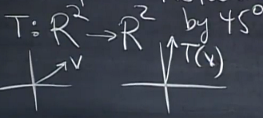

如果v翻倍,旋转后的向量同样翻倍,对于v+w,无论先旋转后加,还是加后旋转,结果是一样的.因此这是线性变换.

## 1.1 直线还是直线，三角形还是三角形

> Lines to Lines,Triangles to Triangles

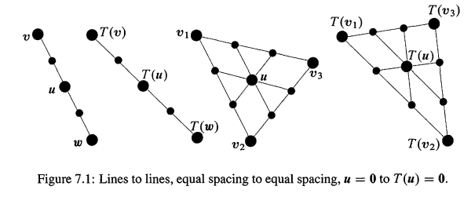

Fig7.1最左边2条直线，展示了输入空间的 v 到 w 的直线,也展示了输出空间的 `T(v)` 到 `T(w)` 的直线.线性化告诉我们:输入线上的每个点,都到了输出线的点上.而且,**等距的点在输出空间还是等距的点(Equally spaced points go to equally spaced points).** 输入线上的中心点 $u = 1/2 v+1/2 w$,变换到输出线上的中心点:$T(u) = 1/2 T(v)+1/2 T(w)$

Fig7.1右边2增加了一维.现在我们有3个顶点 $v_1,v_2,v_3$.这些输入有3个输出 $T(v_1),T(v_2),T(v_3)$.输入的三角形,输出还是一个三角形.等距的点还是等距的(边上,和边之间).中心点是 $u = 1/3(v_1+v_2+v_3)$,输出的中心点是 $T(u) = 1/3 (T(v_1 )+T(v_２ )+T（v_３ )$.

> **线性化的规则，可以扩展到3个或者n个向量的组合：**
> $$
> \text{Linearity:} \quad 
> u=c_1v_1+...+c_nv_n 
> \quad \text{transform to}\quad
> T(u) = c_1T(v_1)+...+c_nT(v_n) \tag{1}
> $$

**注意：**变换有自己的语言,当没有矩阵的时候,我们不能讨论列空间.但概念是可以继续使用的。如

1. 列空间包含了所有的输出Av
2. 零空间包含的是所有Av = 0的输入

上面2个概念在变换可以用"**值域(range)**"和"**内核(kernel)**"来表示：

- T的值域 = 所有输出 T(v) 的集合 (对应列空间Av)
- T的内核 = 所有 `T(v) = 0` 的输入的集合(对应零空间)

值域在输出空间W.内核在输入空间V.当 `T` 可用一个矩阵乘法表示的时候,就有 $T(v) = Av$,这时候,你可以把这些概念理解为零空间和列空间

## 1.2 变换的例子

> Example of Transformation(mostly linear)

**例4.** 直接投影任何3维向量到xy平面,那么 $T(x,y,z) = T(x,y,0)$.值域就是这个平面,包含了所有的T(v).内核是z轴(投影为0).这个投影是线性的.

**例5.** 投影任何3维向量到水平面z = 1,那么 $v = (x,y,z)$ 变成 $T(v) = (x,y,1)$.这个变换不是线性的.因为它甚至不能把 `v = 0` 投影到 $T(v) = 0$

3-3矩阵A乘以任何3维向量,这个 $T(v) = Av$ 是线性的:
$$
T ( v + w ) = A ( v + w ) \quad \text { 确实等于 } \quad A v + A w = T ( v ) + T ( w )
$$

**例6.** 假设T变换可用矩阵A表示，并且A是可逆矩阵.那么T的内核是0向量,值域 W 等于定义域 V

> sp:可逆矩阵，只有零向量能产生Ax = 0,并且因为可逆，各列独立，所以列空间 Av 等于矩阵A本身的列生成的空间

另外一个线性变换是乘以 $A^{−1}$.这是逆变换(inverse transform $T^{−1}$),把任何T(v)向量变换回v
$$
T^{-1}(T(v)) =v \quad \text{符合矩阵乘法} \quad  A^{-1}(Av) = v
$$

---

思考1个问题： 所有的输入空间 $V = R^n$ 到输出空间 $W = R^m$ 的**线性变换**，都可以由矩阵产生吗？当线性的 T 被描述为旋转或者投影....等等的时候，总会有一个矩阵隐藏在这个变换T下吗?

**是的**.这是一种学习线性代数的方式,不是从矩阵开始学起.下一节我们将看到,这一切都是矩阵

> sp:注意，必须是线性变换。也就是说，一切线性变换都可以用一个矩阵表示！

## 1.3 平面的线性变换

> Linear Transformation of the plane

看一个变换的效果,比定义它有趣多了.当一个2-2矩阵A乘以所有 $R^2$ 的向量,我们可以看到它怎么作用.我们从一个有11个顶点的房子开始,有11个向量 `v`，它们变换为11向量 `Av` .v之间的直线变成Av之间的直线(这个变换是线性的!).把A作用到一个标准的房子上,可以产生一个新的房子--可能拉伸或者旋转等等

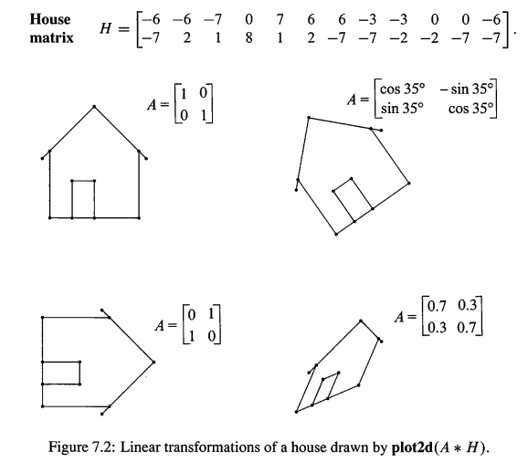

矩阵H的列是第1个房子的11个顶点，矩阵A乘以H产生了其他形状的房子

> sp:plot2d是TeachingCode里面的函数

## 1.4 总结

1. 一个变换T,把输入空间的每一个v,变换成输出空间的T(v)
2. 如果 $T(v+w) = T(v) + T(w),T(cv) = cT(v)$,那么T是线性的:直线变换后还是直线
3. **线性组合，变换之后，还是线性组合**:$T(c_1 v_1+…+ c_n v_n) = c_1 T(v_1 )+…+c_n T(v_n )$
4. 只有当 $v_0=0$,的时候,$T(v) = Av +v_0$ 才是线性的.其实这时候就是 $T(v) = A(v)$

## 1.5 典例

**1.** 消去矩阵 $\left[\begin{matrix} 1 & 0 \\ 1 & 1 \end{matrix} \right]$ 定义了一个**偏移变换(sheer transformation)**,把 `(x,y)` 变换成 `T(x,y) = (x,x+y)`.画出xy平面,然后看看向量 `(1,0),(1,1)` 变换成什么.对 `x = 0` 和 `x= a` 这样的垂直线,发生了什么?如果输入空间是单位正方形 $0\le x \le 1,0\le y \le 1$,画出输出(变换后的正方形)

解: x轴上的点 `(1,0),(2,0)` 被T变换成(1,1),(2,2),也就是水平的x轴变成逆时针旋转45度的直线(当然还经过原点).在y轴的点没有移动,因为 `T(0,y) = (0,y)` .**y轴是 $λ=1$ 时T的特征向量所在的直线**.

> sp: $\left[\begin{matrix} 1 & 0 \\ 1 & 1 \end{matrix} \right]$ 的特征值是 $\lambda = 1,1$，特征向量是 $x = (0,1)$

而x = a的直线会向上移动a

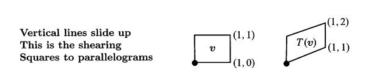

---

**2.** 一个**非线性**变换T,如输出输空间的每一个b,都是由输入空间的单独一个x变换而来的,那么它是可逆的(invertible).也就是:`T(x) = b` **恰好仅有一个解**.下面的哪些变换(x是实数)是可逆的,$T^{−1}$ 是什么呢?注意，**下面的变换没有一个是线性的,就算 $T_3$ 也不是**.当你求解 `T(x) = b` 的时候,你在逆转T.

1. $T _ { 1 } ( x ) = x ^ { 2 }$
2. $T _ { 2 } ( x ) = x ^ { 3 }$
3. $T _ { 3 } ( x ) = x + 9$
4. $T _ { 4 } ( x ) = e ^ { x }$
5. $T _ { 5 } ( x ) = \frac { 1 } { x } \text { for nonzero } x ^ { \prime } \mathrm { s }$

解:

- $T_1$ 是不可逆的,因为 $x^2=1$ 有2个解,$x^2=−1$ 没有解
- $T_4$ 是不可逆的,因为 $e^x=−1$ 没有解(如果输出空间变成正值的b,那么 $e^x=b$ 的逆是 $x = \ln b$)

注意.$T_5^2=identity$.但是$T_3^2=x+18$.  $T_2,T_3,T_3$ 是可逆的.解 $x^3=b,x+9=b,1/x=b$ 是唯一的
$$
x = T _ { 2 } ^ { - 1 } ( b ) = b ^ { 1 / 3 } \quad x = T _ { 3 } ^ { - 1 } ( b ) = b - 9 \quad x = T _ { 5 } ^ { - 1 } ( b ) = 1 / b
$$

# 2 线性变换的矩阵

> - The Matrix  of  a Linear Transformation
> - 综合V31后半部分

> V31:**理解线性变换,就是确定它背后的矩阵,这才是线性变换的本质**.为了做到这一点,我们需要**引入坐标值,确定一组基**.下面开始讲解
>
> 假设有一个线性变换`T`,输入是3维向量,输出是2维向量,就是把三维空间的向量映射到二维空间,这可以轻易通过矩阵乘法实现.这时候A是一个2-3的矩阵.
> $$
> \text{Start:} \quad T : R^3 \rightarrow  R^2 \\
> \text{Example:} \quad T(v) = Av
> $$
> 注意，上面的 $T(v) = Av$ 当中:
>
> - Av的v是输入向量，3维的
> - 整个T(v)是输出向量，2维的
>
> ---
>
> 线性变换对所有向量的意义不要通过1个个向量的看，应该见微知著,**对整个向量空间线性变换**！而对于向量空间，只需要知道**基向量**,就能掌握一切,所以,只需要确定基向量 $v_1...v_n$ ，也就是输入基的变换 $T(v_1)...T(v_n)$ ，就足以确定任何向量v的线性变换T(v),因为任何v都是基的线性组合.
> $$
> v = c_1v_1+...+v_nc_n  \tag{V1}
> $$
> 从而根据**线性化性质**，我们一定有：
> $$
> T(v) = c_1T(v_1) +... +c_nT(v_n)
> $$
> 现在问题是,如何把一个和坐标无关的线性变换变成一个与坐标有关的矩阵呢?**矩阵源于坐标系,坐标的存在意味着，基已经被确立了!**一旦选定了一组基,坐标也随着确定了,如 `Eq(V1)` 的 $v_1...v_n$ 就是已经确立的基，而 $c_1,c_2...c_n$ 就是坐标值.而其他向量，如 $\vec{v}$ 表示成**基向量的线性组合,就是向量唯一的表达式,系数就是坐标值.**
>
> > - 坐标源于一组基(coordinates come from a basis)
> > - 在 `Eq(V1)` $\vec{v}$ 的坐标就是数字 $c_1...c_n$,这些数字表示 $\vec{v}$ 有多少基向量组成。如果基改变了,坐标也就改变了
>
> 一般来说,坐标系建立在标准基的基础上,所以平时你甚至不会意识到标准基的存在,$\vec{v} = (3,2,4)$,你早就接受了这样的假设:存在这样一组标准基:
> $$
> \vec{v} = \left[ \begin{array} { l } 3 \\ 2 \\ 4 \end{array} \right] = 3 \left[ \begin{array} { l } 1 \\ 0 \\ 0 \end{array} \right] + 2 \left[ \begin{array} { l } 0 \\1 \\ 0 \end{array} \right] + 4 \left[ \begin{array} { l } 0\\ 0 \\ 1 \end{array} \right]
> $$
> 但你可以选择其他基,**例如矩阵的特征向量也是一个很好的选择**，然后坐标这有跟着基的改变而改变
>
> 现在我们希望通过矩阵描述线性变换:构造一个矩阵A,用于表示线性变换T,T可以是任何从n维到m维 $T:R^n \rightarrow R^m$ 的变换(例如T可能表示投影、旋转、房子的镜像等)。关键在于
>
> - 确定n维的输入空间一组输入基,以描述输入向量的坐标
> - 确定m维的输出空间的一组输出基，以描述输出向量的坐标.
>
> 所以
>
> - 令 $v_1...v_n$ 作为输入空间的基,这些向量来自于 $R^n$
> - 令 $w_1...w_m$ 作为输出空间的基,来自于$R^m$
>
> **基已经确定,对应的矩阵也就确定,就可以引入坐标了！**怎么做呢？
>
> 1. 首先选择一个向量v,通过输入基把它表示出来,于是得到它的**坐标** $c_1...c_n$
> 2. 然后把这些坐标值 $c_1...c_n$ 乘以某个矩阵A,得到的就是通过输出空间的基表示的，输出向量的**坐标** ！这个矩阵A的构造，就是`<#2.1>`！
>

根据上一节可知，**任何线性变换 T 都对应一个矩阵，每一个不同的矩阵都对应于一个变换,矩阵乘以向量就代表一个线性变换**。输入v在 $V = R^n$ ,输出 T(v)在 $W = R^m$ 也就是Av.T对应的矩阵是 `m-n` 的.**对V,W的基做出不同的选择,矩阵A是也会不一样**：

1. 如果输出、输出的 $R^n,R^m$ 空间都选择标准基(单位矩阵 `I` 的列),那么A是标准矩阵,这时 $T(v) = Av$ 是一般的形式(in a normal way).
2. **但这些空间还有其他的基**,所以同一个变换T就被其他矩阵所表示。每一种基的选择,都可以得到T的一个矩阵.**当输入的基(input basis)不等于输出的基(output basis)时,`T(v) = v` 对应的矩阵A就不是单位矩阵`I`.它是"变基矩阵(change of basis matrix)"** 

> sp:上句话的意思就是，T(v)= v是恒等变换，当基不同，矩阵A是变基矩阵。参见`<#2.3>`

线性代数的一个重要主题就是选择基,得到最好的代表T的矩阵

> **本节关键概念**
>
> ---
>
> 假设我们对**基向量** $v_1...v_n$ 都知道 $T(v_1)...T(v_n)$,那么线性化，可以对任何 v 都能得出 T(v)
>
> ---
>
> 原因：任何向量v，都可以表达为基向量 $v_1...v_n$ 的**唯一**线性组合 $c_1v_1+...+c_nv_n$；而因为T是一个线性变换，所以 **v 的变换 T(v),肯定是已知的基向量变量 $T(v_i)$ 的线性变换的==同一个==组合 $T(v) = c_1T(v_1)+...+c_nT(v_n)$**

**例1. 标准基向量(1,0),(0,1)作为输入基时候的T(v)**   

- 假设T把 $v_1=(1,0)$ 变换成 $T(v_1)=(2,3,4)$，所以A的第1列是(2,3,4)
- 而 $v_2=(0,1)$ 变换成 $T(v_2) = (5,5,5)$,所以A的第2列是(5，5，5)

输出 $T(v_1),T(v_2)$ 成为了矩阵的列。T是从 $R^2$ 到 $R^3$ 的线性变换,所以矩阵是 `3-2` 的.并且，$v=v_1+v_2$ 的现象变换就是 $T(v_1)+T(v_2)$,**线性组合在线性变换后不变：**
$$
A = \left[ \begin{array} { l l } 2 & 5 \\ 3 & 5 \\ 4 & 5 \end{array} \right] . \quad 
\begin{array} { l } T \left( v _ { 1 } + v _ { 2 } \right) = T \left( v _ { 1 } \right) + T \left( v _ { 2 } \right) \\ \text { combines the columns } \end{array} 
\quad
\left[ \begin{array} { l l } 2 & 5 \\ 3 & 5 \\ 4 & 5 \end{array} \right] \left[ \begin{array} { l } 1 \\ 1 \end{array} \right] = \left[ \begin{array} { l } 7 \\ 8 \\ 9 \end{array} \right]
$$

---

**例2+例V** 介绍一个不一样的线性变换：求导 $T =\frac{d}{dx}$. 假设

- 输入是函数 $c_1+c_2x+c_3x^2$,输入基是简单的幂函数$1,x,x^2$ 
- 输出是导数 $c_2+2c_3x$,输出基是 $1,x$

我们看看矩阵A是什么(sp:其实A的求法需要在`<#2.1>`学习，下式是为了说明：一个函数(向量)的系数(基下的坐标)，经过求导变换后，得到了求导结果的系数)

$$
A \left[ \begin{array} { l } c _ { 1 } \\ c _ { 2 } \\ c _ { 3 } \end{array} \right] = \left[ \begin{array} { l } c _ { 2 } \\ 2 c _ { 3 } \end{array} \right]

\Rightarrow\quad 

\left[\begin{matrix} 0 & 1 & 0\\0 & 0 & 2\\\end{matrix} \right]
\left[ \begin{array} { l } c _ { 1 } \\ c _ { 2 } \\ c _ { 3 } \end{array} \right] = \left[ \begin{array} { l } c _ { 2 } \\ 2 c _ { 3 } \end{array} \right]
$$

这是一个三维空间到2维空间的线性变换. 不知你是否意识到求导是线性运算。我们之所以能够对函数求导,因为我们知道这是一个线性变换,只需要找我少量函数的求导法则,比如$cosx,sinx,e^x$,我们就可以求出它们线性组合的导数。

函数 $1,x,x^2,x^3$ 的导数是 $0,1,2x,3x^2$.**求导可以看成是一个变换T.输入和输出都是函数!**注意,"求导变换"T是线性的!
$$
T ( v ) = \frac { d v } { d x } \quad \text { 遵循线性规则 } \quad \frac { d } { d x } ( c v + d w ) = c \frac { d v } { d x } + d \frac { d w } { d x } .
\tag{1}
$$
就是因为这个线性关系,所以才能够找到其他所有函数的导数.根据每一个不同幂的函数 $1,x,x^2,x^3$ (其实就是基向量 $v_1,v_2,v_3,v_4$)的导数,你可以找到任何其他多项式如 $4+x+x^2+ x^3$ 的导数

$$
\frac { d } { d x } \left( 4 + x + x ^ { 2 } + x ^ { 3 } \right) = 1 + 2 x + 3 x ^ { 2 } \quad  \quad \color{orange} \text{because of linearity!}
$$
上式，把T变换(求导d/dx)应用到输入 $v = 4v_1+v_2+v_3+v_4$,这里的输入空间 V 包含所有 $1,x,x^2,x^3$ 的**所有组合**.你可能会叫他们函数，但我称它们为向量！ 这4个向量是3次多项式(cubic polunomials,degree <=3) 空间V的基.**只要这四个基向量的导数,我们可以知道V中的全部导数**

为了求矩阵A的零空间,我们求解 `Av = 0`.为了得到求导变换T的内核,我们求解 dv/dx = 0.解是 `v=constant`,所以T的零空间是一维的,包含所有的常数函数(比如第一个基函数 $v_1=1$)

为了找到值域(其实就是列空间),看看输出 $T(v) = dv/dx$.输入是三次多项式 $a+bx+cx^2+dx^3$,所以值域是2次多项式(quadratic polynomials,degree<=2).对于输出空间W，我们可以做出选择

1. 如果设 `W=cubics`,那么T的值域(the quadratics)是W的子空间
2. 如果设 `w=quadratics`,那么值域就是整个W

> sp:这里的意思就是：**输出空间 W 可以比 变换T的输出结果，也就是值域大,不是值域定义输出空间,值域是包含在输出空间W的。** 

注意如上的第2个选择，强调了定义域，也就是输入空间(V=cubics)和输出空间(W=quadraticcs)之间的不同.V的维数是4,W的维数是3.**这个导数矩阵应该是3-4的**

T的值域是一个3维子空间，所以矩阵的秩将会是r = 3.而内核是1维的.和3+1= 4是输入空间的维数.其实这就是r+(n-r)＝n,线性代数的基础定理.总有:
$$
\text{(dimension of range) + (dimension of kernel) = dimension of input space}
$$

> `sp-note7.2-3`:真神奇啊。注意
>
> - 值域是列空间
> - 内核就是零空间
>
> 列空间维数+零空间维数=n！这里的n，表示 $R^n$ 的维数，也就是输入向量 v 可以是 $R^n$ 下的任何向量！

导数变换把3次的空间V变换成2次的空间W.V的基是 $1,x,x^2,x^3$.W的基是 $1,x,x^2$,导数矩阵是3-4的
$$
A = \left[ \begin{array} { l l l l } 0 & 1 & 0 & 0 \\ 0 & 0 & 2 & 0 \\ 0 & 0 & 0 & 3 \end{array} \right] = \text { matrix form of derivative } T \tag{2}
$$
为什么A是正确的呢?**因为乘以A和T做的变换是吻合的**.$v= a+bx+cx^2+dx^3$ 的导数是 $T(v) = b+2cx+3dx^2$.b,2c,3d这些数字也同样会出现在乘以A的时候:
$$
\text{求导}\quad

\left[ \begin{array} { l l l l } 0 & 1 & 0 & 0 \\ 0 & 0 & 2 & 0 \\ 0 & 0 & 0 & 3 \end{array} \right] \left[ \begin{array} { l } a \\ b \\ c \\ d \end{array} \right] = \left[ \begin{array} { c } b \\ 2 c \\ 3 d \end{array} \right] 
\tag{3}
$$

---

**例3.** 积分是导数的逆，这是微积分基础定理。我们现在可以在线代看到这个定理！在 0-x 区间积分 对应的 变换 $T^{−1}$ 也是线性的! 如，把 $T^{−1}$ 应用到 $1,x,x^2$,也是是例2的输出结果： $w_1,w_2,w_3$ 作为输入：
$$
\text{积分是}T ^ { - 1 }： \quad \int _ { 0 } ^ { x } 1 d x = x , \quad \int _ { 0 } ^ { x } x d x = \frac { 1 } { 2 } x ^ { 2 } , \quad \int _ { 0 } ^ { x } x ^ { 2 } d x = \frac { 1 } { 3 } x ^ { 3 }
$$
根据线性化,对 $w = B+Cx+Dx^2$ 的积分是 $T^{−1} (w)=Bx+1/2 Cx^２+1/3 Dx^3$.也就是，对二次函数的积分得到3次函数。输入空间是2次的,输出空间是3次的.积分把W变换成V,**矩阵应该是4-3的**

- $T^{-1}$ 的值域：也就是输出 $T^{−1} (w)=Bx+1/2 Cx^２+1/3 Dx^3$ ，是3次的，没有常数项
- $T^{-1}$ 的内核：输出仅在 B = C= D 的是时候为0，所有零空间是 $Z= \{0\}$

**线代基础定理：3+0 =3 是 $T^{-1}$ 的输入空间 W 的维数！**

再看看 $T^{−1}$,积分矩阵是4-3.注意看下面的矩阵是怎么从 $w = B+Cx+Dx^2$,产生积分 $0 +Bx + 1/2Cx^2+1/3Dx^3$

> sp:现在要被变换的"V"的基是 $1,x,x^2$,结果"W"的基是 $1,x,x^2,x^3$

$$
\text{积分} \quad 
\left[ \begin{array} { c c c } 0 & 0 & 0 \\ 1 & 0 & 0 \\ 0 & \frac { 1 } { 2 } & 0 \\ 0 & 0 & \frac { 1 } { 3 } \end{array} \right] \left[ \begin{array} { c } B \\ C \\ D \end{array} \right] = \left[ \begin{array} { r } 0 \\ B \\ \frac { 1 } { 2 } C \\ \frac { 1 } { 3 } D \end{array} \right]
\tag{4}
$$

我想把 `Eq(4)` 矩阵的称为 $A^{−1}$,但是你知道矩形阵并没有逆.最起码它们没有双边逆.矩形阵A有一个单边的逆.积分的矩阵是导数矩阵的单边逆!
$$
A A ^ { - 1 } = \left[ \begin{array} { l l l } 1 & 0 & 0 \\ 0 & 1 & 0 \\ 0 & 0 & 1 \end{array} \right] \quad \text { 但 } \quad A ^ { - 1 } A = \left[ \begin{array} { l l l l } 0 & 0 & 0 & 0 \\ 0 & 1 & 0 & 0 \\ 0 & 0 & 1 & 0 \\ 0 & 0 & 0 & 1 \end{array} \right]
$$
> sp:matlab可以用 `pinv` 得到伪逆,在列满秩的情况下就是左逆啊，所以上式好像把顺序写反了...

如果你先积分一个函数然后求导,你回到原点,也就是 $AA^{−1}=I$.但是如果你先求导然后积分,常数项丢失了.**对1的导数的积分是0:**
$$
T^{-1}T(1) = \text{integral of zero function } = 0
$$
这也吻合 $A^{−1} A$,第一列全部都是0.**导数T有内核(也就是常数函数)，所以它对应的矩阵A有零空间.**

## 2.1 构造变换矩阵

> Construction of the matrix

现在我们对任何线性变换构建矩阵A.

假设 T 把空间V(n维的) 变换到 空间W(m维的).对V的基的选择是 $v_1,…v_n$,W的基是 $w_1…w_m$.那么矩阵A是m-n的.为了得到A的第一列,把 T 应用到 V 的第一个基 $v_1$,那么输出 $T(v_1)$ 是在W空间的

>   **$T(v_1)$ 是输出空间W中的基向量的组合： $a_{11}{w_1}+...+a_{m1}w_m$** ($v_1$ 是 V的第1个基向量)。$a_{11}…a_{m1}$  这些数字形成了A的第一列。验证一下：把 $v_1$ 变换为 $T(v_1)$,和A乘以 `(1,0...0)` 是匹配的$ ^{sp-Mark7.2-1}$
>
>   > 理解`<sp-Mark7.2-1>` (来自V):假设输入是第1个基 $v_1 = (1...0)$,那么被A乘之后，就得到A的第1列，也就是数字 $a_{11},a_{21}...a_{m1}$,明显，这就是 $T(v_1)$ 在输出基下的坐标。其他所有的基向量都是如此，从而输入空间内的所有基向量也是如此
>
>   构建A的**关键规则**就是： A的第 `j` 列，是通过 把 T 应用到 **V的** 第 j 个基向量 $v_j$ 求得的：
>   $$
>   T(v_j) = \text{W 基向量的线性组合} = a_{1j}w_1 + ....+a_{mj}w_m 
>   \tag{5}
>   $$
>
>   > sp:应该这样理解：已经知道 $T(v_j)$ 是什么，然后再用W的基向量去匹配！
>
>   $a_{1j}…a_{mj}$ 形成A的第 `j` 列.**这样构造出来的矩阵A，能正确表示V的基向量，从而线性化让所有V空间下的向量都是正确的(The matrix is constructed to get the basis vector right,Then linearity gets all the other vectors right)**.
>
>   V下的每一个v都是基向量的组合： $c_1 v_1+…+c_n v_n$ ,而**T(v)是W的基 w's 的组合**.当A乘以v向量在V空间下的系数向量(cofficients vector，也就是坐标) $c = (c_1…c_n)$ ,Ac产生的系数就是 `T(v)` 在W的基下组合的系数，也就是T(v) 在W空间下的坐标！这是因为矩阵乘法(列的线性组合)和T一样是线性的.
>
>   **矩阵A告诉我们T做了什么.每一个从V到W的线性变换都可以转换成矩阵.而且这个矩阵取决于基.**
>
>   ---
>
>   总结(来自V):**确定线性变换的矩阵A呢？**
>
>   **1** 首先确定两组基,输入基 `v1...vn`,和输出基 `w1...wm`
>
>   **2** 然后确定A的第一列,怎么做呢？最直接的方法是,对输入v1进行线性变换,写出输出T(v1),并把T(v1)写成是 `w1...wm` 的组合,线性组合的系数就是矩阵的第一列
>   $$
>   T(v_1) = a_{11}w_1+a_{21}w_2 + ... + a_{m1}w_m
>   $$
>   上式的 $a_{11},a_{21}...a_{m1}$ 就是矩阵A的第1列
>
>   **3** 矩阵的第2列和第2步一样，只不过这次换成 v2进行步骤
>   $$
>   T(v_2) = a_{12}w_1+a_{22}w_2 + ... + a_{m2}w_m
>   $$
>   上式的 $a_{12},a_{22}...a_{m2}$ 就是矩阵A的第2列

如：

- 在例2，T是求导变换，V的第一个基向量是1,它的导数是 $T(v_1) = 0$,所以对于求导变换矩阵,A的第一列都是0.
- 在例3，$T^{-1}$积分变换,V的第一个基函数还是1.它的积分是==W的== (注意是==W的！==)第二个基函数x,所以 $A^{−1}$ 的第一列是 $(0,1,0,0).$

>   **理解**：A的列j，是把V的基 $v_j$ 用W的基表示的系数(也就是坐标),而V下的任何向量V都是 $v_1...v_n$ 的组合，也就是 $v= c_1v_1 + ...+c_nv_n$,v线性变换后的T(v),因为是**线性**变换，所以T(v)还是这样组合的！也就是 $T(v)= c_1T(v_1) + ...+c_nT(v_n)$
>
>   **证明**：设v在V的基下的坐标是$(c_1,...,c_n)$，也就是：
>   $$
>   v = [v_1,...,v_n] \left[\begin{matrix}c_1\\\vdots\\c_n\\ \end{matrix} \right] \tag{S1}
>   $$
>   T(v) 在W的基的坐标是 $(b_1...b_m)$，也就是
>   $$
>   T(v) = [w_1,...,v_m] \left[\begin{matrix}b_1\\\vdots\\b_m\\ \end{matrix} \right] \tag{S2}
>   $$
>   Ac乘法，得到的就是 T(v) 在W空间下的坐标
>   $$
>   \left[\begin{matrix} a_{11} & \dots & a_{1n}\\ \vdots & \dots & \vdots\\ a_{m1} & \dots & a_{mn}\\\end{matrix} \right] 
>   \left[\begin{matrix}c_1\\\vdots\\c_n\\ \end{matrix} \right] 
>   = \left[\begin{matrix}b_1\\\vdots\\b_m\\ \end{matrix} \right]  \tag{S3}
>   $$
>
>   也就是说：
>
>   - 矩阵A是通过，将V的 n 个基的T变换，用W的基来表示，从而得到A的n个列。A的第1列就是第1个基 $v_1$ 的变换 $T(v_1)$ 在W基线性组合下的系数...A的第n列就是基 $v_n$ 的变换 $T(v_n)$ 在W基线性组合下的系数
>   - **因为已经将V的基的T变换，成功用W基的线性组合表示，所以任何v的变换 $T(v)$，都可用W的基表示！**(`Eq(S3)`为何成立?参见`Eq(S7)`！)
>   - 矩阵A的作用是：**在V的==一组基== $v_1...v_n$ 下坐标为 $(c_1...c_n)$ 的向量，被A乘以后，得到其在 W ==一组基== $(w_1...w_m)$ 下的坐标$(b_1...b_m)$**.所以，T变化(A矩阵)是取决于V,W的基的，只要选择的基不同，A矩阵就不同.
>
>   ---
>
>   **证明Eq(S3)** 先不要管矩阵乘法 Av,只看变换结果 $T(v_i)$!因为 $T(v_1)$ 是空间W$R^m$下的向量，所以肯定可用 W 的基向量($R^m$) 表示！ 为了求得A 的第 `i` 列，分别对 V 空间的第 `i` 个基向量应用上述过程，得到
>   $$
>   T(v_i)=  a_{1i}{w_1}+...+a_{mi}w_m    = \sum_{j=1}^m a_{ji}w_j  \tag{S4}
>   $$
>   从而，A矩阵是如下的系数矩阵：
>   $$
>   A= \left[\begin{matrix} a_{11} & \dots & a_{1n}\\ \vdots & \dots & \vdots\\ a_{m1} & \dots & a_{mn}\\\end{matrix} \right]
>   $$
>   那么：
>   $$
>   T\left[\begin{matrix} | & ... & |\\v_1 & ... & v_n\\| & ... & |\\\end{matrix} \right]
>   = \left[\begin{matrix} | & ... & |\\T(v_1) & ... & T(v_n)\\| & ... & |\\\end{matrix} \right]
>   = \left[\begin{matrix} | & ... & |\\w_1 & ... & w_m\\| & ... & |\\\end{matrix} \right] * \left[\begin{matrix} a_{11} & \dots & a_{1n}\\ \vdots & \dots & \vdots\\ a_{m1} & \dots & a_{mn}\\\end{matrix} \right] =  \color{orange} \text{W的基*矩阵A！}
>   \tag{S8}
>   $$
>   $v_1...v_n$ 都是**V的基**,也就说，将T对V的基的变换，用W的基线性组合的来表示，从而得到矩阵A。
>
>   参见 `Eq(S1,S2)`,v在V空间的坐标是 $(c_1...c_n)$;T(v) 在 W 空间的坐标是 $(b_1...b_m)$,首先
>   $$
>   \mathrm { T } ( \mathrm { v } ) = \mathrm { T } \left( \sum _ { i = 1 } ^ { n } c _ { i } v _ { \mathrm { i } } \right) = \sum _ { i = 1 } ^ { n } c _ { \mathrm { i } } T \left( v _ { \mathrm { i } } \right) = c _ { 1 } T \left( v _ { 1 } \right) + \cdots + c _ { \mathrm { n } } T \left( v _ { n } \right) = 
>   \left[ T \left( v _ { 1 } \right) \ldots T \left( v _ { n } \right) \right] 
>   \left[ \begin{array} { c } c _ { 1 } \\ c _ { 2 } \\ \ldots \\ c _ { n } \end{array} \right]
>   \tag{S5}
>   $$
>   将 $T(v_i)$ 使用 Eq(S4) 替换，得到：
>   $$
>   \begin{aligned}
>   	T(v) & = \sum _ { i = 1 } ^ { n } c _ { i } \left( \sum _ { j = 1 } ^ { m } a _ { j i } w _ { \mathrm { j } } \right) = 
>   
>   	\begin{aligned}
>   		&c_1[a_{11}w_1 + ... + a_{m1}w_m]  \\
>   		&+  \\
>   		&\vdots\\
>   		&+  \\
>   		& c_n[a_{1n}w_1 + ... + a_{mn}w_m]
>   
>   	\end{aligned}
>   
>   	= 	\begin{aligned}
>   		& w_1[c_1 a_{11} + ... + c_n a_{1n}] +  \\
>   		&+  \\
>   		&\vdots\\
>   		&+  \\
>   		&w_m[c_1a_{m1} + ... + c_n a_{mn}]
>   
>   	\end{aligned}
>   
>   	\\[4ex]
>   
>   	&= \sum _ { j = 1 } ^ { m } \left( \sum _ { i = 1 } ^ { n } c _ { i } a _ { j i } \right) w _ { j } 
>   = [w_1...w_m]​​\left[\begin{matrix}  \sum _ { i = 1 } ^ { n }c_i a_{1i}  \\\vdots\\  \sum _ { i = 1 } ^ { n }c_ia_{mi} \\ \end{matrix} \right]
>   \end{aligned}
>   
>   \tag{S6}
>   $$
>   因为 $w_1...w_m$ 是基，所以 `Eq(S3)` 的基坐标 $(b_1..b_m)$ 唯一，而且 $[w_1...w_m]$ 可逆。所以
>   $$
>   \left[\begin{matrix}b_1\\\vdots\\b_m\\ \end{matrix} \right] = ​\left[\begin{matrix}  \sum _ { i = 1 } ^ { n }c_i a_{1i}  \\\vdots\\  \sum _ { i = 1 } ^ { n }c_ia_{mi} \\ \end{matrix} \right] = 
>   
>   \left[\begin{matrix} a_{11} & \dots & a_{1n}\\ \vdots & \dots & \vdots\\ a_{m1} & \dots & a_{mn}\\\end{matrix} \right]​​\left[\begin{matrix}c_1\\\vdots\\c_n\\ \end{matrix} \right]  = 
>   
>   Ac  \tag{S7}
>   $$
>   得证！(sp:,其实`<#Lk1> Eq(K3)` 就是Eq(S7)的特殊形式啊)

**例4.**  **如果基改变了,T还是相同的变换,但是矩阵A改变了**

在例2当中，假设对 V 当中的3次多项式的重新排列基为 $x,x^2,x^3,1$.而W的二次多项式保持不变,还是 $1,x,x^2$.那么第一个基 $v_1 =x$ 的导数是第一个基向量 $w_1=1$.所以和原来的 `Eq(1)` 的A对比，现在的A的第一列是不一样的:
$$
A _ { \text {new } } = \left[ \begin{array} { l l l l } 1 & 0 & 0 & 0 \\ 0 & 2 & 0 & 0 \\ 0 & 0 & 3 & 0 \end{array} \right]
$$
**当我们重新排列了V的基,我们重新排列了A的列**.

- 输入基向量 $v_j$ 是对矩阵A的第 j 列负责的
- 而输出基向量 $w_i$  是对矩阵A的第 `i` 行负责的

稍后我们会看到,基的改变,不仅仅只是排列顺序改变而已

## 2.2 乘积AB匹配变换TS

> Products AB Match Transformations TS

求导和积分的例子有3点需要注意

1. 线性变换T存在于任何地方-微积分,微分方程和线性代数.
2. 不仅仅是 $R^n$,还有其他很多空间也是很重要的,比如V,W可以是函数空间
3. T可以用一个矩阵A表示.

下一个例子当中,V=W.而且对2个空间都选择一样的基,然后我们可以比较一下矩阵 $A^2,AB$ 和变换 $T^2,TS$

**例5(旋转).** T旋转每一个向量角度θ,这里,$V = W= R^2$,求A。注意这里，V,W的基都是 `(1，0),(0，1)`

解:V,W标准基是 $v_1=(1,0),v_2=(0,1).$为了找到A,把T应用到这些标准基.在Fig7.3左边,它们被旋转了角度θ,第1个基向量(1,0)被旋转到 $(cosθ,sinθ)$,这等于 $cosθ*(1,0)$ + $sinθ*(0,1)$ ,因此 $cosθ,sinθ$ 变成A的第一列 $\left[ \begin{array} { c } \cos \theta \\ \sin \theta \end{array} \right] $。 为了找到第2列,发现第2个基(0,1)变换为(-sinθ,cosθ),这就是A的第2列，所以完整的A是 $A = \left[ \begin{array} { r r } \cos \theta & - \sin \theta \\ \sin \theta & \cos \theta \end{array} \right]$

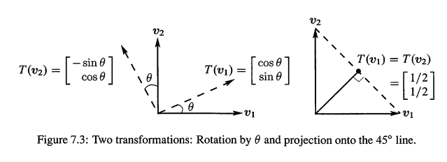

---

**例6(投影,结合V31的例子).**  假设T把每一个平面向量投影到45度直线(下图蓝色直线).找到这个投影的2组不同的基对应的矩阵.

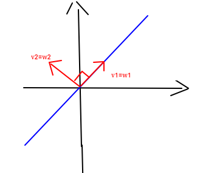

解: 

**1 特征向量为基：** 从特殊的基开始，并且输入基=输出基：

1. 假设基向量 $v_1$ 就是在这条45度直线上的单位向量.它的投影就是它的自身:$T(v_1) = v_1$.
2. 第2个基向量 $v_2$ 和这条45度的直线垂直($135^{\circ}$),这个基向量投影成0.

现在问题是,这个矩阵是什么?我们知道，任意向量v,都可以表示成基向量的组合 $v = c_1v_1+c_2v_2$，坐标就是 $(c_1,c_2)$.这时候 T(v)是什么呢？(sp:**注意T(v)要表示成输入基的组合**，在这里也就是等数输入基的输出基 $w_1,w_2$)

观察 $v = c_1v_1+c_2v_2$，我们分别看看**变换对输入基 $v_1,v_2$ 做了什么：**

- 当输入为基向量$v_1$,那么 $T(v_1)$ 还是 $v_1$ ,因为它就在投影直线上，它的投影就是它本身.所以我们知道了投影对于第1个基向量的影响.(所以A的第一列是(1,0))
- 如果输入是第2个基向量 $v_2$ ,投影是0（所以A的第二列是(0,0)）

所以，对于任何 $v = c_1v_1+c_2v_2$, v的2个基向量组合当中，会保留 $c_1v_1$,而丢弃 $c_2v_2$.那么
$$
T(v) = T(c_1v_1+c_2v_2) = c_1T(v_1)+c_2T(v_2) = c_1v_1
$$
现在我们看看代表这个变换的矩阵是什么。这个矩阵的作用就是：输入 $[c_1,c_2]$,得到输出 $[c_1,0]$!如下

> sp:矩阵是对**坐标**起作用！

$$
\underbrace{\left[ \begin{array} { l l } 1 & 0 \\ 0 & 0 \end{array} \right] }_{A}

\underbrace{\left[ \begin{array} { l } c _ { 1 } \\ c _ { 2 } \end{array} \right] }_{\quad \color{orange} \text{input coords}}

= 

\underbrace{\left[ \begin{array} { c } c _ { 1 } \\ 0 \end{array} \right]}_{\quad \color{orange} \text{output coords}}

\tag{V2}
$$

这里需要强调2点

1. 首先，矩阵起到了应有的作用。原来的线性变换是不涉及到坐标值的。现在有了矩阵，这个矩阵，正确的通过输入坐标，得到输出坐标！
2. 在这个例子里,**输入和输出空间使用了同一组基**,实际上这组基都是投影的**特征向量**.所以得到的矩阵是**对角矩阵 $\Lambda$**,这组基很好.因为，**如果以特征向量为基,可以得到对角阵,对角线上都是特征值**.这是物理学家的最爱,他们不情愿地引入坐标系,而最好的坐标系有特征向量构成.

**2 选择标准基作为输入和输出空间的基**： `(1,0),(0,1)` .Fig7.3右边展示了 `(1,0)` 投影成 `(1/2,1/2)`,这就得到了A的第一列.而另外一个基向量也同样成(1/2,1/2),所以这个标准的矩阵是:
$$
A = \left[ \begin{array} { c c } \frac { 1 } { 2 } & \frac { 1 } { 2 } \\ \frac { 1 } { 2 } & \frac { 1 } { 2 } \end{array} \right] \quad \quad \color{orange} \text{Same prjection for the standard basis}
$$
这其实就是投影矩阵，可以如下求得(a是代表投影直线的向量，如 $(1,1)$）：
$$
A = \frac { a a ^ { T } } { a ^ { T } a } = \left[ \begin{array} { l } \frac { 1 } { 2 } \frac { 1 } { 2 } \\ \frac { 1 } { 2 } \frac { 1 } { 2 } \end{array} \right]
$$
但矩阵不是对角矩阵,因为基不是最佳的基.但是也不算太差,是一个对称矩阵,满足 $P^2 = P$ 等优良性质.

**总结：** 2个A都是投影矩阵.你平方A的话是没有改变的.注意这句话背后隐藏的意思: **$T^2$ 对应的矩阵是 $A^2$**。

> sp-Note-7.2.6:以特征向量为基的变换矩阵是简单很多，参见 `<#LK1.4> `，还有`<V31总结>`
>

---

我们必须思考一个重要的事情--矩阵为何这样相乘的真正原因.设

- S变换由B矩阵表示
- T变化由A矩阵表示

当对 `S` 的输出应用 `T` ,得到的是复合(composition) 的TS.当我们在B之后应用A,得到的是乘积AB.**矩阵乘法给出了表示TS的正确矩阵AB**

- 变换S是从空间U到V,在U中,它的矩阵B使用的是 U 的基 $u_1,u_2…u_p$  和V的基 $v_1…v_n$.
- 变换T是从V到W的.它的矩阵A使用的必须是一样的V的基 $v_1…v_n$ 

也就是说，S输出了V空间的**一组基**，同时，T的输入空间必须是**V空间**，并且恰好是V空间的**这组基**。 这时候,AB和TS是匹配的.

> **Multiplication**
>
> ---
>
> 线性变换 TS 是
>
> 1. 从空间 U 当中的任何向量 u 开始，变换其到空间 V 当中的向量 S(u)
> 2. 然后 T(S(u)) 变换空间 V 的向量 S(u) 到空间 W
>
> 而矩阵乘法 AB,从任何 $R^p$ 下的向量 x 开始，先把 x 变为 $R^n$ 下的向量 Bx,再变为 $R^m$ 下的向量 ABx.**矩阵乘法AB代表了变换TS**:
> $$
> TS:\quad U \rightarrow  V\rightarrow  W  \qquad \qquad A B :  ( m \text { by } n ) ( n \text { by } p ) = ( m \text { by } p ) .
> $$
> 最开始的输入向量是 $u = x_1u_1+...+x_pu_p$,最终的输出 T(S(u)) 匹配了乘法 $ABx$. **Product of transformations matches product of matrices.**
>
> 最重要的情况是，当**U,V,W是同1个空间，并且拥有相同的一组基**。此时 m=n=p,矩阵都是方阵！

**例7.**  S旋转角度θ,T也是旋转θ,那么TS旋转2θ,变换 $T^2$ 和旋转2θ的旋转矩阵 $A^2$ 是对应的
$$
T = S \quad A = B \quad T ^ { 2 } = \text { rotation by } 2 \theta \quad A ^ { 2 } = \left[ \begin{array} { c r } \cos 2 \theta & - \sin 2 \theta \\ \sin 2 \theta & \cos 2 \theta \end{array} \right]
\tag{6}
$$
通过这个  $(变换)^2= (矩阵)^2$ ,我们甚至可以可以得到cos2θ和sin2θ的公式，也就是 A*A:

$$
\left[ \begin{array} { r r } \cos \theta & - \sin \theta \\ \sin \theta & \cos \theta \end{array} \right] \left[ \begin{array} { r r } \cos \theta & - \sin \theta \\ \sin \theta & \cos \theta \end{array} \right] = \left[ \begin{array} { c c } \cos ^ { 2 } \theta - \sin ^ { 2 } \theta & - 2 \sin \theta \cos \theta \\ 2 \sin \theta \cos \theta & \cos ^ { 2 } \theta - \sin ^ { 2 } \theta \end{array} \right]
\tag{7}
$$
我们从线代得到了三角函数的恒等式！

**例8.** S旋转角度θ,T也是旋转-θ,那么TS=I 和 AB=I是对应的

解:在这种情况下T(S(u)) = u.为了能够匹配成功，`ABx` 必须等于x。所以A,B应该是互逆矩阵.下面检查一下，注意 $\cos(-\theta) = \cos \theta,\sin(-\theta) = -\sin\theta$:
$$
A B = \left[ \begin{array} { r r } \cos \theta & \sin \theta \\ - \sin \theta & \cos \theta \end{array} \right] \left[ \begin{array} { c c } \cos \theta & - \sin \theta \\ \sin \theta & \cos \theta \end{array} \right] = \left[ \begin{array} { c c } \cos ^ { 2 } \theta + \sin ^ { 2 } \theta & 0 \\ 0 & \cos ^ { 2 } \theta + \sin ^ { 2 } \theta \end{array} \right] = I
$$
在例2，例3，我们的求导和积分的例子，T是导数变换，S是积分变换，那么变换TS是 identity,但ST不是！因为AB矩阵是单位矩阵，而BA不是单位矩阵：
$$
A B = \left[ \begin{array} { l l l l } 0 & 1 & 0 & 0 \\ 0 & 0 & 2 & 0 \\ 0 & 0 & 0 & 3 \end{array} \right] \left[ \begin{array} { l l l } 0 & 0 & 0 \\ 1 & 0 & 0 \\ 0 & \frac { 1 } { 2 } & 0 \\ 0 & 0 & \frac { 1 } { 3 } \end{array} \right] = I \quad \text { but } \quad B A = \left[ \begin{array} { l l l l } 0 & 0 & 0 & 0 \\ 0 & 1 & 0 & 0 \\ 0 & 0 & 1 & 0 \\ 0 & 0 & 0 & 1 \end{array} \right]
$$

## 2.3 恒等变换和变基矩阵

> The identity transformation and the Change of Basis Matrix

我们现在,求一下特别又普通的 $T(ｖ) = v$ 变换对应的矩阵.这是**恒等变换(identity transformation)**,对v没做任何改变

1. 如果**输出基和输入基是一样的，**那么T = I，对应的矩阵也没做任何事情。变换的**每一个输出 $T(v_j) = v_j$  都等于** $w_j$,那么变换对应的矩阵其实就是单位矩阵 `I` 。 $T(v_1) = v_1 = w_1$，$v_1$ 就是 $w_1$,所以A的第一列是(1,0...0)。这是很直观的:恒等变换由单位矩阵表示。
2. 但如果**输入输出基基是不同的**.那么 $T(v_1) = v_1$ 就是w's的组合，假设组合是 $m_{11} w_1+…. + m_{n1} w_n$ ，它将告诉了我们矩阵(称为M)的第一列

> **Identity transformation** and **change of basis matrix**:(sp-mark7.2-5)
>
> ---
>
> 当输入和输出空间的基是**不是同一组基**，那么恒等变换 $T(v_j) = v_j$ 就是输出基 w's 的**组合** $\sum_{i=1}^n m_{ij}w_i$,此时矩阵M称为**变基矩阵(change of basis matrix).**
>
> > sp:注意上面的`组合`二字，所以 $T(v_j),v_j$ 都是向量形式，也就是需要 `基*坐标 ` 的形式
>
> **基改变了,但是向量自身没有改变:T(v) 还是等于 v.**  而且矩阵M不是 `I`

> `sp-note7.2-6`:确实 $T(v_j) = v_j$ ，但是 $v$ 在变换前和变换后的==坐标并不相同==！
>
> 以例9为例，设向量v在输入基的坐标是 (5,3)
>
> - 输入基是 $v_1=(3,7),v_2=(2.5)$, 从而得到输入基下的**向量形式**是 $v=\left[\begin{matrix} 21  \\50  \\\end{matrix} \right]$
> - 根据 `Eq(S7)`,经过T变换后，在W基下的**向量形式**也是 $Ac  = \left[ \begin{array} { l l } 3 & 2 \\ 7 & 5 \end{array} \right]\left[\begin{matrix} 5  \\3  \\\end{matrix} \right] = \left[\begin{matrix} 21  \\50  \\\end{matrix} \right]$.W的基是 $w_1=(1,0),w_2=(0,1)$,是标准基。所以v在W的坐标是 (21,50)
>
> **v在2个基下的==坐标并不相同==！只是==v向量的形式不变==而已！** 以上式子就是就是 `<#Lk1 Eq(K3)>`.参见Eq(S7),线性变换的矩阵A，**变换了向量在不同基下的==坐标==！**最终，向量的形式是什么，是要以这组基和这组基下的坐标共同确认！而对于恒等变换 $T(v_j) = v_j$ 的变基矩阵，因为**限制了v的形式不变，所以改变的是基，同时坐标也改变了！** (参见`<sp-note-N1>`)

**例9.** 输入基 $v_1=(3,7),v_2=(2.5)$,输出基是 $w_1=(1,0),w_2=(0,1)$,矩阵M是容易计算出来的
$$
T ( v ) = v \text{ 对应的矩阵是} \quad  \quad M = \left[ \begin{array} { l l } 3 & 2 \\ 7 & 5 \end{array} \right]
 \quad \color{orange} \text{Change of basis}
$$
因为:第一个输入基 $v$ 对应的输出必须是(3,7),也就是 $3w_1+7w_2$,所以M的第一列是3,7

这看起来好像太简单了,没什么重要的.但是当基变换以另一种方式出现的时候,会变的棘手.下面的例子,我们得到的是这个M的逆矩阵

**例10.** 输入基现在是 $v_1=(1，0),v_2=(0，1)$,输出是 $T(v) = v$,输出基是 $w_1=(3,7),w_2=(2,5)$
$$
T ( v ) = v \quad \text { 对应的矩阵是 } \left[ \begin{array} { l l } 3 & 2 \\ 7 & 5 \end{array} \right] ^ { - 1 } = \left[ \begin{array} { r r } 5 & - 2 \\ - 7 & 3 \end{array} \right]

\quad 
\begin{aligned}
	\color{orange} \text{reverse the bases}\\
	\color{orange} \text{invert the matrix}
\end{aligned}
$$
因为：第一个输入基是 $v_1=(1,0)$,输出也是 $v_1$,但需要表示为 $5w_1  −7w_2$.检查一下 :`5（3，7）- 7（2，5）= (1,0)`.我们这里做的是,把例9M的列组合起来产生 `I` 的列.能做这件是的矩阵就是 $M^{−1}$
$$
\left[ \begin{array} { l l } w _ { 1 } & w _ { 2 } \end{array} \right] \left[ \begin{array} { r r } 5 & - 2 \\ - 7 & 3 \end{array} \right] = \left[ \begin{array} { l l } v _ { 1 } & v _ { 2 } \end{array} \right] \text { 其实是 } M M ^ { - 1 } = I

\quad 
\begin{aligned}
	\color{orange} \text{Change basis}\\
	\color{orange} \text{Change back}
\end{aligned}
\tag{M1}
$$

通过这2个例题,我们从基 `(1,0),(0,1)`开始,也从 基 `(1,0),(0,1)` 结束.矩阵乘法必须得到 `I`.所以这2个基变换矩阵必须是逆矩阵

> sp:例9，例10想表达的是：在恒等变换 T(v) = v当中，矩阵M从基A变到基B,那么矩阵 $M^{-1}$ 就从基B变到基A。但注意**基A、B有1个是标准基！**这其实就是 `<#Lk1>` 的Eq(k3,k4)

## 2.4 小波变换=变为小波基

> Wavelet Transform=Change to wavelet Basis

小波基有不同的长度而且分布位置也是不同的,下面的第一个基向量其实不是一个小波,它是一个很有用的分量都是1的向量.下面的是Haar Wavelet:
$$
\text{Haar basis: }\quad w _ { 1 } = \left[ \begin{array} { l } 1 \\ 1 \\ 1 \\ 1 \end{array} \right] \quad w _ { 2 } = \left[ \begin{array} { r } 1 \\ 1 \\ - 1 \\ - 1 \end{array} \right] \quad w _ { 3 } = \left[ \begin{array} { r } 1 \\ - 1 \\ 0 \\ 0 \end{array} \right] \quad w _ { 4 } = \left[ \begin{array} { r } 0 \\ 0 \\ 1 \\ - 1 \end{array} \right]

\tag{8}
$$
这些向量是**正交**的,非常好.注意看 $w_3$ 的只有前半部分有分量,而 $w_4$ 只在后半部分有分量.小波变换,当输入信号 $v = (v_1,v_2,v_3,v_4)$ 表达为小波基的时候,就是寻找系数 $c_1 ,c_2,c_3,c_4$,把v表示为小波基: 
$$
\text {Transform v  to c:}  \quad v = c _ { 1 } w _ { 1 } + c _ { 2 } w _ { 2 } + c _ { 3 } w _ { 3 } + c _ { 4 } w _ { 4 } = W c
 \tag{9}
$$
系数 $c_3$ 和 $c_4$ 告诉我们的是v的前半部分和后半部分的细节,而 $c_1$ 表示的则是平均数

为什么我们要变基?设 $v_1,v_2,v_3,v_4$ 可以是信号的强度,如在音频当中是声音的大小.在图片当中可以是灰度的像素值.当然n = 4很短,当n = 10000是比较符合现实的.我们需要压缩这个非常长的信号,只保留最大的5%的系数.这就是20:1的压缩，也就是因为我们这样做了，才有高清电视和视频会议

但如果我们保持的是5%标准基的系数,我们就丢失了95%的信号.但是如果我们选择了更好的基 `w's`,这些基组合起来可以很接近原始的信号,你甚至发现不了有什么差别,原理上来说，我们不需要其他的95%!

第1个基向量是 $(1,1,1,1)$ 是不错的，它可以单独可以表示我们需要压缩图片的背景，而类似于 `(0,0,1,-1)` 的短波(当然可以更高维度，如 `(0,0,0,0,0,0,1,-1)`)可以代表信号末尾的细节

> **变换有3个步骤：变换，压缩，逆变换(inverse transform)**
> $$
> \large
> \text{input v}  \underbrace{\rightarrow}_{lossless} \text{ coefficients  c} 
> \underbrace{\rightarrow}_{lossy}  \text{compressed }  \widehat{c} \
> \underbrace{\rightarrow}_{resconstruct}  \text{compressed }  \widehat{v}
> $$
> 

在线代，因为任何事情都是完美的,所以我们省略压缩环节，也就是说，输出 $\widehat{v}$' 和输入 `v` 是一样的.变换给出 $c = w^{−1} v$,而重建可以返回得到 $v = Wc$.但在实际的信号压缩当中,没有任何东西是完美的,但速度是很快的,变换(不丢失信息)和压缩(丢失了不重要的信息)是成功的关键(the transform (lossless) and the compression (which only loses unnecessary information) are absolutely the keys to success.),输出是 $\widehat{v} = W\widehat{c}$.

我会对一个典型向量 `v = (6,4,5,1)` 展示一下这些步骤,它的小波系数是 $c = (4,1,1,2).v = Wc$ 就是 $4w_1  + w_2+ w_3+2w_4$
$$
\left[ \begin{array} { l } 6 \\ 4 \\ 5 \\ 1 \end{array} \right] = 4 \left[ \begin{array} { l } 1 \\ 1 \\ 1 \\ 1 \end{array} \right] + \left[ \begin{array} { r } 1 \\ 1 \\ - 1 \\ - 1 \end{array} \right] + \left[ \begin{array} { r } 1 \\ - 1 \\ 0 \\ 0 \end{array} \right] + 2 \left[ \begin{array} { r } 0 \\ 0 \\ 1 \\ - 1 \end{array} \right] = \left[ \begin{array} { r r r r } 1 & 1 & 1 & 0 \\ 1 & 1 & - 1 & 0 \\ 1 & - 1 & 0 & 1 \\ 1 & - 1 & 0 & - 1 \end{array} \right] \left[ \begin{array} { l } 4 \\ 1 \\ 1 \\ 2 \end{array} \right]
\tag{10}
$$
系数c是 $W^{−1} v$.而求W的逆是很简单的,因为W的列是正交的,虽然不是单位,但是我们可以缩放,把W变成单位正交,那么 $W^{−1}= W^T$
$$
W ^ { - 1 } = \left[ \begin{array} { r r r r r } \frac { 1 } { 4 } & & & \\ & \frac { 1 } { 4 } & & \\ & & \frac { 1 } { 2 } & \\ & & & \frac { 1 } { 2 } \end{array} \right] \left[ \begin{array} { r r r r } 1 & 1 & 1 & 1 \\ 1 & 1 & - 1 & - 1 \\ 1 & - 1 & 0 & 0 \\ 0 & 0 & 1 & - 1 \end{array} \right]
$$
$c= W^{−1} v$ 的的第一行的1/4表示,$c_1=4$ 是6,4,5,1(原始向量v的分量)的平均值

**例11. Same Wavelet Basis By recursion**. 我忍不住想要展示一个快速找到c的方法.小波基的特点是你可以在选择出 $c_2$ 的粗略细节和 $c_1$ 的整体平均之前,选择出 $c_3,c_4$ 的细节.下图展示了这个多尺度(multiscale)方法(此图也在我的书籍`<Wavelets  and  Filter Banks>`第一章）

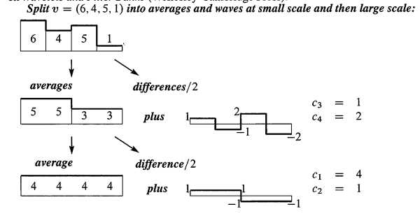

> sp:不懂这幅图是什么意思....

​	
​	

## 2.5 傅里叶变换（DFT) = 变为傅里叶基

> Fourier Transform(DFT) = change to Fourier Basis

一个电机工程师(electrical enigneer)对信号做的第一件事就是进行傅里叶变换.对于有限的向量,我们说的其实是离散傅里叶变换(Discrete Fourier transform),DFT涉及到复数 ($e^{2πi/n}$ 的幂)但是当我们选择n = 4,矩阵是比较小的,唯一涉及到的复数是 $i$ 和 $i^3=−i$.
$$
F = \left[ \begin{array} { c c c c } 1 & 1 & 1 & 1 \\ 1 & i & i ^ { 2 } & i ^ { 3 } \\ 1 & i ^ { 2 } & i ^ { 4 } & i ^ { 6 } \\ 1 & i ^ { 3 } & i ^ { 6 } & i ^ { 9 } \end{array} \right]

\quad \color{orange} \text{Fourier basis } w_1 \text{ to }w_4 \text{in the columns of F}
$$
第一列仍然是那个有用的向量 `(1,1,1,1)`.它代表是的平均信号或者当前电流，其频率是0.第3列是 `(1,-1,1,-1)`，以最高频率交替。傅里叶变换把信号分解为频率均匀分布的波(The Fourier transform decomposes the signal into waves at equally spaced frequencies)

傅里叶矩阵F绝对是数学,科学和工程上最重要的复数矩阵.`<01-10 #3>` 会讨论快速傅里叶变换(FFT):可以看成是把F分解成很多个元素是很多0的矩阵组.FFT变革了整个工业!美丽的事实是,$F^{−1}$ 和 F 很类似,只是 `i` 变成 `-i`

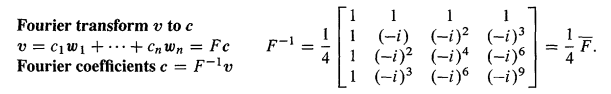

Matlab命令 `c = fft(v)` 产生的是向量v的傅里叶系数 $c_1...c_n$，也就是v 被 $F^{−1}$ 乘 (很快!) 

## 2.6 V32-1：图像压缩

> - 这里是V32的一部分，其他部分总结到合适的地方，请搜索V32即可

信号压缩,图像压缩,本质上就是基变换.本章的主题是线性变换和矩阵的关联,线性变换不需要在坐标系内,而矩阵则把线性变换用坐标的方式表示，**矩阵是基于坐标描述线性变换的.**

首先说图像压缩的基础知识，如课程的录像就是压缩过的,你会看到黑板上的东西很清晰,但如果我来回走动,会需要相当多的字节,我就会被压缩的很厉害.

有些压缩是无损的，只压掉多余的,而我们要讲的是有损压缩。如果是一个`512*512`像素构成的黑白静态图片,那么像素就是灰度值(gray-scale),从0到255,$2^8$ 种可能,8个比特位.这个值可以表示为 $x_i$.每一个像素都有这个值,共有 $512^2$ 个像素,那么我们实际上是对 $R^n$ 中的向量x做操作,n是 $512^2$ !一个图像就是一个向量! 如果是彩色彩图,那么长度就会是这个3倍,因为我们还需要3个值来表示其他信息,长度就是 $3*512^2$,相当大的信息量.所以如果不压缩,根本无法发送这些课程的视频

标准压缩法叫做JPEG,表示联合图像专家组（Joint Photographic Experts Group),原理就是基变换!以上述图片为例，我们有什么样的基呢?可以认为是,每一个像素的每一个值都是标准基的一个分量,那么我们有分量长度为 $512^2$的向量x.有一些像素很相似,如空白黑板上的黑色部分,这使得他们相互关联,这就有压缩的可能性了.

标准基是如下:
$$
\left[\begin{matrix}1\\ \vdots \\0 \\0 \end{matrix} \right] \quad
​​\left[\begin{matrix}0\\ 1 \\\vdots \\0 \end{matrix} \right] \quad \cdots

​​\left[\begin{matrix}0\\ 0 \\\vdots \\1 \end{matrix} \right] \quad
$$
空白黑板就是一副标准基很差的图像, 因为大部分的像素点的灰度值,和相邻的差不多.而标准基根本没有利用这一点。那么怎么利用这一点呢?一个非常好的基向量就是所有元素都为1的向量：
$$
\left[\begin{matrix}1\\ \vdots \\1 \\1 \end{matrix} \right] \quad
​​\left[\begin{matrix} 1 \\\vdots \\ 1 \\-1 \\ \vdots\\-1 \end{matrix} \right] \quad \cdots

​​\left[\begin{matrix}1\\ -1 \\1 \\ -1 \\\vdots \\1 \\ -1 \end{matrix} \right] \quad
$$
注意

- 分量全是1的基向量：这个单一的向量,就能完整的给出这个所有像素基本相同的图像的信息.
- 最后一个向量是一个棋盘向量，1、-1交替出现。如果图像是一个很大的棋盘,一格白一格黑,那么第3个向量就能表示这个棋盘所有信息了
- 更常见的是一半图像暗,另一半亮,这时候第2个向量就是很有用的向量,一半是1一半是-1

如果选择基？归根结底是线性代数的问题,基的选择问题.

提一下JPEG使用的最好的基：傅里叶基!注意，对于512-512的图片，JPEG会做的就是，把图片分解成8-8的小块，每个8-8的小块有64个系数(也就是64个像素)，然后在这个8-8的小块上做基变换，因为一次处理512*512太大了.如下图

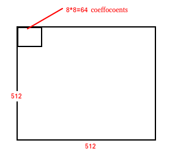

如下是 8-8 的傅里叶基
$$
(参见视频24或27),这里教授没写出来    

\tag{F1}
$$
每一个小块内,有64个系数,64个基向量,64个像素,所以我们是在64维空间中,利用傅里叶向量做基变换,注意,这是无损压缩步骤.

**压缩步骤：**

1. 输入向量x,然后进行基变换,选择一组更好的基,得到系数c.所以输入64个像素,得到64个系数,然后是压缩,这是无损压缩.
2. 我们知道$R^{64}$ 有很多组基,我们已经选了一组,我们用那组基把信号表达出来压缩的时候,就要开始丢失信息了.我们做了什么,一个是我们可以扔掉小的系数,叫做阈值量化(thresholding),我们设定一些阈值,如肉眼看不出区别的阈值.因此压缩之后得到压缩后的一套系数.
3. 经过压缩步骤之后，我们就得到了系数 `c'`,它的分量很多是0。可能 `Eq(F1)` 全是1的基向量很少扔掉，因为它的系数比较大。但类似 `1,-1` 交替出现的基向量就会被扔掉很多，因为它是高频信号(1,-1...变化很大，而类似与 `1...1` 的全1向量就是频率为0).
4. 然后系数 `c'` 重建信号： $x' = \sum c_i'v_i$,但现在这个求和不再是64项，而可能只有2，3项，得到了超过20的压缩比

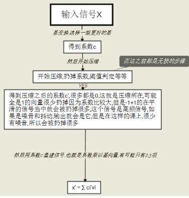

对于视频,可认为是一幅幅静态图像,压缩,然后播放成视频.这不是理想的方法，因为视频是一系列连续图像,一副图像和下一副相当接近,所以得用预估和修正(prediction and correction),你要假设图像都是上一副图,加一点小的修正，得到下一副图.压缩总是用到关联性[correlated],实际上,在时间空间上,物体不会变幻剧烈,而是平滑的变换,所以可以根据前一个值预测下一个值.

再讲一点傅里叶基的竞争对手：小波(wavelets).以8-8为例.如下就是小波基 $w_1...w_8$
$$
\left[\begin{matrix}1\\1\\1\\ 1 \\ 1\\1\\1\\1 \end{matrix} \right]
\left[\begin{matrix}1\\1\\1\\ 1 \\ -1\\-1\\-1\\-1 \end{matrix} \right]
\left[\begin{matrix}1\\1\\-1\\ -1 \\ 0\\0\\0\\0 \end{matrix} \right]
\left[\begin{matrix}0\\0\\0\\ 0 \\ 1\\1\\-1\\-1 \end{matrix} \right]

\qquad

\left[\begin{matrix}1\\-1\\0\\ 0 \\ 0\\0\\0\\0 \end{matrix} \right]
...  \tag{F0}
$$

1. 先是8个1
2. 然后4个1,4个-1,
3. 然后是2个1,2个-1,4个0,
4. 然后4个0,2个1,2个-1
5. 然后1,-1,6个0
6. 后面略

这就是8维空间下的小波基(这个比较简单，还有更精密的小波基).

现在问，对于  `[1,-1...1,-1]` 这样的向量，这么用小波基去表示？其实就是上述小波基后面4个之和。而线代就是要,给定基(如小波基),找出系数 `c'`（上面压缩步骤第3步）。

现在假设使用小波基，然后给定像素值 $P_1 \sim P_8$.要干什么呢? $P_i$都是标准基的**系数**,那么要确定的就是使用小波基表示成组合形式
$$
P = c_1w_1+...+c_8w_8 \tag{F2}
$$
上式就是这是无损变换.要确定的就是那些系数$c_i$.那么怎么求这些 $c_i$ 呢？也就是数，给定8个基向量 $w_1...w_8$ 和一个输入信号 (8个分量的向量)，怎么求用基向量表达这个输入信号的系数？也就是`Eq(F2)`的 $c_i$. Eq(F2) 其实就是方程组啊，我们写成矩阵表示
$$
P =

\underbrace{ \left[\begin{matrix} 
1 & 1 &\cdots\\
1 & 1 & \cdots \\ 
1 & 1 &\cdots \\
1 & 1 &\cdots \\
1 & -1 &\cdots \\
1 & -1 &\cdots \\
1 & -1 &\cdots \\
1 & -1 &\cdots \\

\end{matrix} \right]
}_{ \text{Eq(F0),8-8 wavlets basis Matrix W}} * 

\left[\begin{matrix}c_1\\c_2\\\vdots\\c_8 \end{matrix} \right]
\tag{F3}
$$

小波基组成的矩阵W。终于到了基变换的步骤。求解 $P = Wc$,那么 $c = W^{−1} P$,关键点是：**优秀的基就是能很快的求逆!**性质好的基与如下要求

**1 计算快**。也就是乘以基向量组成的矩阵$W，W^{-1}$要很快。

- 傅里叶基可以快速傅里叶变换（FFT)
- 小波基快速小波变换（FWT)

而且小波矩阵很容易求逆,因为

1. Eq(F0)的基向量，都是由 `1,-1,0` 构成,所以乘法非常快.
2. 它们是正交的!基向量正交!虽然目前不是标准正交的，但化为标准正交也很简单。正交之后，$W^{−1}$ 是多少?,参见 `<01-04>`,如果列向量标准正交,那么逆就是转置!超级快！

**2 性质好**。如果我们不改变基,保持标准基不变,是一点都不菲时间，但是从压缩的角度来看就不好了,因为不能扔掉系数,不能压缩.相反,如果基性质很好,扔掉一些基,比如 $w_5-w_8$ 的系数 $c5 - w_8$,扔掉的只是很少的点.所以第2个要求就是良好的压缩性.也就是说.**少量的基向量，就能很接近信号!**JPEG2000,就是图像压缩的下一个标准,将会包含小波基.

---

### 2.6.1 特征向量作为基

复习一下上节课，假设基 $v_1 \sim v_8$ 表示变换T,要点是,如果我知道作用在8个基向量 $v_1 \sim v_8$ 上的T变换 $T(v_1) \sim T(v_8)$ 是什么,那么我完全了解T.为什么呢？因为T是一个线性变换，而每个向量 x 是基向量 $v_1 \sim v_8$ 的某个组合：

> sp:本段参见V32 40分开始。一直以为讲授讲错了，把新的基和旧的基混合成同一组，但不是啊，这里的意思就是输入、输出基相同的情况下，T变换对应的矩阵

$$
x = c_1v_1 +... + c_8v_8
$$

从而 x 的变换T(x)就是 $T(v_1) \sim T(v_8)$ 的同一个组合
$$
T(x) = c_1T(v_1) +... + c_8T(v_8)
$$
现在问题是，要把变换 $T(v_1) \sim T(v_8)$ 用基 $v_1 \sim v_8$ 表示，也就是
$$
T(v_1) = a_{11}v_1+a_{21}v_2+...+a_{81}v_8\\
T(v_2) = a_{12}v_1+a_{22}v_2+...+a_{82}v_8 \\

\vdots\\
T(v_8) = a_{18}v_1+a_{28}v_2+...+a_{88}v_8
$$
得到矩阵A
$$
A = \left[\begin{matrix} 
a_{11} & \cdots & a_{81}\\
\vdots & \cdots & \vdots\\
a_{81} & \cdots & a_{88}\\
\end{matrix} \right]
$$
也就是说，给定条件

- 一组基
- 一个变换T

然后需要你计算，每个基向量的变换 $T(v_i)$,得到代表变换的系数矩阵A

现在假设 $v_1 \sim v_8$ 是特征向量！那么 $T(v_i)$ 和 $v_i$ 是同向：$T(v_i) = \lambda_i v_i$，那么现在A是什么？特征向量基是完美的基，但会增加计算时间，所以在信号处理当中，人们会说：使用傅里叶基，小波基把，但最好的基是特征向量基

首先我们确认一下A的第一列：取第1个基向量 $v_1$,看看它的变换是什么，其实就是 $T(v_1) = \lambda_1 v_1$,再把 $T(v_1) = \lambda_1 v_1$ 表达为基向量的线性组合，其实 $\lambda_1 v_1$ 已经是基向量的线性组合了，也就是第1个系数是$\lambda_1$，其他都是0 ，所以得到A的第1列就是：
$$
\left[\begin{matrix}\lambda_1\\0\\\vdots\\0\\ \end{matrix} \right]
$$
其他基向量同样如此处理，最终得到 
$$
A = \left[\begin{matrix} 

\lambda_1 & 0 &  &0\\

0 & \lambda_2 &  & 0\\

0 & 0 &  \cdots  & \vdots\\

\vdots & \vdots &  & \lambda_n\\

\end{matrix} \right]
$$
在特征向量基下，矩阵是对角阵！使我们在图像处理当中的完美矩阵，但是求特征向量的代价太大了

> sp:这里可以参见`<#Lk1.4>` 的特征向量为基的例子

## 2.7 总结

1. 如果对于一组基 $v_1...v_n$ 我们知道了 $T(v_1)...T(v_n)$，那么通过线性化，我们可以知道其他所有的 $T(v)$
2. 输入基是 $v_1...v_n$ ，输出基是 $w_1...w_m$ 的线性变换，可由 m-n 的矩阵A表示
3. 如果A,B代表了变换T和S，而且S的输出基是T的输入基，那么矩阵AB代表了变换 T(S(u))
4. (来自V31):**矩阵的逆相当于线性变换的逆!矩阵的乘积相当于线性变换的乘积,实际上矩阵乘法也来源于线性变换!**

## 2.8 典例

**1.** 使用标准基，求一个表示循环排列变换(cyclic permutation) T 的4-4的矩阵P，也就是把 $x = (x_1,x_2,x_3,x_4)$ 变换为 $T(x) = (x_4,x_1,x_2,x_3)$.再求 $T^2$ 的变换矩阵，最后， $T^3(x)$ 是什么变换？为什么 $T^3 = T^{-1}$?

解： 在标准基下，设 $x= (1,0,0,0)$,这是第1个基向量。变换后 $T(x) =(0,1,0,0)$,这是第2个基向量，所以P的第1列是 $(0,1,0,0)$,其他3个列向量也可以如此求，得到
$$
P = \left[ \begin{array} { l l l l } 0 & 0 & 0 & 1 \\ 1 & 0 & 0 & 0 \\ 0 & 1 & 0 & 0 \\ 0 & 0 & 1 & 0 \end{array} \right] \quad \rightarrow P \left[ \begin{array} { l } x _ { 1 } \\ x _ { 2 } \\ x _ { 3 } \\ x _ { 4 } \end{array} \right] = \left[ \begin{array} { l } x _ { 4 } \\ x _ { 1 } \\ x _ { 2 } \\ x _ { 3 } \end{array} \right]
$$
因为使用的是标准基，所以T变换就是乘以P矩阵(sp:这里的意思是输入基和输出基是同1个，所以$T^2,T^3$ 的矩阵都可以直接表达为矩阵的幂）。

- $T^2$ 的矩阵就是 $P^2$,把 $x = (x_1,x_2,x_3,x_4)$ 变换为 $x = (x_3,x_4,x_1,x_2)$
- $T^3$ 的矩阵就是 $P^3$,把 $x = (x_1,x_2,x_3,x_4)$ 变换为 $T^3(x) = (x_2,x_3,x_4,x_1)$

如果对 $T^3$ 再应用一次变换，那么我们回到了原来的x，所以 $T^4$  是Identity transformation,$P^4 = I$.也即是 $P^3 P = I,P^3 = P^{-1}$.

P的实数特征向量是：$\lambda_1 = 1,x_1 = (1,1,1,1);\lambda_2 =-1,x_2 = (1,-1,1,-1)$.T变换对 $x_1$ 无任何改变，但对 $x_2$,它改变了其正负性！(sp:也就是每次变换都乘以-1！）其他2个特征值是 $i,-i$,有 $\lambda_1\lambda_2\lambda_3\lambda_4 = -1$.

注意 $1,-1,i,-i$ 加起来等于迹：0.它们分别是1的4阶根(4th roots),因为 $\det(P - \lambda I)= \lambda^4 - 1$,在复平面，它们分别位于 $0,90,180,270$ 度角！**傅里叶矩阵F就是P的特征向量矩阵！**

---

**2.** 2-2的矩阵有4个 "向量" 作为基：
$$
\boldsymbol { v } _ { 1 } = \left[ \begin{array} { l l } 1 & 0 \\ 0 & 0 \end{array} \right] \quad \boldsymbol { v } _ { 2 } = \left[ \begin{array} { l l } 0 & 1 \\ 0 & 0 \end{array} \right] \quad \boldsymbol { v } _ { 3 } = \left[ \begin{array} { l l } 0 & 0 \\ 1 & 0 \end{array} \right] \quad \boldsymbol { v } _ { 4 } = \left[ \begin{array} { l l } 0 & 0 \\ 0 & 1 \end{array} \right]
$$
设T是转置任何2-2矩阵的线性变换，那么在上面的基作为输入基和输出基的时候，什么矩阵A能表示这样的变换？$A^{-1}$ 是什么？变换 $T^{-1}$ 呢？

解：我们变换4个基得到A的4列,发现矩阵A直接调换了 $v_2,v_3$
$$
\begin{array} { l } T \left( v _ { 1 } \right) = v _ { 1 } \\ T \left( v _ { 2 } \right) = v _ { 3 } \\ T \left( v _ { 3 } \right) = v _ { 2 } \\ T \left( v _ { 4 } \right) = v _ { 4 } \end{array}  

\quad \Rightarrow \quad 
A = \left[ \begin{array} { l l l l } 1 & 0 & 0 & 0 \\ 0 & 0 & 1 & 0 \\ 0 & 1 & 0 & 0 \\ 0 & 0 & 0 & 1 \end{array} \right]
$$
$A^{-1}$ 和A是一样的，$T^{-1}$ 和 T 也是一样的。如果我们转置再转置，得来最初的输入向量。

# 3 对角化和伪逆

> - Diagonalization and the Pseudoinverse

通过选择更好的基,可以产生更好的线性变换矩阵!如果想要矩阵是对角矩阵：

- 第1个方法是把**特征向量作为基**
- 第2个方法是2组不同的基：输入基和输出基不同，也就是SVD当中学习的：左右奇异向量是A的四个基础子空间的**单位正交**基向量。**通过逆转这些输入输出基，我们可以得到A的伪逆**。矩阵 $A^+$ 把向量从 $R^m$ 切换回 $R^n$,也就是把列空间转换为行空间(By reversing those input and output bases, we will find the "pseudoinverse" of A. This matrix $A^+$ sends $R^m$ back to $R^n$ , and it sends column space back to row space.)

**事实上,对A所有的伟大的分解,都可以看成是变基**.但这一节篇幅太小,我们把注意力集中到2个突出的例子:**变换T对应的矩阵A都是对角矩阵:**

>   **1组基情况(<#3.1>)：** 以矩阵A的特征向量同时作为输入、输出基，这时 $S^{-1}AS = \Lambda$,那么在特征向量基下，变换对应矩阵是对角矩阵是 $\Lambda$！此时输出输出基是一样的，而且 `m=n`,矩阵A必须是方阵(但注意有些方阵的没有n个独立的特征向量，不能对角化）。
>
> > sp:矩阵A的特征向量，什么矩阵A？应该理解为标准基下T变换对应的矩阵A！以下是V31视频下网友的总结
> >
> > `<V31总结>`：教授讲解时，提到了以特征向量为基时，线性变换的矩阵是对角阵的结论。
> >
> > 1. 首先，谁的特征向量？不妨说就是线性变换**标准基下对应矩阵的特征向量**。
> > 2. 其次，特征向量和特征值的几何意义是什么？不妨设标准基下的线性变换对应矩阵A，$T(v）=Av$，则A的特征向量表示的就是**线性变换的变换方向**，即向量v旋转伸缩的方向，**特征值就是伸缩的幅度**。那么如果以矩阵A的变换方向（特征向量）作为基构造坐标系，线性变换的旋转伸缩**方向指向了自身，改变的只有幅度**，所以这组基对应的线性变换的作用就是只改变幅度不改变方向，能起到这种作用的线性变换矩阵就是以**特征值为对角的对角阵**。
>
> ---
>
> **2组基情况**(<#3.2>)：基分别是 $A^TA$ 和 $AA^T$ 的特征向量，$U^{-1}AV = \Sigma$,对角矩阵是 $\Sigma$
>
> 此时输入输出基是不一样的.矩阵A可以是矩形的.基是**单位正交**的，因为 $A^T A,AA^T$ 是对称的.那么$U^{−1}= U^T,V^{−1}= V^T$.任何矩阵阵A都是可以的，A的对角形式是 $Σ$,这是`<01-06>` 的SVD知识！

只有当 $A^TA = AA^T$,特征向量的基才是单位正交的。这包括 对称、反对称、和正交(orthogonal)矩阵。此时，$\Sigma$ 当中的奇异值是绝对值 $\sigma_i = |\lambda_i|$,所以 $\Sigma = abs(\Lambda)$.而且当 $A^TA = AA^T$,2种方式的对角化形式是一样的,仅仅是因子可能不同：实数的时候是-1，虚数的时候是 $e^{i\theta}$

提醒一下，GS分解 A=QR 只能给出1组新的基：也就是由Q得到的正交输出基。 而输入基是 `I` 指定的标准基。我们没有得到对角的 $\Sigma$,但我们确实得到了矩形的R，在等式 $A= QRI$,输出基矩阵在左边，输入基矩阵在右边

## 3.2 相似矩阵：A和 $S^{-1}AS$ 和 $W^{-1}AW$

首先从输入输出基相等的时候开始，这会产生 $S,S^{-1}$。

从方阵和1组基：`I` 的列，也就是标准基开始，输入空间 V 是 $R^n$ ，输出空间 W 也是 $R^n$。矩阵是 n-n 的，称为A，线性变换T就是乘以A

- `<01-02>`,我们通过消去化简矩阵是上下三角
- `<01-04>,<01-06>`,我们通过GS正交化和特征向量，把矩阵化为对角(diagonal)

现在我们把A化为 $\Lambda$,这时通过变基完成的：**来自特征向量基的特征值矩阵(Eigenvalue matrix from eigenvector basis)**

提前说一下

1. 当你改变了V的基，矩阵A变为AM。因为V是输入空间，所以矩阵M是在右边的(首先起作用)
2. 当你改变了W的基，矩阵A变为$M^{-1}A$。因为W是输出空间，所以矩阵$M^{-1}$是在左边的(最后起作用)
3. **如果2个空间都变基，那么变换T对应的新矩阵是 $M^{-1}AM$(sp:和原来的A相似,这里说的就是Eq(2)啊）**.而A的特征向量是基的一个非常好的选择，如果2个空间都选择特征向量作为基，这时变换对应的新矩阵为 $S^{-1}AS = \Lambda$！

> **当基是由特征向量 $x_1...x_n$ 组成，T变换对应的矩阵就是 $\Lambda$.**(sp:注意这里输入、输出基都是同一组基：特征向量！)
>
> **原因**：为了得到矩阵的第1列，首先输入第一个基向量 $x_1$.因为变换可被A乘表示，也就是输出结果是 $Ax_1 = \lambda x_1$,这就是 $\lambda_1$ 乘以第1个基向量，加上0乘以其他基向量。因此矩阵的第一列是 $(\lambda_1,0...,0)$.所以，**以特征向量为基，线性变换的矩阵是对角的**

**例1** 把向量投影到直线 y= -x上，向量(1,0)投影为 `(.5,-.5）`;而 `(0,1)` 投影为 (-.5,.5)。如果使用标准基，那么这个投影变换对应的矩阵就是：
$$
\text{1.Standard matrix: Project standard basis} :\quad A = \left[\begin{matrix} .5 & -.5 \\ -.5 & .5 \end{matrix} \right]
$$
现在，使用特征向量基，会得到什么样的对角的 $\Lambda$ 呢？这个投影对应的特征向量是 $x_1= (1,-1),x_2 = (1,1)$.特征值是 $\lambda_1 = 1,\lambda_2 = 0$（sp:这个投影矩阵就是上面的A啊）

- $x_1$ 在 $135^{\circ}$ 直线上，其投影和就是自身 $x_1$
- $x_2$ 和 $x_1$ 垂直，也就是在$45^{\circ}$ 直线上,其投影是 $\vec{0}$

所以使用特征向量做投影的矩阵
$$
\text{2 Diagonalized matrix: Project eigenvectors:} \quad \Lambda =\left[\begin{matrix} 1 & 0 \\ 0 & 0 \end{matrix} \right] 
$$
现在如果使用新的基 $v_1= w_1 = (2,0),v_2 = w_2 = (1,1)$ 作为输入输出空间的基进行投影，这个矩阵B是什么呢？

$w_1$ 不是特征向量，所以这个基下的矩阵B不是对角的。得到B的方法就是 `<#2>` 所讲的方法：**矩阵的列 j 是通过把变换  $T(v_j)$ 写成 w's 的组合**

- 把 T 应用到 $v_1=(2,0)$ 得到 `(1,-1)`,也就是 $w_1- w_2$,所以B的列1是 `1，-1`
- 把 T 应用到 $v_2=(1,1)$ 得到 `(0，0)`,所以B的列2是 (0,0)

所以
$$
\text{3. Third similar matrix: Project }w_1\text{ and } w_2 : \quad  
B = \left[\begin{matrix} 1 & 0 \\ -1 & 0 \end{matrix} \right] \tag{1}
$$
还有一种更精妙的方法求B矩阵：使用 $W,W^{-1}$ 来在标准基和 W 的的基 w's 之间切换！这些**变基矩阵代表着恒等变换**！变换的乘积是 $ITI$

> sp:这个`I`代表恒等变换，由W矩阵表示,也就是发生变基操作

而矩阵的乘积就是 $B=W^{-1}AW$,这意味着 B 相似与 A （B is similar to A）

> 对任何基 $w_1...w_n$ 用3步求的B矩阵的方法：
>
> 1. 使用W将输入基变为标准基(
> 2. 而标准基下变换对应的矩阵是A 
> 3. 使用 $W^{-1}$ ，把输出基再变换回 w's 
>
> 那么， $B = W^{-1} AW$ 代表了变换 `ITI`:
> $$
> B_{\text{w's to w's}} = W^{-1}_{\text{standard to w's}} \quad A_{\text{standard}} \quad W_{\text{w's to standard}} \tag{2}
> $$
>
> ---
>
> sp:注意：
>
> 1. 第1步其实就是`<Lk1.2> Eq(K3)`：先将输入基切换到标准基
> 2. 第2步是用标准基下的变换矩阵A进行变换
> 3. 第3步是`<Lk1.2> Eq(K4)`，将输出基再次切换回去
>
> 整个过程其实就是 `<#Lk1.3>的Eq(K7)`!而Eq(k7)的推导，是同一个空间下的变基，所以本节也是同一个空间下的变基！

**一个变基过程，产生了矩阵当中的相似变换 $W^{-1}AW$ (A change of basis produces a similarity transformation to $W^{-1}AW$ in the matrix)**

---

**例2** 继续例1，使用 $W^{-1}AW$ 的规则来得到矩阵B，注意基 `(2,0),(1,1)` 是W的列

解：
$$
W ^ { - 1 } A W = \left[ \begin{array} { r r } \frac { 1 } { 2 } & - \frac { 1 } { 2 } \\ 0 & 1 \end{array} \right] \left[ \begin{array} { r r } \frac { 1 } { 2 } & - \frac { 1 } { 2 } \\ - \frac { 1 } { 2 } & \frac { 1 } { 2 } \end{array} \right] \left[ \begin{array} { l l } 2 & 1 \\ 0 & 1 \end{array} \right] = \left[ \begin{array} { r r } 1 & 0 \\ - 1 & 0 \end{array} \right] .
$$

这和 Eq(1) 的矩阵B是一样的，矩阵AB是相似的，它们有相同的特征值（1，0），而且 $\Lambda$ 也是相似的

注意一下，投影矩阵还是有性质 $A^2 = A,B^2 = B,\Lambda^2 = \Lambda$。

### V32-2

> - V32-2:其实讲的就是同一个变换T对应的矩阵，在同一空间下不同基的联系，也就是相似矩阵！还是`<#Lk1.3>`的内容！

现在回到数学上面来.基表换,就一个基上的向量,想要变换成不同基上的向量.假设W的列是新的基向量,1个旧基向量下的x,转换成新基向量下的c,关系就是
$$
x_{\text{old basis}} = Wc_{\text{new basis}} \tag{F4}
$$
矩阵W给出了一个基变换.

假设已知线性变换T(是对于n-n矩阵),假设其是从8维空间到8维空间的变换.现在引入矩阵。 

1. 第一组基, $v_1-v_8$,得到矩阵A
2. 第二组基,$w_1-w_8$,得到矩阵B

那么A,B之间是什么关系呢?变换T是已知的,比如旋转。不管线性变换是什么，我们得知道，AB表示同一个变换T，AB之间肯定有某种联系。它们是相似的！也就是说:
$$
B = M^{−1} AM \tag{F5}
$$
M就是变基矩阵(change of basis matrix).发生基变换，会发生2件事情

1. 每个向量都有了新坐标，也就是 Eq(F4),这就是新旧坐标之间的关系.
2. 不同基的下的同一个变换对应的矩阵不一样,它们的联系就是Eq(F5),其中 **Eq(F5)当中的M，就是 Eq(F4) 的W**(sp:M,W就是Eq(K7)的C啊)

## 3.3 SVD

如果输入基 $v_1...v_n$ 和输出基 $u_1...u_m$ 不同，实际上甚至输入空间 $R^n$ 和输出空间 $R^m$ 都是不一样的。最好的矩阵还是对角的(但现在是m-n)。为了得到对角的矩阵 $\Sigma$,每**一个**输入向量 $v_j$,必须变换为输出向量 $u_j$ 的一个数乘，这个乘数就是 $\Sigma$ 主对角线上的奇异值 $\sigma_j$：
$$
A v _ { j } = \left\{ \begin{array} { l l } \sigma _ { j } u _ { j } & \text { for } j \leq r \\ 0 & \text { for } j > r \end{array} \quad \right. \text { with orthonormal bases. }
\tag{3}
$$
奇异值的排序是 $\sigma_1 \ge \sigma_2 \ge ... \sigma_r$.秩r出现在这里，是因为根据定义，奇异值是不为0的。上式值得注意的是，当 $j=r+1...n$,$v_j$ 是在A的零空间的。这就给出了正确的零空间的基向量个数：n-r

现在把矩阵和它们所代表的线性变换联系起来。$A，\Sigma$ 代表了同一个变换，只是使用的基不同：

- $A = U\Sigma V^T$ 使用了 $R^n,R^m$ 下的标准基;
- 对角的 $\Sigma$ 使用了输入基 v's 和输出基 w's;

正交矩阵V,U导致了基的改变，它们代表 $R^n,R^m$ 下的恒等变换。变换的乘积是 `ITI`，这个变换由v's和u's的基的 $\Sigma = U^{-1}AV$ 表示。

v's和u's的基下的 $\Sigma$ 由标准基下的A通过 $U^{-1}AV$ 而得来：
$$
\Sigma_{\text{v's to u's}} = U^{-1}_{\text{standard to u's}} \quad A_{\text{standard}} \quad V_{\text{v's to standard}} \tag{4}
$$
> sp:这其实就是：1：乘以V矩阵得到AV，将输入基从v's变换到标准基； 2：用标准基下的A做变换；3：$U^{-1}$ 再去乘，将输出基变换回u's。  所以这个过程类似与Eq(2,F5),只是不再是相似矩阵

SVD选择了标准正交基 ($U^{-1} = U^T,V^{-1} = V^T$) ，从而对角化了A。

SVD下的2组标准正交基来自于 $A^TA$ (v's) 和 $AA^T$ (u's) 的特征向量，因为它们都是对称矩阵，所以它们的单位特征向量是标准正交的。它们的特征值是 $\sigma_j^2$. `<01-06 #7>` 的Eq(10),Eq(11)证明了这些基可以把标准基下的A化为 $\Sigma$

> sp:注意这一小节的意思，是说，标准基下的变换对应的矩阵是A,但如果把输入基变为 v's，输出基变为 u's，那么变换对应的矩阵就是对角的 $\Sigma$

## 3.4 极坐标分解

> - Polar decomposition
> - 完全不知道这节在干啥

每个复数都有极坐标形式 $re^{i\theta}$:一个非负的数字r乘以单位圆上的一个数字(回忆一下， $|e^{i\theta}| = |\cos \theta + i \sin \theta | = 1$).把复数项想象为一个1-1矩阵

-  $r\ge 0$ 对应一个半正定矩阵，称为H
-  $e^{i\theta}$ 对应一个正交矩阵Q

极坐标分解把这个因子分解扩展到了矩阵：正交  * 半正定：A = QH

每一个实数方阵，都可以分解为 $A= QH$

- Q是正交矩阵
- H是对称半正定矩阵(如果A是可逆的，H正定）

证明只需要将 $V^TV = I$ 插入到SVD的中间
$$
\text{Polar decomposition:}\quad A = U \Sigma V ^ { \mathrm { T } } = \left( U V ^ { \mathrm { T } } \right) \left( V \Sigma V ^ { \mathrm { T } } \right) = ( Q ) ( H ) .

\tag{5}
$$
第1个因子 $UV^T$ 是Q，2个正交矩阵的乘积结果也是正交矩阵。第2个因子 $V\Sigma V^T$ 是H，它是半正定矩阵，因为它的特征值都在 $\Sigma$.如果A是可逆的，那么$\Sigma,H$也是可逆的.H是**对称正定矩阵，等于 $A^TA$ 的平方根，也就是 $H^2 = V\Sigma^2V^T = A^TA$**

极坐标还有另外一种形式：A = KQ，Q还是正交的，但 $K=U\Sigma U^T$,它是 $AA^T$ 的对称正定的平方根。

**例3** 求如下 `<01-06 #7>` 出现过的SVD的 A = QH的极坐标分解
$$
A = \left[ \begin{array} { r r } 2 & 2 \\ - 1 & 1 \end{array} \right] = \left[ \begin{array} { l l } 0 & 1 \\ 1 & 0 \end{array} \right] \left[ \begin{array} { l l } \sqrt { 2 } & \\ & 2 \sqrt { 2 } \end{array} \right] \left[ \begin{array} { r r } - 1 / \sqrt { 2 } & 1 / \sqrt { 2 } \\ 1 / \sqrt { 2 } & 1 / \sqrt { 2 } \end{array} \right] = U \Sigma V ^ { \mathrm { T } }
$$
解： 
$$
\begin{array} { l l } \text { Orthogonal } & Q =UV^T= \left[ \begin{array} { l l } 0 & 1 \\ 1 & 0 \end{array} \right] \left[ \begin{array} { r r } - 1 / \sqrt { 2 } & 1 / \sqrt { 2 } \\ 1 / \sqrt { 2 } & 1 / \sqrt { 2 } \end{array} \right] = \left[ \begin{array} { r r } 1 / \sqrt { 2 } & 1 / \sqrt { 2 } \\ - 1 / \sqrt { 2 } & 1 / \sqrt { 2 } \end{array} \right] \\ 

\text { Positive definite } & H =V\Sigma V^T= \left[ \begin{array} { l r } 1 / \sqrt { 2 } & - 1 / \sqrt { 2 } \\ 1 / \sqrt { 2 } & 1 / \sqrt { 2 } \end{array} \right] \left[ \begin{array} { r r } 2 & 2 \\ - 1 & 1 \end{array} \right] = \left[ \begin{array} { l l } 3 / \sqrt { 2 } & 1 / \sqrt { 2 } \\ 1 / \sqrt { 2 } & 3 / \sqrt { 2 } \end{array} \right] . \end{array}
$$
注意，$H = Q^{-1}A = Q^TA$（因为Q正交）

在力学(mechanics)当中，极坐标分解把Q当中的旋转(rotation)和H当中的伸展(stretching)分离开来。H的特征值是A的奇异秩，它们给出了伸展因子(stretching factor)。H的特征向量是 $A^TA$ 的特征向量，它们给出了伸展方向(stretching direction)，也就是主轴(the principal axes)，然后Q绕着这些轴旋转

极坐标分解把关键等式 $Av_i = \sigma_i u_i$ 以2个步骤分解：

- H部分把 $\sigma_i$ 乘以$v_i$
- The"Q" part swings $v_i$ around into $u_i$

## 3.5 左右逆和伪逆

> The Pseudoinverse

### V33-1 左右逆

在`<01-02>`,我们学习，双边逆的意思是 $AA^{-1} = I = A^{-1}A$。 这时，矩阵列数：n,行数m，秩r的关系是：r=m=n,也就是矩阵满秩。零空间只有0向量

在`<01-03>`,我们开始讨论矩阵不满秩的情况：

当列满秩，列向量线性无关，r=n，这时候零空间只有0向量，Ax=b有0或1个解，此时 $A^TA$ 是n-n的，而且满秩可逆，此时A存在左逆：
$$
\underbrace{(A^TA)^{-1} A^T}_{\quad \color{orange} A^{-1}_{left}}  A =  I 
\\

[n-m ] * [m-n] = [n-n]
$$
但注意 $AA^T$ 是不可逆的。注意，如果左逆 $(A^TA)^{-1} A^T$ 在右边，也就是 $A * (A^TA)^{-1} A^T$,结果是什么？投影矩阵P（`<01-04 #2.2> Eq(7)`）！是列空间的投影。一个投影矩阵，会尽量靠近单位矩阵！它的投影结果想尽可能的接近列空间！

当行满秩，行向量线性无关，r=m，这时候 $A^T$ 的零空间只有0向量，A的有n-m个自由变量，Ax=b一定有无穷多解，A的右逆是：
$$
A\underbrace{A^T(AA^T)^{-1}}_{\quad \color{orange} A^{-1}_{right}}   =  I
$$
如果此时把右逆 $A^T(AA^T)^{-1}$ 放在左边，得到 $A^T(AA^T)^{-1} * A$,这是什么？也是投影矩阵！投影到行空间上，也是尽可能靠近单位矩阵，投影结果尽可能靠近行空间

> sp:为什么右逆放在左边是投影到行空间呢？注意观察：$A^T(AA^T)^{-1} * A$ 当中，把$A^T$ 换为B，得到 $B(B^TB)^{-1} * B^T$,这就是`<01-04 #2.2> Eq(7)`啊，只是现在B代表$A^T$ ，所以是行空间！

### 伪逆

> **V33-2**:左、右逆是列、行满秩的时候才能出现。一般情况下，对r<n，r<m 的一个常规矩阵来说，它合理逆是什么呢？
>
> 行空间的一个向量x有n个分量，A乘以它，也就是Ax，结果是列空间的向量。而且，A乘以行空间的**所有**向量，得到的恰好就是列空间的**所有**向量。也就是，**行空间的向量x，和列空间的向量Ax,是一一对应的。**(最起码，因为行列空间都是r维，所以这个可能性是存在的)。而且，矩阵A有零空间存在，Ax将产生0向量，而所有的向量都是与行空间分量+零空间分量组成的，乘法Ax会消去零空间分量。而当我们只看行空间向量，Ax乘法会把它们变换到列空间向量。我这里的意思是:
>
> > `Mark1:`x,y是行空间的**不同**向量，和A乘得到Ax,Ay.  Ax和Ay肯定是**不同**的**列空间**向量.
>
> 从行空間到列空間，A是完美的映射。換句話說，**如果限制在這2個r维空間，A是可逆的**(sp:因爲是單射啊),这就是所謂的伪逆。也就是说：
>
> - 从行空间的x到列空间的Ax，矩阵A起作用,A消除了x向量的零空间部分
> - 从列空间空间的Ax回到行空间的x，矩阵$A^+$起作用:$x= A^+(Ax)$，$A^+$ 消除了 $A^T$ 的零空间部分
>
> **证明**:假设 `Mark1`这句话是错误的，也就是 `Ax= Ay`,会发生什么？也就是 $A(x-y)= 0$,也就是 x-y 是零空间向量。前面说过，x,y都是行空间向量，所以x-y也必须在行空间向量。现在 x-y 既是行空间向量，也是零空间向量，只能是0向量。从而x = y。也就是说，如果Ax =Ay,那么x必须等于y。得证
>
> 所以矩阵$A$是很好的，它是从行空间到列空间的**可逆**映射。它的逆叫做伪逆。那么如何求出伪逆 $A^+$?**SVD！**
>
> 在SVD当中，有 $A = U\Sigma V^T$,$\Sigma$ 是对角的，它的形式如下：
> $$
> \Sigma = \left[ \begin{array} { c c c c c} \sigma _ { 1 } & & & & \\  & \ddots & & & \\ & & \sigma _ { r }  &\\ & & & 0 
> & \\
> 
> & & & & \ddots\end{array} \right]
> $$
> 现在问你，**m-n** $\Sigma$ 的伪逆是什么？它的秩是r，这是伪逆最简单的情况。
> $$
> \Sigma^+ = \left[ \begin{array} { c c c c c} 
> 
> 1/\sigma _ { 1 } & & & & \\  & \ddots & & & \\ & & 1/\sigma _ { r }  &\\ & & & 0 
> & \\
> 
> & & & & \ddots\end{array} \right]
> $$
> 注意它的尺寸是 **n-m**。现在看看
> $$
> \Sigma \Sigma^+ = 
>  \left[ \begin{array} { c c c c c} 
> 
> 1 & & & & \\  & \ddots & & & \\ & & 1  &\\ & & & 0 
> & \\
> 
> & & & & \ddots\end{array} \right]_{m-m}
> $$
> 这是到**列空间的投影**。而
> $$
> \Sigma^+ \Sigma = 
>  \left[ \begin{array} { c c c c c} 
> 
> 1 & & & & \\  & \ddots & & & \\ & & 1  &\\ & & & 0 
> & \\
> 
> & & & & \ddots\end{array} \right]_{n-n}
> $$
> 这是到**行空间的投影**。
>
> 这就是伪逆所做的事情：左乘，右乘它，虽然都得不到单位矩阵，但它把你代入2个很好的空间：行空间和列空间
>
> ---
>
> 现在回到  $A = U\Sigma V^T$, 
>
> - $V^T$ 是一个正交矩阵，它的逆是 V 
> - $\Sigma$ 的伪逆是 $\Sigma^+$
> - U的逆是 $U^T$
>
> 所以 $A^+ = V\Sigma^+U^T$。 
>

通过选择合适的基，A乘以行空间当中的$v_i$ ，可以得到列空间当中的 $\sigma_i u_i$ ,而且有一个**特殊的** $A^{+}$ 可以逆转这个过程！也就是：如果 $Av = \sigma u$,那么 $A^{+} u= v/\sigma$.$A^{+}$ 的奇异值是 $1/\sigma$,就像 $A^{-1}$ 的特征值是 $1/\lambda$.

这个乘以 $u_i$ 来产生 $v_i/\sigma_i$ 的矩阵确实存在，它为伪逆 $A^+$:
$$
A^+_{\text{n by m}} = V\Sigma^+U^T =  
 
\underbrace{ \left[ v _ { 1 } \cdots v _ { r } \cdots v _ { n } \right] }_{\text{n by n}}
 
\underbrace{ \left[ \begin{array} { c c c } \sigma _ { 1 } ^ { - 1 } & & &\\ & \ddots & &\\ & & \sigma _ { r } ^ { - 1 } & \\ & & & 0\end{array} \right] }_{\text{n by m}}
 
\underbrace{ \left[ u _ { 1 } \cdots u _ { r } \cdots u _ { m } \right] ^ { \mathrm { T } }}_{\text{m by m}}
 
 
 \qquad \color{orange} \text{Pseudoinverse}
$$
- 如果A可逆( $A^{-1}$ 存在)，那么 $A^+$ 就是 $A^{-1}$,这时是 m = n = r。 求逆就是逆 $U\Sigma V^T$ 得到 $V\Sigma^{-1}U^T$
- 而如果 `r<m` 或 `r<n`. 那么A没有双边逆，但它一定有秩为 r(和A一样) 的伪逆 $A^+$

$$
A ^ { + } \boldsymbol { u } _ { i } = \frac { 1 } { \sigma _ { i } } v _ { i } \quad \text { for } i \leq r \quad \text { and } \quad A ^ { + } { u } _ { i } = \vec { 0 } \quad \text { for } i > r
$$
被A乘后，A列空间当中的向量 $u_1...u_r$ 回到了行空间的向量 $v_1...v_r$,而行空间的其他向量$u_{r+1}...u_m$ 位于左零空间，$A^+$ 把它们消除为0！当我们知道了每个基向量 $u_i$ 发生了什么，我们就知道了 $A^+$

注意对角矩阵 $\Sigma$ 的伪逆 $\Sigma^+$,它就是 $\Sigma$ 对角线的 $\sigma$ 替换为 $\sigma^{-1}$.乘积 $\Sigma^+\Sigma$ 是尽可能接近单位矩阵的(它是一个投影矩阵,部分是`I`,部分是0)，它有r个1，其他都是0.如下例子展示 $\sigma_1 = 2,\sigma_2 =3$
$$
\Sigma ^ { + } \Sigma = \left[ \begin{array} { c c c } 1 / 2 & 0 & 0 \\ 0 & 1 / 3 & 0 \\ 0 & 0 & 0 \end{array} \right] \left[ \begin{array} { l l l } 2 & 0 & 0 \\ 0 & 3 & 0 \\ 0 & 0 & 0 \end{array} \right] = \left[ \begin{array} { l l l } 1 & 0 & 0 \\ 0 & 1 & 0 \\ 0 & 0 & 0 \end{array} \right] = \left[ \begin{array} { l l } I & 0 \\ 0 & 0 \end{array} \right] .
$$
伪逆是 n-m 的矩阵，它让 $AA^+,A^+A$ 成为投影矩阵：

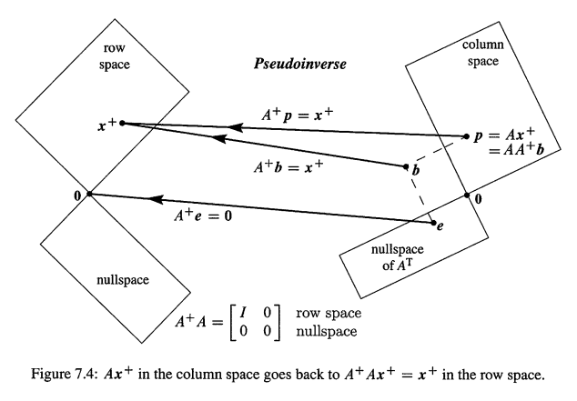

> **sp:mark7.3-1**
>
> - $AA^+$ = 投影到A列空间的投影矩阵
> - $A^+A$ = 投影到A行空间的投影矩阵

> sp:Fig7.4什么意思？首先要明白A的作用，下图来自 `<01-04 #1>`  Fig4.2
>
> 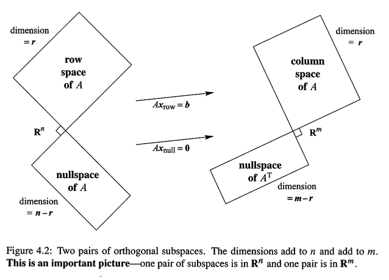
>
> A的作用是
>
> - 将行空间的向量 $x_r$ 转换为列空间向量
> - 将行空间的向量 $x_n$ 变为0
>
> 而任何向量 $R^n$ 的向量 x 都是行空间和零空间向量的组合(行、零空间构成正交补(`<01-04 #2>`)).所以A作用是**将任何 $R^n$ 下的向量切换到 $R^m$ 下的向量**
>
> 在Fig7.4当中，列空间和$A^T$ 零空间是正交补，向量b可拆分成列空间分量p(也就是列空间投影p)和$A^T$ 零空间分量e（投影产生的误差e）
>
> 1. 投影p在列空间，可由矩阵A乘以行空间的 $x^+$ 得来，也就是 $p = Ax^+$
> 2. 而伪逆$A^+$ 可以把 p 切换为回去行空间，也就是 $A^+p = x^+$
> 3. $A^+b = x^+$ 是因为，$A^+$ 消去 $A^T$ 零空间的误差e
>
> ---
>
> 但 `sp:mark7.3-1` 怎么理解？真的有点难以理解，参见
>
> https://math.stackexchange.com/questions/3025109/projection-matrices-mathbfa-mathbfa-and-mathbfa-mathbfa
> https://math.stackexchange.com/questions/2209379/singular-value-decomposition-proof/2211001#2211001
> https://en.m.wikipedia.org/wiki/Moore%E2%80%93Penrose_inverse#Projectors
> https://math.stackexchange.com/questions/578376/least-square-with-homogeneous-solution?noredirect=1&lq=1
> https://math.stackexchange.com/questions/3888531/prove-aa-projects-onto-the-column-space-of-a

**例4** 求r=1,不可逆矩阵 $A = \left[\begin{matrix} 2 & 2 \\ 1 & 1 \end{matrix} \right]$ 的伪逆,它唯一的特征值是 $\sqrt{10}$，它在 $\Sigma^+$ 中被逆为 $1/\sqrt{10}$
$$
A ^ { + } = V \Sigma ^ { + } U ^ { \mathrm { T } } = \frac { 1 } { \sqrt { 2 } } \left[ \begin{array} { r r } 1 & 1 \\ 1 & - 1 \end{array} \right] \left[ \begin{array} { c c } 1 / \sqrt { 10 } & 0 \\ 0 & 0 \end{array} \right] \frac { 1 } { \sqrt { 5 } } \left[ \begin{array} { r r } 2 & 1 \\ 1 & - 2 \end{array} \right] = \frac { 1 } { 10 } \left[ \begin{array} { l l } 2 & 1 \\ 2 & 1 \end{array} \right]
$$
$A^+$ 的秩也是1，它的列空间是A的行空间。A乘以行空间的向量 (1,1），会得到列空间的 (4,2).而 $A^+$ 则逆转了这个过程：$A^+(4,2) = (1,1)$

任何秩1矩阵都是一列乘以一行。对于单位向量 $u,v$,这就是 $A = \sigma uv^T$.此时这个秩1矩阵最佳的秩1逆是 ：$A^+ = vu^T/\sigma$.乘积 $AA^+$ 是 $uu^T$,投影到经过`u`的直线上;乘积 $A^+A$ 是 $vv^T$

#### 伪逆和最小二乘应用

在 `<01-02>`,我们通过最小二乘，探讨了在 Ax = b无解的情况下，求得一个最佳解 $\hat{x}$.关键等式就是 $A^TA\hat{x} = A^Tb $,但注意，这是假设 $A^TA$ 是可逆的。

如果A有非独立的列(r<n),那么 $A^TA\hat{x} = A^Tb $ 可能有非常多的解，而**最佳的解就是来自于伪逆的 $x^+ = A^+b$.** 可以检查一下：$A^TAA^+b = A^Tb$,参见上图Fig7.4，展示了 $e = b - AA^+b$,是b在 $A^T$ 的零空间的部分。任何在A的零空间当中的向量都可以被加到 $x^+$,产生 $A^TA\hat{x} = A^Tb $ 的**额外**一个解，但 $x^+$ 是所有 $\hat{x}$ 里面最短(shortest)的(书本习题16）： **Ax =b 的最短的最小二乘解是 $x^+ = A^+b$**

伪逆 $A^+$ 和最佳解 $x^+$ 在统计学经常出现。统计学家很喜欢伪逆，因为它们经常使用最小二乘。在统计中，不断做实验的时候，列，行很可能不是线性无关的，这时候就无法使用左右逆，这时候就需要伪逆了！

这就是SVD的神奇之处！

## 3.6 总结

1. 对角化 $S^{-1}AS = \Lambda$ 等价于变换到特征向量基
2. SVD选择v's作为输入基，u's作为输出基，这些标准正交的基对角化了A，也就是 $Av_i = \sigma_i u_i$,矩阵形式就是 $A = U\Sigma V^T$
3. 极坐标分解把A分解为QH，也就是旋转的 $UV^T$ 乘以伸展的 $V\Sigma V^T$
4. 伪逆 $A^+ = V\Sigma^+U^T$ 把A的列空间转换回行空间，$A^+A$ is the identity on the row space (and zero on the nullspace)  

## 3.7 典例

**1.** 

- 如果A列满秩(r=n),那么它有一个左逆 $C = (A^TA)^{-1}A^T$,矩阵C可得 $CA = I$.解释一下为何此时 $A^+= C$.
- 如果A行满秩(r=m),那么它有一个右逆 $B = A^T(AA^T)^{-1}$,矩阵B可得 $AB = I$.解释一下为何此时 $A^+= B$.

对于如下矩阵，求$A_1$ 的右逆B,$A_2$ 的左逆C，同时求出 $A_1,A_2,A_3$ 的伪逆 $A^+$
$$
A _ { 1 } = \left[ \begin{array} { l } 2 \\ 2 \end{array} \right] \quad A _ { 2 } = \left[ \begin{array} { l l } 2 & 2 \end{array} \right] \quad A _ { 3 } = \left[ \begin{array} { l l } 2 & 2 \\ 2 & 2 \end{array} \right]
$$
解：如果A列满秩，那么 $A^TA$ 是可逆的(`<01-04 #2>`)，那么，明显的，$CA = (A^TA)^{-1}A^T * A = I$,如果调换乘法顺序，得到 $AC =  A*(A^TA)^{-1}A^T$,这是一个列空间的投影矩阵(还是 `<01-04 #2>` 知识点。所以C满足了$A^+$ 的要求。而且CA，AC都是投影！

如果A行满秩，那么 $AA^T$ 是可逆的，这时 $AB = A * A^T(AA^T)^{-1} = I$.如果调换乘法顺序，得到 $BA = A^T(AA^T)^{-1} * A$  ,是行空间的投影矩阵
$$
\boldsymbol { A } _ {1} ^ { + } = \left( A _ { 1 } ^ { \mathrm { T } } A _ { 1 } \right) ^ { - 1 } A _ { 1 } ^ { \mathrm { T } } = \frac { 1 } { \sqrt { 8 } } \left[ \begin{array} { l l } 2 & 2 \end{array} \right] \quad A _ { 2 } ^ { + } = A _ { 2 } ^ { \mathrm { T } } \left( A _ { 2 } A _ { 2 } ^ { \mathrm { T } } \right) ^ { - 1 } = \frac { 1 } { \sqrt { 8 } } \left[ \begin{array} { l } 2 \\ 2 \end{array} \right]
$$
注意 $A_1^+A_1= [1],A_2A_2^+ = [1]$,但秩1的 $A_3$ 没有左逆、右逆，因为它不满秩。它的伪逆是 $A_3^+ = \sigma _ { 1 } ^ { - 1 } v _ { 1 } u _ { 1 } ^ { \mathrm { T } } = \left[ \begin{array} { l l } 1 & 1 \\ 1 & 1 \end{array} \right] / 4$

# 4 Lk1:导入

> 线性变换的概念不复杂，但是一定要理清楚是什么意思。特别是对于
>
> - 变基矩阵
> - 线性变换矩阵
>
> 等需要搞清楚概念。本节导入摘抄 [可汗学院](https://www.khanacademy.org/math/linear-algebra/alternate-bases/change-of-basis/v/linear-algebra-coordinates-with-respect-to-a-basis) 等知识点，和自己的一些理解，方便后文理解阅读

## 4.1 基下的坐标

> coordinate with respct to a basis

设V是 $R^n$ 下的一个子空间,而 $B=\{v_1...v_k\}$ 是V的一组基,所以V是一个k维的子空间,**k最大是n,但可能比n小**。 所以,任何 $\vec{a} \in V$,都可以用B基表示.也就是

$$
\vec{a} \in V = c_1\vec{v_1}+...+ c_k \vec{v_k}
=
\underbrace{
\left[ \begin{array}{c} | & & | \\ 

v_1 & \dots & v_k
\\
| & & |
\end{array} \right]
}_{\color{orange}\text{基矩阵C}}

\left[ \begin{array}{c} c_1 \\ \vdots \\ c_k\end{array} \right]

\tag{K1}
$$
现在 $c_1...c_k$ 就是**向量 a 在基B下的坐标(coordinate of a with respect to B)**,并且这个坐标写成 :
$$
[\vec{a}]_B = \left[ \begin{array}{c} c_1 \\
\vdots \\ c_k\end{array} \right]
\tag{K2}
$$
设 $\vec{v_1} =  \left[ \begin{array}{c} 2 \\1\end{array} \right],\vec{v_2} =  \left[ \begin{array}{c} 1 \\2\end{array} \right]$,那么 $B= \{v_1,v_2\}$ 是 $R^2$ 下的一组基(因为它们线性独立).现在对于 $\vec{a} = 3v_1 + 2v_2 = \left[ \begin{array}{c} 8 \\7\end{array} \right]$,如下图,还是可以画出向量a,注意是如何确定a的位置的,也就是横坐标8个单位,纵坐标7个单位(sp:这样做,其实隐含还是以标准基去定位)

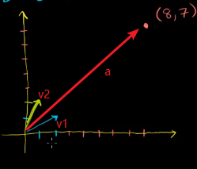

但此时,a在基B下的坐标是 $[a]_B =  \left[ \begin{array}{c} 3 \\2\end{array} \right] $.也就是说,3倍的 $v_1$ 加上2倍的 $v_2$,肯定是在上图的 `(8,7)` 位置.

以前我们说的坐标,都隐含是关于标准基的,,在标准基下的坐标也成为**标准坐标(standard coordinate)**,现在有不同的基,**而且不同的基下,同一个向量的坐标不一样.** 向量 a,在标准基下**直接写为 $\vec{a}$,** 在**基B下写为 $[\vec{a}]_B$**.

## 4.2 变基和变基矩阵

> change of basis ,change of basis matrix

### 4.2.1 非标准基到标准基

现在思考,假设给出了 `Eq(K2)` 的 $[\vec{a}]_B$,和表示基B的矩阵 C (`Eq(K1)` 的C矩阵).那么怎么得到在标准基下的坐标 $\vec{a}$ 呢?就是把`Eq(K1)` 的基矩阵C乘以 $[\vec{a}]_B$!
$$
C [\vec{a}]_B = \vec{a} 
\tag{K3}
$$
右边的 $\vec{a}$ 表示向量 a 在标准基下的坐标,所以**矩阵C称为变基矩阵(有的也叫转移矩阵，transition matrix)**! 听起来有点难以理解,其实**C矩阵就是基B作为列的矩阵**

分析一下Eq(K3)是怎么得来的。对于 $R^2$ 下标准基，我们有
$$
\vec { v }  = \left[ \begin{array} { l }  v_1\\ v_2\end{array} \right]  
= v_{ 1 } \left[ \begin{array} { l } 1 \\ 0 \end{array} \right] + \vec { v } _ { 2 } \left[ \begin{array} { l } 0 \\ 1 \end{array} \right] 
= v _ { 1 } \vec { i } + v _ { 2 } \vec { j } 
$$
但 $R^2$ 可以有其他的基，从而向量v在这个基下的坐标就不相同了。设新的基是 $\begin{array} { c }  \vec { u } _ { 1 } = \left[ \begin{array} { l } 1 \\ 2 \end{array} \right] \quad \vec { u } _ { 2 } = \left[ \begin{array} { l } 3 \\ 3 \end{array} \right]  \end{array}$， 在新的基下 $\vec { v } = v _ { 1 } ^ { \prime } \vec { u } _ { 1 } + v _ { 2 } ^ { \prime } \vec { u } _ { 2 } $；其中 $v_1',v_2'$ 就是在**新的基下的坐标**。 虽然变基了，但**还是同一个向量**，也就是说，如下2个等式相等
$$
v _ { 1 } ^ { \prime } \vec { u } _ { 1 } + v _ { 2 } ^ { \prime } \vec { u } _ { 2 }  = v _ { 1 } \vec { i } + v _ { 2 } \vec { j }  
\tag{N1}
$$

> `sp-note-N1`：注意 `Eq(N1)` 就是 `<sp-mark7.2-5>` 处，变基矩阵定义的意思**。变基矩阵也是一种变换：恒等表换，但变换后，向量在标准基下的坐标是不变的**。

而新的基 $u_1,u_2$ 也可以表示为标准基下的向量：
$$
\begin{array} { r } 
\vec { u } _ { 1 } = 1\left[ \begin{array} { l } 1 \\ 0 \end{array} \right] + 2 \left[ \begin{array} { l } 0 \\ 1 \end{array} \right] = 1\vec { i } + 2 \vec { j} \\ 

\vec { u } _ { 2 } = 3 \left[ \begin{array} { l } 1 \\ 0 \end{array} \right] + 3 \left[ \begin{array} { l } 0 \\ 1 \end{array} \right] = 3 \vec { i } + 3 \vec { j } 
\end{array}
$$
现在，把上式代入 `Eq(N1)`:
$$
v _ { 1 } ^ { \prime } \vec { u } _ { 1 } + v _ { 2 } ^ { \prime } \vec { u } _ { 2 } = v _ { 1 }  \vec { i } + v _ { 2 } \vec { j} \\ 

\Downarrow\\

v _ { 1 } ^ { \prime } ( \vec { i } + 2 \vec { j } ) + v _ { 2 } ^ { \prime } ( 3 \vec { i } + 3 \vec { j } ) = v _ { 1 } \vec { i } + v _ { 2 }\vec{j} \\ 

\Downarrow（提取i,j）\\

\left( v _ { 1 } ^ { \prime } + 3 v _ { 2 } ^ { \prime } \right) \vec { i } + \left( 2 v _ { 1 } ^ { \prime } + 3 v _ { 2 } ^ { \prime } \right) \vec { j } = v _ { 1 } \hat { \imath } + v _ { 2 }\vec{j}
$$
也就是
$$
\left[ \begin{array} { c } v _ { 1 } ^ { \prime } + 3 v _ { 2 } ^ { \prime } \\ 2 v _ { 1 } ^ { \prime } + 3 v _ { 2 } ^ { \prime } \end{array} \right]
= \left[ \begin{array} { l l } 1 & 3 \\ 2 & 3 \end{array} \right] \left[ \begin{array} { l } v _ { 1 } ^ { \prime } \\ v _ { 2 } ^ { \prime } \end{array} \right]
= \left[ \begin{array} { l } v _ { 1 } \\ v _ { 2 } \end{array} \right] 
\qquad \color{orange} \vec{v} = C\vec{v}'
\tag{N2}
$$

注意，**这个C矩阵就是空间$R^2$以基B的基向量 $u_1,u_2$ 作为列的矩阵，也就是 `Eq(k3)` 的C矩阵！**

---

**例K1** 现在，设
$$
\vec { v } _ { 1 } = \left[ \begin{array} { l } 1 \\ 2 \\ 3 \end{array} \right] \quad \vec { v } _ { 2 } = \left[ \begin{array} { l } 1 \\ 0 \\ 1 \end{array} \right]，B=\{v_1,v_2\},[\vec{a}]_B= \left[\begin{matrix} 7  \\-4  \\\end{matrix} \right]
$$
那么向量a在标准基下的坐标 $\vec{a}$ 是什么呢？现在使用 `Eq(k3)` ：
$$
C [\vec{a}]_B  = \left[ \begin{array} { l l } 1 & 1 \\ 2 & 0 \\ 3 & 1 \end{array} \right] \left[ \begin{array} { c } 7 \\ - 4 \end{array} \right] = \left[\begin{matrix} 3  \\14   \\ 17 \end{matrix} \right] = \vec{a}
$$
注意，向量a在基B下是2个分量的 $\left[\begin{matrix} 7  \\-4  \\\end{matrix} \right]$，在标准基下是3个分量的 $\left[\begin{matrix} 3  \\14   \\ 17 \end{matrix} \right]$ 

----

**例K2.** 承接例K1,现在假设知道 $\vec{d} = \left[\begin{matrix} 8  \\-3   \\ 2 \end{matrix} \right]$  是基B表示的空间V下的一个向量，也就是d可用B的基向量： $v_1,v_2$ 的线性组合表示；而且我们知道基B表示的矩阵C。也就是说，我们有：
$$
C [\vec{d}]_B =  \vec{d} = \left[\begin{matrix} 8  \\-3   \\ 2 \end{matrix} \right]
$$
现在我们有了 $\vec{d}$,要求 $[\vec{d}]_B $! 首先，我们知道，$C [\vec{d}]_B $ 肯定是2个分量的，我们其实就是要得到如下的 $c_1,c_2$
$$
\left[ \begin{array} { l l } 1 & 1 \\ 2 & 0 \\ 3 & 1 \end{array} \right] \left[ \begin{array} { c } c_1 \\ c_2 \end{array} \right] = \left[\begin{matrix} 8  \\-3   \\ 2 \end{matrix} \right]
$$
直接**高斯消去解方程组**即可得到 $c_1 =-3 ,c_2 =11 $,也即是 $ [\vec{d}]_B = \left[\begin{matrix} -3  \\11  \\\end{matrix} \right] $. 重要的是，只要有了 `Eq(K3)`，我们可以从 $C [\vec{a}]_B $ 的到 $\vec{a}$,也可以从 $\vec{a}$ 得到 $C [\vec{a}]_B $。

### 4.2.2 标准基到非标准基

现在我们假设 `Eq(K1)` 的变基矩阵C是可逆的，这意味着什么？

- C是方阵，所以 k 就是 n，C矩阵有n个列
- C的列是线性独立的

所以，我们有了 $R^n$ 下的n个线性独立的向量，也就是，B就是 $R^n$ 的一组完整的基。**任何标准基表示的向量a，也可被基B表示。**

可逆的C是很有用的，意味这什么呢？参见 `Eq(K3)`

- 在 例K1，我们可用变基矩阵C直接乘以 $[\vec{a}]_B $ 得到标准基下的 $\vec{a}$
- 在 例K2, 我们可以解方程组，从标准基下的 $\vec{a}$ 得到基B下的 $[\vec{a}]_B$

如果C可逆，那么在 例K2 求 $[\vec{a}]_B$ 可以变成：
$$
\begin{aligned}
	 &C [\vec{a}]_B = \vec{a} \\ 
	\Rightarrow &C^{-1}C [\vec{a}]_B = C^{-1}\vec{a}\\
	\Rightarrow &[\vec{a}]_B = C^{-1}\vec{a}
\end{aligned}

\tag{K4}
$$

---

**例K3** 设 $v_1 = (1,3),v_2 = (2,1),B = \{v_1,v_2\}$,而 $\vec{a} = (7,2)$,现在，求向量a在基B下的坐标：

解：直接应用Eq(K4) 得到
$$
[\vec{a}]_B = C^{-1}\left[\begin{matrix} 7  \\2  \\\end{matrix} \right] = 
 -\frac{1}{5}\left[\begin{matrix} 1 & -2 \\ -3 & 1 \end{matrix} \right]  \left[\begin{matrix} 7  \\2  \\\end{matrix} \right] = -\frac{1}{5}\left[\begin{matrix} 3  \\-19  \\\end{matrix} \right]
$$

### 4.2.3 非标准基之间的转换

以上，C矩阵联系的是一个标准基和1个非标准基，**如果2组都是非标准基，需要以标准基作为跳板。**

设2组新基
$$
\vec { u } _ { 1 } = \left[ \begin{array} { l } 1 \\ 2 \end{array} \right], \vec { u } _ { 2 } = \left[ \begin{array} { l } 3 \\ 3 \end{array} \right] \\ 
\vec { w }_ { 1 } = \left[ \begin{array} { l } - 1 \\ - 1 \end{array} \right] \vec { w } _ { 2 } = \left[ \begin{array} { l } 3 \\ 0 \end{array} \right]
$$
根据 `Eq(K3或N2)`:
$$
\begin{array} { l l } 
	\mathrm { U } = \left[ \begin{array} { l l } 1 & 3 \\ 2 & 3 \end{array} \right]&: \vec { v }= U   \vec { v }  _ { u}  \\ 
	
	
	\mathrm { W } = \left[ \begin{array} { l l } - 1 & 3 \\ - 1 & 0 \end{array} \right]&:  \vec { v }  =  W   \vec { v }  _ {  w } 

\end{array}
$$
设为相等，得到
$$
\vec{v}= U   \vec { v }  _ { u} =  W   \vec { v }  _ { w}
$$
从而得到
$$
\vec{v}_u = U^{-1} W   \vec { v }  _ { w}\qquad    \vec{v}_w = W^{-1}  U   \vec { v }  _ { u} \tag{K4-1}
$$

## 4.3 涉及基的变换矩阵

> transformation matrix with respect to a basis

设**变换T是 $R^n$ 变换到 $R^n$ 的**（sp-mark-A2），而且变换可用矩阵A表示，也就是 $T(\vec{x}) = A\vec{x} $.如下图

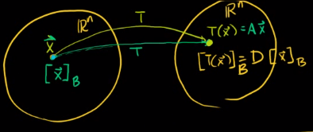

这时候，A称为：T变换的变换矩阵(**A is the transfomation matrix for T**)

但在上一节，我们学习了，同一个向量，在不同的基下，有不同的坐标！当我们写下向量 $\vec{x}$,其实隐含的意思就是，$\vec{x}$ 是基于标准基的。所以，上面的矩阵A的说法还不严谨：**只有当 $\vec{x}$ 是以标准基表示的，A才是T的变换矩阵**。更严谨的说法是：A是T变换关于标准基的变换矩阵(A is the transfomation matrix for T **with respect to the standard basis**) 也就是说，**变换矩阵是绑定在一组基上的！**$R^n$ 有很多基，**同一个变换，在不同的基下的变换矩阵是不一样的！** (`Mark-k1`)

现在，设 $B = \{v_1...v_n\}$ 是 $R^n$ 下的一组基，用变基矩阵==C==表示。那么变换前的向量x的坐标可用基B表示为 $[\vec{x}]_B$,同样，变换后的可表示为 $[T(\vec{x})]_B$。现在就出现1个有意思的问题

1. 如果从标准基的向量 $\vec{x}$ 开始应用变换T，得到标准基下的变换  $T(\vec{x}) = Ax$
2. 但如果我们从**非标准基**的 $[\vec{x}]_B$ 开始应用变换T，设变化后的结果是 $[T(\vec{x})]_B$，变换矩阵还是A吗？注意**T还是同1个变换。**

> sp:注意这里几个字母的概念
>
> 1 基B的变基矩阵是C，也就是
>
> - Eq(k3)：标准基下的坐标转换为基B下的坐标：$C [\vec{a}]_B = \vec{a} $
>
> - Eq(k4)：基B坐标转换为标准基下的坐标：$[\vec{a}]_B = C^{-1}\vec{a}$
>
>   2 标准基下 x 的T变换对应的矩阵是A,也就是 $T(x) = Ax$
>
>   3 基B下 $[x]_B$ T变换对应的矩阵是 D，也就是 $T([x]_B) = D[x]_B$
>
> 下文的 $T([x]_B)，[T(x_B)]$ 是同一个意思

现在，假设 $[\vec{x}]_B$ 的T变换的对应矩阵是D，也就是 $[T(\vec{x})]_B =D[\vec{x}]_B$,这时矩阵D称为：D是变换T关于基B的变换矩阵(D is the transformation matrix for T with repsct to the Basis B.) 现在，我们感兴趣的是，D和A之间有什么关系？

----

回顾一下 `Eq(k3,K4)`，也就是向量的坐标在标准基和非标准基之间的切换。因为T是同1个变换，所以我们可以得到
$$
[T(\vec{x})]_B =D[\vec{x}]_B = 
\color{orange} [A\vec{x}]_B  \tag{K5}
$$
注意 $[A\vec{x}]_B$,是把标准基下x的变换结果 $T(x) = Ax$ ，再用基B表示。  因为T是同1个变换，所以

- x经过T变换到 T(x)=Ax 再用基B表示得到 $[A\vec{x}]_B$
- $[\vec{x}]_B$ 经过T变换得到 $[T(\vec{x})]_B =D[\vec{x}]_B$ 

应该是等价的！ 也就是 $D[\vec{x}]_B = [A\vec{x}]_B$! 而且，参见 `Eq(K4,K3)`:
$$
[A\vec{x}]_B = \underbrace{ C^{-1} (A\vec{x})}_{\color{orange} \text{Eq(K4)}} =
C^{-1}A\vec{x} = 
C^{-1}A   \underbrace{ \left( C [\vec{x}]_B \right)}_{\color{orange} \text{Eq(K3)}}
\tag{K6}
$$
最终，我们得到
$$
D[\vec{x}]_B =C^{-1}A    C [\vec{x}]_B \Rightarrow\quad D = C^{-1}AC \tag{K7}
$$
所以，基B下的向量 $[\vec{x}]_B$,经过T变换得到的 $[T(\vec{x})]_B =D[\vec{x}]_B$,等于：

1. **(转换到标准基) **变基矩阵C乘以$[\vec{x}]_B$ ,得到 $C[\vec{x}]_B$,注意，参见Eq(K3),这是向量x在标准基下的坐标： $C[\vec{x}]_B=\vec{x}$ !
2. **(在标准基下应用变换)** 第1步得到了 $\vec{x}$,然后再应用变换矩阵A，得到 $A\vec{x} (= AC[\vec{x}]_B)$ 
3. **(转换回去非标准基)** 最后，对 $A\vec{x}$ 应用Eq(K4),也就是把标准基下的向量Ax,再次用基B表示：$C^{-1}A\vec{x}(= C^{-1}AC[\vec{x}]_B)$

**也就是，非标准基下的==变换==，需要以标准基为跳板。**

回顾 `<Mark-k1>` 这句话，Eq(k7)，就是我们**得到同一个变换T，在不同基下对应的变换矩阵的方法！**

---

**例K4** 设 $T:R^2 \rightarrow R^2$,标准基下的变换是 $T(\vec{x})= Ax= \left[\begin{matrix} 3 & -2 \\ 2 & -2 \end{matrix} \right]\vec{x}$.再设基 $B= \left\{\left[\begin{matrix} 1  \\2  \\\end{matrix} \right],\left[\begin{matrix} 2  \\1  \\\end{matrix} \right] \right\}$，B的变基矩阵是 $C = \left[ \begin{array} { l l } 1 & 2 \\ 2 & 1 \end{array} \right],C^{-1} =-\frac{1}{3} \left[ \begin{array}{c c} 1 & -2 \\ -2 & 1 \end{array} \right]$.我们现在要求的就是矩阵D，使得 $T([\vec{x}]_B) = D[\vec{x}]_B$.
$$
D = C^{-1}AC = \left[\begin{matrix} -1 & 0 \\ 0 & 2 \end{matrix} \right]
$$
设 $x= \left[\begin{matrix} 1  \\-1  \\\end{matrix} \right]$,现在我们验证一下
$$
\begin{CD}

\vec{x} @>A>> T(\vec{x}) = A\vec{x} =\left[\begin{matrix} 5  \\4  \\\end{matrix} \right]\\
@V V C^{-1} V @V V C^{-1} V\\

[\vec{x}]_B = C^{-1}\vec{x} = \left[\begin{matrix} -1  \\1  \\\end{matrix} \right] @>>D> 

[T(\vec{x})]_B = D[\vec{x}]_B = \left[\begin{matrix} 1  \\2  \\\end{matrix} \right] = [\vec{Ax}]_B = C^{-1}(A\vec{x}) 
\end{CD}

\tag{K8}
$$
注意以上从 $\vec{x}$ 得到最终结果的2个不同路径

1. $\vec{x}$ **往右**经过T变换得到 Ax;在**往下**变到基B $[\vec{Ax}]_B$
2. $\vec{x}$ **往下**变基到B：$[\vec{x}]_B$,再**往右**应用T变换：:$D[\vec{x}]_B$

2种方式是等价的

---

我们为什么要变基？其实**线代就是选择合适基的艺术**，看2个变化矩阵A和D,A是普通的变换矩阵，但D是对角矩阵啊，它用来做变换矩阵，很容易计算，如果要计算T变换100次，可以先把向量切换到基B下，然后应用对角矩阵D的100次幂，最后在切换回原来的基！

## 4.4 改变坐标系以求变换矩阵

> Changing coordinate systems to help find a transformation matrix

设 $T:R^2 \rightarrow R^2$, 以前，我们想要求得T变换的矩阵A时，是把对标准基(1,0),(0,1)应用T变换，并把结果作为矩阵A的列，也就是
$$
A = \left[\begin{matrix} 

	T(\left[\begin{matrix} 1  \\0  \\\end{matrix} \right])

	& 
	T(\left[\begin{matrix} 0  \\1  \\\end{matrix} \right])
\end{matrix} \right]  
\tag{K9}
$$
但现在，假设我们想找出关于 $L:y = 2x$ 的反射变换，如下图，$v_1 = (2,-1)$ 经过变换之后变成 $T(v_1)= (-2,1)$,我们当然可以继续用上面的方法，根据几何知识确定 (1,0),(0,1) 变换后的向量，并把它们作为T的列，但这并不简单。

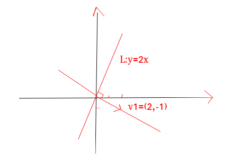

但我们可以变基啊！把 $v_1,L$ 作为基！ 当**标准基下求变换矩阵A比较困难的时候，我们先变基，然后求变换矩阵D**!而A,D矩阵的联系就是 `Eq(K7)` 啊！

现在，设L所在的直线是 $v_2= (1,2)$,设新的基 $B= \{v_1,v_2\} = \{\left[\begin{matrix} 2  \\-1  \\\end{matrix} \right],\left[\begin{matrix} 1  \\2  \\\end{matrix} \right]\}$,此时，变基矩阵是
$$
C = \left[ \begin{array} { l l } 2 & 1 \\ -1 & 2 \end{array} \right],
C^{-1} =\frac{1}{5} \left[ \begin{array}{c c} 2 & -1 \\ 1 & 2 \end{array} \right]
$$
注意，这时**，$v_1,v_2$ 还是标准基表示的，首先转换为基B下的坐标** 
$$
[v_1]_B = \left[\begin{matrix} 1  \\0  \\\end{matrix} \right],[v_2]_B = \left[\begin{matrix} 0  \\1  \\\end{matrix} \right]
$$

> sp:基向量在自身基下，当然是(1,0),(0,1)啊

设基B下，反射变换对应的矩阵是D，那么根据Eq(K9)
$$
D= \left[\begin{matrix} [T(v_1)]_B & [T(v_2)]_B\end{matrix} \right] =

\left[\begin{matrix}  D[v_1]_B & D[v_2]_B\end{matrix} \right]
$$
其中
$$
D[v_1]_B = \left[\begin{matrix} | & | \\d_1  & d_2\\| & |\\\end{matrix} \right] \left[\begin{matrix} 1  \\0  \\\end{matrix} \right] = \vec{d_1}

;\quad
D[v_2]_B = \left[\begin{matrix} | & | \\d_1  & d_2\\| & |\\\end{matrix} \right] \left[\begin{matrix} 0  \\1  \\\end{matrix} \right] = \vec{d_2}
$$
意思就是，求出新的基B下的T变换 $[T(v_i)]_B$,而 $[T(v_1)]_B$ 就是**基B的**变换矩阵D乘以**基B下**，基B的**基**向量 $[v_i]_B$,也就是 $D[v_i]_B$,这些 $D[v_i]_B$，既是矩阵D的列。

现在，在新基B下，因为 $v_1,v_2$ 是垂直的,T变换是很容易得到的:

> T变换就是关于y = 2x的反射,所以
>
> - $v_1 = (2,-1)$ 变换后是 (-2,1),其实就直接是 $[v_1]_B = （1，0）$ 变换后得到 (-1,0)
> - $v_2 = (1,2)$ 变换后不改变，就在原来的位置
>
> sp:这个例子其实就是切换到特征向量基，求除变换矩阵，然后根据 Eq(k7) 的到标准基下的变换矩阵！

$$
[T(v_1)]_B = \left[\begin{matrix} -1  \\0  \\\end{matrix} \right]，\quad
[T(v_2)]_B = \left[\begin{matrix} 0  \\1  \\\end{matrix} \right]
$$

从而得到，在基B下，T变换的矩阵是
$$
D  = \left[\begin{matrix} -1 & 0 \\ 0 & 1 \end{matrix} \right]
$$
那么
$$
A = CDC^{-1} = \frac{1}{5} \left[\begin{matrix} -3 & 4 \\ 4 & 3 \end{matrix} \right]
$$
这样就求出了反射变换在标准基下的变换矩阵A!

# 5 Lk2:sp总结

**1** 首先，参见 `<#Lk1.2>` ，向量坐标变换，也就是变基的时候，有自身的变基矩阵，就是 `Eq(K3,K4)`，设变基矩阵是C,那么

- Eq(k3)：标准基下的坐标转换为基B下的坐标：$C [\vec{a}]_B = \vec{a} $
- Eq(k4)：基B坐标转换为标准基下的坐标：$[\vec{a}]_B = C^{-1}\vec{a}$

注意变基矩阵C，是以**基B的基向量**作为列的！这是因为，`<#Lk1.2.1>,<#Lk1.2.2>` 是在标准和非标准之间转换，所以变基矩阵C一定是基B的基向量作为列！其实变基矩阵的求法一定是`<#2.1>` 的方法

**2** 变换也有**自己的**矩阵！**变换是发生在输入、输出基下面的！**变换前后空间可以不一样，基也可以不一样。如

- `<#1> 例1`的点乘变换，输入向量是三维空间的，输出向量是1维空间的，空间都不一样，基当然也不一样。明显，当输入、输出空间维数都不一样的时候，T对应的矩阵A就不是方阵，如`<#1> 例1`的3-1的
- `<#1> 例3` 的旋转例子当中，输入输出基是一样的
- `<#2.3>` 的恒等变换，就是输入、输出空间一样，但基不一样

注意，在 `<#Lk1.3>`所述的，都是 **同一个空间** ($R^n$)下的变换(注意看`sp-mark-A2`标记！).从而得到了**同一个**变换，在**同一个**空间下，**不同基**下的变换矩阵的联系，也就是Eq(k7，k8)!它们是相似矩阵！也就是`<V32-2>`所讲内容

但不管怎样，变换T对应的矩阵A都是`<#2.1>`讲述的方法！只是需要

1. 首先确定输入输入空间是否一样
2. 如果一样，在确定输入的基和输入的基是否选择一样的

注意：

- T(v) = v的恒等变换一定是在同一个空间下的（从 `<#1> 例V2 的sp-mark-A1`推断，因为恒等变换后向量形式不变，所以**恒等变换输入空间和输入空间是一样的，只是基可能不同！**），因为向量表达式根本没有改变！只是当输入、输出的基不一样的时候，A是**变基矩阵**
- **T(v) = v恒等变换是一种特殊的变换，也就是说，变基矩阵也是一个变换矩阵！**它们的求法都是`<#2.1>`的方法！变基后，向量在不同基下的坐标不一样，但向量形式不变！如`sp-note7.2-6` 所述，方程就是 `<Lk1.2>` 的Eq(N1)!

**3** 不同基下同一个变换的变换矩阵不同，但性质最好的是特征向量作为基的变换矩阵，如 `<#Lk1.4>` 所示：先得到特征向量基项的变换矩阵D，然后通过Eq(k7) 得到标准基下的变换矩阵A

