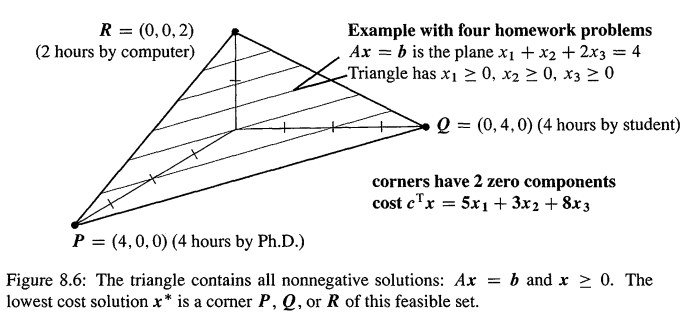

# 线性规划

> - Linear Programming，以下简称LP
> - 看到单纯形法，以后补充把

LP是线代加上2个新概念：不等式和最小化(inequalities and minimization)。初始条件还是一个矩阵等式 Ax = b，但现在，解必须是非负的，也就是 $x\ge 0$，也就是x的分量都不能是负数。矩阵的形状是 n>m，也就是未知数的变量多余方程个数，所以可能会存在很多  $x \ge 0$ 满足 Ax = b.LP选择的解 $x^* \ge 0$ 是代价(cost)最小的：

> 代价定义为 $c_1x_1+...+c_nx_n$，此时这个非负的向量 $x^*$ 是Ax = b 的解，并且它具有最小的代价。

LP问题可以从一个矩阵A和2个向量 b、c开始

1. A的n>m，如 $A = [1,1,2]$，3个位置数，1个方程
2. b是m个分量的向量，对应m个方程的右侧，如 $b = [4]$
3. 费用向量(cost vector)有n个分量，如 $c = [5,3,8]$

目标就是:以 Ax= b 和 $x\ge 0$ 作为前提的情况下，最小化 $c \cdot x$。 如：限制在 $x_1+x_2+2x_3 = 4，x_1,x_2,x_3\ge 0$ 的情况下 ,最小化 $5x_1+3x_2+8x_3$。

以上解释了LP是怎么回事，但它到底是怎么来的呢？实际上，LP是数学对管理的最重要应用之一。你会发现，因为有 $x^* \ge 0$ 和 最小化 $c^Tx^*$ 的要求，寻找 $x^*$  比求解 Ax=b 更难。下面我们会介绍一些背景，并在例子之后，介绍著名的单纯形法和内点法。

---

首先看一下限制条件 $Ax = b$ 和 $x\ge 0$.方程 $x_1+x_2+2x_3 = 4$ 给出的是一个三维下的平面，而 $x_1,x_2,x_3\ge 0$ 的要求这个平面限制在Fig8.6的三角形当中，最佳解 $x^*$ 必须在三角形 PQR之上。

这个三角形，就包含了所有满足  $Ax = b$ 和 $x\ge 0$ 的向量x，这些 x's 被称为**可行点(feasible points)**,而三角形被称为**可行集合(feasible set)**.这些点都是可能最小化 $c\cdot x$ 的候选，也就是LP的最后1步：**在PQR三角形上，求最小化代价 $5x_1+3x_2+8x_3$  的解 $x^*$**

在平面 $5x_1+3x_2+8x_3=0$ 上，向量的耗费都为0，但注意，这个平面并没有和三角形相交，所以不可能取得0耗费的解。所以，我们不断的提升 $5x_1+3x_2+8x_3 = C$ 当种的C，直到和三角形相交，从而得到有个耗费不为0的最佳解 $x^*$.注意，C变换的的过程，就是一个平面，**平行地**向三角形移动。

第1个和三角形接触到的 $5x_1+3x_2+8x_3 = C$ 就拥有最小耗费C（sp:最小耗费就是C！），而且它接触到三角形的点，就是最佳解 $x^*$! 而且，这个点必须是三角形的顶点P，Q或者R，因为，不能在不接触到顶点的情况下，首先接触到三角形的内部！所以我们检查一下三个顶点的耗费：
$$
P = ( 4,0,0 ) \text { costs } 20 \quad Q = ( 0,4,0 ) \text { costs } 12 \quad R = ( 0,0,2 ) \text { costs } 16
$$
Q胜出了，所以 $x^* = (0,4,0)$ 是这个LP问题的解。

---

如果耗费向量c改变了，那么不断移动的平行平面的倾斜角度就不一样了，如果c的改变核销，那么Q还是胜出点。但如果改变幅度比较大，如 $c\cdot x = 5x_1+4x_2+7x_3$,最佳的 $x^*$ 变成 R= （0，0，2），此时最小耗费是7*2 = 14.

**要点1**：一些线性程序会最小化利润(maximize profit)，而不是最小化代价。这在数学上是等价的。只是现在，平行平面以很大的 C 开始(而不是很小的c)，不断的减小，从而平面不断向原点逼近(而不是远离)，当C越来越小，第1个接触到点，仍然是三角形的顶点。

**要点2：** 有时候， $Ax =b$  和 $x\ge 0$ 是不可能被满足的，如方程 $x_1+x_2+x_3 = -1$ 不可能在 $x\ge 0$ 的限制条件下求解,此时可行集合是空集。

**要点3：** 可行集合也有可能是无界的。如果Ax = b是 $x_1+x_2-2x_3 = 4$,那么正向量 $(100,100,98)$ 是一个候选，更大的正向量 $(1000,1000,998)$ 同样也是。此时，可行集合不在被限制为一个三角形区域，虽然P,Q顶点还是候选，但R顶点相当于处在无穷的位置。

**要点4：** 如果可行集合是无界的，那么最小代价可以是 $-\infty$.如假设耗费方程是 $-x_1-x_2+x_3$,那么向量 $(100,100,98)$ 的耗费是 `C= -102`,向量 $(1000,1000,998)$ 的耗费是 `C = -1002`.这相当于变量$x_1,x_2$ 会帮助我们减小耗费，而不是增加。虽然现实情况下不会发生，但理论上，A,b,c三者合起来，可以产生难以预期的可行集合三角形和耗费。

## 原始问题和对偶问题

>- The primal and dual problem
>- 大概看懂了，但没搞懂为啥 最大值=最小值....以后研究的时候补充

以Fig8.6的问题开始，3个未知数 $x_1,x_2,x_3$ 分别代表1个研究生、学生、机器的工作小时数，而它们每小时的代价是5，3，8美元。因为工作时间可能不能为负数，所以 $x_1,x_2,x_3 \ge 0$.研究生和学生每小时解决1个问题，机器每小时解决2个问题，总共有4个问题，所以就是 $x_1+x_2+2x_3 = 4$.所以我们的目标就是，解决4个问题的同时，最小化 代价 $c^Tx$.

如果3个对象都在工作，那么4个问题需要1小时：$x_1=x_2=x_3 = 1$，代价是 5+3+8=16。但明显的，根本不需要研究生，因为学生明显性价比更高。所以让学生工作2小 ，机器1小时，代价是6+8=14。参见Fig8.6,此时我们是在边QR上，因为$x_1 = 0$.但最佳的点是Q，R点，也就是全部工作由学生或者机器完成。如果全部是由机器完成，那么代价是12.

当 Ax = b 只有1个方程，顶点(0,4,0)只有1个非0分量。**当Ax = b有m个方程，顶点有m个非0分量。** 我们是对这m个变量求解Ax= b的，**有n-m个自由变量被设为0。** 注意和 `<01-03>`的不同：**我们不知道怎么选出这m个变量。**

**可能出现的顶点的个数，就是我们可以从n选出m的方法数。**n选择m的问题在概率和赌博经常出现，如n = 20,m = 9,那么可行集合会有 $\frac{20!}{8!12!} \approx 5*10^9$ 种选择方法！对于3个顶点，我们可以逐一验证，但对于5亿个顶点，肯定行不通。

> **对偶问题**
>
> ---
>
> 在LP，问题总是成对出现的，会同时有一个最小化问题和一个最大化问题，也就是原始问题和它的对偶问题。
>
> - 原始问题是由矩阵A和2个向量b、c所描述的
> - 对偶问题转置A和切换b、c向量：最大化 $b\cdot y$
>
> ---
>
> 对于上面的问题，我们而已这样描述其对偶问题：一个作弊者提供收费给答案的服务。每个答案y美元，那么4个问题的答案就是4y（注意，此时b = 4变成了耗费）。费用y必须小于等于研究生、学生、机器的话费，也就是 $y \le 5 $ **和** $y \le 3$ **和** $2y \le 8$ （注意，现在c = (5,3,8) 变成了不等式约束）。作弊者想要最大化收费 4y:
> $$
> \text{Dual Problem}: \qquad \text{限制在} A^Ty \le c \text{ 的条件下，最大化 } b\cdot y
> $$
> 当 y = 3，可以取得最大的收入 4y = 12.对偶问题当中的最大值12美元，和原始问题当中的最小值12美元是相等的，最大=最小就是所谓的对偶性：**只要原始或对偶问题其中之一有最佳解 $x^*$ 或 $y^*$,那么另外一个必定也有最佳解，而且原始问题当中的最小代价 $c \cdot x^*$，必定等于对偶问题当中的最大收入 $b \cdot y^*$.**

其实秩的问题就是一个对偶问题：对立列的个数=独立行的个数。以上 最小化=最大化 的证明在 `<Linear Algebra and Its Applications> ` 有证明。其实只要1行，就能证明较容易的前半部分：作弊者的收入 $b^Ty$ 不能超过代价：
$$
\text{如果 } Ax = b,x\ge 0,A^Ty \ge c \text{ 要同时满足，那么: }\quad

b ^ { \mathrm { T } } y = ( A x ) ^ { \mathrm { T } } y = x ^ { \mathrm { T } } \left( A ^ { \mathrm { T } } y \right) \leq x ^ { \mathrm { T } } c

\tag{1}
$$
完整的对偶定理(dual theorem)说的是：当$b^Ty$ 达到最大值，$x^Tc$ 也达到它的最小值，并且它们相等: $b\cdot y^* = c\cdot x^*$. 观察 Eq(1) 的最后1步的小于等于号：

$x\ge0$,而且 $s = c- A^Ty \ge 0$,那么这2者的县城 $x^Ts \ge 0$.这就是 $x^TA^Ty \le x^Tc$.当想要取得等号，需要 $x^Ts = 0$,所以最优解是：每一个j，都有 $x_j^*=0 $ 或 $s_j^*=0$

## 单纯形法

> - The Simplex Method，以下简称TSM

消去是求解线性方程的主力，TSM是求解线性不等式的主力。这里只是简单介绍，但思想是很清晰的：TSM从一个顶点(corner)，移动到代价更小的另一个**相邻**顶点，最终(实践当中，是非常快的)到达最小耗费的顶点。

而所谓的顶点就是一个向量 $x\ge 0$，它满足m个方程 Ax = b，并且**至多m个分量是正值，其他n-m个分量都是0.** (0分量就是自由变量，回代可得到主变量，而且x的所有分量必须非负).而所谓的相邻顶点，就是当前顶点x的

- 1个分量从0变为正值
- 1个分量从正值变为0

> sp:其实会发生1个分量从0变为1，不一定会发生从1变为0啊，如例1.书本这里有点描述不对啊，应该是正值分量会相对应做出调整。这里理解有误，继续参见例2调整

**TSM必须确定，哪个分量从0变为正值(定义为进入变量，entering variable)，哪个分量从正值变为0（定义为离开变量，leaving varibale）.经过这样的分量变换之后，总代价必须降低，这就是TSM向 $x^*$ 逼近的一个步骤**。

下面的整个思想：观察当前顶点存在的所有0分量，选择**其中1个**0分量从0变为1，**其他非0分量必须做出调整来保持 Ax = b**.分量变换之后，回代方程得到新的顶点x，然后用这个顶点x计算总代价 $c \cdot x$,和上一次的代价做减法，得到 **削减代价 r（reduced cost r）**.而给出了最大负值(most negative)r的变量交换，即表示此次交换成功。

**例1** 以Fig8.6为例，假设当前顶点是 P = (4,0,0),也就是研究生完成所有问题，此时代价是20.如果学生工作1小时，那么现在 x= (3,1,0)，代价是18.削减代价 r = -2； 如果机器工作1小时，那么 x= (2,0,1)的代价也是18.削减代价也是 r = -2.这种情况下，TSM选择学生或机器作为进入变量都可以。

就算在这个简单的例子，第一步也很难得到最佳的 $x^*$.TSM确实可以选择进入变量，但进入变量应该要设为多少呢？例子当中，我们是通过将进入变量从0变为1来计算 r 的，但递增1个单位，可能太少，也可能太多！

现在假设，TSM选择将研究生作为离开变量，所以会移动到Q或者R顶点。

**例2**