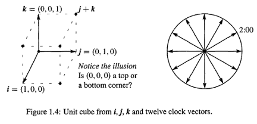
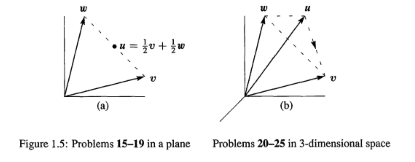

## 向量


**1.** 如何判断下面的 $ \vec{u}, \vec{v}, \vec{w}$ 在同一个平面?
$$
\quad u = \left[ \begin{array} { l } { 1 } \\ { 2 } \\ { 3 } \end{array} \right] , \quad v = \left[ \begin{array} { r } { - 3 } \\ { 1 } \\ { - 2 } \end{array} \right] , \quad w = \left[ \begin{array} { r } { 2 } \\ { - 3 } \\ { - 1 } \end{array} \right]
$$

解: $ \vec{ u}+ \vec{ v}+ \vec{ w} = (0,0,0)$,换句话说, $ \vec{ u} = - \vec{ v}- \vec{ w}$, 是在 $ \vec{ v}, \vec{ w}$ 组成的平面上.所以这3个向量共面

---

**2.** Fig1.1的平行四边形当做, $ \vec{ v}+ \vec{ w} $ 是一条对角线,另一条对角线是什么?2条对角线的和是什么?

解: 另一条对角线就是 $ \vec{ v} -  \vec{ w}(或  \vec{ w} -  \vec{ v})$,对角线的和是 $2 \vec{ v}$ 或者 $2 \vec{ w}$

---

**3.** 如果平行四边形的三个点是 $(1,1),(4,2),(1,3)$.那么第三个点有几种可能,分别是什么?

解: 假设这三个点分别是A,B,C,第四个点是D

- 如果AB,CD是平行边,那么$\vec{AB} = (3,1),\vec{CD}$ 也应该是(3,1).所以D = (4,4)
- 如果AD,BC是平行边,那么D = (-2,2)
- 如果AD,CB是边,那么D = (4,0),注意,和第2种情况不同

有三种可能.其实这一题就是要计算出D的坐标,那么D的坐标怎么计算出所有的可能呢?其实只要对ABC点进行运算

- A-B+C=(-2,2)
- A-C+B=(4,0)
- B-A+C=(4,4)
- B-C+A=(4,0)
- C-A+B….

排除掉重复的,D点的左边已经出来了

---

**4.** 下面的问题都是基于下图的.可以看到三维向量的单位正方体有8个顶点.6个面.12条边



**1.**在四维下,一个正方体有多上个顶点?多少个3D面(3D face),多少条边(edge).

顶点的个数,明显是2的维数次方,比如,四维下的就是$2^4 = 16$. 2维面是24个,3维面是8个,边数32条.请看`<01-02 #4> 典型例题1`

**2** 上图右边的时钟,12个向量的和是多少?2点向量的分量是多少?

是零向量,因为`2:00的向量=-8:00的向量`.2:00的向量和水平线的角度是$30^o= (\cos 30^o,\sin 30^o ) = (\frac{\sqrt3}{3},\frac{1}{2})$

**3.** 假设这12个向量从6:00处为起始点,而不是中心点(0,0)开始,那么12:00的向量就会变成(0,2)这时候这12个向量的和是多少?

把**原点**移动到6:00处相当于每个向量都加上 $ \vec{j} = (0,1)$,所以和是(0,12)

---

**5.** 下面问题基于下图,首先看左图,二维情况下



**1.** (a)图展示的是 $1/2\vec{v} + 1/2\vec{w}$,描述一下,$3/4\vec{v} + 1/4\vec{w},1/4\vec{v} + 1/4\vec{w},\vec{v}+\vec{w}$ 分别在什么地方?

- $3/4\vec{v} + 1/4\vec{w}$: 是从 w 点开始到 v 的3/4处
- $ 1/4\vec{v} + 1/4\vec{w} $ 是原点到 u 点的一半处
- $\vec{v} + \vec{w} $ 是 $2\vec{u}$(平行四边形远端点)

**2.** 当c+d = 1那么 $c\vec{v}+d\vec{w}$ 组成的线是什么?

组成的线就是经过 $\vec{v},\vec{w}$ 端点的直线,注意,$-\vec{v}+ 2\vec{w}$ 也在这条直线上

**3.** $c\vec{v}+c\vec{w}$ 的所有组合是什么线?

是经过原点和 $ \vec{ u} = 1/2  \vec{ v}+ 1/2 \vec{ w}$ 的直线,如果 $c\ge 0$,那么只剩下从原点开始的射线

**4.** 限制 $0 \le c \le 1,0 \le d \le 1$,那么 $ c\vec{v}+d\vec{w} $ 的所有组合是什么

是 $ \vec{v}, \vec{ w}$ 为邻边的平行四边形

**5.** 如果$c\ge0,d\ge 0$,那么 $ c\vec{v}+d\vec{w} $ 的所有组合是什么

是由 $ \vec{v}, \vec{ w}$ 所代表的射线的无限延长包围的那一部分


然后看看,右图(b),三维情况

**1.** $1/3 \vec{u}+1/3 \vec{ v}+1/3 \vec{ w}$ 在哪里? $1/2 \vec{u}+1/2 \vec{ w}$ 呢.

$1/3 \vec{u}+1/3 \vec{ v}+1/3 \vec{ w}$在虚线三角形的中心点.$1/2 \vec{u}+1/2 \vec{ w}$在 $ \vec{ u}, \vec{ w}$ 的中间

**2.** 挑战:在什么限制下的c,d,e,组合 $ c\vec{u}+d\vec{v} + e\vec{w} $ 会在虚线的三角形内?当然,这么做的一个要求是 $c,d,e \ge 0$

$c+d+e = 1$

**3.** 三角形的三条边分别是 $ \vec{ v}- \vec{ u}, \vec{ w}- \vec{ v}, \vec{ u}- \vec{ w}$ ,这三条边的和是什么?

和是零向量!这个三角形的三条边在同一个平面上!

**4.** 注意,当 $c,d,e \ge 0,c+d+e \le 1$,那么 $ c\vec{u}+d\vec{v} + e\vec{w} $ 的所有组合是什么?

就是图上整个三维金字塔啊

**5.** 哪条直线,既是 $\vec{u},\vec{v}$ 的组合,又是 $\vec{v},\vec{w}$ 的组合?

$\vec{u},\vec{v}$ 形成一个平面,$\vec{v},\vec{w}$ 形成另一个平面,这2个平面相交的直线就是 $c\vec{v}$


### 挑战问题

**1.** 假设 $\vec{v} + \vec{w} = (4,5,6),\vec{v}- \vec{w} = (2,5,8)$,如果要求$\vec{v},\vec{w}$,方程是怎么样子的?

解: 有6个未知数:$v_1,v_2,v_3,w_1,w_2,w_3$,野游个等式,所以可以求解.其实上面可以直接得到 $2\vec{v} = (6,10,14)$,从而求解出来

---

**2.** 对于下面向量,求解c,d,e,从而满足 $ c\vec{u}+d\vec{v} + e\vec{w} $ ,记住这个求解过程,很麻烦吧
$$
\boldsymbol { u } = \left[ \begin{array} { r } 2 \\ - 1 \\ 0 \end{array} \right] \quad \boldsymbol { v } = \left[ \begin{array} { r } - 1 \\ 2 \\ - 1 \end{array} \right] \quad \boldsymbol { w } = \left[ \begin{array} { r } 0 \\ - 1 \\ 2 \end{array} \right] \quad \boldsymbol { b } = \left[ \begin{array} { l } 1 \\ 0 \\ 0 \end{array} \right]
$$
解:
$$
\begin{aligned} 
2 c - d  = 1  & \text { So } d = 2 e &   c = 3 / 4 \\ 

- c + 2 d - e  = 0 & \text { then } c = 3 e & d = 2 / 4 \\

- d + 2 e = 0 & \text { then } 4 e = 1 & e = 1 / 4 \end{aligned}
$$


## 长度,点乘和角度

**1.** 对于下面的命题,判断对错

1. 在三维下,如果u和v,w垂直,那么v,w是平行的吗?
错误,可以平行,可以垂直,也可以不垂直不平行.v,w是处于和u**垂直平面**上的任何向量
2. 如果u和v,w垂直,那么u和v+2w垂直
正确: $ \vec{ u} \cdot ( \vec{ v}+2 \vec{ w})= \vec{ u} \cdot  \vec{ v}+ \vec{ u}\cdot 2 \vec{ w}=0+0=0$
3. 如果u,v是垂直的单位向量.那么 $| \vec{ u}- \vec{ v}| = \sqrt 2$
正确: $| \vec{ u}− \vec{ v}|^2=( \vec{ u}− \vec{ v})\cdot ( \vec{ u}− \vec{ v})= \vec{ u}\cdot  \vec{ u} +  \vec{ v}\cdot  \vec{ v}=2$

---

**2.** 从原点出发的向量 $(v_1,v_2),(w_1,w_2)$ 的斜率分别是 $v_2/v_1 ,w_2/w_1$ .证明,如果这两个斜率的乘 $(v_2 w_2)/(v_1 w_1 )  = -1$,那么这两个向量垂直

解: $(v_2 w_2)/(v_1 w_1 )  = -1 → v_2 w_2  = -v_1 w_1→ v_1 w_1+ v_2 w_2=0→垂直$

---

**3.** 设 $v= (1,1),w = (1,5)$,求c,使得 $(w-cv)$ 和 $v$ 垂直

解: 简单的办法就是,直接求点乘为为0 
$$
(w-cv) \cdot v = (1-c,5-c)\cdot (1,1) = 0 \Rightarrow c = 3
$$
但是
$$
(w-cv) \cdot v = 0  \Rightarrow c = \frac{w \cdot v}{v\cdot v}
$$
记住点乘是可以直接运算的.这样不断v,w是什么,都可以很快计算

---

**4.** 找到2个向量v,w,垂直于(1,0,1),并且v,w之间也是垂直的

解: 我们首先找到垂直于(1,0,1)的**平面**,很明显,这个平面包含所有的向量(c,d,-c). 然后我们在这个平面内寻找2个垂直的向量,那么这个平面内,(1,0,-1),(0,1,0)相互垂直的

---

**5.** 对于任何向量v(当然0向量除外),和坐标轴x,y,z的夹角分别是α,β,θ.那么 $\cos ^ { 2 } \alpha + \cos ^ { 2 } \alpha + \cos ^ { 2 } \theta$ 的值是什么?

解: 设 $ \vec{ v} = (v_1,v_2,v_3)$.那么
$$
\begin{aligned}

\cos \alpha & = \frac { \vec{v} \cdot \vec { i } } { | \vec{v} | } = \frac { v _ { 1 } } { | \vec{v} | } \\ 

\cos \beta &= \frac { \vec { v } \cdot \vec{ j } } { | \vec{v} | } = \frac { v _ { 2 } } { | \vec{v} | } \\ 

\cos \theta &= \frac { \vec { v } \cdot \vec { k } } { | \vec{v} | } = \frac { v _ { 3 } } { | \vec{v} | } \\ 

\cos ^ { 2 } \alpha + \cos ^ { 2 } \alpha + \cos ^ { 2 } \theta &= \frac { v _ { 1 } ^ { 2 } + v _ { 2 } ^ { 2 } + v _ { 3 } ^ { 2 } } { | \vec{v} | ^ { 2 } } = 1 

\end{aligned}
$$

---

**6.** 如果 $|v| = 5,|w| = 3$.那么 $|v-w|$ 的最大最小值是什么? $v \cdot w$ 呢?

解:

- $|v-w|$,应用三角等式,-2到8之间
- $v\cdot w$ : 应用柯西不等式,是在-15到15之间

---

**7.** 代数证明柯西不等式 $|v \cdot w | \le |v||w|$ 

解:直接用点乘的公式展开
$$
\begin{aligned}

(|v||w|)^2 - (|v \cdot w|)^2 &= \left( v _ { 1 } ^ { 2 } + v _ { 2 } ^ { 2 } \right) \left( w _ { 1 } ^ { 2 } + w _ { 2 } ^ { 2 } \right)- \left( v _ { 1 } w _ { 1 } + v _ { 2 } w _ { 2 } \right) ^ { 2 }  \\
&= v_1^2w_2^2 + v_2^2w_1^2 - 2v_2w_1v_2w_2 \\

&=(v_1w_2 - v_2w_1)^2 \\

& \ge 0


\end{aligned}
$$

---

**8.** 对于单位向量,可以用一行直接证明 $|\vec{u} \cdot \vec{U}|\le 1 $
$$
| \vec{u} \cdot \vec{U} | \leq \left| u _ { 1 } \right| \left| U _ { 1 } \right| + \left| u _ { 2 } \right| \left| U _ { 2 } \right| \leq \frac { u _ { 1 } ^ { 2 } + U _ { 1 } ^ { 2 } } { 2 } + \frac { u _ { 2 } ^ { 2 } + U _ { 2 } ^ { 2 } } { 2 } = \frac { u _ { 1 } ^ { 2 } + u _ { 2 } ^ { 2 } } { 2 } + \frac { U _ { 1 } ^ { 2 } + U _ { 2 } ^ { 2 } } { 2 } = \frac { 1 + 1 } { 2 } = 1
$$
注意,上式利用了例2的几何平均小于算数平均.可带入(.8,.6)和(.6,.8)验证

---

**9.** 设 $v= (1,2),w= (x,y)$,那么xy平面上 $v \cdot w = x+2y = 5$ 最短的w是多少?

解: 根据柯西不等式: $|w| \ge |v \cdot w|/ |v| = 5/\sqrt{5} = \sqrt{5}$,那么
$$
\begin{cases}
x^2 + y^2 &=  5 \\
x+2y &= 5
\end{cases}

\Rightarrow x=1,y=2 
$$


### 挑战问题

**1.** 在xy平面内,可能存在3个向量u,v,w,它们之间的两两点乘都小于0吗

解: 这是 $R^2$ 的情况.注意,平面内的角度是360,所以3个向量是可能的,只要每个向量之间都大于90度即可,但是4个向量是不可能的.那么在 $R^n$ 能有多少个这样的向量呢?答案是n+1

sp:看不懂答案,先记录下来:

> The vectors from the center of a regular simplex in $R^n$ to its n + 1 vertices all have negative dot products. If n+2 vectors in $R^n$ had negative dot products, project them onto the plane orthogonal to the last one. Now you have n+1 vectors in $R^{n-1}$ with negative dot products. Keep going to 4 vectors in R2 : no way! 

这里好像设计到拓扑学了,后面在学把

---

**2.** 挑选3个数字x,y,z,使得x+y+z = 0,那么 $v = (x,y,z),w = (z,x,y)$ 的夹角是多少,解释,为什么:
$$
\frac { v \cdot w } { | v | | w | } = - \frac { 1 } { 2 }
$$
解:
$$
\begin{array} { l } \mathrm { v } \cdot \mathrm { w } = z x + x y + y z = \frac { 1 } { 2 } ( x + y + z ) ^ { 2 } - \frac { 1 } { 2 } \left( x ^ { 2 } + y ^ { 2 } + z ^ { 2 } \right) \\ \rightarrow = 0 - \frac { 1 } { 2 } \left( x ^ { 2 } + y ^ { 2 } + z ^ { 2 } \right) = 0 - \frac { 1 } { 2 } \| v \| \| w \| \end{array}
$$
所以:
$$
\mathrm { v } \cdot \mathrm { w } = - \frac { 1 } { 2 } \| v \| \| w \| \rightarrow \cos \theta = - \frac { 1 } { 2 } = 120 ^ { \circ }
$$

---

**3.** 怎么证明 $G= \sqrt[3]{xyz} ≤A= 1/3 (x+y+z)$  (几何平均小于算数平均)

解: 当x = y = z的时候,取得等号.其他情况下,A的值肯定是处于**正数** x,y,z的3者之间的.我们假设是:$z<A<y$

我们已经知道,假设存在2个数字x和 `y+z - A`,对于这2个数字有,$g≤a$.也就是说:
$$
a = \frac { 1 } { 2 } ( x + y + z - A ) = \frac { 1 } { 2 } ( 3 A - A ) = A
$$
所以 $a≥g$ 意味着
$$
A ^ { 3 } \geq g ^ { 2 } A = x ( y + z - A ) A
$$
而且
$$
( \mathrm { y } + \mathrm { z } - \mathrm { A } ) \mathrm { A } = ( y - A ) ( A - z ) + y z > y z
$$
那yz带入上式,得到
$$
A^3>xyz=G^3
$$
不容易啊,有很多证明
$$
G=(x_1 x_2…x_n )^{1/n} ≤A=(x_1+x_2+…+x_n)/n
$$
的方法,微积分当中,我们需要在平面:
$$
x_1+x_2…+x_n=n
$$
的平面上,最大化G.而这个最大值只能在所有的x都相等时候才能取得

---

**4.** 找到4个所有分量都是在-1/2或1/2的互相垂直的单位向量

解: 下面的H矩阵叫做Hadamard Matrix,1/2H就是满足的条件:
$$
\frac { 1 } { 2 } H = \frac { 1 } { 2 } \left[ \begin{array} { r r r r } 1 & 1 & 1 & 1 \\ 1 & - 1 & 1 & - 1 \\ 1 & 1 & - 1 & - 1 \\ 1 & - 1 & - 1 & 1 \end{array} \right]
$$

---

**5.** 在Matlab当中,使用 `v = randn(3,1)` 和 `u = v/|v|` 建立一个随机的单位向量,然后使用 `V= randn(3,30)` 再创建30个单位向量 $U_j$,点乘 $u \cdot U_j$的平均值是什么?

解:

```matlab
% randn创建的数字是服从正态分布的
v = randn(3,1)
u = v/norm(v)
% [3,30]矩阵
V =randn(3,30)
% V' * V,也就是转置矩阵*原矩阵
% diag表示取出对角线的值,所有diag(V'*V)取出的是30个对角线的值,注意
% 在经过sqrt以后,得到的是矩阵V每一个列向量的长度.D是[30,1]矩阵
D = sqrt(diag(V' * V))
% [3,30]/[1,30]= [3,30]矩阵,每一列相除,U的每一列都是单位向量
U = V ./ D'
% [1 3] * [3 30]= [1,30],30个值,每个值都是u和U的列向量(都是单位向量)点乘的结果
Ans = mean(abs(u' * U))
% 因为都是单位向量,所以点乘的值,就是随机2个角度的余弦值
```

上面代码得到是30个随机角度的余弦值,我们可以使用微积分,求任意2个角度余弦值的平均等于多少
$$
\frac { \int _ { 0 } ^ { \pi } | \cos \theta | d \theta } { \pi } = \frac { 1 } { \pi } * \left[ \int _ { 0 } ^ { \frac { \pi } { 2 } } \cos \theta d \theta - \int _ { \pi/2 } ^ { \pi } \cos \theta d \theta \right] = \frac { 2 } { \pi }
$$
所以上面代码就算的近似是2/π 的值.厉害啊


## 矩阵

**1.** 对于如下方程,以 $B's$ d的方式求解出 $y’s$.然后求出 $S^{-1}$ ,并判断其列是否独立
$$
S y = B \quad \Rightarrow  \left[ \begin{array} { l l l } 1 & 0 & 0 \\ 1 & 1 & 0 \\ 1 & 1 & 1 \end{array} \right] \left[ \begin{array} { l } y _ { 1 } \\ y _ { 2 } \\ y _ { 3 } \end{array} \right] = \left[ \begin{array} { l } B _ { 1 } \\ B _ { 2 } \\ B _ { 3 } \end{array} \right]
$$
解:
$$
\begin{array} { l l } 

y _ { 1 } & = B _ { 1 } \\ 
y _ { 1 } + y _ { 2 } & = B _ { 2 } \\ 
y _ { 1 } + y _ { 2 } + y _ { 3 } & = B _ { 3 }

\end{array}

\Rightarrow \quad

\begin{array} { l l  } 

y _ { 1 } & = B _ { 1 } &  \\ 
y _ { 2 } & = -B_1 + & B _ { 2 } \\ 
y _ { 3 } & =  & -B_2 + B _ { 3 }

\end{array}

\Rightarrow \left[\begin{matrix} 
1  & 0 & 0\\
-1 & 1 & 0\\
0  & -1 & 1\\
\end{matrix} \right]  

\left[\begin{matrix} 
B_1  \\
B_2  \\
B_3  \\
\end{matrix} \right]
$$

S就是上式右边的矩阵,列之间是独立的.注意S矩阵,如果 y=(1,3,5),那么Sy=(1,4,9),如果S以这种模式扩展到n-n,而$y=(1,3,...2n-1)$,那么Sy产生的列向量元素,比如$B_3 = y_1+y_2+y_3$, 就是前n个奇数的和是多少,这是因为
$$
1+3+..+2n-1 = 2n/ 2 * n  = n^2
$$

---

**2.** 如果A的列可以产生 $Ax = \vec{0}$,那么也就意味着A的每一**行**,都有 $r \cdot x =0$
$$
\left[\begin{matrix} 
| & | & |\\
a_1 & a_2 & a_3\\
| & | & |\\
\end{matrix} \right] \left[ \begin{array} { l } x _ { 1 } \\ x _ { 2 } \\ x _ { 3 } \end{array} \right] = \left[ \begin{array} { l } 0 \\ 0 \\ 0 \end{array} \right] \quad \text { By rows } \left[ \begin{array} { l } r _ { 1 } \cdot x \\ r _ { 2 } \cdot x \\ r _ { 3 } \cdot x \end{array} \right] = \left[ \begin{array} { l } 0 \\ 0 \\ 0 \end{array} \right]
$$
因为每一行点乘x都是0,所以 **x和A的行向量都垂直,从而和行向量组成的平面都垂直,3个行向量在同一个平面上**

---

**3.** 现在看看 4-4 差分方程 Ax = b,求出$x_1 \sim x_4$,求求出 $S = A^{-1} b$
$$
A \boldsymbol { x } = \left[ \begin{array} { r r r r } 1 & 0 & 0 & 0 \\ - 1 & 1 & 0 & 0 \\ 0 & - 1 & 1 & 0 \\ 0 & 0 & - 1 & 1 \end{array} \right] \left[ \begin{array} { l } x _ { 1 } \\ x _ { 2 } \\ x _ { 3 } \\ x _ { 4 } \end{array} \right] = \left[ \begin{array} { l } b _ { 1 } \\ b _ { 2 } \\ b _ { 3 } \\ b _ { 4 } \end{array} \right] = \boldsymbol { b }
$$
解: 


$$
\begin{array} { l l } 

x _ { 1 } & = b _ { 1 } \\ 
x _ { 2 } - x _ { 1 } & = b _ { 2 } \\ 
x _ { 3 } - x _ { 2 } & = b _ { 3 } \\
x _ { 4 } - x _ { 4 } & = b _ { 4 }


\end{array}

\Rightarrow \quad

\begin{array} { l l  } 

x _ { 1 } & = b _ { 1 }  \\ 
x _ { 2 } & = b_1 +  b _ { 2 } \\ 
x _ { 3 } & = b_1 + b_2 + b _3 \\
x _ { 4 } & = b_1 + b_2 + b _3 +b_4

\end{array}

\Rightarrow \left[\begin{matrix} 
1  & 0 & 0 & 0\\
1  & 1 & 0 & 0\\
1  & 1 & 1 & 0 \\
1  & 1 & 1 & 0\\
\end{matrix} \right]  

\left[\begin{matrix} 
b_1  \\
b_2  \\
b_3  \\
b_4  \\
\end{matrix} \right]

= A^{-1}b
$$

---

**4.** 4-4 的循环差分矩阵是什么?它的每一行都会有-1和1.求出 Cx = 0的所有解$x = (x_1,x_2,x_3,x_4)$.注意,C的4个列,位于四维空间的三维超平面

解:
$$
\left[ \begin{array} { r r r r } 1 & 0 & 0 & - 1 \\ - 1 & 1 & 0 & 0 \\ 0 & - 1 & 1 & 0 \\ 0 & 0 & - 1 & 1 \end{array} \right] \left[ \begin{array} { l } x _ { 1 } \\ x _ { 2 } \\ x _ { 3 } \\ x _ { 4 } \end{array} \right] = 

\left[ \begin{array} { l } 0 \\ 0 \\ 0 \\ 0 \end{array} \right] 

\text { when } x = \left[ \begin{array} { l } c \\ c \\ c \\ c \end{array} \right] =\text{any constant vector}
$$

---

**5.** 一个前置差分(forward difference)矩阵 $\Delta$ 是一个上三角:
$$
\Delta z = \left[ \begin{array} { r r r } - 1 & 1 & 0 \\ 0 & - 1 & 1 \\ 0 & 0 & - 1 \end{array} \right] \left[ \begin{array} { l } z _ { 1 } \\ z _ { 2 } \\ z _ { 3 } \end{array} \right] = \left[ \begin{array} { r } z _ { 2 } - z _ { 1 } \\ z _ { 3 } - z _ { 2 } \\ 0 - z _ { 3 } \end{array} \right] = \left[ \begin{array} { l } b _ { 1 } \\ b _ { 2 } \\ b _ { 3 } \end{array} \right] = b
$$
从b求出z,并写成逆矩阵形式 $z = \Delta ^{-1} b$

解:
$$
\begin{array} { l l } 

z _ { 2 } - z_1  & = b _ { 1 } \\ 
z _ { 3 } - z _ { 2 }& =  b _ { 2 } \\ 
-z _ { 3 } & = b _ { 3 }

\end{array}

\Rightarrow \quad

\begin{array} { l l  } 

z _ { 1 } & = - b_1 & -b_2 & -b_3 &  \\ 
z _ { 2 } & = & - b_2  & -b_3 \\ 
z _ { 3 } & =   & & -b_3

\end{array}

\Rightarrow \left[\begin{matrix} 
-1  & -1 & -1\\
0 & -1 & -1\\
0  & 0 & -1\\
\end{matrix} \right]  

\left[\begin{matrix} 
b_1  \\
b_2  \\
b_3  \\
\end{matrix} \right] = \Delta^{-1} b
$$


### 挑战问题

**1** 典型例题最后说5-5 中心差分矩阵是不可逆的,写下Cx = b的5个方程,$b_1 \sim b_5$ 的什么组合一定会产生0?(注意,C的5列,位于五维空间的4维超平面)

解:矩阵略,下面是方程
$$
\begin{aligned} x _ { 2 } & = b _ { 1 } \\ x _ { 3 } - x _ { 1 } & = b _ { 2 } \\ x _ { 4 } - x _ { 2 } & = b _ { 3 } \\ x _ { 5 } - x _ { 3 } & = b _ { 4 } \\ - x _ { 4 } & = b _ { 5 } \end{aligned}
$$
将1,3,4行加起来,可以的大 $ 0 = b_1+b_3+b_5$,所以除非 $b_1+b_3+b_5 = 0$,方程不可能有解,矩阵不可逆

---

**2.**  如果 (a,b) 是 (c,d) 的倍数,而且 $abcd \ne 0$ ,证明 (a,c) 也是(b,d) 的倍数.**这比看起来的更重要**,以矩阵形式来看:

矩阵 $A = \left[\begin{matrix} 
a & b \\
c & d \\
\end{matrix} \right]$  **有依赖的行,那么就有依赖的列**

解: 因为  (a,b) 是 (c,d) 的倍数,所以 $a/c = b/d = x  \Rightarrow  ad = bc$,然后,2边同时除以bd,得到
$$
\frac{ad}{bd} = \frac{bc}{bd} \Rightarrow \frac{a}{b} = \frac{c}{d}
$$
所以,**行依赖意味着列依赖**


