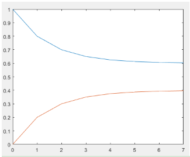
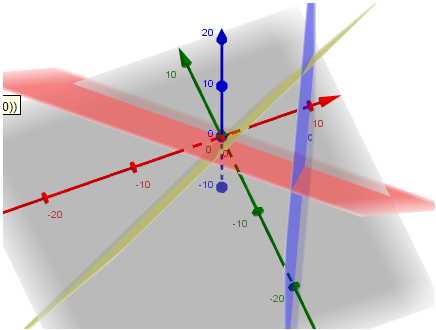
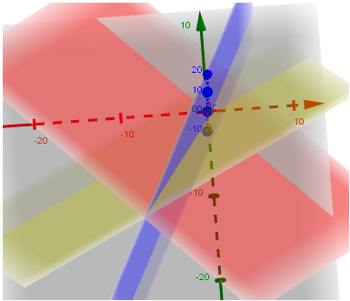
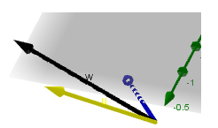

# 1. 向量和线性方程组

**1.** 当 `A = I`,下面方程的行视图是什么?并想象一下列视图
$$
\begin{array} { l l } 1 x + 0 y + 0 z = 2 \\ 0 x + 1 y + 0 z = 3 \\ 0 x + 0 y + 1 z = 4 \end{array} \quad \text { or } \quad \left[ \begin{array} { l l l } 1 & 0 & 0 \\ 0 & 1 & 0 \\ 0 & 0 & 1 \end{array} \right] \left[ \begin{array} { l } x \\ y \\ z \end{array} \right] = \left[ \begin{array} { l } 2 \\ 3 \\ 4 \end{array} \right]

\tag{Ex1}
$$
解: 行视图,是x = 2平面,y= 3平面,z = 4平面,相交于第一象限的(2,3,4)的点.列视图是 $2\vec{I} + 3\vec{j} + 4\vec{z} = (2,3,4)$

**扩展1:** 上式左边的3个方程分别乘以2,3,4,得到 $DX = B$ 
$$
\begin{array} { l l } 
2 x + 0 y + 0 z = 4 \\ 
0 x + 3 y + 0 z = 9 \\ 
0 x + 0 y + 4 z = 16 \end{array} 
\quad \text { or } \quad 

DX = \left[ \begin{array} { l l l } 2 & 0 & 0 \\ 0 & 3 & 0 \\ 0 & 0 & 4 \end{array} \right] \left[ \begin{array} { l } x \\ y \\ z \end{array} \right] = \left[ \begin{array} { l } 4 \\ 9 \\ 16 \end{array} \right] = B
$$
为何行视图不变?解 `X` 变了吗? 列视图的改变呢?

行视图不变,是因为方程左右2边只是乘以系数,平面不变,比如第一个平面还是x = 2.列改变了,**但是解不变**,也就是说线性组合不变,$X =x$.

**扩展2:** 将 `Eq(Ex1)` 左边的方程1加到方程2,将得到新方程组
$$
x = 2,x+y = 5,z=5
$$
行视图,列视图,系数矩阵和解是否有改变?

明显,行视图的平面不一样了,列视图也不一样了,系数矩阵也改变了,但是**解还是不变**


---

**2.** 查看下面方程组
$$
\begin{array} { r } x + y + z = 2 \\ x + 2 y + z = 3 \\ 2 x + 3 y + 2 z = 5 \end{array}
$$
注意,第3个方程式前面2个方程相加得到.前2个方程相交于一条直线L,而第三个方程**包含那条**直线.所以,如果x,y,z满足前2个方程,那么就满足第3个方程.所以这个方程组有无穷多解,**整条直线L都是解**

但,如果将第3个平面平行移动为 $2x+3y+2z = 9$,现在整个方程系统就无解,为何?因为现在 `Eq1+Eq2 -Eq3 ` 变成 $= = -4$.Eq1和Eq2还是相交于直线L.**但是Eq3现在不包含L**.

注意,列1=列3,上式矩阵是奇异的

---

**3.** 当A是 m-n 矩阵,那么Ax = b的方程当做,行视图当做的平面,是 **n** 维的平面,但A的列是 **m** 维向量

---

**下面例题是作用在向量上的特殊的矩阵**

**4.** 已知,2-2单位矩阵`I` 乘以 $\left[\begin{matrix} x  \\ y	\\ \end{matrix} \right]$ 还是 $\left[\begin{matrix} x  \\ y	\\ \end{matrix} \right]$  ,而下面的P是**交换矩阵(exchange matrix)**
$$
\left[\begin{matrix} 
0 & 1 \\
1 & 0 \\
\end{matrix} \right]

\left[\begin{matrix} x  \\ y	\\ \end{matrix} \right] = \left[\begin{matrix} y  \\ x	\\ \end{matrix} \right]
$$
而下面的矩阵`R`,将向量旋转 $90^{\circ}$ ,也就是
$$
Rx = \left[\begin{matrix} 
0 & 1 \\
-1 & 0 \\
\end{matrix} \right]

\left[\begin{matrix} x  \\ y	\\ \end{matrix} \right]  = \left[\begin{matrix} y  \\ -x	\\ \end{matrix} \right]
$$
矩阵$R^2$,将向量旋转 $180^{\circ}$ :
$$
R^2x = -Ix
\left[\begin{matrix} 
-1 & 0 \\
0 & -1 \\
\end{matrix} \right]

\left[\begin{matrix} x  \\ y	\\ \end{matrix} \right]  = \left[\begin{matrix} -x  \\ -y	\\ \end{matrix} \right]
$$

> sp:首先,怎么看出向量是90度夹角,**点乘是0啊**. 180度就是乘以-1.其次,注意这里为何写成 $R^2$ ,现在猜测是 $R * R = R^2$

那么,有没有旋转45度的矩阵R呢?如R作用在(1,0)上,变成 $(\sqrt{2}/2,\sqrt{2}/2)$,作用在(0,1)上,是$(-\sqrt{2}/2,\sqrt{2}/2)$.嗯....有点难,想不出来,答案是
$$
R = \frac { 1 } { 2 } \left[ \begin{array} { l r } \sqrt { 2 } & - \sqrt { 2 } \\ \sqrt { 2 } & \sqrt { 2 } \end{array} \right]
$$
R的列就是(1,0),(0,1)旋转而来的!好好理解一下

再看看三维的情况,注意P是怎么变换x,y,z的顺序的
$$
Px = \left[\begin{matrix} 
0 & 1 & 0\\
0 & 0 & 1\\
1 & 0 & 0\\
\end{matrix} \right] 

\left[\begin{matrix} 
x  \\
y  \\
z  \\
\end{matrix} \right] = \left[\begin{matrix} 
y  \\
z  \\
x  \\
\end{matrix} \right]
$$
而P的**逆矩阵**Q可以将x,y,z恢复
$$
Qx' = \left[\begin{matrix} 
0 & 0 & 1\\
1 & 0 & 0\\
0 & 1 & 0\\
\end{matrix} \right] 


\left[\begin{matrix} 
y  \\
z  \\
x  \\
\end{matrix} \right] = \left[\begin{matrix} 
x  \\
y  \\
z  \\
\end{matrix} \right]
$$

> sp:好像Q就是P右移1行!


**5. ** 求2-2和3-3矩阵E,可以从x的第2个分量,减去第1个分量,如:
$$
E \left[ \begin{array} { l } 3 \\ 5 \end{array} \right] = \left[ \begin{array} { l } 3 \\ 2 \end{array} \right] \quad \text { and } \quad E \left[ \begin{array} { l } 3 \\ 5 \\ 7 \end{array} \right] = \left[ \begin{array} { l } 3 \\ 2 \\ 7 \end{array} \right]
$$
解:列出方程的话,还是比较明显的:
$$
E = \left[\begin{matrix} 
1 & 0 \\
-1 & 1 \\
\end{matrix} \right],\quad 

E = \left[\begin{matrix} 
1 & 0 & 0\\
-1 & 1 & 0\\
0 & 0 & 1\\
\end{matrix} \right]
$$

> sp:是下三角,应该是后面讲到的消去矩阵


**6.** 什么矩阵 $P_1,P_2$ 可以将向量(x,y)投影到 x,y 轴产生 (x,0),(y,0)

解:
$$
P_1 = \left[\begin{matrix} 
1 & 0 \\
0 & 0 \\
\end{matrix} \right]

,\quad 
P_2 = \left[\begin{matrix} 
0 & 0 \\
0 & 1 \\
\end{matrix} \right]
$$
将 v= (5,7)分别乘以 $P_1,P_2$:(sp:注意下面的乘法顺序)
$$
P_1 v = \left[\begin{matrix} 
5  \\
0	\\
\end{matrix} \right],\quad 

P_2P_1v = \left[\begin{matrix} 
0  \\
0	\\
\end{matrix} \right]
$$

---

**7.** 设
$$
A = \left[ \begin{array} { l l } 1 & 2 \\ 3 & 4 \end{array} \right] \quad \boldsymbol { x } = \left[ \begin{array} { r } 5 \\ - 2 \end{array} \right] \quad \boldsymbol { b } = \left[ \begin{array} { l } 1 \\ 7 \end{array} \right]
$$
在 Matlab下,什么命令可以测试 Ax = b

看 `r = A* x - b`  是否打印都是0

---

**8.** 3个未知量,2个线性方程,行视图是**3维下**的**2个**平面,而列视图是在**2维**空间,解通常是一个一条直线

而2个未知数x,y,4个线性方程的话,行视图**2维**平面下的 **4** 条直线,列视图是在 **4维** 空间.**除非右边的向量是左边2个向量的线性组合,否则方程无解**


## 1.1. 挑战问题

**1.** 设 $u_o= (1,0)$,马尔科夫矩阵是 `A= [.8 .3;.2 .7]`,将矩阵和 $u_0$ 相乘7次,看看趋势.2种书写方式,如下所示

**方式1:**

```matlab
%创建列向量u
u =[1;0];
% 马尔科夫矩阵
A= [.8 .3;.2 .7];
% 赋值到变量,k是一个数组
x = u; k = [0:7]
% 循环语句,size(x,2)计算的是矩阵x的第二个维度的长度,也就是有多少列
% 这里的x是列数目不断增加的矩阵,最后是2-7的矩阵
while size(x,2)<=7
u = A*u;x = [x u];
end
% 这里k的长度是7,而x矩阵的每一行都是7个元素,所以下图红蓝线分别表示x2行的值
plot(k,x);

```

**方式2**

```matlab
%创建列向量u
u =[1;0];
% 马尔科夫矩阵
A= [.8 .3;.2 .7];
x = u; k = [0:7]
for j=1:7
u = A*u;x = [x u];
end
plot(k,x);
```

图像如下所示,逐渐逼近.6和.4



---

**2. Multiplying by A is a linear transformation.**  这句话的意思是: **如果w是 u 和 v 的组合,那么Aw 就是 Au和Av ==同样的==组合!** 正是因为这种线性化,所以才叫线性代数

设 $u = \left[\begin{matrix}  1  \\ 0	\\ \end{matrix} \right],v = \left[\begin{matrix}  0  \\ 1	\\ \end{matrix} \right]$,那么 Au 和 Av 就分别是A的2列.如果 $w = \left[\begin{matrix}  5  \\ 7	\\ \end{matrix} \right],w = cu +dv$,,那么Aw和Au,Av有什么联系?

$w = 5u + 7v$,而 $Aw = 5Au + 7Av$,同样的组合!


# 2. 消去的思想


**1.** 对于如下的系统,a是什么值的时候,消去会永久失败或暂时失败
$$
\begin{array} { l } a x + 3 y = - 3 \\ 4 x + 6 y = 6 \end{array}
$$
解:如果 a = 2,那么消去失败,在行视图,就是2条平行的直线,没有交点.如果 a = 0,那么只需要行交换后,就可以向后替换求解

---

**2.** k是什么值的时候,消去会失败?而哪些情况可以通过行交换求解?在每种情况,判断一下解的数量
$$
\begin{array} { l } k x + 3 y = 6 \\ 3 x + k y = - 6 \end{array}
$$
解: 

- 如果 k = 3,那么就是2条平行直线,消去永久失败,没有解
- 如果k = -3,那么2个式子加起来,得到0=0,**无穷多解**
- 如果k = 0,需要换交换,1个解

---

**3.** 线性方程组不可能恰好有2个解,为什么?

- 如果(x,y,z),(X,Y,Z) 是2个解,那么其他解是什么?
- 如果25个平面相交在一个点,那它们还相交在哪里? 

解: $\frac{1}{2}(x+X,y+Y,z+Z)$ 也是一个解.注意理解为什么,设
$$
ax+by+cz = m \\
aX+bY+cZ = m
$$
那么
$$
\frac{1}{2}a(x+X) + \frac{1}{2}b(y+Y) + \frac{1}{2} c(z+Z) = m
$$
另外,只要系数能凑成1,都是解,也就是说,$\frac{1}{4}(x,y,z) + \frac{12}{3}(X,Y,Z)$ 也是解

这25个平面肯定相交于过这2点的整个直线

---

**4.** 如果行1和行2是一样的,消去可以进行到哪里?列1和列2一样,那个主元缺失?
$$
\begin{array} { l l }

2 x - y + z = 0 \quad & 2 x + 2 y + z = 0 \\ 
2 x - y + z = 0 & 4 x + 4 y + z = 0 \\ 
4 x + y + z = 2 & 6 x + 6 y + z = 2 \end{array}
$$
解:如上面方程组,第一部分是相等,第一次消去之后,行2全部是0,然后r2和r3进行行交换,交换之后,第3个主元不存在,失败

如果列c1和c2相等,那么第一次消去,r2前2个位0,第2次消去,r3的前2个也为0 ,然后就失败了,没有第2个主元

---

**5.** 对于下面方程组,q是什么的时候是奇异的?而此时,当t是什么的时候,有无穷多解?求出z = 1的解
$$
\begin{array} { r } x + 4 y - 2 z = 1 \\ x + 7 y - 6 z = 6 \\ 3 y + q z = t \end{array}
$$
解:进行消去,可以得到
$$
\begin{array} { r } 
x + 4 y - 2 z = 1 \\ 
3y - 4z = 5 \\
(q+4) z = t-5

\end{array}
$$
所以,q= -4,方程组奇异.如果此时t = 0,那么r3 就是 0=0,无穷多解.如果 z= 1,那么从r2得到y = 3,再从r1得到x =-9

---

**6.** 就算3个平面不平行,但是也可能没有交点.如果系数矩阵A的行3是前面2行的**组合**,如左边r3=r1+r3但右边不是.这时看上去,3个平面形成了一个三角形.例如下面方程组
$$
\begin{aligned}
x+y+z = 0 \\
x-2y-z = 0\\
2x-y = 4
\end{aligned}
$$
虽然没有平行的平面,但是依然没有解,看下面的图像



端视图看到的是三个平面形成了一个三角形.也就说收他们之间的交线互相平行.而如果右边加起来也刚好相等的话,那么**三个平面相交成一条直线**,如下



这是为什么呢?假设左边右边加起来都相等,那么等式3就是等式1,2的和,表示等式3代表的平面包含等式1,2的交线.而当左边相等右边不等的时候,也就是等式3会在**相等的基础上平移**,和1,2平面产生另外的交线,并且三条交线是平行的

列视图也是一样的.假设第三列是1,2列的组合,那么这三个列代表的向量就出在同一个平面上.如下所示



如果右边b向量刚好在这个平面上,就有解,而且无穷多解.但是如果b向量不在这个平面上,那么就无解

---

**7.** 如果对于A矩阵,行的和是4,8.列的和是2,s
$$
A = \left[ \begin{array} { l l } a & b \\ c & d \end{array} \right] \quad \begin{array} { l l } a + b = 4 & a + c = 2 \\ c + d = 8 & b + d = s \end{array}
$$

那么只有在s是什么值的时候,这个系统才有解?

解:不会做啊...啊,其实只要把4个式子全部加起来,可以得到
$$
a+b+c+d = 12 = 2+s \Rightarrow s = 10
$$


## 2.1. 挑战问题

**1.** 如果A(,5,5) = 11,U(5,5) = 4,那么A(5,5)换成另外什么值的时候,A奇异?

解: 如果A(5,5)=11,并且U(5,5) = 4.那么说明,最后产生的U(5,5)通过11 -7产生的,那么如果A(5,5)= 7,最后产生的P(5,5)变成0,所以奇异

---

**2.**  假设A变成U的消去过程中,没有行交换,那么 U 的第 `j` 行,是A的那些行的组合?如果Ax = 0,是否Ux = 0?如果Ax = b,是否Ux = b?如果A是下三角,上三角的U是什么?

解: 很明显,U的行 `j` 是A的 $1\sim j$ 行的线性组合.Ax =0,Ux = 0是对的,但是如果Ax = b,那么Ux=b是不一定的,增广矩阵消去一下就会明白的.

而如果A已经是下三角,那么U就是A的对角线,自己写个例子尝试一下就会明白的!比如

$$
\begin{array} { l l } 3 x & = 3 \\ 6 x + 2 y & = 8 \\ 9 x - 2 y + z & = 9 \end{array} \Rightarrow \quad 

\begin{array} { l  } 3 x &= 3 \\ 2 y  &= 2 \\ z  &= 2 \end{array}
$$
A的对角线3,2,1就是U了

---

**3.** 假设100个方程100个未知数 $(x_1,...x_{100})$, 经过消去之后,第100个方程变成0=0,所以系统是奇异的

**1.** 消去其实是行之间的线性组合,所以在这个奇异系统,这100行的某些线性组合是:全部是0.

**2.** 奇异系统的Ax = 0有无穷多解,这意味着,这100列的某些线性组合是:全部是0


# 3. 使用矩阵消去

**1.** $M = \left[\begin{matrix} a & b \\ c & d \end{matrix} \right]$ 的行列式是 $\det M = ad -bc$.现在将 M 的 $r_2 - \ell r_1$,产生新矩阵 $M^*$,证明，对任何 $\ell$, $\det M = \det M^*$.注意，当 $\ell = c/a$,**主元之间的乘积=行列式**： $a(d-\ell b) = ad - bc$

解：
$$
M = \left[\begin{matrix} a & b \\ c & d \end{matrix} \right] 
\qquad 
M^* = \left[\begin{matrix} a & b \\ c-\ell a  & d-\ell b \end{matrix} \right]
$$
现在计算$M^*$行列式
$$
\begin{aligned}
\det M^* &= a(d-\ell b) - b(c- \ell a)  \\
&= (ad - bc ) + (\ell ab - \ell ab) \\
&= ad -bc
\end{aligned}
$$
所以消去过程,行列式不变！当 $\ell = c/a$,**主元之间的乘积=行列式**！

---

**2.** 假设消去过程，有2种方式

1. $E_{21}$ 从 $r_2$ 减去 $r_1$,然后 $P_{23}$ 交换 $r_2,r_3$，整个步骤可以表达为 $M= P_{23}E_{21}$
2. $P_{23}$ 交换 $r_2，r_3$,然后 $E_{31}$ 从 $r_3$ 减去 $r_1$, 整个步骤可以表达为 $M^*= E_{31}P_{23}$

解释一下，为何虽然E之间不同， $M = M^*$

解： 新计算除$M，M^*$
$$
E_{21} =  \left[\begin{matrix} 
1 & 0 & 0\\
-1 & 1 & 0\\
0 & 0 & 1\\
\end{matrix} \right]
,\quad


E_{31} =  \left[\begin{matrix} 
1 & 0 & 0\\
0 & 1 & 0\\
-1 & 0 & 1\\
\end{matrix} \right]
,\quad

P_{23} = \left[\begin{matrix} 
1 & 0 & 0\\
0 & 0 & 1\\
0 & 1 & 0\\
\end{matrix} \right] 


\\[10ex]


P_{23}E_{21} = E_{31}P_{23} = \left[\begin{matrix} 
1 & 0 & 0\\
0 & 0 & 1\\
-1 & 1 & 0\\
\end{matrix} \right]  
$$
为何会这样呢？因为先进行行交换的话，原来的 r2 变成 r3,所以需要 $E_{31}$,但以完整步骤来看的话，$M，M^*$ 是一样的

---

**3.** 观察一下下面的矩阵乘法 $M_1AM_2$
$$
\left[ \begin{array} { l l l } 0 & 0 & 1 \\ 0 & 1 & 0 \\ 1 & 0 & 0 \end{array} \right] \left[ \begin{array} { l l l } 1 & 2 & 3 \\ 4 & 5 & 6 \\ 7 & 8 & 9 \end{array} \right] \left[ \begin{array} { l l l } 0 & 0 & 1 \\ 0 & 1 & 0 \\ 1 & 0 & 0 \end{array} \right] = 

\left[ \begin{array} { l l l } 9 & 8 & 7 \\ 6 & 5 & 4 \\ 3 & 2 & 1 \end{array} \right]
$$
注意

- $M_1$ **左乘** A，所以作用在 A 的**行**上，效果是交换 A的 r1,r3
- $M_2$ **右乘** A，所以作用在 A 的**列**上，效果是交换 A的 c1,c3

---

**4.** 解释为何在乘法 $EB$ 当中，如果B的c3为0，那么$EB$ 的c3全部是0；如果B的r3全为0，但 EB 的r3可能不为0

解： 因为，E * （B的第三列） = EB的第三列，所以只要B的c3为0，那么EB的c3肯定是0。但如果B的行3都为0，E却可能把E的其他行加到行3，所以EB的行3不一定全是0

---

**5.** 把下面问题写成 Ax = b 的矩阵形式，然后求解

- X和Y的年龄之和是33，X的年龄是Y的2倍
- y = mx+c的直线方程上，（2，5），（3，7）都在这条直线上，求m和c

解： 对于第1个问题，可以写成
$$
\begin{cases}
x+y= 33 \\
x- 2y =0
\end{cases}

\quad \Rightarrow 

\left[\begin{matrix} 
1 & 1 \\
1 & -2 \\
\end{matrix} \right] 

\left[\begin{matrix} 
x  \\
y  \\
\end{matrix} \right] = 

\left[\begin{matrix} 
33  \\
0  \\
\end{matrix} \right]

\Rightarrow x=22,y=11
$$
第2个问题
$$
\begin{cases}
2m+c= 5 \\
3m+c =7
\end{cases}

\quad \Rightarrow 

\left[\begin{matrix} 
2 & 1 \\
3 & 1 \\
\end{matrix} \right] 

\left[\begin{matrix} 
m  \\
c  \\
\end{matrix} \right] = 

\left[\begin{matrix} 
5  \\
7  \\
\end{matrix} \right]

\Rightarrow c=1,m=2
$$

---

**6.** 抛物线 $y = a+bx+cx^2$ 经过点 $(x,y) = (1,4),(2,8），（3，14）$ 求矩阵方程，并求解a,b,c

解： 先列出方程
$$
\begin{cases}
a+b+c = 4\\
a+2b+4c = 8 \\
a+3b+9c = 14 
\end{cases}

\quad \Rightarrow

\left[\begin{matrix} 
1 & 1 & 1\\
1 & 2 & 4\\
1 & 3 & 9\\
\end{matrix} \right]  

\left[\begin{matrix} 
a  \\
b  \\
c  \\
\end{matrix} \right] = \left[\begin{matrix} 
4  \\
8  \\
14  \\
\end{matrix} \right]

\Rightarrow a=2,b=1,c=1
$$
注意这里为何抛物线方程也可以用线性方程组求解。虽然有 $x^2$ 出现，但是 $x^0,x^1,x^2$ 等**都是系数矩阵，变量只有a,b,c**。以这个视角来看，还是线性方程组

---

**7.** 如果B的列都是相同的，那么EB的列也都是相同的，这时因为，**EB的列，就是 E 乘以 B 的每一列**，但如果B的行都是相同的，比如[1 2 4],EB的行都不是[1,2,4]，如
$$
\left[\begin{matrix} 
1 & 0 \\
1 & 1 \\
\end{matrix} \right]  

\left[\begin{matrix} 
1 & 2 & 4\\
1 & 2 & 4\\
\end{matrix} \right]  = 

\left[\begin{matrix} 
1 & 2 & 4\\
2 & 4 & 8\\
\end{matrix} \right]
$$

---

**8.** 增广矩阵可以一次性求解多个方程组，只要系数矩阵是一样的，对于如下2个方程组
$$
\left[ \begin{array} { l l } 1 & 4 \\ 2 & 7 \end{array} \right] \left[ \begin{array} { l } x \\ y \end{array} \right] = \left[ \begin{array} { l } 1 \\ 0 \end{array} \right] \text { and } \left[ \begin{array} { l l } 1 & 4 \\ 2 & 7 \end{array} \right] \left[ \begin{array} { l } u \\ v \end{array} \right] = \left[ \begin{array} { l } 0 \\ 1 \end{array} \right]
$$
求解过程是
$$
\left[ \begin{array} { l l l l } 1 & 4 & 1 & 0 \\ 2 & 7 & 0 & 1 \end{array} \right] \rightarrow \left[ \begin{array} { r r r r } 1 & 4 & 1 & 0 \\ 0 & - 1 & - 2 & 1 \end{array} \right] 

\Rightarrow x = \left[\begin{matrix} 
-7 \\
2  \\
\end{matrix} \right],x^* = \left[\begin{matrix} 
4  \\
-1  \\
\end{matrix} \right]
$$
**9.** 对于如下增广矩阵，选择a,b,c,d，使得方程组没有解，或无穷多解
$$
\left[ \begin{array} { l l } A & b \end{array} \right] = \left[ \begin{array} { l l l l } 1 & 2 & 3 & a \\ 0 & 4 & 5 & b \\ 0 & 0 & d & c \end{array} \right]
$$
解： 

- 只要 $d = 0 \ne c$ ，方程组无解
- 只要$d = 0 = c$ ,方程组无穷多解

a,b变量无影响！

---

**10.** 如果 $AB = I,BC = I$,使用结合律(associative law) 证明 $A= C$

解： 
$$
A= AI = A(BC) = (AB)C = IC = C
$$


# 4. 矩阵操作法则


**1.** 对下面问题判断对错

1. 如果B的c1和c3一样，那么AB的c1和c3也是一样的
对，以B对A的列组合分析即可，参见`<01-02 LK1>`
2. 如果A的r1和r3是一样的，AB的r1和r3也是一样的
对，以A对B进行组合分析即可`<01-02 LK1>`
3. $(AB)^2 = A^2B^2$
**错误**： $(AB)^2 = (AB)(AB) \ne A^2 B^2$ ,因为矩阵乘法**不满足交换律**

---

**2.** 从实践尝试一下矩阵乘法的为何**不遵守**交换律，遵守结合律

首先看**结合律**。参考下面矩阵：A是操作目标

1. E将A的r1加到r2
2. F将A的c1加到c2

$$
A =\left[\begin{matrix} 
a & b \\
c & d \\
\end{matrix} \right] ,\quad 

E = \left[\begin{matrix} 
1 & 0 \\
1 & 1 \\
\end{matrix} \right] ,\quad

F =\left[\begin{matrix} 
1 & 1 \\
0 & 1 \\
\end{matrix} \right]
$$

那么，首先计算EA:
$$
E A = \left[ \begin{array} { l l } 1 & 0 \\ 1 & 1 \end{array} \right] \left[ \begin{array} { l l } a & b \\ c & d \end{array} \right] = \left[ \begin{array} { c c } a & b \\ a + c & b + d \end{array} \right]
$$
然后计算EAF
$$
EAF = ( E A ) F = ( E A ) \left[ \begin{array} { l l } 1 & 1 \\ 0 & 1 \end{array} \right] = \left[ \begin{array} { c c } a & a + b \\ a + c & a + c + b + d \end{array} \right]
$$
现在，先进行步骤2，再进行步骤1：
$$
A F = \left[ \begin{array} { l l } a & a + b \\ c & c + d \end{array} \right] ,\quad 

E(AF)= (EA)F = \left[ \begin{array} { c c } a & a + b \\ a + c & a + c + b + d \end{array} \right]
$$
所以，**矩阵乘法确实满足结合律**

现在看看交换律,假设E，A不变

1. E还是把A的r1加到r2
2. 而F把EA的r2加到r1

$$
F ( E A ) = \left[ \begin{array} { l l } 1 & 1 \\ 0 & 1 \end{array} \right] \left[ \begin{array} { c c } a & b \\ a + c & b + d \end{array} \right] = \left[ \begin{array} { c c } 2 a + c & 2 b + d \\ a + c & b + d \end{array} \right]
$$

现在把操作顺序缓过来，也就是先 FA,然后EFA
$$
F A = \left[ \begin{array} { c c } a + c & b + d \\ c & d \end{array} \right]

\Rightarrow \quad 

E ( F A ) = \left[ \begin{array} { c c } a + c & b + d \\ a + 2 c & b + 2 d \end{array} \right]
$$
从而，$E(FA) \ne F(EA)$,**矩阵乘法确实不满足交换律**

---

**3.** 对于下面矩阵，证明$(A+B)^2 \ne A^2 + 2AB +B^2$
$$
A = \left[ \begin{array} { l l } 1 & 2 \\ 0 & 0 \end{array} \right] \quad  \quad B = \left[ \begin{array} { l l } 1 & 0 \\ 3 & 0 \end{array} \right]
$$
解： 

$$
( A + B ) ^ { 2 } = （A+B）(A+B) =  A ^ { 2 } + A B + B A + B ^ { 2 }  = \left[ \begin{array} { r r } 10 & 4 \\ 6 & 6 \end{array} \right]\\
\text { 但是 } A ^ { 2 } + 2 A B + B ^ { 2 } = \left[ \begin{array} { r r } 16 & 2 \\ 3 & 0 \end{array} \right]
$$
这其实就是因为不满足交换律！

---

**4.**  对于如下矩阵A，$E_{21},E_{31}$ 在第一个主元之下产生0
$$
A = \left[ \begin{array} { l l l } 2 & 1 & 0 \\ - 2 & 0 & 1 \\ 8 & 5 & 3 \end{array} \right]，\quad 

E _ { 21 } = \left[ \begin{array} { l l l } 1 & 0 & 0 \\ 1 & 1 & 0 \\ 0 & 0 & 1 \end{array} \right] ,\quad

E _ { 31 } = \left[ \begin{array} { r r r } 1 & 0 & 0 \\ 0 & 1 & 0 \\ - 4 & 0 & 1 \end{array} \right]
$$
现在 $E_{21}E_{31}$ 可以一次性完成消去
$$
E = E _ { 31 } E _ { 21 } = \left[ \begin{array} { r r r } 1 & 0 & 0 \\ 1 & 1 & 0 \\ - 4 & 0 & 1 \end{array} \right],\quad E A = \left[ \begin{array} { l l l } 2 & 1 & 0 \\ 0 & 1 & 1 \\ 0 & 1 & 3 \end{array} \right]
$$
在**例3**当中，分块乘法说的是，列1可以通过如下完成消去
$$
E A = \left[ \begin{array} { c c } 1 & 0 \\ - c / a & I \end{array} \right] \left[ \begin{array} { c c } a & b \\ c & D \end{array} \right] = \left[ \begin{array} { c c } a & b \\ 0 & D - c b / a \end{array} \right]
$$
那么对于上面的消去，c,D和$D - cb/a$ 分别是什么？

解： $c = \left[\begin{matrix} -2  \\8  \\\end{matrix} \right],D = \left[\begin{matrix} 0 & 1 \\ 5 & 3 \end{matrix} \right],a = [2],b= \left[\begin{matrix} 1 & 0\end{matrix} \right]$,那么
$$
cb/a = 
\left[\begin{matrix} -2  \\8  \\ \end{matrix} \right] 
\left[\begin{matrix} 1 & 0 \end{matrix} \right]  /2 =  

\left[\begin{matrix} -1 & 0 \\ 4 & 0 \end{matrix} \right]
$$
那么
$$
D - cb/a =  \left[\begin{matrix} 0 & 1 \\ 5 & 3 \end{matrix} \right] - \left[\begin{matrix} -1 & 0 \\ 4 & 0 \end{matrix} \right] = \left[\begin{matrix} 1 & 1 \\ 1 & 3 \end{matrix} \right]
$$
就是EA的右下角部分！


## 挑战问题

**1.实践问题** 如果A是 m-n,B是 n-p,C是p-q，那么

- (AB)C需要的乘法次数是： $mnp + mpq$
- A(BC)需要的乘法次数是： $mnq+npq$

> sp：原来还有这些tricks

**1.** 如果 A是[2,4],B是[4,7],C是[7,10]，我们计算一下,也就是 `m =2,n = 4,p = 7,q= 10`
$$
\begin{cases}
(AB)C = 2*4*7 + 2*7*10 = 196\\
A(BC) = 2*4*10 + 4*7*10 = 360\\

\end{cases}
$$
所以AB先乘比较好，这样对于C这个[7,10]矩阵可以用比较上的行去乘

**2.** 如果都是是n个分量的列向量,你会选择 $(u^Tv)w^T$ 还是 $u^T(vw^T)$

- 首先,$u^Tv$ 是 1-n 乘以 n-1,需要n次乘法,得到1-1矩阵,然后再乘以 $w^T$ 需要n次乘法,一共是2n次乘法
- 而 $vw^T$ 是 n-1 乘以 1-n,这里就需要 $n^2$ 乘法,得到 n-n 矩阵,然后$u^T$ 再去乘,是 1-n 乘以 n-n,又需要 $n^2$ 次乘法,所以总共是 $2n^2$ 次乘法!

**3.** 除以mnpq,证明 $(AB)C$ 在 $n^{-1} + q^{-1} < m^{-1} + p^{-1}$ 的时候更快
$$
(AB)C:\quad \frac{mnp + mpq}{mnpq} = q^{-1} + n^{-1}\quad ...(1)\\
A(BC):\quad \frac{mnq+npq}{mnpq} = p^{-1} + m^{-1} \quad... (2)
$$
从这个可以得到一个简单但重要的规则:**如果 矩阵 A,B 乘以向量v来得到ABv,那么不要先乘矩阵!**因为,这里的v相当于C,所以q代表了列的数目,也就是1,所以(1) 是 $1+n^{-1} > 1$,而2个2个小于1的数字相加,只要p,m都大于2,那么(2)一定小于1

---

**3.** 为了证明 **(AB)C = A(BC)**,使用 B 的列 $b_1...b_n$.假设 C 只有一列,元素是$c_1...c_n$.

- 首先那么 AB 的列是 $Ab_1,...,Ab_n$,然后 $(AB)c = c_1Ab_1+...+c_nAB_n$
- 换一种方式,$Bc$ 只有1列: $c_1b_1+...+c_nb_n$,然后,$A(Bc)=A(c_1b_1+...+c_nb_n) = c1AB_1+...c_nAB_n$

这就证明了C四一列的情况.C的其他列的情况是类似的.因此证明成立.现在把结论应用到逆矩阵: 如果 `BA = I, AC = I`,那么左逆B和右逆C是相等的

解:  **结合律的一个重要应用就是左逆=右逆**,其实证明很简单
$$
B = B(AC) = (BA)C = C
$$


# 5. 逆矩阵

**1.** 如果A是可逆的，而且AB= AC，证明 `B = C`.  然后对 $A = \left[\begin{matrix} 1 & 1 \\ 1 & 1 \end{matrix} \right]$,找到两个不同的矩阵,使得AB = AC

解:sp:这一题其实说明了，只有在**A可逆情况下，AB = BC 才能推出 B = C!**
$$
AB = AC \Rightarrow A^{-1}AB = A^{-1}AC \Rightarrow B = C
$$
而上述的A不可逆.AB = AC,那么,A(B-C) = 0,设 $B-C = \left[\begin{matrix} a & c \\ b & d \end{matrix} \right]$ ,得：
$$
\left[\begin{matrix} 1 & 1 \\ 1 & 1 \end{matrix} \right] 
\left[\begin{matrix} a & c \\ b & d \end{matrix} \right]
= 

\left[\begin{matrix} a+b & c+d \\ a+b & c+d \end{matrix} \right] = 0
$$
所以B-C矩阵只要满足 `a+b = 0,c+d = 0`,也就是说 `B-C` 只要满足 $\left[\begin{matrix} x & y \\ -x & -y \end{matrix} \right]$ 的形式即可

---

**2. 重要** 证明.如果对于A, r1 +r2 = r3,那么A就是不可逆的:

1. 解释 `Ax = (1,0,0)` 不可能有解
2. 哪个预测 $b =(b_1,b_2,b_3) $, `Ax = b`有解
3. 在消去的过程中,r3发生了什么

解:

1. 在Ax = (1,0,0)当中,`方程1+方程2 - 方程3` 变成 `0 =1` .矛盾
2. 必须是 $b_1+ b_2= b_3$
3. 行3变成了空行,没有第三个主元!

我们再看看列的情况： 假设对于A是3-3,并且,`c1+c2 = c3` ,证明A是不可逆的:

1. 找到Ax = 0的一个非0解
2. 消去过程中,c1 +c2 = c3,会一直保持,解释一些为什么没有第三个主元

解：

1. 向量 `x = (1,1,-1)` 可以得到Ax = 0
2. 消去后,c1和c2的最后一个元素都是0,那么c3 = c1+ c2也是0,所以第3个主元不存在


---

**3.** 假设A是可逆的,交换前两行得到B,B是可逆的吗?怎么从 $A^{−1}$ 得到 $B^{−1}$ 呢?

解: B = PA,P是交换前2行的矩阵。那么 $B^{−1}  =A^{−1} P^{−1} = A^{−1}P$.(这个P有$P^{−1}=P$）。注意看这个式子，**P交换A的2行得到B，而 $P^{−1}$  交换了$A^{−1}$ 的前两列得到 $B^{−1}$!**


---

**4.** 对于下面的两个矩阵,怎么找到逆矩阵比较快呢?
$$
A = \left[ \begin{array} { l l l l } 0 & 0 & 0 & 2 \\ 0 & 0 & 3 & 0 \\ 0 & 4 & 0 & 0 \\ 5 & 0 & 0 & 0 \end{array} \right] \quad  B = \left[ \begin{array} { l l l l } 3 & 2 & 0 & 0 \\ 4 & 3 & 0 & 0 \\ 0 & 0 & 6 & 5 \\ 0 & 0 & 7 & 6 \end{array} \right]
$$
解: 对于A，以 $A^{−1}$ 右乘 A 对A的列进行组合可以很快得到。对于B,**分块的求解逆矩阵!**
$$
A ^ { - 1 } = \left[ \begin{array} { c c c c } 0 & 0 & 0 & 1 / 5 \\ 0 & 0 & 1 / 4 & 0 \\ 0 & 1 / 3 & 0 & 0 \\ 1 / 2 & 0 & 0 & 0 \end{array} \right] 

\quad 

B ^ { - 1 } = \left[ \begin{array} { r r r r } 3 & - 2 & 0 & 0 \\ - 4 & 3 & 0 & 0 \\ 0 & 0 & 6 & - 5 \\ 0 & 0 & - 7 & 6 \end{array} \right]
$$
但是分块求逆矩阵应该**不是通用**的！不然在`<#5.3>` 的K矩阵当中，就不会提到：带状矩阵的逆矩阵通常都是一个密集矩阵。

---

**5.** 需要注意,A,B可逆,A+B不一定可逆:

- 假设A = -B，A,B都可逆，但A+B是0矩阵，肯定不可逆
- 而如果A,B不可逆，那么可以举出更多A+B不可逆的例子

但如果C = AB(A,B方阵)是可逆的,那么我们得到 $C^{−1}= B^{−1} A^{−1}$,所以AB也是可逆的,而且 $A^{−1}  =BC^{−1}$

---

**6.**  什么矩阵 $E_{21},E_{12} , D^{−1}$ 可以把 $A = \left[\begin{matrix} 1 & 2 \\ 2 & 6 \end{matrix} \right]$ 转换到单位矩阵 `I`.乘以 $D^{−1} E_{12} E_{21}$ 来得到 $A^{−1}$

解: 
$$
E _ { 21 } A = \left[ \begin{array} { r r } 1 & 0 \\ - 2 & 1 \end{array} \right] \left[ \begin{array} { l l } 1 & 2 \\ 2 & 6 \end{array} \right] = \left[ \begin{array} { l l } 1 & 2 \\ 0 & 2 \end{array} \right] , \quad  

E _ { 12 } E _ { 21 } A = \left[ \begin{array} { l r } 1 & - 1 \\ 0 & 1 \end{array} \right] \left[ \begin{array} { r r } 1 & 0 \\ - 2 & 1 \end{array} \right] A = \left[ \begin{array} { l l } 1 & 0 \\ 0 & 2 \end{array} \right]
$$
然后：
$$
D^{−1} * (E _ { 12 } E _ { 21 }) A = \left[\begin{matrix} 1 & 0 \\ 0 & 1/2 \end{matrix} \right] \left[ \begin{array} { l l } 1 & 0 \\ 0 & 2 \end{array} \right] = I
$$
所以，$A^{-1} = D^{−1}E _ { 12 } E _ { 21 } = \frac { 1 } { 2 } \left[ \begin{array} { r r } 6 & - 2 \\ - 2 & 1 \end{array} \right]$

---

**7.** 对于下面的矩阵,C是哪3个数字的时候是不可逆的
$$
A = \left[ \begin{array} { l l l } 2 & c & c \\ c & c & c \\ 8 & 7 & c \end{array} \right]
$$

解: c = 0(0行),c = 7(相等的列),C = 2(相等的行)

---

**8.** 假设下面的分块逆矩阵都存在,求解他们的逆矩阵
$$
\left[ \begin{array} { l l } I & 0 \\ C & I \end{array} \right] \quad \left[ \begin{array} { l l } A & 0 \\ C & D \end{array} \right] \quad \left[ \begin{array} { l l } 0 & I \\ I & D \end{array} \right]
$$


解：对于这个[2 2]的分块，使用 `<#5.3> 例3` 可求解，但更大的逆矩阵不清楚，但使用逆矩阵对上面的每一行进行组合也可以

**要小心习题4的提醒**
$$
\left[ \begin{array} { c c } I & 0 \\ - C & I \end{array} \right] \text { and } \left[ \begin{array} { c c } A ^ { - 1 } & 0 \\ - D ^ { - 1 } C A ^ { - 1 } & D ^ { - 1 } \end{array} \right] \text {and } \left[ \begin{array} { r r } - D & I \\ I & 0 \end{array} \right]
$$

---

**9.** 一个 4-4 矩阵，如果每一行的元素都是 0，1，2，3，而且顺序是**一致**的，是否有逆？如果元素是0，1，2，-3呢？这里一致的意思不是每行的元素顺序完全一样，而是元素围成环之后，元素顺序一样。

解：如果0元素都放置在对角线上，可以，但0，1，2，-3的元素不可用，**因为每一行加起来都是0.**


## 挑战问题

**1.** 设 $E_1,E_2,E_3$ 都是消去矩阵：主对角线都是1，在元素1下面， $E_1$ 在c1有a,b,c元素，$E_2$ 在$c_2$ 有 d,e元素，$E_3$ 在 $c_3$ 有f元素。 做乘法 $L = E_1E_2E_3$ 证明，这些字母元素都被直接复制到L。

注意，$E_1E_2E_3$ 和消去步骤是相反的(因为 $E_3$ 在最右边) 。但 $E_1E_2E_3$ 是**逆转消去作用，恢复到A的正确顺序！**
$$
\left[ \begin{array} { l l l l } 1 & & & \\ a & 1 & & \\ b & 0 & 1 & \\ c & 0 & 0 & 1 \end{array} \right] \left[ \begin{array} { l l l l } 1 & & & \\ 0 & 1 & & \\ 0 & d & 1 & \\ 0 & e & 0 & 1 \end{array} \right] \left[ \begin{array} { l l l l } 1 & & & \\ & 1 & & \\ & & 1 & \\ & & f & 1 \end{array} \right] = \left[ \begin{array} { l l l l } 1 & & & \\ a & 1 & & \\ b & d & 1 & \\ c & e & f & 1 \end{array} \right]
$$
这其实是 `<#6>` 的 `A = LU`


# 6. A= LU : 消去=因式分解

**1.** 如果 A 已经是一个下三角，而且对角线是1，那么 `U = I,L = A` ! 
$$
A = L = \left[ \begin{array} { l l l } 1 & 0 & 0 \\ a & 1 & 0 \\ b & c & 1 \end{array} \right]
$$
如上矩阵，看看整个 E 是：
$$
E = E _ { 32 } E _ { 31 } E _ { 21 } = \left[ \begin{array} { l l l } 1 & & \\ & 1 & \\ & - c & 1 \end{array} \right] \left[ \begin{array} { c c c } 1 & & \\ & 1 & \\ - b & & 1 \end{array} \right] \left[ \begin{array} { c c c } 1 & & \\ - a & 1 & \\ & & 1 \end{array} \right] = \left[ \begin{array} { c c c } 1 & & \\ - a & 1 & \\ a c - b & - c & 1 \end{array} \right]
$$
这个A比较丑陋，但在 `A = LU` 的形式 ，`L = A, U = I`,非常好

---

**2.** 当我们对如下A进行消去，注意，这个A是很特别的，其实就是L本身
$$
A = L = \left[ \begin{array} { c c c } 1 & 0 & 0 \\ \ell _ { 21 } & 1 & 0 \\ \ell _ { 31 } & \ell _ { 32 } & 1 \end{array} \right]

\quad \text{对A}: \quad   

E = L^{-1} =  \left[ \begin{array} { c c c } 1 & 0 & 0 \\ -\ell _ { 21 } & 1 & 0 \\ -\ell _ { 31 } & -\ell _ { 32 } & 1 \end{array} \right] \quad  \text{消去后：} U=I
$$
同时

- 把上述对A的消去步骤，应用到 `I` ，`I` 变成 $L^{-1}$ !
- 把上述对A的消去步骤，应用到 `LU` ，`LU` 变成 $U$ !

也就说明了 $E = L^{-1}$

---

**3.** 有如下结论： 如果 $A = LDU,A = L_1D_1U_1$,并且2个式子的3个因子都是可逆的，那么 $L = L_1,D = D_1,U = U_1$.也就是说，**分解是唯一的**，如果证明？

解： $LDU = L_1D_1U_1$,两边都左乘 $L_1^{-1}$,右乘 $U^{-1}$ 得到
$$
L_1^{-1}LD = D_1U_1 U^{-1}
$$
仔细观察：

- $L，L_1$ 的逆矩阵就是E啊，所以 $L,L_1^{-1}$ 肯定都是下三角，而D又是对角，所以左边下三角
- 同理，右边上三角。

再之，$L,L_1,U,U_1$ 对角线都是1.所以 $D= D_1$，$LL_1^{-1} = U_1U^{-1} = I$ .QED

---

**4. 三对角矩阵** 三对角矩阵只在对角线，对角线之上和之下有非0元素。我们看看对如下2个A进行LU分解
$$
A = \left[ \begin{array} { l l l } 1 & 1 & 0 \\ 1 & 2 & 1 \\ 0 & 1 & 2 \end{array} \right] 
= \left[ \begin{array} { l l l } 1 & & \\ 1 & 1 & \\ 0 & 1 & 1 \end{array} \right] \left[ \begin{array} { l l l } 1 & 1 & 0 \\ & 1 & 1 \\ & & 1 \end{array} \right] = L I U
\\


A = \left[ \begin{array} { c c c } a & a & 0 \\ a & a + b & b \\ 0 & b & b + c \end{array} \right] = \text{(same L)} \left[\begin{matrix} a & - & -\\- & b & -\\- & - & c\\\end{matrix} \right] \text{(same U)}
$$
所以，一个三对角矩阵 A ，**有双对角(bidiagonal)的 L和U**。 也正是因为如此，如对下面的矩阵
$$
T = \left[ \begin{array} { l l l l } 1 & 2 & 0 & 0 \\ 2 & 3 & 1 & 0 \\ 0 & 1 & 2 & 3 \\ 0 & 0 & 3 & 4 \end{array} \right]
$$

- 主元行都只有2个非0元素，三对角！
- 主元所在的那一列，都只有一个非0元素！

所以只要一次操作，就可以得到 $\ell$  和下一个主元，参见 `<#6.3.1>` ! 就是带状矩阵的思想，**沿着对角线方向消去即可**

---

**5.简单但重要** 如果 3-3 矩阵的主元是 5，9，3，并且没有行交换，那么左上角的 2-2 矩阵 A ，也就是去除到第3行第3列，的主元是什么？

解： 主元就是5，9啊，不会边，后面的主元不会影响到前面 的主元，因为消去从左上角开始。但是注意前提：**没有行交换**


## 挑战问题

**1.** 什么可逆矩阵 $A = LU$ 可以满足 A =LU(无行交换的消去)?好问题，看看A的左上角形成的子矩阵：**A所有的左上角的 k-k 矩阵 $A_k$ 都必须是可逆的，k = 1...n**. 这句话更深入一点就是 
$$
A_k = L_k U_k \quad \text{因为} \quad  L U = \left[ \begin{array} { l l } L _ { k } & 0 \\ * & * \end{array} \right] \left[ \begin{array} { l l } U _ { k } & * \\ 0 & * \end{array} \right]
$$
> sp:那消去大矩阵就得到了被包含的小矩阵的所有消去

---


# 7. 转置和排列

**1.** 块矩阵 $\left[\begin{matrix} A & B \\ C & D \end{matrix} \right]$ 的转置是什么？ABCD是什么条件的时候，块矩阵是对称的？

解：注意，转置是 $\left[\begin{matrix} A^T & B^T \\ C^T & D^T \end{matrix} \right]$,不是 $\left[\begin{matrix} A & C \\ B & D \end{matrix} \right]$,块矩阵啊，好好想一下！若要对称，那么： $A^T = A,D^T = D,B^T = C$。参见典型例题3作为例子。

---

**2.** 对下面问题判断对错

1. 块矩阵 $\left[\begin{matrix} 0 & A \\ A & 0 \end{matrix} \right]$ 自动是一个对称矩阵
错！必须 $A^T = A$

2. 如果AB是对称的，那么它们的乘积AB是对称的
错！$(AB)^T = B^TA^T = BA$,还必须有 AB = BA的条件

3. 如果A不对称，那么 $A^{-1}$ 也不对称

在 `<#7.2>` 对称矩阵的逆矩阵也是对称的。证明过程是类似的：$(A^{−1})^T= (A^T)^{−1}$,如果要左边式子成立，$(A^T)^{−1}$ 必须等于 $A^{−1}$ ,但这样A就是对称了，和前提相反


---

**3. ** 如果A,B都是对称的，那么如下肯定对称的是

**a.**  $A^2 - B^2$
$$
(A^2 - B^2)^T = (AA)T - (BB^T) = A^TA - B^TB = AA - BB - A^2 - B^2
$$
所以对称

**b.** $(A+B)(A-B)$
$$
(A+B)(A-B) = AA-AB+BA -BB \\[3ex]

\begin{aligned}

((A+B)(A-B))^T &= (A-B)^T(A+B)^T  \\
&= (A^T - B^T)(A^T + B^T) \\
&= A^TA^T +A^TB^T - B^TA^T - B^TB^T\\
& = AA +AB - BA -BB

\end{aligned}
$$
上面2式是不一样的，所以不是对称

**c.** ABA
$$
(ABA)^T = A^TB^TA^T = ABC
$$
对称

**d.** ABAB
$$
(ABAB)^T = B^TA^TB^TA^T = BABA
$$
不对称

---

如下题目是关于 $PA = LU,A = L_1P_1U_1$ 的分解

**4.**  对于如下的A，分别用 PA = LU ，和 $A = L_1P_1U_1$  分解(在 $r2-3r1$ 之后才交换r3)
$$
A = \left[ \begin{array} { l l l } 0 & 1 & 2 \\ 0 & 3 & 8 \\ 2 & 1 & 1 \end{array} \right]
$$
解： PA = LU的方式
$$
P A = L U \rightarrow \quad 

\left[ \begin{array} { c c c } & &  1\\  & 1 \\ 1 & \end{array} \right] 

\left[ \begin{array} { l l l } 0 & 1 & 2 \\ 0 & 3 & 8 \\ 2 & 1 & 1 \end{array} \right] = 

\left[ \begin{array} { c c c } 1 & & \\ 0 & 1 & \\ 0 & 1 / 3 & 1 \end{array} \right] 

\left[ \begin{array} { c c c } 2 & 1 & 1 \\ & 3 & 8 \\ & & - 2 / 3 \end{array} \right]
$$
现在看看 $A = L_1P_1U_1$ 的形式。先对A进行r2-3r1,得到 $T = \left[ \begin{array} { l l l } 0 & 1 & 2 \\ 0 & 0 & 2 \\ 2 & 1 & 1 \end{array} \right]$，这已经可以通过行交换切换成上三角了，也就是 $U_1 = \left[ \begin{array} { l l l } 2 & 1 & 1 \\ 0 & 1 & 2 \\ 0 & 0 & 2 \end{array} \right]$，也就是 T 全部下移一行即可，那么这个置换矩阵是
$$
P = \left[\begin{matrix} 
0 & 0 & 1\\
1 & 0 & 0\\
0 & 1 & 0\\
\end{matrix} \right]
$$
但是注意，现在消去的过程是 $PEA = U_1$,那么 $A = E^{-1} P^{-1}U_1 = L_1P_1U_1$,所以要求出上面P的逆矩阵，转置即可：
$$
P^{-1} = \left[\begin{matrix} 
0 & 1 & 0\\
0 & 0 & 1\\
1 & 0 & 0\\
\end{matrix} \right]
$$
所以，最终是：
$$
A = L _ { 1 } P _ { 1 } U _ { 1 } = \left[ \begin{array} { l l l } 1 & & \\ 3 & 1 & \\ & & 1 \end{array} \right] \left[ \begin{array} { l l } & 1 \\ & & 1 \\ 1 & & \end{array} \right] \left[ \begin{array} { l l l } 2 & 1 & 1 \\ 0 & 1 & 2 \\ 0 & 0 & 2 \end{array} \right]
$$


**5.** 对于对称矩阵A

- 首先用 $E_{21}$ 消去第一个主元下面的3，然后 $E_{21}AE_{21}^T$ 消去第2列的3。
- 然后用 $E_{32}$ 消去 第2个主元下面的4，然后 $E_{32}E_{21}AE_{21}^TE_{32}^T$ 消去第3列的4

那么A简化为D,也就是 $E_{32}E_{21}AE_{21}^TE_{32}^T = D$。逆这些E矩阵，验证 $A = LDL^T$
$$
A = \left[ \begin{array} { r r r } 1 & 3 & 0 \\ 3 & 11 & 4 \\ 0 & 4 & 9 \end{array} \right] \quad \text { 变成 } \quad D = \left[ \begin{array} { l l l } 1 & 0 & 0 \\ 0 & 2 & 0 \\ 0 & 0 & 1 \end{array} \right]
$$
解： 
$$
E_{21} = \left[\begin{matrix} 
1 & - & -\\
-3 & 1 & -\\
- & - & 1\\
\end{matrix} \right] \Rightarrow 

E _ { 21 } A E _ { 21 } ^ { \mathrm { T } } = \left[ \begin{array} { l l l } 1 & 0 & 0 \\ 0 & 2 & 4 \\ 0 & 4 & 9 \end{array} \right] \\

E_{32} = \left[\begin{matrix} 
1 & - & -\\
- & 1 & -\\
- & -2 & 1\\
\end{matrix} \right] \Rightarrow  E_{32}E_{21}AE_{21}^TE_{32}^T = \left[\begin{matrix} 
1 & 0 & 0\\
0 & 2 & 0\\
0 & 0 & 1\\
\end{matrix} \right]
$$
**关键点：** 2边同时消去，直接给出了 $LDL^T$ 的对称性。L可以直接把乘数放进去就好，很容易验证

---

$( A x ) ^ { \mathrm { T } } y = x ^ { T } \left( A ^ { \mathrm { T } } y \right) $ 的应用：

**6.** 如果生产 $x_1$ 卡车,$x_2$ 个分级 需要 $x_1 + 50x_2$ 吨钢铁，$40x_1 + 1000x_2$ 磅橡胶，$2x_1+ 50x_2$ 个月的劳动力。上面3个物质的单位成本分别是 700/吨，3/磅，3000/月。那么卡车和飞机的成本是多少？

解： 我们先列出矩阵
$$
Ax = \left[ \begin{array} { c c } 1 & 50 \\ 40 & 1000 \\ 2 & 50 \end{array} \right] \left[ \begin{array} { l } x _ { 1 } \\ x _ { 2 } \end{array} \right]

\\[4ex]

A ^ { \mathrm { T } } y = \left[ \begin{array} { c c c } 1 & 40 & 2 \\ 50 & 1000 & 50 \end{array} \right] \left[ \begin{array} { c } 700 \\ 3 \\ 3000 \end{array} \right] = \left[ \begin{array} { c } 6820 \\ 188000 \end{array} \right]
$$
**注意，** $A^Ty$ 就分别是1辆卡车和一个飞机的成本了！理解一下！

- 乘积 Ax 给出的是，生产 $\vec{x}$ 个物品所需要的原材料，和y，也就是单位耗费点乘，得到的就是总耗费
- $A^Ty$,是生产`(1,1)` 卡车和飞机的耗费，x和它点乘，也就是乘以需要的数量，得到的也是总耗费

---

**7.** 可以把分对称的A 分解为 ：三角 * 对称
$$
\text{A} = LDU \Rightarrow \quad A = L(U^T)^{-1} * U^T D U
$$
看看为什么是对称的

- $A = L(U^T)^{-1}$ 是下三角，而且对角线都是1. 因为L下三角，而 $U^T$ 也是下三角，$(U^T)^{-1}$ 的下三角，参见`<#5.5 例5>`，或者对 $U^T$ 进行GJ消去，得到逆矩阵 $(U^{T}){-1}$ 即可明白
- $U^TDU$ 是对称的，直接转置即可明白


## 挑战问题

**1.** 如果 $Q^T = Q^{-1}$,转置等于逆(sp:如置换矩阵），那么 $Q^TQ = I$,证明

1. 列都是单位向量：$|q_i|^2 = 1$
2. 任意2列都是垂直的:  $q_1^T q_2 = 0$
3. 求 一个 2-2的例子，其中 $q_{11} = \cos \theta$

解：

1. 根据$Q^TQ = I$ ,，也就是对角线的元素都是1： $q_i^T q_i = 1$,得证
2. 除开对角线的元素都是0，如 $q_1^T q_2 = 0$,得证
3. 是一个旋转矩阵： $\left[ \begin{array} { r r } \cos \theta & - \sin \theta \\ \sin \theta & \cos \theta \end{array} \right]$


