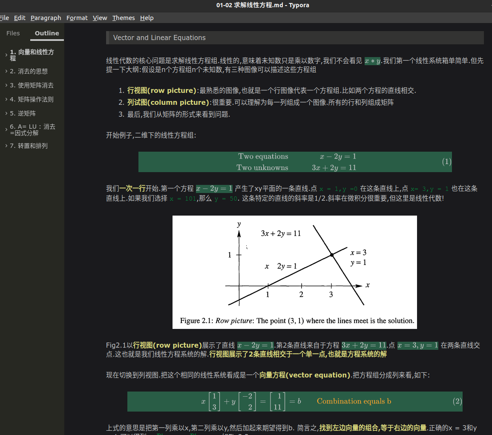
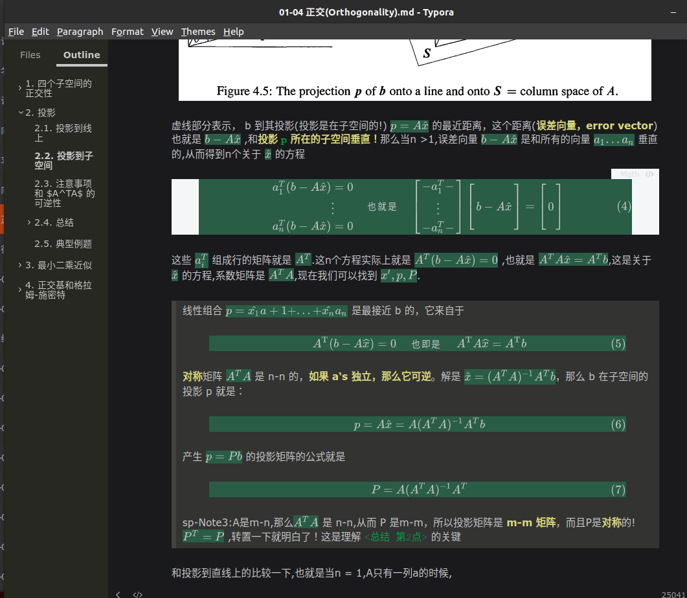
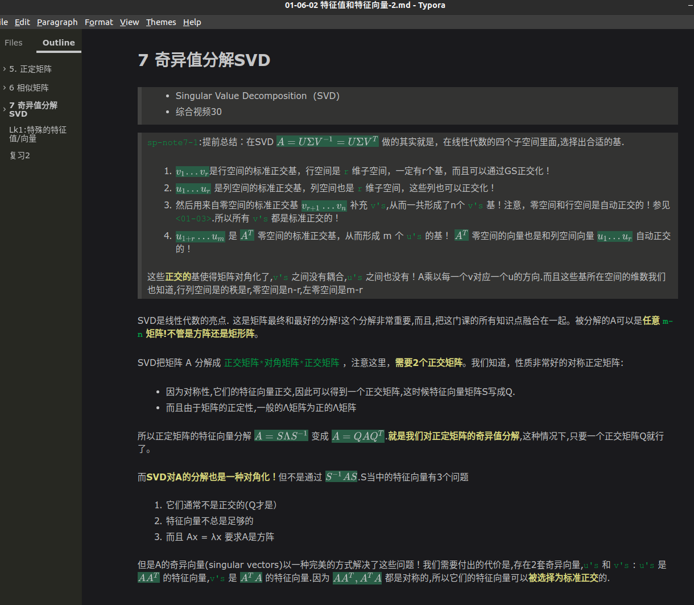

# IntroductionToLinearAlgebra-Chinese-note
MIT  Gilbert Strang教授的 <线性代数导论>（Introduction To Linear Algebra） 笔记，包含全中文书本内容和视频笔记

# 完成情况

1. 1-7章节全部完成，力求最清晰表达清楚概念
2. 第8章`<线代应用>`只记录部分，待补充
3. 第9-10章为记录，待补充

教授的视频在网易云可看到，其覆盖内容是书本的1-7章。视频笔记除了视频33、35，已全部根据其对应内容，综合进书本笔记里面。所以不会有单独的 **视频笔记** 文件，但在对应的章节，可以找到视频对应的内容。

建议本笔记和书本、视频一起观看，可以快速理清概念。

# 翻译说明

往上好像挺难找到第4版的中文版本，所以公开这份笔记大家学习，翻译有问题请及时指出，谢谢。另外，对于 **重要的概念，为避免产生歧义，都会在旁边标注处英文名**，参见下面笔记截图。

# 阅读软件

因为笔记的所有公式都是Mathjax渲染完成，推荐用 Typora 观看。手机可用 Markor。其他所有软件均可能数学公式显示不完整。

# 配套代码

书本有配套的Matlab代码，已经下载好在 `TeachingCode` 目录里面，遇到请自行查看.

# 笔记截图

---

---

# 致谢

看了教授的书，才发现Math is beautiful，感谢教授和这样的公开课。

